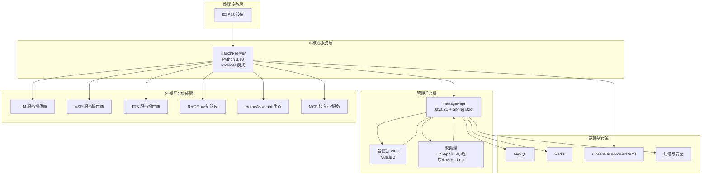
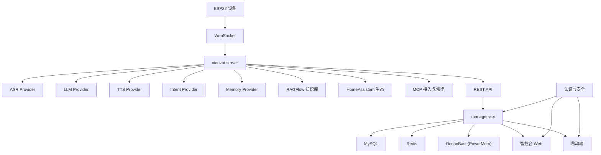
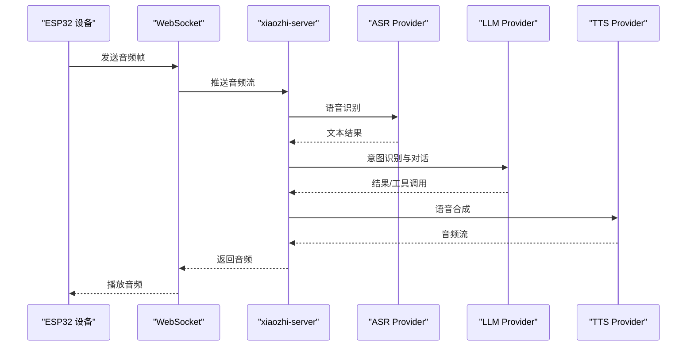
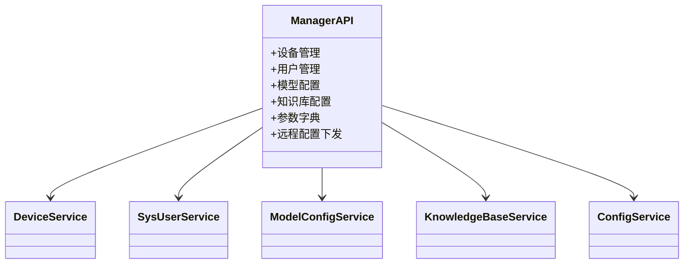
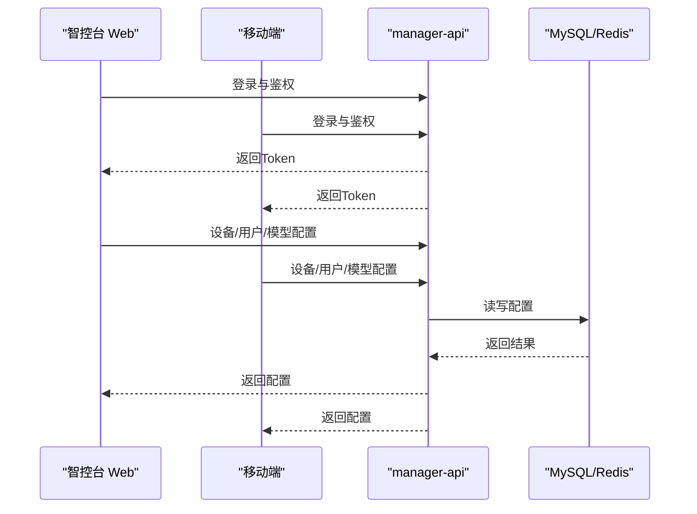
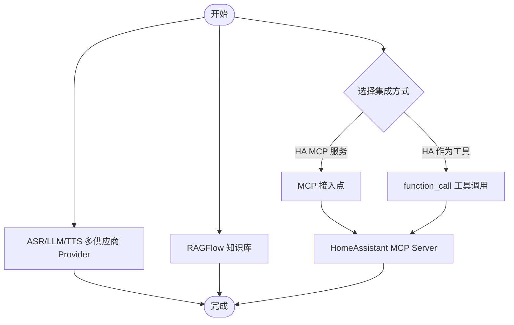
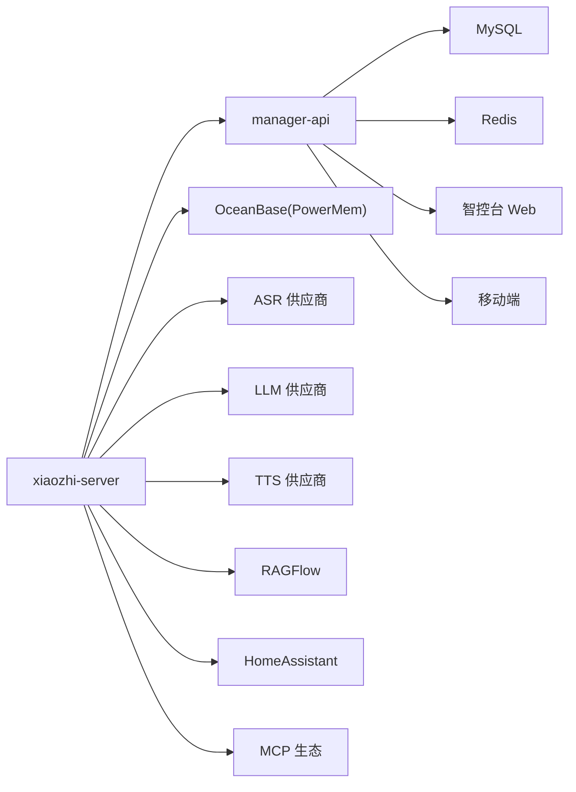

# 产品生态

<cite>
**本文引用的文件**
- [README.md](file://README.md)
- [README_en.md](file://README_en.md)
- [xiaozhi-esp32-server-architecture.html](file://docs/architecture/xiaozhi-esp32-server-architecture.html)
- [fish-speech-integration.md](file://docs/fish-speech-integration.md)
- [homeassistant-integration.md](file://docs/homeassistant-integration.md)
- [mcp-endpoint-integration.md](file://docs/mcp-endpoint-integration.md)
- [ragflow-integration.md](file://docs/ragflow-integration.md)
- [contributor_open_letter.md](file://docs/contributor_open_letter.md)
- [2026-05-07-ai-pet.md](file://docs/superpowers/plans/2026-05-07-ai-pet.md)
- [manager-api/README.md](file://main/manager-api/README.md)
- [manager-web/README.md](file://main/manager-web/README.md)
- [manager-mobile/README.md](file://main/manager-mobile/README.md)
</cite>

## 目录
1. [引言](#引言)
2. [项目结构](#项目结构)
3. [核心组件](#核心组件)
4. [架构总览](#架构总览)
5. [详细组件分析](#详细组件分析)
6. [依赖分析](#依赖分析)
7. [性能考量](#性能考量)
8. [故障排查指南](#故障排查指南)
9. [结论](#结论)
10. [附录](#附录)

## 引言
小智ESP32服务器项目是一个面向开源智能硬件的完整生态体系，围绕ESP32终端设备提供后端服务与管理平台，覆盖语音交互、多模态理解、意图识别、记忆系统、知识库、工具调用、设备控制与跨平台管理等能力。项目不仅提供统一的通信协议与标准，还通过开放的集成指南与插件化机制，与多家第三方平台（如HomeAssistant、RAGFlow、MCP生态等）形成互补与协同，构建“硬件+服务+生态”的闭环。

## 项目结构
小智生态由“终端设备层、AI核心服务层、管理后台层、外部平台集成层、安全与部署层”五大层次组成，配合前端Web与移动端应用，形成统一的控制台与多端管理体验。

图表来源
- [xiaozhi-esp32-server-architecture.html](file://docs/architecture/xiaozhi-esp32-server-architecture.html)

章节来源
- [README.md](file://README.md)
- [README_en.md](file://README_en.md)
- [xiaozhi-esp32-server-architecture.html](file://docs/architecture/xiaozhi-esp32-server-architecture.html)

## 核心组件
- xiaozhi-server（AI核心服务）
  - 基于Provider模式的模块化流水线，支持ASR、LLM、TTS、VAD、Intent、Memory等模块的灵活组合与多供应商接入。
  - 提供WebSocket实时语音交互、HTTP API与远程配置能力，支持流式与非流式配置。
- manager-api（管理后台）
  - 基于Spring Boot的REST服务，提供设备管理、用户管理、系统配置、模型与知识库配置等能力。
  - 集成MySQL、Redis、Liquibase迁移与Shiro认证，支持远程配置下发至xiaozhi-server。
- 智控台Web与移动端
  - Web端提供参数配置、设备管理、模型与知识库管理等；移动端支持H5/小程序/iOS/Android，实现跨端控制与管理。
- 外部平台集成
  - 支持HomeAssistant、RAGFlow、MCP生态、多家ASR/LLM/TTS厂商，通过统一的Provider与工具调用机制实现互操作。

章节来源
- [manager-api/README.md](file://main/manager-api/README.md)
- [manager-web/README.md](file://main/manager-web/README.md)
- [manager-mobile/README.md](file://main/manager-mobile/README.md)

## 架构总览
小智生态采用“终端设备—AI核心—管理后台—外部平台—数据与安全”的分层架构，强调：
- 协议与标准：统一通信协议与MCP接入点，保障设备与服务的互操作。
- 模块化与可插拔：Provider模式与工具调用机制，支持多供应商与多场景扩展。
- 安全与合规：OAuth2、服务端密钥、HTTPS、输入校验与参数化查询等安全措施。
- 可观测与可运维：日志、监控、配置中心与数据库迁移，支撑持续演进。

图表来源
- [xiaozhi-esp32-server-architecture.html](file://docs/architecture/xiaozhi-esp32-server-architecture.html)

## 详细组件分析

### 组件A：xiaozhi-server（AI核心服务）
- 职责与定位
  - 作为生态中枢，负责语音识别、大模型对话、语音合成、意图识别、记忆与知识库检索、工具调用与设备控制等。
  - 通过Provider模式抽象底层服务，支持多供应商切换与本地/云端混合部署。
- 技术特点
  - 模块化流水线：ASR→LLM→TTS/VAD/Intent/Memory，支持流式与非流式配置。
  - 远程配置：通过manager-api下发配置，无需重启即可生效。
  - MCP接入点：支持MCP工具扩展与设备指令下发。
- 发展方向
  - 持续优化Provider模式与工具调用机制，增强生态扩展能力与稳定性。

图表来源
- [xiaozhi-esp32-server-architecture.html](file://docs/architecture/xiaozhi-esp32-server-architecture.html)

章节来源
- [README.md](file://README.md)
- [README_en.md](file://README_en.md)

### 组件B：manager-api（管理后台）
- 职责与定位
  - 提供设备、用户、模型、知识库、参数等统一管理能力，支撑生态运营与运维。
- 技术特点
  - Spring Boot + MyBatis-Plus + Liquibase + Apache Shiro，支持远程配置下发与数据库迁移。
  - 与xiaozhi-server通过REST API与远程配置机制协同。
- 发展方向
  - 持续完善领域模型与业务能力，如AI宠物等新功能域的引入与扩展。

图表来源
- [manager-api/README.md](file://main/manager-api/README.md)

章节来源
- [manager-api/README.md](file://main/manager-api/README.md)

### 组件C：前端应用（智控台Web与移动端）
- 职责与定位
  - 提供统一的管理入口，支持Web与移动端跨端操作，实现设备与系统配置的可视化管理。
- 技术特点
  - Web端基于Vue.js 2，移动端基于Uni-app，支持H5/小程序/iOS/Android。
  - 通过REST API与manager-api交互，采用OAuth2 Bearer Token认证。
- 发展方向
  - 持续优化UI/UX与跨端一致性，增强移动端交互体验与功能覆盖。

图表来源
- [manager-web/README.md](file://main/manager-web/README.md)
- [manager-mobile/README.md](file://main/manager-mobile/README.md)

章节来源
- [manager-web/README.md](file://main/manager-web/README.md)
- [manager-mobile/README.md](file://main/manager-mobile/README.md)

### 组件D：外部平台集成（HomeAssistant、RAGFlow、MCP生态、ASR/LLM/TTS）
- HomeAssistant集成
  - 支持两种方式：HA作为工具调用（function_call）、HA MCP服务（推荐）。
  - 通过MCP接入点与HA的MCP Server实现双向通信。
- RAGFlow知识库
  - 支持知识库创建、文档上传、解析与召回测试，结合LLM实现检索增强生成。
- MCP接入点
  - 提供统一的MCP工具扩展入口，支持自定义工具（如计算器）接入与动态发现。
- ASR/LLM/TTS
  - 支持多家厂商与本地服务（如Fish Speech），通过Provider模式统一接入。

图表来源
- [homeassistant-integration.md](file://docs/homeassistant-integration.md)
- [ragflow-integration.md](file://docs/ragflow-integration.md)
- [mcp-endpoint-integration.md](file://docs/mcp-endpoint-integration.md)
- [fish-speech-integration.md](file://docs/fish-speech-integration.md)

章节来源
- [homeassistant-integration.md](file://docs/homeassistant-integration.md)
- [ragflow-integration.md](file://docs/ragflow-integration.md)
- [mcp-endpoint-integration.md](file://docs/mcp-endpoint-integration.md)
- [fish-speech-integration.md](file://docs/fish-speech-integration.md)

### 组件E：生态协作与标准制定
- 协作机制
  - 通过统一通信协议与MCP接入点，实现设备与服务的标准化对接。
  - Provider模式与工具调用机制，降低集成成本，提升扩展性。
- 互操作性保障
  - 统一的REST API与WebSocket接口，支持OAuth2与服务端密钥双重认证。
  - 配置中心与远程配置下发，确保生态内的一致性与可运维性。
- 生态伙伴
  - 十方融海：制定通信协议与多设备兼容方案。
  - 玄凤科技：贡献函数调用框架与MCP通信协议实现。
  - 汇远设计与西安勤人信息科技：提供视觉与设计支持。
  - 贡献者与社区：持续贡献与改进。

章节来源
- [README.md](file://README.md)
- [README_en.md](file://README_en.md)
- [contributor_open_letter.md](file://docs/contributor_open_letter.md)

## 依赖分析
- 组件耦合与内聚
  - xiaozhi-server与manager-api通过REST API与远程配置耦合，内聚于业务逻辑与配置管理。
  - 前端与后端通过REST API解耦，支持跨端与多端一致体验。
- 外部依赖
  - 多供应商AI服务（ASR/LLM/TTS）与知识库（RAGFlow）、HomeAssistant生态、MCP生态。
- 数据依赖
  - manager-api依赖MySQL与Redis，xiaozhi-server可选依赖OceanBase（PowerMem）。

图表来源
- [xiaozhi-esp32-server-architecture.html](file://docs/architecture/xiaozhi-esp32-server-architecture.html)

章节来源
- [README.md](file://README.md)
- [README_en.md](file://README_en.md)

## 性能考量
- 流式配置与响应优化
  - 项目支持流式配置，显著降低响应延迟，提升用户体验。
- 模块化与多供应商
  - 通过Provider模式与多供应商接入，可根据场景选择最优服务，平衡成本与性能。
- 数据与缓存
  - Redis缓存与MySQL持久化，结合Liquibase迁移，保障数据一致性与可维护性。
- 部署与资源
  - 提供最小化与全模块部署方案，满足不同资源配置与并发需求。

章节来源
- [README.md](file://README.md)
- [README_en.md](file://README_en.md)

## 故障排查指南
- 常见问题与定位
  - 配置问题：检查远程配置下发与Provider配置是否正确。
  - 网络问题：确认WebSocket与REST API连通性，验证端口与防火墙设置。
  - 认证问题：检查OAuth2 Token与服务端密钥有效性。
  - 外部服务问题：验证ASR/LLM/TTS/RAGFlow等外部服务可用性与密钥配置。
- 工具与测试
  - 使用音频交互测试工具与性能测试工具，快速定位问题。
- 日志与监控
  - 关注xiaozhi-server与manager-api日志，结合数据库与缓存状态进行排查。

章节来源
- [README.md](file://README.md)
- [README_en.md](file://README_en.md)

## 结论
小智ESP32服务器项目通过统一协议、模块化架构与开放生态，构建了“硬件+服务+平台”的完整闭环。依托Provider模式与MCP接入点，项目与HomeAssistant、RAGFlow、多家AI服务厂商形成深度互补，既保证了互操作性与可扩展性，也为用户提供了低成本、可定制的智能语音助手解决方案。未来，项目将持续完善生态协作机制、标准制定与互操作性保障，推动AI宠物等新功能域落地，助力社区共建与可持续发展。

## 附录
- 生态愿景与目标
  - 民用低成本贾维斯解决方案，智能联动周边硬件，提供情感陪伴与智能交互体验。
- 路线图与计划
  - AI宠物领域计划：新增宠物出生、查询、编辑等功能，复用LLM与农历计算库，完善领域模型与工具链。
- 贡献与社区
  - 欢迎开发者参与贡献，通过PR与社区协作推进功能迭代与生态完善。

章节来源
- [contributor_open_letter.md](file://docs/contributor_open_letter.md)
- [2026-05-07-ai-pet.md](file://docs/superpowers/plans/2026-05-07-ai-pet.md)