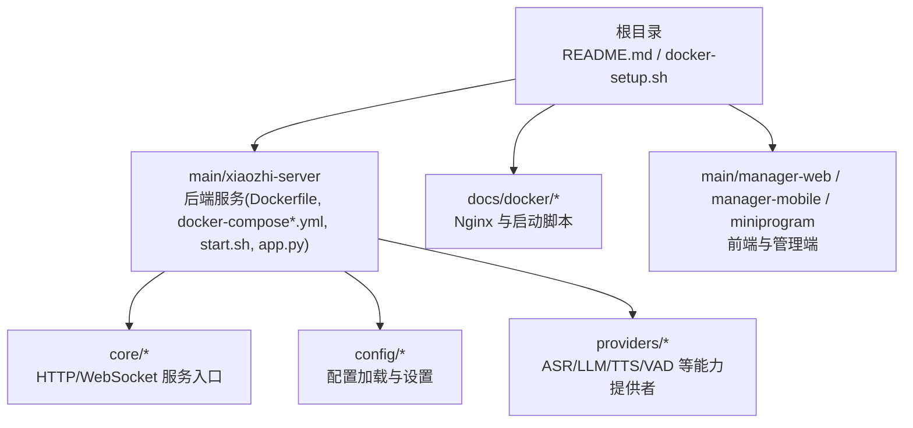
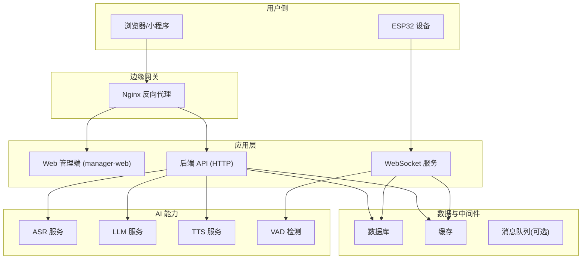
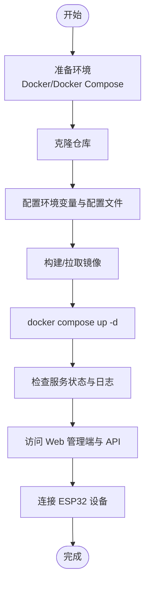
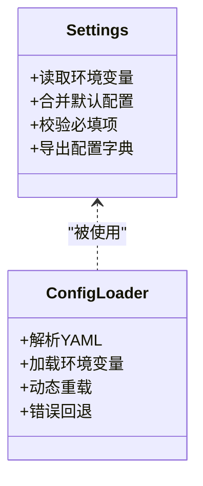
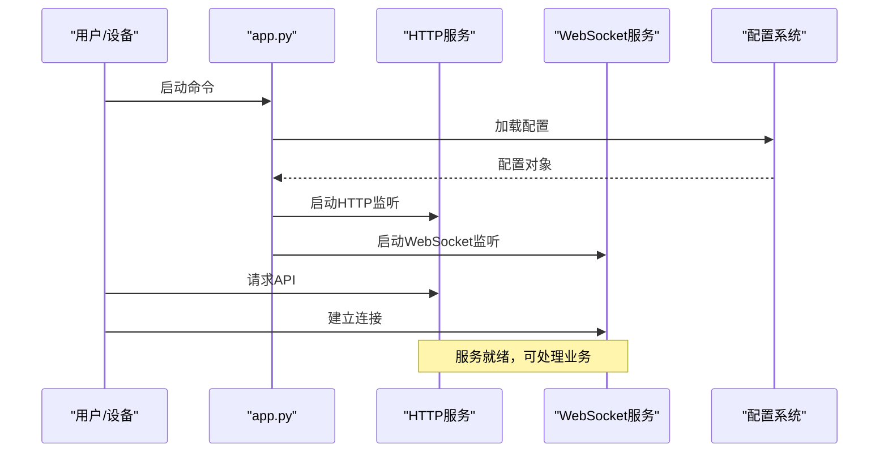
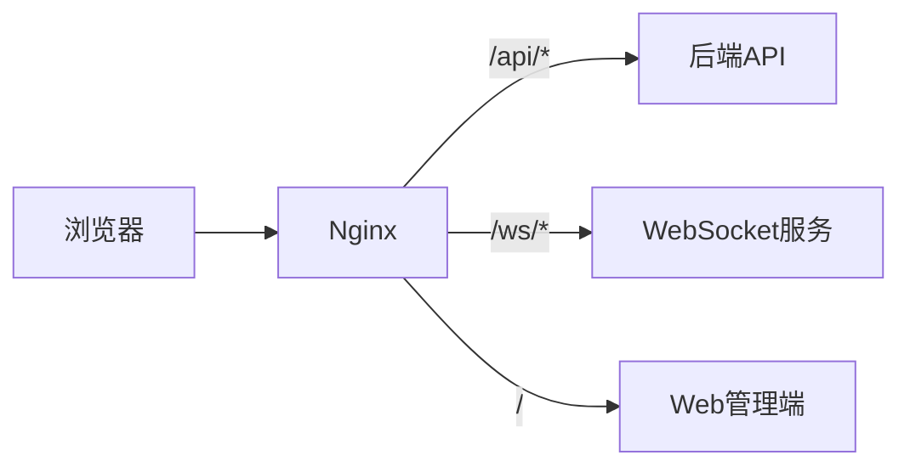
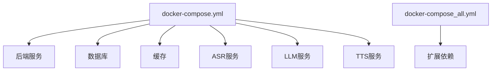

# 快速开始

<cite>
**本文引用的文件**   
- [README.md](file://README.md)
- [docker-compose.yml](file://main/xiaozhi-server/docker-compose.yml)
- [docker-compose_all.yml](file://main/xiaozhi-server/docker-compose_all.yml)
- [Dockerfile](file://main/xiaozhi-server/Dockerfile)
- [start.sh](file://main/xiaozhi-server/start.sh)
- [app.py](file://main/xiaozhi-server/app.py)
- [config_loader.py](file://main/xiaozhi-server/config/config_loader.py)
- [settings.py](file://main/xiaozhi-server/config/settings.py)
- [http_server.py](file://main/xiaozhi-server/core/http_server.py)
- [websocket_server.py](file://main/xiaozhi-server/core/websocket_server.py)
- [docker-setup.sh](file://docker-setup.sh)
- [Deployment.md](file://docs/Deployment.md)
- [docker-build.md](file://docs/docker-build.md)
- [nginx.conf](file://docs/docker/nginx.conf)
- [start.sh](file://docs/docker/start.sh)
</cite>

## 目录
1. [简介](#简介)
2. [项目结构](#项目结构)
3. [核心组件](#核心组件)
4. [架构总览](#架构总览)
5. [详细组件分析](#详细组件分析)
6. [依赖关系分析](#依赖关系分析)
7. [性能注意事项](#性能注意事项)
8. [故障排除指南](#故障排除指南)
9. [结论](#结论)
10. [附录](#附录)

## 简介
本指南面向首次接触 xiaozhi-esp32-server 的用户，提供从零开始的完整部署流程。你将学会如何准备环境（Docker、Docker Compose）、克隆仓库、配置环境变量与配置文件、一键启动所有服务，并通过简单测试验证安装是否成功。文档同时覆盖常见部署场景的配置示例、环境变量说明以及常见问题排查方法，帮助你在最短时间内运行并体验核心功能。

## 项目结构
xiaozhi-esp32-server 采用多容器编排方式，核心后端服务位于 main/xiaozhi-server，配套的前端管理界面、小程序等位于 main 目录下其他子模块。Docker 相关脚本与镜像构建定义集中在根目录与 main/xiaozhi-server 中。

图表来源
- [README.md:1-50](file://README.md#L1-L50)
- [Dockerfile:1-40](file://main/xiaozhi-server/Dockerfile#L1-L40)
- [docker-compose.yml:1-60](file://main/xiaozhi-server/docker-compose.yml#L1-L60)
- [start.sh:1-30](file://main/xiaozhi-server/start.sh#L1-L30)
- [app.py:1-40](file://main/xiaozhi-server/app.py#L1-L40)
- [http_server.py:1-40](file://main/xiaozhi-server/core/http_server.py#L1-L40)
- [websocket_server.py:1-40](file://main/xiaozhi-server/core/websocket_server.py#L1-L40)
- [config_loader.py:1-40](file://main/xiaozhi-server/config/config_loader.py#L1-L40)
- [settings.py:1-40](file://main/xiaozhi-server/config/settings.py#L1-L40)
- [nginx.conf:1-40](file://docs/docker/nginx.conf#L1-L40)
- [start.sh:1-30](file://docs/docker/start.sh#L1-L30)

章节来源
- [README.md:1-100](file://README.md#L1-L100)
- [docker-compose.yml:1-120](file://main/xiaozhi-server/docker-compose.yml#L1-L120)
- [docker-compose_all.yml:1-120](file://main/xiaozhi-server/docker-compose_all.yml#L1-L120)
- [Dockerfile:1-80](file://main/xiaozhi-server/Dockerfile#L1-L80)
- [start.sh:1-60](file://main/xiaozhi-server/start.sh#L1-L60)
- [app.py:1-120](file://main/xiaozhi-server/app.py#L1-L120)
- [http_server.py:1-120](file://main/xiaozhi-server/core/http_server.py#L1-L120)
- [websocket_server.py:1-120](file://main/xiaozhi-server/core/websocket_server.py#L1-L120)
- [config_loader.py:1-120](file://main/xiaozhi-server/config/config_loader.py#L1-L120)
- [settings.py:1-120](file://main/xiaozhi-server/config/settings.py#L1-L120)
- [nginx.conf:1-120](file://docs/docker/nginx.conf#L1-L120)
- [start.sh:1-60](file://docs/docker/start.sh#L1-L60)

## 核心组件
- 后端服务：Python 应用通过 app.py 启动，内部包含 HTTP 服务器与 WebSocket 服务器，分别处理 REST API 与实时音视频信令。
- 配置系统：通过 config_loader.py 与 settings.py 统一加载 YAML/环境变量，支持运行时覆盖。
- 能力提供者：providers 下包含 ASR、LLM、TTS、VAD、Memory、Tools 等插件化实现，可按需启用。
- 容器编排：使用 docker-compose 或 docker-compose_all 一键拉起全部依赖服务（数据库、缓存、语音识别等）。
- 前端与管理端：manager-web、manager-mobile、miniprogram 提供 Web 管理界面与小程序客户端。

章节来源
- [app.py:1-120](file://main/xiaozhi-server/app.py#L1-L120)
- [http_server.py:1-120](file://main/xiaozhi-server/core/http_server.py#L1-L120)
- [websocket_server.py:1-120](file://main/xiaozhi-server/core/websocket_server.py#L1-L120)
- [config_loader.py:1-120](file://main/xiaozhi-server/config/config_loader.py#L1-L120)
- [settings.py:1-120](file://main/xiaozhi-server/config/settings.py#L1-L120)

## 架构总览
下图展示了基于 Docker Compose 的一键部署架构：用户通过 Nginx 反向代理访问 Web 管理端与 API；后端服务通过 WebSocket 与设备通信；各能力提供者按需调用外部服务或本地模型。

图表来源
- [docker-compose.yml:1-120](file://main/xiaozhi-server/docker-compose.yml#L1-L120)
- [docker-compose_all.yml:1-120](file://main/xiaozhi-server/docker-compose_all.yml#L1-L120)
- [nginx.conf:1-120](file://docs/docker/nginx.conf#L1-L120)
- [http_server.py:1-120](file://main/xiaozhi-server/core/http_server.py#L1-L120)
- [websocket_server.py:1-120](file://main/xiaozhi-server/core/websocket_server.py#L1-L120)

## 详细组件分析

### 一键部署流程（Docker + Docker Compose）
- 环境准备
  - 安装 Docker 与 Docker Compose（确保版本满足要求）。
  - 准备网络端口：如 80/443（Nginx）、后端 API 端口、WebSocket 端口等。
- 克隆仓库
  - 从 GitHub 拉取源码到本地。
- 配置环境变量与配置文件
  - 在 main/xiaozhi-server 目录下创建或编辑 .env 与配置文件（YAML），参考“环境变量与常用配置”小节。
- 启动服务
  - 使用 docker-compose 或 docker-compose_all 拉起全部依赖服务。
  - 首次启动会拉取镜像并初始化数据库表结构。
- 验证安装
  - 访问 Web 管理端地址，登录并查看设备列表。
  - 通过 WebSocket 接口或小程序连接设备进行语音通话测试。

章节来源
- [docker-compose.yml:1-120](file://main/xiaozhi-server/docker-compose.yml#L1-L120)
- [docker-compose_all.yml:1-120](file://main/xiaozhi-server/docker-compose_all.yml#L1-L120)
- [Dockerfile:1-80](file://main/xiaozhi-server/Dockerfile#L1-L80)
- [start.sh:1-60](file://main/xiaozhi-server/start.sh#L1-L60)
- [docker-setup.sh:1-120](file://docker-setup.sh#L1-L120)
- [Deployment.md:1-120](file://docs/Deployment.md#L1-L120)

### 配置系统与变量
- 配置加载顺序
  - 默认配置文件（YAML）→ 环境变量覆盖 → 运行时参数。
- 关键配置项
  - 服务端口、数据库连接、缓存连接、第三方服务密钥（ASR/LLM/TTS）、日志级别等。
- 常用操作
  - 修改 .env 后重启对应服务；更新 YAML 后重新加载配置。

图表来源
- [settings.py:1-120](file://main/xiaozhi-server/config/settings.py#L1-L120)
- [config_loader.py:1-120](file://main/xiaozhi-server/config/config_loader.py#L1-L120)

章节来源
- [settings.py:1-120](file://main/xiaozhi-server/config/settings.py#L1-L120)
- [config_loader.py:1-120](file://main/xiaozhi-server/config/config_loader.py#L1-L120)

### 服务启动与进程模型
- 启动入口
  - app.py 作为主进程，初始化配置、注册路由、启动 HTTP 与 WebSocket 服务。
- HTTP 服务
  - 暴露 REST API，供 Web 管理端与小程序调用。
- WebSocket 服务
  - 处理设备连接、音频流控制、指令下发与状态上报。

图表来源
- [app.py:1-120](file://main/xiaozhi-server/app.py#L1-L120)
- [http_server.py:1-120](file://main/xiaozhi-server/core/http_server.py#L1-L120)
- [websocket_server.py:1-120](file://main/xiaozhi-server/core/websocket_server.py#L1-L120)
- [config_loader.py:1-120](file://main/xiaozhi-server/config/config_loader.py#L1-L120)
- [settings.py:1-120](file://main/xiaozhi-server/config/settings.py#L1-L120)

章节来源
- [app.py:1-120](file://main/xiaozhi-server/app.py#L1-L120)
- [http_server.py:1-120](file://main/xiaozhi-server/core/http_server.py#L1-L120)
- [websocket_server.py:1-120](file://main/xiaozhi-server/core/websocket_server.py#L1-L120)

### 反向代理与前端
- Nginx 负责静态资源托管与反向代理，将 Web 管理端与 API 请求分发至对应服务。
- 前端管理端（manager-web）用于设备管理、模型配置、知识库管理等。
- 小程序（miniprogram）用于移动端交互与语音通话。

图表来源
- [nginx.conf:1-120](file://docs/docker/nginx.conf#L1-L120)
- [start.sh:1-60](file://docs/docker/start.sh#L1-L60)

章节来源
- [nginx.conf:1-120](file://docs/docker/nginx.conf#L1-L120)
- [start.sh:1-60](file://docs/docker/start.sh#L1-L60)

## 依赖关系分析
- 容器编排依赖
  - docker-compose.yml 定义了后端服务、数据库、缓存、语音服务等容器及其网络与卷挂载。
  - docker-compose_all.yml 扩展了更多可选依赖（如额外 AI 服务）。
- 运行时依赖
  - Python 包依赖由 requirements.txt 管理（若存在），镜像构建时安装。
  - 外部服务（ASR/LLM/TTS）可通过环境变量配置接入。

图表来源
- [docker-compose.yml:1-120](file://main/xiaozhi-server/docker-compose.yml#L1-L120)
- [docker-compose_all.yml:1-120](file://main/xiaozhi-server/docker-compose_all.yml#L1-L120)

章节来源
- [docker-compose.yml:1-120](file://main/xiaozhi-server/docker-compose.yml#L1-L120)
- [docker-compose_all.yml:1-120](file://main/xiaozhi-server/docker-compose_all.yml#L1-L120)

## 性能注意事项
- 合理分配 CPU/内存：为 ASR/LLM/TTS 等服务预留足够资源，避免争用。
- 连接池与线程池：调整数据库与缓存连接池大小，匹配并发量。
- 日志级别：生产环境降低日志级别以减少 I/O 开销。
- 静态资源优化：启用 Nginx 缓存与压缩，提升前端加载速度。
- 监控与指标：开启健康检查与指标采集，便于容量规划与问题定位。

## 故障排除指南
- 服务无法启动
  - 检查端口占用与防火墙规则；查看容器日志定位错误。
  - 确认 .env 与 YAML 配置正确，必填项齐全。
- 数据库连接失败
  - 核对数据库地址、用户名、密码；检查网络连通性。
- WebSocket 连接失败
  - 检查 Nginx 反向代理配置与证书；确认 WebSocket 路径与协议。
- 第三方服务不可用
  - 校验密钥与域名；检查网络出口与白名单。
- 日志与调试
  - 提高日志级别，收集关键链路日志；使用 docker logs 与容器内工具排查。

章节来源
- [Deployment.md:1-120](file://docs/Deployment.md#L1-L120)
- [docker-setup.sh:1-120](file://docker-setup.sh#L1-L120)
- [nginx.conf:1-120](file://docs/docker/nginx.conf#L1-L120)

## 结论
通过本指南，你可以快速完成 xiaozhi-esp32-server 的环境准备、配置与一键部署，并在最短时间内体验核心功能。建议在生产环境中结合监控、备份与安全加固策略，持续优化性能与稳定性。

## 附录

### 环境变量与常用配置快速参考
- 基础服务
  - 服务端口：HTTP、WebSocket、Nginx 端口映射
  - 日志级别：DEBUG/INFO/WARNING/ERROR
- 数据与缓存
  - 数据库连接：主机、端口、用户名、密码、库名
  - 缓存连接：主机、端口、认证信息
- 第三方能力
  - ASR/LLM/TTS 的 API Key、域名、超时与重试策略
- 安全与权限
  - JWT 密钥、管理员账号、HTTPS 证书路径
- 常用操作
  - 修改 .env 后重启服务；更新 YAML 后重载配置；查看容器日志定位问题

章节来源
- [settings.py:1-120](file://main/xiaozhi-server/config/settings.py#L1-L120)
- [config_loader.py:1-120](file://main/xiaozhi-server/config/config_loader.py#L1-L120)
- [docker-compose.yml:1-120](file://main/xiaozhi-server/docker-compose.yml#L1-L120)
- [docker-compose_all.yml:1-120](file://main/xiaozhi-server/docker-compose_all.yml#L1-L120)

### 验证安装与基本使用方法
- 访问 Web 管理端
  - 打开浏览器输入管理端地址，登录并查看设备列表。
- 连接设备
  - 在小程序或设备端配置服务器地址与鉴权信息，建立 WebSocket 连接。
- 语音通话测试
  - 发起一次语音对话，观察 ASR/LLM/TTS 链路是否正常返回结果。
- 健康检查
  - 调用 API 健康检查接口，确认服务状态正常。

章节来源
- [http_server.py:1-120](file://main/xiaozhi-server/core/http_server.py#L1-L120)
- [websocket_server.py:1-120](file://main/xiaozhi-server/core/websocket_server.py#L1-L120)
- [README.md:1-120](file://README.md#L1-L120)