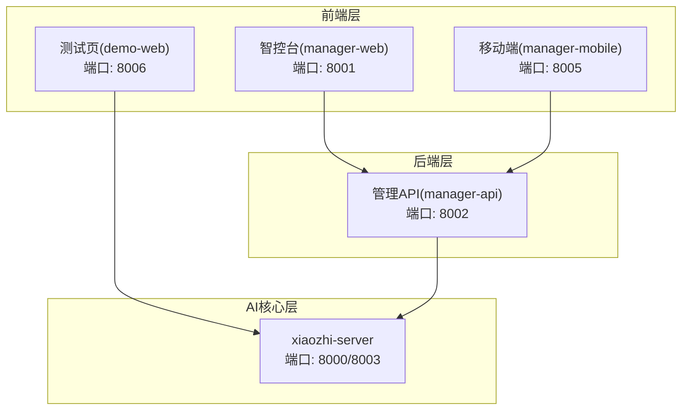
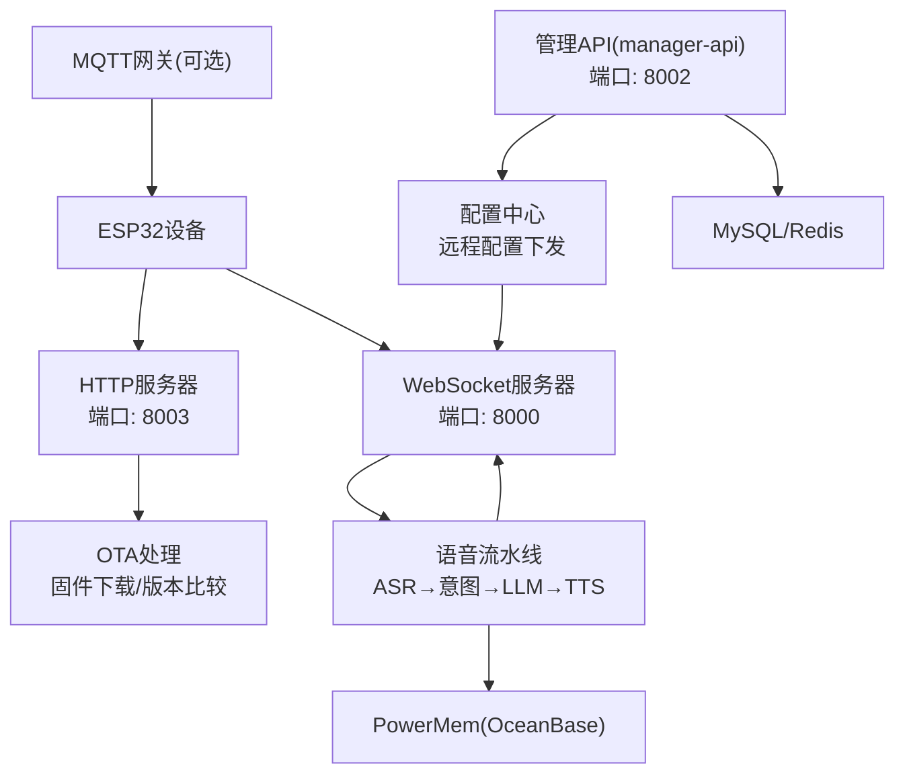
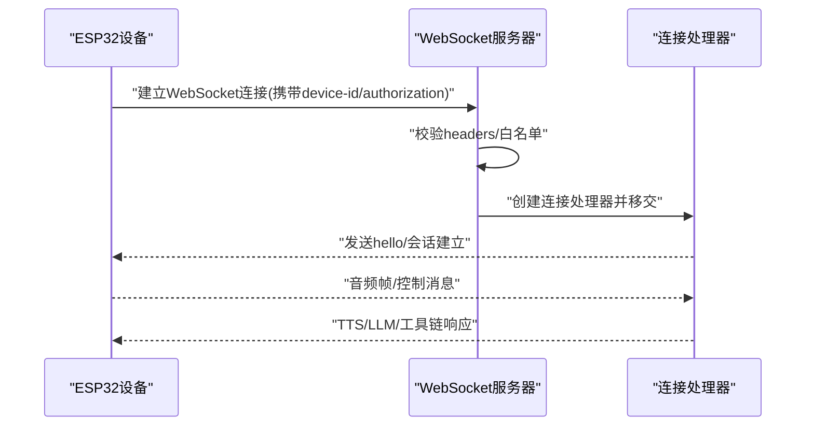
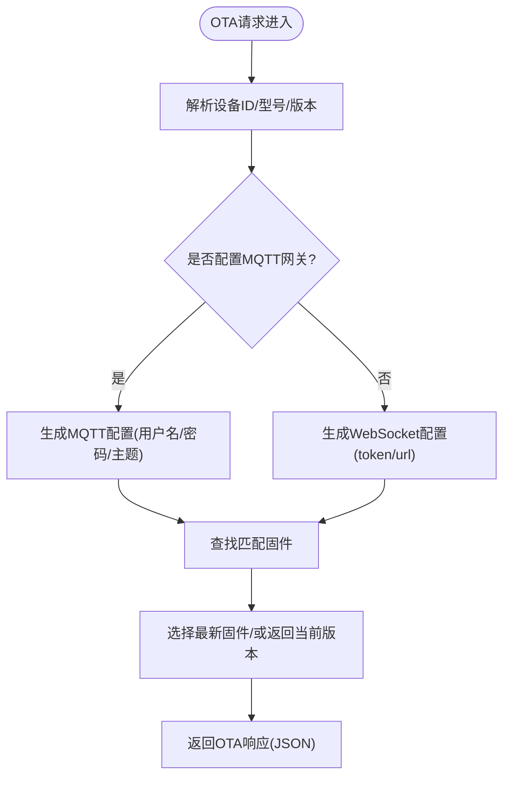
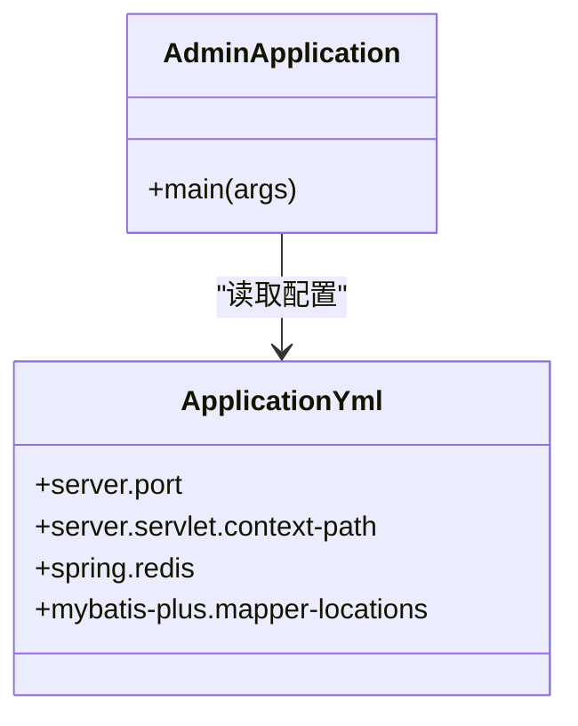
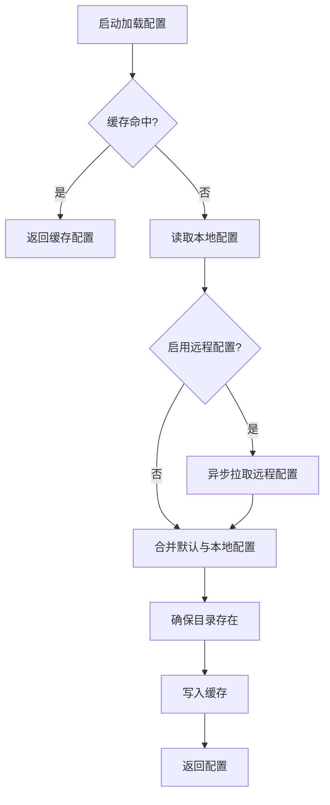
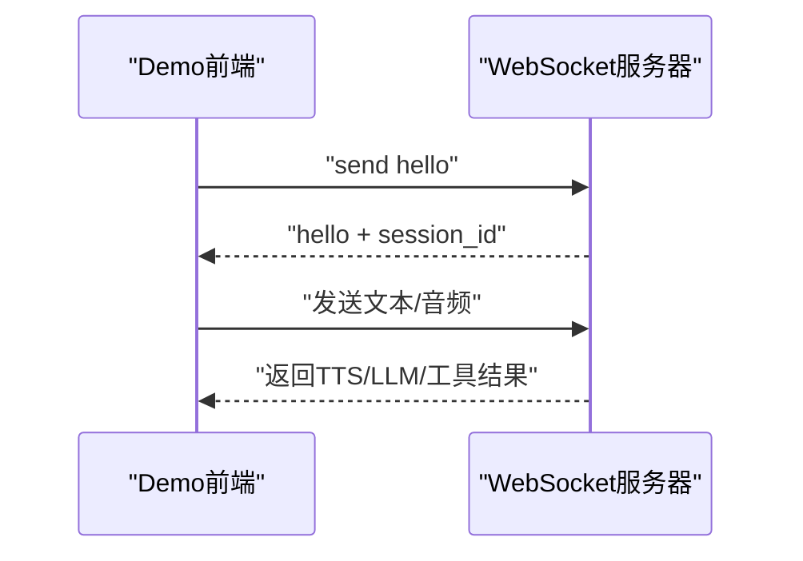
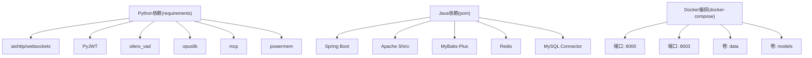

# 技术架构总览

<cite>
**本文引用的文件**
- [main/xiaozhi-server/app.py](file://main/xiaozhi-server/app.py)
- [main/xiaozhi-server/core/websocket_server.py](file://main/xiaozhi-server/core/websocket_server.py)
- [main/xiaozhi-server/core/http_server.py](file://main/xiaozhi-server/core/http_server.py)
- [main/xiaozhi-server/core/api/ota_handler.py](file://main/xiaozhi-server/core/api/ota_handler.py)
- [main/xiaozhi-server/config/config_loader.py](file://main/xiaozhi-server/config/config_loader.py)
- [main/xiaozhi-server/config/settings.py](file://main/xiaozhi-server/config/settings.py)
- [main/xiaozhi-server/requirements.txt](file://main/xiaozhi-server/requirements.txt)
- [main/xiaozhi-server/docker-compose.yml](file://main/xiaozhi-server/docker-compose.yml)
- [main/manager-api/src/main/java/xiaozhi/AdminApplication.java](file://main/manager-api/src/main/java/xiaozhi/AdminApplication.java)
- [main/manager-api/src/main/resources/application.yml](file://main/manager-api/src/main/resources/application.yml)
- [main/manager-api/pom.xml](file://main/manager-api/pom.xml)
- [main/demo-web/js/core/network/websocket.js](file://main/demo-web/js/core/network/websocket.js)
- [docs/architecture/xiaozhi-esp32-server-architecture.html](file://docs/architecture/xiaozhi-esp32-server-architecture.html)
</cite>

## 目录
1. [简介](#简介)
2. [项目结构](#项目结构)
3. [核心组件](#核心组件)
4. [架构总览](#架构总览)
5. [详细组件分析](#详细组件分析)
6. [依赖关系分析](#依赖关系分析)
7. [性能与可扩展性](#性能与可扩展性)
8. [故障排查指南](#故障排查指南)
9. [结论](#结论)
10. [附录](#附录)

## 简介
本项目围绕“小智ESP32服务器”构建，采用三层架构（前端Vue、后端Java、AI核心Python）协同工作，结合WebSocket、HTTP、MQTT+UDP等多种协议，形成事件驱动与微服务相结合的实时语音交互系统。系统通过Provider模式抽象ASR/LLM/TTS等能力，支持多供应商接入与动态切换；通过远程配置中心实现运行时配置热更新；通过可视化管理后台实现设备与用户管理。

## 项目结构
项目采用多模块分层组织：
- 前端层：manager-web（Vue.js）、manager-mobile（Uni-app）、demo-web（测试页面）
- 后端层：manager-api（Spring Boot Java）
- AI核心层：xiaozhi-server（Python，基于asyncio与aiohttp/websockets）
- 文档与部署：架构图、Docker编排、依赖清单

图表来源
- [docs/architecture/xiaozhi-esp32-server-architecture.html:139-427](file://docs/architecture/xiaozhi-esp32-server-architecture.html#L139-L427)
- [main/manager-api/src/main/resources/application.yml:1-66](file://main/manager-api/src/main/resources/application.yml#L1-L66)

章节来源
- [docs/architecture/xiaozhi-esp32-server-architecture.html:139-427](file://docs/architecture/xiaozhi-esp32-server-architecture.html#L139-L427)
- [main/manager-api/src/main/resources/application.yml:1-66](file://main/manager-api/src/main/resources/application.yml#L1-L66)

## 核心组件
- WebSocket服务器：负责与ESP32设备建立实时双向通信，承载语音流与控制消息。
- HTTP服务器：提供OTA固件下载与视觉分析接口，作为设备侧与Web端的补充通道。
- 管理API服务：提供REST接口，支撑设备注册、配置下发、用户认证与系统参数管理。
- 配置管理服务：统一管理本地、文件与远程三层配置，支持运行时热更新。
- 前端Demo：演示WebSocket握手、音频播放与MCP工具链交互流程。

章节来源
- [main/xiaozhi-server/app.py:46-160](file://main/xiaozhi-server/app.py#L46-L160)
- [main/xiaozhi-server/core/websocket_server.py:42-228](file://main/xiaozhi-server/core/websocket_server.py#L42-L228)
- [main/xiaozhi-server/core/http_server.py:10-93](file://main/xiaozhi-server/core/http_server.py#L10-L93)
- [main/xiaozhi-server/core/api/ota_handler.py:46-200](file://main/xiaozhi-server/core/api/ota_handler.py#L46-L200)
- [main/xiaozhi-server/config/config_loader.py:27-94](file://main/xiaozhi-server/config/config_loader.py#L27-L94)

## 架构总览
系统采用“前端-后端-核心”的分层架构，配合Provider模式的AI能力抽象与远程配置中心，实现高内聚低耦合的服务组合。WebSocket作为主要长连接通道，HTTP用于一次性接口（OTA与视觉分析），MQTT+UDP作为可选扩展通道用于设备侧连接。

图表来源
- [docs/architecture/xiaozhi-esp32-server-architecture.html:165-196](file://docs/architecture/xiaozhi-esp32-server-architecture.html#L165-L196)
- [main/xiaozhi-server/core/api/ota_handler.py:234-311](file://main/xiaozhi-server/core/api/ota_handler.py#L234-L311)
- [main/xiaozhi-server/core/websocket_server.py:71-80](file://main/xiaozhi-server/core/websocket_server.py#L71-L80)

## 详细组件分析

### WebSocket服务器
- 功能职责：监听端口、处理握手、鉴权、创建连接处理器、承载语音与控制消息。
- 鉴权策略：支持白名单直通与JWT令牌校验；支持过期时间控制。
- 配置热更新：支持异步拉取远程配置并重建模块实例。
- 日志过滤：抑制无效握手噪声，提升可观测性。

图表来源
- [main/xiaozhi-server/core/websocket_server.py:81-145](file://main/xiaozhi-server/core/websocket_server.py#L81-L145)
- [main/demo-web/js/core/network/websocket.js:23-71](file://main/demo-web/js/core/network/websocket.js#L23-L71)

章节来源
- [main/xiaozhi-server/core/websocket_server.py:42-228](file://main/xiaozhi-server/core/websocket_server.py#L42-L228)

### HTTP服务器与OTA处理
- 功能职责：提供OTA固件查询与下载、视觉分析接口；根据配置选择下发WebSocket或MQTT网关。
- OTA流程：解析设备型号/版本，比对本地固件缓存，生成下载URL或网关配置。
- 视觉分析：提供HTTP接口供Web端调用。

图表来源
- [main/xiaozhi-server/core/api/ota_handler.py:143-200](file://main/xiaozhi-server/core/api/ota_handler.py#L143-L200)
- [main/xiaozhi-server/core/api/ota_handler.py:234-311](file://main/xiaozhi-server/core/api/ota_handler.py#L234-L311)

章节来源
- [main/xiaozhi-server/core/http_server.py:10-93](file://main/xiaozhi-server/core/http_server.py#L10-L93)
- [main/xiaozhi-server/core/api/ota_handler.py:46-200](file://main/xiaozhi-server/core/api/ota_handler.py#L46-L200)

### 管理API服务（Java）
- 技术栈：Spring Boot 3.4.3 + MyBatis-Plus + MySQL + Redis + Apache Shiro。
- 端口与上下文：端口8002，上下文路径/xiaozhi。
- 能力范围：设备管理、用户认证、系统参数、配置下发、缓存与会话管理。

图表来源
- [main/manager-api/src/main/java/xiaozhi/AdminApplication.java:1-13](file://main/manager-api/src/main/java/xiaozhi/AdminApplication.java#L1-L13)
- [main/manager-api/src/main/resources/application.yml:1-66](file://main/manager-api/src/main/resources/application.yml#L1-L66)

章节来源
- [main/manager-api/src/main/java/xiaozhi/AdminApplication.java:1-13](file://main/manager-api/src/main/java/xiaozhi/AdminApplication.java#L1-L13)
- [main/manager-api/src/main/resources/application.yml:1-66](file://main/manager-api/src/main/resources/application.yml#L1-L66)
- [main/manager-api/pom.xml:1-291](file://main/manager-api/pom.xml#L1-L291)

### 配置管理服务（Python）
- 三层配置：基础配置(config.yaml)、本地覆盖(data/.config.yaml)、远程配置(Manager-API)。
- 合并与缓存：递归合并，本地优先；支持运行时缓存与热更新。
- 远程配置：异步拉取，覆盖部分server字段，保留本地端口与鉴权开关。

图表来源
- [main/xiaozhi-server/config/config_loader.py:27-94](file://main/xiaozhi-server/config/config_loader.py#L27-L94)
- [main/xiaozhi-server/config/settings.py:9-34](file://main/xiaozhi-server/config/settings.py#L9-L34)

章节来源
- [main/xiaozhi-server/config/config_loader.py:27-94](file://main/xiaozhi-server/config/config_loader.py#L27-L94)
- [main/xiaozhi-server/config/settings.py:9-34](file://main/xiaozhi-server/config/settings.py#L9-L34)

### 前端Demo（WebSocket交互）
- 握手流程：发送hello消息，等待服务器会话建立。
- 消息处理：文本消息（STT/LLM）、音频二进制（TTS）、MCP工具链。
- Live2D联动：根据TTS与表情符号触发动画。

图表来源
- [main/demo-web/js/core/network/websocket.js:23-71](file://main/demo-web/js/core/network/websocket.js#L23-L71)
- [main/demo-web/js/core/network/websocket.js:475-489](file://main/demo-web/js/core/network/websocket.js#L475-L489)

章节来源
- [main/demo-web/js/core/network/websocket.js:1-583](file://main/demo-web/js/core/network/websocket.js#L1-L583)

## 依赖关系分析
- Python依赖：aiohttp/websockets、PyJWT、silero_vad、opuslib、mcp、powermem等。
- Java依赖：Spring Boot Starter、Shiro、MyBatis-Plus、Redis、MySQL Connector等。
- Docker编排：映射WebSocket与HTTP端口，挂载配置与模型文件。

图表来源
- [main/xiaozhi-server/requirements.txt:1-43](file://main/xiaozhi-server/requirements.txt#L1-L43)
- [main/manager-api/pom.xml:38-248](file://main/manager-api/pom.xml#L38-L248)
- [main/xiaozhi-server/docker-compose.yml:1-22](file://main/xiaozhi-server/docker-compose.yml#L1-L22)

章节来源
- [main/xiaozhi-server/requirements.txt:1-43](file://main/xiaozhi-server/requirements.txt#L1-L43)
- [main/manager-api/pom.xml:1-291](file://main/manager-api/pom.xml#L1-L291)
- [main/xiaozhi-server/docker-compose.yml:1-22](file://main/xiaozhi-server/docker-compose.yml#L1-L22)

## 性能与可扩展性
- 异步并发：Python使用asyncio/aiohttp/websockets，降低I/O阻塞，提升吞吐。
- 模块化Provider：ASR/LLM/TTS/VAD/Intent/Memory通过工厂模式实例化，便于替换与水平扩展。
- 远程配置：无需重启即可热更新，缩短迭代周期。
- 存储扩展：PowerMem/OceanBase提供向量与知识图谱能力，支持大规模记忆检索。
- 部署弹性：Docker Compose支持最小化与全模块部署，便于横向扩展。

## 故障排查指南
- WebSocket连接失败
  - 检查设备ID与Authorization头是否正确传递。
  - 查看无效握手噪声日志是否被过滤。
  - 确认端口与IP映射（8000）。
- OTA下发异常
  - 确认设备型号/版本解析是否正确。
  - 检查固件缓存与命名规则（model_version.bin）。
  - 若配置MQTT网关，核对签名密钥与用户名编码。
- 鉴权问题
  - 确认server.auth_key来源顺序（配置文件→Manager-API secret→自动生成）。
  - 白名单设备无需令牌，否则需校验JWT。
- 前端Demo
  - 确认测试页端口与连接URL设置。
  - 检查二进制音频队列与Live2D联动状态。

章节来源
- [main/xiaozhi-server/core/websocket_server.py:206-228](file://main/xiaozhi-server/core/websocket_server.py#L206-L228)
- [main/xiaozhi-server/core/api/ota_handler.py:143-200](file://main/xiaozhi-server/core/api/ota_handler.py#L143-L200)
- [main/xiaozhi-server/app.py:57-69](file://main/xiaozhi-server/app.py#L57-L69)
- [main/demo-web/js/core/network/websocket.js:370-417](file://main/demo-web/js/core/network/websocket.js#L370-L417)

## 结论
本项目通过“前端Vue + 后端Java + AI核心Python”的三层架构，结合WebSocket、HTTP与MQTT+UDP的多协议协同，实现了低时延、可扩展、可演进的智能语音交互系统。远程配置中心与Provider模式提升了系统的灵活性与可维护性；Docker化部署与多供应商接入为规模化落地提供了坚实基础。

## 附录
- 系统边界与组件关系参考架构图（详见文档）。
- 部署拓扑：最小化部署（仅xiaozhi-server）与全模块部署（含MySQL/Redis/OceanBase）。

章节来源
- [docs/architecture/xiaozhi-esp32-server-architecture.html:139-427](file://docs/architecture/xiaozhi-esp32-server-architecture.html#L139-L427)