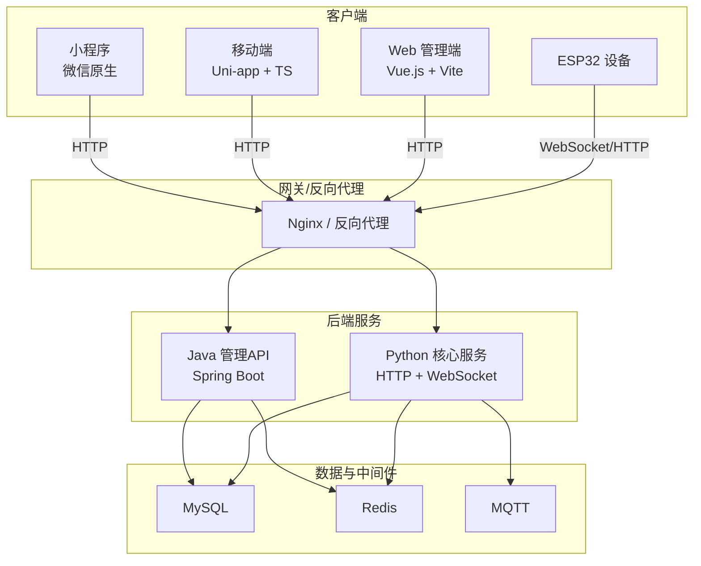
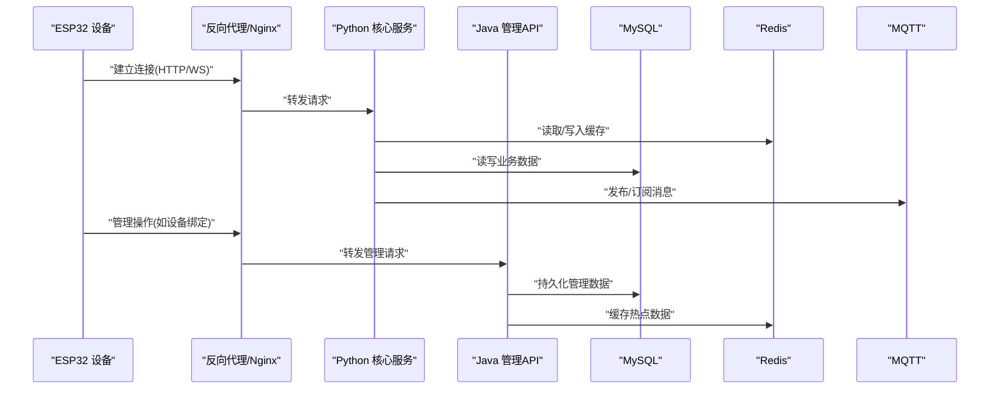
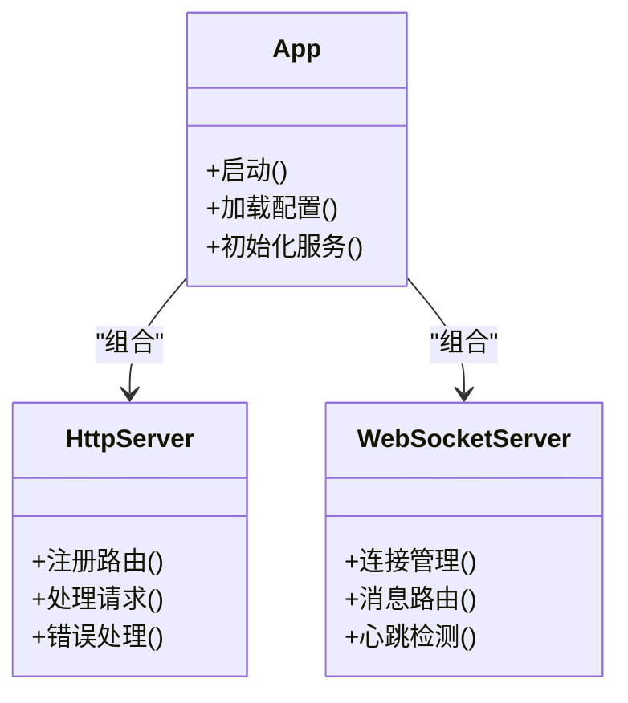
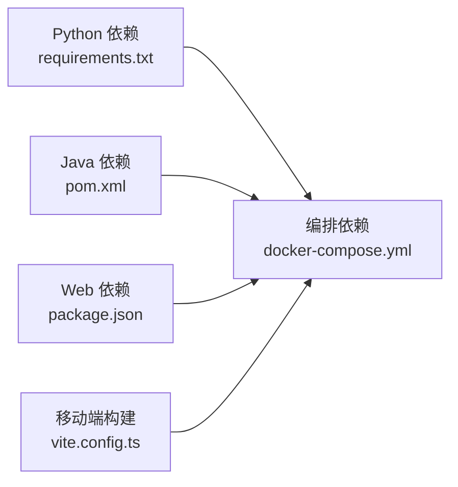

# 技术栈

<cite>
**本文引用的文件**   
- [README.md](file://README.md)
- [docker-compose.yml](file://main/xiaozhi-server/docker-compose.yml)
- [requirements.txt](file://main/xiaozhi-server/requirements.txt)
- [app.py](file://main/xiaozhi-server/app.py)
- [http_server.py](file://main/xiaozhi-server/core/http_server.py)
- [websocket_server.py](file://main/xiaozhi-server/core/websocket_server.py)
- [pom.xml](file://main/manager-api/pom.xml)
- [Dockerfile](file://main/manager-api/Dockerfile)
- [package.json](file://main/manager-web/package.json)
- [vite.config.ts](file://main/manager-mobile/vite.config.ts)
- [pages.config.ts](file://main/manager-mobile/pages.config.ts)
- [project.config.json](file://main/miniprogram/project.config.json)
- [AGENTS.md](file://main/egg-miniprogram/AGENTS.md)
- [docker-setup.sh](file://docker-setup.sh)
- [scripts/run-build-manager.sh](file://scripts/run-build-manager.sh)
- [scripts/run-build-web.sh](file://scripts/run-build-web.sh)
- [scripts/run-build-xiaozhi.sh](file://scripts/run-build-xiaozhi.sh)
</cite>

## 目录
1. [简介](#简介)
2. [项目结构](#项目结构)
3. [核心组件](#核心组件)
4. [架构总览](#架构总览)
5. [详细组件分析](#详细组件分析)
6. [依赖分析](#依赖分析)
7. [性能考虑](#性能考虑)
8. [故障排查指南](#故障排查指南)
9. [结论](#结论)
10. [附录](#附录)

## 简介
本技术栈文档面向 xiaozhi-esp32-server 项目的后端、前端、移动端与运维角色，系统梳理并解释项目中采用的技术选型、版本兼容要求、开发工具链与依赖库，以及容器化与部署策略。内容基于仓库中的配置文件、构建脚本与服务入口进行归纳，力求为不同角色的开发者提供清晰的学习路径与升级建议。

## 项目结构
项目采用多模块组织方式，主要包含：
- 后端服务（Python）：语音交互核心服务，提供 HTTP/WebSocket 接口，集成 ASR/TTS/LLM/Memory 等能力。
- 管理后台 API（Java Spring Boot）：设备、用户、模型配置、支付等管理能力。
- Web 管理端（Vue.js + Vite）：管理后台的浏览器端。
- 移动端（Uni-app + TypeScript）：跨平台应用，支持微信小程序等多端。
- 原生小程序（微信小程序）：独立的小程序工程。
- 容器化与编排：Docker 镜像构建与 docker-compose 编排，配合 CI/CD 脚本。

图表来源
- [docker-compose.yml](file://main/xiaozhi-server/docker-compose.yml)
- [package.json](file://main/manager-web/package.json)
- [vite.config.ts](file://main/manager-mobile/vite.config.ts)
- [project.config.json](file://main/miniprogram/project.config.json)
- [pom.xml](file://main/manager-api/pom.xml)

章节来源
- [README.md](file://README.md)
- [docker-compose.yml](file://main/xiaozhi-server/docker-compose.yml)

## 核心组件
- Python 核心服务
  - 作用：承载设备接入、语音流处理、ASR/TTS/LLM/Memory 等能力编排，对外暴露 HTTP 与 WebSocket 接口。
  - 关键入口：应用启动与服务器初始化。
  - 参考路径：[应用入口](file://main/xiaozhi-server/app.py)、[HTTP 服务](file://main/xiaozhi-server/core/http_server.py)、[WebSocket 服务](file://main/xiaozhi-server/core/websocket_server.py)。
- Java 管理 API
  - 作用：提供设备管理、用户权限、模型配置、支付等管理功能。
  - 关键入口：Spring Boot 应用与依赖管理。
  - 参考路径：[依赖与版本](file://main/manager-api/pom.xml)、[容器化](file://main/manager-api/Dockerfile)。
- Web 管理端
  - 作用：管理后台的前端页面与交互。
  - 关键入口：包管理与构建配置。
  - 参考路径：[包依赖与脚本](file://main/manager-web/package.json)。
- 移动端（Uni-app）
  - 作用：跨平台移动应用，统一代码输出到多端（含微信小程序）。
  - 关键入口：Vite 构建与页面路由配置。
  - 参考路径：[Vite 配置](file://main/manager-mobile/vite.config.ts)、[页面配置](file://main/manager-mobile/pages.config.ts)。
- 小程序（微信原生）
  - 作用：独立小程序工程，适配微信生态。
  - 关键入口：项目配置与依赖声明。
  - 参考路径：[项目配置](file://main/miniprogram/project.config.json)、[工程说明](file://main/egg-miniprogram/AGENTS.md)。
- 容器化与编排
  - 作用：统一构建与运行环境，简化部署。
  - 关键入口：Compose 编排与构建脚本。
  - 参考路径：[Compose](file://main/xiaozhi-server/docker-compose.yml)、[构建脚本](file://scripts/run-build-manager.sh)、[构建脚本](file://scripts/run-build-web.sh)、[构建脚本](file://scripts/run-build-xiaozhi.sh)、[一键安装脚本](file://docker-setup.sh)。

章节来源
- [app.py](file://main/xiaozhi-server/app.py)
- [http_server.py](file://main/xiaozhi-server/core/http_server.py)
- [websocket_server.py](file://main/xiaozhi-server/core/websocket_server.py)
- [pom.xml](file://main/manager-api/pom.xml)
- [Dockerfile](file://main/manager-api/Dockerfile)
- [package.json](file://main/manager-web/package.json)
- [vite.config.ts](file://main/manager-mobile/vite.config.ts)
- [pages.config.ts](file://main/manager-mobile/pages.config.ts)
- [project.config.json](file://main/miniprogram/project.config.json)
- [AGENTS.md](file://main/egg-miniprogram/AGENTS.md)
- [docker-compose.yml](file://main/xiaozhi-server/docker-compose.yml)
- [scripts/run-build-manager.sh](file://scripts/run-build-manager.sh)
- [scripts/run-build-web.sh](file://scripts/run-build-web.sh)
- [scripts/run-build-xiaozhi.sh](file://scripts/run-build-xiaozhi.sh)
- [docker-setup.sh](file://docker-setup.sh)

## 架构总览
整体架构以“设备接入层 + 业务服务层 + 数据与中间件”分层设计：
- 设备接入层：ESP32 设备通过 WebSocket/HTTP 接入，经反向代理进入 Python 核心服务。
- 业务服务层：Python 服务负责语音流处理与 AI 能力编排；Java 服务提供管理面 API。
- 数据与中间件：MySQL 持久化存储，Redis 缓存与会话，MQTT 用于消息分发与设备通信。

图表来源
- [docker-compose.yml](file://main/xiaozhi-server/docker-compose.yml)
- [http_server.py](file://main/xiaozhi-server/core/http_server.py)
- [websocket_server.py](file://main/xiaozhi-server/core/websocket_server.py)
- [pom.xml](file://main/manager-api/pom.xml)

## 详细组件分析

### Python 核心服务（后端）
- 技术要点
  - 语言与框架：Python，HTTP/WebSocket 服务实现。
  - 依赖管理：requirements.txt 声明运行时依赖。
  - 服务入口：应用启动、HTTP 服务、WebSocket 服务。
- 优势与选型原因
  - Python 在 AI/语音领域生态成熟，便于集成 ASR/TTS/LLM 等能力。
  - 异步 I/O 适合高并发设备接入场景。
- 版本兼容性
  - 需根据 requirements.txt 锁定 Python 版本与第三方库版本，确保可重复构建。
- 参考路径
  - [依赖清单](file://main/xiaozhi-server/requirements.txt)
  - [应用入口](file://main/xiaozhi-server/app.py)
  - [HTTP 服务](file://main/xiaozhi-server/core/http_server.py)
  - [WebSocket 服务](file://main/xiaozhi-server/core/websocket_server.py)

图表来源
- [app.py](file://main/xiaozhi-server/app.py)
- [http_server.py](file://main/xiaozhi-server/core/http_server.py)
- [websocket_server.py](file://main/xiaozhi-server/core/websocket_server.py)

章节来源
- [requirements.txt](file://main/xiaozhi-server/requirements.txt)
- [app.py](file://main/xiaozhi-server/app.py)
- [http_server.py](file://main/xiaozhi-server/core/http_server.py)
- [websocket_server.py](file://main/xiaozhi-server/core/websocket_server.py)

### Java 管理 API（后端）
- 技术要点
  - 框架：Spring Boot，RESTful API。
  - 依赖管理：Maven pom.xml。
  - 容器化：Dockerfile 定义镜像构建流程。
- 优势与选型原因
  - Spring Boot 生态完善，适合企业级管理功能快速迭代。
  - 与 MySQL/Redis 集成成熟，事务与安全性保障强。
- 版本兼容性
  - 通过 pom.xml 锁定 Spring Boot 及相关依赖版本，保证构建一致性。
- 参考路径
  - [依赖与版本](file://main/manager-api/pom.xml)
  - [容器化](file://main/manager-api/Dockerfile)

章节来源
- [pom.xml](file://main/manager-api/pom.xml)
- [Dockerfile](file://main/manager-api/Dockerfile)

### Web 管理端（前端）
- 技术要点
  - 框架：Vue.js 3 + Vite。
  - 包管理：package.json 声明依赖与脚本。
- 优势与选型原因
  - Vue 3 组合式 API 提升开发体验与性能。
  - Vite 构建速度快，开发体验佳。
- 版本兼容性
  - 通过 package.json 锁定 Node.js 版本与依赖版本，建议使用 pnpm/yarn 保持一致性。
- 参考路径
  - [包依赖与脚本](file://main/manager-web/package.json)

章节来源
- [package.json](file://main/manager-web/package.json)

### 移动端（Uni-app + TypeScript）
- 技术要点
  - 框架：Uni-app 跨平台，TypeScript 增强类型安全。
  - 构建：Vite 驱动，页面路由由 pages.config.ts 管理。
- 优势与选型原因
  - 一套代码多端输出，降低维护成本。
  - TypeScript 提高可维护性与重构安全性。
- 版本兼容性
  - 需关注 Uni-app 与 HBuilderX/CLI 的版本匹配，Node.js 与依赖版本锁定。
- 参考路径
  - [Vite 配置](file://main/manager-mobile/vite.config.ts)
  - [页面配置](file://main/manager-mobile/pages.config.ts)

章节来源
- [vite.config.ts](file://main/manager-mobile/vite.config.ts)
- [pages.config.ts](file://main/manager-mobile/pages.config.ts)

### 小程序（微信原生）
- 技术要点
  - 框架：微信小程序原生开发。
  - 配置：project.config.json 管理项目设置。
- 优势与选型原因
  - 直接对接微信生态，性能与兼容性最佳。
- 版本兼容性
  - 遵循微信开发者工具与基础库版本要求。
- 参考路径
  - [项目配置](file://main/miniprogram/project.config.json)
  - [工程说明](file://main/egg-miniprogram/AGENTS.md)

章节来源
- [project.config.json](file://main/miniprogram/project.config.json)
- [AGENTS.md](file://main/egg-miniprogram/AGENTS.md)

### 容器化与编排（Docker/Kubernetes）
- 技术要点
  - Docker：各服务提供 Dockerfile，统一镜像构建。
  - Compose：docker-compose.yml 编排多服务依赖。
  - CI/CD：构建脚本自动化打包与推送。
- 优势与选型原因
  - 容器化屏蔽环境差异，提升部署效率与可移植性。
  - Compose 简化本地开发与测试。
- 版本兼容性
  - 保持 Docker 与 Compose 版本一致，注意基础镜像与依赖版本。
- 参考路径
  - [编排配置](file://main/xiaozhi-server/docker-compose.yml)
  - [构建脚本](file://scripts/run-build-manager.sh)
  - [构建脚本](file://scripts/run-build-web.sh)
  - [构建脚本](file://scripts/run-build-xiaozhi.sh)
  - [一键安装脚本](file://docker-setup.sh)

章节来源
- [docker-compose.yml](file://main/xiaozhi-server/docker-compose.yml)
- [scripts/run-build-manager.sh](file://scripts/run-build-manager.sh)
- [scripts/run-build-web.sh](file://scripts/run-build-web.sh)
- [scripts/run-build-xiaozhi.sh](file://scripts/run-build-xiaozhi.sh)
- [docker-setup.sh](file://docker-setup.sh)

## 依赖分析
- 后端依赖
  - Python：通过 requirements.txt 管理，建议固定版本并定期审计漏洞。
  - Java：通过 pom.xml 管理，使用 Maven 插件进行依赖更新与安全扫描。
- 前端依赖
  - Web：package.json 管理，建议使用锁文件与包管理器锁定版本。
  - 移动端：Vite 与 Uni-app 依赖需与 Node.js 版本匹配。
- 中间件依赖
  - MySQL/Redis/MQTT：通过 Compose 或外部服务提供，需关注版本与配置一致性。

图表来源
- [requirements.txt](file://main/xiaozhi-server/requirements.txt)
- [pom.xml](file://main/manager-api/pom.xml)
- [package.json](file://main/manager-web/package.json)
- [vite.config.ts](file://main/manager-mobile/vite.config.ts)
- [docker-compose.yml](file://main/xiaozhi-server/docker-compose.yml)

章节来源
- [requirements.txt](file://main/xiaozhi-server/requirements.txt)
- [pom.xml](file://main/manager-api/pom.xml)
- [package.json](file://main/manager-web/package.json)
- [vite.config.ts](file://main/manager-mobile/vite.config.ts)
- [docker-compose.yml](file://main/xiaozhi-server/docker-compose.yml)

## 性能考虑
- Python 核心服务
  - 使用异步 I/O 提升并发处理能力，合理配置线程池与连接池。
  - 对 ASR/TTS/LLM 调用进行缓存与限流，避免雪崩。
- Java 管理 API
  - 使用连接池与缓存减少数据库压力，启用慢查询日志定位瓶颈。
- 前端与移动端
  - 静态资源压缩与 CDN 加速，按需加载与懒渲染。
  - 网络请求合并与重试机制，提升用户体验。
- 中间件
  - Redis 热点数据缓存，MQTT QoS 与持久化策略调优。
  - MySQL 索引优化与分库分表规划。

## 故障排查指南
- 常见问题
  - 端口冲突：检查 docker-compose 端口映射与服务监听端口。
  - 依赖缺失：确认 requirements.txt/pom.xml/package.json 已正确安装。
  - 环境变量：核对服务所需的环境变量与配置文件路径。
- 排查步骤
  - 查看服务日志与容器状态。
  - 验证中间件连通性（MySQL/Redis/MQTT）。
  - 逐步隔离问题模块（前后端分离调试）。
- 参考路径
  - [编排配置](file://main/xiaozhi-server/docker-compose.yml)
  - [构建脚本](file://scripts/run-build-xiaozhi.sh)
  - [构建脚本](file://scripts/run-build-manager.sh)
  - [构建脚本](file://scripts/run-build-web.sh)

章节来源
- [docker-compose.yml](file://main/xiaozhi-server/docker-compose.yml)
- [scripts/run-build-xiaozhi.sh](file://scripts/run-build-xiaozhi.sh)
- [scripts/run-build-manager.sh](file://scripts/run-build-manager.sh)
- [scripts/run-build-web.sh](file://scripts/run-build-web.sh)

## 结论
xiaozhi-esp32-server 项目采用多语言、多端协同的技术栈，兼顾高性能设备接入与管理能力。通过容器化与编排实现标准化部署，结合成熟的中间件与框架，形成稳定可扩展的系统架构。不同角色开发者可根据本文档的定位与学习路径快速上手，并在后续升级中保持版本一致性与安全性。

## 附录
- 开发环境工具链建议
  - Python：指定版本解释器与虚拟环境，使用 pip/pipenv/conda 管理依赖。
  - Java：JDK 11+，Maven 3.8+，IDEA 或 Eclipse。
  - 前端：Node.js LTS，pnpm/yarn，VS Code。
  - 移动端：HBuilderX 或 CLI，微信开发者工具。
  - 容器化：Docker 20+，docker-compose 2+。
- 升级策略
  - 小步快跑：优先升级依赖小版本，充分回归测试。
  - 灰度发布：先内部试用，再逐步放量。
  - 回滚预案：保留旧镜像与配置快照，快速回滚。
- 学习路径建议
  - 后端（Python）：异步编程、AI 语音库集成、性能调优。
  - 后端（Java）：Spring Boot 微服务、数据库优化、安全加固。
  - 前端（Vue/Vite）：组件化、状态管理、构建优化。
  - 移动端（Uni-app/TS）：跨端适配、性能优化、微信生态集成。
  - 运维（Docker/K8s）：容器编排、监控告警、CI/CD 流水线。