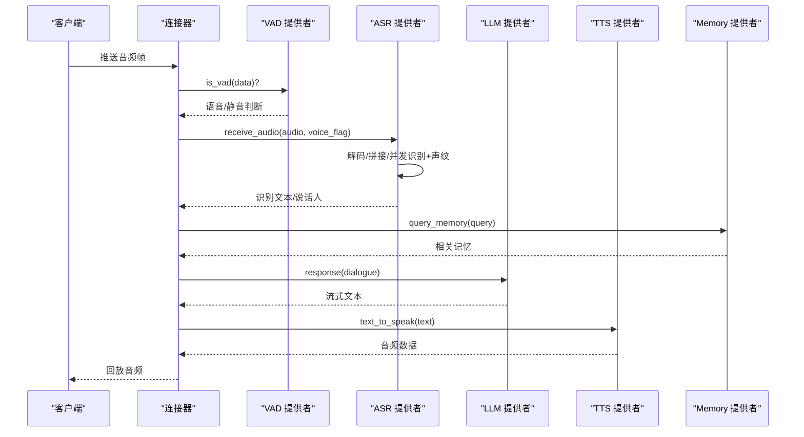
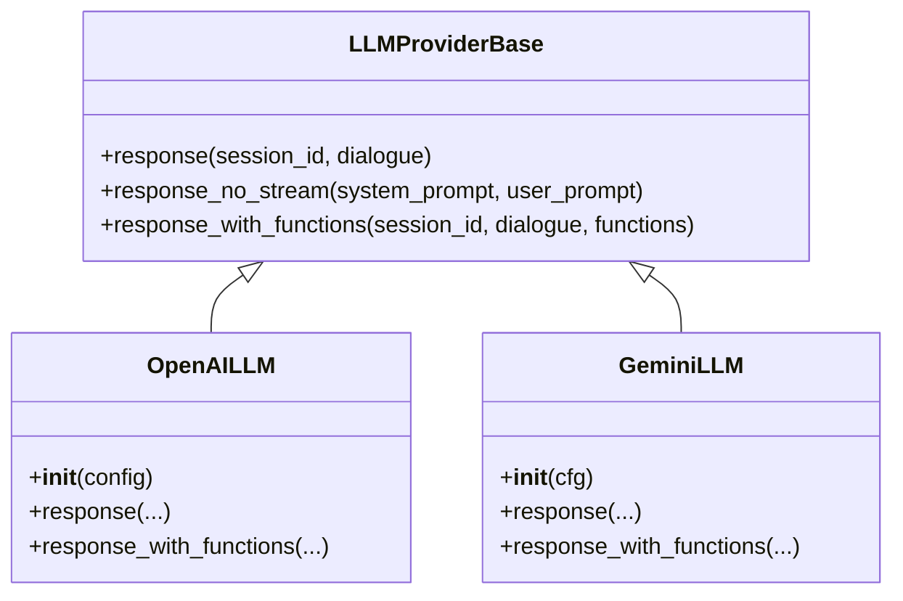
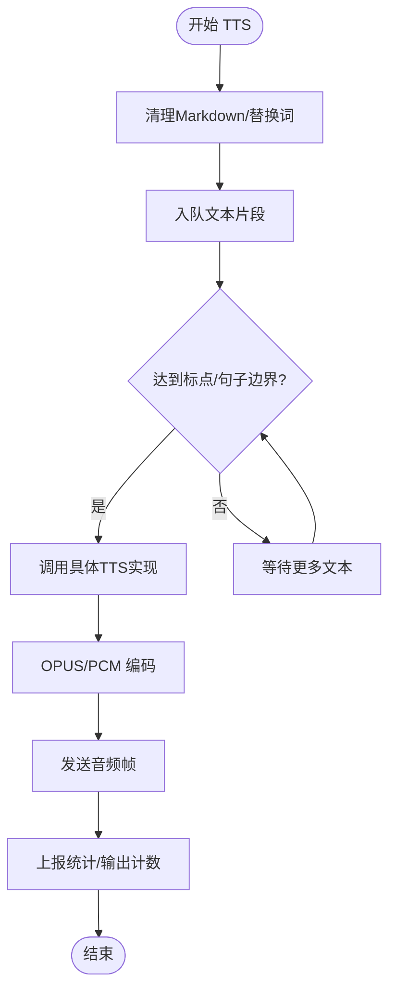
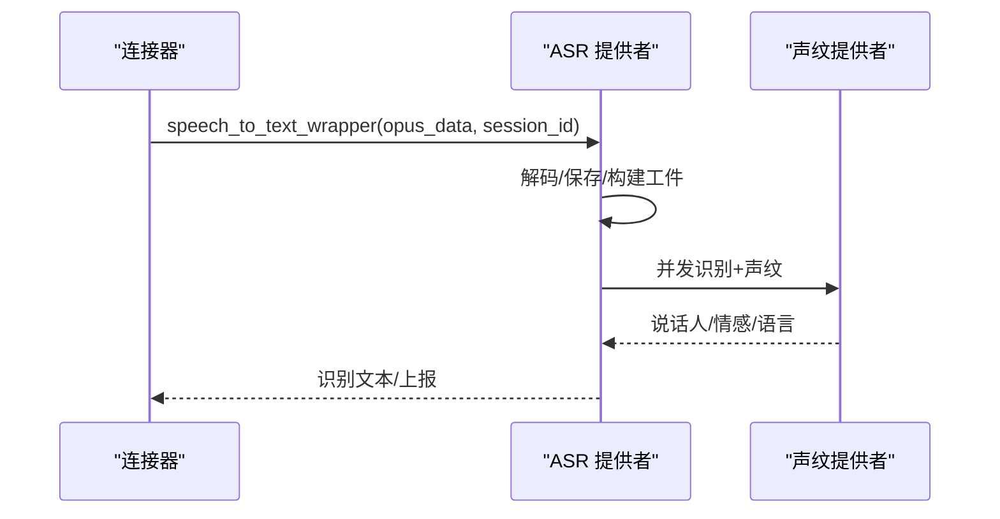
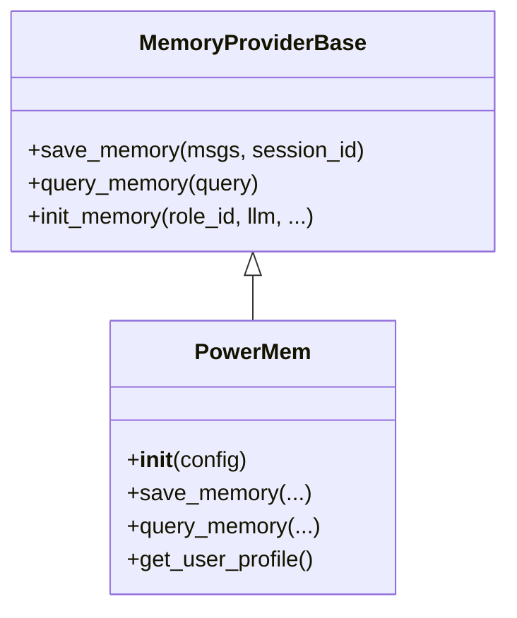
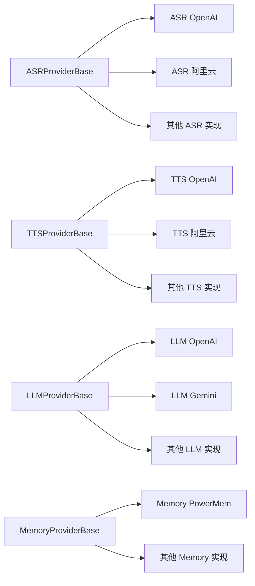

# 支持的平台组件

<cite>
**本文引用的文件**
- [LLM 抽象基类](file://main/xiaozhi-server/core/providers/llm/base.py)
- [TTS 抽象基类](file://main/xiaozhi-server/core/providers/tts/base.py)
- [ASR 抽象基类](file://main/xiaozhi-server/core/providers/asr/base.py)
- [VAD 抽象基类](file://main/xiaozhi-server/core/providers/vad/base.py)
- [Memory 抽象基类](file://main/xiaozhi-server/core/providers/memory/base.py)
- [LLM OpenAI 实现](file://main/xiaozhi-server/core/providers/llm/openai/openai.py)
- [LLM Gemini 实现](file://main/xiaozhi-server/core/providers/llm/gemini/gemini.py)
- [TTS OpenAI 实现](file://main/xiaozhi-server/core/providers/tts/openai.py)
- [ASR OpenAI 实现](file://main/xiaozhi-server/core/providers/asr/openai.py)
- [Memory PowerMem 实现](file://main/xiaozhi-server/core/providers/memory/powermem/powermem.py)
- [Silero VAD 实现](file://main/xiaozhi-server/core/providers/vad/silero.py)
- [ASR 基础工具与 DTO](file://main/xiaozhi-server/core/providers/asr/utils.py)
- [ASR DTO](file://main/xiaozhi-server/core/providers/asr/dto/dto.py)
- [TTS DTO](file://main/xiaozhi-server/core/providers/tts/dto/dto.py)
- [LLM 系统提示管理](file://main/xiaozhi-server/core/providers/llm/system_prompt.py)
- [LLM 工具调用流程文档](file://main/xiaozhi-server/docs/llm/llm-tool-calling-flow.md)
- [PowerMem 记忆系统架构蓝图](file://main/xiaozhi-server/docs/powermem/Memory_System_Architecture_Blueprint.md)
- [PowerMem 问题排查指南](file://main/xiaozhi-server/docs/powermem/PowerMem-Issues.md)
- [PowerMem SQL 生成原理](file://main/xiaozhi-server/docs/powermem/PowerMem-SQL生成原理详解.md)
- [PowerMem 记忆处理原理](file://main/xiaozhi-server/docs/powermem/PowerMem-记忆处理原理详解.md)
- [PowerMem 智能处理流程](file://main/xiaozhi-server/docs/powermem/PowerMemory-Intelligent-Processing-Flow.md)
- [设备接入与 API 文档](file://main/xiaozhi-server/docs/device/device-api-reference.md)
- [设备接入流程](file://main/xiaozhi-server/docs/device/device-onboarding-flow.md)
- [Docker Nginx 配置示例](file://main/xiaozhi-server/docs/docker/nginx.conf)
- [Docker 启动脚本](file://main/xiaozhi-server/docs/docker/start.sh)
- [RAGFlow 集成指南](file://main/xiaozhi-server/docs/ragflow-integration.md)
- [Fish Speech 集成指南](file://main/xiaozhi-server/docs/fish-speech-integration.md)
- [PaddleSpeech 部署指南](file://main/xiaozhi-server/docs/paddlespeech-deploy.md)
- [Home Assistant 集成指南](file://main/xiaozhi-server/docs/homeassistant-integration.md)
- [MCP 端点集成指南](file://main/xiaozhi-server/docs/mcp-endpoint-integration.md)
- [MCP 视觉集成指南](file://main/xiaozhi-server/docs/mcp-vision-integration.md)
- [OTA 升级指南](file://main/xiaozhi-server/docs/ota-upgrade-guide.md)
- [性能测试器](file://main/xiaozhi-server/docs/performance_tester.md)
- [部署文档](file://main/xiaozhi-server/docs/Deployment.md)
- [固件构建指南](file://main/xiaozhi-server/docs/firmware-build.md)
- [固件设置指南](file://main/xiaozhi-server/docs/firmware-setting.md)
- [开发者运维集成](file://main/xiaozhi-server/docs/dev-ops-integration.md)
- [PowerMem 初始化脚本](file://main/xiaozhi-server/xiaozhi-server/oceanbase/init-powermem.sh)
- [PowerMem 初始化 SQL](file://main/xiaozhi-server/xiaozhi-server/oceanbase/init/01-init-powermem.sql)
</cite>

## 目录
1. [简介](#简介)
2. [项目结构](#项目结构)
3. [核心组件](#核心组件)
4. [架构总览](#架构总览)
5. [详细组件分析](#详细组件分析)
6. [依赖关系分析](#依赖关系分析)
7. [性能考量](#性能考量)
8. [故障排查指南](#故障排查指南)
9. [结论](#结论)
10. [附录](#附录)

## 简介
本文件面向小智 ESP32 服务器项目，系统梳理并说明项目支持的各类平台组件，包括：
- LLM 大语言模型平台（OpenAI、Gemini、阿里百炼、Coze、Dify、FastGPT、Ollama、Xinference、HomeAssistant 等）
- VLLM 视觉模型平台（OpenAI Vision）
- TTS 语音合成平台（OpenAI TTS、阿里云、腾讯云、讯飞、PaddleSpeech、FishSpeech、SiliconFlow、LinkerAI 等）
- ASR 语音识别平台（OpenAI Whisper、阿里云、百度、腾讯、讯飞、Vosk、FunASR、Sherpa-ONNX 等）
- VAD 语音活动检测（Silero）
- Voiceprint 声纹识别（与 ASR 并行）
- Memory 记忆存储平台（PowerMem、mem0、volmem0、本地短记忆、报告仅记录、无记忆）
- Intent 意图识别平台（内置基础实现）
- RAG 检索增强生成平台（RAGFlow 集成）

同时提供各平台的使用方式、免费/付费选项、使用限制、平台选择策略、配置建议、兼容性、性能对比与迁移指南。

## 项目结构
项目采用“抽象基类 + 多实现”的插件化架构，核心能力通过 providers 子目录下的模块化组件提供，便于按需启用与替换。

```mermaid
graph TB
subgraph "核心抽象层"
LLMBase["LLM 抽象基类"]
TTSBase["TTS 抽象基类"]
ASRBase["ASR 抽象基类"]
VADBase["VAD 抽象基类"]
MemBase["Memory 抽象基类"]
end
subgraph "LLM 实现"
OpenAILLM["OpenAI 实现"]
GeminiLLM["Gemini 实现"]
AliBL["阿里百炼"]
CozeLLM["Coze"]
DifyLLM["Dify"]
FastGPTLLM["FastGPT"]
OllamaLLM["Ollama"]
XinferenceLLM["Xinference"]
HomeAssistantLLM["HomeAssistant"]
end
subgraph "TTS 实现"
OpenAITTS["OpenAI TTS"]
AliyunTTS["阿里云"]
TencentTTS["腾讯云"]
XunfeiTTS["讯飞"]
PaddleTTS["PaddleSpeech"]
FishTTS["FishSpeech"]
SiliconFlowTTS["SiliconFlow"]
LinkeraiTTS["LinkerAI"]
end
subgraph "ASR 实现"
OpenAIASR["OpenAI Whisper"]
AliyunASR["阿里云"]
BaiduASR["百度"]
TencentASR["腾讯"]
XunfeiASR["讯飞"]
VoskASR["Vosk"]
FunASR["FunASR"]
SherpaASR["Sherpa-ONNX"]
end
subgraph "VAD 实现"
SileroVAD["Silero"]
end
subgraph "Memory 实现"
PowerMem["PowerMem"]
Mem0["mem0"]
VolMem0["volmem0"]
LocalShort["本地短记忆"]
ReportOnly["报告仅记录"]
NoMem["无记忆"]
end
LLMBase --> OpenAILLM
LLMBase --> GeminiLLM
LLMBase --> AliBL
LLMBase --> CozeLLM
LLMBase --> DifyLLM
LLMBase --> FastGPTLLM
LLMBase --> OllamaLLM
LLMBase --> XinferenceLLM
LLMBase --> HomeAssistantLLM
TTSBase --> OpenAITTS
TTSBase --> AliyunTTS
TTSBase --> TencentTTS
TTSBase --> XunfeiTTS
TTSBase --> PaddleTTS
TTSBase --> FishTTS
TTSBase --> SiliconFlowTTS
TTSBase --> LinkeraiTTS
ASRBase --> OpenAIASR
ASRBase --> AliyunASR
ASRBase --> BaiduASR
ASRBase --> TencentASR
ASRBase --> XunfeiASR
ASRBase --> VoskASR
ASRBase --> FunASR
ASRBase --> SherpaASR
VADBase --> SileroVAD
MemBase --> PowerMem
MemBase --> Mem0
MemBase --> VolMem0
MemBase --> LocalShort
MemBase --> ReportOnly
MemBase --> NoMem
```

**图表来源**
- [LLM 抽象基类:7-35](file://main/xiaozhi-server/core/providers/llm/base.py#L7-L35)
- [TTS 抽象基类:33-637](file://main/xiaozhi-server/core/providers/tts/base.py#L33-L637)
- [ASR 抽象基类:32-382](file://main/xiaozhi-server/core/providers/asr/base.py#L32-L382)
- [VAD 抽象基类:5-10](file://main/xiaozhi-server/core/providers/vad/base.py#L5-L10)
- [Memory 抽象基类:8-29](file://main/xiaozhi-server/core/providers/memory/base.py#L8-L29)

**章节来源**
- [LLM 抽象基类:1-35](file://main/xiaozhi-server/core/providers/llm/base.py#L1-L35)
- [TTS 抽象基类:1-637](file://main/xiaozhi-server/core/providers/tts/base.py#L1-L637)
- [ASR 抽象基类:1-382](file://main/xiaozhi-server/core/providers/asr/base.py#L1-L382)
- [VAD 抽象基类:1-10](file://main/xiaozhi-server/core/providers/vad/base.py#L1-L10)
- [Memory 抽象基类:1-29](file://main/xiaozhi-server/core/providers/memory/base.py#L1-L29)

## 核心组件
- LLMProviderBase：定义统一的流式/非流式响应接口、函数调用接口与默认实现。
- TTSProviderBase：统一 TTS 文本到语音的处理流程，支持队列、OPUS 编码、替换词、流式分句等。
- ASRProviderBase：统一 ASR 音频接收、解码、并发识别与声纹并行识别、工件保存等。
- VADProviderBase：统一语音活动检测接口。
- MemoryProviderBase：统一记忆的保存与查询接口。

这些抽象类为所有具体平台实现提供了统一契约，便于切换与扩展。

**章节来源**
- [LLM 抽象基类:7-35](file://main/xiaozhi-server/core/providers/llm/base.py#L7-L35)
- [TTS 抽象基类:33-637](file://main/xiaozhi-server/core/providers/tts/base.py#L33-L637)
- [ASR 抽象基类:32-382](file://main/xiaozhi-server/core/providers/asr/base.py#L32-L382)
- [VAD 抽象基类:5-10](file://main/xiaozhi-server/core/providers/vad/base.py#L5-L10)
- [Memory 抽象基类:8-29](file://main/xiaozhi-server/core/providers/memory/base.py#L8-L29)

## 架构总览
系统以“连接器 + 提供者”为核心，客户端音频经由 ASR/VAD/语音活动检测进入对话管线，LLM 生成回复，TTS 合成语音回放。Memory 在对话前后参与上下文增强与历史记忆检索。各平台通过配置文件选择启用。

**图表来源**
- [ASR 抽象基类:84-180](file://main/xiaozhi-server/core/providers/asr/base.py#L84-L180)
- [TTS 抽象基类:368-476](file://main/xiaozhi-server/core/providers/tts/base.py#L368-L476)
- [LLM 抽象基类:9-33](file://main/xiaozhi-server/core/providers/llm/base.py#L9-L33)
- [Memory 抽象基类:16-28](file://main/xiaozhi-server/core/providers/memory/base.py#L16-L28)

## 详细组件分析

### LLM 语言模型平台
- OpenAI 实现
  - 特点：支持流式响应、函数调用、自动禁用“思考模式”、细粒度超时配置。
  - 使用方式：配置 base_url、api_key、model_name、可选温度/采样参数。
  - 免费/付费：OpenAI 官方按用量计费；可使用兼容 OpenAI 接口的第三方服务（如阿里百炼、火山等）。
  - 使用限制：Token 上限、并发限制、速率限制。
  - 配置建议：优先使用流式响应提升交互体验；合理设置超时与温度。
- Gemini 实现
  - 特点：支持代理环境配置、函数调用、GenerationConfig 控制输出。
  - 使用方式：配置 api_key、model_name、可选代理、超时。
  - 免费/付费：Google AI 按用量计费；国内访问建议配置代理。
  - 使用限制：地区可用性、配额限制。
  - 配置建议：代理连通性测试通过后再启用；合理设置 max_output_tokens。
- 其他实现（阿里百炼、Coze、Dify、FastGPT、Ollama、Xinference、HomeAssistant）
  - 特点：均继承 LLMProviderBase，遵循统一接口；具体差异体现在认证、参数映射与函数调用支持。
  - 使用方式：按各实现文件配置项填写；注意不同平台的模型名与参数命名差异。
  - 免费/付费：按各平台政策；开源本地推理（Ollama/Xinference）适合私有部署。
  - 使用限制：模型可用性、并发与配额。
  - 配置建议：优先选择与 OpenAI 兼容的接口以降低迁移成本。

**图表来源**
- [LLM 抽象基类:7-35](file://main/xiaozhi-server/core/providers/llm/base.py#L7-L35)
- [LLM OpenAI 实现:21-179](file://main/xiaozhi-server/core/providers/llm/openai/openai.py#L21-L179)
- [LLM Gemini 实现:69-214](file://main/xiaozhi-server/core/providers/llm/gemini/gemini.py#L69-L214)

**章节来源**
- [LLM OpenAI 实现:1-179](file://main/xiaozhi-server/core/providers/llm/openai/openai.py#L1-L179)
- [LLM Gemini 实现:1-214](file://main/xiaozhi-server/core/providers/llm/gemini/gemini.py#L1-L214)
- [LLM 系统提示管理](file://main/xiaozhi-server/core/providers/llm/system_prompt.py)
- [LLM 工具调用流程文档](file://main/xiaozhi-server/docs/llm/llm-tool-calling-flow.md)

### VLLM 视觉模型平台
- OpenAI Vision（通过 LLM OpenAI 实现）
  - 使用方式：在对话消息中携带图像内容，调用 OpenAI Chat Completions 接口。
  - 免费/付费：按 OpenAI 图像处理计费。
  - 使用限制：图像大小、格式与数量限制。
  - 配置建议：优先使用流式响应；注意控制图像分辨率与数量。

**章节来源**
- [LLM OpenAI 实现:91-136](file://main/xiaozhi-server/core/providers/llm/openai/openai.py#L91-L136)

### TTS 语音合成平台
- OpenAI TTS
  - 特点：支持多种 voice、format、speed 参数；通过百分比参数映射统一配置。
  - 使用方式：配置 api_key、api_url、model、voice、format、speed。
  - 免费/付费：OpenAI TTS 按字符计费；可使用兼容接口的平台。
  - 使用限制：字符上限、并发限制。
  - 配置建议：根据设备采样率选择合适 format；开启 OPUS 编码以节省带宽。
- 其他实现（阿里云、腾讯云、讯飞、PaddleSpeech、FishSpeech、SiliconFlow、LinkerAI）
  - 特点：均继承 TTSProviderBase，统一文本入队、OPUS 编码、替换词处理与队列消费。
  - 使用方式：按实现文件配置项填写；注意不同平台的参数命名与音频格式差异。
  - 免费/付费：按各平台政策；部分平台提供免费额度。
  - 使用限制：并发、字符/时长限制。
  - 配置建议：优先选择流式/双流接口以降低延迟；合理设置速度与音色。

**图表来源**
- [TTS 抽象基类:368-476](file://main/xiaozhi-server/core/providers/tts/base.py#L368-L476)
- [TTS OpenAI 实现:10-61](file://main/xiaozhi-server/core/providers/tts/openai.py#L10-L61)

**章节来源**
- [TTS 抽象基类:1-637](file://main/xiaozhi-server/core/providers/tts/base.py#L1-L637)
- [TTS OpenAI 实现:1-61](file://main/xiaozhi-server/core/providers/tts/openai.py#L1-L61)

### ASR 语音识别平台
- OpenAI Whisper
  - 特点：非流式上传文件识别；需要保存音频文件。
  - 使用方式：配置 api_key、base_url、model_name、输出目录。
  - 免费/付费：OpenAI Whisper 按文件计费。
  - 使用限制：文件大小、格式限制。
  - 配置建议：合理设置输出目录与磁盘空间；并发识别时注意资源清理。
- 其他实现（阿里云、百度、腾讯、讯飞、Vosk、FunASR、Sherpa-ONNX）
  - 特点：支持流式/非流式；部分实现支持本地推理；统一音频解码与并发识别。
  - 使用方式：按实现文件配置项填写；注意音频格式与采样率要求。
  - 免费/付费：按各平台政策；本地推理（Vosk/FunASR/Sherpa-ONNX）适合私有部署。
  - 使用限制：并发、识别准确度与延迟。
  - 配置建议：优先选择流式接口；合理设置缓存与磁盘空间。

**图表来源**
- [ASR 抽象基类:84-180](file://main/xiaozhi-server/core/providers/asr/base.py#L84-L180)
- [ASR OpenAI 实现:13-71](file://main/xiaozhi-server/core/providers/asr/openai.py#L13-L71)

**章节来源**
- [ASR 抽象基类:1-382](file://main/xiaozhi-server/core/providers/asr/base.py#L1-L382)
- [ASR OpenAI 实现:1-71](file://main/xiaozhi-server/core/providers/asr/openai.py#L1-L71)
- [ASR 基础工具与 DTO](file://main/xiaozhi-server/core/providers/asr/utils.py)
- [ASR DTO](file://main/xiaozhi-server/core/providers/asr/dto/dto.py)

### VAD 语音活动检测平台
- Silero
  - 特点：轻量级本地模型；提供 is_vad 接口。
  - 使用方式：直接注入 VADProviderBase 实现；按需配置阈值与窗口。
  - 免费/付费：完全开源。
  - 使用限制：模型精度与环境噪声敏感性。
  - 配置建议：结合设备采样率与音频帧大小优化参数。

**章节来源**
- [VAD 抽象基类:1-10](file://main/xiaozhi-server/core/providers/vad/base.py#L1-L10)
- [Silero VAD 实现](file://main/xiaozhi-server/core/providers/vad/silero.py)

### Voiceprint 声纹识别平台
- 集成方式
  - ASR 与 Voiceprint 并行：在语音停止时并发触发 ASR 与声纹识别，结果合并上报。
  - WAV 转换：将 PCM 数据转换为 WAV 以便声纹识别。
- 典型实现
  - 与 ASRProviderBase 配合使用；在识别结果中附加说话人信息。
- 使用建议
  - 确保音频质量与长度满足声纹识别要求；合理设置并发与资源清理。

**章节来源**
- [ASR 抽象基类:84-180](file://main/xiaozhi-server/core/providers/asr/base.py#L84-L180)
- [ASR 基础工具与 DTO](file://main/xiaozhi-server/core/providers/asr/utils.py)

### Memory 记忆存储平台
- PowerMem
  - 特点：OceanBase 开源 Agent 记忆组件；支持多存储后端（sqlite/oceanbase/postgres）、多 LLM/Embedding 提供者；支持智能记忆（遗忘曲线）与用户画像模式。
  - 使用方式：配置 vector_store、llm、embedder、intelligent_memory 等；支持 UserMemory 与 AsyncMemory 两种模式。
  - 免费/付费：PowerMem 本身开源；OceanBase/Postgres 等后端按部署计费。
  - 使用限制：后端可用性、模型可用性、配额与性能。
  - 配置建议：优先使用异步接口；合理设置智能记忆参数；用户画像模式需 OceanBase 支持。
- 其他实现（mem0、volmem0、本地短记忆、报告仅记录、无记忆）
  - 特点：mem0/volmem0 提供向量化存储；本地短记忆适合短期对话；报告仅记录仅用于审计；无记忆适合隐私场景。
  - 使用方式：按实现文件配置项填写。
  - 免费/付费：开源或按部署计费。
  - 使用限制：存储容量、查询性能。
  - 配置建议：根据业务需求选择持久化级别与存储后端。

**图表来源**
- [Memory 抽象基类:8-29](file://main/xiaozhi-server/core/providers/memory/base.py#L8-L29)
- [Memory PowerMem 实现:23-450](file://main/xiaozhi-server/core/providers/memory/powermem/powermem.py#L23-L450)

**章节来源**
- [Memory 抽象基类:1-29](file://main/xiaozhi-server/core/providers/memory/base.py#L1-L29)
- [Memory PowerMem 实现:1-450](file://main/xiaozhi-server/core/providers/memory/powermem/powermem.py#L1-L450)
- [PowerMem 记忆系统架构蓝图](file://main/xiaozhi-server/docs/powermem/Memory_System_Architecture_Blueprint.md)
- [PowerMem 问题排查指南](file://main/xiaozhi-server/docs/powermem/PowerMem-Issues.md)
- [PowerMem SQL 生成原理](file://main/xiaozhi-server/docs/powermem/PowerMem-SQL生成原理详解.md)
- [PowerMem 记忆处理原理](file://main/xiaozhi-server/docs/powermem/PowerMem-记忆处理原理详解.md)
- [PowerMem 智能处理流程](file://main/xiaozhi-server/docs/powermem/PowerMemory-Intelligent-Processing-Flow.md)
- [PowerMem 初始化脚本](file://main/xiaozhi-server/xiaozhi-server/oceanbase/init-powermem.sh)
- [PowerMem 初始化 SQL](file://main/xiaozhi-server/xiaozhi-server/oceanbase/init/01-init-powermem.sql)

### Intent 意图识别平台
- 基础实现
  - 内置基础 Intent Handler 与注册表，支持函数调用与意图路由。
- 使用建议
  - 结合 LLM 的函数调用能力实现强意图识别；必要时引入专用 NLU 平台。

**章节来源**
- [LLM 工具调用流程文档](file://main/xiaozhi-server/docs/llm/llm-tool-calling-flow.md)

### RAG 检索增强生成平台
- RAGFlow 集成
  - 使用方式：通过插件函数调用实现搜索与检索；在对话中注入检索结果。
  - 免费/付费：按 RAGFlow 部署与使用计费。
  - 使用限制：索引规模、检索性能。
  - 配置建议：合理组织知识库与分段策略；优化检索参数。

**章节来源**
- [RAGFlow 集成指南](file://main/xiaozhi-server/docs/ragflow-integration.md)

## 依赖关系分析
- 组件耦合
  - ASR/TTS/LLM/Memory 通过抽象基类解耦；具体实现可独立替换。
  - VAD 与 ASR/Voiceprint 协作，共同决定识别触发时机与并发策略。
- 外部依赖
  - LLM：OpenAI SDK、Gemini SDK、第三方 HTTP 接口。
  - TTS：HTTP 接口、音频编码库。
  - ASR：HTTP 接口、音频解码库。
  - Memory：PowerMem SDK、数据库驱动。
- 潜在循环依赖
  - 通过抽象基类与模块导入避免循环依赖；各实现文件保持最小耦合。

**图表来源**
- [ASR 抽象基类:32-382](file://main/xiaozhi-server/core/providers/asr/base.py#L32-L382)
- [TTS 抽象基类:33-637](file://main/xiaozhi-server/core/providers/tts/base.py#L33-L637)
- [LLM 抽象基类:7-35](file://main/xiaozhi-server/core/providers/llm/base.py#L7-L35)
- [Memory 抽象基类:8-29](file://main/xiaozhi-server/core/providers/memory/base.py#L8-L29)

**章节来源**
- [ASR 抽象基类:1-382](file://main/xiaozhi-server/core/providers/asr/base.py#L1-L382)
- [TTS 抽象基类:1-637](file://main/xiaozhi-server/core/providers/tts/base.py#L1-L637)
- [LLM 抽象基类:1-35](file://main/xiaozhi-server/core/providers/llm/base.py#L1-L35)
- [Memory 抽象基类:1-29](file://main/xiaozhi-server/core/providers/memory/base.py#L1-L29)

## 性能考量
- 流式接口优先：LLM/TTS 均支持流式，显著降低首字延迟。
- 并发与资源：ASR 与 Voiceprint 并发识别可缩短总时延，但需注意 CPU/IO 与磁盘空间。
- 编码与传输：OPUS 编码在带宽与质量间取得平衡；合理设置采样率与帧大小。
- 记忆检索：PowerMem 支持异步检索与智能记忆，需评估后端性能与索引规模。
- 本地推理：Vosk/FunASR/Sherpa-ONNX 适合低延迟与隐私场景，但模型精度与资源占用需权衡。

## 故障排查指南
- PowerMem 初始化失败
  - 现象：日志报错“PowerMem not installed”或初始化异常。
  - 处理：安装 powermem 包；检查 vector_store/llm/embedder 配置；确认 OceanBase/Postgres 可用。
  - 参考：初始化脚本与 SQL 文件。
- ASR 文件操作错误
  - 现象：磁盘空间不足或文件清理失败。
  - 处理：检查输出目录权限与空间；确保 delete_audio_file 配置正确。
- LLM 超时/配额限制
  - 现象：请求超时或返回配额错误。
  - 处理：调整超时配置；检查 API Key 与配额；必要时更换代理或平台。
- TTS 生成失败
  - 现象：多次重试后仍失败。
  - 处理：检查网络与服务可用性；确认音频格式与速度参数；尝试本地 TTS 或替代平台。

**章节来源**
- [PowerMem 问题排查指南](file://main/xiaozhi-server/docs/powermem/PowerMem-Issues.md)
- [ASR 抽象基类:310-329](file://main/xiaozhi-server/core/providers/asr/base.py#L310-L329)
- [LLM OpenAI 实现:30-44](file://main/xiaozhi-server/core/providers/llm/openai/openai.py#L30-L44)
- [TTS 抽象基类:130-191](file://main/xiaozhi-server/core/providers/tts/base.py#L130-L191)

## 结论
小智 ESP32 服务器通过抽象基类与多实现的插件化架构，实现了对主流 LLM/TTS/ASR/Memory 平台的统一接入与灵活替换。建议根据业务场景选择合适的平台组合：追求高精度与生态完善可选 OpenAI/Gemini；注重隐私与低延迟可选本地推理；需要结构化记忆可选 PowerMem。通过合理的配置与资源规划，可在不同平台上获得稳定、高效的语音交互体验。

## 附录
- 设备接入与 API
  - 参考设备 API 文档与接入流程，确保前端与后端协议一致。
- Docker 与部署
  - 参考 Docker 配置与启动脚本，结合 Nginx 进行反向代理与静态资源服务。
- 集成指南
  - RAGFlow、Fish Speech、PaddleSpeech、Home Assistant、MCP 等平台均有专门集成文档，按需参考。

**章节来源**
- [设备接入与 API 文档](file://main/xiaozhi-server/docs/device/device-api-reference.md)
- [设备接入流程](file://main/xiaozhi-server/docs/device/device-onboarding-flow.md)
- [Docker Nginx 配置示例](file://main/xiaozhi-server/docs/docker/nginx.conf)
- [Docker 启动脚本](file://main/xiaozhi-server/docs/docker/start.sh)
- [RAGFlow 集成指南](file://main/xiaozhi-server/docs/ragflow-integration.md)
- [Fish Speech 集成指南](file://main/xiaozhi-server/docs/fish-speech-integration.md)
- [PaddleSpeech 部署指南](file://main/xiaozhi-server/docs/paddlespeech-deploy.md)
- [Home Assistant 集成指南](file://main/xiaozhi-server/docs/homeassistant-integration.md)
- [MCP 端点集成指南](file://main/xiaozhi-server/docs/mcp-endpoint-integration.md)
- [MCP 视觉集成指南](file://main/xiaozhi-server/docs/mcp-vision-integration.md)
- [OTA 升级指南](file://main/xiaozhi-server/docs/ota-upgrade-guide.md)
- [性能测试器](file://main/xiaozhi-server/docs/performance_tester.md)
- [部署文档](file://main/xiaozhi-server/docs/Deployment.md)
- [固件构建指南](file://main/xiaozhi-server/docs/firmware-build.md)
- [固件设置指南](file://main/xiaozhi-server/docs/firmware-setting.md)
- [开发者运维集成](file://main/xiaozhi-server/docs/dev-ops-integration.md)