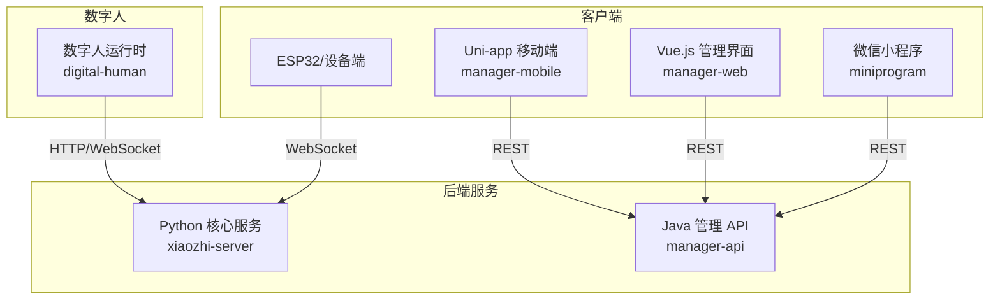
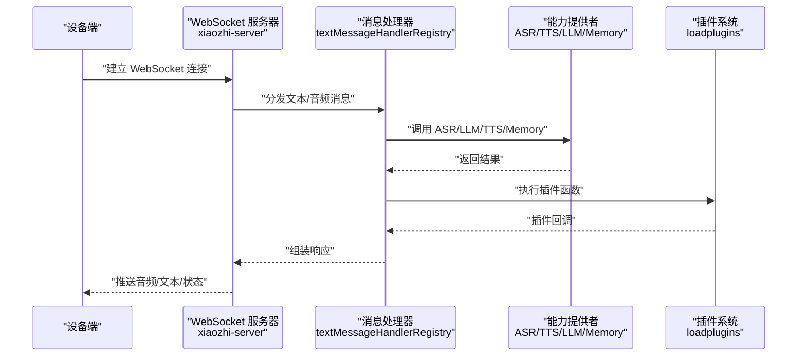
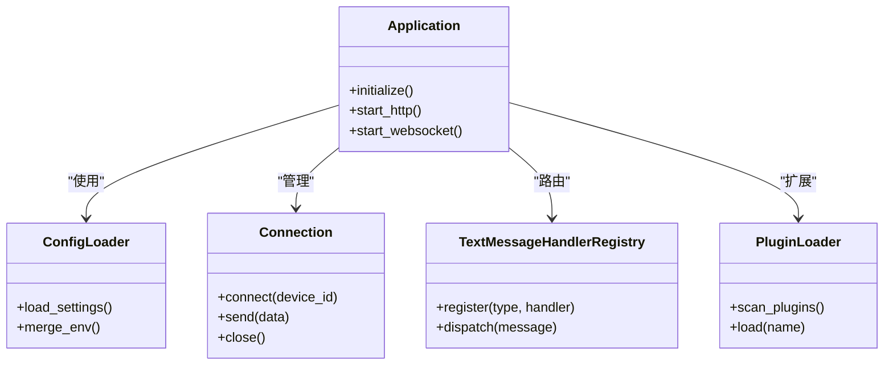
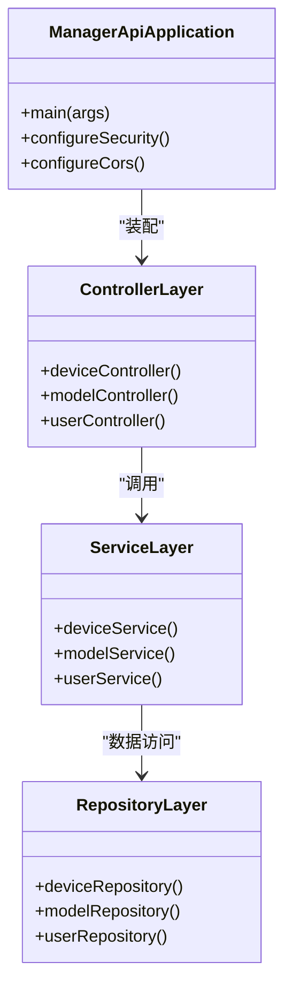
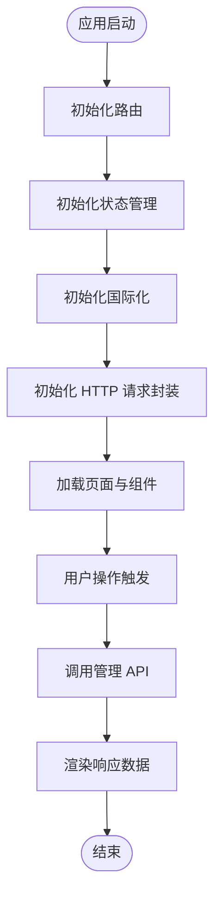
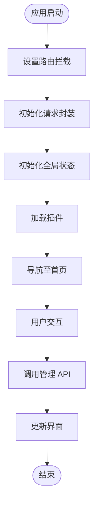
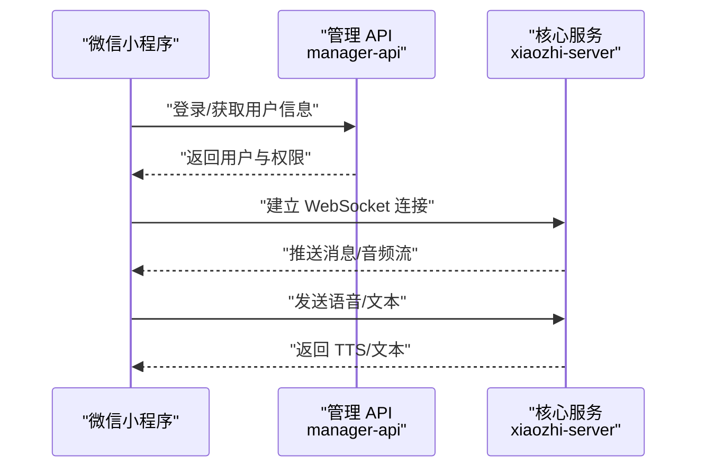
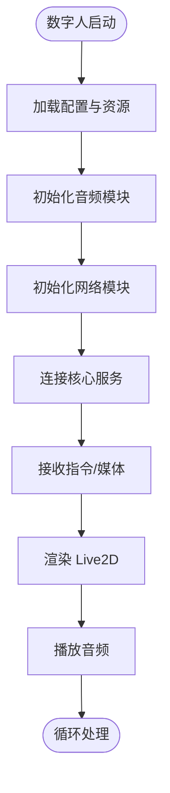
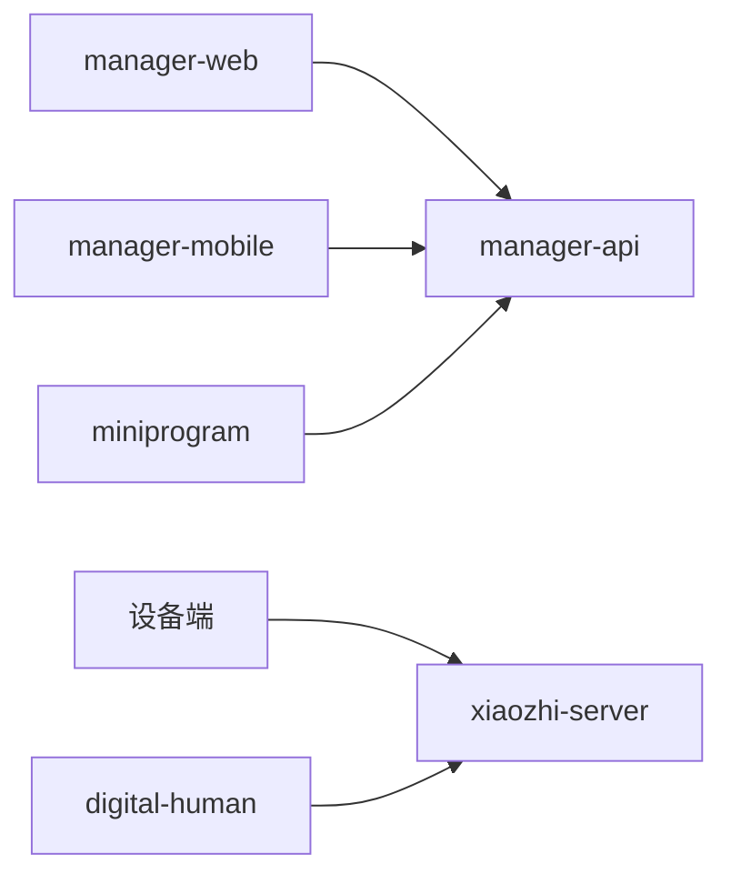

# 架构概览

<cite>
**本文引用的文件**   
- [README.md](file://README.md)
- [xiaozhi-server/app.py](file://main/xiaozhi-server/app.py)
- [xiaozhi-server/core/websocket_server.py](file://main/xiaozhi-server/core/websocket_server.py)
- [xiaozhi-server/core/http_server.py](file://main/xiaozhi-server/core/http_server.py)
- [xiaozhi-server/config/settings.py](file://main/xiaozhi-server/config/settings.py)
- [xiaozhi-server/config/config_loader.py](file://main/xiaozhi-server/config/config_loader.py)
- [xiaozhi-server/core/connection.py](file://main/xiaozhi-server/core/connection.py)
- [xiaozhi-server/core/handle/textMessageHandlerRegistry.py](file://main/xiaozhi-server/core/handle/textMessageHandlerRegistry.py)
- [xiaozhi-server/plugins_func/loadplugins.py](file://main/xiaozhi-server/plugins_func/loadplugins.py)
- [manager-api/src/main/java/xiaozhi/ManagerApiApplication.java](file://main/manager-api/src/main/java/xiaozhi/ManagerApiApplication.java)
- [manager-web/src/main.js](file://main/manager-web/src/main.js)
- [manager-mobile/src/main.ts](file://main/manager-mobile/src/main.ts)
- [miniprogram/app.js](file://main/miniprogram/app.js)
- [digital-human/start.py](file://main/digital-human/start.py)
</cite>

## 目录
1. [简介](#简介)
2. [项目结构](#项目结构)
3. [核心组件](#核心组件)
4. [架构总览](#架构总览)
5. [详细组件分析](#详细组件分析)
6. [依赖关系分析](#依赖关系分析)
7. [性能考量](#性能考量)
8. [故障排查指南](#故障排查指南)
9. [结论](#结论)
10. [附录](#附录)

## 简介
本架构概览面向 xiaozhi-esp32-server 项目的整体设计，覆盖微服务架构模式、事件驱动与插件化机制，以及多端客户端（Web、移动端、小程序）与后端服务的交互方式。系统以 Python 核心服务（xiaozhi-server）为中心，提供 WebSocket 实时通信与 RESTful API；Java 管理 API（manager-api）负责管理与配置；Vue.js Web 管理界面（manager-web）、Uni-app 移动端应用（manager-mobile）和微信小程序共同构成多端表现层；数字人系统（digital-human）作为独立运行时，通过 HTTP/WebSocket 与核心服务协同。

## 项目结构
仓库采用多模块组织：
- main/xiaozhi-server：Python 核心服务，包含 WebSocket/HTTP 服务、消息处理管线、ASR/TTS/LLM/VAD/Memory/Intent/Tools 等能力提供者与插件加载器。
- main/manager-api：Java Spring Boot 管理服务，对外暴露管理接口，支撑前端管理页面。
- main/manager-web：Vue.js 管理后台，调用 manager-api 进行设备、模型、知识库、用户等管理。
- main/manager-mobile：基于 Uni-app 的移动端管理应用，跨平台发布到 App/小程序/H5。
- main/miniprogram：微信小程序原生实现，提供语音通话、聊天、订阅等功能。
- main/digital-human：数字人运行时，集成 Live2D、音频编解码、MCP 工具与网络通信。

图表来源
- [xiaozhi-server/core/websocket_server.py](file://main/xiaozhi-server/core/websocket_server.py)
- [xiaozhi-server/core/http_server.py](file://main/xiaozhi-server/core/http_server.py)
- [manager-api/src/main/java/xiaozhi/ManagerApiApplication.java](file://main/manager-api/src/main/java/xiaozhi/ManagerApiApplication.java)
- [manager-web/src/main.js](file://main/manager-web/src/main.js)
- [manager-mobile/src/main.ts](file://main/manager-mobile/src/main.ts)
- [miniprogram/app.js](file://main/miniprogram/app.js)
- [digital-human/start.py](file://main/digital-human/start.py)

章节来源
- [README.md](file://README.md)

## 核心组件
- Python 核心服务（xiaozhi-server）
  - 职责：设备连接管理、WebSocket 会话、消息路由与处理、ASR/TTS/LLM 等能力编排、插件加载与扩展。
  - 关键入口：应用启动、WebSocket/HTTP 服务初始化、配置加载、插件注册。
- Java 管理 API（manager-api）
  - 职责：管理域业务逻辑、数据持久化、权限控制、对外 RESTful API。
  - 关键入口：Spring Boot 应用启动、控制器与服务层装配。
- Vue.js 管理界面（manager-web）
  - 职责：设备与模型管理、知识库与参数配置、用户与角色管理等 UI。
  - 关键入口：应用初始化、路由与状态管理、API 请求封装。
- Uni-app 移动端（manager-mobile）
  - 职责：跨平台管理功能，统一代码库适配多端。
  - 关键入口：应用初始化、路由拦截、请求封装。
- 微信小程序（miniprogram）
  - 职责：原生小程序体验，语音通话、聊天、订阅等。
  - 关键入口：小程序生命周期、音频与网络能力封装。
- 数字人系统（digital-human）
  - 职责：数字人渲染、音频采集/播放、MCP 工具调用、与核心服务通信。
  - 关键入口：数字人运行时启动、HTTP/WebSocket 客户端。

章节来源
- [xiaozhi-server/app.py](file://main/xiaozhi-server/app.py)
- [xiaozhi-server/core/websocket_server.py](file://main/xiaozhi-server/core/websocket_server.py)
- [xiaozhi-server/core/http_server.py](file://main/xiaozhi-server/core/http_server.py)
- [xiaozhi-server/config/settings.py](file://main/xiaozhi-server/config/settings.py)
- [xiaozhi-server/config/config_loader.py](file://main/xiaozhi-server/config/config_loader.py)
- [manager-api/src/main/java/xiaozhi/ManagerApiApplication.java](file://main/manager-api/src/main/java/xiaozhi/ManagerApiApplication.java)
- [manager-web/src/main.js](file://main/manager-web/src/main.js)
- [manager-mobile/src/main.ts](file://main/manager-mobile/src/main.ts)
- [miniprogram/app.js](file://main/miniprogram/app.js)
- [digital-human/start.py](file://main/digital-human/start.py)

## 架构总览
系统采用分层与微服务结合的设计：
- 表现层：manager-web、manager-mobile、miniprogram、设备端。
- 业务层：manager-api（管理域）、xiaozhi-server（实时对话与能力编排）。
- 数据层：数据库与缓存（由 manager-api 与 xiaozhi-server 各自对接）。
- 通信协议：WebSocket（设备与核心服务）、RESTful（管理端与管理 API）、HTTP（数字人与核心服务）。

图表来源
- [xiaozhi-server/core/websocket_server.py](file://main/xiaozhi-server/core/websocket_server.py)
- [xiaozhi-server/core/handle/textMessageHandlerRegistry.py](file://main/xiaozhi-server/core/handle/textMessageHandlerRegistry.py)
- [xiaozhi-server/plugins_func/loadplugins.py](file://main/xiaozhi-server/plugins_func/loadplugins.py)

章节来源
- [xiaozhi-server/core/websocket_server.py](file://main/xiaozhi-server/core/websocket_server.py)
- [xiaozhi-server/core/handle/textMessageHandlerRegistry.py](file://main/xiaozhi-server/core/handle/textMessageHandlerRegistry.py)
- [xiaozhi-server/plugins_func/loadplugins.py](file://main/xiaozhi-server/plugins_func/loadplugins.py)

## 详细组件分析

### Python 核心服务（xiaozhi-server）
- 启动与配置
  - 应用入口负责初始化配置、日志、插件与能力提供者，并启动 HTTP/WebSocket 服务。
  - 配置加载支持外部配置文件与环境变量，便于部署与动态调整。
- 连接与会话
  - 维护设备连接上下文，处理心跳、鉴权、会话生命周期。
- 消息处理管线
  - 基于注册表的消息处理器，按类型路由到具体处理逻辑，支持文本/意图/报告等。
- 能力提供者
  - ASR/TTS/LLM/VAD/Memory/Intent/Tools 等模块化实现，可插拔替换。
- 插件系统
  - 插件加载器扫描并注册插件函数，支持运行时扩展。

图表来源
- [xiaozhi-server/app.py](file://main/xiaozhi-server/app.py)
- [xiaozhi-server/config/config_loader.py](file://main/xiaozhi-server/config/config_loader.py)
- [xiaozhi-server/core/connection.py](file://main/xiaozhi-server/core/connection.py)
- [xiaozhi-server/core/handle/textMessageHandlerRegistry.py](file://main/xiaozhi-server/core/handle/textMessageHandlerRegistry.py)
- [xiaozhi-server/plugins_func/loadplugins.py](file://main/xiaozhi-server/plugins_func/loadplugins.py)

章节来源
- [xiaozhi-server/app.py](file://main/xiaozhi-server/app.py)
- [xiaozhi-server/config/settings.py](file://main/xiaozhi-server/config/settings.py)
- [xiaozhi-server/config/config_loader.py](file://main/xiaozhi-server/config/config_loader.py)
- [xiaozhi-server/core/connection.py](file://main/xiaozhi-server/core/connection.py)
- [xiaozhi-server/core/handle/textMessageHandlerRegistry.py](file://main/xiaozhi-server/core/handle/textMessageHandlerRegistry.py)
- [xiaozhi-server/plugins_func/loadplugins.py](file://main/xiaozhi-server/plugins_func/loadplugins.py)

### Java 管理 API（manager-api）
- 应用启动与装配
  - Spring Boot 应用入口，装配控制器、服务层、数据访问层与安全配置。
- 管理域能力
  - 设备管理、模型配置、知识库、用户与角色、参数与字典等。
- 对外接口
  - 提供 RESTful API，供 Web/移动端/小程序调用。

图表来源
- [manager-api/src/main/java/xiaozhi/ManagerApiApplication.java](file://main/manager-api/src/main/java/xiaozhi/ManagerApiApplication.java)

章节来源
- [manager-api/src/main/java/xiaozhi/ManagerApiApplication.java](file://main/manager-api/src/main/java/xiaozhi/ManagerApiApplication.java)

### Vue.js 管理界面（manager-web）
- 应用初始化
  - 入口脚本完成路由、状态管理、国际化与 API 请求封装初始化。
- 页面与组件
  - 设备管理、模型配置、知识库、用户与角色等页面与通用组件。
- 数据交互
  - 通过 HTTP 请求封装调用 manager-api。

图表来源
- [manager-web/src/main.js](file://main/manager-web/src/main.js)

章节来源
- [manager-web/src/main.js](file://main/manager-web/src/main.js)

### Uni-app 移动端（manager-mobile）
- 应用初始化
  - 入口脚本完成路由拦截、请求封装、全局状态与插件初始化。
- 跨平台适配
  - 统一代码库适配 App、小程序、H5。
- 数据交互
  - 通过 HTTP 请求封装调用 manager-api。

图表来源
- [manager-mobile/src/main.ts](file://main/manager-mobile/src/main.ts)

章节来源
- [manager-mobile/src/main.ts](file://main/manager-mobile/src/main.ts)

### 微信小程序（miniprogram）
- 应用生命周期
  - 小程序入口处理初始化、主题、鉴权与音频能力。
- 功能模块
  - 语音通话、聊天、订阅、背包、命运等页面与工具。
- 数据交互
  - 通过封装的请求与 WebSocket 工具与后端通信。

图表来源
- [miniprogram/app.js](file://main/miniprogram/app.js)

章节来源
- [miniprogram/app.js](file://main/miniprogram/app.js)

### 数字人系统（digital-human）
- 运行时启动
  - 启动数字人进程，加载资源与配置，初始化音频与网络模块。
- 通信机制
  - 通过 HTTP/WebSocket 与核心服务交互，接收指令与媒体流。
- 渲染与交互
  - Live2D 渲染、音频采集/播放、MCP 工具调用。

图表来源
- [digital-human/start.py](file://main/digital-human/start.py)

章节来源
- [digital-human/start.py](file://main/digital-human/start.py)

## 依赖关系分析
- 组件耦合
  - xiaozhi-server 与设备端强耦合于 WebSocket；与 manager-api 松耦合（可通过配置或中间件集成）。
  - 前端各端与 manager-api 解耦，仅依赖其 RESTful 接口契约。
  - digital-human 与 xiaozhi-server 通过 HTTP/WebSocket 协作，职责清晰。
- 外部依赖
  - ASR/TTS/LLM 等能力提供者可替换，降低绑定。
  - 插件系统允许运行时扩展，提升灵活性。

图表来源
- [manager-web/src/main.js](file://main/manager-web/src/main.js)
- [manager-mobile/src/main.ts](file://main/manager-mobile/src/main.ts)
- [miniprogram/app.js](file://main/miniprogram/app.js)
- [xiaozhi-server/core/websocket_server.py](file://main/xiaozhi-server/core/websocket_server.py)
- [digital-human/start.py](file://main/digital-human/start.py)

章节来源
- [xiaozhi-server/core/websocket_server.py](file://main/xiaozhi-server/core/websocket_server.py)
- [manager-api/src/main/java/xiaozhi/ManagerApiApplication.java](file://main/manager-api/src/main/java/xiaozhi/ManagerApiApplication.java)

## 性能考量
- 并发与连接
  - WebSocket 服务器需优化连接池与线程模型，避免阻塞 I/O。
- 流式处理
  - 音频流与文本流应分块处理，减少延迟。
- 能力提供者
  - ASR/TTS/LLM 调用建议异步与缓存策略，降低 RTT。
- 插件执行
  - 插件函数应避免长时间阻塞，必要时引入任务队列。
- 前端优化
  - 静态资源压缩与懒加载，减少首屏时间。

[本节为通用指导，不直接分析具体文件]

## 故障排查指南
- 连接问题
  - 检查 WebSocket 握手与鉴权流程，确认端口与防火墙策略。
- 消息路由
  - 核对消息类型注册与处理器映射，确保未遗漏注册。
- 插件异常
  - 查看插件加载日志，确认依赖与版本兼容。
- 管理 API
  - 校验 CORS、鉴权与数据库连接，检查错误码与堆栈。
- 数字人
  - 验证音频设备权限与网络连通性，检查资源路径与配置。

章节来源
- [xiaozhi-server/core/websocket_server.py](file://main/xiaozhi-server/core/websocket_server.py)
- [xiaozhi-server/core/handle/textMessageHandlerRegistry.py](file://main/xiaozhi-server/core/handle/textMessageHandlerRegistry.py)
- [xiaozhi-server/plugins_func/loadplugins.py](file://main/xiaozhi-server/plugins_func/loadplugins.py)
- [manager-api/src/main/java/xiaozhi/ManagerApiApplication.java](file://main/manager-api/src/main/java/xiaozhi/ManagerApiApplication.java)
- [digital-human/start.py](file://main/digital-human/start.py)

## 结论
xiaozhi-esp32-server 采用清晰的微服务与分层架构，结合事件驱动与插件化设计，实现了设备实时交互、管理能力与多端覆盖。Python 核心服务承担实时对话与能力编排，Java 管理 API 提供稳定管理接口，前端各端专注用户体验。通过模块化能力提供者与插件系统，系统具备良好的扩展性与可维护性。

[本节为总结，不直接分析具体文件]

## 附录
- 术语
  - ASR：自动语音识别
  - TTS：文本转语音
  - LLM：大语言模型
  - VAD：语音活动检测
  - MQTT：消息队列遥测传输（如集成）
- 参考文档
  - README：项目说明与快速开始
  - 部署与运维文档：容器化与云部署指南

[本节为补充信息，不直接分析具体文件]