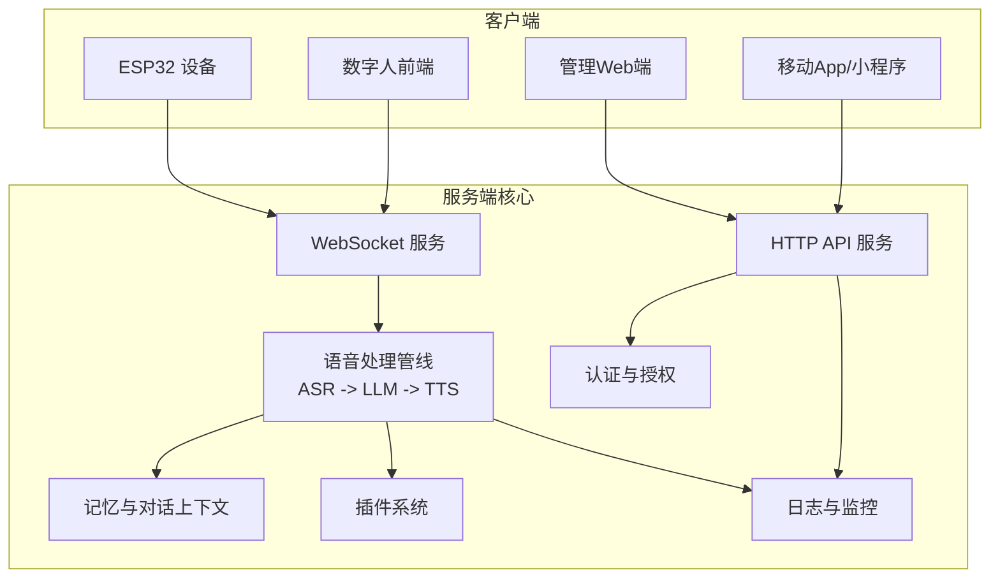
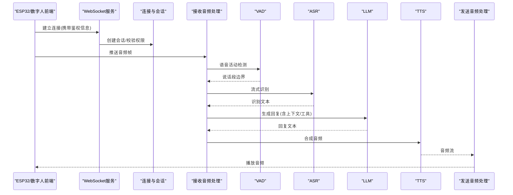
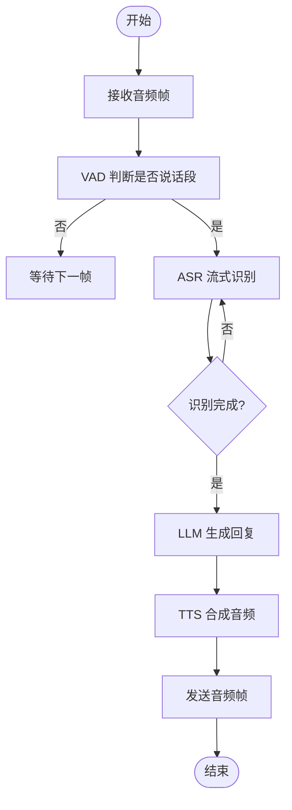
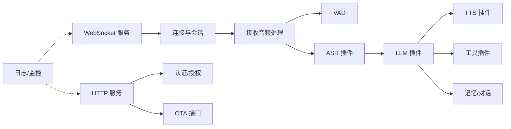

# 核心功能

<cite>
**本文引用的文件**   
- [app.py](file://main/xiaozhi-server/app.py)
- [websocket_server.py](file://main/xiaozhi-server/core/websocket_server.py)
- [http_server.py](file://main/xiaozhi-server/core/http_server.py)
- [connection.py](file://main/xiaozhi-server/core/connection.py)
- [auth.py](file://main/xiaozhi-server/core/auth.py)
- [receiveAudioHandle.py](file://main/xiaozhi-server/core/handle/receiveAudioHandle.py)
- [sendAudioHandle.py](file://main/xiaozhi-server/core/handle/sendAudioHandle.py)
- [textMessageProcessor.py](file://main/xiaozhi-server/core/handle/textMessageProcessor.py)
- [intentHandler.py](file://main/xiaozhi-server/core/handle/intentHandler.py)
- [asr.py](file://main/xiaozhi-server/core/utils/asr.py)
- [llm.py](file://main/xiaozhi-server/core/utils/llm.py)
- [tts.py](file://main/xiaozhi-server/core/utils/tts.py)
- [vad.py](file://main/xiaozhi-server/core/utils/vad.py)
- [memory.py](file://main/xiaozhi-server/core/utils/memory.py)
- [dialogue.py](file://main/xiaozhi-server/core/utils/dialogue.py)
- [prompt_manager.py](file://main/xiaozhi-server/core/utils/prompt_manager.py)
- [voiceprint_provider.py](file://main/xiaozhi-server/core/utils/voiceprint_provider.py)
- [wakeup_word.py](file://main/xiaozhi-server/core/utils/wakeup_word.py)
- [loadplugins.py](file://main/xiaozhi-server/plugins_func/loadplugins.py)
- [register.py](file://main/xiaozhi-server/plugins_func/register.py)
- [ota_handler.py](file://main/xiaozhi-server/core/api/ota_handler.py)
- [vision_handler.py](file://main/xiaozhi-server/core/api/vision_handler.py)
- [config_loader.py](file://main/xiaozhi-server/config/config_loader.py)
- [settings.py](file://main/xiaozhi-server/config/settings.py)
- [logger.py](file://main/xiaozhi-server/config/logger.py)
- [index.html](file://main/digital-human/index.html)
- [app.js](file://main/digital-human/js/app.js)
- [live2d.js](file://main/digital-human/js/live2d/live2d.js)
- [audio](file://main/digital-human/js/core/audio)
- [network](file://main/digital-human/js/core/network)
- [wakeword_runtime](file://main/digital-human/wakeword_runtime)
</cite>

## 目录
1. [简介](#简介)
2. [项目结构](#项目结构)
3. [核心组件](#核心组件)
4. [架构总览](#架构总览)
5. [详细组件分析](#详细组件分析)
6. [依赖关系分析](#依赖关系分析)
7. [性能考量](#性能考量)
8. [故障排查指南](#故障排查指南)
9. [结论](#结论)
10. [附录](#附录)

## 简介
本文件面向 xiaozhi-esp32-server 项目的核心能力，系统性梳理语音处理管道（ASR、LLM、TTS）、设备管理（注册、配置、OTA）、用户系统（认证、授权、会话）、内容管理（知识库、对话历史、记忆）、插件体系（ASR/TTS/LLM 提供商与工具函数）、实时监控与日志、以及数字人交互等模块。文档以“从入口到处理”的视角，解释各模块的职责边界、数据流转与协作方式，并给出使用场景与实现原理说明，帮助读者快速掌握系统全貌。

## 项目结构
项目采用多子工程组织：
- main/xiaozhi-server：服务端核心，包含 WebSocket/HTTP 服务、消息处理管线、ASR/LLM/TTS/VAD/Memory 等能力与插件机制
- main/digital-human：数字人前端与唤醒词运行时，提供 Live2D 动画、音频采集/播放、网络通信与唤醒检测
- main/manager-web、main/manager-mobile、main/miniprogram：管理与移动端界面，用于设备管理、用户与权限、知识库、OTA 升级等
- docs：部署与集成文档（阿里云 SAE/ACK、RAGFlow、HomeAssistant、MCP 等）

图表来源
- [websocket_server.py](file://main/xiaozhi-server/core/websocket_server.py)
- [http_server.py](file://main/xiaozhi-server/core/http_server.py)
- [receiveAudioHandle.py](file://main/xiaozhi-server/core/handle/receiveAudioHandle.py)
- [sendAudioHandle.py](file://main/xiaozhi-server/core/handle/sendAudioHandle.py)
- [textMessageProcessor.py](file://main/xiaozhi-server/core/handle/textMessageProcessor.py)
- [intentHandler.py](file://main/xiaozhi-server/core/handle/intentHandler.py)
- [asr.py](file://main/xiaozhi-server/core/utils/asr.py)
- [llm.py](file://main/xiaozhi-server/core/utils/llm.py)
- [tts.py](file://main/xiaozhi-server/core/utils/tts.py)
- [memory.py](file://main/xiaozhi-server/core/utils/memory.py)
- [dialogue.py](file://main/xiaozhi-server/core/utils/dialogue.py)
- [prompt_manager.py](file://main/xiaozhi-server/core/utils/prompt_manager.py)
- [loadplugins.py](file://main/xiaozhi-server/plugins_func/loadplugins.py)
- [register.py](file://main/xiaozhi-server/plugins_func/register.py)
- [auth.py](file://main/xiaozhi-server/core/auth.py)
- [logger.py](file://main/xiaozhi-server/config/logger.py)

章节来源
- [app.py](file://main/xiaozhi-server/app.py)
- [websocket_server.py](file://main/xiaozhi-server/core/websocket_server.py)
- [http_server.py](file://main/xiaozhi-server/core/http_server.py)

## 核心组件
- 语音处理管道
  - ASR：将设备上传的音频流识别为文本，支持多种提供商与流式处理
  - VAD：语音活动检测，自动切分说话段，降低误触发与延迟
  - LLM：大语言模型生成回复文本，支持提示词模板、上下文注入与工具调用
  - TTS：将文本合成为音频流返回设备，支持多提供商与音色控制
- 设备管理
  - 设备注册与绑定、参数下发、状态上报
  - OTA 升级：通过 HTTP 接口获取固件版本与下载包，驱动设备升级
- 用户系统
  - 认证与授权：JWT/Token 鉴权、角色权限控制
  - 会话管理：WebSocket 连接与会话生命周期、断线重连
- 内容管理
  - 知识库：文档/问答条目管理，供 LLM 检索增强
  - 对话历史：会话级聊天记录持久化与回溯
  - 记忆系统：长期/短期记忆、人物画像、偏好与事件锚点
- 插件系统
  - ASR/TTS/LLM 提供商插件：统一接口接入不同厂商
  - 工具函数插件：天气、日历、智能家居控制等扩展能力
- 实时监控与日志
  - 结构化日志、指标上报、错误追踪
- 数字人交互
  - 前端 Live2D 动画、音频采集/播放、唤醒词检测、与后端实时音视频通道对接

章节来源
- [receiveAudioHandle.py](file://main/xiaozhi-server/core/handle/receiveAudioHandle.py)
- [sendAudioHandle.py](file://main/xiaozhi-server/core/handle/sendAudioHandle.py)
- [textMessageProcessor.py](file://main/xiaozhi-server/core/handle/textMessageProcessor.py)
- [intentHandler.py](file://main/xiaozhi-server/core/handle/intentHandler.py)
- [asr.py](file://main/xiaozhi-server/core/utils/asr.py)
- [llm.py](file://main/xiaozhi-server/core/utils/llm.py)
- [tts.py](file://main/xiaozhi-server/core/utils/tts.py)
- [vad.py](file://main/xiaozhi-server/core/utils/vad.py)
- [memory.py](file://main/xiaozhi-server/core/utils/memory.py)
- [dialogue.py](file://main/xiaozhi-server/core/utils/dialogue.py)
- [prompt_manager.py](file://main/xiaozhi-server/core/utils/prompt_manager.py)
- [loadplugins.py](file://main/xiaozhi-server/plugins_func/loadplugins.py)
- [register.py](file://main/xiaozhi-server/plugins_func/register.py)
- [ota_handler.py](file://main/xiaozhi-server/core/api/ota_handler.py)
- [vision_handler.py](file://main/xiaozhi-server/core/api/vision_handler.py)
- [index.html](file://main/digital-human/index.html)
- [app.js](file://main/digital-human/js/app.js)
- [live2d.js](file://main/digital-human/js/live2d/live2d.js)
- [wakeword_runtime](file://main/digital-human/wakeword_runtime)

## 架构总览
整体采用“设备/前端 <-> 服务端 <-> 外部服务”的分层架构。设备通过 WebSocket 推送音频帧，服务端在连接层进行鉴权与会话绑定；音频进入 VAD 切分后交由 ASR 转写，文本进入 LLM 生成回复，再由 TTS 合成音频回推设备。HTTP 接口承载管理面能力（设备、用户、OTA、知识库等）。插件体系对 ASR/TTS/LLM 及工具函数进行解耦，便于替换与扩展。

图表来源
- [websocket_server.py](file://main/xiaozhi-server/core/websocket_server.py)
- [connection.py](file://main/xiaozhi-server/core/connection.py)
- [receiveAudioHandle.py](file://main/xiaozhi-server/core/handle/receiveAudioHandle.py)
- [sendAudioHandle.py](file://main/xiaozhi-server/core/handle/sendAudioHandle.py)
- [vad.py](file://main/xiaozhi-server/core/utils/vad.py)
- [asr.py](file://main/xiaozhi-server/core/utils/asr.py)
- [llm.py](file://main/xiaozhi-server/core/utils/llm.py)
- [tts.py](file://main/xiaozhi-server/core/utils/tts.py)

## 详细组件分析

### 语音处理管道（ASR → LLM → TTS）
- 设计要点
  - 流式处理：音频帧到达即入队，VAD 切分说话段，ASR 增量识别，LLM 流式响应，TTS 边生成边编码输出
  - 可插拔提供商：ASR/TTS/LLM 均通过统一接口抽象，支持热切换与降级
  - 上下文与记忆：对话历史与记忆系统为 LLM 提供个性化与连续性
- 关键流程
  - 音频接收与切分：按静音阈值与能量阈值判定句末，减少长尾延迟
  - 识别与理解：ASR 输出文本经意图识别或 Prompt 注入，交给 LLM 生成
  - 合成与播放：TTS 根据音色/语速/音量参数合成，按帧回推设备
- 使用场景
  - 实时语音对话、技能执行（如开关灯、查天气）、知识问答、情感陪伴
- 实现原理亮点
  - 低延迟链路：VAD+流式ASR+流式LLM+流式TTS 端到端优化
  - 容错与重试：失败时回退至备用提供商或缓存结果
  - 资源隔离：按会话隔离线程/队列，避免相互阻塞

图表来源
- [receiveAudioHandle.py](file://main/xiaozhi-server/core/handle/receiveAudioHandle.py)
- [sendAudioHandle.py](file://main/xiaozhi-server/core/handle/sendAudioHandle.py)
- [vad.py](file://main/xiaozhi-server/core/utils/vad.py)
- [asr.py](file://main/xiaozhi-server/core/utils/asr.py)
- [llm.py](file://main/xiaozhi-server/core/utils/llm.py)
- [tts.py](file://main/xiaozhi-server/core/utils/tts.py)

章节来源
- [receiveAudioHandle.py](file://main/xiaozhi-server/core/handle/receiveAudioHandle.py)
- [sendAudioHandle.py](file://main/xiaozhi-server/core/handle/sendAudioHandle.py)
- [vad.py](file://main/xiaozhi-server/core/utils/vad.py)
- [asr.py](file://main/xiaozhi-server/core/utils/asr.py)
- [llm.py](file://main/xiaozhi-server/core/utils/llm.py)
- [tts.py](file://main/xiaozhi-server/core/utils/tts.py)

### 设备管理（注册、配置、OTA）
- 设备注册与绑定
  - 设备首次上电发起注册请求，服务器分配唯一标识并绑定用户/租户
  - 配置项（ASR/TTS/LLM 提供商、音色、唤醒词等）通过配置中心下发
- OTA 升级
  - 管理端发布新版本，设备定时查询版本并拉取固件包
  - 升级过程具备完整性校验与回滚策略
- 使用场景
  - 批量部署、灰度升级、远程诊断与参数调优
- 实现原理亮点
  - 安全传输：HTTPS + 签名校验
  - 断点续传与分块下载，提升弱网稳定性

章节来源
- [ota_handler.py](file://main/xiaozhi-server/core/api/ota_handler.py)
- [http_server.py](file://main/xiaozhi-server/core/http_server.py)

### 用户系统（认证、授权、会话管理）
- 认证与授权
  - 登录态校验（Token/JWT），基于角色的访问控制（RBAC）
  - 敏感操作二次确认与审计日志
- 会话管理
  - WebSocket 连接与会话绑定，心跳保活与异常恢复
  - 会话级上下文隔离，防止跨会话数据泄露
- 使用场景
  - 多用户共享设备、企业租户隔离、权限精细化管控
- 实现原理亮点
  - 无状态鉴权 + 可选会话存储，兼顾扩展性与一致性

章节来源
- [auth.py](file://main/xiaozhi-server/core/auth.py)
- [connection.py](file://main/xiaozhi-server/core/connection.py)
- [websocket_server.py](file://main/xiaozhi-server/core/websocket_server.py)

### 内容管理（知识库、对话历史、记忆系统）
- 知识库
  - 文档入库、向量化检索、Prompt 增强，提高回答准确性
- 对话历史
  - 会话级记录，支持分页查询与摘要压缩
- 记忆系统
  - 长期记忆（人物画像、偏好、事件）、短期记忆（最近对话片段）
  - 记忆更新策略（增量写入、去重、过期清理）
- 使用场景
  - 个性化推荐、连续对话、智能客服、情感陪伴
- 实现原理亮点
  - 分层记忆：短期/长期分离，按需召回，降低 LLM 输入成本

章节来源
- [memory.py](file://main/xiaozhi-server/core/utils/memory.py)
- [dialogue.py](file://main/xiaozhi-server/core/utils/dialogue.py)
- [prompt_manager.py](file://main/xiaozhi-server/core/utils/prompt_manager.py)

### 插件系统（ASR/TTS/LLM 提供商与工具函数）
- 提供商插件
  - 统一接口封装不同 ASR/TTS/LLM 供应商，支持动态加载与热切换
- 工具函数插件
  - 天气、日历、智能家居控制、搜索等能力以插件形式扩展
- 使用场景
  - 多厂商兼容、A/B 测试、按场景选择最优提供商
- 实现原理亮点
  - 注册表模式：集中注册与发现，解耦调用方与实现方

章节来源
- [loadplugins.py](file://main/xiaozhi-server/plugins_func/loadplugins.py)
- [register.py](file://main/xiaozhi-server/plugins_func/register.py)
- [asr.py](file://main/xiaozhi-server/core/utils/asr.py)
- [tts.py](file://main/xiaozhi-server/core/utils/tts.py)
- [llm.py](file://main/xiaozhi-server/core/utils/llm.py)

### 实时监控与日志
- 日志
  - 结构化日志（JSON）、分级输出、按模块/会话聚合
- 监控
  - 关键指标（QPS、延迟、错误率、资源占用）上报
  - 告警规则与可视化看板
- 使用场景
  - 线上排障、容量规划、质量度量
- 实现原理亮点
  - 异步落盘与采样策略，降低对主链路影响

章节来源
- [logger.py](file://main/xiaozhi-server/config/logger.py)

### 数字人交互
- 前端能力
  - Live2D 动画渲染、音频采集/播放、UI 控制器
  - 唤醒词检测（本地运行时），降低云端压力
- 后端对接
  - 通过 WebSocket 与语音处理管道联动，实现“说-听-看”一体化体验
- 使用场景
  - 虚拟助手、陪伴机器人、教育互动
- 实现原理亮点
  - 本地唤醒 + 云端推理，平衡隐私与性能

章节来源
- [index.html](file://main/digital-human/index.html)
- [app.js](file://main/digital-human/js/app.js)
- [live2d.js](file://main/digital-human/js/live2d/live2d.js)
- [wakeword_runtime](file://main/digital-human/wakeword_runtime)

## 依赖关系分析
- 模块耦合
  - 语音处理管线强依赖 ASR/LLM/TTS/VAD 与记忆/对话上下文
  - 设备/用户管理依赖认证与配置中心
  - 插件系统通过注册表与统一接口解耦
- 外部依赖
  - 第三方 ASR/TTS/LLM 提供商、向量数据库、对象存储（知识库素材）
- 潜在风险
  - 外部服务超时/限流需熔断与降级
  - 大模型输入过长导致延迟上升，需上下文裁剪

图表来源
- [websocket_server.py](file://main/xiaozhi-server/core/websocket_server.py)
- [connection.py](file://main/xiaozhi-server/core/connection.py)
- [receiveAudioHandle.py](file://main/xiaozhi-server/core/handle/receiveAudioHandle.py)
- [asr.py](file://main/xiaozhi-server/core/utils/asr.py)
- [llm.py](file://main/xiaozhi-server/core/utils/llm.py)
- [tts.py](file://main/xiaozhi-server/core/utils/tts.py)
- [memory.py](file://main/xiaozhi-server/core/utils/memory.py)
- [dialogue.py](file://main/xiaozhi-server/core/utils/dialogue.py)
- [http_server.py](file://main/xiaozhi-server/core/http_server.py)
- [auth.py](file://main/xiaozhi-server/core/auth.py)
- [ota_handler.py](file://main/xiaozhi-server/core/api/ota_handler.py)
- [logger.py](file://main/xiaozhi-server/config/logger.py)

章节来源
- [websocket_server.py](file://main/xiaozhi-server/core/websocket_server.py)
- [http_server.py](file://main/xiaozhi-server/core/http_server.py)
- [connection.py](file://main/xiaozhi-server/core/connection.py)
- [auth.py](file://main/xiaozhi-server/core/auth.py)
- [loadplugins.py](file://main/xiaozhi-server/plugins_func/loadplugins.py)
- [register.py](file://main/xiaozhi-server/plugins_func/register.py)

## 性能考量
- 端到端延迟优化
  - VAD 精准切分、ASR 流式识别、LLM 流式输出、TTS 边生成边编码
  - 合理设置缓冲与批大小，避免抖动
- 吞吐与并发
  - 连接池与线程池隔离，按会话分配资源
  - 热点路径异步化，I/O 与计算分离
- 资源与成本
  - 记忆与对话历史压缩、按需召回，降低 LLM 输入长度
  - 提供商降级与缓存命中，减少昂贵调用
- 可靠性
  - 超时、重试、熔断、幂等设计
  - 健康检查与自动扩缩容

[本节为通用指导，不直接分析具体文件]

## 故障排查指南
- 常见问题定位
  - 音频卡顿/丢帧：检查 VAD 阈值、网络抖动、编码器参数
  - 识别不准：核对 ASR 提供商配置、噪声环境、麦克风增益
  - 回复延迟高：查看 LLM 提供商 QPS/限流、上下文长度、工具调用链
  - 合成音质差：调整 TTS 音色/语速、码率与采样率
- 日志与监控
  - 启用结构化日志，按会话 ID 过滤
  - 关注错误率、P95/P99 延迟、内存/CPU 峰值
- 建议步骤
  - 复现最小用例，逐步关闭插件/记忆/工具，定位瓶颈
  - 对比不同提供商与参数组合，回归验证

章节来源
- [logger.py](file://main/xiaozhi-server/config/logger.py)
- [receiveAudioHandle.py](file://main/xiaozhi-server/core/handle/receiveAudioHandle.py)
- [sendAudioHandle.py](file://main/xiaozhi-server/core/handle/sendAudioHandle.py)
- [asr.py](file://main/xiaozhi-server/core/utils/asr.py)
- [llm.py](file://main/xiaozhi-server/core/utils/llm.py)
- [tts.py](file://main/xiaozhi-server/core/utils/tts.py)

## 结论
xiaozhi-esp32-server 以“语音处理管道”为核心，结合设备管理、用户系统、内容管理与插件体系，形成可扩展、可观测、可运维的完整解决方案。通过流式设计与插件化架构，系统在延迟、成本与可定制性之间取得良好平衡。数字人交互进一步提升了用户体验与互动性。建议在生产环境中重点关注性能调优、容错降级与监控告警，确保稳定高效运行。

[本节为总结性内容，不直接分析具体文件]

## 附录

### 功能特性对比表
- 语音处理管道
  - 能力：流式 ASR/LLM/TTS、VAD、记忆注入、工具调用
  - 优势：低延迟、可插拔、上下文丰富
  - 适用：实时对话、技能执行、知识问答
- 设备管理
  - 能力：注册绑定、配置下发、OTA 升级
  - 优势：安全、可靠、可灰度
  - 适用：批量部署、远程运维
- 用户系统
  - 能力：认证授权、会话隔离、权限控制
  - 优势：无状态鉴权、细粒度权限
  - 适用：多租户、企业级应用
- 内容管理
  - 能力：知识库、对话历史、记忆系统
  - 优势：个性化、连续性、可控成本
  - 适用：智能客服、陪伴机器人
- 插件系统
  - 能力：ASR/TTS/LLM 提供商、工具函数
  - 优势：解耦、热切换、生态扩展
  - 适用：多厂商兼容、A/B 测试
- 监控与日志
  - 能力：结构化日志、指标上报、告警
  - 优势：可观测、易定位
  - 适用：生产运维
- 数字人交互
  - 能力：Live2D、唤醒词、音视频同步
  - 优势：沉浸式体验、本地唤醒
  - 适用：虚拟助手、教育互动

[本节为概念性内容，不直接分析具体文件]