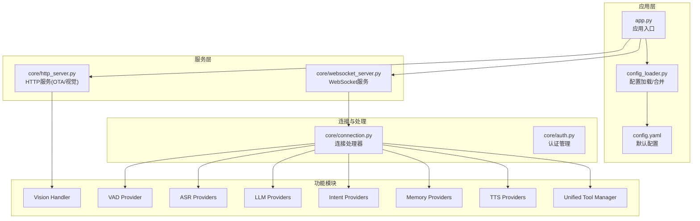
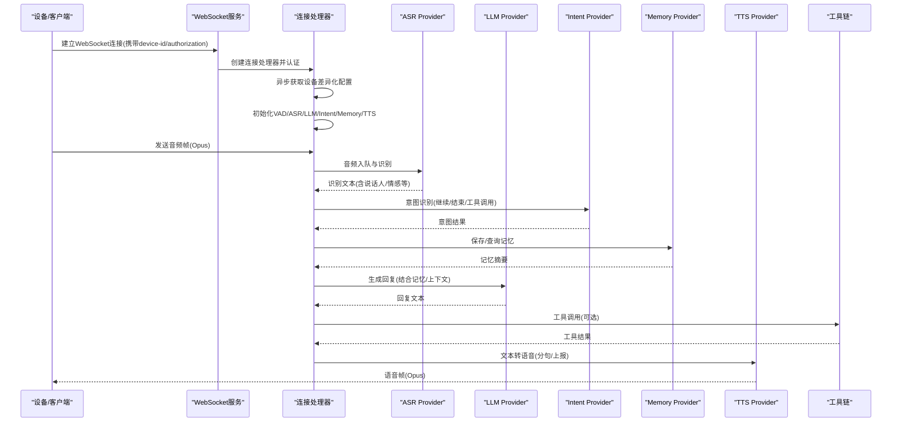
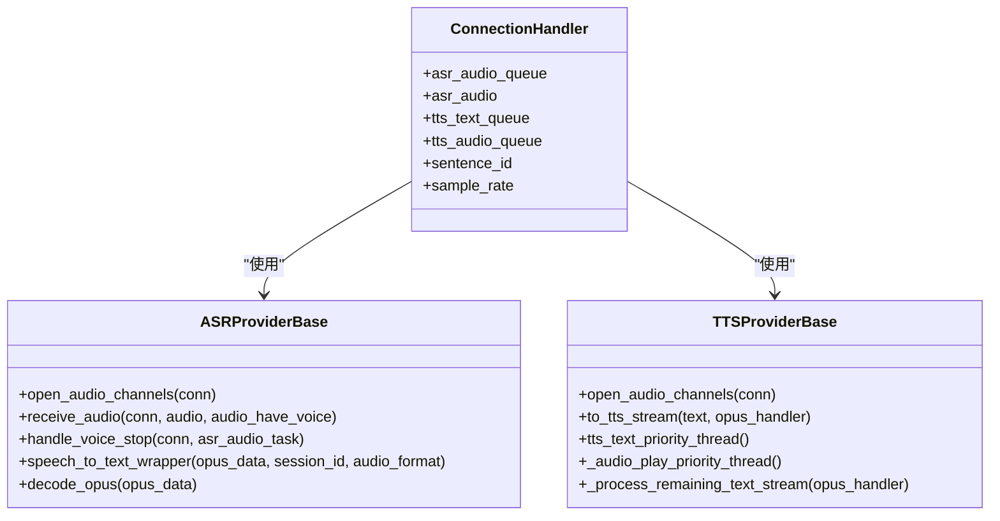
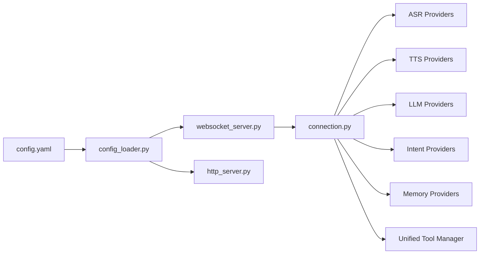

# 核心功能特性

<cite>
**本文引用的文件**
- [main/xiaozhi-server/app.py](file://main/xiaozhi-server/app.py)
- [main/xiaozhi-server/config/settings.py](file://main/xiaozhi-server/config/settings.py)
- [main/xiaozhi-server/core/http_server.py](file://main/xiaozhi-server/core/http_server.py)
- [main/xiaozhi-server/core/websocket_server.py](file://main/xiaozhi-server/core/websocket_server.py)
- [main/xiaozhi-server/core/connection.py](file://main/xiaozhi-server/core/connection.py)
- [main/xiaozhi-server/config/config_loader.py](file://main/xiaozhi-server/config/config_loader.py)
- [main/xiaozhi-server/config.yaml](file://main/xiaozhi-server/config.yaml)
- [main/xiaozhi-server/core/providers/asr/base.py](file://main/xiaozhi-server/core/providers/asr/base.py)
- [main/xiaozhi-server/core/providers/tts/base.py](file://main/xiaozhi-server/core/providers/tts/base.py)
- [main/xiaozhi-server/core/providers/memory/base.py](file://main/xiaozhi-server/core/providers/memory/base.py)
- [main/xiaozhi-server/core/providers/intent/base.py](file://main/xiaozhi-server/core/providers/intent/base.py)
- [main/xiaozhi-server/plugins_func/loadplugins.py](file://main/xiaozhi-server/plugins_func/loadplugins.py)
</cite>

## 目录
1. [简介](#简介)
2. [项目结构](#项目结构)
3. [核心组件](#核心组件)
4. [架构总览](#架构总览)
5. [详细组件分析](#详细组件分析)
6. [依赖分析](#依赖分析)
7. [性能考虑](#性能考虑)
8. [故障排查指南](#故障排查指南)
9. [结论](#结论)
10. [附录](#附录)

## 简介
本文件面向小智ESP32服务器项目，系统性梳理其核心功能特性与实现原理，涵盖语音交互系统（流式ASR/VAD/TTS）、智能对话能力、视觉感知系统、意图识别机制、记忆存储系统、知识库集成、工具调用机制、指令下发系统等。文档强调模块间协作关系与数据流转过程，提供使用示例与最佳实践建议，帮助开发者与运维人员快速理解并高效部署。

## 项目结构
小智ESP32服务器采用“Python + WebSocket + 多Provider适配”的架构设计，核心由应用入口、配置加载、HTTP与WebSocket服务、连接处理器、各功能模块Provider与工具链组成。配置文件支持本地与“智控台”两种来源，具备按设备差异化下发的能力。

图表来源
- [main/xiaozhi-server/app.py:46-130](file://main/xiaozhi-server/app.py#L46-L130)
- [main/xiaozhi-server/core/http_server.py:10-93](file://main/xiaozhi-server/core/http_server.py#L10-L93)
- [main/xiaozhi-server/core/websocket_server.py:42-80](file://main/xiaozhi-server/core/websocket_server.py#L42-L80)
- [main/xiaozhi-server/core/connection.py:77-120](file://main/xiaozhi-server/core/connection.py#L77-L120)

章节来源
- [main/xiaozhi-server/app.py:46-130](file://main/xiaozhi-server/app.py#L46-L130)
- [main/xiaozhi-server/config/settings.py:9-34](file://main/xiaozhi-server/config/settings.py#L9-L34)
- [main/xiaozhi-server/core/http_server.py:10-93](file://main/xiaozhi-server/core/http_server.py#L10-L93)
- [main/xiaozhi-server/core/websocket_server.py:42-80](file://main/xiaozhi-server/core/websocket_server.py#L42-L80)
- [main/xiaozhi-server/core/connection.py:77-120](file://main/xiaozhi-server/core/connection.py#L77-L120)

## 核心组件
- 应用入口与生命周期管理：负责配置加载、服务启动、信号处理与优雅关闭。
- 配置系统：支持本地config.yaml与“智控台”下发配置，合并策略与缓存管理。
- 服务层：HTTP服务提供OTA与视觉分析接口；WebSocket服务承载实时语音/文本交互。
- 连接处理器：统一处理设备认证、差异化配置、组件初始化、VAD/ASR/TTS/LLM/Intent/Memory/工具链调度。
- 功能模块Provider：抽象基类定义统一接口，具体实现适配多家厂商与本地模型。
- 工具与插件：统一工具管理器与插件自动加载机制，支持设备IoT、MCP端点、服务器侧插件等。

章节来源
- [main/xiaozhi-server/app.py:46-130](file://main/xiaozhi-server/app.py#L46-L130)
- [main/xiaozhi-server/config/config_loader.py:27-94](file://main/xiaozhi-server/config/config_loader.py#L27-L94)
- [main/xiaozhi-server/core/websocket_server.py:42-80](file://main/xiaozhi-server/core/websocket_server.py#L42-L80)
- [main/xiaozhi-server/core/connection.py:77-120](file://main/xiaozhi-server/core/connection.py#L77-L120)
- [main/xiaozhi-server/core/providers/asr/base.py:32-60](file://main/xiaozhi-server/core/providers/asr/base.py#L32-L60)
- [main/xiaozhi-server/core/providers/tts/base.py:33-60](file://main/xiaozhi-server/core/providers/tts/base.py#L33-L60)
- [main/xiaozhi-server/core/providers/memory/base.py:8-29](file://main/xiaozhi-server/core/providers/memory/base.py#L8-L29)
- [main/xiaozhi-server/core/providers/intent/base.py:9-34](file://main/xiaozhi-server/core/providers/intent/base.py#L9-L34)
- [main/xiaozhi-server/plugins_func/loadplugins.py:9-25](file://main/xiaozhi-server/plugins_func/loadplugins.py#L9-L25)

## 架构总览
系统采用“服务-连接-模块Provider”的分层架构。WebSocket作为统一入口，连接处理器在后台异步拉取设备差异化配置，按需初始化VAD/ASR/LLM/Intent/Memory/TTS等模块；HTTP服务提供OTA与视觉分析能力；工具链统一调度IoT/MCP/服务器插件等外部能力。

图表来源
- [main/xiaozhi-server/core/websocket_server.py:108-145](file://main/xiaozhi-server/core/websocket_server.py#L108-L145)
- [main/xiaozhi-server/core/connection.py:340-406](file://main/xiaozhi-server/core/connection.py#L340-L406)
- [main/xiaozhi-server/core/providers/asr/base.py:84-180](file://main/xiaozhi-server/core/providers/asr/base.py#L84-L180)
- [main/xiaozhi-server/core/providers/tts/base.py:368-470](file://main/xiaozhi-server/core/providers/tts/base.py#L368-L470)

## 详细组件分析

### 语音交互系统（VAD/ASR/流式TTS）
- VAD：基于本地模型，用于检测语音活动，配合ASR在合适时机触发识别。
- ASR：支持多家厂商与本地模型，统一抽象基类，提供音频解码、并发识别与声纹信息增强、上报与日志记录。
- TTS：支持文本到语音与文件到音频流，具备分句、标点截断、替换词正则、Opus编码、上报与输出计数。

图表来源
- [main/xiaozhi-server/core/providers/asr/base.py:32-180](file://main/xiaozhi-server/core/providers/asr/base.py#L32-L180)
- [main/xiaozhi-server/core/providers/tts/base.py:33-120](file://main/xiaozhi-server/core/providers/tts/base.py#L33-L120)
- [main/xiaozhi-server/core/connection.py:153-177](file://main/xiaozhi-server/core/connection.py#L153-L177)

章节来源
- [main/xiaozhi-server/core/providers/asr/base.py:32-180](file://main/xiaozhi-server/core/providers/asr/base.py#L32-L180)
- [main/xiaozhi-server/core/providers/tts/base.py:33-120](file://main/xiaozhi-server/core/providers/tts/base.py#L33-L120)
- [main/xiaozhi-server/core/connection.py:153-177](file://main/xiaozhi-server/core/connection.py#L153-L177)

### 智能对话能力（LLM/提示词/上下文）
- LLM Provider：统一抽象，适配多家模型服务与本地推理引擎。
- 提示词与上下文：PromptManager动态注入设备IP、宠物信息、今日心情等上下文，增强个性化体验。
- 对话历史：Dialogue对象维护消息序列，Memory Provider可进行检索与总结。

章节来源
- [main/xiaozhi-server/config.yaml:190-217](file://main/xiaozhi-server/config.yaml#L190-L217)
- [main/xiaozhi-server/core/connection.py:540-550](file://main/xiaozhi-server/core/connection.py#L540-L550)
- [main/xiaozhi-server/core/providers/memory/base.py:16-29](file://main/xiaozhi-server/core/providers/memory/base.py#L16-L29)

### 视觉感知系统（MCP视觉分析）
- HTTP服务提供视觉分析接口，用于图像理解与解释，支持JWT鉴权与跨域OPTIONS预检。
- 与WebSocket服务协同，统一鉴权与地址输出。

章节来源
- [main/xiaozhi-server/core/http_server.py:66-76](file://main/xiaozhi-server/core/http_server.py#L66-L76)
- [main/xiaozhi-server/app.py:94-108](file://main/xiaozhi-server/app.py#L94-L108)

### 意图识别机制（Intent）
- 支持“无意图”、“意图LLM”、“函数调用”三种模式。
- “函数调用”模式下，通过few-shot注入工具调用与直接回复示例，提升触发准确性与稳定性。

章节来源
- [main/xiaozhi-server/core/providers/intent/base.py:20-34](file://main/xiaozhi-server/core/providers/intent/base.py#L20-L34)
- [main/xiaozhi-server/core/connection.py:551-610](file://main/xiaozhi-server/core/connection.py#L551-L610)

### 记忆存储系统（Memory）
- 支持多种Provider：本地短期记忆、mem0ai、PowerMem（OceanBase/SQLite等）等。
- 提供保存与查询接口，可与LLM结合进行记忆总结与检索。

章节来源
- [main/xiaozhi-server/core/providers/memory/base.py:16-29](file://main/xiaozhi-server/core/providers/memory/base.py#L16-L29)
- [main/xiaozhi-server/config.yaml:278-342](file://main/xiaozhi-server/config.yaml#L278-L342)

### 知识库集成
- 通过插件与工具链对接RAG/知识库，支持检索增强问答与外部知识调用。

章节来源
- [main/xiaozhi-server/config.yaml:165-174](file://main/xiaozhi-server/config.yaml#L165-L174)
- [main/xiaozhi-server/plugins_func/loadplugins.py:9-25](file://main/xiaozhi-server/plugins_func/loadplugins.py#L9-L25)

### 工具调用机制（Unified Tool Manager）
- 统一工具管理器与执行器，支持设备IoT、MCP端点、服务器插件等。
- 插件自动加载，按需注册函数，实现“按需调用、快速响应”。

章节来源
- [main/xiaozhi-server/core/connection.py:170-171](file://main/xiaozhi-server/core/connection.py#L170-L171)
- [main/xiaozhi-server/plugins_func/loadplugins.py:9-25](file://main/xiaozhi-server/plugins_func/loadplugins.py#L9-L25)

### 指令下发系统（OTA/视觉/心跳）
- OTA接口：HTTP服务提供OTA升级与下载能力，支持简单单机部署场景。
- 视觉分析：HTTP服务提供MCP视觉分析接口，统一鉴权与地址输出。
- 心跳保活：可配置WebSocket心跳保活机制，提升连接稳定性。

章节来源
- [main/xiaozhi-server/core/http_server.py:45-76](file://main/xiaozhi-server/core/http_server.py#L45-L76)
- [main/xiaozhi-server/app.py:85-130](file://main/xiaozhi-server/app.py#L85-L130)
- [main/xiaozhi-server/config.yaml:74-76](file://main/xiaozhi-server/config.yaml#L74-L76)

## 依赖分析
- 组件耦合：连接处理器对各Provider强依赖，但通过抽象基类降低耦合；工具链与插件通过注册机制解耦。
- 外部依赖：多家LLM/TTS/ASR厂商SDK、本地模型（SenseVoice、SileroVAD）、OPUS编解码、MQTT/UDP网关等。
- 配置依赖：本地配置与“智控台”配置合并，支持按设备差异化下发。

图表来源
- [main/xiaozhi-server/config.yaml:218-277](file://main/xiaozhi-server/config.yaml#L218-L277)
- [main/xiaozhi-server/config/config_loader.py:27-94](file://main/xiaozhi-server/config/config_loader.py#L27-L94)
- [main/xiaozhi-server/core/websocket_server.py:42-62](file://main/xiaozhi-server/core/websocket_server.py#L42-L62)
- [main/xiaozhi-server/core/http_server.py:10-16](file://main/xiaozhi-server/core/http_server.py#L10-L16)
- [main/xiaozhi-server/core/connection.py:130-139](file://main/xiaozhi-server/core/connection.py#L130-L139)

章节来源
- [main/xiaozhi-server/config/config_loader.py:27-94](file://main/xiaozhi-server/config/config_loader.py#L27-L94)
- [main/xiaozhi-server/core/websocket_server.py:42-62](file://main/xiaozhi-server/core/websocket_server.py#L42-L62)
- [main/xiaozhi-server/core/http_server.py:10-16](file://main/xiaozhi-server/core/http_server.py#L10-L16)
- [main/xiaozhi-server/core/connection.py:130-139](file://main/xiaozhi-server/core/connection.py#L130-L139)

## 性能考虑
- 异步与并发：连接处理器使用线程池与事件循环分离，ASR/TTS分别消化队列，提升吞吐。
- 编解码与缓存：Opus解码与WAV转换按需生成，磁盘空间检查与临时文件清理降低IO风险。
- 上报与计数：TTS/ASR上报线程与输出计数器，便于运营与成本控制。
- 配置热更新：WebSocket服务支持配置热更新与组件重建，减少停机时间。

章节来源
- [main/xiaozhi-server/core/providers/asr/base.py:272-329](file://main/xiaozhi-server/core/providers/asr/base.py#L272-L329)
- [main/xiaozhi-server/core/providers/tts/base.py:193-258](file://main/xiaozhi-server/core/providers/tts/base.py#L193-L258)
- [main/xiaozhi-server/core/websocket_server.py:155-204](file://main/xiaozhi-server/core/websocket_server.py#L155-L204)

## 故障排查指南
- 配置问题：检查data/.config.yaml是否存在与格式正确；若启用“智控台”，确认URL与密钥配置。
- 认证失败：核对device-id与Authorization头；白名单设备可绕过Token校验。
- 音频解码错误：确认Opus包完整性与采样率匹配；关注解码器资源释放。
- 磁盘空间不足：ASR文件保存前进行空间检查，清理临时文件。
- 工具调用超时：调整tool_call_timeout与TTS超时参数，检查外部服务可用性。

章节来源
- [main/xiaozhi-server/config/settings.py:9-34](file://main/xiaozhi-server/config/settings.py#L9-L34)
- [main/xiaozhi-server/core/websocket_server.py:206-227](file://main/xiaozhi-server/core/websocket_server.py#L206-L227)
- [main/xiaozhi-server/core/providers/asr/base.py:348-382](file://main/xiaozhi-server/core/providers/asr/base.py#L348-L382)
- [main/xiaozhi-server/config.yaml:62-65](file://main/xiaozhi-server/config.yaml#L62-L65)

## 结论
小智ESP32服务器通过模块化Provider与统一连接处理器，实现了从语音到对话再到工具调用的完整闭环。依托灵活的配置体系与异步并发设计，系统在易扩展、可维护与性能方面取得平衡。建议在生产环境优先启用“智控台”配置下发、完善认证与日志监控，并结合工具链与知识库实现更丰富的业务场景。

## 附录
- 使用示例（概述）
  - 启动服务：运行应用入口，系统自动加载配置并启动HTTP与WebSocket服务。
  - 设备接入：通过WebSocket连接，携带device-id与Authorization头，系统异步下发差异化配置并初始化模块。
  - 语音交互：设备发送Opus音频帧，系统经VAD触发ASR，识别后进入意图识别与LLM生成，最终TTS返回语音。
  - 视觉分析：通过HTTP接口提交图像，系统返回视觉解释结果。
  - 工具调用：Intent识别为工具调用时，统一工具管理器执行IoT/MCP/服务器插件动作。
- 最佳实践
  - 优先使用“智控台”集中管理配置，按设备差异化下发。
  - 合理设置TTS/ASR超时与上报策略，保障用户体验与成本控制。
  - 为关键Provider配置白名单与限流，避免资源滥用。
  - 定期清理临时音频文件与日志，预留充足磁盘空间。