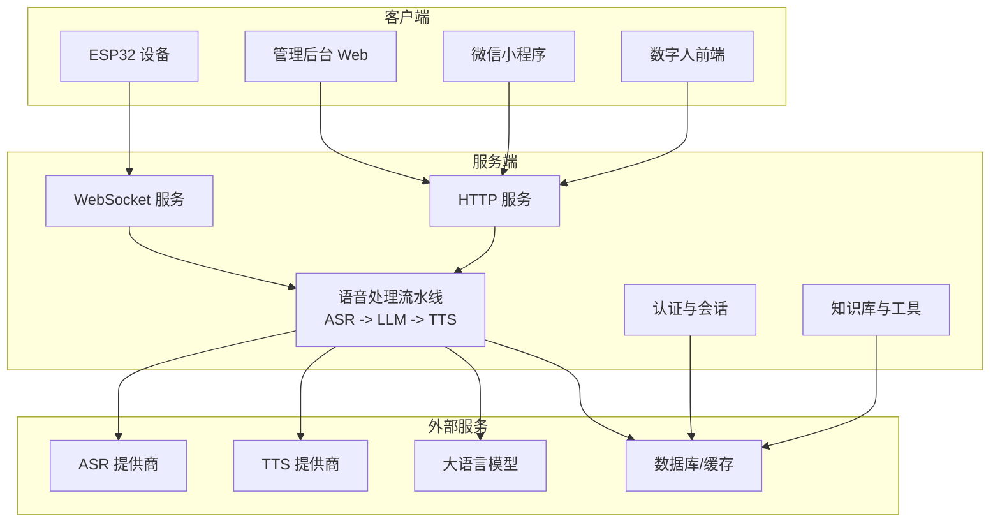
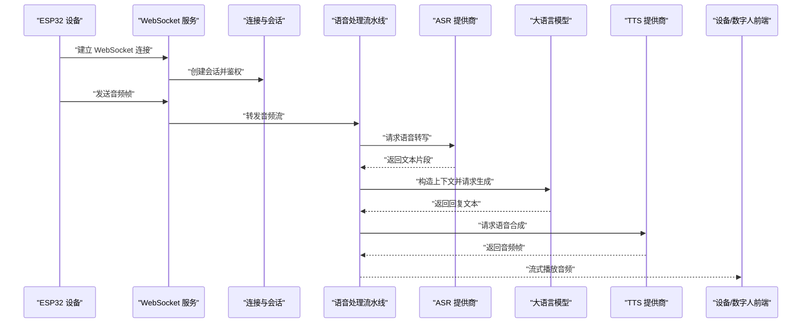
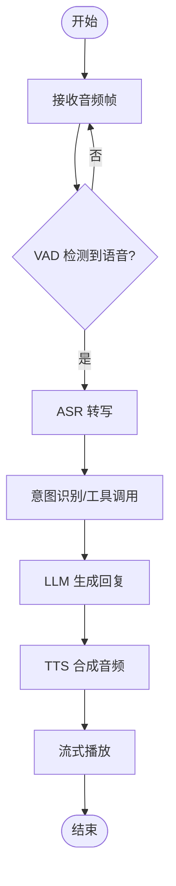
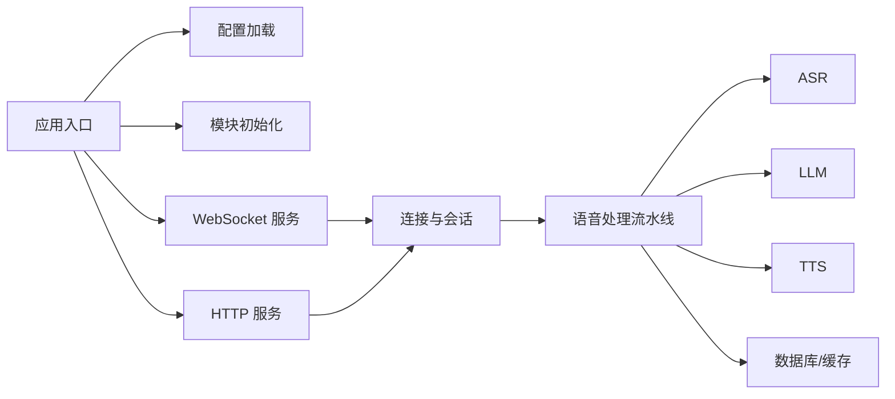

# 项目介绍

<cite>
**本文引用的文件**   
- [README.md](file://README.md)
- [app.py](file://main/xiaozhi-server/app.py)
- [websocket_server.py](file://main/xiaozhi-server/core/websocket_server.py)
- [http_server.py](file://main/xiaozhi-server/core/http_server.py)
- [connection.py](file://main/xiaozhi-server/core/connection.py)
- [settings.py](file://main/xiaozhi-server/config/settings.py)
- [config_loader.py](file://main/xiaozhi-server/config/config_loader.py)
- [receiveAudioHandle.py](file://main/xiaozhi-server/core/handle/receiveAudioHandle.py)
- [sendAudioHandle.py](file://main/xiaozhi-server/core/handle/sendAudioHandle.py)
- [textMessageHandlerRegistry.py](file://main/xiaozhi-server/core/handle/textMessageHandlerRegistry.py)
- [modules_initialize.py](file://main/xiaozhi-server/core/utils/modules_initialize.py)
- [index.html](file://main/digital-human/index.html)
- [start.py](file://main/digital-human/start.py)
- [manager-web/package.json](file://main/manager-web/package.json)
- [manager-api/pom.xml](file://main/manager-api/pom.xml)
- [egg-miniprogram/project.config.json](file://main/egg-miniprogram/project.config.json)
- [miniprogram/app.json](file://main/miniprogram/app.json)
- [docker-compose.yml](file://main/xiaozhi-server/docker-compose.yml)
- [Deployment.md](file://docs/Deployment.md)
- [architecture/xiaozhi-esp32-server-architecture.html](file://docs/architecture/xiaozhi-esp32-server-architecture.html)
</cite>

## 目录
1. [简介](#简介)
2. [项目结构](#项目结构)
3. [核心组件](#核心组件)
4. [架构总览](#架构总览)
5. [详细组件分析](#详细组件分析)
6. [依赖关系分析](#依赖关系分析)
7. [性能与扩展性](#性能与扩展性)
8. [故障排查指南](#故障排查指南)
9. [结论](#结论)
10. [附录](#附录)

## 简介
xiaozhi-esp32-server 是一个面向 ESP32 设备的综合性物联网语音交互平台，提供从设备接入、实时语音通信、ASR/TTS 多厂商集成、大语言模型对话、知识库管理、用户认证到数字人交互的一体化解决方案。项目以开源方式构建社区生态，支持智能家居控制、语音助手、教育陪伴、娱乐互动等丰富场景，帮助开发者快速落地“端-云-管”全链路语音智能应用。

主要特性概览：
- 多 ASR/TTS 提供商：可灵活接入多家语音识别与合成服务，满足差异化需求与成本优化。
- 大语言模型集成：统一 LLM 接口，支持多种模型与提示词工程，提升对话质量与可控性。
- 实时语音通信：基于 WebSocket 的流式音频传输，低延迟、高稳定。
- 设备管理与 OTA：集中管理设备状态、配置与固件升级。
- 用户认证与会话：完善的鉴权体系与上下文管理，保障安全与个性化体验。
- 知识库与工具链：内置知识库与插件化能力，增强业务语义理解与执行。
- 语音克隆与数字人：支持声音克隆与 Live2D 数字人交互，提升拟真度与沉浸感。
- 多端协同：Web 管理后台、移动端小程序、ESP32 设备与云端服务协同工作。

应用场景：
- 智能家居控制：通过语音指令联动家电与传感器，实现无屏交互。
- 语音助手：通用问答、日程提醒、天气查询、本地技能调用。
- 教育陪伴：儿童陪伴、学习辅导、故事讲述与互动游戏。
- 娱乐互动：数字人直播、角色扮演、语音聊天机器人。

开源与生态：
- 代码开源，文档完善，部署脚本与 Docker 编排齐全，便于二次开发与私有化部署。
- 与 HomeAssistant、RAGFlow、FishSpeech、FunASR 等生态组件深度集成，形成完整方案。

与其他项目的差异化优势：
- 端到端一体化：从设备侧到云端的全栈能力，减少集成复杂度。
- 模块化与插件化：ASR/TTS/LLM/VAD/Memory/Tools 等模块解耦，按需替换与扩展。
- 数字人与语音克隆：原生支持 Live2D 与声音克隆，打造拟真交互体验。
- 多端覆盖：Web、小程序、ESP32 设备与云端统一管理，降低开发门槛。

[本节未直接分析具体文件]

## 项目结构
项目采用前后端分离与多端协同的架构，核心由以下部分组成：
- 服务端（Python）：负责设备接入、会话管理、语音处理流水线、LLM 调用、TTS 合成、消息路由与 API 暴露。
- 管理后台（Vue Web）：设备管理、用户管理、模型配置、知识库、语音资源、角色与模板管理等。
- 移动端（微信小程序/UniApp）：用户交互、语音通话、设备绑定与管理、订阅与会员功能。
- 数字人前端（Live2D）：浏览器端数字人渲染与音视频同步播放。
- 基础设施：Docker Compose 编排、Nginx 反向代理、数据库与缓存。

图表来源
- [websocket_server.py:1-200](file://main/xiaozhi-server/core/websocket_server.py#L1-L200)
- [http_server.py:1-200](file://main/xiaozhi-server/core/http_server.py#L1-L200)
- [receiveAudioHandle.py:1-200](file://main/xiaozhi-server/core/handle/receiveAudioHandle.py#L1-L200)
- [sendAudioHandle.py:1-200](file://main/xiaozhi-server/core/handle/sendAudioHandle.py#L1-L200)
- [modules_initialize.py:1-200](file://main/xiaozhi-server/core/utils/modules_initialize.py#L1-L200)

章节来源
- [README.md:1-200](file://README.md#L1-L200)
- [docker-compose.yml:1-200](file://main/xiaozhi-server/docker-compose.yml#L1-L200)
- [Deployment.md:1-200](file://docs/Deployment.md#L1-L200)

## 核心组件
- 应用入口与初始化：应用启动时加载配置、初始化日志、注册处理器与插件、启动 HTTP/WebSocket 服务。
- 连接与会话管理：维护设备连接、鉴权、上下文与状态机，确保多设备并发下的稳定性。
- 语音处理流水线：接收音频流、VAD 检测、ASR 转写、意图识别、LLM 生成、TTS 合成与流式播放。
- 消息路由与文本处理：统一消息类型注册与分发，支持命令、事件与自定义协议。
- 模块初始化与依赖注入：按需提供 ASR/TTS/LLM/VAD/Memory/Tools 等模块实例，支持热插拔。
- 数字人交互：前端 Live2D 渲染与后端音视频流对接，实现拟真数字人对话。
- 管理后台与小程序：提供设备、用户、模型、知识库、语音资源、OTA 等管理能力。

章节来源
- [app.py:1-200](file://main/xiaozhi-server/app.py#L1-L200)
- [connection.py:1-200](file://main/xiaozhi-server/core/connection.py#L1-L200)
- [receiveAudioHandle.py:1-200](file://main/xiaozhi-server/core/handle/receiveAudioHandle.py#L1-L200)
- [sendAudioHandle.py:1-200](file://main/xiaozhi-server/core/handle/sendAudioHandle.py#L1-L200)
- [textMessageHandlerRegistry.py:1-200](file://main/xiaozhi-server/core/handle/textMessageHandlerRegistry.py#L1-L200)
- [modules_initialize.py:1-200](file://main/xiaozhi-server/core/utils/modules_initialize.py#L1-L200)
- [index.html:1-200](file://main/digital-human/index.html#L1-L200)
- [start.py:1-200](file://main/digital-human/start.py#L1-L200)

## 架构总览
系统采用分层与模块化设计，关键流程如下：
- 设备接入层：ESP32 通过 WebSocket 建立长连接，完成鉴权与会话初始化。
- 语音处理层：音频流经 VAD 切分后进入 ASR 转写，结合意图识别与知识库进行语义理解。
- 模型推理层：将上下文与指令送入 LLM 生成回复，支持工具调用与函数执行。
- 语音合成层：TTS 将文本转为音频流，按帧回传至设备或数字人前端播放。
- 管理与数据层：Web/小程序管理后台提供配置与运维能力；数据库与缓存支撑持久化与高性能访问。

图表来源
- [websocket_server.py:1-200](file://main/xiaozhi-server/core/websocket_server.py#L1-L200)
- [connection.py:1-200](file://main/xiaozhi-server/core/connection.py#L1-L200)
- [receiveAudioHandle.py:1-200](file://main/xiaozhi-server/core/handle/receiveAudioHandle.py#L1-L200)
- [sendAudioHandle.py:1-200](file://main/xiaozhi-server/core/handle/sendAudioHandle.py#L1-L200)
- [modules_initialize.py:1-200](file://main/xiaozhi-server/core/utils/modules_initialize.py#L1-L200)

章节来源
- [architecture/xiaozhi-esp32-server-architecture.html:1-200](file://docs/architecture/xiaozhi-esp32-server-architecture.html#L1-L200)

## 详细组件分析

### 应用入口与初始化
- 启动流程：加载配置文件、初始化日志、注册处理器与插件、启动 HTTP 与 WebSocket 服务。
- 配置管理：支持 YAML/环境变量/远程配置，动态更新与校验。
- 模块初始化：按需加载 ASR/TTS/LLM/VAD/Memory/Tools，支持多实例与热插拔。

章节来源
- [app.py:1-200](file://main/xiaozhi-server/app.py#L1-L200)
- [settings.py:1-200](file://main/xiaozhi-server/config/settings.py#L1-L200)
- [config_loader.py:1-200](file://main/xiaozhi-server/config/config_loader.py#L1-L200)
- [modules_initialize.py:1-200](file://main/xiaozhi-server/core/utils/modules_initialize.py#L1-L200)

### 连接与会话管理
- 连接生命周期：握手、鉴权、心跳保活、断线重连、优雅关闭。
- 会话上下文：用户信息、设备属性、对话历史、工具状态、权限控制。
- 并发与隔离：每设备独立会话，避免状态污染与资源竞争。

章节来源
- [connection.py:1-200](file://main/xiaozhi-server/core/connection.py#L1-L200)
- [websocket_server.py:1-200](file://main/xiaozhi-server/core/websocket_server.py#L1-L200)

### 语音处理流水线
- 音频接收：按帧接收 Opus/PCM 流，缓冲与去抖。
- VAD 检测：静音段切分，触发 ASR 与后续处理。
- ASR 转写：流式识别，增量文本输出，错误重试与降级。
- 意图与工具：解析意图、调用工具函数、获取结果。
- LLM 生成：构造 Prompt、流式生成、安全过滤。
- TTS 合成：选择音色与参数，流式合成与播放。

图表来源
- [receiveAudioHandle.py:1-200](file://main/xiaozhi-server/core/handle/receiveAudioHandle.py#L1-L200)
- [sendAudioHandle.py:1-200](file://main/xiaozhi-server/core/handle/sendAudioHandle.py#L1-L200)
- [modules_initialize.py:1-200](file://main/xiaozhi-server/core/utils/modules_initialize.py#L1-L200)

章节来源
- [receiveAudioHandle.py:1-200](file://main/xiaozhi-server/core/handle/receiveAudioHandle.py#L1-L200)
- [sendAudioHandle.py:1-200](file://main/xiaozhi-server/core/handle/sendAudioHandle.py#L1-L200)

### 消息路由与文本处理
- 消息类型：问候、指令、事件、状态上报、自定义协议。
- 注册机制：统一注册表，按类型分发到对应处理器。
- 扩展点：新增消息类型无需改动核心路由逻辑。

章节来源
- [textMessageHandlerRegistry.py:1-200](file://main/xiaozhi-server/core/handle/textMessageHandlerRegistry.py#L1-L200)

### 数字人交互
- 前端渲染：Live2D 模型加载、表情与动作控制、音视频同步。
- 后端对接：HTTP 接口提供音频流与元数据，前端解码播放。
- 唤醒词与状态：支持唤醒词检测与状态切换，提升交互自然度。

章节来源
- [index.html:1-200](file://main/digital-human/index.html#L1-L200)
- [start.py:1-200](file://main/digital-human/start.py#L1-L200)

### 管理后台与小程序
- Web 管理后台：设备管理、用户管理、模型配置、知识库、语音资源、OTA、角色与模板等。
- 小程序：用户登录、设备绑定、语音通话、订阅与会员、个人中心。
- 技术栈：Vue + Vite、UniApp、微信小程序原生。

章节来源
- [manager-web/package.json:1-200](file://main/manager-web/package.json#L1-L200)
- [egg-miniprogram/project.config.json:1-200](file://main/egg-miniprogram/project.config.json#L1-L200)
- [miniprogram/app.json:1-200](file://main/miniprogram/app.json#L1-L200)

## 依赖关系分析
- 内部依赖：应用入口依赖配置加载与模块初始化；WebSocket/HTTP 服务依赖连接与会话管理；语音处理流水线依赖 ASR/TTS/LLM/VAD/Memory/Tools。
- 外部依赖：ASR/TTS/LLM 提供商 API、数据库与缓存、Nginx 反向代理、Docker 容器编排。
- 耦合与内聚：模块间通过接口契约解耦，提高可替换性与可测试性。

图表来源
- [app.py:1-200](file://main/xiaozhi-server/app.py#L1-L200)
- [websocket_server.py:1-200](file://main/xiaozhi-server/core/websocket_server.py#L1-L200)
- [http_server.py:1-200](file://main/xiaozhi-server/core/http_server.py#L1-L200)
- [connection.py:1-200](file://main/xiaozhi-server/core/connection.py#L1-L200)
- [receiveAudioHandle.py:1-200](file://main/xiaozhi-server/core/handle/receiveAudioHandle.py#L1-L200)

章节来源
- [docker-compose.yml:1-200](file://main/xiaozhi-server/docker-compose.yml#L1-L200)
- [Deployment.md:1-200](file://docs/Deployment.md#L1-L200)

## 性能与扩展性
- 流式处理：音频与文本均支持流式传输，降低首包延迟与内存占用。
- 并发模型：WebSocket 长连接与异步 I/O，提升吞吐与响应速度。
- 模块解耦：ASR/TTS/LLM/VAD/Memory/Tools 可独立替换与扩容。
- 缓存与降级：热点数据缓存、失败重试与服务降级策略。
- 可观测性：结构化日志、指标采集与告警，便于定位问题与容量规划。

[本节未直接分析具体文件]

## 故障排查指南
- 连接问题：检查 WebSocket 握手、鉴权令牌、防火墙与 Nginx 配置。
- 音频问题：确认编码格式、采样率、网络抖动与丢包率。
- ASR/TTS/LLM 异常：查看第三方服务限流、配额与错误码，启用降级与重试。
- 会话异常：检查心跳超时、断线重连与上下文清理逻辑。
- 数字人播放：验证前端解码器、媒体流与渲染性能。

章节来源
- [websocket_server.py:1-200](file://main/xiaozhi-server/core/websocket_server.py#L1-L200)
- [connection.py:1-200](file://main/xiaozhi-server/core/connection.py#L1-L200)
- [receiveAudioHandle.py:1-200](file://main/xiaozhi-server/core/handle/receiveAudioHandle.py#L1-L200)
- [sendAudioHandle.py:1-200](file://main/xiaozhi-server/core/handle/sendAudioHandle.py#L1-L200)

## 结论
xiaozhi-esp32-server 以模块化、插件化与多端协同为核心，提供从设备接入到数字人交互的完整语音智能方案。其开源生态与完善文档降低了集成与二次开发门槛，适用于智能家居、语音助手、教育陪伴与娱乐互动等多种场景。通过灵活的 ASR/TTS/LLM 集成与强大的管理能力，项目为开发者与企业提供了高效、可扩展、可落地的语音交互平台。

[本节未直接分析具体文件]

## 附录
- 部署参考：Docker Compose 一键部署、Nginx 反向代理、HTTPS 证书配置。
- 集成指南：HomeAssistant、RAGFlow、FishSpeech、FunASR 等第三方服务接入。
- 性能调优：线程池与连接池配置、缓存策略、模型量化与加速。
- 安全合规：鉴权与加密、数据脱敏、审计与合规要求。

章节来源
- [Deployment.md:1-200](file://docs/Deployment.md#L1-L200)
- [docker-compose.yml:1-200](file://main/xiaozhi-server/docker-compose.yml#L1-L200)