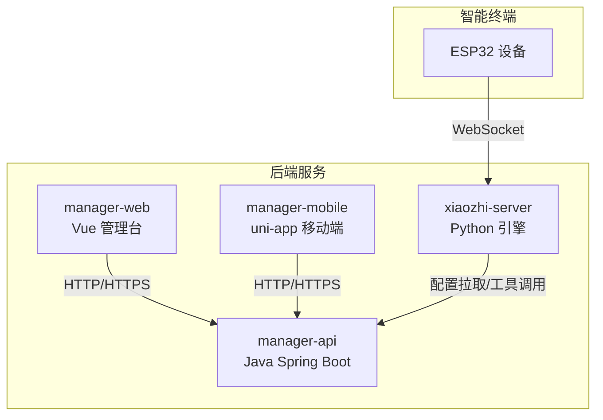
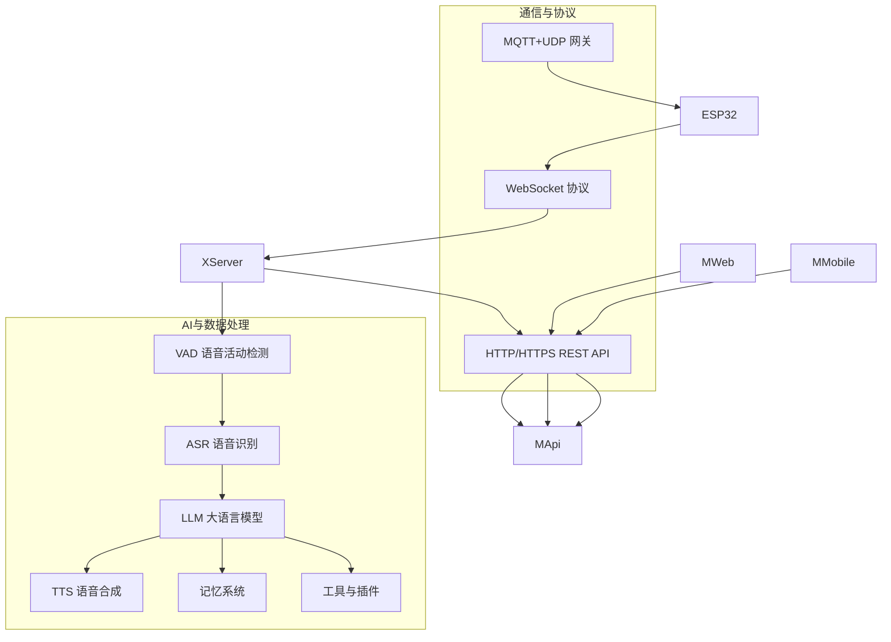
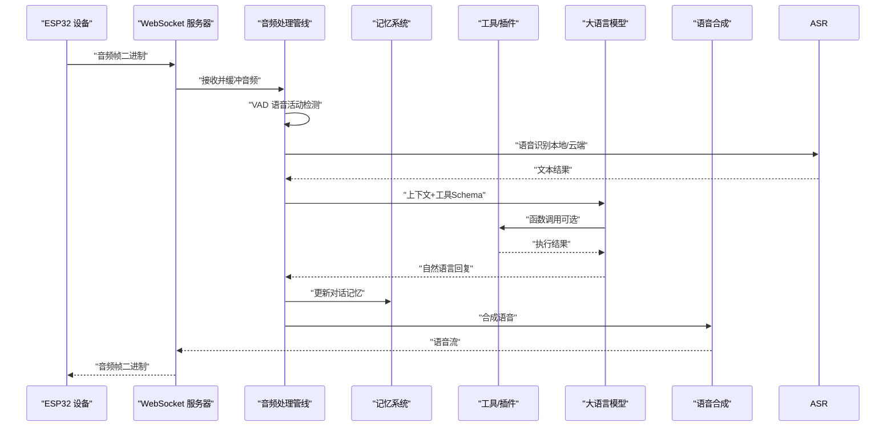
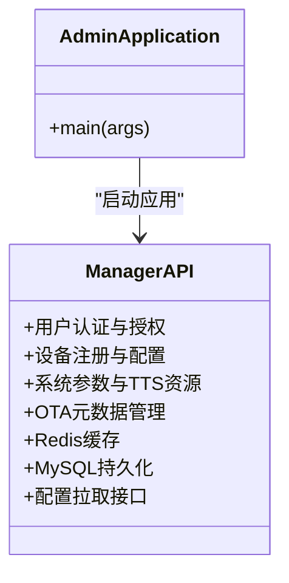
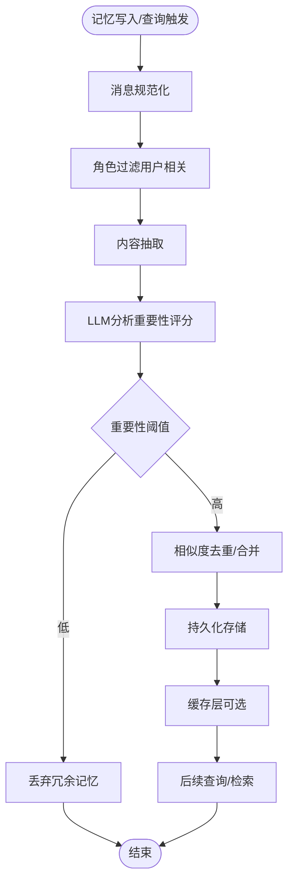
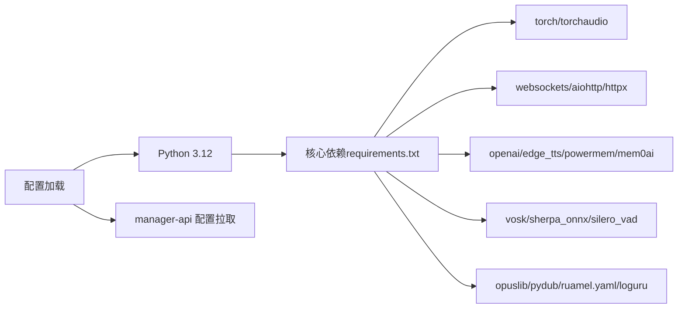

# 项目介绍

<cite>
**本文引用的文件**   
- [README.md](file://README.md)
- [README_en.md](file://README_en.md)
- [main/manager-api/src/main/java/xiaozhi/AdminApplication.java](file://main/manager-api/src/main/java/xiaozhi/AdminApplication.java)
- [main/xiaozhi-server/app.py](file://main/xiaozhi-server/app.py)
- [main/xiaozhi-server/config/settings.py](file://main/xiaozhi-server/config/settings.py)
- [main/xiaozhi-server/requirements.txt](file://main/xiaozhi-server/requirements.txt)
- [main/manager-api/README.md](file://main/manager-api/README.md)
- [main/manager-web/README.md](file://main/manager-web/README.md)
- [main/manager-mobile/README.md](file://main/manager-mobile/README.md)
- [docs/contributor_open_letter.md](file://docs/contributor_open_letter.md)
- [main/xiaozhi-server/docs/architecture/Memory_System_Architecture_Blueprint.md](file://main/xiaozhi-server/docs/architecture/Memory_System_Architecture_Blueprint.md)
</cite>

## 目录
1. [引言](#引言)
2. [项目结构](#项目结构)
3. [核心组件](#核心组件)
4. [架构总览](#架构总览)
5. [详细组件分析](#详细组件分析)
6. [依赖关系分析](#依赖关系分析)
7. [性能考量](#性能考量)
8. [故障排查指南](#故障排查指南)
9. [结论](#结论)
10. [附录](#附录)

## 引言
小智ESP32服务器项目以“人机共生智能理论”为指导思想，围绕开源智能硬件项目 xiaozhi-esp32 构建后端服务支撑体系。项目通过Python、Java、Vue等技术栈实现，严格遵循小智通信协议，提供MQTT+UDP网关、WebSocket、MCP接入点、声纹识别、知识库等能力，旨在为智能终端软硬件体系提供稳定、可扩展、可定制的后端基础设施。

项目定位清晰：作为连接ESP32硬件设备、AI能力与管理控制台的桥梁，小智后端服务不仅满足个人与家庭用户的低成本智能助手需求，也为开发者提供开放、透明、可演进的技术底座。项目强调开源精神、技术创新与生态协同，持续推动智能硬件生态的发展与繁荣。

## 项目结构
项目采用多模块分层组织，主要包含：
- 后端核心引擎（Python）：xiaozhi-server，负责实时音频处理、AI推理编排、记忆系统、OTA与工具调用等。
- 管理后端（Java Spring Boot）：manager-api，提供REST API、用户与设备管理、配置持久化与缓存。
- 管理Web前端（Vue）：manager-web，提供图形化配置与运维界面。
- 管理移动端（uni-app/Vue3）：manager-mobile，提供跨平台移动端控制面板。
- 文档与部署：丰富的部署文档、集成指南与架构蓝图，覆盖Docker与源码部署。

图表来源
- [README_en.md:24-61](file://README_en.md#L24-L61)
- [README_en.md:268-343](file://README_en.md#L268-L343)

章节来源
- [README_en.md:24-61](file://README_en.md#L24-L61)
- [README_en.md:268-343](file://README_en.md#L268-L343)

## 核心组件
- xiaozhi-server（Python）：系统“大脑”，负责实时音频链路、VAD/ASR/LLM/TTS流水线、记忆子系统、MCP工具与插件、OTA下载与WebSocket服务。
- manager-api（Java）：系统“中枢”，提供用户认证、设备管理、配置持久化、缓存与OTA元数据管理。
- manager-web（Vue）：系统“桌面控制台”，提供配置、用户与设备管理、参数调整与可视化。
- manager-mobile（uni-app/Vue3）：系统“移动控制台”，提供跨平台移动端管理与控制。
- 记忆系统：多级记忆架构（语义/情景/长期），支持本地短期记忆、mem0ai接口记忆、PowerMem智能记忆，遵循认知经济性原则，自动压缩冗余信息。

章节来源
- [README.md:235-254](file://README.md#L235-L254)
- [main/xiaozhi-server/docs/architecture/Memory_System_Architecture_Blueprint.md:16-71](file://main/xiaozhi-server/docs/architecture/Memory_System_Architecture_Blueprint.md#L16-L71)

## 架构总览
系统采用“分布式、多组件协作”的架构设计，强调模块化、可维护性与可扩展性。ESP32设备通过WebSocket与xiaozhi-server建立低延迟双向通信，完成音频采集、实时传输、AI推理与语音合成播放。manager-api为xiaozhi-server提供动态配置与缓存，同时为管理控制台提供REST API支撑。manager-web与manager-mobile分别面向桌面与移动端，提供统一的配置与运维入口。

图表来源
- [README_en.md:268-343](file://README_en.md#L268-L343)
- [main/xiaozhi-server/docs/architecture/Memory_System_Architecture_Blueprint.md:74-153](file://main/xiaozhi-server/docs/architecture/Memory_System_Architecture_Blueprint.md#L74-L153)

章节来源
- [README_en.md:268-343](file://README_en.md#L268-L343)
- [main/xiaozhi-server/docs/architecture/Memory_System_Architecture_Blueprint.md:74-153](file://main/xiaozhi-server/docs/architecture/Memory_System_Architecture_Blueprint.md#L74-L153)

## 详细组件分析

### xiaozhi-server（Python）核心流程
- 启动与配置：初始化日志、检查FFmpeg、加载配置、生成或校验JWT密钥、启动WebSocket与HTTP服务。
- 实时音频链路：通过WebSocket接收ESP32音频流，使用VAD分割有效语音片段，调用ASR转文本，结合上下文与工具Schema交给LLM解析意图并生成回复。
- 记忆与工具：将对话轮次写入记忆系统，按需执行工具函数（IoT控制、MCP接入点、服务端MCP等），最终通过TTS合成语音返回设备。
- 配置同步：通过HTTP从manager-api拉取最新配置，动态生效。

图表来源
- [README_en.md:284-306](file://README_en.md#L284-L306)
- [main/xiaozhi-server/app.py:46-160](file://main/xiaozhi-server/app.py#L46-L160)

章节来源
- [main/xiaozhi-server/app.py:46-160](file://main/xiaozhi-server/app.py#L46-L160)
- [README_en.md:284-306](file://README_en.md#L284-L306)

### manager-api（Java）启动与职责
- 启动入口：Spring Boot应用入口，启动后输出接口文档地址。
- 职责范围：用户认证与权限、设备注册与配置、系统参数与TTS资源管理、OTA元数据、Redis缓存与MySQL持久化、为xiaozhi-server提供配置拉取接口。

图表来源
- [main/manager-api/src/main/java/xiaozhi/AdminApplication.java:1-13](file://main/manager-api/src/main/java/xiaozhi/AdminApplication.java#L1-L13)

章节来源
- [main/manager-api/src/main/java/xiaozhi/AdminApplication.java:1-13](file://main/manager-api/src/main/java/xiaozhi/AdminApplication.java#L1-L13)
- [main/manager-api/README.md:1-19](file://main/manager-api/README.md#L1-L19)

### 记忆系统架构蓝图
- 多级记忆：语义记忆（向量检索）、情景记忆（知识图谱）、长期记忆（用户画像）三层架构。
- 架构原则：单一职责、开闭原则、依赖倒置、接口隔离、认知经济性。
- 模式应用：Provider、Repository、Strategy、Observer、Factory、Decorator。
- 生命周期：智能抽取、智能合并、遗忘曲线、记忆巩固。
- 存储抽象：SQLite、OceanBase、PostgreSQL等多态后端。

图表来源
- [main/xiaozhi-server/docs/architecture/Memory_System_Architecture_Blueprint.md:51-71](file://main/xiaozhi-server/docs/architecture/Memory_System_Architecture_Blueprint.md#L51-L71)
- [main/xiaozhi-server/docs/architecture/Memory_System_Architecture_Blueprint.md:607-641](file://main/xiaozhi-server/docs/architecture/Memory_System_Architecture_Blueprint.md#L607-L641)

章节来源
- [main/xiaozhi-server/docs/architecture/Memory_System_Architecture_Blueprint.md:16-71](file://main/xiaozhi-server/docs/architecture/Memory_System_Architecture_Blueprint.md#L16-L71)
- [main/xiaozhi-server/docs/architecture/Memory_System_Architecture_Blueprint.md:607-641](file://main/xiaozhi-server/docs/architecture/Memory_System_Architecture_Blueprint.md#L607-L641)

## 依赖关系分析
- Python运行时与依赖：项目明确推荐Python 3.12，关键依赖包括torch、torchaudio、websockets、aiohttp、openai、edge_tts、powermem、mem0ai、vosk、sherpa_onnx、mcp、mcp-proxy等。
- 配置与启动：xiaozhi-server启动前检查FFmpeg与配置文件，支持从API读取配置并进行冲突校验。
- 管理后端：manager-api基于Spring Boot，提供REST接口与配置中心能力，为前端提供统一数据通道。

图表来源
- [main/xiaozhi-server/requirements.txt:1-43](file://main/xiaozhi-server/requirements.txt#L1-L43)
- [main/xiaozhi-server/config/settings.py:1-34](file://main/xiaozhi-server/config/settings.py#L1-L34)

章节来源
- [main/xiaozhi-server/requirements.txt:1-43](file://main/xiaozhi-server/requirements.txt#L1-L43)
- [main/xiaozhi-server/config/settings.py:1-34](file://main/xiaozhi-server/config/settings.py#L1-L34)

## 性能考量
- 流式配置：自0.5.2版本起支持流式配置，显著降低响应延迟，提升用户体验。
- 并发与资源：根据组件选择（如FunASR或全API）建议2核2G至4核8G不等，以满足不同场景需求。
- 性能测试：提供专门的性能测试工具，可评估ASR、LLM、VLLM、TTS等核心模块的响应速度。
- 记忆优化：采用认知经济性原则，自动过滤与压缩冗余信息，减少存储与检索压力。

章节来源
- [README.md:203-233](file://README.md#L203-L233)
- [README.md:224-233](file://README.md#L224-L233)
- [main/xiaozhi-server/docs/architecture/Memory_System_Architecture_Blueprint.md:607-641](file://main/xiaozhi-server/docs/architecture/Memory_System_Architecture_Blueprint.md#L607-L641)

## 故障排查指南
- 启动与退出信号：支持Unix信号与Windows键盘中断，优雅关闭WebSocket与HTTP任务，释放资源。
- 配置校验：启动前检查FFmpeg与配置文件存在性；当启用从API读取配置时，若发现本地与远程配置混用，会给出明确提示并阻止启动。
- 日志与诊断：统一日志记录，便于定位音频链路、AI推理与工具调用过程中的异常。

章节来源
- [main/xiaozhi-server/app.py:18-160](file://main/xiaozhi-server/app.py#L18-L160)
- [main/xiaozhi-server/config/settings.py:9-34](file://main/xiaozhi-server/config/settings.py#L9-L34)

## 结论
小智ESP32服务器项目以“人机共生智能理论”为指引，围绕ESP32硬件与AI能力构建了完整、开放、可扩展的后端服务生态。通过清晰的模块划分、稳健的协议设计与强大的记忆系统，项目不仅为个人与家庭用户提供低成本智能助手解决方案，也为开发者提供了可演进、可集成、可定制的技术底座。项目坚持开源精神与技术创新，持续推动智能硬件生态的繁荣发展。

## 附录
- 开源精神与贡献指南：项目鼓励社区参与，提供贡献者公开信与开发流程，欢迎志同道合者加入共建。
- 多语言文档：提供中英越德葡等多语言README与文档，便于全球开发者理解与参与。

章节来源
- [docs/contributor_open_letter.md:1-51](file://docs/contributor_open_letter.md#L1-L51)
- [README.md:19-34](file://README.md#L19-L34)