# 项目概述

<cite>
**本文档引用的文件**
- [README.md](file://README.md)
- [app.py](file://main/xiaozhi-server/app.py)
- [settings.py](file://main/xiaozhi-server/config/settings.py)
- [config.yaml](file://main/xiaozhi-server/config.yaml)
- [http_server.py](file://main/xiaozhi-server/core/http_server.py)
- [websocket_server.py](file://main/xiaozhi-server/core/websocket_server.py)
- [connection.py](file://main/xiaozhi-server/core/connection.py)
- [ota_handler.py](file://main/xiaozhi-server/core/api/ota_handler.py)
- [index.html](file://main/demo-web/index.html)
- [application.yml](file://main/manager-api/src/main/resources/application.yml)
- [AdminApplication.java](file://main/manager-api/src/main/java/xiaozhi/AdminApplication.java)
- [README.md](file://main/manager-mobile/README.md)
- [README.md](file://main/manager-web/README.md)
</cite>

## 目录
1. [简介](#简介)
2. [项目结构](#项目结构)
3. [核心组件](#核心组件)
4. [架构总览](#架构总览)
5. [详细组件分析](#详细组件分析)
6. [依赖关系分析](#依赖关系分析)
7. [性能考虑](#性能考虑)
8. [故障排除指南](#故障排除指南)
9. [结论](#结论)
10. [附录](#附录)

## 简介

小智ESP32服务器项目是一个基于人机共生智能理论研发的开源智能硬件后端服务系统，专门为开源智能硬件项目xiaozhi-esp32提供完整的后端支撑。该项目采用Python、Java、Vue等技术栈，实现了MQTT+UDP网关、WebSocket协议、MCP接入点等多种通信协议的支持。

### 核心目标

项目旨在为ESP32智能硬件设备提供一个完整的AI服务能力，包括：
- **语音交互**：支持流式ASR语音识别、流式TTS语音合成、VAD语音活动检测
- **智能对话**：集成多种大语言模型，实现自然语言对话
- **视觉感知**：支持多模态视觉大模型，实现图像识别和分析
- **声纹识别**：支持多用户声纹注册、管理和识别
- **工具调用**：支持客户端IoT协议、MCP协议、服务端MCP协议等多种工具调用机制

### 技术架构背景

项目基于人机共生智能理论，强调人与机器的和谐共存和相互协作。这种设计理念体现在系统的模块化设计、可扩展的架构以及对多模态交互的深度支持上。

### 与其他组件的关系

小智ESP32服务器项目与xiaozhi-esp32硬件设备形成完整的生态系统，通过标准化的通信协议实现设备与服务器之间的无缝连接。项目还提供了完整的管理后台、移动端应用和Web界面，形成了从硬件到软件的全栈解决方案。

## 项目结构

项目采用多模块架构设计，主要包含以下核心模块：

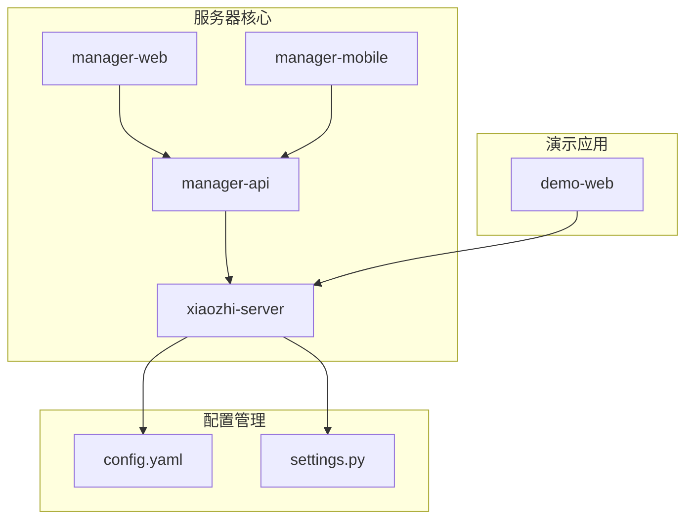

**图表来源**
- [app.py:46-160](file://main/xiaozhi-server/app.py#L46-L160)
- [AdminApplication.java:1-13](file://main/manager-api/src/main/java/xiaozhi/AdminApplication.java#L1-L13)

### 主要模块说明

1. **xiaozhi-server**：核心服务器模块，包含WebSocket服务器、HTTP服务器、音频处理管道等
2. **manager-api**：基于Spring Boot的管理API服务，提供RESTful接口
3. **manager-web**：基于Vue的Web管理界面
4. **manager-mobile**：基于uni-app的移动端管理应用
5. **demo-web**：演示和测试应用

**章节来源**
- [README.md:235-260](file://README.md#L235-L260)
- [app.py:1-160](file://main/xiaozhi-server/app.py#L1-L160)

## 核心组件

### 服务器核心架构

项目的核心由两个主要服务器组成：

1. **WebSocket服务器**：处理实时音频流和文本消息
2. **HTTP服务器**：提供OTA升级、视觉分析等HTTP接口

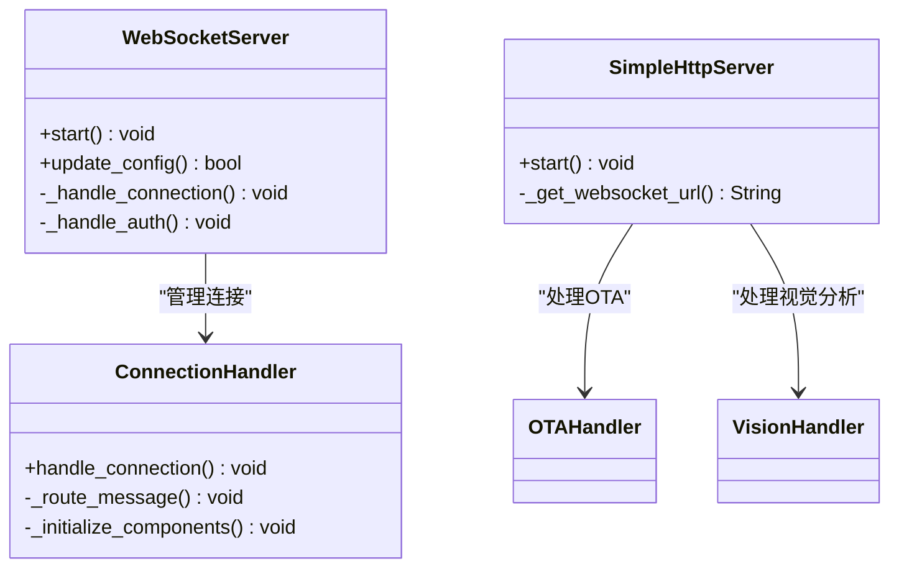

**图表来源**
- [websocket_server.py:42-228](file://main/xiaozhi-server/core/websocket_server.py#L42-L228)
- [http_server.py:10-93](file://main/xiaozhi-server/core/http_server.py#L10-L93)
- [connection.py:77-800](file://main/xiaozhi-server/core/connection.py#L77-L800)

### 配置管理系统

项目采用灵活的配置管理机制，支持多种配置来源：

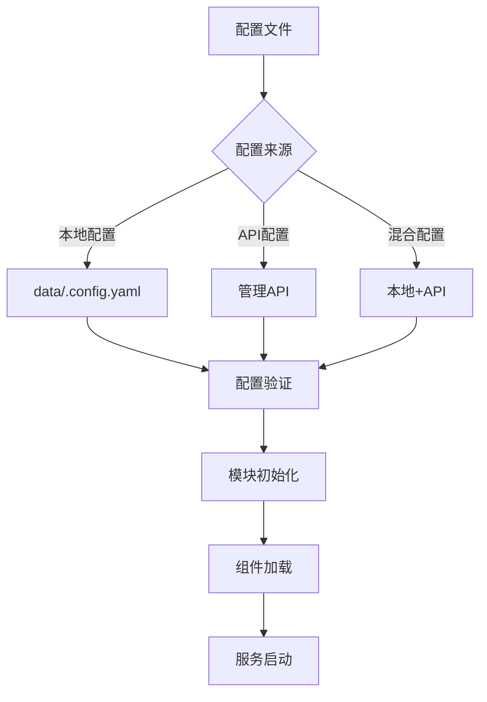

**图表来源**
- [settings.py:9-34](file://main/xiaozhi-server/config/settings.py#L9-L34)
- [config.yaml:1-120](file://main/xiaozhi-server/config.yaml#L1-L120)

**章节来源**
- [http_server.py:10-93](file://main/xiaozhi-server/core/http_server.py#L10-L93)
- [websocket_server.py:42-228](file://main/xiaozhi-server/core/websocket_server.py#L42-L228)
- [connection.py:487-540](file://main/xiaozhi-server/core/connection.py#L487-L540)

## 架构总览

### 整体系统架构

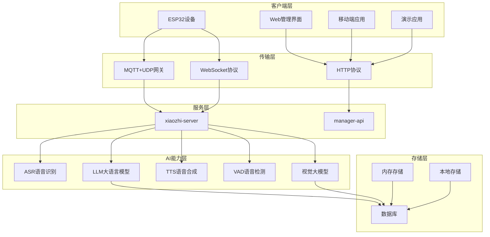

**图表来源**
- [README.md:240-252](file://README.md#L240-L252)
- [config.yaml:88-121](file://main/xiaozhi-server/config.yaml#L88-L121)

### 数据流处理

系统采用异步事件驱动架构，支持实时音频流处理：

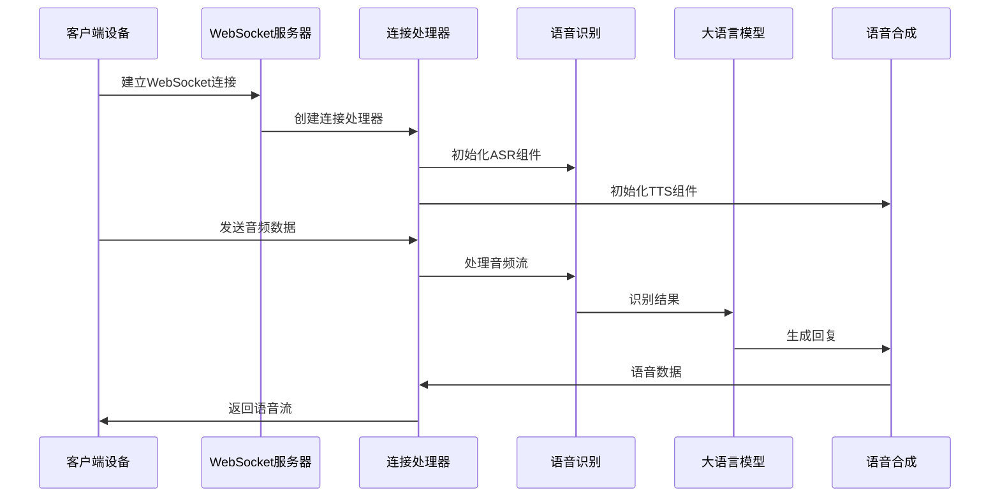

**图表来源**
- [connection.py:340-406](file://main/xiaozhi-server/core/connection.py#L340-L406)
- [websocket_server.py:108-145](file://main/xiaozhi-server/core/websocket_server.py#L108-L145)

**章节来源**
- [README.md:235-254](file://README.md#L235-L254)
- [config.yaml:218-238](file://main/xiaozhi-server/config.yaml#L218-L238)

## 详细组件分析

### WebSocket服务器组件

WebSocket服务器是系统的核心通信枢纽，负责处理所有实时音频和文本交互：

#### 连接管理机制

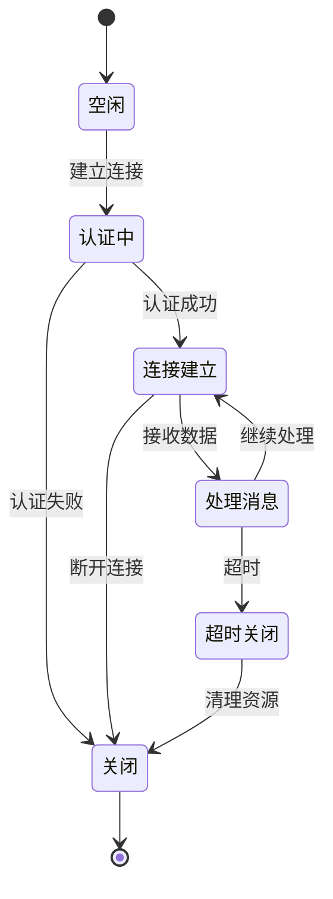

**图表来源**
- [websocket_server.py:155-204](file://main/xiaozhi-server/core/websocket_server.py#L155-L204)
- [connection.py:239-264](file://main/xiaozhi-server/core/connection.py#L239-L264)

#### 认证与授权

服务器支持多种认证方式，包括设备白名单和JWT令牌认证：

| 认证方式 | 描述 | 使用场景 |
|---------|------|----------|
| 设备白名单 | 预先配置的设备ID列表 | 受信任设备直连 |
| JWT令牌 | 基于密钥的令牌认证 | 标准设备认证 |
| 设备绑定 | 首次连接时的设备绑定流程 | 新设备初始配置 |

**章节来源**
- [websocket_server.py:206-228](file://main/xiaozhi-server/core/websocket_server.py#L206-L228)
- [connection.py:684-708](file://main/xiaozhi-server/core/connection.py#L684-L708)

### HTTP服务器组件

HTTP服务器提供非实时的管理和服务接口：

#### OTA升级服务

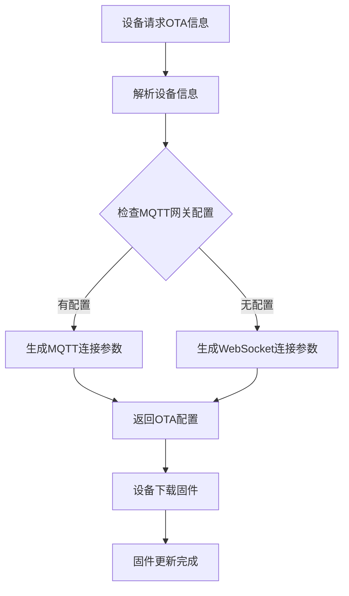

**图表来源**
- [ota_handler.py:203-311](file://main/xiaozhi-server/core/api/ota_handler.py#L203-L311)

#### 视觉分析服务

HTTP服务器还提供视觉分析接口，支持MCP协议的视觉处理：

**章节来源**
- [http_server.py:35-93](file://main/xiaozhi-server/core/http_server.py#L35-L93)
- [ota_handler.py:1-200](file://main/xiaozhi-server/core/api/ota_handler.py#L1-L200)

### AI能力集成

#### 语音识别系统

系统支持多种ASR引擎，包括本地和云端服务：

| ASR类型 | 描述 | 适用场景 |
|---------|------|----------|
| FunASR | 本地语音识别 | 低延迟、隐私保护 |
| AliyunASR | 阿里云语音识别 | 高精度、云端处理 |
| DoubaoASR | 火山引擎语音识别 | 实时流式处理 |
| OpenaiASR | OpenAI语音识别 | 多语言支持 |

#### 语音合成系统

支持多种TTS引擎，满足不同音色和语言需求：

| TTS类型 | 描述 | 特点 |
|---------|------|------|
| EdgeTTS | 微软语音合成 | 自然音色、多语言 |
| DoubaoTTS | 火山引擎语音合成 | 流式处理、高质量 |
| HuoshanDoubleStreamTTS | 火山双流语音合成 | 双向流式、低延迟 |

#### 大语言模型集成

系统支持多种LLM提供商，包括本地和云端模型：

| LLM提供商 | 描述 | 优势 |
|-----------|------|------|
| ChatGLM | 智谱AI模型 | 免费额度、中文优化 |
| Qwen | 阿里百炼模型 | 多模态能力 |
| Doubao | 火山引擎模型 | 实时对话 |
| Ollama | 本地模型 | 隐私保护 |

**章节来源**
- [config.yaml:343-800](file://main/xiaozhi-server/config.yaml#L343-L800)

### 管理后台系统

#### Web管理界面

基于Vue.js开发的现代化管理界面，提供完整的设备和系统管理功能：

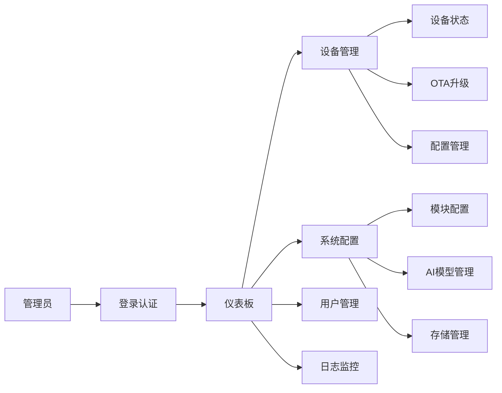

**图表来源**
- [README.md:10-28](file://main/manager-web/README.md#L10-L28)

#### 移动端应用

基于uni-app开发的跨平台移动端应用，支持Android、iOS和小程序：

| 平台 | 支持状态 | 功能特性 |
|------|----------|----------|
| H5 | ✓ | 基础管理功能 |
| iOS | ✓ | 完整功能支持 |
| Android | ✓ | 完整功能支持 |
| 微信小程序 | ✓ | 轻量化管理 |

**章节来源**
- [README.md:1-171](file://main/manager-mobile/README.md#L1-L171)

## 依赖关系分析

### 技术栈依赖

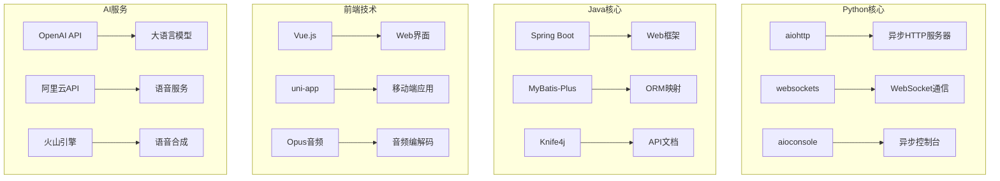

**图表来源**
- [application.yml:15-66](file://main/manager-api/src/main/resources/application.yml#L15-L66)
- [index.html:1-399](file://main/demo-web/index.html#L1-L399)

### 模块间耦合关系

系统采用松耦合设计，各模块间通过清晰的接口进行通信：

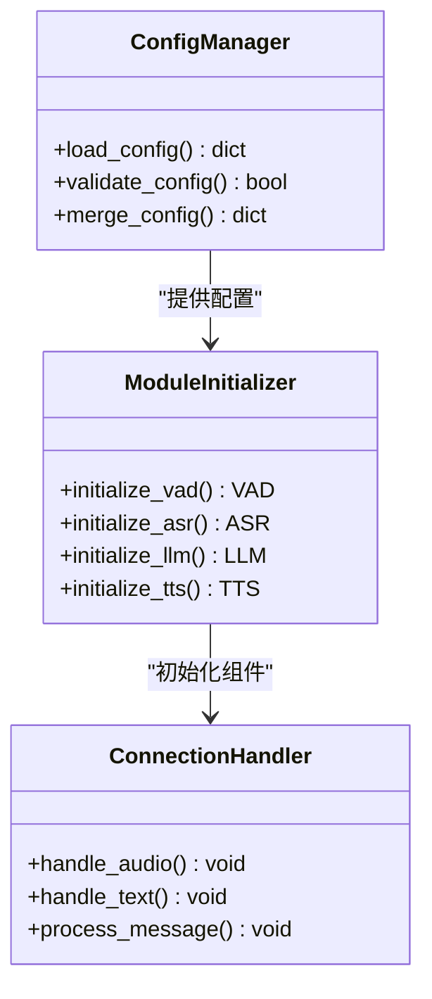

**图表来源**
- [settings.py:22-34](file://main/xiaozhi-server/config/settings.py#L22-L34)
- [connection.py:487-540](file://main/xiaozhi-server/core/connection.py#L487-L540)

**章节来源**
- [app.py:46-100](file://main/xiaozhi-server/app.py#L46-L100)
- [connection.py:77-192](file://main/xiaozhi-server/core/connection.py#L77-L192)

## 性能考虑

### 并发处理能力

系统采用异步事件驱动架构，能够有效处理高并发场景：

| 组件 | 最大并发数 | 建议配置 |
|------|------------|----------|
| WebSocket服务器 | 1000+ | 根据硬件配置调整 |
| HTTP服务器 | 500+ | 适当调整线程池大小 |
| ASR处理 | 100+ | 根据模型选择调整 |
| TTS处理 | 50+ | 流式处理优化 |

### 内存管理

系统实现了智能的内存管理策略：

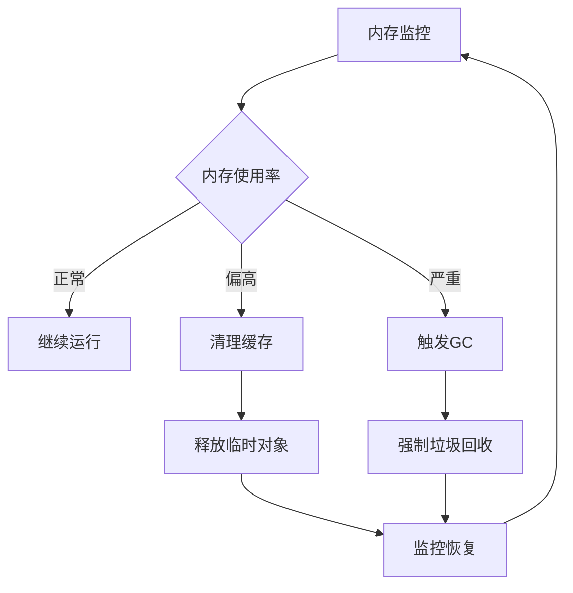

**图表来源**
- [app.py:74-77](file://main/xiaozhi-server/app.py#L74-L77)

### 音频处理优化

系统针对音频流处理进行了专门优化：

| 优化策略 | 实现方式 | 效果 |
|----------|----------|------|
| 流式处理 | 分块传输、缓冲队列 | 降低延迟 |
| 多线程 | 独立线程处理不同阶段 | 提高吞吐量 |
| 缓存机制 | 常用模型预加载 | 减少响应时间 |

## 故障排除指南

### 常见问题诊断

#### 连接问题

| 问题症状 | 可能原因 | 解决方案 |
|----------|----------|----------|
| WebSocket连接失败 | 端口被占用 | 检查端口配置 |
| 认证失败 | 令牌过期 | 重新生成令牌 |
| 超时断开 | 网络不稳定 | 检查网络连接 |

#### 音频处理问题

| 问题症状 | 可能原因 | 解决方案 |
|----------|----------|----------|
| 音频延迟高 | 处理链过长 | 优化处理顺序 |
| 声音质量差 | 编码参数不当 | 调整音频参数 |
| 识别准确率低 | 模型配置错误 | 检查ASR配置 |

#### AI服务问题

| 问题症状 | 可能原因 | 解决方案 |
|----------|----------|----------|
| LLM响应慢 | API限流 | 优化请求频率 |
| TTS合成失败 | 服务不可用 | 检查服务状态 |
| 视觉识别错误 | 模型过期 | 更新模型版本 |

**章节来源**
- [websocket_server.py:8-31](file://main/xiaozhi-server/core/websocket_server.py#L8-L31)
- [connection.py:245-251](file://main/xiaozhi-server/core/connection.py#L245-L251)

## 结论

小智ESP32服务器项目是一个设计精良、功能完整的开源智能硬件后端解决方案。项目基于人机共生智能理论，实现了从硬件到软件的全栈支持，为ESP32设备提供了强大的AI服务能力。

### 主要优势

1. **模块化设计**：清晰的模块划分和接口定义，便于维护和扩展
2. **多协议支持**：同时支持MQTT+UDP、WebSocket、HTTP等多种通信协议
3. **AI能力丰富**：集成了语音识别、语音合成、大语言模型、视觉识别等多种AI能力
4. **可扩展性**：灵活的配置管理和插件系统，支持功能扩展
5. **跨平台支持**：提供Web、移动端、桌面端等多种客户端支持

### 技术特色

- **异步架构**：采用异步事件驱动架构，支持高并发处理
- **实时处理**：针对音频流的实时处理优化
- **智能配置**：支持动态配置更新和差异化配置
- **安全认证**：多层次的安全认证机制

### 发展前景

项目遵循开源共享的理念，持续改进和扩展功能，为智能硬件生态系统的发展提供强有力的技术支撑。随着AI技术的不断进步，项目将继续演进，为用户提供更加智能化的服务体验。

## 附录

### 快速开始示例

#### 启动服务器

```bash
# 启动xiaozhi-server
python app.py

# 启动管理API
java -jar manager-api.jar
```

#### 基本配置

1. 创建配置文件：`data/.config.yaml`
2. 配置AI服务密钥
3. 设置设备认证信息
4. 启动服务并测试连接

### API参考

系统提供完整的RESTful API接口，支持设备管理、配置更新、OTA升级等功能。详细的API文档可在管理界面中查看。

### 社区支持

项目提供活跃的社区支持，包括：
- GitHub Issues跟踪问题
- 社区讨论论坛
- 技术文档和教程
- 贡献指南和开发规范