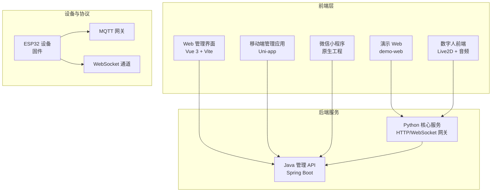
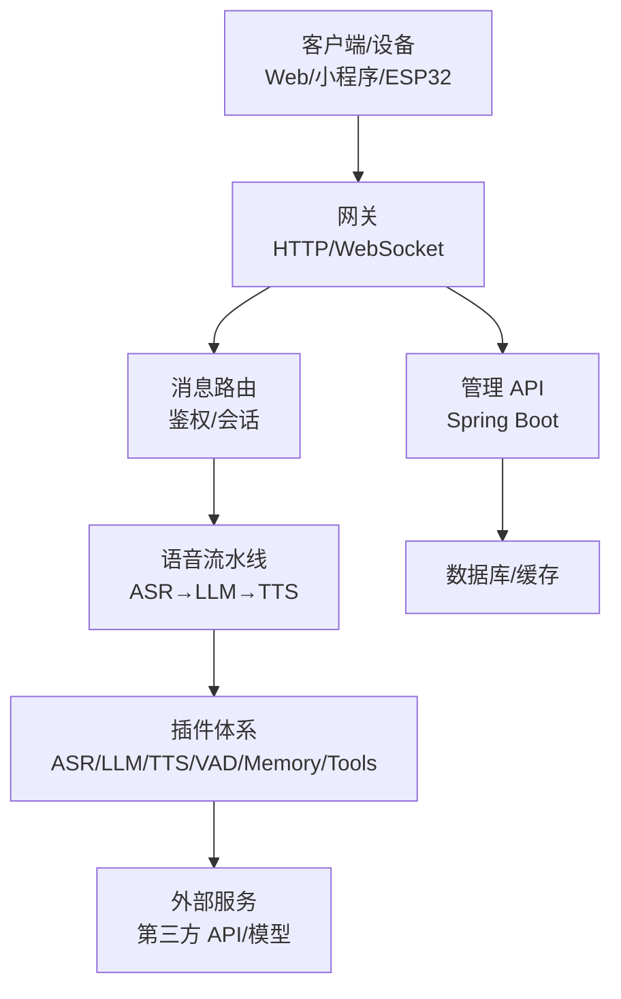
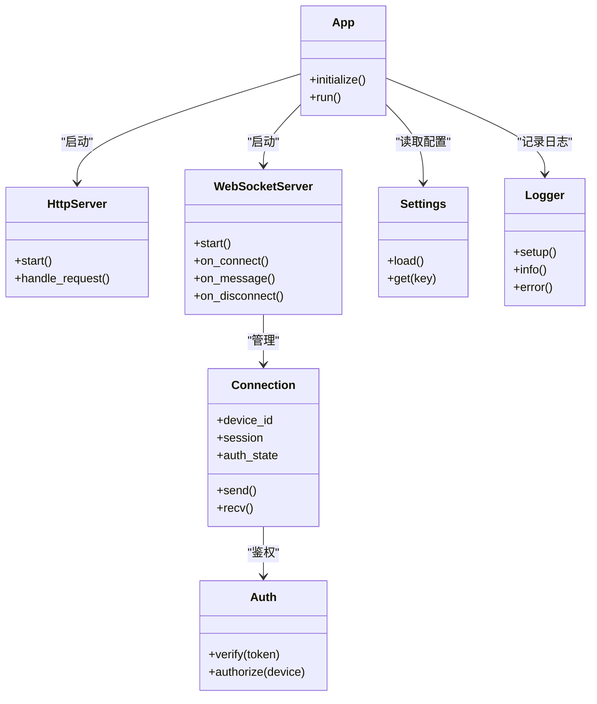
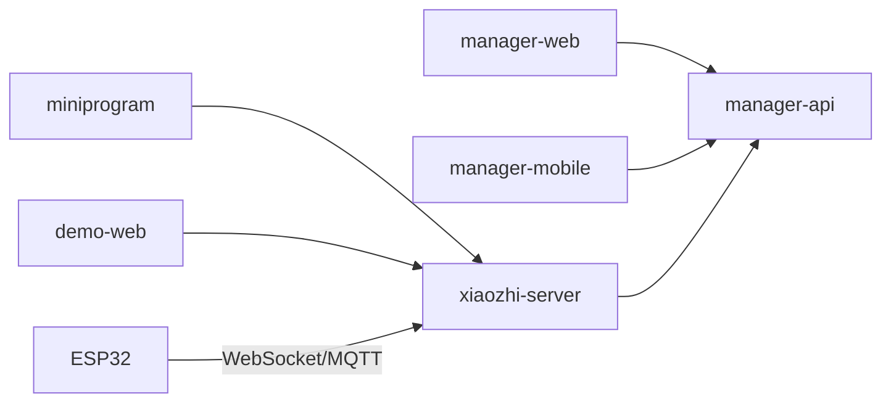

# 项目概述

<cite>
**本文引用的文件**   
- [README.md](file://README.md)
- [main/xiaozhi-server/app.py](file://main/xiaozhi-server/app.py)
- [main/xiaozhi-server/core/http_server.py](file://main/xiaozhi-server/core/http_server.py)
- [main/xiaozhi-server/core/websocket_server.py](file://main/xiaozhi-server/core/websocket_server.py)
- [main/xiaozhi-server/core/connection.py](file://main/xiaozhi-server/core/connection.py)
- [main/xiaozhi-server/core/auth.py](file://main/xiaozhi-server/core/auth.py)
- [main/xiaozhi-server/config/settings.py](file://main/xiaozhi-server/config/settings.py)
- [main/xiaozhi-server/config/logger.py](file://main/xiaozhi-server/config/logger.py)
- [main/manager-api/pom.xml](file://main/manager-api/pom.xml)
- [main/manager-web/package.json](file://main/manager-web/package.json)
- [main/manager-mobile/package.json](file://main/manager-mobile/package.json)
- [main/miniprogram/project.config.json](file://main/miniprogram/project.config.json)
- [main/digital-human/start.py](file://main/digital-human/start.py)
- [main/demo-web/index.html](file://main/demo-web/index.html)
- [docker-setup.sh](file://docker-setup.sh)
</cite>

## 目录
1. [简介](#简介)
2. [项目结构](#项目结构)
3. [核心组件](#核心组件)
4. [架构总览](#架构总览)
5. [详细组件分析](#详细组件分析)
6. [依赖关系分析](#依赖关系分析)
7. [性能考量](#性能考量)
8. [故障排查指南](#故障排查指南)
9. [结论](#结论)
10. [附录](#附录)

## 简介
xiaozhi-esp32-server 是一个面向物联网语音交互的综合性平台，覆盖 Python 后端服务、Java 管理 API、Vue.js Web 管理界面、Uni-app 移动端应用、微信小程序、数字人系统与 ESP32 设备固件支持。项目采用微服务架构与事件驱动模式，结合插件化设计，将 ASR（语音识别）、LLM（大语言模型）、TTS（语音合成）、VAD（语音活动检测）、记忆系统、工具调用等能力解耦，便于扩展与替换。前端通过 WebSocket/MQTT 与后端实时通信，实现低延迟的语音对话与设备控制。

## 项目结构
仓库采用多模块组织方式，按功能域划分：
- main/xiaozhi-server：Python 核心服务，提供 HTTP/WebSocket 接口、消息路由、插件加载、设备连接管理等
- main/manager-api：Java Spring Boot 管理服务，提供用户、设备、模型、配置等管理 API
- main/manager-web：Vue 3 + Vite 构建的管理后台 Web 应用
- main/manager-mobile：基于 Uni-app 的跨端移动管理应用（支持小程序与 App）
- main/miniprogram：微信小程序原生工程，用于语音通话、聊天、设备管理等场景
- main/digital-human：数字人前端与运行时，集成 Live2D、音频处理、MCP 工具等
- main/demo-web：演示用 Web 页面
- docs：部署、架构、开发文档
- scripts/docker：容器化与镜像构建脚本

图表来源
- [main/manager-web/package.json](file://main/manager-web/package.json)
- [main/manager-mobile/package.json](file://main/manager-mobile/package.json)
- [main/miniprogram/project.config.json](file://main/miniprogram/project.config.json)
- [main/xiaozhi-server/core/http_server.py](file://main/xiaozhi-server/core/http_server.py)
- [main/xiaozhi-server/core/websocket_server.py](file://main/xiaozhi-server/core/websocket_server.py)
- [main/xiaozhi-server/app.py](file://main/xiaozhi-server/app.py)

章节来源
- [README.md](file://README.md)

## 核心组件
- Python 核心服务（xiaozhi-server）
  - 提供 HTTP 与 WebSocket 网关，处理设备连接、鉴权、消息路由与插件调度
  - 模块化 providers：ASR、LLM、TTS、VAD、Memory、Tools 等，支持热插拔
  - 配置中心与日志系统，统一设置与可观测性
- Java 管理 API（manager-api）
  - 基于 Spring Boot 的管理后端，提供用户、设备、模型、知识库、OTA 等管理能力
- Web 管理界面（manager-web）
  - Vue 3 + Vite 构建的单页应用，负责可视化配置与管理操作
- 移动端管理应用（manager-mobile）
  - 基于 Uni-app 的跨端应用，支持多端发布与统一管理入口
- 微信小程序（miniprogram）
  - 原生小程序工程，承载语音通话、聊天、设备绑定等功能
- 数字人系统（digital-human）
  - 前端 Live2D 渲染与音频管线，配合 Python 服务完成语音交互与动作驱动

章节来源
- [main/xiaozhi-server/app.py](file://main/xiaozhi-server/app.py)
- [main/xiaozhi-server/core/http_server.py](file://main/xiaozhi-server/core/http_server.py)
- [main/xiaozhi-server/core/websocket_server.py](file://main/xiaozhi-server/core/websocket_server.py)
- [main/manager-api/pom.xml](file://main/manager-api/pom.xml)
- [main/manager-web/package.json](file://main/manager-web/package.json)
- [main/manager-mobile/package.json](file://main/manager-mobile/package.json)
- [main/miniprogram/project.config.json](file://main/miniprogram/project.config.json)
- [main/digital-human/start.py](file://main/digital-human/start.py)

## 架构总览
整体采用“网关 + 微服务 + 事件总线 + 插件化”的架构模式：
- 网关层：Python 服务同时暴露 HTTP 与 WebSocket 接口，作为设备与前端接入的统一入口
- 微服务层：Java 管理 API 独立部署，提供业务管理与数据持久化；Python 服务专注实时通信与语音链路编排
- 事件驱动：通过内部事件与异步任务驱动 ASR→LLM→TTS 流水线，降低耦合度并提升吞吐
- 插件化：providers 以插件形式注册，支持动态加载与替换，便于接入不同厂商能力

图表来源
- [main/xiaozhi-server/app.py](file://main/xiaozhi-server/app.py)
- [main/xiaozhi-server/core/http_server.py](file://main/xiaozhi-server/core/http_server.py)
- [main/xiaozhi-server/core/websocket_server.py](file://main/xiaozhi-server/core/websocket_server.py)
- [main/manager-api/pom.xml](file://main/manager-api/pom.xml)

## 详细组件分析

### Python 核心服务（xiaozhi-server）
- 启动与装配
  - 入口程序负责初始化配置、日志、插件加载与服务器启动
- HTTP/WebSocket 网关
  - 提供 RESTful 接口与 WebSocket 长连接，处理设备心跳、指令下发与媒体流转发
- 连接与会话管理
  - 维护设备连接状态、会话上下文与鉴权信息
- 插件与提供者
  - 通过注册表机制加载 ASR、LLM、TTS、VAD、Memory、Tools 等提供者，支持运行时切换与扩展

图表来源
- [main/xiaozhi-server/app.py](file://main/xiaozhi-server/app.py)
- [main/xiaozhi-server/core/http_server.py](file://main/xiaozhi-server/core/http_server.py)
- [main/xiaozhi-server/core/websocket_server.py](file://main/xiaozhi-server/core/websocket_server.py)
- [main/xiaozhi-server/core/connection.py](file://main/xiaozhi-server/core/connection.py)
- [main/xiaozhi-server/core/auth.py](file://main/xiaozhi-server/core/auth.py)
- [main/xiaozhi-server/config/settings.py](file://main/xiaozhi-server/config/settings.py)
- [main/xiaozhi-server/config/logger.py](file://main/xiaozhi-server/config/logger.py)

章节来源
- [main/xiaozhi-server/app.py](file://main/xiaozhi-server/app.py)
- [main/xiaozhi-server/core/http_server.py](file://main/xiaozhi-server/core/http_server.py)
- [main/xiaozhi-server/core/websocket_server.py](file://main/xiaozhi-server/core/websocket_server.py)
- [main/xiaozhi-server/core/connection.py](file://main/xiaozhi-server/core/connection.py)
- [main/xiaozhi-server/core/auth.py](file://main/xiaozhi-server/core/auth.py)
- [main/xiaozhi-server/config/settings.py](file://main/xiaozhi-server/config/settings.py)
- [main/xiaozhi-server/config/logger.py](file://main/xiaozhi-server/config/logger.py)

### Java 管理 API（manager-api）
- 技术栈：Spring Boot、Maven、RESTful API
- 职责：用户与权限、设备管理、模型与知识库配置、OTA 升级、支付与订阅等管理功能
- 与 Python 服务的协作：通过 HTTP 或消息中间件同步配置与状态

章节来源
- [main/manager-api/pom.xml](file://main/manager-api/pom.xml)

### Web 管理界面（manager-web）
- 技术栈：Vue 3 + Vite，组件化开发与国际化
- 职责：可视化配置设备、模型、知识库、参数与 OTA 管理

章节来源
- [main/manager-web/package.json](file://main/manager-web/package.json)

### 移动端管理应用（manager-mobile）
- 技术栈：Uni-app（Vue/TypeScript），多端发布（小程序/App）
- 职责：移动端的设备与账号管理、语音资源与配置查看

章节来源
- [main/manager-mobile/package.json](file://main/manager-mobile/package.json)

### 微信小程序（miniprogram）
- 技术栈：原生小程序框架，音视频与 WebSocket 通信
- 职责：语音通话、聊天、设备绑定与状态展示

章节来源
- [main/miniprogram/project.config.json](file://main/miniprogram/project.config.json)

### 数字人系统（digital-human）
- 技术栈：Live2D、Web Audio、MCP 工具集成
- 职责：数字人形象渲染、音频播放与动作联动，与 Python 服务进行实时交互

章节来源
- [main/digital-human/start.py](file://main/digital-human/start.py)

### 演示 Web（demo-web）
- 职责：快速体验语音交互流程，验证前后端联调

章节来源
- [main/demo-web/index.html](file://main/demo-web/index.html)

## 依赖关系分析
- 前端到后端
  - manager-web 与 manager-mobile 调用 manager-api 的管理接口
  - 小程序与 demo-web 通过 WebSocket/HTTP 与 xiaozhi-server 交互
- 设备到后端
  - ESP32 设备通过 MQTT 或 WebSocket 接入 xiaozhi-server
- 服务间协作
  - xiaozhi-server 与 manager-api 通过 HTTP 或消息通道交换配置与状态
- 插件与外部依赖
  - ASR/LLM/TTS/VAD/Memory/Tools 等插件按需加载，对接第三方服务

图表来源
- [main/manager-web/package.json](file://main/manager-web/package.json)
- [main/manager-mobile/package.json](file://main/manager-mobile/package.json)
- [main/miniprogram/project.config.json](file://main/miniprogram/project.config.json)
- [main/xiaozhi-server/core/http_server.py](file://main/xiaozhi-server/core/http_server.py)
- [main/xiaozhi-server/core/websocket_server.py](file://main/xiaozhi-server/core/websocket_server.py)
- [main/manager-api/pom.xml](file://main/manager-api/pom.xml)

章节来源
- [main/xiaozhi-server/core/http_server.py](file://main/xiaozhi-server/core/http_server.py)
- [main/xiaozhi-server/core/websocket_server.py](file://main/xiaozhi-server/core/websocket_server.py)
- [main/manager-api/pom.xml](file://main/manager-api/pom.xml)

## 性能考量
- 并发与连接
  - WebSocket 长连接需关注连接数上限、心跳保活与断线重连策略
- 流水线优化
  - ASR→LLM→TTS 流水线应使用异步与缓冲队列，减少端到端时延
- 插件选择
  - 根据场景选择合适的 ASR/TTS/LLM 提供商，平衡质量与成本
- 缓存与存储
  - 热点配置与结果缓存，降低重复计算与外部调用开销
- 资源监控
  - 完善日志与指标采集，定位瓶颈与异常

[本节为通用指导，不直接分析具体文件]

## 故障排查指南
- 连接问题
  - 检查 WebSocket/MQTT 端口与证书配置，确认防火墙与反向代理设置
- 鉴权失败
  - 核对 token 生成与校验逻辑，确保设备与用户身份一致
- 插件加载失败
  - 检查插件依赖与环境变量，确认配置文件路径与权限
- 日志与调试
  - 启用详细日志，收集错误堆栈与网络抓包，定位问题根因

章节来源
- [main/xiaozhi-server/config/logger.py](file://main/xiaozhi-server/config/logger.py)
- [main/xiaozhi-server/core/auth.py](file://main/xiaozhi-server/core/auth.py)

## 结论
xiaozhi-esp32-server 以 Python 为核心网关与语音流水线编排，结合 Java 管理 API 与多端前端，构建了完整的物联网语音交互生态。其微服务、事件驱动与插件化的架构，使系统具备高可扩展性与易维护性。通过统一的配置与日志体系，以及完善的部署脚本，能够快速搭建与运维生产环境。

[本节为总结性内容，不直接分析具体文件]

## 附录
- 部署与容器化
  - 使用 docker-setup.sh 一键初始化环境与依赖
- 参考文档
  - docs 目录下包含部署、架构、开发与集成相关文档

章节来源
- [docker-setup.sh](file://docker-setup.sh)