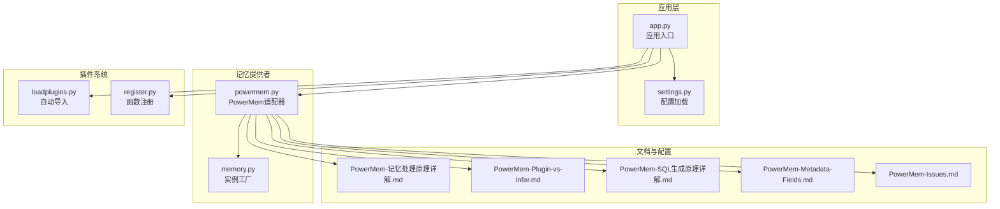
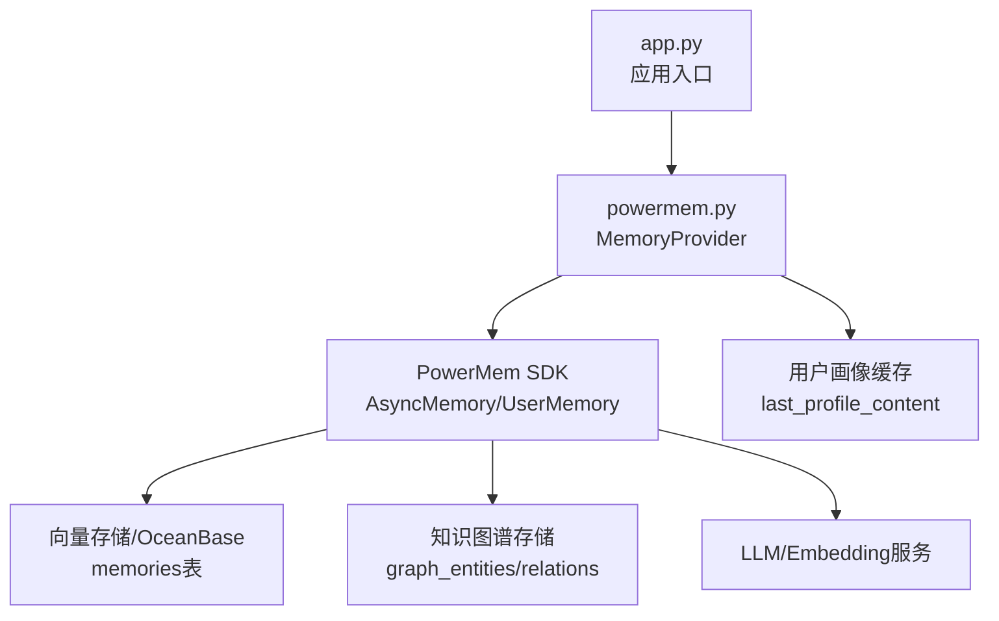
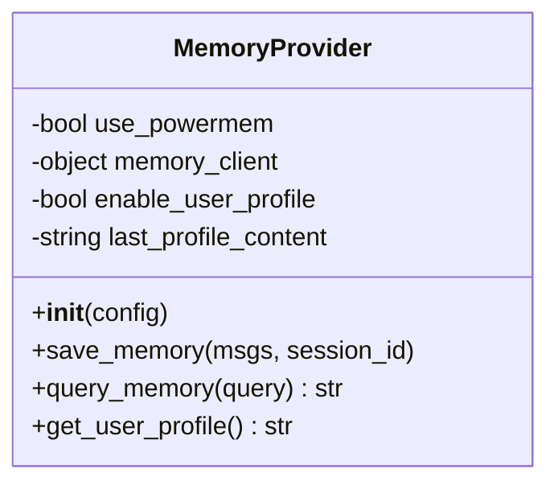
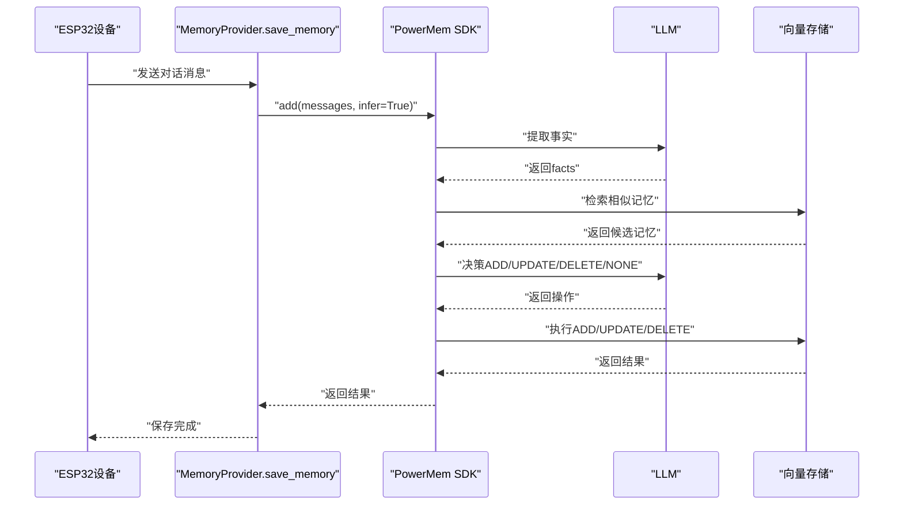
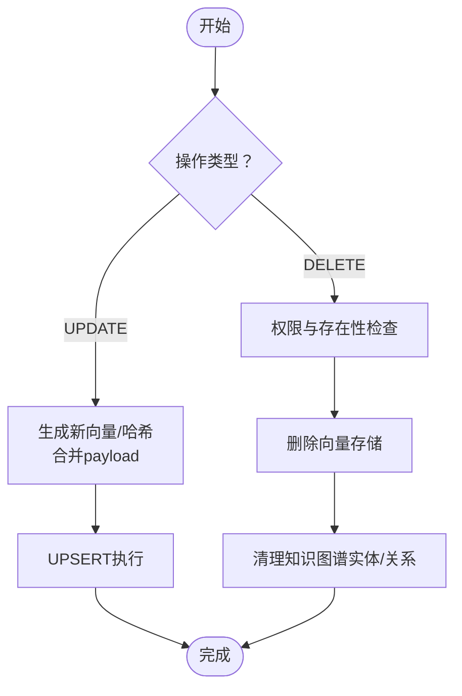
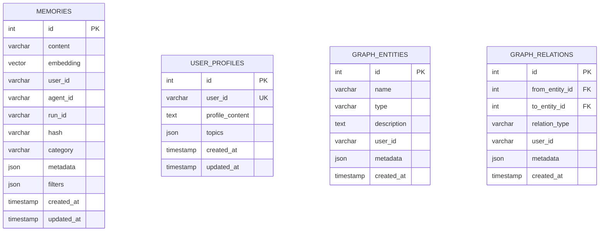
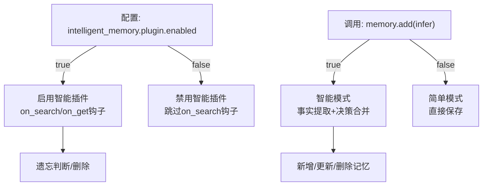
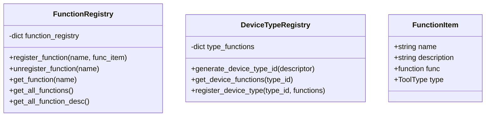
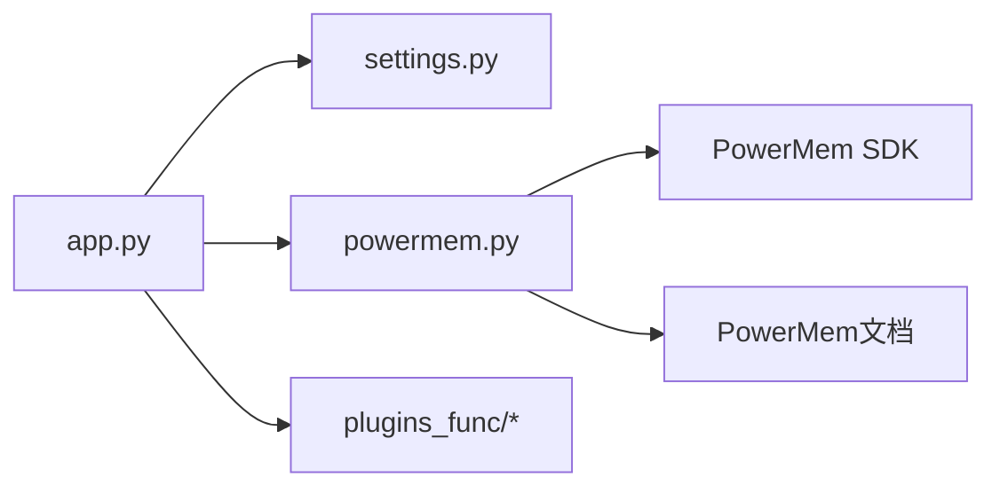

# PowerMem智能记忆系统

<cite>
**本文档引用的文件**
- [PowerMem-1.1.0-Analysis.md](file://main/xiaozhi-server/docs/powermem/PowerMem-1.1.0-Analysis.md)
- [PowerMem-Metadata-Fields.md](file://main/xiaozhi-server/docs/powermem/PowerMem-Metadata-Fields.md)
- [PowerMem-Plugin-vs-Infer.md](file://main/xiaozhi-server/docs/powermem/PowerMem-Plugin-vs-Infer.md)
- [PowerMem-SQL生成原理详解.md](file://main/xiaozhi-server/docs/powermem/PowerMem-SQL生成原理详解.md)
- [PowerMem-记忆处理原理详解.md](file://main/xiaozhi-server/docs/powermem/PowerMem-记忆处理原理详解.md)
- [PowerMemory-Intelligent-Processing-Flow.md](file://main/xiaozhi-server/docs/powermem/PowerMemory-Intelligent-Processing-Flow.md)
- [PowerMem-Issues.md](file://main/xiaozhi-server/docs/powermem/PowerMem-Issues.md)
- [powermem.py](file://main/xiaozhi-server/core/providers/memory/powermem/powermem.py)
- [memory.py](file://main/xiaozhi-server/core/utils/memory.py)
- [settings.py](file://main/xiaozhi-server/config/settings.py)
- [app.py](file://main/xiaozhi-server/app.py)
- [loadplugins.py](file://main/xiaozhi-server/plugins_func/loadplugins.py)
- [register.py](file://main/xiaozhi-server/plugins_func/register.py)
</cite>

## 目录
1. [简介](#简介)
2. [项目结构](#项目结构)
3. [核心组件](#核心组件)
4. [架构总览](#架构总览)
5. [详细组件分析](#详细组件分析)
6. [依赖关系分析](#依赖关系分析)
7. [性能考量](#性能考量)
8. [故障排查指南](#故障排查指南)
9. [结论](#结论)
10. [附录](#附录)

## 简介
PowerMem智能记忆系统是面向AI代理的开源记忆组件，提供高效的向量记忆存储、混合检索、智能合并与遗忘管理能力。在本项目中，PowerMem通过适配层集成到ESP32服务器，支持用户画像模式与普通记忆模式，具备事实提取、相似记忆检索、LLM决策合并、以及基于艾宾浩斯遗忘曲线的自动清理能力。

## 项目结构
本项目采用模块化分层架构，核心记忆提供者位于`core/providers/memory/powermem/`，文档位于`docs/powermem/`，配置与应用入口位于`config/`与`app.py`，工具函数与插件注册位于`plugins_func/`。

**图表来源**
- [app.py:46-160](file://main/xiaozhi-server/app.py#L46-L160)
- [powermem.py:1-450](file://main/xiaozhi-server/core/providers/memory/powermem/powermem.py#L1-L450)
- [settings.py:1-34](file://main/xiaozhi-server/config/settings.py#L1-L34)
- [memory.py:1-19](file://main/xiaozhi-server/core/utils/memory.py#L1-L19)
- [loadplugins.py:1-25](file://main/xiaozhi-server/plugins_func/loadplugins.py#L1-L25)
- [register.py:1-142](file://main/xiaozhi-server/plugins_func/register.py#L1-L142)

**章节来源**
- [app.py:46-160](file://main/xiaozhi-server/app.py#L46-L160)
- [powermem.py:1-450](file://main/xiaozhi-server/core/providers/memory/powermem/powermem.py#L1-L450)
- [settings.py:1-34](file://main/xiaozhi-server/config/settings.py#L1-L34)
- [memory.py:1-19](file://main/xiaozhi-server/core/utils/memory.py#L1-L19)
- [loadplugins.py:1-25](file://main/xiaozhi-server/plugins_func/loadplugins.py#L1-L25)
- [register.py:1-142](file://main/xiaozhi-server/plugins_func/register.py#L1-L142)

## 核心组件
- PowerMem适配器：负责初始化PowerMem客户端、保存记忆、查询记忆、用户画像缓存与获取。
- 文档与策略：提供智能模式与简单模式、插件机制、SQL生成、元数据字段、问题清单等技术文档。
- 插件与工具注册：提供函数注册、设备类型注册、工具类型枚举等插件基础设施。

**章节来源**
- [powermem.py:23-176](file://main/xiaozhi-server/core/providers/memory/powermem/powermem.py#L23-L176)
- [PowerMem-Plugin-vs-Infer.md:1-578](file://main/xiaozhi-server/docs/powermem/PowerMem-Plugin-vs-Infer.md#L1-L578)
- [PowerMem-SQL生成原理详解.md:1-800](file://main/xiaozhi-server/docs/powermem/PowerMem-SQL生成原理详解.md#L1-L800)
- [PowerMem-Metadata-Fields.md:1-555](file://main/xiaozhi-server/docs/powermem/PowerMem-Metadata-Fields.md#L1-L555)
- [PowerMem-Issues.md:1-376](file://main/xiaozhi-server/docs/powermem/PowerMem-Issues.md#L1-L376)

## 架构总览
PowerMem在本项目中的架构由三层组成：应用入口与配置、记忆提供者适配层、PowerMem SDK与存储后端。应用通过适配器调用PowerMem的异步/同步接口，实现记忆的保存与查询，并在查询时触发智能插件的遗忘清理逻辑。

**图表来源**
- [app.py:46-160](file://main/xiaozhi-server/app.py#L46-L160)
- [powermem.py:150-176](file://main/xiaozhi-server/core/providers/memory/powermem/powermem.py#L150-L176)
- [powermem.py:283-385](file://main/xiaozhi-server/core/providers/memory/powermem/powermem.py#L283-L385)

**章节来源**
- [app.py:46-160](file://main/xiaozhi-server/app.py#L46-L160)
- [powermem.py:150-176](file://main/xiaozhi-server/core/providers/memory/powermem/powermem.py#L150-L176)
- [powermem.py:283-385](file://main/xiaozhi-server/core/providers/memory/powermem/powermem.py#L283-L385)

## 详细组件分析

### 组件A：PowerMem适配器（MemoryProvider）
- 初始化：根据配置选择UserMemory或AsyncMemory模式，支持向量存储、LLM、嵌入模型与智能记忆插件配置。
- 保存记忆：将消息列表格式化后调用SDK的add方法，支持智能模式与用户画像模式。
- 查询记忆：根据查询内容检索相似记忆，格式化返回结果，支持用户画像前置展示。
- 用户画像：提供缓存机制，避免重复拉取，提升性能。

**图表来源**
- [powermem.py:23-176](file://main/xiaozhi-server/core/providers/memory/powermem/powermem.py#L23-L176)
- [powermem.py:177-281](file://main/xiaozhi-server/core/providers/memory/powermem/powermem.py#L177-L281)
- [powermem.py:283-385](file://main/xiaozhi-server/core/providers/memory/powermem/powermem.py#L283-L385)
- [powermem.py:387-449](file://main/xiaozhi-server/core/providers/memory/powermem/powermem.py#L387-L449)

**章节来源**
- [powermem.py:23-176](file://main/xiaozhi-server/core/providers/memory/powermem/powermem.py#L23-L176)
- [powermem.py:177-281](file://main/xiaozhi-server/core/providers/memory/powermem/powermem.py#L177-L281)
- [powermem.py:283-385](file://main/xiaozhi-server/core/providers/memory/powermem/powermem.py#L283-L385)
- [powermem.py:387-449](file://main/xiaozhi-server/core/providers/memory/powermem/powermem.py#L387-L449)

### 组件B：智能记忆处理流程（触发与决策）
- 触发条件：每次调用add()且infer=True时触发，需要消息列表非空。
- 事实提取：使用LLM提取关键事实，包含时间、意图、偏好等。
- 相似检索：为每个事实生成向量并检索相似记忆，限制候选数量。
- 决策合并：LLM对ADD/UPDATE/DELETE/NONE进行决策，执行相应操作。
- 删除风险：提示词要求谨慎删除，但仍可能出现矛盾删除。

**图表来源**
- [PowerMemory-Intelligent-Processing-Flow.md:9-346](file://main/xiaozhi-server/docs/powermem/PowerMemory-Intelligent-Processing-Flow.md#L9-L346)
- [PowerMem-1.1.0-Analysis.md:17-47](file://main/xiaozhi-server/docs/powermem/PowerMem-1.1.0-Analysis.md#L17-L47)
- [PowerMem-记忆处理原理详解.md:35-200](file://main/xiaozhi-server/docs/powermem/PowerMem-记忆处理原理详解.md#L35-L200)

**章节来源**
- [PowerMemory-Intelligent-Processing-Flow.md:9-346](file://main/xiaozhi-server/docs/powermem/PowerMemory-Intelligent-Processing-Flow.md#L9-L346)
- [PowerMem-1.1.0-Analysis.md:17-47](file://main/xiaozhi-server/docs/powermem/PowerMem-1.1.0-Analysis.md#L17-L47)
- [PowerMem-记忆处理原理详解.md:35-200](file://main/xiaozhi-server/docs/powermem/PowerMem-记忆处理原理详解.md#L35-L200)

### 组件C：SQL生成与执行（UPDATE/DELETE）
- UPDATE流程：生成新向量、内容哈希，合并payload，通过UPSERT原子更新，保留created_at，更新updated_at。
- DELETE流程：检查权限与存在性，删除向量存储记录，清理知识图谱实体与关系。
- 字段映射：content/data/text_content/fulltext_content等跨层映射，确保一致性。
- 性能优化：UPSERT保证原子性与幂等性，批量操作提升吞吐。

**图表来源**
- [PowerMem-SQL生成原理详解.md:29-423](file://main/xiaozhi-server/docs/powermem/PowerMem-SQL生成原理详解.md#L29-L423)
- [PowerMem-SQL生成原理详解.md:425-684](file://main/xiaozhi-server/docs/powermem/PowerMem-SQL生成原理详解.md#L425-L684)

**章节来源**
- [PowerMem-SQL生成原理详解.md:29-423](file://main/xiaozhi-server/docs/powermem/PowerMem-SQL生成原理详解.md#L29-L423)
- [PowerMem-SQL生成原理详解.md:425-684](file://main/xiaozhi-server/docs/powermem/PowerMem-SQL生成原理详解.md#L425-L684)

### 组件D：元数据字段与检索优化
- 元数据字段：融合信息(_fusion_info)、融合评分(_fusion_score)、质量评分(_quality_score)、向量相似度(_vector_similarity)、搜索计数(search_count)、最后检索时间(last_searched_at)。
- 融合算法：RRF与加权平均，支持向量/全文/稀疏向量多路融合。
- 优化策略：基于search_count与last_searched_at识别热门与冷门记忆，创建索引加速查询。

**图表来源**
- [PowerMem-记忆处理原理详解.md:434-494](file://main/xiaozhi-server/docs/powermem/PowerMem-记忆处理原理详解.md#L434-L494)
- [PowerMem-Metadata-Fields.md:33-380](file://main/xiaozhi-server/docs/powermem/PowerMem-Metadata-Fields.md#L33-L380)

**章节来源**
- [PowerMem-Metadata-Fields.md:33-380](file://main/xiaozhi-server/docs/powermem/PowerMem-Metadata-Fields.md#L33-L380)
- [PowerMem-记忆处理原理详解.md:434-494](file://main/xiaozhi-server/docs/powermem/PowerMem-记忆处理原理详解.md#L434-L494)

### 组件E：插件机制与推理系统区别
- 插件机制（智能插件）：控制搜索时的智能管理，包括遗忘判断、访问统计、升级检查等，受配置开关控制。
- 推理系统（LLM）：控制添加时的事实提取、相似检索与决策合并，受infer参数控制。
- 关键区别：plugin.enabled:false可完全禁用搜索时的自动删除；infer:false仅禁用添加时的智能处理，不影响搜索时的删除。

**图表来源**
- [PowerMem-Plugin-vs-Infer.md:26-318](file://main/xiaozhi-server/docs/powermem/PowerMem-Plugin-vs-Infer.md#L26-L318)
- [PowerMem-1.1.0-Analysis.md:101-125](file://main/xiaozhi-server/docs/powermem/PowerMem-1.1.0-Analysis.md#L101-L125)

**章节来源**
- [PowerMem-Plugin-vs-Infer.md:26-318](file://main/xiaozhi-server/docs/powermem/PowerMem-Plugin-vs-Infer.md#L26-L318)
- [PowerMem-1.1.0-Analysis.md:101-125](file://main/xiaozhi-server/docs/powermem/PowerMem-1.1.0-Analysis.md#L101-L125)

### 组件F：插件系统与工具注册
- 自动导入：遍历包内模块并导入，便于扩展工具函数。
- 函数注册：提供装饰器与注册表，支持函数描述、类型与动作响应。
- 设备类型注册：通过设备能力描述生成类型ID，管理设备函数集合。

**图表来源**
- [register.py:104-142](file://main/xiaozhi-server/plugins_func/register.py#L104-L142)
- [register.py:53-77](file://main/xiaozhi-server/plugins_func/register.py#L53-L77)
- [register.py:45-51](file://main/xiaozhi-server/plugins_func/register.py#L45-L51)

**章节来源**
- [loadplugins.py:9-25](file://main/xiaozhi-server/plugins_func/loadplugins.py#L9-L25)
- [register.py:104-142](file://main/xiaozhi-server/plugins_func/register.py#L104-L142)
- [register.py:53-77](file://main/xiaozhi-server/plugins_func/register.py#L53-L77)
- [register.py:45-51](file://main/xiaozhi-server/plugins_func/register.py#L45-L51)

## 依赖关系分析
- 应用入口依赖配置加载与日志系统，启动WebSocket与HTTP服务。
- MemoryProvider依赖PowerMem SDK与配置，提供异步/同步接口。
- 文档与策略文件为适配器提供设计与实现依据。
- 插件系统为工具扩展提供基础设施。

**图表来源**
- [app.py:46-160](file://main/xiaozhi-server/app.py#L46-L160)
- [powermem.py:150-176](file://main/xiaozhi-server/core/providers/memory/powermem/powermem.py#L150-L176)
- [loadplugins.py:9-25](file://main/xiaozhi-server/plugins_func/loadplugins.py#L9-L25)

**章节来源**
- [app.py:46-160](file://main/xiaozhi-server/app.py#L46-L160)
- [powermem.py:150-176](file://main/xiaozhi-server/core/providers/memory/powermem/powermem.py#L150-L176)
- [loadplugins.py:9-25](file://main/xiaozhi-server/plugins_func/loadplugins.py#L9-L25)

## 性能考量
- 智能模式成本：每次add()触发2次LLM调用，Token消耗较高，延迟约3-5秒。
- 简单模式优势：无LLM调用，延迟约0.5秒，适合临时对话与性能敏感场景。
- 缓存与复用：用户画像缓存、向量嵌入复用、限制提示词长度，减少重复计算。
- 存储优化：UPSERT保证原子性与幂等性，批量操作提升吞吐；为search_count与last_searched_at创建索引加速查询。

**章节来源**
- [PowerMem-记忆处理原理详解.md:533-580](file://main/xiaozhi-server/docs/powermem/PowerMem-记忆处理原理详解.md#L533-L580)
- [PowerMem-Metadata-Fields.md:482-511](file://main/xiaozhi-server/docs/powermem/PowerMem-Metadata-Fields.md#L482-L511)
- [PowerMem-SQL生成原理详解.md:771-787](file://main/xiaozhi-server/docs/powermem/PowerMem-SQL生成原理详解.md#L771-L787)

## 故障排查指南
- SDK Bug：graph_store初始化错误，需应用层monkey-patch修正；确保配置包含enabled字段与embedding_model_dims。
- 对话未挂断时旧记忆被删除：这是智能插件基于艾宾浩斯遗忘曲线在查询时的自动清理行为，可通过禁用智能插件或调整遗忘参数解决。
- 配置验证：启动后检查memories、user_profiles、graph_entities、graph_relations表是否创建。
- 日志定位：查看facts提取、记忆决策、用户画像提取与记忆数量变化的日志。

**章节来源**
- [PowerMem-Issues.md:5-41](file://main/xiaozhi-server/docs/powermem/PowerMem-Issues.md#L5-L41)
- [PowerMem-Issues.md:91-301](file://main/xiaozhi-server/docs/powermem/PowerMem-Issues.md#L91-L301)
- [PowerMem-Issues.md:319-376](file://main/xiaozhi-server/docs/powermem/PowerMem-Issues.md#L319-L376)

## 结论
PowerMem在本项目中提供了完整的智能记忆能力，包括事实提取、相似检索、LLM决策合并与遗忘管理。通过配置开关与参数控制，可在“记忆持久性”与“智能合并”之间取得平衡。建议在生产环境中优先考虑稳定性与可预测性，必要时禁用智能插件以避免意外删除；在开发与测试环境中可启用智能模式以获得更好的记忆质量。

## 附录
- 配置参数建议
  - 禁用智能插件：`memory.powermem.intelligent_memory.plugin.enabled: false`
  - 禁用智能添加：`memory_client.add(..., infer=False)`
  - 用户画像模式：`enable_user_profile: true`
  - 向量存储：`vector_store.provider: oceanbase`
  - LLM/Embedding：`llm.provider/embedder.provider`与对应API Key
- 性能调优
  - 批量UPSER操作
  - 为search_count与last_searched_at创建索引
  - 启用用户画像缓存
  - 限制候选记忆数量，避免LLM提示词过长

**章节来源**
- [PowerMem-Plugin-vs-Infer.md:391-458](file://main/xiaozhi-server/docs/powermem/PowerMem-Plugin-vs-Infer.md#L391-L458)
- [PowerMem-Metadata-Fields.md:482-511](file://main/xiaozhi-server/docs/powermem/PowerMem-Metadata-Fields.md#L482-L511)
- [PowerMem-记忆处理原理详解.md:533-580](file://main/xiaozhi-server/docs/powermem/PowerMem-记忆处理原理详解.md#L533-L580)