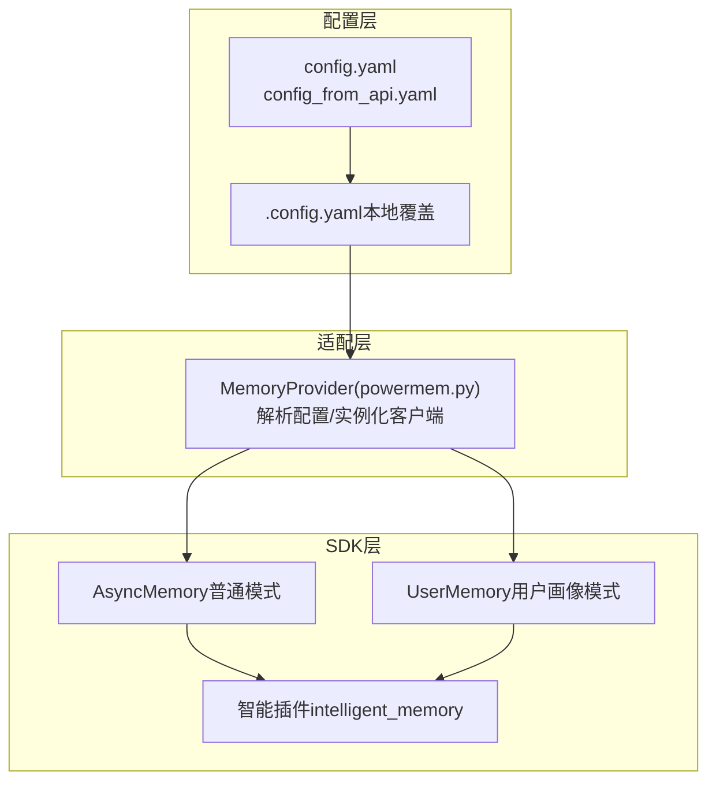
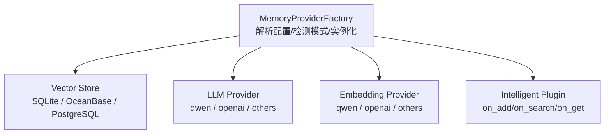
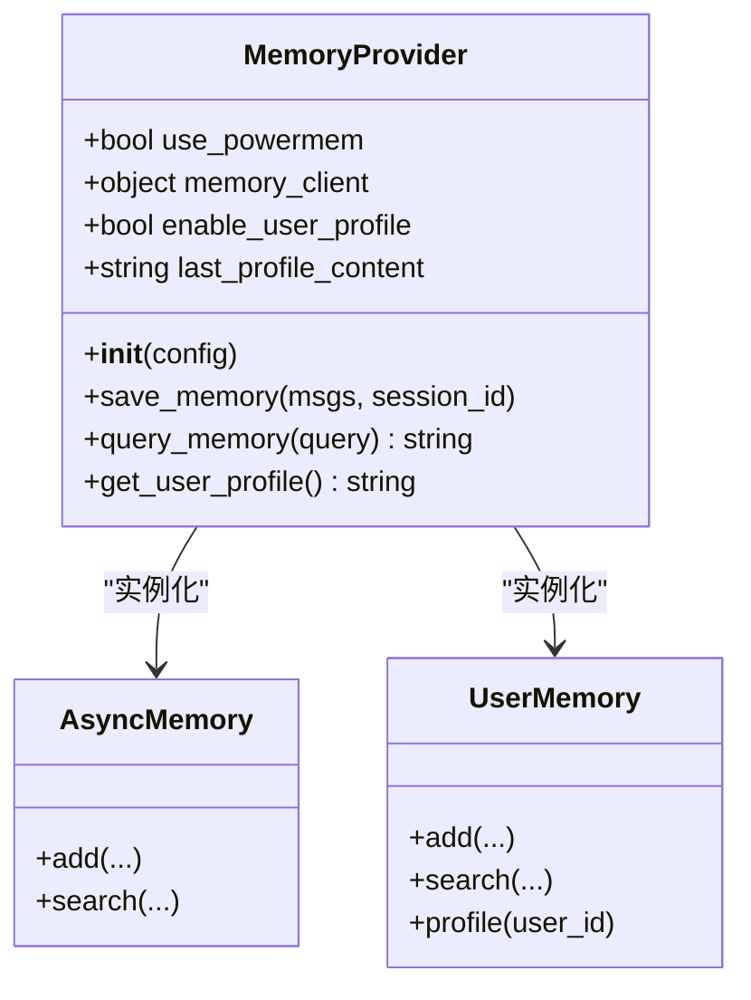
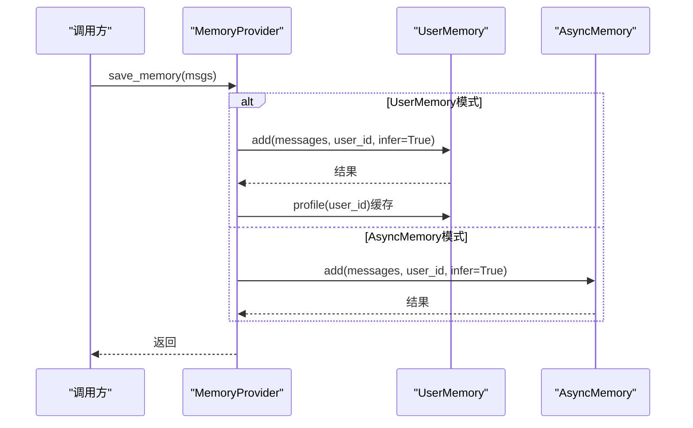
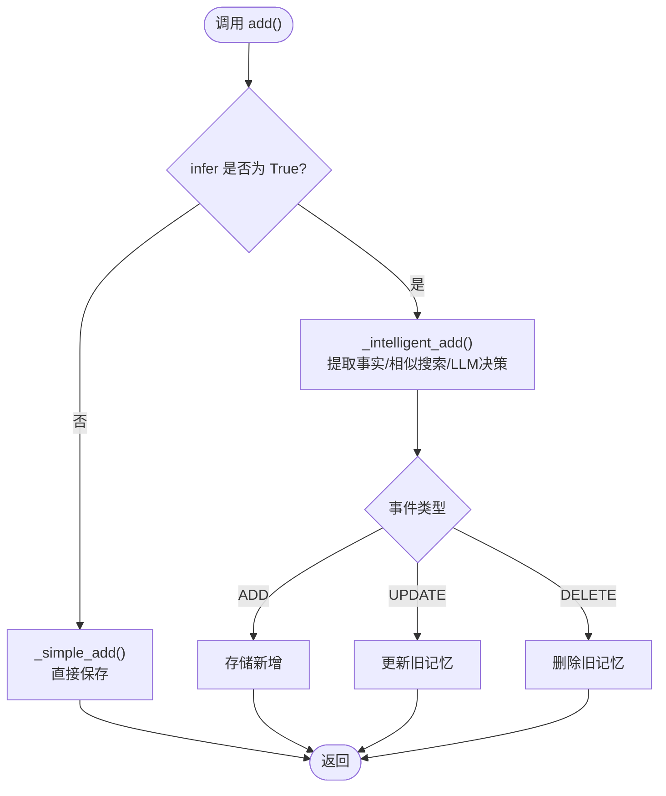
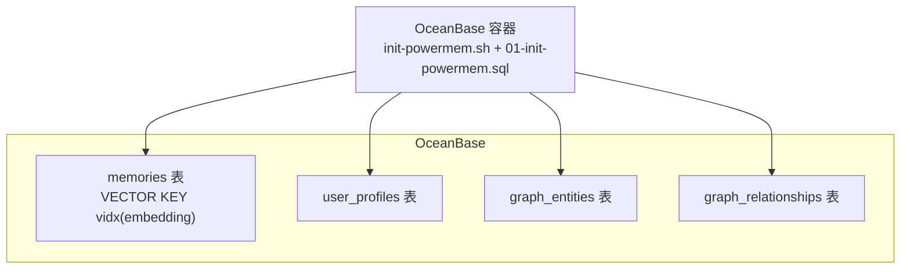
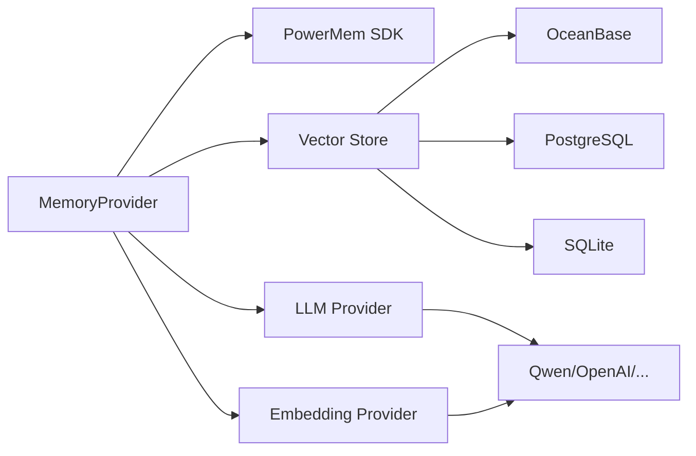

# PowerMem架构设计

<cite>
**本文引用的文件**
- [PowerMem-1.1.0-Analysis.md](file://main/xiaozhi-server/docs/powermem/PowerMem-1.1.0-Analysis.md)
- [PowerMem-Plugin-vs-Infer.md](file://main/xiaozhi-server/docs/powermem/PowerMem-Plugin-vs-Infer.md)
- [PowerMem-Metadata-Fields.md](file://main/xiaozhi-server/docs/powermem/PowerMem-Metadata-Fields.md)
- [PowerMem-Issues.md](file://main/xiaozhi-server/docs/powermem/PowerMem-Issues.md)
- [Memory_System_Architecture_Blueprint.md.bak](file://main/xiaozhi-server/docs/architecture/Memory_System_Architecture_Blueprint.md.bak)
- [Memory_System_Architecture_Blueprint.md.bak3](file://main/xiaozhi-server/docs/architecture/Memory_System_Architecture_Blueprint.md.bak3)
- [powermem.py](file://main/xiaozhi-server/core/providers/memory/powermem/powermem.py)
- [config.yaml](file://main/xiaozhi-server/config.yaml)
- [config_from_api.yaml](file://main/xiaozhi-server/config_from_api.yaml)
- [init-powermem.sh](file://main/xiaozhi-server/oceanbase/init-powermem.sh)
- [01-init-powermem.sql](file://main/xiaozhi-server/oceanbase/init/01-init-powermem.sql)
- [README.md](file://main/xiaozhi-server/oceanbase/README.md)
- [002-memory-loss-root-cause-20260506.md](file://main/xiaozhi-server/docs/issues/002-memory-loss-root-cause-20260506.md)
</cite>

## 目录
1. [简介](#简介)
2. [项目结构](#项目结构)
3. [核心组件](#核心组件)
4. [架构总览](#架构总览)
5. [详细组件分析](#详细组件分析)
6. [依赖关系分析](#依赖关系分析)
7. [性能考量](#性能考量)
8. [故障排查指南](#故障排查指南)
9. [结论](#结论)
10. [附录](#附录)

## 简介
本文件面向PowerMem 1.1.0版本的架构设计与实现，系统性梳理其整体架构、组件层次、模块划分与设计模式，重点覆盖以下方面：
- 向量存储后端（sqlite、oceanbase、postgres）的选择策略与配置方法
- LLM提供商（qwen、openai等）与嵌入提供商的集成机制
- 异步内存管理器（AsyncMemory）与用户记忆（UserMemory）两种模式的区别与适用场景
- 配置参数详解、初始化流程与错误处理机制
- 实际配置示例与最佳实践建议

## 项目结构
PowerMem在本项目中的落地由“配置层-适配层-SDK层”三层协作构成：
- 配置层：通过config.yaml与data/.config.yaml提供统一的三段式配置合并（内置默认、远端API、本地覆盖）
- 适配层：core/providers/memory/powermem/powermem.py负责解析配置、构建PowerMem SDK所需参数、实例化AsyncMemory或UserMemory
- SDK层：调用PowerMem SDK的AsyncMemory/UserMemory进行记忆的保存、查询与智能管理

图表来源
- [powermem.py:40-166](file://main/xiaozhi-server/core/providers/memory/powermem/powermem.py#L40-L166)
- [config.yaml:278-342](file://main/xiaozhi-server/config.yaml#L278-L342)
- [config_from_api.yaml:1-27](file://main/xiaozhi-server/config_from_api.yaml#L1-L27)

章节来源
- [powermem.py:40-166](file://main/xiaozhi-server/core/providers/memory/powermem/powermem.py#L40-L166)
- [config.yaml:278-342](file://main/xiaozhi-server/config.yaml#L278-L342)
- [config_from_api.yaml:1-27](file://main/xiaozhi-server/config_from_api.yaml#L1-L27)

## 核心组件
- MemoryProvider（PowerMem适配器）
  - 负责解析配置、拼装PowerMem SDK所需的vector_store、llm、embedder、intelligent_memory等参数
  - 根据enable_user_profile选择UserMemory或AsyncMemory实例
  - 提供save_memory/query_memory接口，封装PowerMem SDK调用与缓存逻辑
- AsyncMemory（异步内存管理器）
  - 普通记忆模式，适合不需要用户画像的场景
  - 支持异步search，适合高并发
- UserMemory（用户记忆）
  - 用户画像模式，自动提取并维护用户画像（topics/profile_content）
  - 支持profile缓存，避免重复拉取
- 智能插件（intelligent_memory）
  - 控制是否启用“搜索时的智能管理”，包括是否执行遗忘删除、访问统计等
  - 与add()的infer参数共同决定“智能添加/简单添加”

章节来源
- [powermem.py:23-166](file://main/xiaozhi-server/core/providers/memory/powermem/powermem.py#L23-L166)
- [PowerMem-Plugin-vs-Infer.md:1-578](file://main/xiaozhi-server/docs/powermem/PowerMem-Plugin-vs-Infer.md#L1-L578)

## 架构总览
PowerMem架构采用“工厂+适配器+SDK”的分层设计：
- MemoryProviderFactory：解析三段式配置，检测模式（UserMemory/AsyncMemory），实例化对应Provider
- 存储后端层：SQLite（本地开发）、OceanBase（生产向量+图谱）、PostgreSQL（云上向量）
- LLM/Embedding层：支持qwen、openai等多家供应商，适配不同base_url与模型
- 智能管理层：插件化控制“添加/搜索/获取”生命周期钩子，实现遗忘曲线、访问统计、自动删除等

图表来源
- [Memory_System_Architecture_Blueprint.md.bak:161-171](file://main/xiaozhi-server/docs/architecture/Memory_System_Architecture_Blueprint.md.bak#L161-L171)
- [Memory_System_Architecture_Blueprint.md.bak3:146-152](file://main/xiaozhi-server/docs/architecture/Memory_System_Architecture_Blueprint.md.bak3#L146-L152)

章节来源
- [Memory_System_Architecture_Blueprint.md.bak:161-171](file://main/xiaozhi-server/docs/architecture/Memory_System_Architecture_Blueprint.md.bak#L161-L171)
- [Memory_System_Architecture_Blueprint.md.bak3:146-152](file://main/xiaozhi-server/docs/architecture/Memory_System_Architecture_Blueprint.md.bak3#L146-L152)

## 详细组件分析

### 组件A：MemoryProvider（PowerMem适配器）
- 职责
  - 解析enable_user_profile，选择UserMemory或AsyncMemory
  - 构造vector_store、llm、embedder、intelligent_memory等配置字典
  - 封装save_memory/query_memory，处理JSON内容提取、profile缓存、异步await等
- 关键点
  - 支持两种配置风格：PowerMem风格（database/vector_store）与mem0风格（vector_store）
  - LLM与Embedding的base_url优先级策略：embedding_xxx_base_url > embedding_base_url > xxx_base_url
  - UserMemory模式下，get_user_profile采用缓存-回源策略

图表来源
- [powermem.py:23-450](file://main/xiaozhi-server/core/providers/memory/powermem/powermem.py#L23-L450)

章节来源
- [powermem.py:40-166](file://main/xiaozhi-server/core/providers/memory/powermem/powermem.py#L40-L166)
- [powermem.py:177-281](file://main/xiaozhi-server/core/providers/memory/powermem/powermem.py#L177-L281)
- [powermem.py:283-450](file://main/xiaozhi-server/core/providers/memory/powermem/powermem.py#L283-L450)

### 组件B：异步内存管理器（AsyncMemory）与用户记忆（UserMemory）
- AsyncMemory（普通模式）
  - 适合不需要用户画像的场景
  - search为异步调用，适合高并发
- UserMemory（用户画像模式）
  - 自动提取用户画像（profile_content/topics），并缓存
  - search时可将用户画像注入结果
- 选择策略
  - enable_user_profile=true：UserMemory
  - enable_user_profile=false：AsyncMemory

图表来源
- [powermem.py:177-281](file://main/xiaozhi-server/core/providers/memory/powermem/powermem.py#L177-L281)
- [powermem.py:387-450](file://main/xiaozhi-server/core/providers/memory/powermem/powermem.py#L387-L450)

章节来源
- [powermem.py:151-158](file://main/xiaozhi-server/core/providers/memory/powermem/powermem.py#L151-L158)
- [PowerMem-1.1.0-Analysis.md:128-209](file://main/xiaozhi-server/docs/powermem/PowerMem-1.1.0-Analysis.md#L128-L209)

### 组件C：智能插件与智能添加模式（infer）
- plugin.enabled控制“搜索时的智能管理”
  - 禁用后：搜索时不执行should_forget、不删除记忆
  - 启用后：按遗忘曲线等规则自动删除旧记忆
- infer控制“添加时的智能处理”
  - infer=True：智能模式，提取事实、相似搜索、LLM决策（ADD/UPDATE/DELETE）
  - infer=False：简单模式，直接保存，不合并、不删除
- 二者区别
  - plugin.enabled影响搜索时的自动删除
  - infer=False影响添加时的事实提取与合并

图表来源
- [PowerMem-Plugin-vs-Infer.md:101-189](file://main/xiaozhi-server/docs/powermem/PowerMem-Plugin-vs-Infer.md#L101-L189)

章节来源
- [PowerMem-Plugin-vs-Infer.md:1-578](file://main/xiaozhi-server/docs/powermem/PowerMem-Plugin-vs-Infer.md#L1-L578)
- [PowerMem-1.1.0-Analysis.md:9-96](file://main/xiaozhi-server/docs/powermem/PowerMem-1.1.0-Analysis.md#L9-L96)

### 组件D：向量存储后端与配置
- 后端选择
  - sqlite：本地开发/轻量场景
  - oceanbase：生产向量+图谱，支持VSAG/HNSW索引、IK分词
  - postgres：云上向量（pgvector）
- OceanBase配置要点
  - 初始化脚本创建memories、user_profiles、graph_entities、graph_relationships表
  - 向量维度需与嵌入模型一致（如1536）
  - graph_store需显式启用并提供embedding_model_dims
- 配置来源
  - config.yaml提供默认示例
  - data/.config.yaml用于本地覆盖
  - config_from_api.yaml支持从Manager-API拉取配置

图表来源
- [init-powermem.sh:1-97](file://main/xiaozhi-server/oceanbase/init-powermem.sh#L1-L97)
- [01-init-powermem.sql:1-66](file://main/xiaozhi-server/oceanbase/init/01-init-powermem.sql#L1-L66)
- [README.md:31-64](file://main/xiaozhi-server/oceanbase/README.md#L31-L64)

章节来源
- [config.yaml:316-331](file://main/xiaozhi-server/config.yaml#L316-L331)
- [README.md:1-384](file://main/xiaozhi-server/oceanbase/README.md#L1-L384)
- [01-init-powermem.sql:1-66](file://main/xiaozhi-server/oceanbase/init/01-init-powermem.sql#L1-L66)

### 组件E：LLM与嵌入提供商集成
- LLM提供商
  - qwen（dashscope_base_url）、openai（openai_base_url）等
  - 支持自定义base_url与模型名
- 嵌入提供商
  - qwen/openai等，支持自定义base_url与维度embedding_dims
- 集成策略
  - 优先级：embedding_xxx_base_url > embedding_base_url > xxx_base_url
  - 若未显式配置，自动推断provider类型并设置对应base_url

章节来源
- [powermem.py:84-136](file://main/xiaozhi-server/core/providers/memory/powermem/powermem.py#L84-L136)
- [config.yaml:298-315](file://main/xiaozhi-server/config.yaml#L298-L315)

## 依赖关系分析
- 组件耦合
  - MemoryProvider对PowerMem SDK强依赖，需确保SDK安装与版本兼容
  - UserMemory与AsyncMemory共享同一套配置入口，差异在于实例化与缓存策略
- 外部依赖
  - OceanBase：pyobvector、VSAG、HNSW索引
  - PostgreSQL：pgvector
  - LLM/Embedding：各供应商API与base_url
- 潜在风险
  - SDK v1.1.0存在graph_store初始化Bug，需在应用层进行monkey-patch
  - 缺少graph_store.enabled或embedding_model_dims会导致初始化失败

图表来源
- [powermem.py:167-176](file://main/xiaozhi-server/core/providers/memory/powermem/powermem.py#L167-L176)
- [PowerMem-Issues.md:1-69](file://main/xiaozhi-server/docs/powermem/PowerMem-Issues.md#L1-L69)

章节来源
- [powermem.py:167-176](file://main/xiaozhi-server/core/providers/memory/powermem/powermem.py#L167-L176)
- [PowerMem-Issues.md:1-69](file://main/xiaozhi-server/docs/powermem/PowerMem-Issues.md#L1-L69)

## 性能考量
- 搜索性能
  - OceanBase使用VSAG+HNSW索引，EF_SEARCH等参数可调优
  - 混合搜索（向量+全文）通过RRF融合，权重可配置
- 添加性能
  - infer=False可显著减少LLM调用，提升吞吐
  - UserMemory的profile缓存避免重复拉取
- 存储成本
  - OceanBase压缩与块大小参数可平衡IO与存储
  - metadata字段可用于统计与优化，但需定期清理冗余字段

章节来源
- [PowerMem-Metadata-Fields.md:482-511](file://main/xiaozhi-server/docs/powermem/PowerMem-Metadata-Fields.md#L482-L511)
- [README.md:276-311](file://main/xiaozhi-server/oceanbase/README.md#L276-L311)

## 故障排查指南
- SDK Bug与补丁
  - graph_store初始化错误：需在应用层进行monkey-patch
  - 缺少graph_store.enabled或embedding_model_dims会导致初始化失败
- 记忆删除问题
  - 若希望完全避免自动删除，需设置plugin.enabled=false
  - 若仅禁用智能添加，infer=False无法阻止搜索时的删除
- OceanBase初始化
  - 使用init-powermem.sh一键启动并执行初始化脚本
  - 检查容器健康、端口占用与索引状态
- 日志与监控
  - 使用ERROR级别记录DELETE操作，便于追踪
  - 结合metadata字段（search_count/last_searched_at）定位异常

章节来源
- [PowerMem-Issues.md:1-69](file://main/xiaozhi-server/docs/powermem/PowerMem-Issues.md#L1-L69)
- [002-memory-loss-root-cause-20260506.md:183-275](file://main/xiaozhi-server/docs/issues/002-memory-loss-root-cause-20260506.md#L183-L275)
- [init-powermem.sh:1-97](file://main/xiaozhi-server/oceanbase/init-powermem.sh#L1-L97)

## 结论
- PowerMem 1.1.0在本项目中通过“配置-适配-SDK”三层实现，具备良好的扩展性与可观测性
- 向量存储后端以OceanBase为首选，兼顾向量检索与知识图谱能力
- AsyncMemory与UserMemory分别满足“性能优先”和“画像优先”的两类需求
- 智能插件与infer参数共同决定“添加/搜索”的智能程度，需按场景正确配置
- 建议在生产中优先禁用自动删除（plugin.enabled=false），并结合监控与日志保障稳定性

## 附录

### 配置参数详解（节选）
- Memory.powermem
  - enable_user_profile: 是否启用UserMemory（布尔）
  - llm.embedder：LLM与嵌入配置（provider/base_url/model/dims等）
  - vector_store：向量存储配置（provider/config）
- OceanBase配置要点
  - host/port/user/password/db_name/collection_name/embedding_model_dims
  - graph_store.enabled与embedding_model_dims必填
- 三段式配置
  - config.yaml（默认）→ data/.config.yaml（本地覆盖）→ config_from_api.yaml（Manager-API）

章节来源
- [config.yaml:278-342](file://main/xiaozhi-server/config.yaml#L278-L342)
- [README.md:31-64](file://main/xiaozhi-server/oceanbase/README.md#L31-L64)
- [config_from_api.yaml:1-27](file://main/xiaozhi-server/config_from_api.yaml#L1-L27)

### 初始化流程
- OceanBase
  - 执行init-powermem.sh → 等待容器健康 → 执行01-init-powermem.sql
- PowerMem
  - 读取三段式配置 → 解析enable_user_profile → 实例化AsyncMemory/UserMemory → 调用SDK

章节来源
- [init-powermem.sh:1-97](file://main/xiaozhi-server/oceanbase/init-powermem.sh#L1-L97)
- [powermem.py:40-166](file://main/xiaozhi-server/core/providers/memory/powermem/powermem.py#L40-L166)

### 错误处理机制
- ImportError：提示安装PowerMem
- 其他异常：记录详细错误堆栈，避免中断流程
- 智能删除监控：在SDK侧添加DELETE日志，便于审计

章节来源
- [powermem.py:167-176](file://main/xiaozhi-server/core/providers/memory/powermem/powermem.py#L167-L176)
- [002-memory-loss-root-cause-20260506.md:183-192](file://main/xiaozhi-server/docs/issues/002-memory-loss-root-cause-20260506.md#L183-L192)