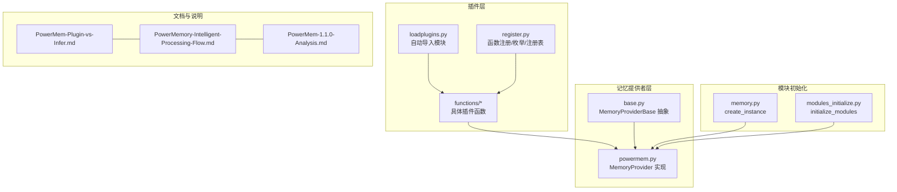
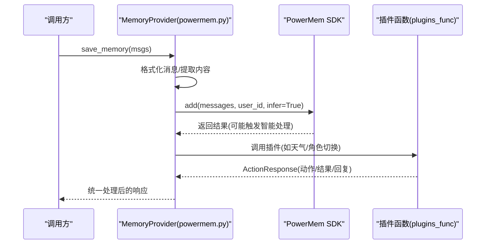
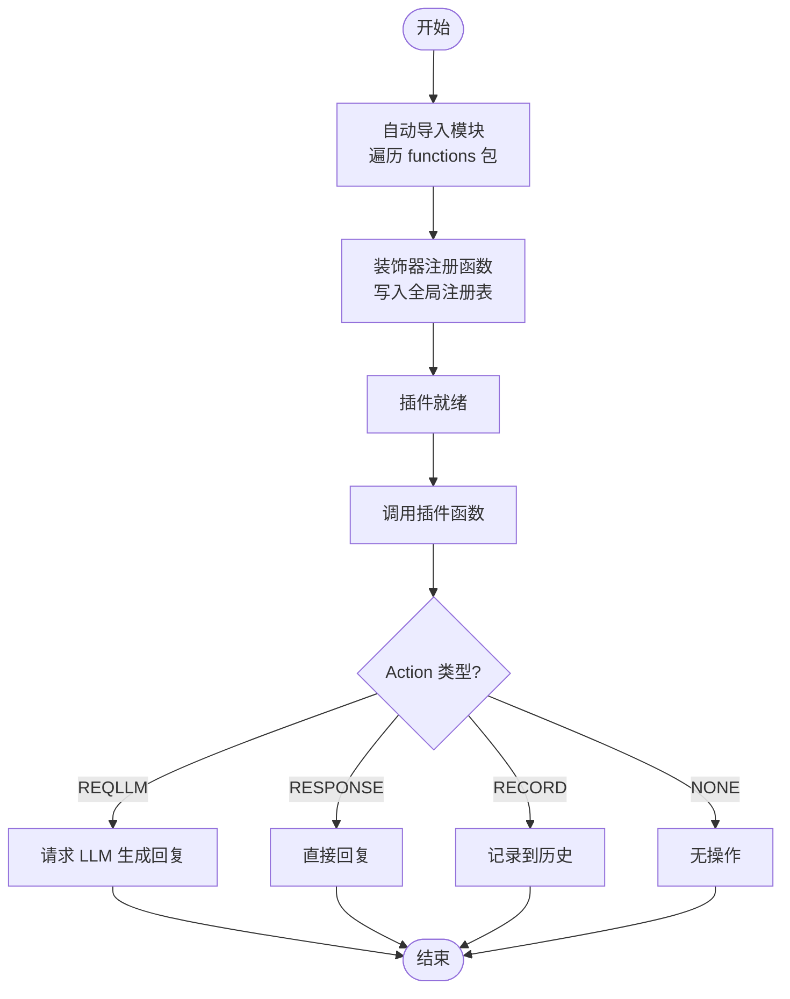
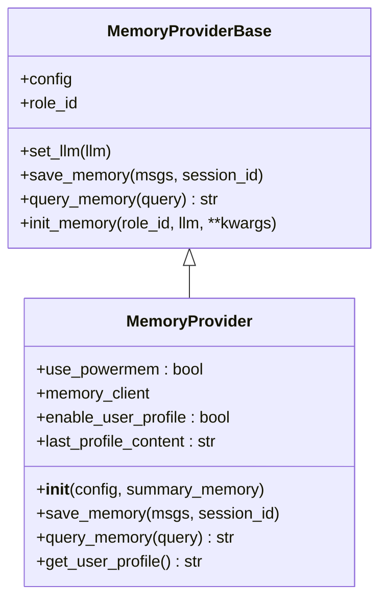
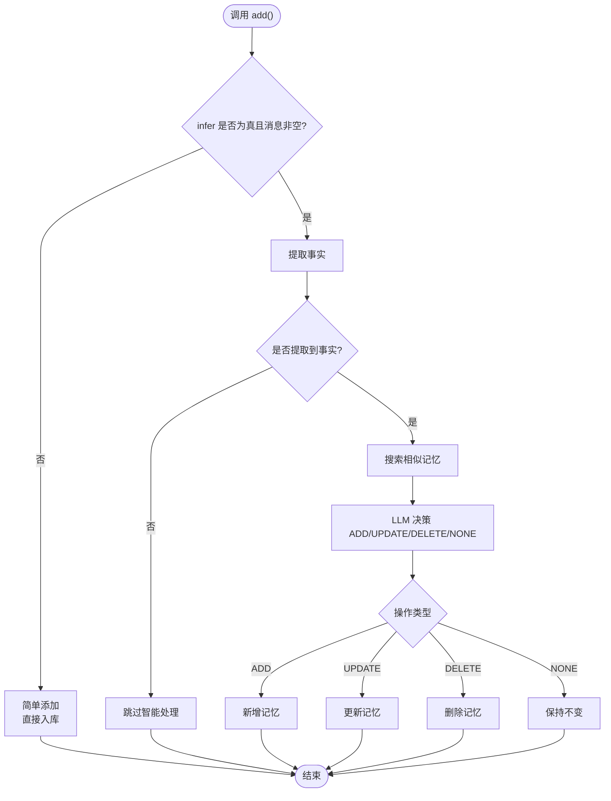
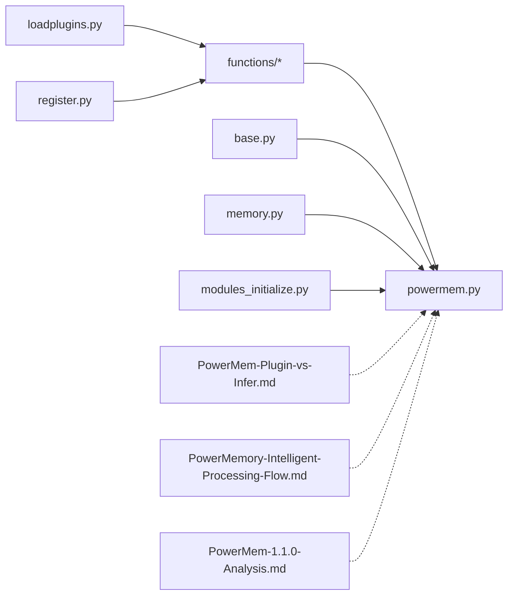

# 插件机制与推理系统

<cite>
**本文引用的文件**   
- [main/xiaozhi-server/plugins_func/loadplugins.py](file://main/xiaozhi-server/plugins_func/loadplugins.py)
- [main/xiaozhi-server/plugins_func/register.py](file://main/xiaozhi-server/plugins_func/register.py)
- [main/xiaozhi-server/plugins_func/functions/change_role.py](file://main/xiaozhi-server/plugins_func/functions/change_role.py)
- [main/xiaozhi-server/plugins_func/functions/get_weather.py](file://main/xiaozhi-server/plugins_func/functions/get_weather.py)
- [main/xiaozhi-server/core/providers/memory/powermem/powermem.py](file://main/xiaozhi-server/core/providers/memory/powermem/powermem.py)
- [main/xiaozhi-server/core/providers/memory/base.py](file://main/xiaozhi-server/core/providers/memory/base.py)
- [main/xiaozhi-server/core/utils/memory.py](file://main/xiaozhi-server/core/utils/memory.py)
- [main/xiaozhi-server/core/utils/modules_initialize.py](file://main/xiaozhi-server/core/utils/modules_initialize.py)
- [main/xiaozhi-server/docs/powermem/PowerMem-Plugin-vs-Infer.md](file://main/xiaozhi-server/docs/powermem/PowerMem-Plugin-vs-Infer.md)
- [main/xiaozhi-server/docs/powermem/PowerMemory-Intelligent-Processing-Flow.md](file://main/xiaozhi-server/docs/powermem/PowerMemory-Intelligent-Processing-Flow.md)
- [main/xiaozhi-server/docs/powermem/PowerMem-1.1.0-Analysis.md](file://main/xiaozhi-server/docs/powermem/PowerMem-1.1.0-Analysis.md)
</cite>

## 目录
1. [引言](#引言)
2. [项目结构](#项目结构)
3. [核心组件](#核心组件)
4. [架构总览](#架构总览)
5. [详细组件分析](#详细组件分析)
6. [依赖分析](#依赖分析)
7. [性能考量](#性能考量)
8. [故障排除指南](#故障排除指南)
9. [结论](#结论)
10. [附录](#附录)

## 引言
本技术文档聚焦于 PowerMem 插件机制与推理系统，系统性阐述插件注册、生命周期管理与依赖注入；深入解析推理系统的工作流程，包括智能记忆启用配置、插件参数传递与执行结果处理；对比插件机制与传统推理系统的差异与优势；并给出智能记忆插件的配置选项、启用条件与性能影响分析。最后提供插件开发指南、调试技巧与故障排除方法，以及实际配置示例与最佳实践。

## 项目结构
围绕 PowerMem 的插件与推理系统，相关代码主要分布在以下区域：
- 插件框架与注册中心：plugins_func/loadplugins.py、plugins_func/register.py、plugins_func/functions/*.py
- PowerMem 提供者实现：core/providers/memory/powermem/powermem.py、core/providers/memory/base.py
- 模块实例化与依赖注入：core/utils/memory.py、core/utils/modules_initialize.py
- 文档与设计说明：docs/powermem 下的系列文档

**图表来源**
- [main/xiaozhi-server/plugins_func/loadplugins.py:1-25](file://main/xiaozhi-server/plugins_func/loadplugins.py#L1-L25)
- [main/xiaozhi-server/plugins_func/register.py:1-142](file://main/xiaozhi-server/plugins_func/register.py#L1-L142)
- [main/xiaozhi-server/plugins_func/functions/change_role.py:1-59](file://main/xiaozhi-server/plugins_func/functions/change_role.py#L1-L59)
- [main/xiaozhi-server/plugins_func/functions/get_weather.py:1-229](file://main/xiaozhi-server/plugins_func/functions/get_weather.py#L1-L229)
- [main/xiaozhi-server/core/providers/memory/powermem/powermem.py:1-450](file://main/xiaozhi-server/core/providers/memory/powermem/powermem.py#L1-L450)
- [main/xiaozhi-server/core/providers/memory/base.py:1-29](file://main/xiaozhi-server/core/providers/memory/base.py#L1-L29)
- [main/xiaozhi-server/core/utils/memory.py:1-19](file://main/xiaozhi-server/core/utils/memory.py#L1-L19)
- [main/xiaozhi-server/core/utils/modules_initialize.py:1-152](file://main/xiaozhi-server/core/utils/modules_initialize.py#L1-L152)
- [main/xiaozhi-server/docs/powermem/PowerMem-Plugin-vs-Infer.md:1-578](file://main/xiaozhi-server/docs/powermem/PowerMem-Plugin-vs-Infer.md#L1-L578)
- [main/xiaozhi-server/docs/powermem/PowerMemory-Intelligent-Processing-Flow.md:1-346](file://main/xiaozhi-server/docs/powermem/PowerMemory-Intelligent-Processing-Flow.md#L1-L346)
- [main/xiaozhi-server/docs/powermem/PowerMem-1.1.0-Analysis.md:1-234](file://main/xiaozhi-server/docs/powermem/PowerMem-1.1.0-Analysis.md#L1-L234)

**章节来源**
- [main/xiaozhi-server/plugins_func/loadplugins.py:1-25](file://main/xiaozhi-server/plugins_func/loadplugins.py#L1-L25)
- [main/xiaozhi-server/plugins_func/register.py:1-142](file://main/xiaozhi-server/plugins_func/register.py#L1-L142)
- [main/xiaozhi-server/core/providers/memory/powermem/powermem.py:1-450](file://main/xiaozhi-server/core/providers/memory/powermem/powermem.py#L1-L450)
- [main/xiaozhi-server/core/providers/memory/base.py:1-29](file://main/xiaozhi-server/core/providers/memory/base.py#L1-L29)
- [main/xiaozhi-server/core/utils/memory.py:1-19](file://main/xiaozhi-server/core/utils/memory.py#L1-L19)
- [main/xiaozhi-server/core/utils/modules_initialize.py:1-152](file://main/xiaozhi-server/core/utils/modules_initialize.py#L1-L152)
- [main/xiaozhi-server/docs/powermem/PowerMem-Plugin-vs-Infer.md:1-578](file://main/xiaozhi-server/docs/powermem/PowerMem-Plugin-vs-Infer.md#L1-L578)
- [main/xiaozhi-server/docs/powermem/PowerMemory-Intelligent-Processing-Flow.md:1-346](file://main/xiaozhi-server/docs/powermem/PowerMemory-Intelligent-Processing-Flow.md#L1-L346)
- [main/xiaozhi-server/docs/powermem/PowerMem-1.1.0-Analysis.md:1-234](file://main/xiaozhi-server/docs/powermem/PowerMem-1.1.0-Analysis.md#L1-L234)

## 核心组件
- 插件注册与生命周期
  - 函数注册中心：维护函数名到 FunctionItem 的映射，支持注册、注销、查询与批量描述导出。
  - 插件枚举：ToolType、Action、ActionResponse 定义插件类型与动作语义。
  - 设备类型注册表：按设备能力描述生成类型签名，管理设备级函数集合。
  - 自动导入：遍历包内模块并导入，实现插件自动发现与加载。
- PowerMem 提供者
  - MemoryProviderBase：抽象接口，定义 save_memory、query_memory、init_memory 等。
  - MemoryProvider：实现 PowerMem 的初始化、配置转换、记忆保存与查询、用户画像缓存。
- 模块实例化与依赖注入
  - create_instance：按类名动态导入并实例化记忆提供者。
  - initialize_modules：统一初始化各模块（TTS/LLM/Intent/Memory/VAD/ASR），支持按需启用与类型选择。

**章节来源**
- [main/xiaozhi-server/plugins_func/register.py:1-142](file://main/xiaozhi-server/plugins_func/register.py#L1-L142)
- [main/xiaozhi-server/plugins_func/loadplugins.py:1-25](file://main/xiaozhi-server/plugins_func/loadplugins.py#L1-L25)
- [main/xiaozhi-server/core/providers/memory/base.py:1-29](file://main/xiaozhi-server/core/providers/memory/base.py#L1-L29)
- [main/xiaozhi-server/core/providers/memory/powermem/powermem.py:1-450](file://main/xiaozhi-server/core/providers/memory/powermem/powermem.py#L1-L450)
- [main/xiaozhi-server/core/utils/memory.py:1-19](file://main/xiaozhi-server/core/utils/memory.py#L1-L19)
- [main/xiaozhi-server/core/utils/modules_initialize.py:1-152](file://main/xiaozhi-server/core/utils/modules_initialize.py#L1-L152)

## 架构总览
PowerMem 推理系统通过“插件函数 + 记忆提供者”的组合实现智能记忆管理。插件函数由注册中心统一管理，调用时根据 ActionResponse 决定后续行为（直接回复、请求 LLM 生成、记录到历史等）。记忆提供者负责与 PowerMem SDK 交互，执行 add/search/profile 等操作，并支持用户画像模式与智能记忆插件开关。

**图表来源**
- [main/xiaozhi-server/core/providers/memory/powermem/powermem.py:177-281](file://main/xiaozhi-server/core/providers/memory/powermem/powermem.py#L177-L281)
- [main/xiaozhi-server/plugins_func/functions/get_weather.py:161-229](file://main/xiaozhi-server/plugins_func/functions/get_weather.py#L161-L229)
- [main/xiaozhi-server/plugins_func/functions/change_role.py:47-59](file://main/xiaozhi-server/plugins_func/functions/change_role.py#L47-L59)

## 详细组件分析

### 插件注册与生命周期管理
- 函数注册装饰器：将函数注册到全局注册表，便于统一调度与查询。
- 动态导入：遍历 functions 包内模块并导入，实现零样板自动发现。
- 设备类型注册：基于设备能力描述生成类型签名，集中管理设备函数集合。
- 生命周期钩子：结合智能记忆插件的 on_add/on_search/on_get 生命周期，实现智能记忆的启用/禁用与行为控制。

**图表来源**
- [main/xiaozhi-server/plugins_func/loadplugins.py:9-25](file://main/xiaozhi-server/plugins_func/loadplugins.py#L9-L25)
- [main/xiaozhi-server/plugins_func/register.py:83-142](file://main/xiaozhi-server/plugins_func/register.py#L83-L142)
- [main/xiaozhi-server/plugins_func/functions/get_weather.py:161-229](file://main/xiaozhi-server/plugins_func/functions/get_weather.py#L161-L229)

**章节来源**
- [main/xiaozhi-server/plugins_func/loadplugins.py:1-25](file://main/xiaozhi-server/plugins_func/loadplugins.py#L1-L25)
- [main/xiaozhi-server/plugins_func/register.py:1-142](file://main/xiaozhi-server/plugins_func/register.py#L1-L142)
- [main/xiaozhi-server/plugins_func/functions/get_weather.py:1-229](file://main/xiaozhi-server/plugins_func/functions/get_weather.py#L1-L229)
- [main/xiaozhi-server/plugins_func/functions/change_role.py:1-59](file://main/xiaozhi-server/plugins_func/functions/change_role.py#L1-L59)

### PowerMem 提供者与依赖注入
- MemoryProviderBase：定义 save_memory/query_memory/init_memory 等抽象方法，统一接口契约。
- MemoryProvider：
  - 配置转换：兼容多种配置风格（PowerMem/SDK 风格），自动拼装 vector_store/llm/embedder。
  - 智能记忆开关：从 vector_store.intelligent_memory 读取插件配置，支持 enabled 字段。
  - 记忆保存：格式化消息，调用 SDK add，支持异步 await 与结果缓存。
  - 记忆查询：支持用户画像模式下的 profile 搜索与结果格式化。
  - 用户画像缓存：缓存 profile_content/topics，避免重复拉取。
- create_instance：按类名动态导入并实例化记忆提供者，支持多后端。
- initialize_modules：统一初始化各模块，按需启用并注入依赖。

**图表来源**
- [main/xiaozhi-server/core/providers/memory/base.py:1-29](file://main/xiaozhi-server/core/providers/memory/base.py#L1-L29)
- [main/xiaozhi-server/core/providers/memory/powermem/powermem.py:23-176](file://main/xiaozhi-server/core/providers/memory/powermem/powermem.py#L23-L176)

**章节来源**
- [main/xiaozhi-server/core/providers/memory/base.py:1-29](file://main/xiaozhi-server/core/providers/memory/base.py#L1-L29)
- [main/xiaozhi-server/core/providers/memory/powermem/powermem.py:1-450](file://main/xiaozhi-server/core/providers/memory/powermem/powermem.py#L1-L450)
- [main/xiaozhi-server/core/utils/memory.py:1-19](file://main/xiaozhi-server/core/utils/memory.py#L1-L19)
- [main/xiaozhi-server/core/utils/modules_initialize.py:1-152](file://main/xiaozhi-server/core/utils/modules_initialize.py#L1-L152)

### 推理系统工作流程与智能记忆
- 触发时机：每次调用 save_memory 时，内部通过 memory_client.add(messages, user_id, infer=True) 触发智能处理。
- 智能处理三阶段：
  1) 提取事实：对对话进行事实抽取，作为后续相似检索与决策的基础。
  2) 搜索相似：对每个事实向量检索相似记忆，限制数量并去重。
  3) LLM 决策：综合新事实与现有记忆，决定 ADD/UPDATE/DELETE/NONE。
- 删除风险：提示词要求谨慎删除，仅在明确矛盾时删除；但仍可能出现误判导致删除旧记忆。
- 控制手段：
  - 禁用智能插件：配置 intelligent_memory.plugin.enabled=false，禁用 on_search 钩子，阻止自动删除。
  - 禁用智能添加：调用 add(infer=False)，走简单添加模式，不触发事实抽取与合并。

**图表来源**
- [main/xiaozhi-server/docs/powermem/PowerMemory-Intelligent-Processing-Flow.md:28-101](file://main/xiaozhi-server/docs/powermem/PowerMemory-Intelligent-Processing-Flow.md#L28-L101)
- [main/xiaozhi-server/docs/powermem/PowerMem-1.1.0-Analysis.md:10-47](file://main/xiaozhi-server/docs/powermem/PowerMem-1.1.0-Analysis.md#L10-L47)
- [main/xiaozhi-server/docs/powermem/PowerMem-Plugin-vs-Infer.md:82-111](file://main/xiaozhi-server/docs/powermem/PowerMem-Plugin-vs-Infer.md#L82-L111)

**章节来源**
- [main/xiaozhi-server/docs/powermem/PowerMemory-Intelligent-Processing-Flow.md:1-346](file://main/xiaozhi-server/docs/powermem/PowerMemory-Intelligent-Processing-Flow.md#L1-L346)
- [main/xiaozhi-server/docs/powermem/PowerMem-1.1.0-Analysis.md:1-234](file://main/xiaozhi-server/docs/powermem/PowerMem-1.1.0-Analysis.md#L1-L234)
- [main/xiaozhi-server/docs/powermem/PowerMem-Plugin-vs-Infer.md:1-578](file://main/xiaozhi-server/docs/powermem/PowerMem-Plugin-vs-Infer.md#L1-L578)

## 依赖分析
- 插件层依赖
  - loadplugins.py 依赖 pkgutil/importlib 实现自动导入。
  - register.py 依赖枚举与注册表，提供装饰器注册与查询。
  - 具体插件函数依赖 register.py 的装饰器与 ActionResponse。
- 记忆提供者依赖
  - powermem.py 依赖 MemoryProviderBase 抽象，动态导入 powermem.AsyncMemory/UserMemory。
  - memory.py 提供 create_instance，按类名动态实例化。
  - modules_initialize.py 统一初始化模块，按需启用并注入依赖。
- 文档与实现对照
  - PowerMem-Plugin-vs-Infer.md 与 PowerMemory-Intelligent-Processing-Flow.md 对应实现细节，如 on_search 钩子、_intelligent_add/_simple_add 流程。

**图表来源**
- [main/xiaozhi-server/plugins_func/loadplugins.py:1-25](file://main/xiaozhi-server/plugins_func/loadplugins.py#L1-L25)
- [main/xiaozhi-server/plugins_func/register.py:1-142](file://main/xiaozhi-server/plugins_func/register.py#L1-L142)
- [main/xiaozhi-server/plugins_func/functions/get_weather.py:1-229](file://main/xiaozhi-server/plugins_func/functions/get_weather.py#L1-L229)
- [main/xiaozhi-server/core/providers/memory/powermem/powermem.py:1-450](file://main/xiaozhi-server/core/providers/memory/powermem/powermem.py#L1-L450)
- [main/xiaozhi-server/core/providers/memory/base.py:1-29](file://main/xiaozhi-server/core/providers/memory/base.py#L1-L29)
- [main/xiaozhi-server/core/utils/memory.py:1-19](file://main/xiaozhi-server/core/utils/memory.py#L1-L19)
- [main/xiaozhi-server/core/utils/modules_initialize.py:1-152](file://main/xiaozhi-server/core/utils/modules_initialize.py#L1-L152)
- [main/xiaozhi-server/docs/powermem/PowerMem-Plugin-vs-Infer.md:1-578](file://main/xiaozhi-server/docs/powermem/PowerMem-Plugin-vs-Infer.md#L1-L578)
- [main/xiaozhi-server/docs/powermem/PowerMemory-Intelligent-Processing-Flow.md:1-346](file://main/xiaozhi-server/docs/powermem/PowerMemory-Intelligent-Processing-Flow.md#L1-L346)
- [main/xiaozhi-server/docs/powermem/PowerMem-1.1.0-Analysis.md:1-234](file://main/xiaozhi-server/docs/powermem/PowerMem-1.1.0-Analysis.md#L1-L234)

**章节来源**
- [main/xiaozhi-server/plugins_func/loadplugins.py:1-25](file://main/xiaozhi-server/plugins_func/loadplugins.py#L1-L25)
- [main/xiaozhi-server/plugins_func/register.py:1-142](file://main/xiaozhi-server/plugins_func/register.py#L1-L142)
- [main/xiaozhi-server/core/providers/memory/powermem/powermem.py:1-450](file://main/xiaozhi-server/core/providers/memory/powermem/powermem.py#L1-L450)
- [main/xiaozhi-server/core/utils/memory.py:1-19](file://main/xiaozhi-server/core/utils/memory.py#L1-L19)
- [main/xiaozhi-server/core/utils/modules_initialize.py:1-152](file://main/xiaozhi-server/core/utils/modules_initialize.py#L1-L152)
- [main/xiaozhi-server/docs/powermem/PowerMem-Plugin-vs-Infer.md:1-578](file://main/xiaozhi-server/docs/powermem/PowerMem-Plugin-vs-Infer.md#L1-L578)
- [main/xiaozhi-server/docs/powermem/PowerMemory-Intelligent-Processing-Flow.md:1-346](file://main/xiaozhi-server/docs/powermem/PowerMemory-Intelligent-Processing-Flow.md#L1-L346)
- [main/xiaozhi-server/docs/powermem/PowerMem-1.1.0-Analysis.md:1-234](file://main/xiaozhi-server/docs/powermem/PowerMem-1.1.0-Analysis.md#L1-L234)

## 性能考量
- LLM 调用成本：每次智能处理涉及两次 LLM 调用（事实提取 + 决策），频繁对话会产生显著开销。
- 搜索相似成本：对每个事实检索 top-K 相似记忆，需权衡 K 值与去重策略。
- 异步与缓存：PowerMem SDK 支持异步调用与用户画像缓存，合理利用可降低延迟。
- 配置优化：
  - 禁用智能插件：适合需要完全保留记忆、避免自动删除的场景。
  - 禁用智能添加：适合追求添加性能、允许搜索时删除的场景。
  - 有条件启用：仅在长对话或多轮场景启用智能处理。

**章节来源**
- [main/xiaozhi-server/docs/powermem/PowerMemory-Intelligent-Processing-Flow.md:275-341](file://main/xiaozhi-server/docs/powermem/PowerMemory-Intelligent-Processing-Flow.md#L275-L341)
- [main/xiaozhi-server/docs/powermem/PowerMem-Plugin-vs-Infer.md:391-457](file://main/xiaozhi-server/docs/powermem/PowerMem-Plugin-vs-Infer.md#L391-L457)
- [main/xiaozhi-server/core/providers/memory/powermem/powermem.py:177-281](file://main/xiaozhi-server/core/providers/memory/powermem/powermem.py#L177-L281)

## 故障排除指南
- PowerMem 未安装或初始化失败
  - 现象：日志提示未安装 powermem 或初始化异常。
  - 处理：安装依赖并检查配置字段（database_provider、llm_provider、embedding_provider）。
- 记忆被意外删除
  - 现象：启用智能模式后，旧记忆被 LLM 判定为矛盾并删除。
  - 处理：禁用智能插件（plugin.enabled=false）或禁用智能添加（infer=False）。
- 查询结果为空
  - 现象：query_memory 返回空字符串。
  - 处理：确认 role_id 设置、用户画像模式下的 profile 缓存是否命中、limit 参数是否合理。
- 插件未生效
  - 现象：插件函数未被调用或 ActionResponse 未按预期处理。
  - 处理：检查装饰器注册、函数名一致性、ActionResponse 的动作类型与返回值。

**章节来源**
- [main/xiaozhi-server/core/providers/memory/powermem/powermem.py:167-176](file://main/xiaozhi-server/core/providers/memory/powermem/powermem.py#L167-L176)
- [main/xiaozhi-server/docs/powermem/PowerMem-1.1.0-Analysis.md:128-209](file://main/xiaozhi-server/docs/powermem/PowerMem-1.1.0-Analysis.md#L128-L209)
- [main/xiaozhi-server/core/providers/memory/powermem/powermem.py:283-385](file://main/xiaozhi-server/core/providers/memory/powermem/powermem.py#L283-L385)
- [main/xiaozhi-server/plugins_func/register.py:83-142](file://main/xiaozhi-server/plugins_func/register.py#L83-L142)

## 结论
PowerMem 插件机制通过统一的注册中心与生命周期管理，实现了灵活的函数扩展；推理系统在智能记忆上提供了强大的事实抽取、相似检索与 LLM 决策能力，但也带来性能与删除风险。通过合理配置智能插件与智能添加开关，可在“记忆持久性/性能/智能合并”之间取得平衡。依赖注入与模块化初始化确保了系统的可扩展性与可维护性。

## 附录

### 插件开发指南
- 使用装饰器注册函数，确保函数名唯一且描述清晰。
- 明确 Action 类型：REQLLM（需要 LLM 生成）、RESPONSE（直接回复）、RECORD（记录历史）、NONE（无操作）。
- 传递必要的上下文参数（如 ConnectionHandler），以便执行系统控制或角色切换。
- 在插件中处理外部依赖（如天气 API）时，注意缓存与错误处理。

**章节来源**
- [main/xiaozhi-server/plugins_func/register.py:83-142](file://main/xiaozhi-server/plugins_func/register.py#L83-L142)
- [main/xiaozhi-server/plugins_func/functions/get_weather.py:161-229](file://main/xiaozhi-server/plugins_func/functions/get_weather.py#L161-L229)
- [main/xiaozhi-server/plugins_func/functions/change_role.py:47-59](file://main/xiaozhi-server/plugins_func/functions/change_role.py#L47-L59)

### 调试技巧
- 开启详细日志：关注 save_memory/save_memory 前后日志与异步等待耗时。
- 观察 ActionResponse：确认插件返回的动作类型与结果是否符合预期。
- 逐步禁用智能：先禁用智能插件，再禁用智能添加，定位问题根因。

**章节来源**
- [main/xiaozhi-server/core/providers/memory/powermem/powermem.py:189-281](file://main/xiaozhi-server/core/providers/memory/powermem/powermem.py#L189-L281)
- [main/xiaozhi-server/docs/powermem/PowerMem-Plugin-vs-Infer.md:460-485](file://main/xiaozhi-server/docs/powermem/PowerMem-Plugin-vs-Infer.md#L460-L485)

### 配置示例与最佳实践
- 禁用自动删除（保留记忆）
  - 配置：memory.powermem.intelligent_memory.plugin.enabled=false
  - 调用：add(infer=False) 或保持默认（插件禁用时自动走简单添加）
- 保留智能管理，提高添加性能
  - 配置：plugin.enabled=true
  - 调用：add(infer=False) 禁用智能添加
- 完整智能记忆管理
  - 配置：plugin.enabled=true
  - 调用：add(infer=True) 启用智能添加

**章节来源**
- [main/xiaozhi-server/docs/powermem/PowerMem-Plugin-vs-Infer.md:488-578](file://main/xiaozhi-server/docs/powermem/PowerMem-Plugin-vs-Infer.md#L488-L578)
- [main/xiaozhi-server/core/providers/memory/powermem/powermem.py:231-239](file://main/xiaozhi-server/core/providers/memory/powermem/powermem.py#L231-L239)