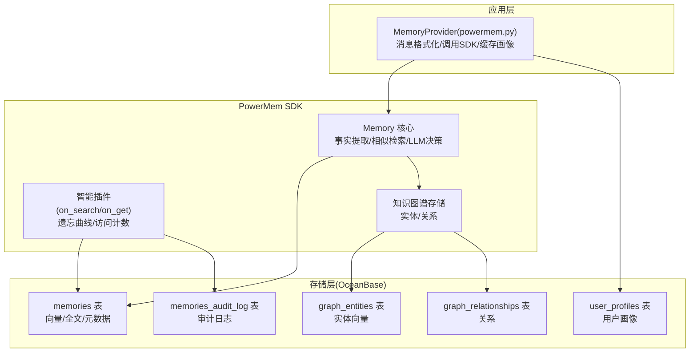
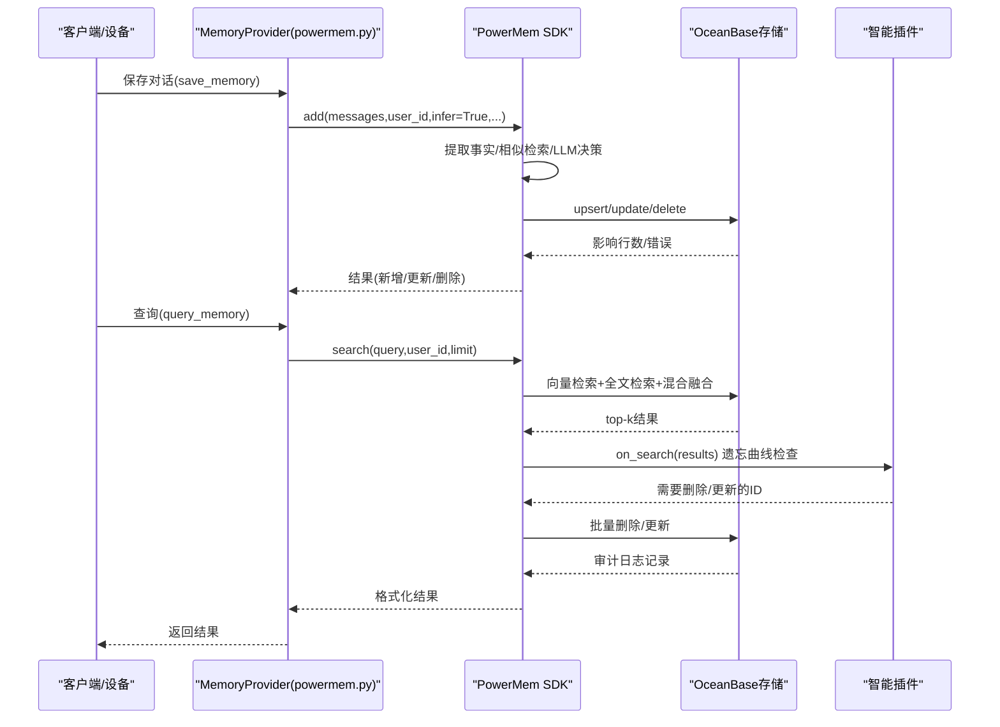
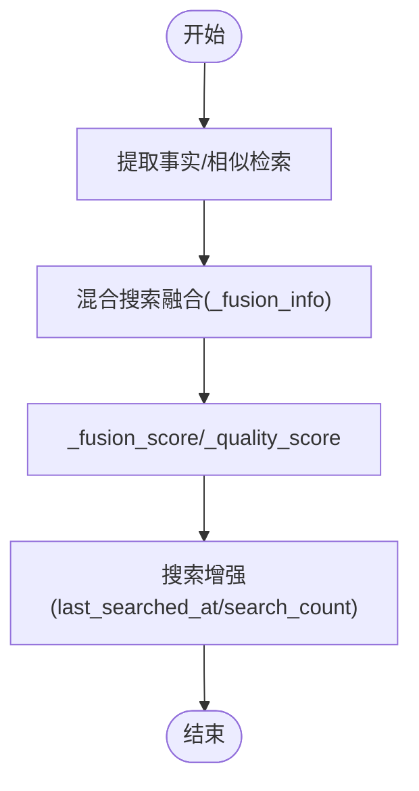
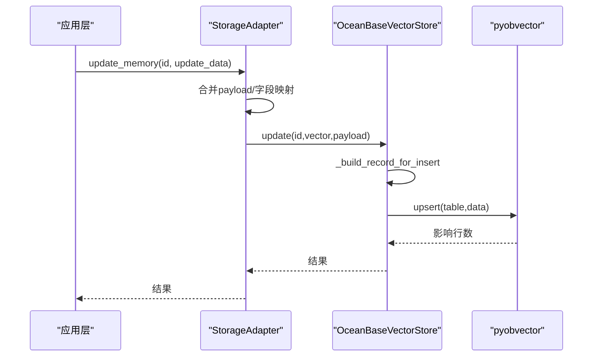
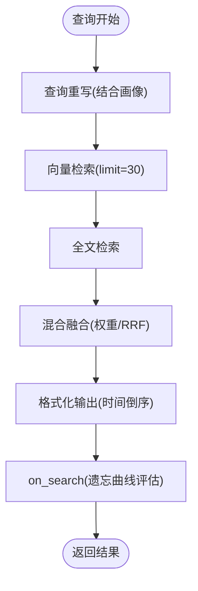
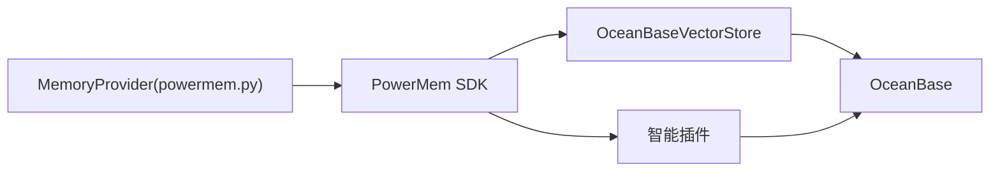

# 数据模型与存储

<cite>
**本文引用的文件**
- [PowerMem-记忆处理原理详解.md](file://main/xiaozhi-server/docs/powermem/PowerMem-记忆处理原理详解.md)
- [PowerMem-SQL生成原理详解.md](file://main/xiaozhi-server/docs/powermem/PowerMem-SQL生成原理详解.md)
- [PowerMem-Metadata-Fields.md](file://main/xiaozhi-server/docs/powermem/PowerMem-Metadata-Fields.md)
- [PowerMem-Plugin-vs-Infer.md](file://main/xiaozhi-server/docs/powermem/PowerMem-Plugin-vs-Infer.md)
- [PowerMem-Issues.md](file://main/xiaozhi-server/docs/powermem/PowerMem-Issues.md)
- [PowerMem-1.1.0-Analysis.md](file://main/xiaozhi-server/docs/powermem/PowerMem-1.1.0-Analysis.md)
- [powermem.py](file://main/xiaozhi-server/core/providers/memory/powermem/powermem.py)
- [01-init-powermem.sql](file://main/xiaozhi-server/oceanbase/init/01-init-powermem.sql)
- [README.md](file://main/xiaozhi-server/oceanbase/README.md)
</cite>

## 目录
1. [简介](#简介)
2. [项目结构](#项目结构)
3. [核心组件](#核心组件)
4. [架构总览](#架构总览)
5. [详细组件分析](#详细组件分析)
6. [依赖关系分析](#依赖关系分析)
7. [性能考量](#性能考量)
8. [故障排查指南](#故障排查指南)
9. [结论](#结论)
10. [附录](#附录)

## 简介
本文件面向PowerMem在本项目中的数据模型与存储实现，系统性阐述记忆数据结构、元数据字段定义、SQL生成与向量索引构建、查询优化与性能调优策略、时间戳管理与内容格式化、检索机制、不同类型记忆（普通记忆与用户画像）的数据模型差异，以及数据库Schema设计、索引策略与查询模式。同时提供数据迁移指南与存储优化建议，帮助开发者在保证数据安全与检索质量的前提下，获得稳定高效的长期记忆系统。

## 项目结构
PowerMem集成位于xiaozhi-server后端模块中，核心由三层构成：
- 应用层适配器：负责消息格式化、调用PowerMem SDK、缓存用户画像、返回格式化检索结果
- PowerMem SDK：负责事实提取、相似记忆检索、LLM决策、智能更新/删除、用户画像提取
- 存储层：OceanBase数据库，提供向量索引、全文索引、JSON元数据存储与审计日志

图表来源
- [powermem.py:177-450](file://main/xiaozhi-server/core/providers/memory/powermem/powermem.py#L177-L450)
- [PowerMem-记忆处理原理详解.md:432-495](file://main/xiaozhi-server/docs/powermem/PowerMem-记忆处理原理详解.md#L432-L495)
- [01-init-powermem.sql:9-63](file://main/xiaozhi-server/oceanbase/init/01-init-powermem.sql#L9-L63)

章节来源
- [powermem.py:177-450](file://main/xiaozhi-server/core/providers/memory/powermem/powermem.py#L177-L450)
- [PowerMem-记忆处理原理详解.md:432-495](file://main/xiaozhi-server/docs/powermem/PowerMem-记忆处理原理详解.md#L432-L495)
- [01-init-powermem.sql:9-63](file://main/xiaozhi-server/oceanbase/init/01-init-powermem.sql#L9-L63)

## 核心组件
- 记忆表(memories)：存储向量嵌入、全文内容、JSON元数据、时间戳、分类、哈希等，支持向量索引与全文索引
- 用户画像表(user_profiles)：存储用户画像内容或结构化主题，支持按用户ID快速检索
- 知识图谱表(graph_entities/graph_relationships)：支持实体与关系的向量检索与关系查询
- 智能插件：在搜索时按遗忘曲线自动删除或更新记忆，记录到审计日志
- 应用适配器：统一消息格式，调用PowerMem SDK，缓存用户画像，格式化检索结果

章节来源
- [PowerMem-记忆处理原理详解.md:432-495](file://main/xiaozhi-server/docs/powermem/PowerMem-记忆处理原理详解.md#L432-L495)
- [01-init-powermem.sql:9-63](file://main/xiaozhi-server/oceanbase/init/01-init-powermem.sql#L9-L63)
- [PowerMem-Issues.md:91-174](file://main/xiaozhi-server/docs/powermem/PowerMem-Issues.md#L91-L174)

## 架构总览
PowerMem在本项目中的数据流与控制流如下：

图表来源
- [powermem.py:177-450](file://main/xiaozhi-server/core/providers/memory/powermem/powermem.py#L177-L450)
- [PowerMem-记忆处理原理详解.md:35-200](file://main/xiaozhi-server/docs/powermem/PowerMem-记忆处理原理详解.md#L35-L200)
- [PowerMem-Issues.md:115-174](file://main/xiaozhi-server/docs/powermem/PowerMem-Issues.md#L115-L174)

## 详细组件分析

### 数据模型与字段定义
- 记忆表(memories)
  - 主键：id(BIGINT)
  - 文本字段：content/document(LONGTEXT)，fulltext_content(LONGTEXT)
  - 向量字段：embedding(VECTOR，1024/1536，取决于配置)
  - 元数据：metadata(JSON)，filters(JSON)
  - 时间戳：created_at/updated_at
  - 其他：user_id/agent_id/run_id/actor_id/hash/category
  - 索引：向量索引(VECTOR KEY)、全文索引(FULLTEXT KEY)、常用查询字段索引
- 用户画像表(user_profiles)
  - 主键：id(BIGINT)，user_id(VARCHAR,UNIQUE)
  - 内容：profile_content(TEXT)，topics(JSON)
  - 时间戳：created_at/updated_at
  - 索引：user_id索引
- 知识图谱表(graph_entities/graph_relationships)
  - 实体：name/type/description/embedding
  - 关系：source_entity_id/destination_entity_id/relationship_type
  - 索引：实体向量索引、关系复合索引

章节来源
- [01-init-powermem.sql:9-63](file://main/xiaozhi-server/oceanbase/init/01-init-powermem.sql#L9-L63)
- [PowerMem-记忆处理原理详解.md:432-495](file://main/xiaozhi-server/docs/powermem/PowerMem-记忆处理原理详解.md#L432-L495)

### 元数据字段与质量评分
- 元数据(metadata)用于混合搜索融合与质量评估，关键字段：
  - _fusion_info：融合算法详情（各路径rank、权重、方法）
  - _fusion_score：融合后最终评分
  - _quality_score：绝对质量评分（加权平均相似度）
  - _vector_similarity：向量相似度
  - search_count：检索次数
  - last_searched_at：最后检索时间戳
- 融合算法
  - RRF：基于倒数排名的融合
  - 加权平均：基于各路径权重的融合
- 质量评分计算
  - 基于向量相似度、全文得分、稀疏向量相似度的加权平均

图表来源
- [PowerMem-Metadata-Fields.md:35-270](file://main/xiaozhi-server/docs/powermem/PowerMem-Metadata-Fields.md#L35-L270)

章节来源
- [PowerMem-Metadata-Fields.md:35-270](file://main/xiaozhi-server/docs/powermem/PowerMem-Metadata-Fields.md#L35-L270)

### SQL生成与向量索引构建
- UPDATE流程
  - 应用层：构建payload(data/fulltext_content/embedding/hash/updated_at)
  - 适配层：合并旧payload，映射字段
  - 存储层：_build_record_for_insert序列化元数据，构建完整记录
  - OceanBase：pyobvector.upsert，ON DUPLICATE KEY UPDATE原子更新
- DELETE流程
  - 应用层：权限校验与删除调用
  - 适配层：主存储失败时尝试子存储
  - 存储层：pyobvector.delete，自动清理索引
- 向量索引
  - VSAG库，HNSW索引，L2距离，EF_SEARCH/EF_CONSTRUCTION参数
  - 索引参数已在初始化脚本中配置

图表来源
- [PowerMem-SQL生成原理详解.md:29-175](file://main/xiaozhi-server/docs/powermem/PowerMem-SQL生成原理详解.md#L29-L175)
- [PowerMem-SQL生成原理详解.md:128-216](file://main/xiaozhi-server/docs/powermem/PowerMem-SQL生成原理详解.md#L128-L216)

章节来源
- [PowerMem-SQL生成原理详解.md:29-175](file://main/xiaozhi-server/docs/powermem/PowerMem-SQL生成原理详解.md#L29-L175)
- [PowerMem-SQL生成原理详解.md:128-216](file://main/xiaozhi-server/docs/powermem/PowerMem-SQL生成原理详解.md#L128-L216)
- [01-init-powermem.sql:24-26](file://main/xiaozhi-server/oceanbase/init/01-init-powermem.sql#L24-L26)

### 时间戳管理与内容格式化
- 时间戳
  - created_at/updated_at：记录创建与更新时间
  - last_searched_at：记录检索时间，用于活跃度与遗忘判断
- 内容格式化
  - 文本内容映射：content → data/fulltext_content
  - JSON消息内容提取：从content中解析出实际文本
  - 检索结果格式化：按updated_at降序，时间格式化为“YYYY-MM-DD HH:mm:ss”

章节来源
- [PowerMem-记忆处理原理详解.md:498-531](file://main/xiaozhi-server/docs/powermem/PowerMem-记忆处理原理详解.md#L498-L531)
- [powermem.py:196-281](file://main/xiaozhi-server/core/providers/memory/powermem/powermem.py#L196-L281)

### 检索机制与查询模式
- 查询重写：结合用户画像增强查询
- 混合检索：向量检索+全文检索，限制返回数量
- 排序与格式化：按时间倒序，格式化输出
- 智能插件：on_search钩子在首次查询时触发，按遗忘曲线评估删除/更新

图表来源
- [PowerMem-记忆处理原理详解.md:498-531](file://main/xiaozhi-server/docs/powermem/PowerMem-记忆处理原理详解.md#L498-L531)
- [PowerMem-Issues.md:115-174](file://main/xiaozhi-server/docs/powermem/PowerMem-Issues.md#L115-L174)

章节来源
- [PowerMem-记忆处理原理详解.md:498-531](file://main/xiaozhi-server/docs/powermem/PowerMem-记忆处理原理详解.md#L498-L531)
- [PowerMem-Issues.md:115-174](file://main/xiaozhi-server/docs/powermem/PowerMem-Issues.md#L115-L174)

### 不同类型记忆的数据模型差异
- 普通记忆
  - 存储于memories表，具备向量、全文、元数据、时间戳
- 用户画像
  - 存储于user_profiles表，支持非结构化内容(profile_content)或结构化主题(topics)
  - 应用层提供缓存机制，避免重复拉取

章节来源
- [PowerMem-记忆处理原理详解.md:455-466](file://main/xiaozhi-server/docs/powermem/PowerMem-记忆处理原理详解.md#L455-L466)
- [powermem.py:387-449](file://main/xiaozhi-server/core/providers/memory/powermem/powermem.py#L387-L449)

### 智能模式与简单模式
- 智能模式(infer=True)
  - 提取事实、相似检索、LLM决策、自动合并/删除
  - 性能开销大，适合重要长期记忆
- 简单模式(infer=False)
  - 直接保存对话，不做事实提取与合并
  - 性能好，重复记忆风险高

章节来源
- [PowerMem-Plugin-vs-Infer.md:113-199](file://main/xiaozhi-server/docs/powermem/PowerMem-Plugin-vs-Infer.md#L113-L199)
- [PowerMem-1.1.0-Analysis.md:13-47](file://main/xiaozhi-server/docs/powermem/PowerMem-1.1.0-Analysis.md#L13-L47)

## 依赖关系分析
- 应用层依赖PowerMem SDK的AsyncMemory/UserMemory接口
- SDK依赖向量存储适配器与OceanBase向量SDK(pyobvector)
- OceanBase提供向量索引、全文索引、JSON元数据与审计日志
- 智能插件依赖遗忘曲线算法，按访问计数与时间衰减评估删除

图表来源
- [powermem.py:177-450](file://main/xiaozhi-server/core/providers/memory/powermem/powermem.py#L177-L450)
- [PowerMem-Issues.md:146-174](file://main/xiaozhi-server/docs/powermem/PowerMem-Issues.md#L146-L174)

章节来源
- [powermem.py:177-450](file://main/xiaozhi-server/core/providers/memory/powermem/powermem.py#L177-L450)
- [PowerMem-Issues.md:146-174](file://main/xiaozhi-server/docs/powermem/PowerMem-Issues.md#L146-L174)

## 性能考量
- 向量索引参数
  - VSAG + HNSW，L2距离，EF_SEARCH/EF_CONSTRUCTION参数已在初始化脚本中配置
- 全文检索优化
  - 使用ik分词器(智能模式)，提升中文检索召回
- 查询缓存
  - 用户画像缓存(last_profile_content)，避免重复拉取
- 批量操作
  - 批量upsert减少数据库往返
- 索引优化
  - 为metadata中的search_count、last_searched_at创建索引，加速统计与筛选

章节来源
- [README.md:289-311](file://main/xiaozhi-server/oceanbase/README.md#L289-L311)
- [PowerMem-Metadata-Fields.md:498-510](file://main/xiaozhi-server/docs/powermem/PowerMem-Metadata-Fields.md#L498-L510)
- [PowerMem-Plugin-vs-Infer.md:113-199](file://main/xiaozhi-server/docs/powermem/PowerMem-Plugin-vs-Infer.md#L113-L199)

## 故障排查指南
- 记忆被自动删除
  - 现象：查询时触发on_search，按遗忘曲线删除旧记忆
  - 根因：智能插件启用且未配置禁用
  - 解决：在配置中禁用智能插件(plugin.enabled:false)
- SDK初始化问题
  - 图谱初始化错误：应用层monkey-patch修复
  - 缺少enabled字段：在graph_store中添加enabled:true
  - 缺少embedding_model_dims：在graph_store.config中添加维度
  - 数据库密码类型错误：确保密码为字符串
- 数据库连接与索引
  - 检查容器日志与端口占用
  - 确认表与索引创建成功
  - 审计日志验证删除/更新操作

章节来源
- [PowerMem-Issues.md:91-315](file://main/xiaozhi-server/docs/powermem/PowerMem-Issues.md#L91-L315)
- [PowerMem-Issues.md:319-376](file://main/xiaozhi-server/docs/powermem/PowerMem-Issues.md#L319-L376)

## 结论
PowerMem在本项目中提供了完善的长期记忆能力，结合OceanBase的向量与全文索引，实现了高质量的混合检索与智能管理。通过合理的数据模型设计、SQL生成流程与索引策略，系统在保证检索质量的同时兼顾性能。针对自动删除问题，建议通过禁用智能插件或调整遗忘曲线参数来满足业务需求。对于大规模部署，建议结合批量操作、查询缓存与索引优化进一步提升稳定性与吞吐。

## 附录

### 数据库Schema与索引策略
- 记忆表(memories)
  - 主键：id
  - 向量索引：VECTOR KEY vidx(embedding) WITH (LIB=VSAG,DISTANCE=L2,...)
  - 全文索引：FULLTEXT KEY fulltext_index_for_col_text(fulltext_content) WITH PARSER ik PARSER_PROPERTIES=(ik_mode="smart")
  - 其他：user_id/agent_id/run_id/hash/category
- 用户画像表(user_profiles)
  - 主键：id，唯一索引：user_id
- 知识图谱表(graph_entities/graph_relationships)
  - 实体向量索引、关系复合索引

章节来源
- [01-init-powermem.sql:9-63](file://main/xiaozhi-server/oceanbase/init/01-init-powermem.sql#L9-L63)

### 查询模式与示例
- 获取用户画像
  - 优先使用缓存，未命中则异步拉取并缓存
- 检索相关记忆
  - 结合画像重写查询，向量+全文混合检索，限制返回数量，按时间倒序格式化输出
- 统计与筛选
  - 基于metadata字段统计检索热度与活跃度，辅助清理与优化

章节来源
- [powermem.py:283-449](file://main/xiaozhi-server/core/providers/memory/powermem/powermem.py#L283-L449)
- [PowerMem-Metadata-Fields.md:384-454](file://main/xiaozhi-server/docs/powermem/PowerMem-Metadata-Fields.md#L384-L454)

### 数据迁移指南
- 备份与恢复
  - 使用obclient导出表数据，恢复时导入
  - 停止服务时可选择保留数据卷或完全清理
- 索引与参数
  - 确认向量索引参数与全文索引创建成功
  - 调整内存限制与日志/数据文件大小以适配负载

章节来源
- [README.md:245-274](file://main/xiaozhi-server/oceanbase/README.md#L245-L274)
- [README.md:289-311](file://main/xiaozhi-server/oceanbase/README.md#L289-L311)