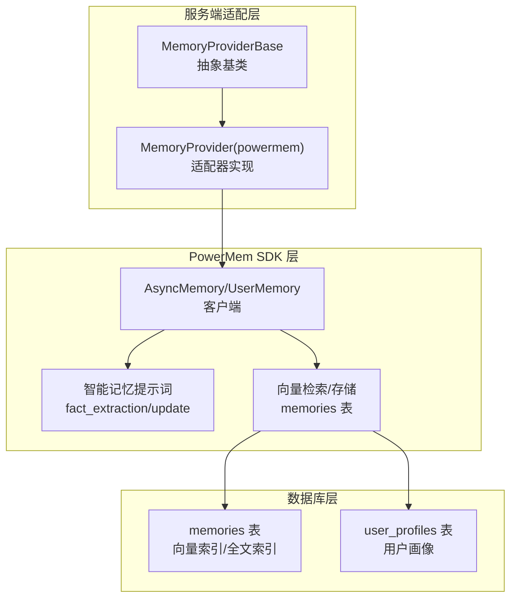
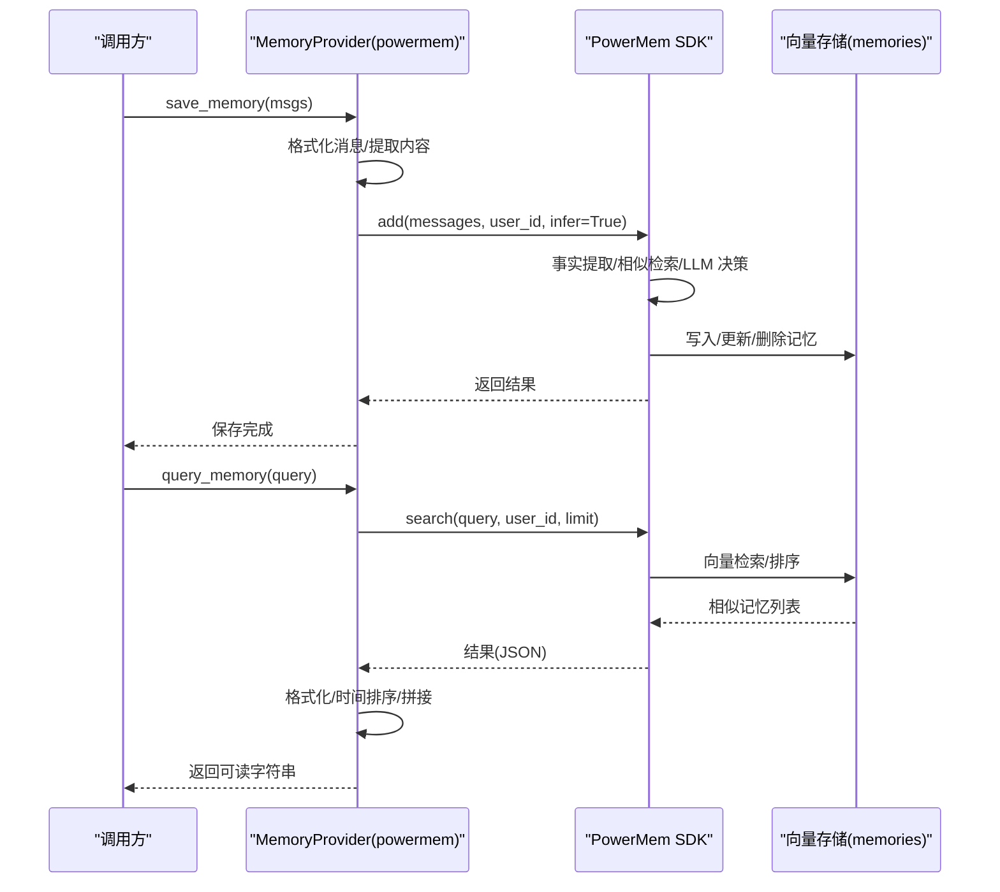
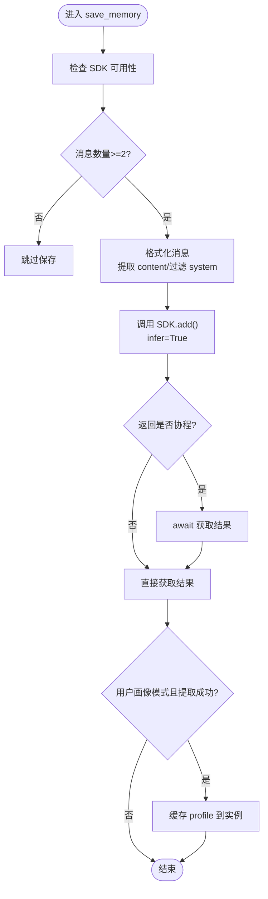
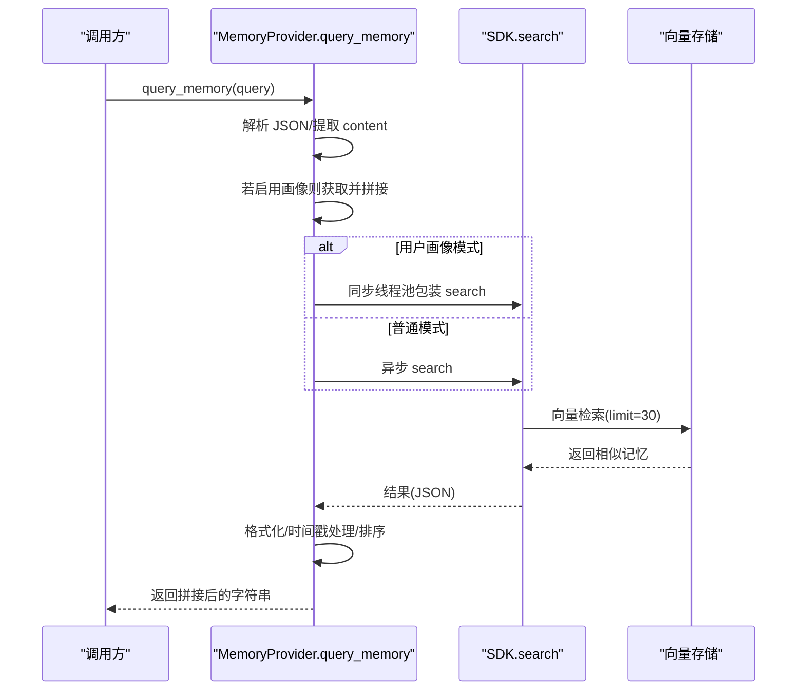
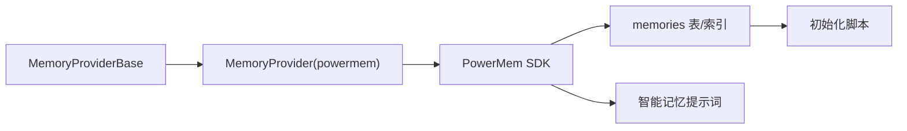

# 记忆处理流程

<cite>
**本文引用的文件**
- [powermem.py](file://main/xiaozhi-server/core/providers/memory/powermem/powermem.py)
- [base.py](file://main/xiaozhi-server/core/providers/memory/base.py)
- [intelligent_memory_prompts.py](file://main/xiaozhi-server/venv/lib/python3.12/site-packages/powermem/prompts/intelligent_memory_prompts.py)
- [01-init-powermem.sql](file://main/xiaozhi-server/oceanbase/init/01-init-powermem.sql)
- [PowerMemory-Intelligent-Processing-Flow.md](file://main/xiaozhi-server/docs/powermem/PowerMemory-Intelligent-Processing-Flow.md)
- [PowerMem-1.1.0-Analysis.md](file://main/xiaozhi-server/docs/powermem/PowerMem-1.1.0-Analysis.md)
</cite>

## 目录
1. [简介](#简介)
2. [项目结构](#项目结构)
3. [核心组件](#核心组件)
4. [架构总览](#架构总览)
5. [详细组件分析](#详细组件分析)
6. [依赖分析](#依赖分析)
7. [性能考虑](#性能考虑)
8. [故障排查指南](#故障排查指南)
9. [结论](#结论)
10. [附录](#附录)

## 简介
本技术文档围绕 PowerMem 记忆处理流程展开，系统阐述记忆保存与查询的完整处理链路，包括消息格式化、内容提取、相似度检索、结果排序与合并策略，并深入解析智能记忆管理中的“艾宾浩斯遗忘曲线”相关能力与实现差异。文档同时覆盖用户画像模式下的记忆处理差异、异步处理与并发控制、缓存策略、性能监控与调优建议，帮助读者在生产环境中安全、稳定地部署与优化 PowerMem。

## 项目结构
本项目采用分层与功能模块化组织方式，记忆子系统位于服务端 Java/Python 代码与 PowerMem SDK 的协作层，核心文件分布如下：
- 服务端适配层：负责消息格式化、调用 PowerMem SDK、异步处理与缓存
- PowerMem SDK 层：提供事实提取、记忆决策、向量检索与存储
- 数据库初始化：OceanBase/SQLite 等后端的表结构与索引配置
- 文档与分析：智能处理流程、删除风险与性能影响分析

图表来源
- [powermem.py:177-281](file://main/xiaozhi-server/core/providers/memory/powermem/powermem.py#L177-L281)
- [base.py:8-28](file://main/xiaozhi-server/core/providers/memory/base.py#L8-L28)
- [intelligent_memory_prompts.py:18-95](file://main/xiaozhi-server/venv/lib/python3.12/site-packages/powermem/prompts/intelligent_memory_prompts.py#L18-L95)
- [01-init-powermem.sql:9-37](file://main/xiaozhi-server/oceanbase/init/01-init-powermem.sql#L9-L37)

章节来源
- [powermem.py:1-450](file://main/xiaozhi-server/core/providers/memory/powermem/powermem.py#L1-L450)
- [base.py:1-29](file://main/xiaozhi-server/core/providers/memory/base.py#L1-L29)
- [intelligent_memory_prompts.py:1-171](file://main/xiaozhi-server/venv/lib/python3.12/site-packages/powermem/prompts/intelligent_memory_prompts.py#L1-L171)
- [01-init-powermem.sql:1-66](file://main/xiaozhi-server/oceanbase/init/01-init-powermem.sql#L1-L66)

## 核心组件
- MemoryProviderBase：定义统一的记忆提供者接口，包括保存与查询方法，以及角色上下文初始化。
- MemoryProvider(powermem)：PowerMem 适配器，负责消息格式化、调用 SDK、异步等待、结果缓存与错误处理。
- PowerMem SDK：提供 AsyncMemory/UserMemory 客户端，内置智能记忆提示词与向量检索能力。
- 数据库初始化脚本：定义 memories 与 user_profiles 表结构、向量索引与全文索引，支撑相似度检索与用户画像。

章节来源
- [base.py:8-28](file://main/xiaozhi-server/core/providers/memory/base.py#L8-L28)
- [powermem.py:23-176](file://main/xiaozhi-server/core/providers/memory/powermem/powermem.py#L23-L176)
- [intelligent_memory_prompts.py:18-95](file://main/xiaozhi-server/venv/lib/python3.12/site-packages/powermem/prompts/intelligent_memory_prompts.py#L18-L95)
- [01-init-powermem.sql:9-37](file://main/xiaozhi-server/oceanbase/init/01-init-powermem.sql#L9-L37)

## 架构总览
PowerMem 记忆处理分为“保存”和“查询”两条主线：
- 保存流程：服务端将消息格式化后调用 PowerMem SDK 的 add 接口；在智能模式下，SDK 内部会进行事实提取、相似记忆检索与 LLM 决策，最终执行新增、更新或删除操作。
- 查询流程：服务端调用 SDK 的 search 接口，按相似度返回记忆片段，并按更新时间降序排序，最终拼接成可读结果字符串。

图表来源
- [powermem.py:177-281](file://main/xiaozhi-server/core/providers/memory/powermem/powermem.py#L177-L281)
- [powermem.py:283-385](file://main/xiaozhi-server/core/providers/memory/powermem/powermem.py#L283-L385)
- [intelligent_memory_prompts.py:18-95](file://main/xiaozhi-server/venv/lib/python3.12/site-packages/powermem/prompts/intelligent_memory_prompts.py#L18-L95)
- [01-init-powermem.sql:9-26](file://main/xiaozhi-server/oceanbase/init/01-init-powermem.sql#L9-L26)

## 详细组件分析

### 保存流程：消息格式化与智能记忆处理
- 消息格式化：遍历消息列表，跳过 system 角色，尝试从 JSON 字符串中提取 content 字段，确保后续事实提取与检索的准确性。
- 调用 SDK：通过 AsyncMemory 或 UserMemory 的 add 接口传入 user_id、native_language、profile_type、include_roles 与 infer 参数。
- 智能模式触发：当 infer=True 且消息非空时，SDK 内部执行事实提取、相似记忆检索与 LLM 决策，最终写入/更新/删除记忆。
- 异步等待：若 SDK 返回协程对象，则进行 await 等待，保证调用顺序与结果一致性。
- 缓存策略：在用户画像模式下，成功提取 profile 后缓存至实例变量，避免重复拉取。

图表来源
- [powermem.py:177-281](file://main/xiaozhi-server/core/providers/memory/powermem/powermem.py#L177-L281)

章节来源
- [powermem.py:177-281](file://main/xiaozhi-server/core/providers/memory/powermem/powermem.py#L177-L281)
- [PowerMemory-Intelligent-Processing-Flow.md:246-272](file://main/xiaozhi-server/docs/powermem/PowerMemory-Intelligent-Processing-Flow.md#L246-L272)

### 查询流程：相似度检索与结果排序
- 查询准备：从 JSON 输入中提取 content 字段作为检索文本；若开启用户画像模式，先获取并拼接用户画像。
- 检索调用：调用 SDK 的 search 接口，limit 设置为 30；UserMemory 使用同步线程池包装，普通模式使用异步调用。
- 结果处理：遍历返回的 results，提取 memory 或 content 字段，拼接时间戳（优先 updated_at，其次 created_at），去除毫秒部分并格式化。
- 排序与合并：按时间戳降序排序，仅保留格式化后的字符串，最终以“【相关记忆】”标题拼接为单一字符串返回。

图表来源
- [powermem.py:283-385](file://main/xiaozhi-server/core/providers/memory/powermem/powermem.py#L283-L385)
- [01-init-powermem.sql:9-26](file://main/xiaozhi-server/oceanbase/init/01-init-powermem.sql#L9-L26)

章节来源
- [powermem.py:283-385](file://main/xiaozhi-server/core/providers/memory/powermem/powermem.py#L283-L385)

### 智能记忆管理与“艾宾浩斯遗忘曲线”
- 触发条件：当 infer=True 且消息非空时，SDK 内部会进行事实提取与记忆决策，从而可能执行新增、更新或删除操作。
- 决策机制：基于提示词模板，比较新事实与现有记忆，决定 ADD/UPDATE/DELETE/NONE；时间冲突优先 UPDATE，删除需严格满足矛盾条件。
- 删除风险：尽管提示词强调“谨慎删除”，但在某些场景（如时间信息冲突、状态变化、偏好改变）仍可能出现误判，导致历史记忆被删除。
- 生产建议：在生产环境建议禁用智能模式（infer=False），以避免 LLM 误删带来的不可逆影响。

章节来源
- [PowerMemory-Intelligent-Processing-Flow.md:1-346](file://main/xiaozhi-server/docs/powermem/PowerMemory-Intelligent-Processing-Flow.md#L1-L346)
- [PowerMem-1.1.0-Analysis.md:1-234](file://main/xiaozhi-server/docs/powermem/PowerMem-1.1.0-Analysis.md#L1-L234)
- [intelligent_memory_prompts.py:63-95](file://main/xiaozhi-server/venv/lib/python3.12/site-packages/powermem/prompts/intelligent_memory_prompts.py#L63-L95)

### 用户画像模式下的记忆处理差异
- 模式切换：通过 enable_user_profile 控制使用 UserMemory 或 AsyncMemory；UserMemory 专用于用户画像提取与存储。
- 画像缓存：首次成功提取后缓存至实例变量，后续查询直接返回缓存，显著降低重复拉取成本。
- 查询拼接：在用户画像模式下，查询结果会先拼接用户画像文本，再追加相关记忆列表，形成更丰富的上下文。

章节来源
- [powermem.py:40-176](file://main/xiaozhi-server/core/providers/memory/powermem/powermem.py#L40-L176)
- [powermem.py:387-449](file://main/xiaozhi-server/core/providers/memory/powermem/powermem.py#L387-L449)
- [01-init-powermem.sql:28-37](file://main/xiaozhi-server/oceanbase/init/01-init-powermem.sql#L28-L37)

### 相似度计算、过滤条件与结果合并策略
- 相似度计算：基于向量嵌入与 VSAG/HNSW 索引，结合 L2 距离进行近似最近邻检索。
- 过滤条件：检索时可按 user_id、agent_id 等维度过滤；结果按 updated_at 降序排序，确保最新记忆优先展示。
- 结果合并：将 memory/content 字段与时间戳组合，去除毫秒部分并统一格式，最终以固定标题与分隔符拼接为可读字符串。

章节来源
- [powermem.py:321-385](file://main/xiaozhi-server/core/providers/memory/powermem/powermem.py#L321-L385)
- [01-init-powermem.sql:9-26](file://main/xiaozhi-server/oceanbase/init/01-init-powermem.sql#L9-L26)

### 异步处理机制、缓存策略与并发控制
- 异步处理：SDK 的 add/search 可能返回协程对象，适配器通过 await 等待；UserMemory 的 search 使用线程池包装，避免阻塞事件循环。
- 缓存策略：用户画像模式下采用“缓存优先”策略，命中则直接返回，未命中再发起 SDK 调用并更新缓存。
- 并发控制：通过线程池包装同步调用，配合事件循环处理异步任务，避免阻塞；同时注意避免在同一用户上并发多次保存请求导致的重复事实提取。

章节来源
- [powermem.py:230-246](file://main/xiaozhi-server/core/providers/memory/powermem/powermem.py#L230-L246)
- [powermem.py:321-336](file://main/xiaozhi-server/core/providers/memory/powermem/powermem.py#L321-L336)
- [powermem.py:407-410](file://main/xiaozhi-server/core/providers/memory/powermem/powermem.py#L407-L410)

## 依赖分析
- 组件耦合：MemoryProvider 依赖 MemoryProviderBase 接口，具体实现依赖 PowerMem SDK；SDK 依赖数据库后端（memories 表）与索引配置。
- 外部依赖：PowerMem SDK、向量存储后端（OceanBase/SQLite）、LLM 与嵌入模型提供商。
- 潜在风险：智能模式下的删除操作可能造成历史记忆丢失；用户画像模式下的缓存一致性需关注 profile 更新策略。

图表来源
- [base.py:8-28](file://main/xiaozhi-server/core/providers/memory/base.py#L8-L28)
- [powermem.py:23-176](file://main/xiaozhi-server/core/providers/memory/powermem/powermem.py#L23-L176)
- [intelligent_memory_prompts.py:18-95](file://main/xiaozhi-server/venv/lib/python3.12/site-packages/powermem/prompts/intelligent_memory_prompts.py#L18-L95)
- [01-init-powermem.sql:9-26](file://main/xiaozhi-server/oceanbase/init/01-init-powermem.sql#L9-L26)

章节来源
- [base.py:1-29](file://main/xiaozhi-server/core/providers/memory/base.py#L1-L29)
- [powermem.py:1-450](file://main/xiaozhi-server/core/providers/memory/powermem/powermem.py#L1-L450)
- [intelligent_memory_prompts.py:1-171](file://main/xiaozhi-server/venv/lib/python3.12/site-packages/powermem/prompts/intelligent_memory_prompts.py#L1-L171)
- [01-init-powermem.sql:1-66](file://main/xiaozhi-server/oceanbase/init/01-init-powermem.sql#L1-L66)

## 性能考虑
- LLM 调用次数：每次保存对话会触发两次 LLM 调用（事实提取 + 决策），建议在高并发场景评估成本。
- 检索性能：memories 表的向量索引与全文索引配置直接影响检索速度；合理设置 EF_SEARCH、EF_CONSTRUCTION 等参数可提升召回质量与吞吐。
- 缓存收益：用户画像缓存可显著减少重复查询开销；建议在 profile 更新后清理或刷新缓存。
- 异步与并发：使用线程池包装同步调用，避免阻塞；在高并发场景下建议增加连接池与限流策略。

## 故障排查指南
- SDK 初始化失败：检查依赖安装与配置项（database_provider、llm_provider、embedding_provider），查看日志中的异常堆栈。
- 保存无响应：确认 SDK 返回是否为协程对象并正确 await；检查消息数量是否满足≥2 的条件。
- 查询为空：确认 user_id 是否设置、profile 是否可用（用户画像模式）、检索 limit 是否合理。
- 智能删除风险：若发现历史记忆被删除，建议临时禁用智能模式（infer=False）并复现问题；必要时在 SDK 提示词层面加强删除约束。

章节来源
- [powermem.py:167-176](file://main/xiaozhi-server/core/providers/memory/powermem/powermem.py#L167-L176)
- [powermem.py:277-281](file://main/xiaozhi-server/core/providers/memory/powermem/powermem.py#L277-L281)
- [PowerMem-1.1.0-Analysis.md:139-209](file://main/xiaozhi-server/docs/powermem/PowerMem-1.1.0-Analysis.md#L139-L209)

## 结论
PowerMem 在智能模式下提供了强大的事实提取与记忆合并能力，但也引入了删除风险与额外的 LLM 成本。在生产环境中，建议优先采用“禁用智能模式”的策略，以保障记忆的持久性与用户体验的稳定性；同时充分利用用户画像缓存与向量检索索引，平衡性能与效果。对于需要智能合并的场景，应通过严格的提示词约束与监控回滚机制，降低误删概率。

## 附录
- 数据库表结构参考：memories 表（向量索引、全文索引）、user_profiles 表（用户画像）
- 提示词模板：事实提取与记忆更新/删除决策的提示词集合
- 流程文档：智能记忆处理触发时机与性能影响分析

章节来源
- [01-init-powermem.sql:9-37](file://main/xiaozhi-server/oceanbase/init/01-init-powermem.sql#L9-L37)
- [intelligent_memory_prompts.py:18-171](file://main/xiaozhi-server/venv/lib/python3.12/site-packages/powermem/prompts/intelligent_memory_prompts.py#L18-L171)
- [PowerMemory-Intelligent-Processing-Flow.md:1-346](file://main/xiaozhi-server/docs/powermem/PowerMemory-Intelligent-Processing-Flow.md#L1-L346)
- [PowerMem-1.1.0-Analysis.md:1-234](file://main/xiaozhi-server/docs/powermem/PowerMem-1.1.0-Analysis.md#L1-L234)