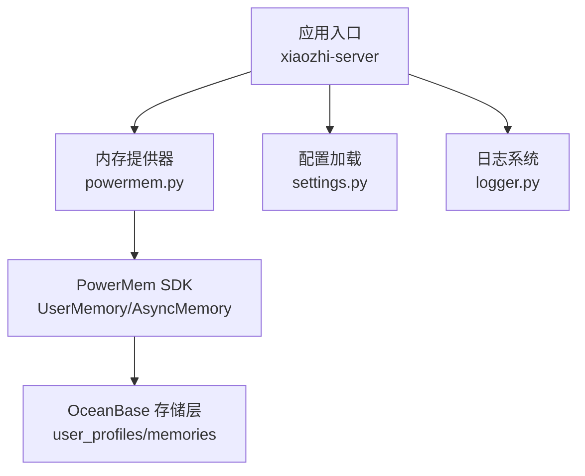
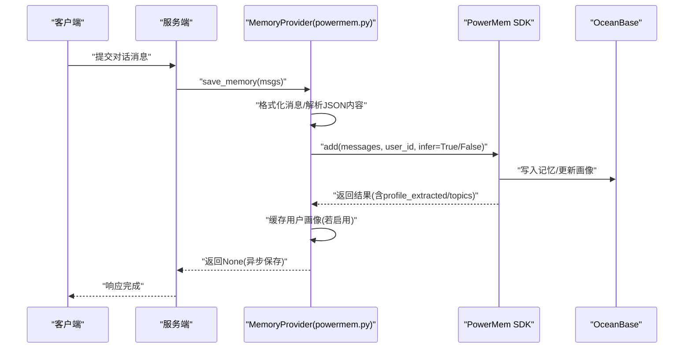
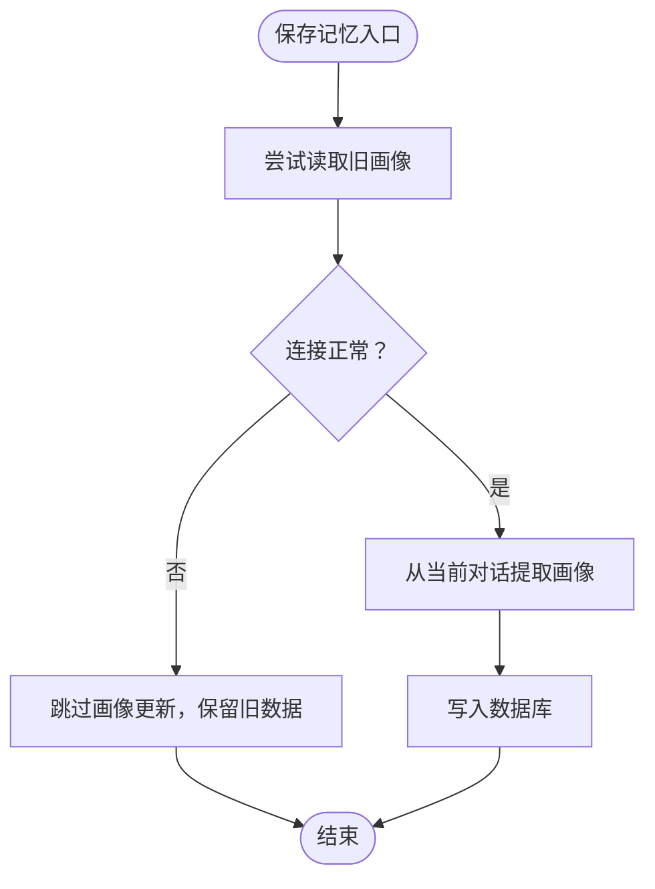
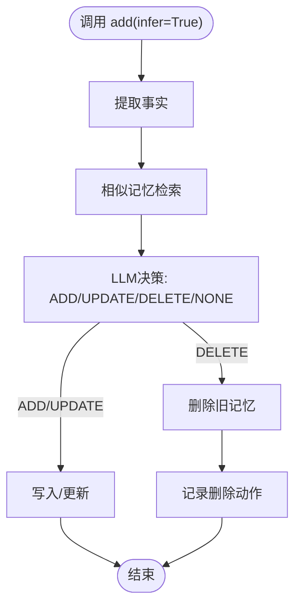
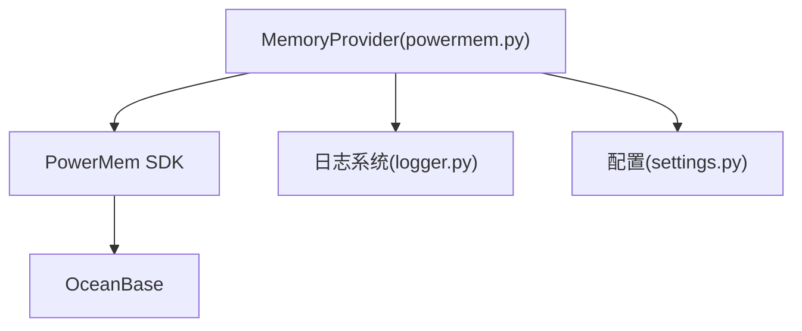

# 问题诊断与故障排除

<cite>
**本文引用的文件**
- [PowerMem-Issues.md](file://docs/PowerMem-Issues.md)
- [powermem.py](file://main/xiaozhi-server/core/providers/memory/powermem/powermem.py)
- [PowerMem-1.1.0-Analysis.md](file://main/xiaozhi-server/docs/powermem/PowerMem-1.1.0-Analysis.md)
- [PowerMem-记忆处理原理详解.md](file://main/xiaozhi-server/docs/powermem/PowerMem-记忆处理原理详解.md)
- [settings.py](file://main/xiaozhi-server/config/settings.py)
- [logger.py](file://main/xiaozhi-server/config/logger.py)
</cite>

## 目录
1. [简介](#简介)
2. [项目结构](#项目结构)
3. [核心组件](#核心组件)
4. [架构总览](#架构总览)
5. [详细组件分析](#详细组件分析)
6. [依赖分析](#依赖分析)
7. [性能考量](#性能考量)
8. [故障排除指南](#故障排除指南)
9. [结论](#结论)
10. [附录](#附录)

## 简介
本技术文档面向PowerMem集成与运行过程中的问题诊断与故障排除，结合仓库内已知问题清单与技术文档，系统化梳理常见症状、根因分析、修复步骤与预防策略。重点覆盖安装与配置问题、OceanBase连接异常导致的用户画像覆盖风险、智能模式引发的记忆删除风险、日志分析与调试方法、性能监控与优化建议，以及紧急恢复与数据保护策略。

## 项目结构
围绕PowerMem的故障排查，涉及的关键目录与文件如下：
- 文档与问题清单：docs/PowerMem-Issues.md
- PowerMem服务端适配器：main/xiaozhi-server/core/providers/memory/powermem/powermem.py
- PowerMem相关技术文档：main/xiaozhi-server/docs/powermem/*.md
- 配置与日志：main/xiaozhi-server/config/settings.py、main/xiaozhi-server/config/logger.py

图表来源
- [powermem.py:177-281](file://main/xiaozhi-server/core/providers/memory/powermem/powermem.py#L177-L281)
- [PowerMem-记忆处理原理详解.md:434-466](file://main/xiaozhi-server/docs/powermem/PowerMem-记忆处理原理详解.md#L434-L466)
- [settings.py:9-33](file://main/xiaozhi-server/config/settings.py#L9-L33)
- [logger.py:48-109](file://main/xiaozhi-server/config/logger.py#L48-L109)

章节来源
- [PowerMem-Issues.md:1-56](file://docs/PowerMem-Issues.md#L1-L56)
- [powermem.py:1-450](file://main/xiaozhi-server/core/providers/memory/powermem/powermem.py#L1-L450)
- [PowerMem-1.1.0-Analysis.md:1-234](file://main/xiaozhi-server/docs/powermem/PowerMem-1.1.0-Analysis.md#L1-L234)
- [PowerMem-记忆处理原理详解.md:1-696](file://main/xiaozhi-server/docs/powermem/PowerMem-记忆处理原理详解.md#L1-L696)
- [settings.py:1-34](file://main/xiaozhi-server/config/settings.py#L1-L34)
- [logger.py:1-115](file://main/xiaozhi-server/config/logger.py#L1-L115)

## 核心组件
- PowerMem内存提供器：负责初始化PowerMem客户端、保存与查询记忆、在用户画像模式下缓存与读取用户画像。
- PowerMem SDK：提供UserMemory（用户画像）与AsyncMemory（普通记忆）能力，支持智能模式（infer=True）的记忆合并与删除。
- OceanBase存储层：存储记忆与用户画像，用户画像表为user_profiles。
- 配置与日志：配置文件校验、日志格式与落盘策略。

章节来源
- [powermem.py:23-176](file://main/xiaozhi-server/core/providers/memory/powermem/powermem.py#L23-L176)
- [PowerMem-记忆处理原理详解.md:434-466](file://main/xiaozhi-server/docs/powermem/PowerMem-记忆处理原理详解.md#L434-L466)
- [settings.py:9-33](file://main/xiaozhi-server/config/settings.py#L9-L33)
- [logger.py:48-109](file://main/xiaozhi-server/config/logger.py#L48-L109)

## 架构总览
PowerMem在服务端的调用链路与数据流如下：

图表来源
- [powermem.py:177-281](file://main/xiaozhi-server/core/providers/memory/powermem/powermem.py#L177-L281)
- [PowerMem-记忆处理原理详解.md:35-61](file://main/xiaozhi-server/docs/powermem/PowerMem-记忆处理原理详解.md#L35-L61)

章节来源
- [powermem.py:177-281](file://main/xiaozhi-server/core/providers/memory/powermem/powermem.py#L177-L281)
- [PowerMem-记忆处理原理详解.md:35-61](file://main/xiaozhi-server/docs/powermem/PowerMem-记忆处理原理详解.md#L35-L61)

## 详细组件分析

### 问题一：用户画像因OceanBase连接断开被覆盖
- 症状表现
  - 挂断通话触发用户画像存储时，旧画像被当前对话内容完全覆盖，历史画像丢失。
  - 成功时画像包含丰富信息（336+字符），失败时仅包含当前对话片段。
- 根因分析
  - 旧画像读取失败（连接断开）被静默捕获，返回None，导致LLM提示词缺少“当前用户画像”段，仅从当前对话提取，最终写入数据库覆盖旧画像。
- 修复方案
  - 快速止血：在保存记忆前检查旧画像读取是否成功，失败则跳过画像更新，保留旧数据。
  - 根治：修复SDK中画像提取逻辑，旧画像读取失败时不覆盖，同时完善连接池keepalive/reconnect配置。
  - 增强：切换到结构化画像模式，放宽或取消字符限制，减少压缩导致的信息丢失。
- 涉及文件
  - 服务端适配器：core/providers/memory/powermem/powermem.py
  - SDK：user_memory.py、storage/user_profile.py、prompts/user_profile_prompts.py

图表来源
- [PowerMem-Issues.md:13-21](file://docs/PowerMem-Issues.md#L13-L21)
- [powermem.py:177-281](file://main/xiaozhi-server/core/providers/memory/powermem/powermem.py#L177-L281)

章节来源
- [PowerMem-Issues.md:3-31](file://docs/PowerMem-Issues.md#L3-L31)
- [powermem.py:177-281](file://main/xiaozhi-server/core/providers/memory/powermem/powermem.py#L177-L281)

### 问题二：智能模式导致的记忆删除风险
- 症状表现
  - 在启用智能模式（infer=True）时，LLM可能将“时间冲突/状态变化/偏好改变”误判为“矛盾”，从而删除旧记忆。
- 根因分析
  - PowerMem 1.1.0在智能模式下，LLM根据提示词决定ADD/UPDATE/DELETE/NONE；提示词虽强调“谨慎删除”，但在复杂语义场景仍可能出现误判。
- 修复方案
  - 推荐：在生产环境禁用智能模式（infer=False），完全避免LLM误删。
  - 可选：优化提示词，严格限定删除条件（需修改SDK源码，不推荐）。
  - 可选：在服务端代码中增加删除监控与告警。
- 涉及文件
  - 服务端调用参数：core/providers/memory/powermem/powermem.py
  - SDK核心逻辑与提示词：src/powermem/core/memory.py、prompts/intelligent_memory_prompts.py

图表来源
- [PowerMem-1.1.0-Analysis.md:13-46](file://main/xiaozhi-server/docs/powermem/PowerMem-1.1.0-Analysis.md#L13-L46)
- [PowerMem-记忆处理原理详解.md:130-181](file://main/xiaozhi-server/docs/powermem/PowerMem-记忆处理原理详解.md#L130-L181)

章节来源
- [PowerMem-1.1.0-Analysis.md:1-234](file://main/xiaozhi-server/docs/powermem/PowerMem-1.1.0-Analysis.md#L1-L234)
- [PowerMem-记忆处理原理详解.md:130-181](file://main/xiaozhi-server/docs/powermem/PowerMem-记忆处理原理详解.md#L130-L181)

### 问题三：安装与配置错误
- 症状表现
  - PowerMem未安装或导入失败，初始化报错，无法保存/查询记忆。
- 根因分析
  - 缺少powermem包或版本不匹配；配置文件缺失或混用本地/远端配置。
- 修复步骤
  - 安装PowerMem依赖；确认配置文件存在且格式正确；避免同时包含本地与远端配置。
- 涉及文件
  - 初始化异常处理：core/providers/memory/powermem/powermem.py
  - 配置文件检查：config/settings.py

章节来源
- [powermem.py:167-175](file://main/xiaozhi-server/core/providers/memory/powermem/powermem.py#L167-L175)
- [settings.py:9-33](file://main/xiaozhi-server/config/settings.py#L9-L33)

### 问题四：性能瓶颈与兼容性问题
- 症状表现
  - 保存/查询记忆耗时较长；日志中出现高延迟；OceanBase连接抖动。
- 根因分析
  - 智能模式（infer=True）带来额外LLM调用与向量检索；OceanBase连接池空闲超时导致断连。
- 修复步骤
  - 在生产环境禁用智能模式；优化OceanBase连接池keepalive/reconnect；启用用户画像缓存；限制提示词长度与候选记忆数量。
- 涉及文件
  - 智能模式开关与调用参数：core/providers/memory/powermem/powermem.py
  - 缓存与性能策略：docs/powermem/PowerMem-记忆处理原理详解.md

章节来源
- [PowerMem-1.1.0-Analysis.md:139-156](file://main/xiaozhi-server/docs/powermem/PowerMem-1.1.0-Analysis.md#L139-L156)
- [PowerMem-记忆处理原理详解.md:533-564](file://main/xiaozhi-server/docs/powermem/PowerMem-记忆处理原理详解.md#L533-L564)

## 依赖分析
- 组件耦合
  - MemoryProvider依赖PowerMem SDK；SDK依赖OceanBase存储层；日志系统贯穿全流程。
- 外部依赖
  - PowerMem SDK、OceanBase驱动、日志框架loguru。
- 潜在风险
  - OceanBase连接池配置不当导致断连；智能模式提示词误判；配置文件冲突。

图表来源
- [powermem.py:150-176](file://main/xiaozhi-server/core/providers/memory/powermem/powermem.py#L150-L176)
- [logger.py:48-109](file://main/xiaozhi-server/config/logger.py#L48-L109)
- [settings.py:9-33](file://main/xiaozhi-server/config/settings.py#L9-L33)

章节来源
- [powermem.py:150-176](file://main/xiaozhi-server/core/providers/memory/powermem/powermem.py#L150-L176)
- [logger.py:48-109](file://main/xiaozhi-server/config/logger.py#L48-L109)
- [settings.py:9-33](file://main/xiaozhi-server/config/settings.py#L9-L33)

## 性能考量
- 智能模式与简单模式对比
  - 智能模式：高准确率、高延迟、高Token消耗；适合长期记忆。
  - 简单模式：低延迟、低Token消耗；适合临时对话与性能敏感场景。
- 缓存与去重
  - 用户画像缓存：减少重复读取；事实向量嵌入复用：降低重复计算。
- 提示词与候选集限制
  - 控制候选记忆数量与提示词长度，避免LLM上下文过长。

章节来源
- [PowerMem-记忆处理原理详解.md:568-585](file://main/xiaozhi-server/docs/powermem/PowerMem-记忆处理原理详解.md#L568-L585)
- [PowerMem-记忆处理原理详解.md:533-564](file://main/xiaozhi-server/docs/powermem/PowerMem-记忆处理原理详解.md#L533-L564)

## 故障排除指南

### 日志分析技巧
- 关键日志关键词
  - 保存记忆：包含“开始/完成”、“UserMemory模式”、“profile_extracted”等。
  - 查询记忆：包含“用户画像”、“相关记忆”等。
  - 错误日志：包含“Error retrieving existing profile_content”、“Lost connection to MySQL server during query”等。
- 日志落盘与轮转
  - 控制台与文件双输出，统一格式，按大小轮转与保留策略配置。

章节来源
- [PowerMem-Issues.md:22-31](file://docs/PowerMem-Issues.md#L22-L31)
- [logger.py:48-109](file://main/xiaozhi-server/config/logger.py#L48-L109)

### 调试工具与监控
- 调试建议
  - 观察事实提取、记忆决策、用户画像提取等关键阶段日志。
  - 在服务端增加删除监控与告警，记录DELETE操作次数与对象。
- 数据库查询
  - 查询用户记忆、画像与知识图谱实体，核对数量与时间戳。
  - 统计每日/近7日记忆增长趋势，定位异常波动。

章节来源
- [PowerMem-记忆处理原理详解.md:588-630](file://main/xiaozhi-server/docs/powermem/PowerMem-记忆处理原理详解.md#L588-L630)

### 配置与安装检查
- 配置文件
  - 确认data/.config.yaml存在；避免同时包含本地与远端配置。
  - 从API读取配置时，确保接口地址与密钥正确。
- 依赖安装
  - 确认PowerMem已安装；初始化失败时检查导入异常与错误堆栈。

章节来源
- [settings.py:9-33](file://main/xiaozhi-server/config/settings.py#L9-L33)
- [powermem.py:167-175](file://main/xiaozhi-server/core/providers/memory/powermem/powermem.py#L167-L175)

### 紧急恢复与数据保护
- 短期应急
  - 禁用智能模式（infer=False），避免LLM误删；启用用户画像缓存，降低画像覆盖风险。
- 数据保护
  - 定期备份OceanBase user_profiles与memories表；在删除监控中记录删除事件，便于回溯。
- 升级与回归
  - 修复OceanBase连接池keepalive/reconnect；升级PowerMem SDK至稳定版本；回归测试记忆保留与画像稳定性。

章节来源
- [PowerMem-1.1.0-Analysis.md:139-156](file://main/xiaozhi-server/docs/powermem/PowerMem-1.1.0-Analysis.md#L139-L156)
- [PowerMem-Issues.md:32-47](file://docs/PowerMem-Issues.md#L32-L47)

## 结论
- 生产环境建议：禁用智能模式（infer=False），确保记忆持久性与用户体验可预期。
- 风险控制：完善OceanBase连接池配置，启用用户画像缓存与删除监控；严格控制提示词长度与候选集。
- 长期演进：在SDK层面优化提示词与去重策略，或采用结构化画像模式提升稳定性。

## 附录

### 常见问题速查
- 问：为什么记忆会消失？
  - 答：LLM决策为DELETE或被合并/去重；建议查看日志中的动作统计并调整提示词。
- 问：如何禁用智能模式？
  - 答：在调用add时设置infer=False，或在配置中启用降级策略。
- 问：用户画像多久更新一次？
  - 答：每次调用add都会尝试更新，若对话无新增画像信息则返回空字符串。
- 问：如何切换到结构化画像？
  - 答：将profile_type改为topics，配合放宽字符限制。

章节来源
- [PowerMem-记忆处理原理详解.md:634-674](file://main/xiaozhi-server/docs/powermem/PowerMem-记忆处理原理详解.md#L634-L674)