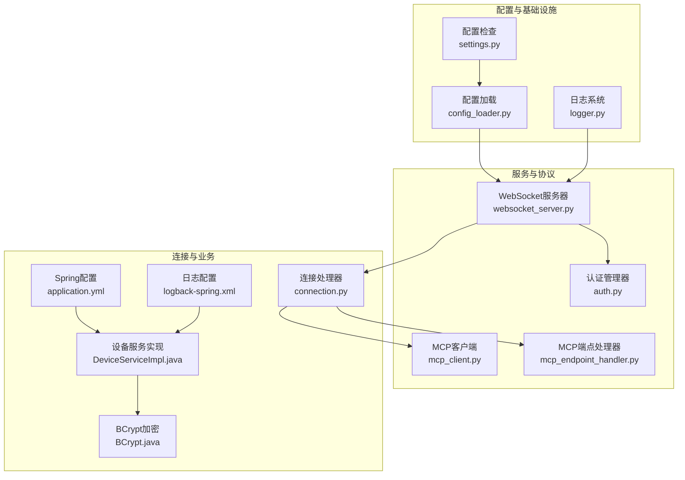
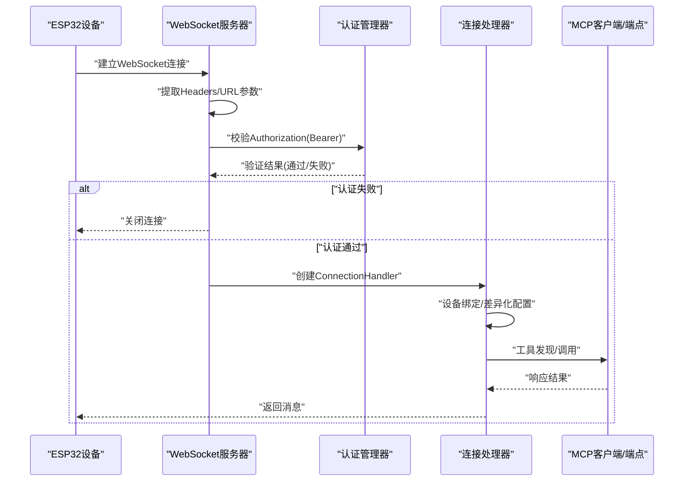
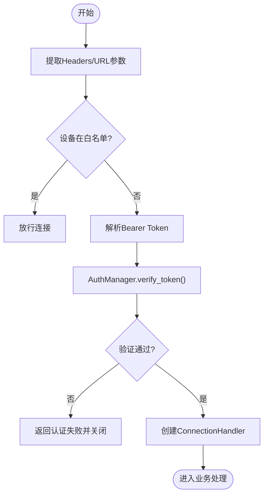
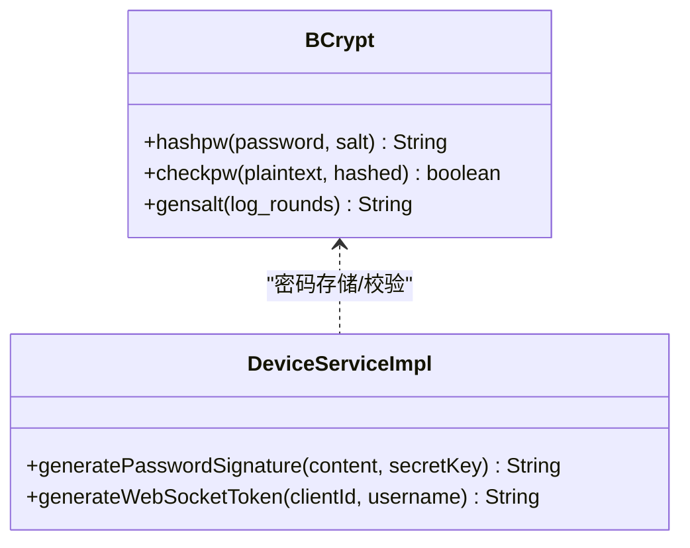
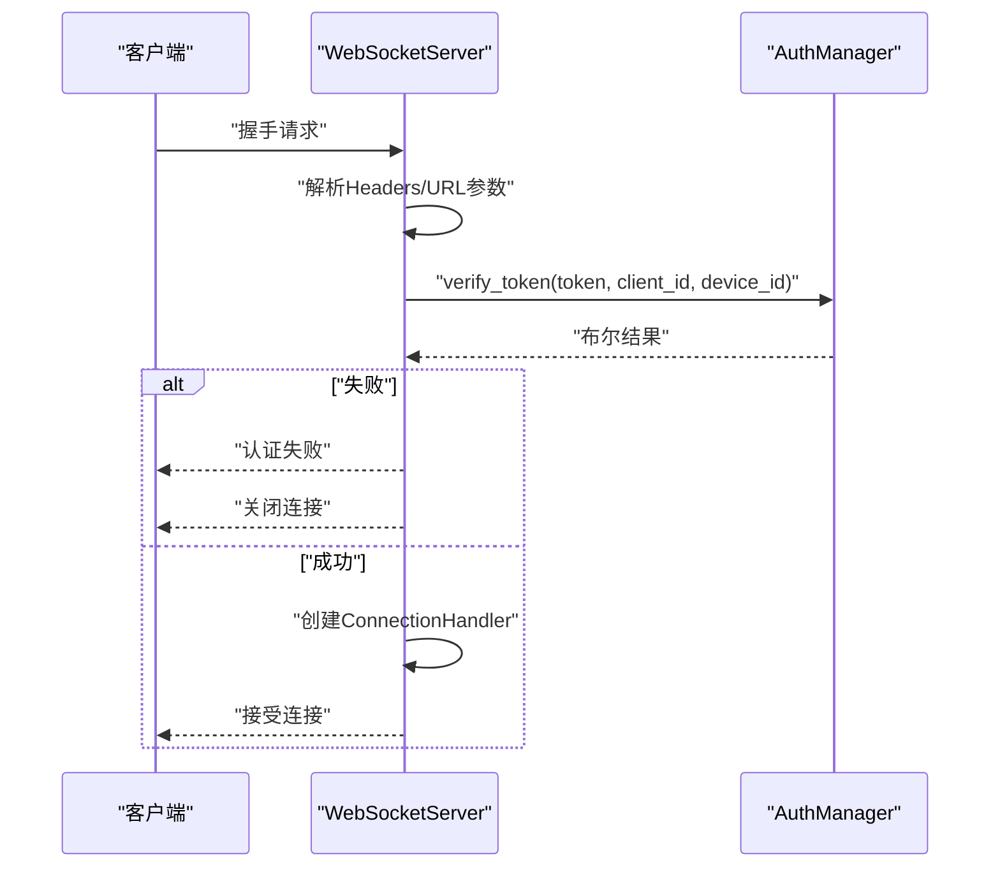
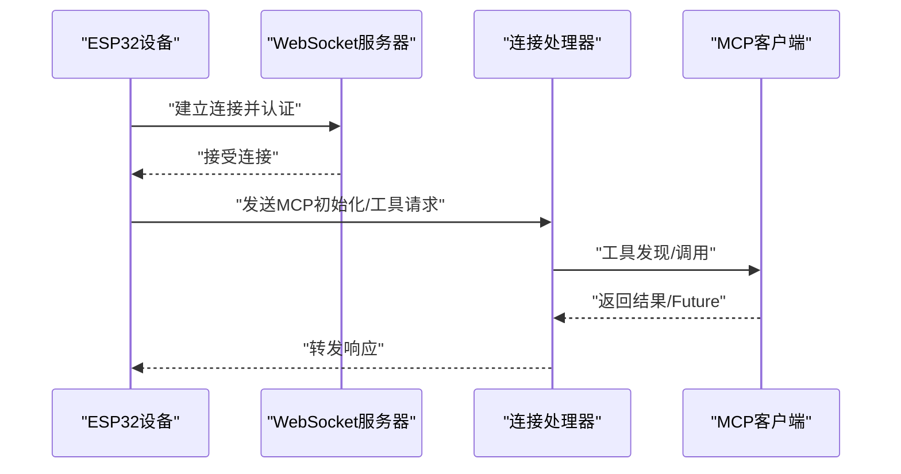
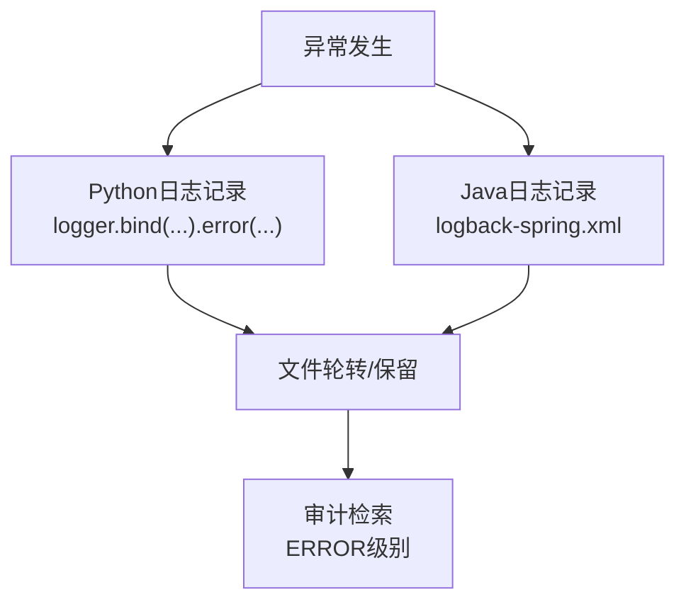
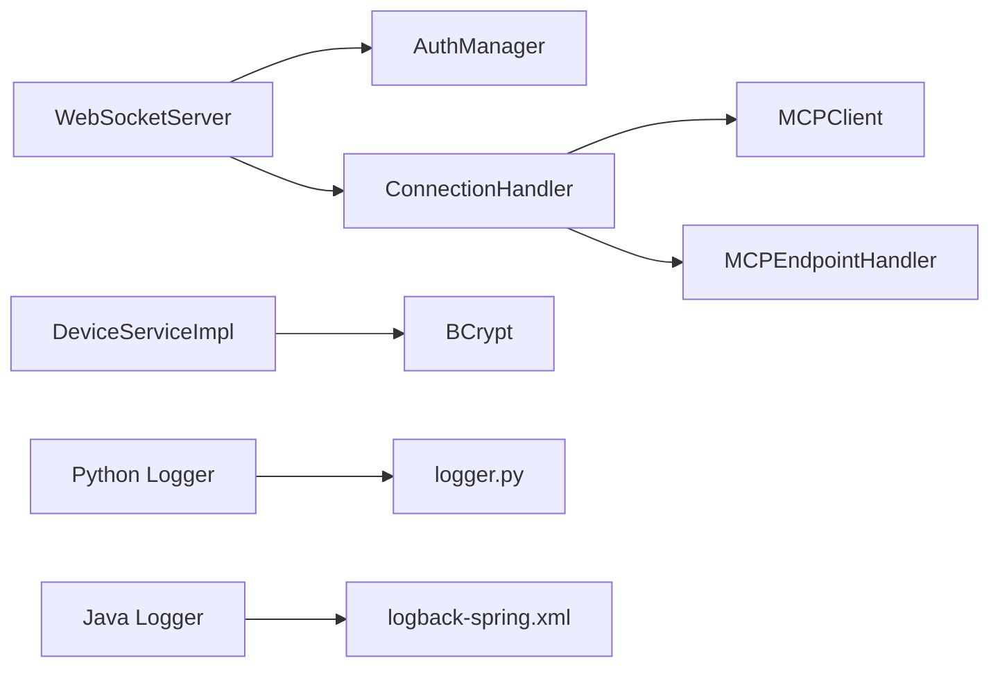

# 安全考虑与防护

<cite>
**本文档引用的文件**   
- [settings.py](file://main/xiaozhi-server/config/settings.py)
- [config_loader.py](file://main/xiaozhi-server/config/config_loader.py)
- [logger.py](file://main/xiaozhi-server/config/logger.py)
- [auth.py](file://main/xiaozhi-server/core/auth.py)
- [websocket_server.py](file://main/xiaozhi-server/core/websocket_server.py)
- [connection.py](file://main/xiaozhi-server/core/connection.py)
- [mcp_client.py](file://main/xiaozhi-server/core/providers/tools/device_mcp/mcp_client.py)
- [mcp_endpoint_handler.py](file://main/xiaozhi-server/core/providers/tools/mcp_endpoint/mcp_endpoint_handler.py)
- [BCrypt.java](file://main/manager-api/src/main/java/xiaozhi/modules/security/password/BCrypt.java)
- [DeviceServiceImpl.java](file://main/manager-api/src/main/java/xiaozhi/modules/device/service/impl/DeviceServiceImpl.java)
- [application.yml](file://main/manager-api/src/main/resources/application.yml)
- [logback-spring.xml](file://main/manager-api/src/main/resources/logback-spring.xml)
- [DELETE-MONITOR-GUIDE.md](file://main/xiaozhi-server/docs/guides/DELETE-MONITOR-GUIDE.md)
- [device-onboarding-flow.md](file://main/xiaozhi-server/docs/device/device-onboarding-flow.md)
</cite>

## 目录
1. [引言](#引言)
2. [项目结构](#项目结构)
3. [核心组件](#核心组件)
4. [架构总览](#架构总览)
5. [详细组件分析](#详细组件分析)
6. [依赖分析](#依赖分析)
7. [性能考虑](#性能考虑)
8. [故障排查指南](#故障排查指南)
9. [结论](#结论)
10. [附录](#附录)

## 引言
本文件面向小智ESP32服务器的安全架构与防护，聚焦以下主题：
- 认证授权机制与OAuth2集成思路
- 会话与令牌管理策略
- 密码加密存储与BCrypt配置
- WebSocket连接安全验证与MCP协议安全传输
- 异常处理体系、日志记录与审计追踪
- 安全配置指南、漏洞防护与渗透测试建议
- 数据传输加密、访问控制与安全监控实施方案

## 项目结构
小智ESP32服务器由三层构成：
- 配置与基础设施层：配置加载、日志、安全参数
- 服务与协议层：WebSocket服务器、认证管理器、MCP客户端与端点处理器
- 连接与业务层：连接处理器、设备绑定与差异化配置、工具调用与上报

图示来源
- [config_loader.py:1-193](file://main/xiaozhi-server/config/config_loader.py#L1-L193)
- [logger.py:1-115](file://main/xiaozhi-server/config/logger.py#L1-L115)
- [settings.py:1-34](file://main/xiaozhi-server/config/settings.py#L1-L34)
- [websocket_server.py:1-228](file://main/xiaozhi-server/core/websocket_server.py#L1-L228)
- [auth.py:1-73](file://main/xiaozhi-server/core/auth.py#L1-L73)
- [connection.py:1-800](file://main/xiaozhi-server/core/connection.py#L1-L800)
- [mcp_client.py:1-94](file://main/xiaozhi-server/core/providers/tools/device_mcp/mcp_client.py#L1-L94)
- [mcp_endpoint_handler.py:40-244](file://main/xiaozhi-server/core/providers/tools/mcp_endpoint/mcp_endpoint_handler.py#L40-L244)
- [DeviceServiceImpl.java:559-590](file://main/manager-api/src/main/java/xiaozhi/modules/device/service/impl/DeviceServiceImpl.java#L559-L590)
- [BCrypt.java:54-692](file://main/manager-api/src/main/java/xiaozhi/modules/security/password/BCrypt.java#L54-L692)
- [application.yml:1-66](file://main/manager-api/src/main/resources/application.yml#L1-L66)
- [logback-spring.xml:55-139](file://main/manager-api/src/main/resources/logback-spring.xml#L55-L139)

章节来源
- [config_loader.py:1-193](file://main/xiaozhi-server/config/config_loader.py#L1-L193)
- [logger.py:1-115](file://main/xiaozhi-server/config/logger.py#L1-L115)
- [settings.py:1-34](file://main/xiaozhi-server/config/settings.py#L1-L34)

## 核心组件
- 认证管理器：基于HMAC-SHA256的三元组令牌（签名+时间戳），支持过期控制与安全比较
- WebSocket服务器：统一入口，支持白名单放行与令牌校验
- 连接处理器：设备绑定、差异化配置、音频流处理与超时管理
- MCP客户端与端点处理器：MCP协议工具发现、调用与响应处理
- 日志系统：结构化日志、异步落盘、轮转与审计
- 密码加密：BCrypt哈希与盐生成，Java侧实现
- Spring安全：Cookie HttpOnly、XSS开关、日志级别与异常统一处理

章节来源
- [auth.py:13-73](file://main/xiaozhi-server/core/auth.py#L13-L73)
- [websocket_server.py:42-228](file://main/xiaozhi-server/core/websocket_server.py#L42-L228)
- [connection.py:77-800](file://main/xiaozhi-server/core/connection.py#L77-L800)
- [mcp_client.py:12-94](file://main/xiaozhi-server/core/providers/tools/device_mcp/mcp_client.py#L12-L94)
- [mcp_endpoint_handler.py:40-244](file://main/xiaozhi-server/core/providers/tools/mcp_endpoint/mcp_endpoint_handler.py#L40-L244)
- [logger.py:48-115](file://main/xiaozhi-server/config/logger.py#L48-L115)
- [BCrypt.java:54-692](file://main/manager-api/src/main/java/xiaozhi/modules/security/password/BCrypt.java#L54-L692)
- [application.yml:11-14](file://main/manager-api/src/main/resources/application.yml#L11-L14)
- [logback-spring.xml:55-139](file://main/manager-api/src/main/resources/logback-spring.xml#L55-L139)

## 架构总览
小智ESP32服务器采用“配置驱动 + 安全认证 + 结构化日志”的安全架构。WebSocket入口负责设备身份验证与白名单放行；连接处理器负责差异化配置与设备绑定；MCP模块负责工具发现与调用；日志系统提供审计能力。

图示来源
- [websocket_server.py:81-145](file://main/xiaozhi-server/core/websocket_server.py#L81-L145)
- [auth.py:52-73](file://main/xiaozhi-server/core/auth.py#L52-L73)
- [connection.py:193-264](file://main/xiaozhi-server/core/connection.py#L193-L264)
- [mcp_endpoint_handler.py:40-96](file://main/xiaozhi-server/core/providers/tools/mcp_endpoint/mcp_endpoint_handler.py#L40-L96)

## 详细组件分析

### 认证授权与会话管理
- 令牌生成与验证
  - 生成：HMAC-SHA256(client_id|username|timestamp)，时间戳单位秒
  - 验证：重算签名并使用常量时间比较，过期阈值可配置
- WebSocket认证
  - 支持白名单设备直连（跳过令牌校验）
  - 非白名单设备要求Authorization头，格式为Bearer <token>
- 会话生命周期
  - 连接建立后进入业务处理；异常与超时触发清理与关闭

图示来源
- [websocket_server.py:206-228](file://main/xiaozhi-server/core/websocket_server.py#L206-L228)
- [auth.py:36-73](file://main/xiaozhi-server/core/auth.py#L36-L73)

章节来源
- [auth.py:13-73](file://main/xiaozhi-server/core/auth.py#L13-L73)
- [websocket_server.py:63-70](file://main/xiaozhi-server/core/websocket_server.py#L63-L70)
- [websocket_server.py:206-228](file://main/xiaozhi-server/core/websocket_server.py#L206-L228)

### OAuth2集成思路
- 当前实现采用自定义令牌（HMAC-SHA256签名+时间戳），未直接使用OAuth2授权码/隐式等流程
- 集成建议
  - 在WebSocket握手阶段引入OAuth2中间件，使用Authorization头传递访问令牌
  - 服务端校验令牌签发机构、受众、过期时间与作用域
  - 与白名单策略结合，对可信设备允许简化流程
- Java侧可参考Shiro的OAuth2Token适配器进行扩展

章节来源
- [Oauth2Token.java:10-26](file://main/manager-api/src/main/java/xiaozhi/modules/security/oauth2/Oauth2Token.java#L10-L26)

### 密码加密存储与BCrypt配置
- Java侧BCrypt实现
  - 支持盐生成（SecureRandom）、哈希计算与校验
  - 默认工作因子可按需调整，建议生产≥12
  - 提供常量时间比较，降低侧信道风险
- 与设备服务的结合
  - 设备服务生成MQTT/WS认证令牌时，从系统参数读取密钥
  - 密码存储建议使用BCrypt，配合强口令策略与定期轮换

图示来源
- [BCrypt.java:54-692](file://main/manager-api/src/main/java/xiaozhi/modules/security/password/BCrypt.java#L54-L692)
- [DeviceServiceImpl.java:559-590](file://main/manager-api/src/main/java/xiaozhi/modules/device/service/impl/DeviceServiceImpl.java#L559-L590)

章节来源
- [BCrypt.java:54-692](file://main/manager-api/src/main/java/xiaozhi/modules/security/password/BCrypt.java#L54-L692)
- [DeviceServiceImpl.java:559-590](file://main/manager-api/src/main/java/xiaozhi/modules/device/service/impl/DeviceServiceImpl.java#L559-L590)

### WebSocket连接安全验证
- 设备ID/客户端ID/授权头提取：优先Headers，其次URL查询参数
- 认证失败处理：返回错误并关闭连接
- 日志与过滤：屏蔽无效握手噪声，保留关键错误

图示来源
- [websocket_server.py:81-145](file://main/xiaozhi-server/core/websocket_server.py#L81-L145)
- [websocket_server.py:206-228](file://main/xiaozhi-server/core/websocket_server.py#L206-L228)
- [auth.py:52-73](file://main/xiaozhi-server/core/auth.py#L52-L73)

章节来源
- [websocket_server.py:81-145](file://main/xiaozhi-server/core/websocket_server.py#L81-L145)
- [websocket_server.py:206-228](file://main/xiaozhi-server/core/websocket_server.py#L206-L228)

### MCP协议安全传输与设备认证
- 设备端MCP客户端
  - 工具缓存与名称规范化，保证工具调用一致性
  - 异步Future管理，确保调用结果可靠传递
- MCP端点处理器
  - JSON-RPC 2.0消息处理，严格校验id与结构
  - 错误捕获与拒绝，避免异常扩散
- 与WebSocket认证联动
  - 设备通过WebSocket认证后，方可进行MCP工具调用

图示来源
- [mcp_client.py:12-94](file://main/xiaozhi-server/core/providers/tools/device_mcp/mcp_client.py#L12-L94)
- [mcp_endpoint_handler.py:40-96](file://main/xiaozhi-server/core/providers/tools/mcp_endpoint/mcp_endpoint_handler.py#L40-L96)

章节来源
- [mcp_client.py:12-94](file://main/xiaozhi-server/core/providers/tools/device_mcp/mcp_client.py#L12-L94)
- [mcp_endpoint_handler.py:40-244](file://main/xiaozhi-server/core/providers/tools/mcp_endpoint/mcp_endpoint_handler.py#L40-L244)

### 异常处理体系、日志记录与审计追踪
- Python侧
  - 结构化日志：统一格式、异步落盘、轮转与保留
  - 连接异常捕获：认证异常、内部错误、清理兜底
  - 审计示例：内存删除监控（ERROR级别，便于grep过滤）
- Java侧
  - Cookie HttpOnly、XSS开关、日志级别与统一异常处理
  - 生产环境日志轮转与总容量限制

图示来源
- [logger.py:48-115](file://main/xiaozhi-server/config/logger.py#L48-L115)
- [connection.py:245-264](file://main/xiaozhi-server/core/connection.py#L245-L264)
- [DELETE-MONITOR-GUIDE.md:44-89](file://main/xiaozhi-server/docs/guides/DELETE-MONITOR-GUIDE.md#L44-L89)
- [application.yml:11-14](file://main/manager-api/src/main/resources/application.yml#L11-L14)
- [logback-spring.xml:55-139](file://main/manager-api/src/main/resources/logback-spring.xml#L55-L139)

章节来源
- [logger.py:48-115](file://main/xiaozhi-server/config/logger.py#L48-L115)
- [connection.py:245-264](file://main/xiaozhi-server/core/connection.py#L245-L264)
- [DELETE-MONITOR-GUIDE.md:44-89](file://main/xiaozhi-server/docs/guides/DELETE-MONITOR-GUIDE.md#L44-L89)
- [application.yml:11-14](file://main/manager-api/src/main/resources/application.yml#L11-L14)
- [logback-spring.xml:55-139](file://main/manager-api/src/main/resources/logback-spring.xml#L55-L139)

### 安全配置指南与最佳实践
- 配置文件与来源
  - 本地配置与API配置合并；启动前检查.data/.config.yaml存在性
  - 从API拉取配置时，服务端配置以本地为准（IP/端口/密钥等）
- 认证与授权
  - 启用auth.enabled；合理设置过期秒数；维护allowed_devices白名单
  - 设备服务生成令牌时从系统参数读取密钥，避免硬编码
- 传输与会话
  - 生产环境使用HTTPS；Spring Cookie启用HttpOnly
  - WebSocket端口仅对可信网络开放，必要时前置反向代理
- 日志与审计
  - 使用结构化日志与异步落盘；设置合适的轮转与保留策略
  - 对高风险操作（如批量删除）使用ERROR级别并提供检索指引

章节来源
- [settings.py:9-34](file://main/xiaozhi-server/config/settings.py#L9-L34)
- [config_loader.py:27-94](file://main/xiaozhi-server/config/config_loader.py#L27-L94)
- [websocket_server.py:63-70](file://main/xiaozhi-server/core/websocket_server.py#L63-L70)
- [DeviceServiceImpl.java:581-590](file://main/manager-api/src/main/java/xiaozhi/modules/device/service/impl/DeviceServiceImpl.java#L581-L590)
- [application.yml:11-14](file://main/manager-api/src/main/resources/application.yml#L11-L14)
- [logback-spring.xml:55-139](file://main/manager-api/src/main/resources/logback-spring.xml#L55-L139)

### 渗透测试建议
- 认证绕过
  - 测试白名单设备是否可跳过令牌；验证Authorization头缺失/格式错误
  - 尝试篡改时间戳与签名边界条件
- 权限提升
  - 伪造Headers/URL参数，验证服务端严格解析
  - 检查设备绑定异常路径与提示音播放逻辑
- 协议与MCP
  - 发送非法JSON-RPC消息，验证错误处理与连接稳定性
  - 模拟工具调用超时与异常，观察Future清理
- 日志与审计
  - 检查敏感字段脱敏与过滤
  - 验证ERROR级别日志可被稳定检索

章节来源
- [websocket_server.py:81-145](file://main/xiaozhi-server/core/websocket_server.py#L81-L145)
- [mcp_endpoint_handler.py:215-222](file://main/xiaozhi-server/core/providers/tools/mcp_endpoint/mcp_endpoint_handler.py#L215-L222)
- [DELETE-MONITOR-GUIDE.md:44-89](file://main/xiaozhi-server/docs/guides/DELETE-MONITOR-GUIDE.md#L44-L89)

## 依赖分析
- 组件耦合
  - WebSocket服务器依赖认证管理器与连接处理器
  - 连接处理器依赖MCP客户端与端点处理器
  - Java设备服务依赖BCrypt进行密码/令牌生成
- 外部依赖
  - 日志：loguru（Python）、logback（Java）
  - 网络：websockets库
  - 配置：PyYAML、异步HTTP客户端

图示来源
- [websocket_server.py:33-70](file://main/xiaozhi-server/core/websocket_server.py#L33-L70)
- [connection.py:36-46](file://main/xiaozhi-server/core/connection.py#L36-L46)
- [mcp_client.py:1-10](file://main/xiaozhi-server/core/providers/tools/device_mcp/mcp_client.py#L1-L10)
- [mcp_endpoint_handler.py:40-56](file://main/xiaozhi-server/core/providers/tools/mcp_endpoint/mcp_endpoint_handler.py#L40-L56)
- [DeviceServiceImpl.java:559-590](file://main/manager-api/src/main/java/xiaozhi/modules/device/service/impl/DeviceServiceImpl.java#L559-L590)
- [logger.py:48-115](file://main/xiaozhi-server/config/logger.py#L48-L115)
- [logback-spring.xml:55-139](file://main/manager-api/src/main/resources/logback-spring.xml#L55-L139)

章节来源
- [websocket_server.py:33-70](file://main/xiaozhi-server/core/websocket_server.py#L33-L70)
- [connection.py:36-46](file://main/xiaozhi-server/core/connection.py#L36-L46)
- [mcp_endpoint_handler.py:40-56](file://main/xiaozhi-server/core/providers/tools/mcp_endpoint/mcp_endpoint_handler.py#L40-L56)
- [DeviceServiceImpl.java:559-590](file://main/manager-api/src/main/java/xiaozhi/modules/device/service/impl/DeviceServiceImpl.java#L559-L590)
- [logger.py:48-115](file://main/xiaozhi-server/config/logger.py#L48-L115)
- [logback-spring.xml:55-139](file://main/manager-api/src/main/resources/logback-spring.xml#L55-L139)

## 性能考虑
- 认证与日志
  - 常量时间比较避免时序侧信道；日志异步写入减少阻塞
- 连接与音频
  - 连接处理器对音频包进行时间戳排序与乱序缓冲，保障顺序性
- 配置与缓存
  - 配置与IP信息缓存减少重复IO与网络请求

章节来源
- [auth.py:67-73](file://main/xiaozhi-server/core/auth.py#L67-L73)
- [logger.py:94-106](file://main/xiaozhi-server/config/logger.py#L94-L106)
- [connection.py:408-438](file://main/xiaozhi-server/core/connection.py#L408-L438)
- [config_loader.py:27-62](file://main/xiaozhi-server/config/config_loader.py#L27-L62)

## 故障排查指南
- 认证失败
  - 检查Authorization头格式与令牌有效期
  - 核对设备ID/客户端ID是否与签名内容一致
- 连接异常
  - 观察WebSocket服务器日志过滤器是否屏蔽了有效错误
  - 检查连接处理器异常捕获与清理流程
- MCP调用问题
  - 核对JSON-RPC消息结构与id映射
  - 检查工具缓存与名称规范化
- 审计与日志
  - 使用ERROR级别检索高风险操作
  - 确认日志轮转与保留策略满足合规要求

章节来源
- [websocket_server.py:206-228](file://main/xiaozhi-server/core/websocket_server.py#L206-L228)
- [connection.py:245-264](file://main/xiaozhi-server/core/connection.py#L245-L264)
- [mcp_endpoint_handler.py:215-222](file://main/xiaozhi-server/core/providers/tools/mcp_endpoint/mcp_endpoint_handler.py#L215-L222)
- [DELETE-MONITOR-GUIDE.md:44-89](file://main/xiaozhi-server/docs/guides/DELETE-MONITOR-GUIDE.md#L44-L89)

## 结论
小智ESP32服务器在安全方面具备完善的认证、日志与审计能力，结合MCP协议的工具化与结构化日志，形成可审计、可追溯的安全闭环。建议在生产环境中强化TLS、最小权限与定期轮换策略，并持续进行渗透测试与基线评估。

## 附录
- 实际安全代码示例与配置参数
  - 认证令牌生成与验证：[auth.py:36-73](file://main/xiaozhi-server/core/auth.py#L36-L73)
  - WebSocket认证流程：[websocket_server.py:206-228](file://main/xiaozhi-server/core/websocket_server.py#L206-L228)
  - 设备服务令牌生成：[DeviceServiceImpl.java:581-590](file://main/manager-api/src/main/java/xiaozhi/modules/device/service/impl/DeviceServiceImpl.java#L581-L590)
  - BCrypt哈希与校验：[BCrypt.java:545-675](file://main/manager-api/src/main/java/xiaozhi/modules/security/password/BCrypt.java#L545-L675)
  - 结构化日志配置：[logger.py:48-115](file://main/xiaozhi-server/config/logger.py#L48-L115)
  - Spring Cookie与XSS配置：[application.yml:11-14](file://main/manager-api/src/main/resources/application.yml#L11-L14)
  - MCP端点消息处理：[mcp_endpoint_handler.py:40-96](file://main/xiaozhi-server/core/providers/tools/mcp_endpoint/mcp_endpoint_handler.py#L40-L96)
  - 设备上线与WebSocket连接：[device-onboarding-flow.md:174-201](file://main/xiaozhi-server/docs/device/device-onboarding-flow.md#L174-L201)