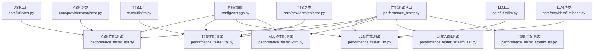
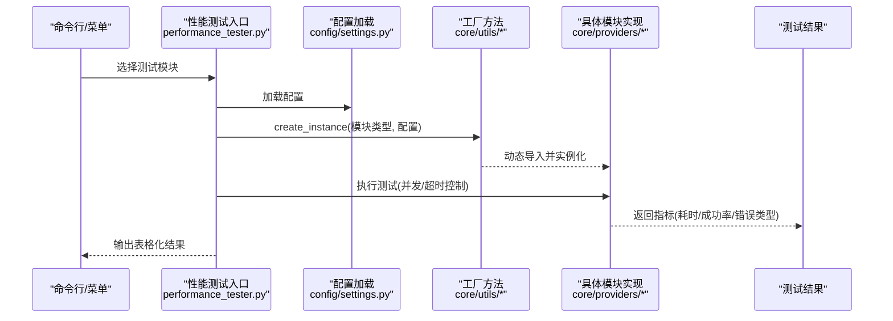
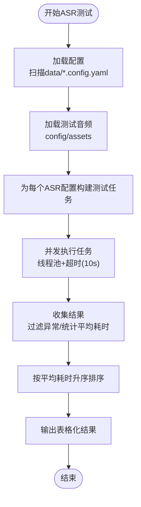
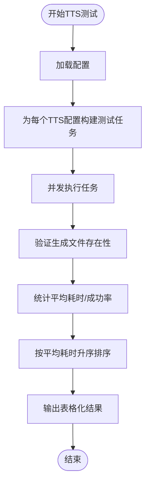
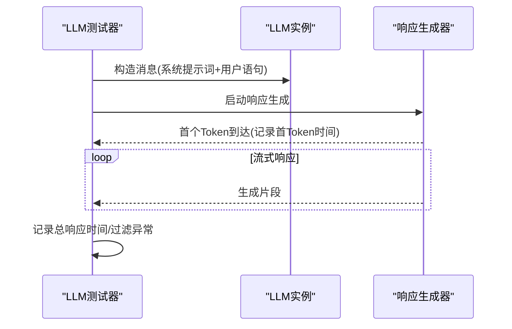
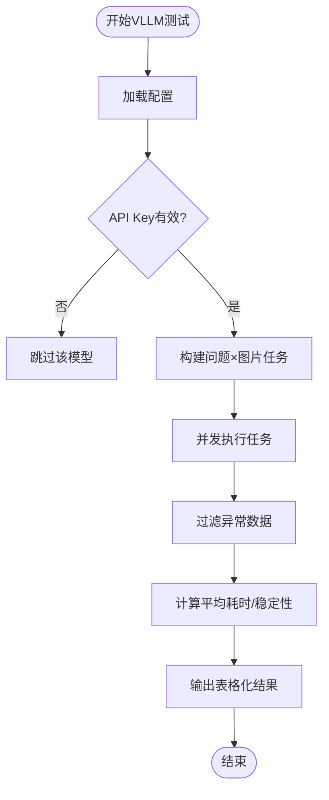
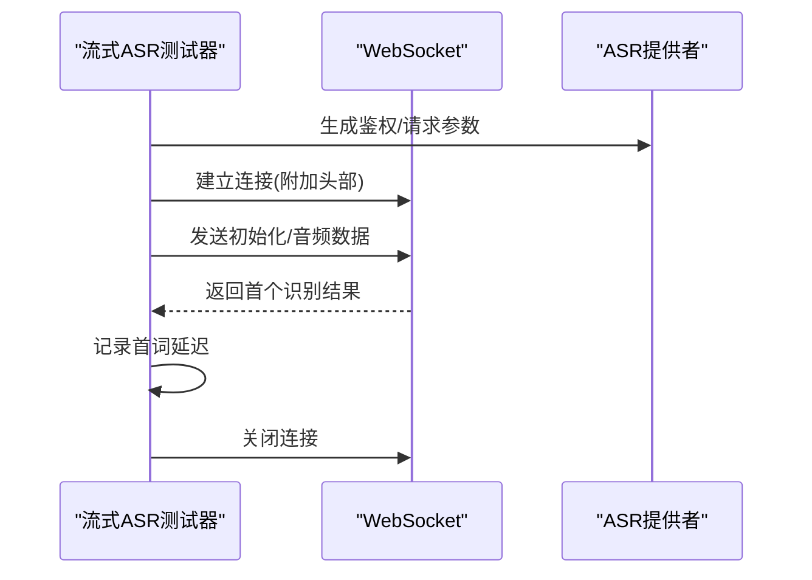
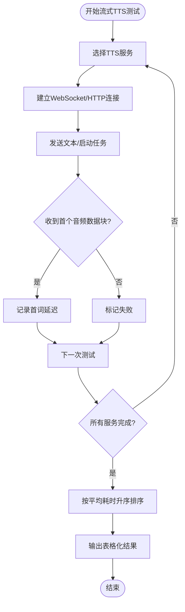
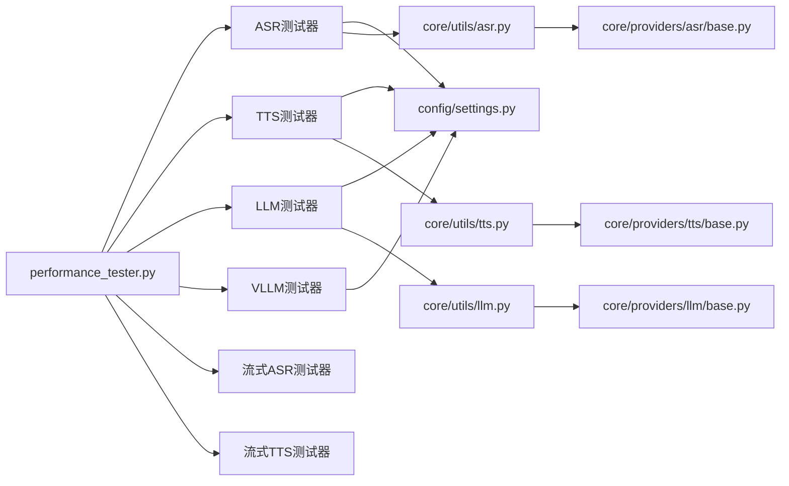

# 性能测试与基准

<cite>
**本文引用的文件**   
- [performance_tester.py](file://main/xiaozhi-server/performance_tester.py)
- [performance_tester_asr.py](file://main/xiaozhi-server/performance_tester/performance_tester_asr.py)
- [performance_tester_tts.py](file://main/xiaozhi-server/performance_tester/performance_tester_tts.py)
- [performance_tester_llm.py](file://main/xiaozhi-server/performance_tester/performance_tester_llm.py)
- [performance_tester_vllm.py](file://main/xiaozhi-server/performance_tester/performance_tester_vllm.py)
- [performance_tester_stream_asr.py](file://main/xiaozhi-server/performance_tester/performance_tester_stream_asr.py)
- [performance_tester_stream_tts.py](file://main/xiaozhi-server/performance_tester/performance_tester_stream_tts.py)
- [settings.py](file://main/xiaozhi-server/config/settings.py)
- [asr.py](file://main/xiaozhi-server/core/utils/asr.py)
- [tts.py](file://main/xiaozhi-server/core/utils/tts.py)
- [llm.py](file://main/xiaozhi-server/core/utils/llm.py)
- [base.py (ASR)](file://main/xiaozhi-server/core/providers/asr/base.py)
- [base.py (TTS)](file://main/xiaozhi-server/core/providers/tts/base.py)
- [base.py (LLM)](file://main/xiaozhi-server/core/providers/llm/base.py)
- [performance_tester.md](file://docs/performance_tester.md)
</cite>

## 目录
1. [简介](#简介)
2. [项目结构](#项目结构)
3. [核心组件](#核心组件)
4. [架构总览](#架构总览)
5. [详细组件分析](#详细组件分析)
6. [依赖关系分析](#依赖关系分析)
7. [性能考量](#性能考量)
8. [故障排查指南](#故障排查指南)
9. [结论](#结论)
10. [附录](#附录)

## 简介
本技术文档面向小智ESP32服务器的性能测试与基准评估，系统化阐述整体方法论、测试场景设计与指标定义，覆盖ASR、TTS、LLM、VLLM四大模块的性能测试工具使用方法，并深入讲解流式ASR与流式TTS的测试策略与性能优化技巧。文档同时提供测试环境搭建、测试数据准备、结果分析方法、实际测试案例、性能基准线与瓶颈识别指南，以及性能调优参数、资源监控与负载测试的最佳实践。

## 项目结构
小智ESP32服务器的性能测试体系位于 main/xiaozhi-server/performance_tester 目录，配合 config/settings.py 与 core/utils/* 提供的工厂方法与基础抽象，形成统一的测试入口与模块化能力。

图示来源
- [performance_tester.py:47-70](file://main/xiaozhi-server/performance_tester.py#L47-L70)
- [performance_tester_asr.py:16-354](file://main/xiaozhi-server/performance_tester/performance_tester_asr.py#L16-L354)
- [performance_tester_tts.py:20-200](file://main/xiaozhi-server/performance_tester/performance_tester_tts.py#L20-L200)
- [performance_tester_llm.py:20-545](file://main/xiaozhi-server/performance_tester/performance_tester_llm.py#L20-L545)
- [performance_tester_vllm.py:17-193](file://main/xiaozhi-server/performance_tester/performance_tester_vllm.py#L17-L193)
- [performance_tester_stream_asr.py:26-402](file://main/xiaozhi-server/performance_tester/performance_tester_stream_asr.py#L26-L402)
- [performance_tester_stream_tts.py:16-671](file://main/xiaozhi-server/performance_tester/performance_tester_stream_tts.py#L16-L671)
- [settings.py:1-34](file://main/xiaozhi-server/config/settings.py#L1-L34)
- [asr.py:16-24](file://main/xiaozhi-server/core/utils/asr.py#L16-L24)
- [tts.py:33-41](file://main/xiaozhi-server/core/utils/tts.py#L33-L41)
- [llm.py:15-24](file://main/xiaozhi-server/core/utils/llm.py#L15-L24)
- [base.py (ASR):32-382](file://main/xiaozhi-server/core/providers/asr/base.py#L32-L382)
- [base.py (TTS):33-637](file://main/xiaozhi-server/core/providers/tts/base.py#L33-L637)
- [base.py (LLM):7-35](file://main/xiaozhi-server/core/providers/llm/base.py#L7-L35)

章节来源
- [performance_tester.py:47-70](file://main/xiaozhi-server/performance_tester.py#L47-L70)
- [settings.py:1-34](file://main/xiaozhi-server/config/settings.py#L1-L34)

## 核心组件
- 性能测试入口与调度
  - performance_tester.py：动态枚举 performance_tester 目录下的测试模块，提供交互式菜单与统一执行入口。
- 模块化测试工具
  - ASR/TTS/LLM/VLLM：分别针对对应模块的性能测试，内置超时控制、错误处理、结果汇总与排序。
  - 流式ASR/流式TTS：基于WebSocket或HTTP流式接口，测量首词延迟，支持多供应商对比。
- 工厂与基类
  - core/utils/*：提供 create_instance 工厂方法，屏蔽具体提供商差异。
  - core/providers/*/base.py：定义抽象接口与通用流程（如ASR的音频解码、TTS的文本分段与队列处理、LLM的流式响应生成）。

章节来源
- [performance_tester.py:8-70](file://main/xiaozhi-server/performance_tester.py#L8-L70)
- [asr.py:16-24](file://main/xiaozhi-server/core/utils/asr.py#L16-L24)
- [tts.py:33-41](file://main/xiaozhi-server/core/utils/tts.py#L33-L41)
- [llm.py:15-24](file://main/xiaozhi-server/core/utils/llm.py#L15-L24)
- [base.py (ASR):32-382](file://main/xiaozhi-server/core/providers/asr/base.py#L32-L382)
- [base.py (TTS):33-637](file://main/xiaozhi-server/core/providers/tts/base.py#L33-L637)
- [base.py (LLM):7-35](file://main/xiaozhi-server/core/providers/llm/base.py#L7-L35)

## 架构总览
下图展示性能测试工具与核心模块的交互关系，以及测试数据与配置的流向。

图示来源
- [performance_tester.py:47-70](file://main/xiaozhi-server/performance_tester.py#L47-L70)
- [settings.py:1-34](file://main/xiaozhi-server/config/settings.py#L1-L34)
- [asr.py:16-24](file://main/xiaozhi-server/core/utils/asr.py#L16-L24)
- [tts.py:33-41](file://main/xiaozhi-server/core/utils/tts.py#L33-L41)
- [llm.py:15-24](file://main/xiaozhi-server/core/utils/llm.py#L15-L24)

## 详细组件分析

### ASR性能测试工具
- 方法论与指标
  - 指标：平均耗时、成功率、错误类型（网络/超时/502）。
  - 场景：批量音频识别，逐条计时，超时控制（单音频10秒），异常时间过滤（<1ms视为异常）。
- 关键实现要点
  - 配置加载：扫描 data 目录下 .config.yaml，合并 ASR 配置。
  - 音频加载：从 config/assets 读取 WAV/PCM 文件，过滤小于阈值的文件。
  - 并发测试：为每个 ASR 模块创建任务，使用线程池与超时控制封装同步调用。
  - 结果汇总：按平均耗时升序排序，错误模型排最后。
- 测试流程图

图示来源
- [performance_tester_asr.py:26-354](file://main/xiaozhi-server/performance_tester/performance_tester_asr.py#L26-L354)

章节来源
- [performance_tester_asr.py:16-354](file://main/xiaozhi-server/performance_tester/performance_tester_asr.py#L16-L354)

### TTS性能测试工具
- 方法论与指标
  - 指标：平均耗时、测试句子数、状态。
  - 场景：非流式文本转语音，连接测试与多句测试，文件存在性校验。
- 关键实现要点
  - 配置加载：使用 config/settings.py 的 load_config。
  - 连接测试：生成临时文件并验证存在性。
  - 并发测试：为每个 TTS 配置并发执行，聚合结果。
  - 结果汇总：按平均耗时升序排序。
- 流程图

图示来源
- [performance_tester_tts.py:20-200](file://main/xiaozhi-server/performance_tester/performance_tester_tts.py#L20-L200)
- [settings.py:1-34](file://main/xiaozhi-server/config/settings.py#L1-L34)

章节来源
- [performance_tester_tts.py:20-200](file://main/xiaozhi-server/performance_tester/performance_tester_tts.py#L20-L200)
- [settings.py:1-34](file://main/xiaozhi-server/config/settings.py#L1-L34)

### LLM性能测试工具
- 方法论与指标
  - 指标：平均响应时间、首Token时间、成功率、错误类型。
  - 场景：包含系统提示词的多句对话，流式响应收集，首Token计时。
- 关键实现要点
  - 系统提示词：从 agent-base-prompt.txt 模板加载并替换变量。
  - 响应收集：同步线程中迭代响应生成器，首Token到达即记录时间。
  - 超时控制：单句10秒，整体任务超时保护（30秒）。
  - 数据清洗：异常数据（如502）与离群值（>3σ）过滤。
- 序列图（单句）

图示来源
- [performance_tester_llm.py:63-228](file://main/xiaozhi-server/performance_tester/performance_tester_llm.py#L63-L228)

章节来源
- [performance_tester_llm.py:20-545](file://main/xiaozhi-server/performance_tester/performance_tester_llm.py#L20-L545)

### VLLM性能测试工具
- 方法论与指标
  - 指标：平均响应时间、稳定性（标准差/均值）。
  - 场景：图像+问题组合，多任务并发，异常数据过滤。
- 关键实现要点
  - 配置检查：API Key校验，缺失则跳过。
  - 并发测试：为每个问题×图片组合创建任务。
  - 结果处理：过滤异常，计算均值与稳定性。
- 流程图

图示来源
- [performance_tester_vllm.py:33-193](file://main/xiaozhi-server/performance_tester/performance_tester_vllm.py#L33-L193)

章节来源
- [performance_tester_vllm.py:17-193](file://main/xiaozhi-server/performance_tester/performance_tester_vllm.py#L17-L193)

### 流式ASR测试工具
- 方法论与指标
  - 指标：首词延迟（平均）、状态（成功/失败）。
  - 场景：WebSocket连接，发送音频，接收首个识别结果，统一计时起点。
- 支持厂商
  - 豆包流式ASR、通义ASR Flash、讯飞流式ASR。
- 关键实现要点
  - 计时起点：连接建立前（包含握手、发送音频、接收首个结果）。
  - 优化：通义ASR临时文件准备在计时前完成，减少磁盘IO影响。
  - 错误处理：失败测试不计入平均，只统计成功测试。
- 序列图（以某厂商为例）

图示来源
- [performance_tester_stream_asr.py:71-127](file://main/xiaozhi-server/performance_tester/performance_tester_stream_asr.py#L71-L127)
- [performance_tester_stream_asr.py:195-212](file://main/xiaozhi-server/performance_tester/performance_tester_stream_asr.py#L195-L212)
- [performance_tester_stream_asr.py:238-326](file://main/xiaozhi-server/performance_tester/performance_tester_stream_asr.py#L238-L326)

章节来源
- [performance_tester_stream_asr.py:26-402](file://main/xiaozhi-server/performance_tester/performance_tester_stream_asr.py#L26-L402)

### 流式TTS测试工具
- 方法论与指标
  - 指标：首词延迟（平均）、状态。
  - 场景：WebSocket/HTTP流式接口，测量从建立连接到接收第一个音频数据块的时间。
- 支持厂商
  - 阿里云TTS、阿里云百炼TTS、火山引擎TTS、PaddleSpeech TTS、IndexStream TTS、Linkerai TTS、讯飞TTS。
- 关键实现要点
  - 计时起点：统一在建立连接前（包含鉴权、发送文本）。
  - 超时控制：单个请求最大等待10秒。
  - 错误处理：失败测试不计入平均，只统计成功测试。
- 流程图

图示来源
- [performance_tester_stream_tts.py:24-96](file://main/xiaozhi-server/performance_tester/performance_tester_stream_tts.py#L24-L96)
- [performance_tester_stream_tts.py:98-213](file://main/xiaozhi-server/performance_tester/performance_tester_stream_tts.py#L98-L213)
- [performance_tester_stream_tts.py:215-277](file://main/xiaozhi-server/performance_tester/performance_tester_stream_tts.py#L215-L277)
- [performance_tester_stream_tts.py:279-335](file://main/xiaozhi-server/performance_tester/performance_tester_stream_tts.py#L279-L335)
- [performance_tester_stream_tts.py:337-374](file://main/xiaozhi-server/performance_tester/performance_tester_stream_tts.py#L337-L374)
- [performance_tester_stream_tts.py:376-422](file://main/xiaozhi-server/performance_tester/performance_tester_stream_tts.py#L376-L422)
- [performance_tester_stream_tts.py:424-480](file://main/xiaozhi-server/performance_tester/performance_tester_stream_tts.py#L424-L480)

章节来源
- [performance_tester_stream_tts.py:16-671](file://main/xiaozhi-server/performance_tester/performance_tester_stream_tts.py#L16-L671)

## 依赖关系分析
- 组件耦合与内聚
  - performance_tester.py 与各模块测试器低耦合，通过动态导入与 main 函数约定进行解耦。
  - 各模块测试器依赖 config/settings.py 与 core/utils/* 工厂方法，内聚于自身业务流程。
- 外部依赖与集成点
  - ASR/TTS/LLM/VLLM：通过各自提供商实现对接外部服务（WebSocket/HTTP/SDK）。
  - 流式测试：依赖 websockets/aiohttp 等异步库。
- 潜在循环依赖
  - 未见直接循环依赖；模块间通过工厂与抽象基类间接协作。

图示来源
- [performance_tester.py:47-70](file://main/xiaozhi-server/performance_tester.py#L47-L70)
- [settings.py:1-34](file://main/xiaozhi-server/config/settings.py#L1-L34)
- [asr.py:16-24](file://main/xiaozhi-server/core/utils/asr.py#L16-L24)
- [tts.py:33-41](file://main/xiaozhi-server/core/utils/tts.py#L33-L41)
- [llm.py:15-24](file://main/xiaozhi-server/core/utils/llm.py#L15-L24)
- [base.py (ASR):32-382](file://main/xiaozhi-server/core/providers/asr/base.py#L32-L382)
- [base.py (TTS):33-637](file://main/xiaozhi-server/core/providers/tts/base.py#L33-L637)
- [base.py (LLM):7-35](file://main/xiaozhi-server/core/providers/llm/base.py#L7-L35)

章节来源
- [performance_tester.py:47-70](file://main/xiaozhi-server/performance_tester.py#L47-L70)
- [settings.py:1-34](file://main/xiaozhi-server/config/settings.py#L1-L34)
- [asr.py:16-24](file://main/xiaozhi-server/core/utils/asr.py#L16-L24)
- [tts.py:33-41](file://main/xiaozhi-server/core/utils/tts.py#L33-L41)
- [llm.py:15-24](file://main/xiaozhi-server/core/utils/llm.py#L15-L24)

## 性能考量
- 超时与稳定性
  - 单请求超时：LLM（10秒/句）、流式ASR/TTS（10秒）。
  - 整体任务超时：LLM（30秒）。
  - 异常过滤：离群值（>3σ）与无效时间（<1ms）过滤。
- 并发与资源
  - 并发测试：使用 asyncio.gather 与线程池，提升吞吐。
  - 资源清理：ASR/TTS临时文件在完成后清理，避免磁盘压力。
- 网络与鉴权
  - 502/网络错误自动跳过，降低噪声。
  - 配置校验：API Key/令牌占位符跳过，避免无效请求。
- 流式优化
  - 计时起点统一：连接建立前，包含握手与发送文本。
  - 供应商适配：针对不同协议与鉴权方式定制请求构造与解析。

[本节为通用指导，无需特定文件来源]

## 故障排查指南
- 配置相关
  - 缺少 data/.config.yaml 或配置项不完整：检查 docs/performance_tester.md 的配置示例与路径。
  - API Key/令牌占位符：测试器会自动跳过未配置的服务。
- 网络与服务
  - 502错误：自动识别并跳过，检查上游服务状态与网络连通性。
  - 超时：调整上游服务端超时或减少并发度。
- 文件与磁盘
  - 磁盘空间不足：ASR/TTS在生成临时文件时会报错，清理空间后重试。
- 流式测试
  - 鉴权失败：核对 WebSocket/HTTP鉴权参数与签名算法。
  - 首词延迟异常：检查网络RTT与上游服务端首包延迟。

章节来源
- [performance_tester.md:1-27](file://docs/performance_tester.md#L1-L27)
- [performance_tester_asr.py:90-240](file://main/xiaozhi-server/performance_tester/performance_tester_asr.py#L90-L240)
- [performance_tester_llm.py:121-145](file://main/xiaozhi-server/performance_tester/performance_tester_llm.py#L121-L145)
- [performance_tester_stream_asr.py:71-127](file://main/xiaozhi-server/performance_tester/performance_tester_stream_asr.py#L71-L127)
- [performance_tester_stream_tts.py:24-96](file://main/xiaozhi-server/performance_tester/performance_tester_stream_tts.py#L24-L96)

## 结论
本性能测试体系通过统一入口与模块化设计，覆盖ASR、TTS、LLM、VLLM及流式接口的性能评估，具备完善的超时控制、错误处理与结果可视化能力。结合本文档的方法论与最佳实践，可在不同硬件与网络环境下稳定地开展基准测试与调优工作。

[本节为总结，无需特定文件来源]

## 附录

### 测试环境搭建与数据准备
- 在 main/xiaozhi-server 目录下创建 data 目录与 .config.yaml，按示例配置各模块参数。
- 准备测试音频：将 WAV/PCM 文件放入 config/assets，工具会自动加载并过滤。
- 运行入口：在 main/xiaozhi-server 目录执行 python performance_tester.py，按菜单选择对应测试模块。

章节来源
- [performance_tester.md:1-27](file://docs/performance_tester.md#L1-L27)
- [performance_tester.py:47-70](file://main/xiaozhi-server/performance_tester.py#L47-L70)

### 指标定义与结果解读
- ASR：平均耗时（越低越好）、成功率（越高越好）、错误类型（区分网络/超时/502）。
- TTS：平均耗时（越低越好）、测试句子数、状态（正常/错误）。
- LLM：平均响应时间（越低越好）、首Token时间（越低越好）、成功率（越高越好）。
- VLLM：平均响应时间、稳定性（标准差/均值）。
- 流式ASR/TTS：首词延迟（越低越好）、状态（成功/失败）。

章节来源
- [performance_tester_asr.py:241-307](file://main/xiaozhi-server/performance_tester/performance_tester_asr.py#L241-L307)
- [performance_tester_tts.py:99-166](file://main/xiaozhi-server/performance_tester/performance_tester_tts.py#L99-L166)
- [performance_tester_llm.py:367-451](file://main/xiaozhi-server/performance_tester/performance_tester_llm.py#L367-L451)
- [performance_tester_vllm.py:118-144](file://main/xiaozhi-server/performance_tester/performance_tester_vllm.py#L118-L144)
- [performance_tester_stream_asr.py:346-373](file://main/xiaozhi-server/performance_tester/performance_tester_stream_asr.py#L346-L373)
- [performance_tester_stream_tts.py:573-602](file://main/xiaozhi-server/performance_tester/performance_tester_stream_tts.py#L573-L602)

### 性能调优参数与最佳实践
- 调优参数
  - 并发度：根据CPU/IO与网络带宽调整并发任务数。
  - 超时阈值：根据上游服务SLA与网络状况调整（LLM默认30秒，单句10秒）。
  - 临时文件策略：ASR/TTS在需要文件输入时可选择临时文件或直接内存处理。
- 最佳实践
  - 先做连通性测试（生成临时文件/发送首包），再进行批量测试。
  - 使用多轮测试取平均，剔除异常样本。
  - 分场景对比：非流式与流式、不同供应商、不同网络条件。
  - 监控资源：CPU、内存、磁盘IO、网络带宽与连接数峰值。

章节来源
- [performance_tester_asr.py:114-159](file://main/xiaozhi-server/performance_tester/performance_tester_asr.py#L114-L159)
- [performance_tester_llm.py:494-513](file://main/xiaozhi-server/performance_tester/performance_tester_llm.py#L494-L513)
- [performance_tester_stream_asr.py:368-372](file://main/xiaozhi-server/performance_tester/performance_tester_stream_asr.py#L368-L372)
- [performance_tester_stream_tts.py:598-602](file://main/xiaozhi-server/performance_tester/performance_tester_stream_tts.py#L598-L602)