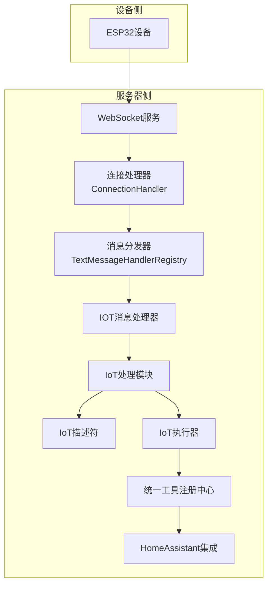
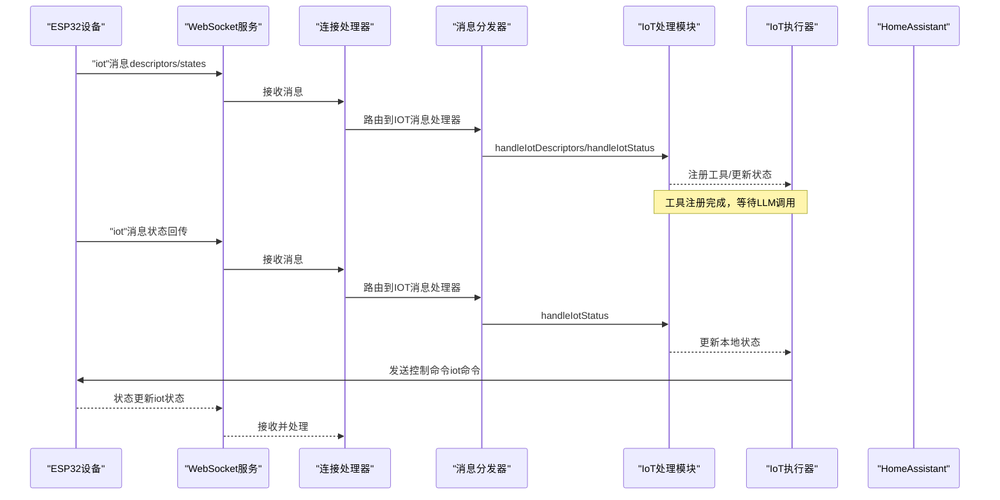
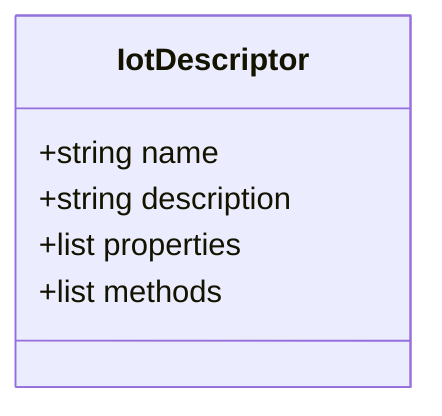
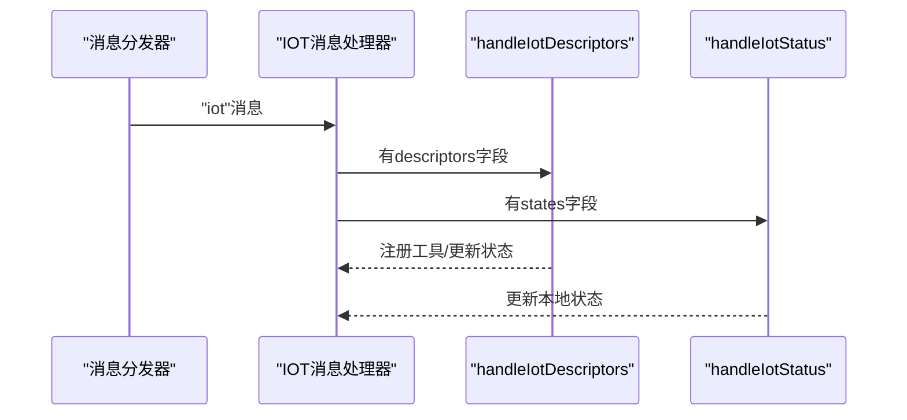
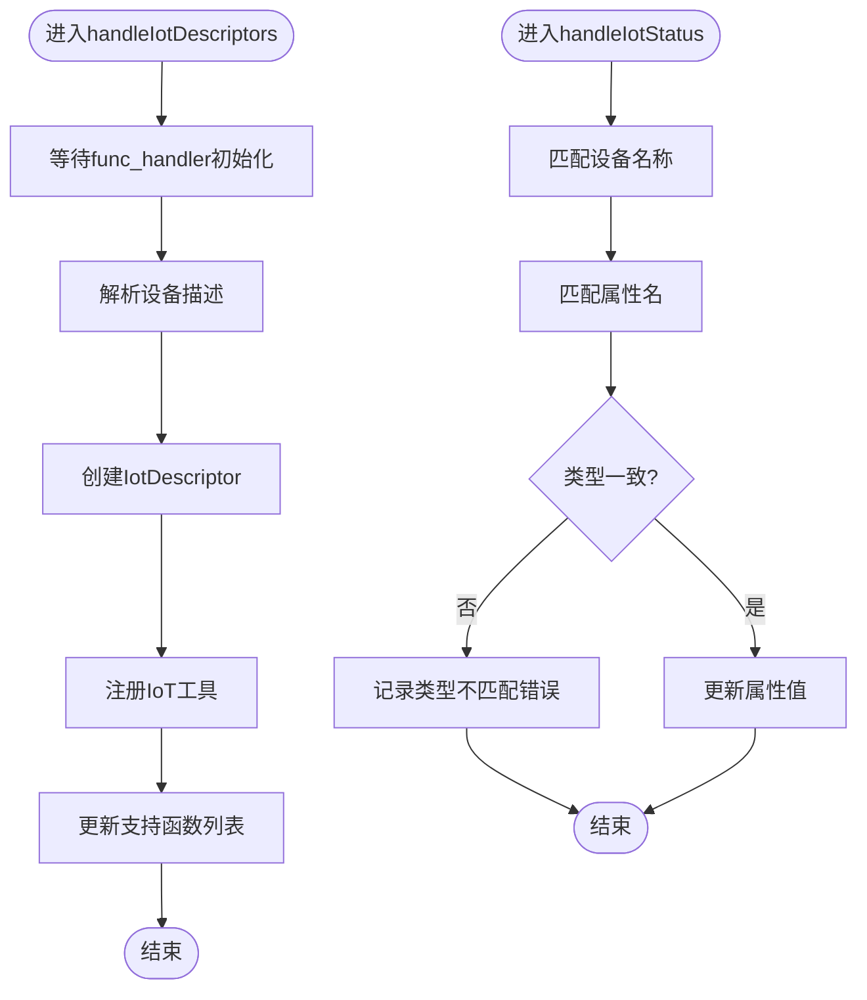
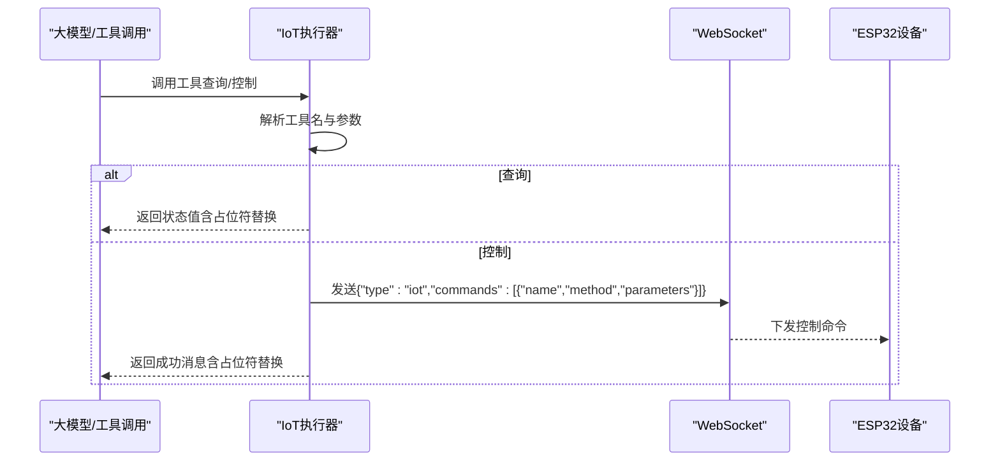
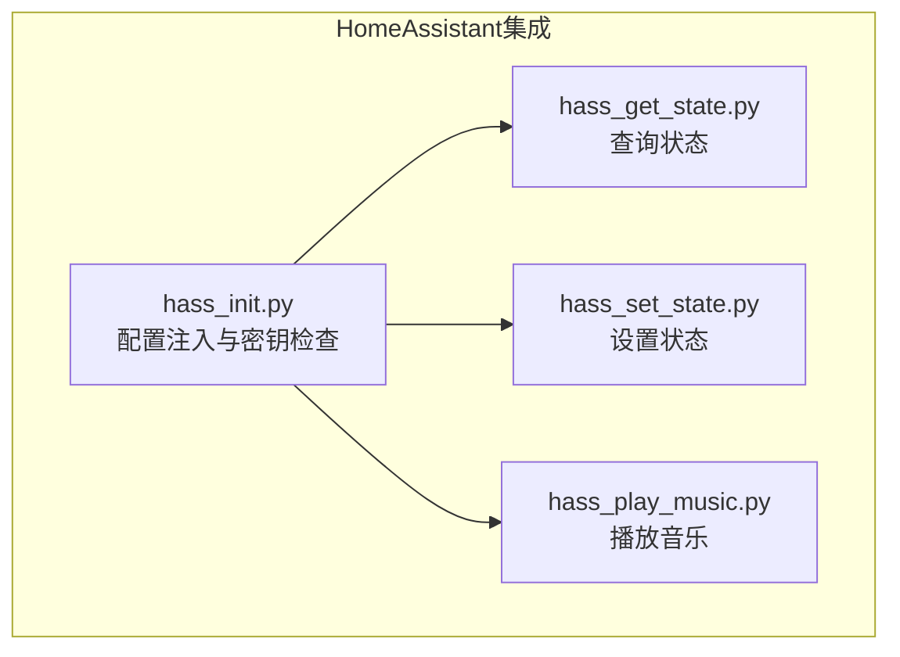
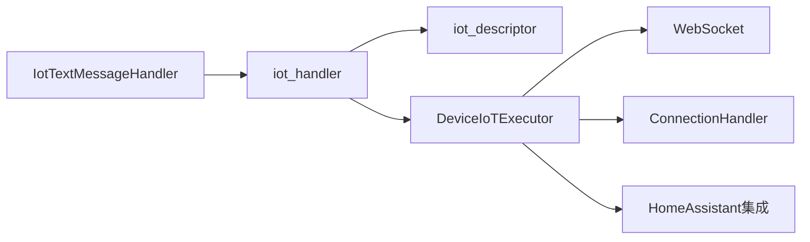

# IoT设备集成

<cite>
**本文引用的文件**
- [iot_descriptor.py](file://main/xiaozhi-server/core/providers/tools/device_iot/iot_descriptor.py)
- [iot_handler.py](file://main/xiaozhi-server/core/providers/tools/device_iot/iot_handler.py)
- [iot_executor.py](file://main/xiaozhi-server/core/providers/tools/device_iot/iot_executor.py)
- [iotMessageHandler.py](file://main/xiaozhi-server/core/handle/textHandler/iotMessageHandler.py)
- [device-onboarding-flow.md](file://main/xiaozhi-server/docs/device/device-onboarding-flow.md)
- [device-api-reference.md](file://main/xiaozhi-server/docs/device/device-api-reference.md)
- [hass_set_state.py](file://main/xiaozhi-server/plugins_func/functions/hass_set_state.py)
- [hass_get_state.py](file://main/xiaozhi-server/plugins_func/functions/hass_get_state.py)
- [hass_play_music.py](file://main/xiaozhi-server/plugins_func/functions/hass_play_music.py)
- [hass_init.py](file://main/xiaozhi-server/plugins_func/functions/hass_init.py)
- [auth.py](file://main/xiaozhi-server/core/auth.py)
- [python_beginner_guide.md](file://main/xiaozhi-server/docs/guides/python_beginner_guide.md)
</cite>

## 目录
1. [简介](#简介)
2. [项目结构](#项目结构)
3. [核心组件](#核心组件)
4. [架构总览](#架构总览)
5. [详细组件分析](#详细组件分析)
6. [依赖分析](#依赖分析)
7. [性能考虑](#性能考虑)
8. [故障排除指南](#故障排除指南)
9. [结论](#结论)
10. [附录](#附录)

## 简介
本文件面向小智ESP32服务器的IoT设备集成功能，系统性阐述IoT设备描述符（IoTDescriptor）的设计理念、设备能力声明与属性定义；IoT执行器（DeviceIoTExecutor）的实现机制、设备控制命令与状态管理；IoT处理器的消息处理、设备发现与连接管理；HomeAssistant集成、智能家居设备控制与自动化场景；以及IoT设备开发指南、设备适配器编写与集成测试方法。文档同时提供实际的IoT设备集成示例、配置参数与故障排除技巧，并说明设备安全、认证机制与隐私保护措施。

## 项目结构
IoT设备集成位于Python语音核心服务（xiaozhi-server）中，围绕“设备描述符”“消息处理”“工具注册与执行”“HomeAssistant集成”四个维度展开。整体采用模块化与分层设计，消息通过文本消息处理器路由至IoT处理模块，设备能力通过统一工具注册中心暴露给大模型调用。

图表来源
- [iotMessageHandler.py:1-22](file://main/xiaozhi-server/core/handle/textHandler/iotMessageHandler.py#L1-L22)
- [iot_handler.py:1-88](file://main/xiaozhi-server/core/providers/tools/device_iot/iot_handler.py#L1-L88)
- [iot_descriptor.py:1-47](file://main/xiaozhi-server/core/providers/tools/device_iot/iot_descriptor.py#L1-L47)
- [iot_executor.py:1-239](file://main/xiaozhi-server/core/providers/tools/device_iot/iot_executor.py#L1-L239)

章节来源
- [device-onboarding-flow.md:349-437](file://main/xiaozhi-server/docs/device/device-onboarding-flow.md#L349-L437)
- [device-api-reference.md:218-308](file://main/xiaozhi-server/docs/device/device-api-reference.md#L218-L308)

## 核心组件
- IoT设备描述符（IoTDescriptor）：用于声明设备能力（属性与方法），并为工具注册提供元数据。
- IoT消息处理器（IotTextMessageHandler）：接收设备侧的“iot”类型消息，分发到描述符处理与状态处理。
- IoT处理模块（handleIotDescriptors/handleIotStatus）：解析设备描述与状态，更新本地状态并注册工具。
- IoT执行器（DeviceIoTExecutor）：将工具调用转化为设备命令，或读取设备状态并返回。
- HomeAssistant集成：通过系统函数对接HomeAssistant API，实现设备状态查询与控制。

章节来源
- [iot_descriptor.py:9-47](file://main/xiaozhi-server/core/providers/tools/device_iot/iot_descriptor.py#L9-L47)
- [iot_handler.py:15-88](file://main/xiaozhi-server/core/providers/tools/device_iot/iot_handler.py#L15-L88)
- [iot_executor.py:10-239](file://main/xiaozhi-server/core/providers/tools/device_iot/iot_executor.py#L10-L239)
- [iotMessageHandler.py:11-22](file://main/xiaozhi-server/core/handle/textHandler/iotMessageHandler.py#L11-L22)

## 架构总览
IoT设备集成遵循“描述-注册-调用-回传”的闭环：设备侧通过“iot”消息上报能力描述与状态；服务器侧解析并注册工具；大模型调用工具时，执行器将控制命令下发至设备；设备侧更新状态并通过“iot”消息回传。

图表来源
- [iotMessageHandler.py:18-22](file://main/xiaozhi-server/core/handle/textHandler/iotMessageHandler.py#L18-L22)
- [iot_handler.py:15-88](file://main/xiaozhi-server/core/providers/tools/device_iot/iot_handler.py#L15-L88)
- [iot_executor.py:111-133](file://main/xiaozhi-server/core/providers/tools/device_iot/iot_executor.py#L111-L133)

## 详细组件分析

### IoT设备描述符（IoTDescriptor）
- 设计理念：以“设备名称、描述、属性、方法”为核心元数据，统一抽象设备能力，便于工具注册与LLM调用。
- 属性定义：根据类型（number/boolean/string）初始化默认值，确保状态一致性。
- 方法定义：支持参数声明，形成工具函数的参数规范与必填项。

图表来源
- [iot_descriptor.py:9-47](file://main/xiaozhi-server/core/providers/tools/device_iot/iot_descriptor.py#L9-L47)

章节来源
- [iot_descriptor.py:12-46](file://main/xiaozhi-server/core/providers/tools/device_iot/iot_descriptor.py#L12-L46)

### IoT消息处理器（IotTextMessageHandler）
- 职责：识别“iot”类型消息，分别调用描述符处理与状态处理，实现异步任务调度。
- 路由策略：根据消息字段（descriptors/states）分发到相应处理函数。

图表来源
- [iotMessageHandler.py:18-22](file://main/xiaozhi-server/core/handle/textHandler/iotMessageHandler.py#L18-L22)
- [iot_handler.py:15-88](file://main/xiaozhi-server/core/providers/tools/device_iot/iot_handler.py#L15-L88)

章节来源
- [iotMessageHandler.py:11-22](file://main/xiaozhi-server/core/handle/textHandler/iotMessageHandler.py#L11-L22)

### IoT处理模块（handleIotDescriptors/handleIotStatus）
- 描述符处理：等待工具注册中心初始化完成，解析设备描述，创建IoTDescriptor并注册工具；当缺少属性时，从方法参数推导属性。
- 状态处理：根据设备名称与属性名匹配，校验类型一致性后更新本地状态。

图表来源
- [iot_handler.py:15-88](file://main/xiaozhi-server/core/providers/tools/device_iot/iot_handler.py#L15-L88)

章节来源
- [iot_handler.py:15-88](file://main/xiaozhi-server/core/providers/tools/device_iot/iot_handler.py#L15-L88)

### IoT执行器（DeviceIoTExecutor）
- 工具命名规则：查询工具形如“get_设备名_属性名”，控制工具形如“设备名_方法名”。
- 查询流程：根据设备名与属性名从本地状态读取值，支持响应模板占位符替换。
- 控制流程：解析工具名与参数，构造“iot”命令消息，通过WebSocket发送；短暂等待后返回预设的成功消息（支持参数占位符）。
- 工具注册：将查询与控制工具注册到统一工具注册中心，供LLM调用。

图表来源
- [iot_executor.py:17-100](file://main/xiaozhi-server/core/providers/tools/device_iot/iot_executor.py#L17-L100)
- [iot_executor.py:111-133](file://main/xiaozhi-server/core/providers/tools/device_iot/iot_executor.py#L111-L133)

章节来源
- [iot_executor.py:17-239](file://main/xiaozhi-server/core/providers/tools/device_iot/iot_executor.py#L17-L239)

### HomeAssistant集成
- 配置注入：通过插件配置统一注入HomeAssistant的base_url与api_key，并在提示词中附加设备清单。
- 系统函数：
  - 查询状态：hass_get_state，支持实体ID查询。
  - 设置状态：hass_set_state，支持开关、亮度、音量、色温和颜色等动作。
  - 播放音乐：hass_play_music，支持指定媒体内容与播放器实体。
- 认证与安全：通过check_model_key对API密钥进行安全检查；日志记录错误信息。

图表来源
- [hass_init.py:30-55](file://main/xiaozhi-server/plugins_func/functions/hass_init.py#L30-L55)
- [hass_get_state.py:14-44](file://main/xiaozhi-server/plugins_func/functions/hass_get_state.py#L14-L44)
- [hass_set_state.py:14-148](file://main/xiaozhi-server/plugins_func/functions/hass_set_state.py#L14-L148)
- [hass_play_music.py:14-34](file://main/xiaozhi-server/plugins_func/functions/hass_play_music.py#L14-L34)

章节来源
- [hass_init.py:8-55](file://main/xiaozhi-server/plugins_func/functions/hass_init.py#L8-L55)
- [hass_get_state.py:14-56](file://main/xiaozhi-server/plugins_func/functions/hass_get_state.py#L14-L56)
- [hass_set_state.py:14-148](file://main/xiaozhi-server/plugins_func/functions/hass_set_state.py#L14-L148)
- [hass_play_music.py:14-34](file://main/xiaozhi-server/plugins_func/functions/hass_play_music.py#L14-L34)

## 依赖分析
- 组件耦合：
  - IotTextMessageHandler依赖iot_handler模块进行描述与状态处理。
  - iot_handler依赖iot_descriptor模块构建设备描述。
  - DeviceIoTExecutor依赖ConnectionHandler的websocket连接与iot_descriptors状态。
  - HomeAssistant集成依赖hass_init的配置注入与check_model_key的安全检查。
- 外部依赖：
  - WebSocket消息协议与设备侧“iot”消息类型。
  - HomeAssistant API（REST）。

图表来源
- [iotMessageHandler.py:1-22](file://main/xiaozhi-server/core/handle/textHandler/iotMessageHandler.py#L1-L22)
- [iot_handler.py:1-88](file://main/xiaozhi-server/core/providers/tools/device_iot/iot_handler.py#L1-L88)
- [iot_descriptor.py:1-47](file://main/xiaozhi-server/core/providers/tools/device_iot/iot_descriptor.py#L1-L47)
- [iot_executor.py:1-239](file://main/xiaozhi-server/core/providers/tools/device_iot/iot_executor.py#L1-L239)
- [hass_init.py:1-55](file://main/xiaozhi-server/plugins_func/functions/hass_init.py#L1-L55)

章节来源
- [iotMessageHandler.py:1-22](file://main/xiaozhi-server/core/handle/textHandler/iotMessageHandler.py#L1-L22)
- [iot_handler.py:1-88](file://main/xiaozhi-server/core/providers/tools/device_iot/iot_handler.py#L1-L88)
- [iot_descriptor.py:1-47](file://main/xiaozhi-server/core/providers/tools/device_iot/iot_descriptor.py#L1-L47)
- [iot_executor.py:1-239](file://main/xiaozhi-server/core/providers/tools/device_iot/iot_executor.py#L1-L239)
- [hass_init.py:1-55](file://main/xiaozhi-server/plugins_func/functions/hass_init.py#L1-L55)

## 性能考虑
- 异步处理：IOT消息处理与工具注册均采用异步任务，避免阻塞主消息循环。
- 状态更新：在状态处理中进行类型校验，防止无效状态污染本地缓存。
- 工具调用：控制命令下发后短暂等待，减少频繁轮询带来的抖动。
- 并发模型：基于事件循环与线程池的混合架构，保证高并发下的稳定性。

## 故障排除指南
- 设备未绑定导致消息被丢弃
  - 现象：设备连上WebSocket后，服务器拒绝处理消息并周期性播放绑定提示。
  - 原因：WebSocket阶段调用配置接口返回未绑定。
  - 处理：完成设备绑定流程后再进行IoT交互。
- 认证失败
  - 现象：WebSocket连接被拒绝。
  - 原因：Token签名不正确或过期。
  - 处理：重新请求OTA获取新Token，确认签名算法与时间戳。
- 状态类型不匹配
  - 现象：日志出现属性类型不匹配错误。
  - 原因：设备上报状态与描述符定义的类型不符。
  - 处理：修正设备侧状态上报或描述符类型定义。
- 工具未找到
  - 现象：执行器返回工具不存在。
  - 原因：工具命名不符合规则或未完成注册。
  - 处理：检查设备描述符是否正确上报，确认工具注册完成。

章节来源
- [device-onboarding-flow.md:482-497](file://main/xiaozhi-server/docs/device/device-onboarding-flow.md#L482-L497)
- [iot_handler.py:76-86](file://main/xiaozhi-server/core/providers/tools/device_iot/iot_handler.py#L76-L86)
- [auth.py:52-73](file://main/xiaozhi-server/core/auth.py#L52-L73)

## 结论
小智ESP32服务器的IoT设备集成功能以“描述-注册-调用-回传”为核心闭环，通过IoTDescriptor统一抽象设备能力，借助DeviceIoTExecutor实现设备控制与状态读取，并通过HomeAssistant集成扩展智能家居自动化场景。该方案具备良好的可扩展性与安全性，适合在多设备、多场景的智能语音系统中落地应用。

## 附录

### IoT设备开发指南
- 设备描述符编写
  - 明确设备名称与描述，定义属性（名称、描述、类型）与方法（名称、描述、参数）。
  - 若仅有方法参数而无属性，系统会自动从方法参数推导属性。
- 工具命名规范
  - 查询工具：get_设备名_属性名
  - 控制工具：设备名_方法名
- 控制命令格式
  - 通过“iot”消息下发，包含设备名、方法名与参数数组。

章节来源
- [iot_descriptor.py:18-46](file://main/xiaozhi-server/core/providers/tools/device_iot/iot_descriptor.py#L18-L46)
- [iot_executor.py:135-231](file://main/xiaozhi-server/core/providers/tools/device_iot/iot_executor.py#L135-L231)
- [iot_handler.py:36-48](file://main/xiaozhi-server/core/providers/tools/device_iot/iot_handler.py#L36-L48)

### 设备适配器编写与集成测试
- 适配器编写步骤
  - 在设备侧上报“iot”消息（descriptors），包含设备能力声明。
  - 等待服务器注册工具完成，随后可由大模型调用工具。
  - 设备侧定期上报“iot”消息（states），包含状态变更。
- 集成测试方法
  - 使用浏览器测试页或抓包工具验证消息收发。
  - 通过日志查看工具注册与状态更新情况。
  - 验证控制命令下发与状态回传的时序。

章节来源
- [device-api-reference.md:376-408](file://main/xiaozhi-server/docs/device/device-api-reference.md#L376-L408)
- [python_beginner_guide.md:383-403](file://main/xiaozhi-server/docs/guides/python_beginner_guide.md#L383-L403)

### 实际IoT设备集成示例
- 设备能力声明
  - 设备上报包含“name”“description”“properties”“methods”的描述符。
- 状态回传
  - 设备上报包含“name”“state”的状态消息，服务器据此更新本地状态。
- 工具调用
  - LLM调用“get_设备名_属性名”查询状态，“设备名_方法名”控制设备。

章节来源
- [device-onboarding-flow.md:349-437](file://main/xiaozhi-server/docs/device/device-onboarding-flow.md#L349-L437)
- [iot_handler.py:68-88](file://main/xiaozhi-server/core/providers/tools/device_iot/iot_handler.py#L68-L88)

### 配置参数与安全
- 认证机制
  - 使用HMAC-SHA256生成与验证Token，包含签名与时间戳。
  - 支持白名单直连与禁用认证场景。
- 隐私保护
  - 传输加密：WebSocket与HTTP使用TLS 1.3。
  - 存储加密：数据库透明加密（TDE）。
  - 访问控制：基于角色分区与用户隔离。
  - 数据最小化：仅收集必要信息，支持用户可控保留策略。

章节来源
- [auth.py:13-73](file://main/xiaozhi-server/core/auth.py#L13-L73)
- [device-api-reference.md:87-176](file://main/xiaozhi-server/docs/device/device-api-reference.md#L87-L176)