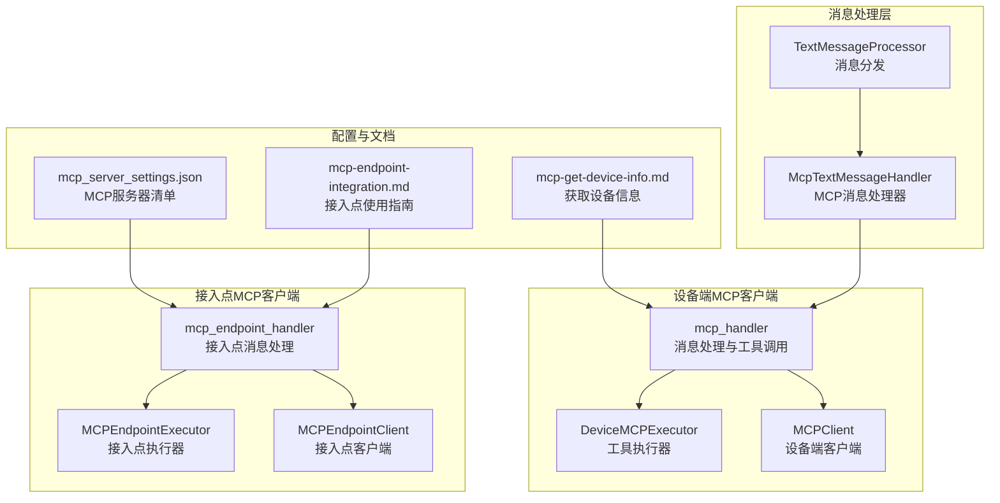
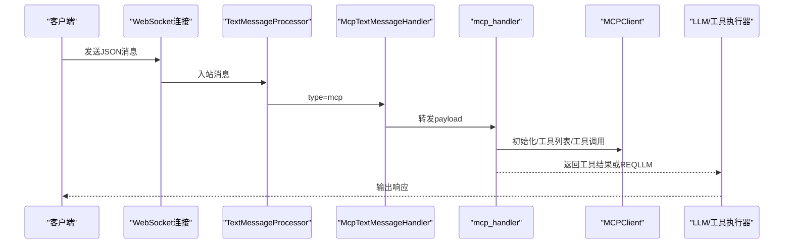
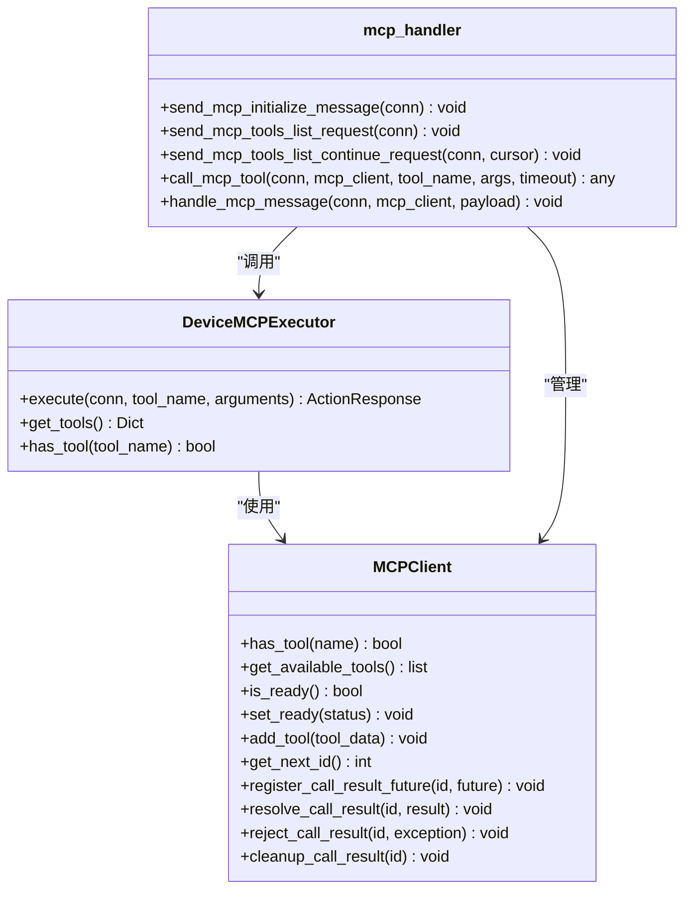
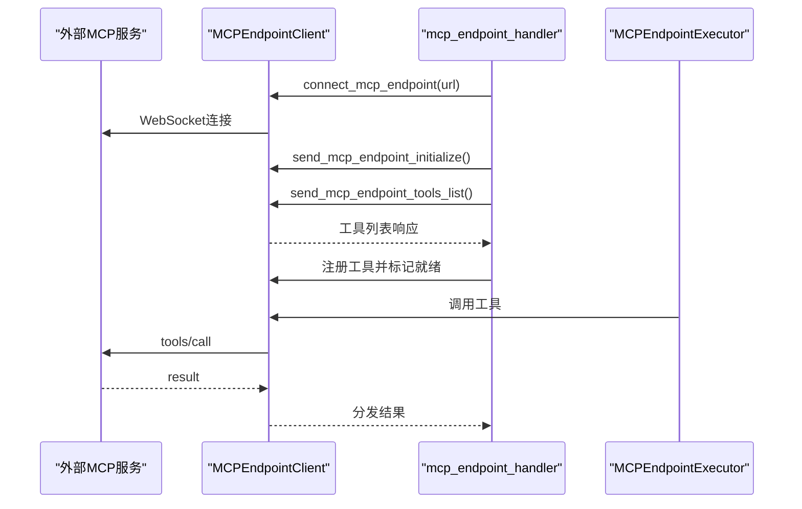
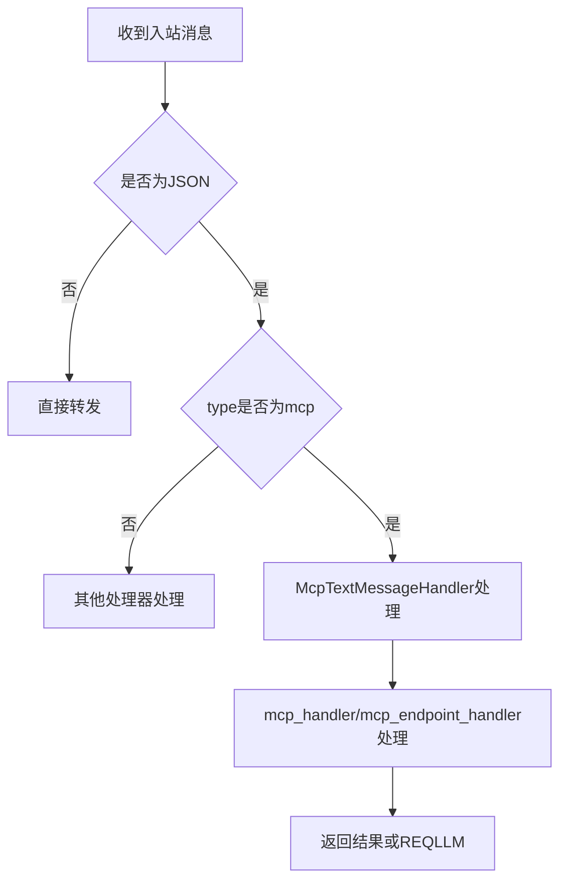
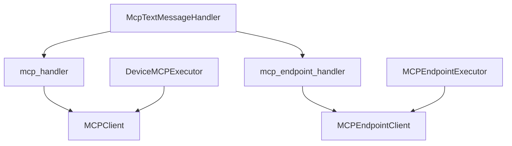

# MCP协议扩展

<cite>
**本文档引用的文件**
- [mcpMessageHandler.py](file://main/xiaozhi-server/core/handle/textHandler/mcpMessageHandler.py)
- [textMessageProcessor.py](file://main/xiaozhi-server/core/handle/textMessageProcessor.py)
- [connection.py](file://main/xiaozhi-server/core/connection.py)
- [mcp_client.py](file://main/xiaozhi-server/core/providers/tools/device_mcp/mcp_client.py)
- [mcp_executor.py](file://main/xiaozhi-server/core/providers/tools/device_mcp/mcp_executor.py)
- [mcp_handler.py](file://main/xiaozhi-server/core/providers/tools/device_mcp/mcp_handler.py)
- [mcp_endpoint_client.py](file://main/xiaozhi-server/core/providers/tools/mcp_endpoint/mcp_endpoint_client.py)
- [mcp_endpoint_executor.py](file://main/xiaozhi-server/core/providers/tools/mcp_endpoint/mcp_endpoint_executor.py)
- [mcp_endpoint_handler.py](file://main/xiaozhi-server/core/providers/tools/mcp_endpoint/mcp_endpoint_handler.py)
- [mcp_server_settings.json](file://main/xiaozhi-server/mcp_server_settings.json)
- [mcp-endpoint-integration.md](file://docs/mcp-endpoint-integration.md)
- [mcp-get-device-info.md](file://docs/mcp-get-device-info.md)
</cite>

## 目录
1. [简介](#简介)
2. [项目结构](#项目结构)
3. [核心组件](#核心组件)
4. [架构总览](#架构总览)
5. [详细组件分析](#详细组件分析)
6. [依赖关系分析](#依赖关系分析)
7. [性能考虑](#性能考虑)
8. [故障排查指南](#故障排查指南)
9. [结论](#结论)
10. [附录](#附录)

## 简介
本文件面向小智ESP32服务器的MCP（Model Context Protocol）协议扩展，系统性阐述MCP协议的工作原理、消息格式与通信机制；深入解析MCP客户端实现细节、设备控制集成与端点管理；说明MCP处理器的消息路由、协议转换与错误处理；并给出在设备控制、工具调用与系统集成中的应用场景、开发指南、配置参数与调试方法。文档同时提供完整的MCP集成示例、协议规范与最佳实践，并说明MCP协议与其他通信协议的兼容性与互操作性。

## 项目结构
MCP扩展主要分布在以下模块：
- 文本消息处理层：负责将WebSocket传入的JSON消息按类型路由到对应处理器
- 设备端MCP客户端：封装工具发现、工具调用、结果回调与状态管理
- 接入点MCP客户端：通过WebSocket连接外部MCP服务，实现工具代理与转发
- 配置与文档：提供MCP服务器清单与接入指南

**图表来源**
- [textMessageProcessor.py:17-44](file://main/xiaozhi-server/core/handle/textMessageProcessor.py#L17-L44)
- [mcpMessageHandler.py:18-22](file://main/xiaozhi-server/core/handle/textHandler/mcpMessageHandler.py#L18-L22)
- [mcp_handler.py:118-236](file://main/xiaozhi-server/core/providers/tools/device_mcp/mcp_handler.py#L118-L236)
- [mcp_endpoint_handler.py:14-42](file://main/xiaozhi-server/core/providers/tools/mcp_endpoint/mcp_endpoint_handler.py#L14-L42)
- [mcp_server_settings.json:1-57](file://main/xiaozhi-server/mcp_server_settings.json#L1-L57)

**章节来源**
- [textMessageProcessor.py:17-44](file://main/xiaozhi-server/core/handle/textMessageProcessor.py#L17-L44)
- [mcpMessageHandler.py:18-22](file://main/xiaozhi-server/core/handle/textHandler/mcpMessageHandler.py#L18-L22)

## 核心组件
- 文本消息处理器：解析入站消息，按type路由至相应处理器
- MCP消息处理器：专门处理type为mcp的消息，委派给设备端MCP处理模块
- 设备端MCP客户端：维护工具列表、状态机、调用ID与Future结果映射，负责与MCP服务器交互
- 设备端MCP执行器：将工具调用桥接到设备端MCP客户端，处理返回值与动作决策
- 接入点MCP客户端：通过WebSocket连接外部MCP服务，代理工具调用与工具列表同步
- 接入点MCP执行器：将工具调用桥接到接入点客户端
- 配置与文档：提供MCP服务器清单与接入指南

**章节来源**
- [mcpMessageHandler.py:11-22](file://main/xiaozhi-server/core/handle/textHandler/mcpMessageHandler.py#L11-L22)
- [mcp_client.py:12-94](file://main/xiaozhi-server/core/providers/tools/device_mcp/mcp_client.py#L12-L94)
- [mcp_executor.py:12-93](file://main/xiaozhi-server/core/providers/tools/device_mcp/mcp_executor.py#L12-L93)
- [mcp_endpoint_client.py:12-113](file://main/xiaozhi-server/core/providers/tools/mcp_endpoint/mcp_endpoint_client.py#L12-L113)
- [mcp_endpoint_executor.py:9-98](file://main/xiaozhi-server/core/providers/tools/mcp_endpoint/mcp_endpoint_executor.py#L9-L98)
- [mcp_server_settings.json:1-57](file://main/xiaozhi-server/mcp_server_settings.json#L1-L57)

## 架构总览
MCP扩展采用“消息路由—协议适配—工具执行”的分层架构。WebSocket入站消息由TextMessageProcessor解析后，MCP消息交由McpTextMessageHandler处理；设备端MCP路径通过mcp_handler与MCPClient交互，完成初始化、工具列表拉取与工具调用；接入点路径通过mcp_endpoint_handler与MCPEndpointClient交互，实现对外部MCP服务的代理。

**图表来源**
- [textMessageProcessor.py:17-44](file://main/xiaozhi-server/core/handle/textMessageProcessor.py#L17-L44)
- [mcpMessageHandler.py:18-22](file://main/xiaozhi-server/core/handle/textHandler/mcpMessageHandler.py#L18-L22)
- [mcp_handler.py:118-236](file://main/xiaozhi-server/core/providers/tools/device_mcp/mcp_handler.py#L118-L236)

## 详细组件分析

### 设备端MCP客户端与处理器
- 状态与工具管理：MCPClient维护工具字典、名称映射、就绪状态、调用ID与Future结果映射，并提供缓存优化
- 初始化与工具列表：mcp_handler负责发送initialize与tools/list请求，解析响应并填充工具缓存
- 工具调用：call_mcp_tool构造tools/call请求，等待Future结果，处理超时与错误
- 执行器桥接：DeviceMCPExecutor将工具调用桥接至设备端MCP客户端，处理返回值与动作决策

**图表来源**
- [mcp_client.py:12-94](file://main/xiaozhi-server/core/providers/tools/device_mcp/mcp_client.py#L12-L94)
- [mcp_executor.py:12-93](file://main/xiaozhi-server/core/providers/tools/device_mcp/mcp_executor.py#L12-L93)
- [mcp_handler.py:19-404](file://main/xiaozhi-server/core/providers/tools/device_mcp/mcp_handler.py#L19-L404)

**章节来源**
- [mcp_client.py:12-94](file://main/xiaozhi-server/core/providers/tools/device_mcp/mcp_client.py#L12-L94)
- [mcp_executor.py:12-93](file://main/xiaozhi-server/core/providers/tools/device_mcp/mcp_executor.py#L12-L93)
- [mcp_handler.py:118-404](file://main/xiaozhi-server/core/providers/tools/device_mcp/mcp_handler.py#L118-L404)

### 接入点MCP客户端与处理器
- 连接与初始化：connect_mcp_endpoint建立WebSocket连接，发送initialize与tools/list请求
- 消息监听：_message_listener持续监听消息，解析result/method/error分支
- 工具调用：call_mcp_endpoint_tool构造tools/call请求，等待Future结果，处理超时与错误
- 执行器桥接：MCPEndpointExecutor将工具调用桥接至接入点客户端

**图表来源**
- [mcp_endpoint_handler.py:14-42](file://main/xiaozhi-server/core/providers/tools/mcp_endpoint/mcp_endpoint_handler.py#L14-L42)
- [mcp_endpoint_client.py:12-113](file://main/xiaozhi-server/core/providers/tools/mcp_endpoint/mcp_endpoint_client.py#L12-L113)
- [mcp_endpoint_executor.py:9-98](file://main/xiaozhi-server/core/providers/tools/mcp_endpoint/mcp_endpoint_executor.py#L9-L98)

**章节来源**
- [mcp_endpoint_handler.py:14-393](file://main/xiaozhi-server/core/providers/tools/mcp_endpoint/mcp_endpoint_handler.py#L14-L393)
- [mcp_endpoint_client.py:12-113](file://main/xiaozhi-server/core/providers/tools/mcp_endpoint/mcp_endpoint_client.py#L12-L113)
- [mcp_endpoint_executor.py:9-98](file://main/xiaozhi-server/core/providers/tools/mcp_endpoint/mcp_endpoint_executor.py#L9-L98)

### 消息路由与协议转换
- 文本消息处理器：解析入站消息，按type选择处理器
- MCP消息处理器：将type为mcp的消息转发给设备端MCP处理模块
- 协议转换：mcp_handler与mcp_endpoint_handler均遵循JSON-RPC 2.0与MCP协议规范，完成initialize、tools/list与tools/call的转换

**图表来源**
- [textMessageProcessor.py:17-44](file://main/xiaozhi-server/core/handle/textMessageProcessor.py#L17-L44)
- [mcpMessageHandler.py:18-22](file://main/xiaozhi-server/core/handle/textHandler/mcpMessageHandler.py#L18-L22)

**章节来源**
- [textMessageProcessor.py:17-44](file://main/xiaozhi-server/core/handle/textMessageProcessor.py#L17-L44)
- [mcpMessageHandler.py:18-22](file://main/xiaozhi-server/core/handle/textHandler/mcpMessageHandler.py#L18-L22)

## 依赖关系分析
- 组件耦合：McpTextMessageHandler依赖mcp_handler；DeviceMCPExecutor与MCPEndpointExecutor分别依赖对应的客户端；客户端依赖连接对象与工具管理器
- 外部依赖：接入点路径依赖websockets库；设备端路径依赖JSON-RPC与MCP协议规范
- 错误传播：各处理器对异常进行捕获与转换，向上抛出统一的ActionResponse或异常

**图表来源**
- [mcpMessageHandler.py:18-22](file://main/xiaozhi-server/core/handle/textHandler/mcpMessageHandler.py#L18-L22)
- [mcp_handler.py:118-404](file://main/xiaozhi-server/core/providers/tools/device_mcp/mcp_handler.py#L118-L404)
- [mcp_endpoint_handler.py:14-393](file://main/xiaozhi-server/core/providers/tools/mcp_endpoint/mcp_endpoint_handler.py#L14-L393)

**章节来源**
- [mcpMessageHandler.py:18-22](file://main/xiaozhi-server/core/handle/textHandler/mcpMessageHandler.py#L18-L22)
- [mcp_handler.py:118-404](file://main/xiaozhi-server/core/providers/tools/device_mcp/mcp_handler.py#L118-L404)
- [mcp_endpoint_handler.py:14-393](file://main/xiaozhi-server/core/providers/tools/mcp_endpoint/mcp_endpoint_handler.py#L14-L393)

## 性能考虑
- 异步I/O：使用asyncio与websockets，避免阻塞事件循环
- 结果缓存：MCPClient对工具列表进行缓存，减少重复请求
- 超时控制：工具调用设置超时，防止长时间挂起
- 并发安全：使用锁保护共享状态，确保Future映射一致性
- 日志与可观测性：在关键路径记录调试信息，便于定位性能瓶颈

## 故障排查指南
- 客户端不支持MCP：检查features中mcp标志位，若为false则无法发送MCP消息
- 初始化失败：确认initialize请求的protocolVersion与capabilities正确，检查服务器信息与版本
- 工具列表为空：确认tools/list请求已发送且响应格式正确，检查nextCursor与分页逻辑
- 工具调用超时：检查网络连通性、服务器负载与超时阈值；查看Future清理逻辑
- 参数解析错误：确认参数为有效JSON或可合并的JSON对象集合；检查类型转换
- 接入点连接失败：检查WebSocket URL、认证令牌与服务端可达性

**章节来源**
- [mcp_handler.py:103-116](file://main/xiaozhi-server/core/providers/tools/device_mcp/mcp_handler.py#L103-L116)
- [mcp_endpoint_handler.py:14-42](file://main/xiaozhi-server/core/providers/tools/mcp_endpoint/mcp_endpoint_handler.py#L14-L42)
- [mcp_endpoint_handler.py:215-222](file://main/xiaozhi-server/core/providers/tools/mcp_endpoint/mcp_endpoint_handler.py#L215-L222)

## 结论
MCP协议扩展在小智ESP32服务器中提供了统一的工具调用与设备控制能力。通过设备端MCP客户端与接入点MCP客户端，系统实现了对本地与外部MCP服务的无缝集成。消息路由与协议转换保证了不同来源工具的一致性，执行器桥接简化了工具调用流程。配合完善的配置与文档，开发者可以快速扩展设备控制、工具调用与系统集成场景。

## 附录

### MCP协议规范要点
- JSON-RPC 2.0：请求与响应遵循JSON-RPC 2.0规范
- initialize：客户端向服务器声明协议版本与能力
- tools/list：获取可用工具列表，支持分页与游标
- tools/call：调用指定工具，返回结果或错误

**章节来源**
- [mcp_handler.py:238-294](file://main/xiaozhi-server/core/providers/tools/device_mcp/mcp_handler.py#L238-L294)
- [mcp_endpoint_handler.py:224-284](file://main/xiaozhi-server/core/providers/tools/mcp_endpoint/mcp_endpoint_handler.py#L224-L284)

### 开发指南与配置参数
- MCP服务器清单：参考mcp_server_settings.json，支持stdio、SSE与streamable-http传输模式
- 接入点启用与使用：参考mcp-endpoint-integration.md，了解如何为智能体接入MCP功能
- 获取设备信息：参考mcp-get-device-info.md，了解如何在MCP方法中获取设备ID等信息

**章节来源**
- [mcp_server_settings.json:1-57](file://main/xiaozhi-server/mcp_server_settings.json#L1-L57)
- [mcp-endpoint-integration.md:1-94](file://docs/mcp-endpoint-integration.md#L1-L94)
- [mcp-get-device-info.md:1-41](file://docs/mcp-get-device-info.md#L1-L41)

### 最佳实践
- 使用缓存优化工具列表获取频率
- 严格校验参数格式与类型，避免运行时错误
- 合理设置超时与重试策略，提升鲁棒性
- 通过日志与监控定位问题，避免静默失败
- 在接入点路径中分离外部服务故障与内部逻辑错误