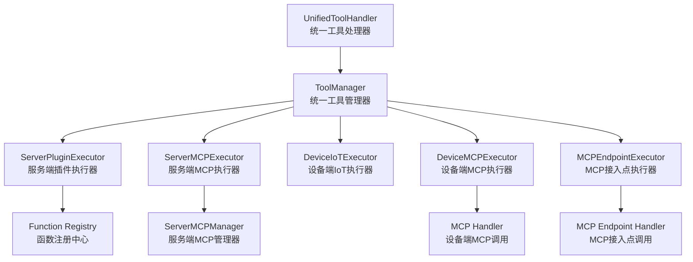
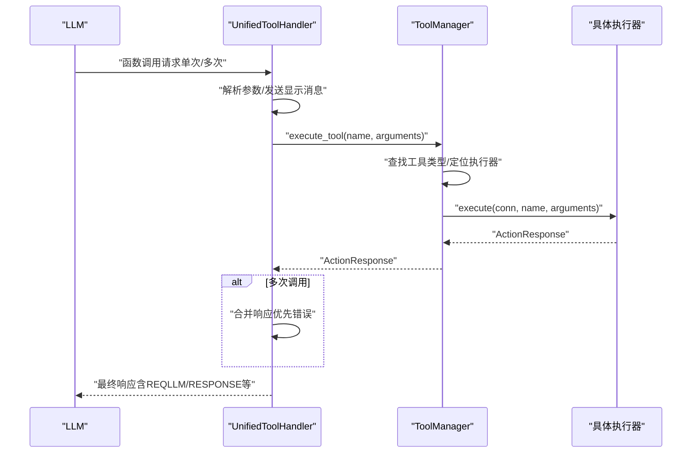
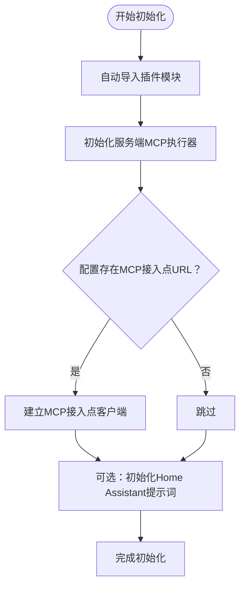
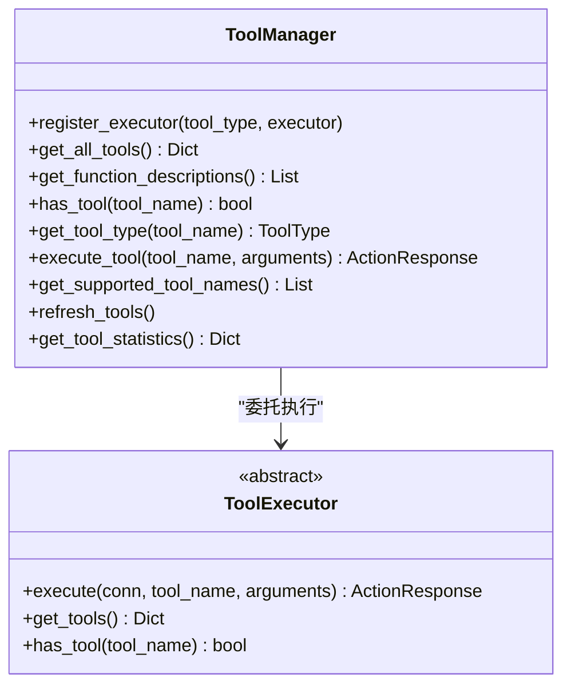
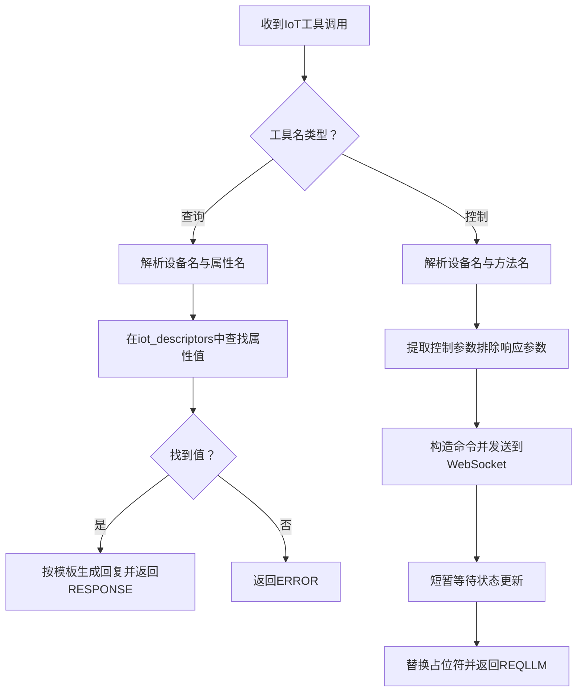
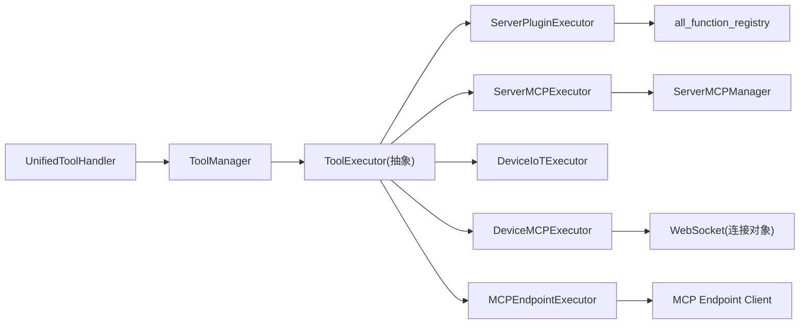

# 工具执行框架

<cite>
**本文引用的文件**
- [unified_tool_handler.py](file://main/xiaozhi-server/core/providers/tools/unified_tool_handler.py)
- [unified_tool_manager.py](file://main/xiaozhi-server/core/providers/tools/unified_tool_manager.py)
- [tool_executor.py](file://main/xiaozhi-server/core/providers/tools/base/tool_executor.py)
- [tool_types.py](file://main/xiaozhi-server/core/providers/tools/base/tool_types.py)
- [plugin_executor.py](file://main/xiaozhi-server/core/providers/tools/server_plugins/plugin_executor.py)
- [iot_executor.py](file://main/xiaozhi-server/core/providers/tools/device_iot/iot_executor.py)
- [mcp_executor.py（设备端）](file://main/xiaozhi-server/core/providers/tools/device_mcp/mcp_executor.py)
- [mcp_endpoint_executor.py](file://main/xiaozhi-server/core/providers/tools/mcp_endpoint/mcp_endpoint_executor.py)
- [mcp_executor.py（服务端）](file://main/xiaozhi-server/core/providers/tools/server_mcp/mcp_executor.py)
- [register.py](file://main/xiaozhi-server/plugins_func/register.py)
- [loadplugins.py](file://main/xiaozhi-server/plugins_func/loadplugins.py)
</cite>

## 目录
1. [简介](#简介)
2. [项目结构](#项目结构)
3. [核心组件](#核心组件)
4. [架构总览](#架构总览)
5. [详细组件分析](#详细组件分析)
6. [依赖关系分析](#依赖关系分析)
7. [性能考量](#性能考量)
8. [故障排查指南](#故障排查指南)
9. [结论](#结论)
10. [附录](#附录)

## 简介
本文件面向“小智ESP32服务器”的工具执行框架，系统性阐述工具执行器（ToolExecutor）的设计模式、工具类型系统与统一调度机制。重点包括：
- 统一工具处理器的架构设计与初始化流程
- 工具管理器的调度机制与执行上下文管理
- 工具接口规范、参数校验与错误处理策略
- 异步执行、超时控制与资源管理
- 工具开发指南、性能优化建议与集成测试思路

## 项目结构
工具执行框架位于后端Python工程的“providers/tools”目录下，采用“统一处理器 + 工具管理器 + 多类型执行器”的分层设计。核心文件如下：
- 统一入口与编排：UnifiedToolHandler
- 统一调度与缓存：ToolManager
- 抽象基类：ToolExecutor、ToolType、ToolDefinition
- 执行器实现：服务端插件、服务端MCP、设备端IoT、设备端MCP、MCP接入点
- 插件注册与动作语义：register.py
- 插件自动导入：loadplugins.py

图表来源
- [unified_tool_handler.py:19-52](file://main/xiaozhi-server/core/providers/tools/unified_tool_handler.py#L19-L52)
- [unified_tool_manager.py:9-23](file://main/xiaozhi-server/core/providers/tools/unified_tool_manager.py#L9-L23)
- [plugin_executor.py:11-101](file://main/xiaozhi-server/core/providers/tools/server_plugins/plugin_executor.py#L11-L101)
- [mcp_executor.py（服务端）:9-90](file://main/xiaozhi-server/core/providers/tools/server_mcp/mcp_executor.py#L9-L90)
- [iot_executor.py:10-239](file://main/xiaozhi-server/core/providers/tools/device_iot/iot_executor.py#L10-L239)
- [mcp_executor.py（设备端）:12-93](file://main/xiaozhi-server/core/providers/tools/device_mcp/mcp_executor.py#L12-L93)
- [mcp_endpoint_executor.py:9-98](file://main/xiaozhi-server/core/providers/tools/mcp_endpoint/mcp_endpoint_executor.py#L9-L98)

章节来源
- [unified_tool_handler.py:19-52](file://main/xiaozhi-server/core/providers/tools/unified_tool_handler.py#L19-L52)
- [unified_tool_manager.py:9-23](file://main/xiaozhi-server/core/providers/tools/unified_tool_manager.py#L9-L23)

## 核心组件
- 统一工具处理器（UnifiedToolHandler）
  - 负责初始化各类执行器、注册执行器、处理LLM函数调用、合并多工具响应、维护IoT工具注册与统计、清理资源。
- 统一工具管理器（ToolManager）
  - 负责执行器注册、工具缓存、工具查询与类型判定、异步执行工具、统计各类型工具数量。
- 工具执行器基类（ToolExecutor）
  - 定义execute与get_tools两个抽象方法，约束具体执行器行为。
- 工具类型系统（ToolType、ToolDefinition）
  - ToolType枚举定义SERVER_PLUGIN、SERVER_MCP、DEVICE_IOT、DEVICE_MCP、MCP_ENDPOINT五种类型；ToolDefinition封装工具名称、描述、类型与附加参数。

章节来源
- [unified_tool_handler.py:19-52](file://main/xiaozhi-server/core/providers/tools/unified_tool_handler.py#L19-L52)
- [unified_tool_manager.py:9-23](file://main/xiaozhi-server/core/providers/tools/unified_tool_manager.py#L9-L23)
- [tool_executor.py:9-28](file://main/xiaozhi-server/core/providers/tools/base/tool_executor.py#L9-L28)
- [tool_types.py:10-28](file://main/xiaozhi-server/core/providers/tools/base/tool_types.py#L10-L28)

## 架构总览
统一处理器在初始化阶段完成以下关键步骤：
- 自动导入插件模块
- 初始化服务端MCP执行器
- 可选初始化MCP接入点客户端
- 可选初始化Home Assistant提示词
- 注册各类型执行器至工具管理器
- 暴露工具函数描述给LLM，支持单次与多次函数调用

图表来源
- [unified_tool_handler.py:139-184](file://main/xiaozhi-server/core/providers/tools/unified_tool_handler.py#L139-L184)
- [unified_tool_manager.py:73-102](file://main/xiaozhi-server/core/providers/tools/unified_tool_manager.py#L73-L102)
- [tool_executor.py:12-17](file://main/xiaozhi-server/core/providers/tools/base/tool_executor.py#L12-L17)

章节来源
- [unified_tool_handler.py:57-80](file://main/xiaozhi-server/core/providers/tools/unified_tool_handler.py#L57-L80)
- [unified_tool_handler.py:139-184](file://main/xiaozhi-server/core/providers/tools/unified_tool_handler.py#L139-L184)
- [unified_tool_manager.py:73-102](file://main/xiaozhi-server/core/providers/tools/unified_tool_manager.py#L73-L102)

## 详细组件分析

### 统一工具处理器（UnifiedToolHandler）
- 初始化流程
  - 自动导入插件模块，确保函数注册中心可用
  - 初始化服务端MCP执行器
  - 可选初始化MCP接入点客户端（基于配置URL）
  - 可选初始化Home Assistant提示词
- 函数调用处理
  - 支持单次与多次函数调用
  - 对参数进行JSON解析容错
  - 发送显示消息到设备，提示当前调用的工具
  - 合并多次调用的响应，优先返回错误
- IoT工具注册
  - 接收设备能力描述，动态注册查询与控制工具
- 资源清理
  - 关闭服务端MCP与MCP接入点连接

图表来源
- [unified_tool_handler.py:57-118](file://main/xiaozhi-server/core/providers/tools/unified_tool_handler.py#L57-L118)

章节来源
- [unified_tool_handler.py:19-52](file://main/xiaozhi-server/core/providers/tools/unified_tool_handler.py#L19-L52)
- [unified_tool_handler.py:120-134](file://main/xiaozhi-server/core/providers/tools/unified_tool_handler.py#L120-L134)
- [unified_tool_handler.py:139-184](file://main/xiaozhi-server/core/providers/tools/unified_tool_handler.py#L139-L184)
- [unified_tool_handler.py:218-227](file://main/xiaozhi-server/core/providers/tools/unified_tool_handler.py#L218-L227)
- [unified_tool_handler.py:228-243](file://main/xiaozhi-server/core/providers/tools/unified_tool_handler.py#L228-L243)

### 统一工具管理器（ToolManager）
- 注册执行器
  - 将不同类型的执行器映射到ToolType
  - 注册后失效缓存，保证后续查询一致性
- 工具聚合与缓存
  - 汇聚各执行器的工具定义，去重冲突并警告
  - 缓存工具集合与函数描述，降低重复查询开销
- 执行工具
  - 依据工具名推断工具类型，选择对应执行器
  - 统一返回ActionResponse，包含动作类型、结果与直接回复文本
- 统计与刷新
  - 提供各类型工具数量统计
  - 刷新缓存以同步新增/变更

图表来源
- [unified_tool_manager.py:9-125](file://main/xiaozhi-server/core/providers/tools/unified_tool_manager.py#L9-L125)
- [tool_executor.py:9-28](file://main/xiaozhi-server/core/providers/tools/base/tool_executor.py#L9-L28)

章节来源
- [unified_tool_manager.py:19-47](file://main/xiaozhi-server/core/providers/tools/unified_tool_manager.py#L19-L47)
- [unified_tool_manager.py:49-60](file://main/xiaozhi-server/core/providers/tools/unified_tool_manager.py#L49-L60)
- [unified_tool_manager.py:62-72](file://main/xiaozhi-server/core/providers/tools/unified_tool_manager.py#L62-L72)
- [unified_tool_manager.py:73-102](file://main/xiaozhi-server/core/providers/tools/unified_tool_manager.py#L73-L102)
- [unified_tool_manager.py:109-124](file://main/xiaozhi-server/core/providers/tools/unified_tool_manager.py#L109-L124)

### 工具执行器基类与类型系统
- ToolExecutor
  - execute：异步执行工具，返回ActionResponse
  - get_tools：返回工具定义字典
  - has_tool：判断工具是否存在
- ToolType
  - SERVER_PLUGIN、SERVER_MCP、DEVICE_IOT、DEVICE_MCP、MCP_ENDPOINT
- ToolDefinition
  - name、description（OpenAI函数调用格式）、tool_type、parameters

章节来源
- [tool_executor.py:9-28](file://main/xiaozhi-server/core/providers/tools/base/tool_executor.py#L9-L28)
- [tool_types.py:10-28](file://main/xiaozhi-server/core/providers/tools/base/tool_types.py#L10-L28)

### 服务端插件执行器（ServerPluginExecutor）
- 执行逻辑
  - 基于函数注册中心查找函数项，按类型分支决定是否传入连接上下文
  - 捕获异常并返回错误响应
- 工具发现
  - 从配置中读取意图模块的函数清单，合并必要函数，构建ToolDefinition
  - 支持覆盖描述信息

章节来源
- [plugin_executor.py:18-51](file://main/xiaozhi-server/core/providers/tools/server_plugins/plugin_executor.py#L18-L51)
- [plugin_executor.py:52-96](file://main/xiaozhi-server/core/providers/tools/server_plugins/plugin_executor.py#L52-L96)

### 设备端IoT执行器（DeviceIoTExecutor）
- 执行逻辑
  - 支持查询与控制两类命名约定：get_<device>_<property> 与 <device>_<method>
  - 查询：根据设备名与属性名匹配，返回状态值并按模板生成友好回复
  - 控制：解析参数，构造命令并通过WebSocket发送，等待状态更新后返回REQLLM
- 工具注册
  - 从设备能力描述动态生成查询与控制工具，包含参数Schema与必填字段

图表来源
- [iot_executor.py:17-101](file://main/xiaozhi-server/core/providers/tools/device_iot/iot_executor.py#L17-L101)
- [iot_executor.py:135-231](file://main/xiaozhi-server/core/providers/tools/device_iot/iot_executor.py#L135-L231)

章节来源
- [iot_executor.py:17-101](file://main/xiaozhi-server/core/providers/tools/device_iot/iot_executor.py#L17-L101)
- [iot_executor.py:135-231](file://main/xiaozhi-server/core/providers/tools/device_iot/iot_executor.py#L135-L231)

### 设备端MCP执行器（DeviceMCPExecutor）
- 执行逻辑
  - 校验MCP客户端状态
  - 将参数序列化为JSON字符串，调用设备端MCP工具
  - 若返回JSON包含动作字段，则按动作类型直接返回；否则返回REQLLM
- 工具发现
  - 从MCP客户端获取可用工具，转换为ToolDefinition

章节来源
- [mcp_executor.py（设备端）:18-66](file://main/xiaozhi-server/core/providers/tools/device_mcp/mcp_executor.py#L18-L66)
- [mcp_executor.py（设备端）:68-93](file://main/xiaozhi-server/core/providers/tools/device_mcp/mcp_executor.py#L68-L93)

### MCP接入点执行器（MCPEndpointExecutor）
- 执行逻辑
  - 校验MCP接入点客户端状态
  - 调用接入点工具，解析返回结果并按动作类型返回
- 工具发现
  - 从接入点客户端获取可用工具，转换为ToolDefinition

章节来源
- [mcp_endpoint_executor.py:15-65](file://main/xiaozhi-server/core/providers/tools/mcp_endpoint/mcp_endpoint_executor.py#L15-L65)
- [mcp_endpoint_executor.py:67-98](file://main/xiaozhi-server/core/providers/tools/mcp_endpoint/mcp_endpoint_executor.py#L67-L98)

### 服务端MCP执行器（ServerMCPExecutor）
- 初始化
  - 延迟初始化MCP管理器，并初始化所有服务端MCP服务器
- 执行逻辑
  - 去除mcp_前缀（若存在），调用管理器执行工具
  - 返回REQLLM结果
- 清理
  - 关闭所有MCP连接

章节来源
- [mcp_executor.py（服务端）:17-53](file://main/xiaozhi-server/core/providers/tools/server_mcp/mcp_executor.py#L17-L53)
- [mcp_executor.py（服务端）:55-85](file://main/xiaozhi-server/core/providers/tools/server_mcp/mcp_executor.py#L55-L85)
- [mcp_executor.py（服务端）:86-90](file://main/xiaozhi-server/core/providers/tools/server_mcp/mcp_executor.py#L86-L90)

### 插件注册与动作语义（register.py）
- 动作语义（Action）
  - ERROR、NOTFOUND、NONE、RESPONSE、REQLLM、RECORD
- 工具类型（ToolType）
  - 用于区分函数类型（如SYSTEM_CTL、IOT_CTL等）
- 工具返回（ActionResponse）
  - action、result、response三元组
- 函数注册中心（all_function_registry）
  - 存储已注册函数项，供服务端插件执行器使用

章节来源
- [register.py:25-53](file://main/xiaozhi-server/plugins_func/register.py#L25-L53)
- [register.py:38-43](file://main/xiaozhi-server/plugins_func/register.py#L38-L43)
- [register.py:79-91](file://main/xiaozhi-server/plugins_func/register.py#L79-L91)

### 插件自动导入（loadplugins.py）
- 自动扫描并导入指定包下的模块，确保函数注册中心被填充

章节来源
- [loadplugins.py:9-25](file://main/xiaozhi-server/plugins_func/loadplugins.py#L9-L25)

## 依赖关系分析
- 组件耦合
  - UnifiedToolHandler依赖ToolManager与各执行器实例
  - ToolManager依赖各执行器接口，实现解耦
  - 执行器依赖注册中心与外部MCP客户端/WS连接
- 外部依赖
  - 插件自动导入机制确保函数注册中心可用
  - MCP客户端与设备端WS连接由上层连接对象持有

图表来源
- [unified_tool_handler.py:19-52](file://main/xiaozhi-server/core/providers/tools/unified_tool_handler.py#L19-L52)
- [unified_tool_manager.py:9-23](file://main/xiaozhi-server/core/providers/tools/unified_tool_manager.py#L9-L23)
- [plugin_executor.py:22-44](file://main/xiaozhi-server/core/providers/tools/server_plugins/plugin_executor.py#L22-L44)
- [iot_executor.py:127-131](file://main/xiaozhi-server/core/providers/tools/device_iot/iot_executor.py#L127-L131)
- [mcp_endpoint_executor.py:38-40](file://main/xiaozhi-server/core/providers/tools/mcp_endpoint/mcp_endpoint_executor.py#L38-L40)
- [mcp_executor.py（服务端）:20-22](file://main/xiaozhi-server/core/providers/tools/server_mcp/mcp_executor.py#L20-L22)

章节来源
- [unified_tool_handler.py:19-52](file://main/xiaozhi-server/core/providers/tools/unified_tool_handler.py#L19-L52)
- [unified_tool_manager.py:9-23](file://main/xiaozhi-server/core/providers/tools/unified_tool_manager.py#L9-L23)

## 性能考量
- 缓存策略
  - ToolManager对工具集合与函数描述进行缓存，避免重复遍历执行器
  - 刷新工具时显式失效缓存，保证一致性
- 异步执行
  - 所有执行器均采用async def，提升并发吞吐
- I/O优化
  - 设备端IoT控制后短暂等待，减少频繁轮询
  - MCP接入点与服务端MCP执行器对返回结果进行快速判定，避免不必要的二次LLM处理
- 资源管理
  - 统一处理器提供cleanup，确保MCP连接与接入点连接正确关闭

章节来源
- [unified_tool_manager.py:25-28](file://main/xiaozhi-server/core/providers/tools/unified_tool_manager.py#L25-L28)
- [unified_tool_manager.py:109-112](file://main/xiaozhi-server/core/providers/tools/unified_tool_manager.py#L109-L112)
- [iot_executor.py:74](file://main/xiaozhi-server/core/providers/tools/device_iot/iot_executor.py#L74)
- [unified_tool_handler.py:228-243](file://main/xiaozhi-server/core/providers/tools/unified_tool_handler.py#L228-L243)

## 故障排查指南
- 常见错误与定位
  - 工具未找到：检查工具名拼写、类型前缀（如mcp_）与执行器注册
  - 参数解析失败：确认参数为合法JSON字符串，或确保字符串可被解析
  - 客户端未就绪：检查MCP客户端初始化状态与连接可用性
  - IoT工具解析失败：确认工具命名符合约定（get_<device>_<property> 或 <device>_<method>）
- 日志与调试
  - 统一处理器与管理器均输出调试/错误日志，便于定位问题
  - 合并响应时优先返回首个错误，有助于快速暴露问题
- 清理与重启
  - 在异常情况下调用cleanup，释放MCP连接与接入点连接

章节来源
- [unified_tool_handler.py:158-168](file://main/xiaozhi-server/core/providers/tools/unified_tool_handler.py#L158-L168)
- [unified_tool_manager.py:80-92](file://main/xiaozhi-server/core/providers/tools/unified_tool_manager.py#L80-L92)
- [mcp_executor.py（设备端）:22-32](file://main/xiaozhi-server/core/providers/tools/device_mcp/mcp_executor.py#L22-L32)
- [mcp_endpoint_executor.py:19-29](file://main/xiaozhi-server/core/providers/tools/mcp_endpoint/mcp_endpoint_executor.py#L19-L29)
- [iot_executor.py:21-24](file://main/xiaozhi-server/core/providers/tools/device_iot/iot_executor.py#L21-L24)
- [unified_tool_handler.py:228-243](file://main/xiaozhi-server/core/providers/tools/unified_tool_handler.py#L228-L243)

## 结论
该工具执行框架通过“统一处理器 + 统一管理器 + 多类型执行器”的分层设计，实现了对服务端插件、服务端MCP、设备端IoT、设备端MCP与MCP接入点的统一调度与执行。其核心优势在于：
- 明确的工具类型系统与统一接口
- 异步执行与缓存优化
- 完善的错误处理与资源清理
- 动态工具注册与灵活的参数处理

## 附录

### 工具接口规范与参数验证
- 工具描述格式
  - 采用OpenAI函数调用格式（包含name、description、parameters等）
- 参数Schema
  - 设备端IoT控制工具要求包含“响应参数”（如response_success、response_failure）与业务参数
  - 服务端插件工具参数由函数自身定义
- 动作语义
  - RESPONSE：直接回复用户
  - REQLLM：调用工具后再请求LLM生成回复
  - ERROR/NOTFOUND/NONE：错误、未找到、无操作

章节来源
- [tool_types.py:20-28](file://main/xiaozhi-server/core/providers/tools/base/tool_types.py#L20-L28)
- [iot_executor.py:146-172](file://main/xiaozhi-server/core/providers/tools/device_iot/iot_executor.py#L146-L172)
- [iot_executor.py:179-212](file://main/xiaozhi-server/core/providers/tools/device_iot/iot_executor.py#L179-L212)
- [register.py:25-36](file://main/xiaozhi-server/plugins_func/register.py#L25-L36)

### 异步模式、超时控制与资源管理
- 异步模式
  - 所有执行器与处理器均采用async def，支持高并发
- 超时控制
  - 当前实现未显式设置超时时间，建议在上层连接或MCP客户端处增加超时策略
- 资源管理
  - 统一处理器提供cleanup，确保MCP与接入点连接关闭

章节来源
- [unified_tool_handler.py:228-243](file://main/xiaozhi-server/core/providers/tools/unified_tool_handler.py#L228-L243)

### 工具开发指南
- 新增服务端插件工具
  - 使用函数注册装饰器将函数注册到全局注册中心
  - 在配置中声明意图模块的函数清单，确保工具被发现
- 新增设备端IoT工具
  - 提供设备能力描述（properties/methods），由执行器自动生成工具
  - 确保设备名与属性/方法名唯一且符合命名约定
- 新增MCP工具
  - 服务端MCP：通过ServerMCPManager注册工具
  - 设备端MCP/MCP接入点：通过客户端获取可用工具并自动发现
- 参数设计
  - 明确必填参数与默认值，提供友好的响应模板参数

章节来源
- [plugin_executor.py:52-96](file://main/xiaozhi-server/core/providers/tools/server_plugins/plugin_executor.py#L52-L96)
- [iot_executor.py:135-231](file://main/xiaozhi-server/core/providers/tools/device_iot/iot_executor.py#L135-L231)
- [mcp_executor.py（服务端）:55-85](file://main/xiaozhi-server/core/providers/tools/server_mcp/mcp_executor.py#L55-L85)
- [mcp_executor.py（设备端）:68-93](file://main/xiaozhi-server/core/providers/tools/device_mcp/mcp_executor.py#L68-L93)
- [mcp_endpoint_executor.py:67-98](file://main/xiaozhi-server/core/providers/tools/mcp_endpoint/mcp_endpoint_executor.py#L67-L98)

### 集成测试案例
- 单次函数调用
  - 步骤：构造函数名与参数，调用统一处理器的函数调用处理方法，验证返回动作类型与内容
- 多次函数调用
  - 步骤：构造包含多个函数调用的请求，验证响应合并逻辑与错误优先策略
- 设备端IoT控制
  - 步骤：注册IoT工具描述，发起控制请求，验证WebSocket命令发送与状态更新后的回复
- MCP工具调用
  - 步骤：初始化MCP客户端/服务端MCP管理器，调用工具并验证返回动作类型

章节来源
- [unified_tool_handler.py:139-184](file://main/xiaozhi-server/core/providers/tools/unified_tool_handler.py#L139-L184)
- [unified_tool_handler.py:185-217](file://main/xiaozhi-server/core/providers/tools/unified_tool_handler.py#L185-L217)
- [iot_executor.py:17-101](file://main/xiaozhi-server/core/providers/tools/device_iot/iot_executor.py#L17-L101)
- [mcp_executor.py（设备端）:18-66](file://main/xiaozhi-server/core/providers/tools/device_mcp/mcp_executor.py#L18-L66)
- [mcp_executor.py（服务端）:24-53](file://main/xiaozhi-server/core/providers/tools/server_mcp/mcp_executor.py#L24-L53)