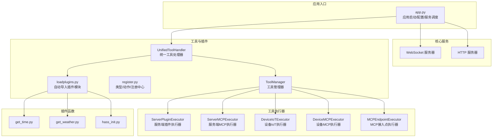
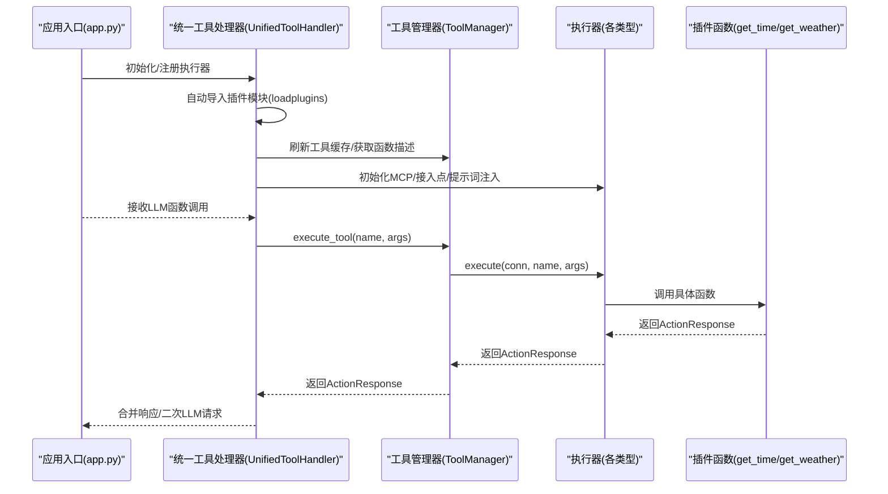
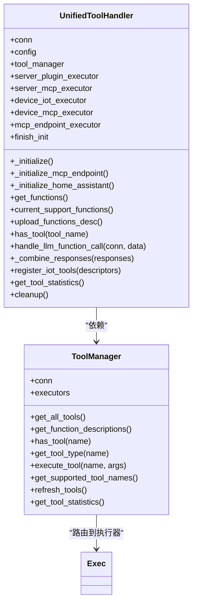
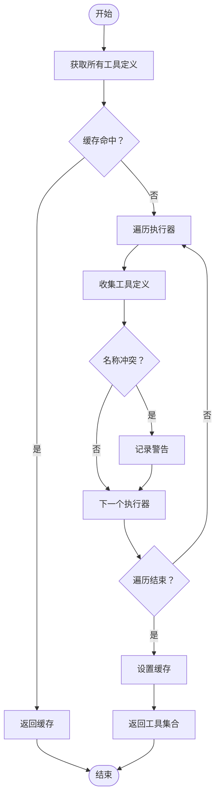
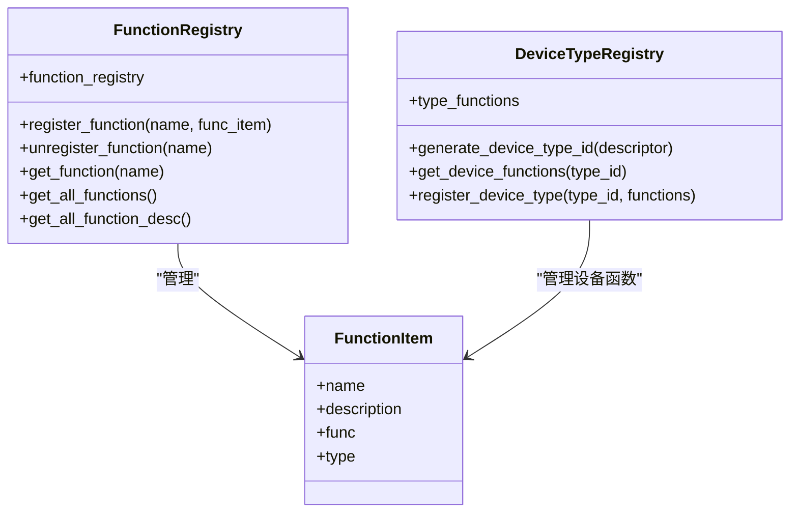
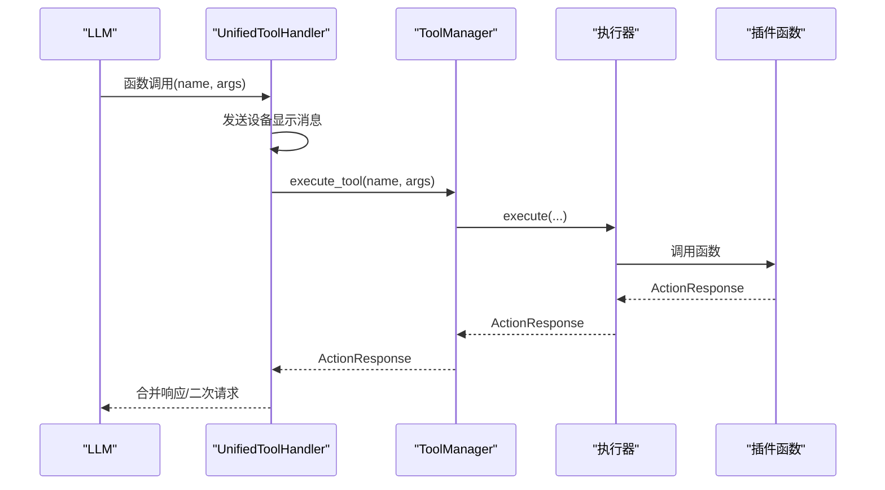
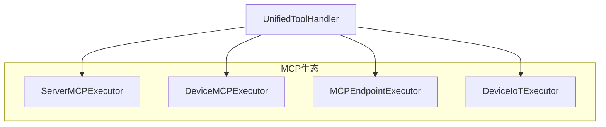

# 扩展开发与集成

<cite>
**本文引用的文件**
- [app.py](file://main/xiaozhi-server/app.py)
- [unified_tool_handler.py](file://main/xiaozhi-server/core/providers/tools/unified_tool_handler.py)
- [unified_tool_manager.py](file://main/xiaozhi-server/core/providers/tools/unified_tool_manager.py)
- [register.py](file://main/xiaozhi-server/plugins_func/register.py)
- [loadplugins.py](file://main/xiaozhi-server/plugins_func/loadplugins.py)
- [get_time.py](file://main/xiaozhi-server/plugins_func/functions/get_time.py)
- [get_weather.py](file://main/xiaozhi-server/plugins_func/functions/get_weather.py)
- [hass_init.py](file://main/xiaozhi-server/plugins_func/functions/hass_init.py)
- [device_iot/__init__.py](file://main/xiaozhi-server/core/providers/tools/device_iot/__init__.py)
- [device_mcp/__init__.py](file://main/xiaozhi-server/core/providers/tools/device_mcp/__init__.py)
- [server_plugins/__init__.py](file://main/xiaozhi-server/core/providers/tools/server_plugins/__init__.py)
- [mcp_endpoint/__init__.py](file://main/xiaozhi-server/core/providers/tools/mcp_endpoint/__init__.py)
- [server_mcp/__init__.py](file://main/xiaozhi-server/core/providers/tools/server_mcp/__init__.py)
</cite>

## 目录
1. [引言](#引言)
2. [项目结构](#项目结构)
3. [核心组件](#核心组件)
4. [架构总览](#架构总览)
5. [详细组件分析](#详细组件分析)
6. [依赖分析](#依赖分析)
7. [性能考虑](#性能考虑)
8. [故障排查指南](#故障排查指南)
9. [结论](#结论)
10. [附录](#附录)

## 引言
本文件面向小智ESP32服务器的扩展开发者与系统集成者，系统化阐述插件体系的架构设计、插件注册机制与动态加载流程；深入说明工具函数的扩展接口、执行器模式与类型系统；全面解析统一工具处理器的设计理念、工具管理与执行流程；并结合MCP协议扩展、设备控制集成与第三方服务对接给出实践指南。文档同时提供插件开发步骤、API接口规范、集成示例、配置参数与调试技巧，以及系统架构演进、向后兼容性与扩展性设计原则。

## 项目结构
小智ESP32服务器采用分层与功能域混合的组织方式：
- 应用入口与生命周期管理：位于应用根目录，负责配置加载、服务启动与优雅退出。
- 核心服务与协议：包括HTTP与WebSocket服务、消息处理与工具链。
- 插件与工具：以“插件函数+注册中心+工具管理器+执行器”的组合实现动态扩展。
- MCP协议与设备集成：提供服务端MCP、设备端MCP、MCP接入点与IoT设备工具集。

**图表来源**
- [app.py:46-131](file://main/xiaozhi-server/app.py#L46-L131)
- [unified_tool_handler.py:19-52](file://main/xiaozhi-server/core/providers/tools/unified_tool_handler.py#L19-L52)
- [unified_tool_manager.py:9-23](file://main/xiaozhi-server/core/providers/tools/unified_tool_manager.py#L9-L23)
- [register.py:9-43](file://main/xiaozhi-server/plugins_func/register.py#L9-L43)
- [loadplugins.py:9-25](file://main/xiaozhi-server/plugins_func/loadplugins.py#L9-L25)
- [get_time.py:33](file://main/xiaozhi-server/plugins_func/functions/get_time.py#L33)
- [get_weather.py:161](file://main/xiaozhi-server/plugins_func/functions/get_weather.py#L161)
- [hass_init.py:8](file://main/xiaozhi-server/plugins_func/functions/hass_init.py#L8)

**章节来源**
- [app.py:46-131](file://main/xiaozhi-server/app.py#L46-L131)

## 核心组件
本节聚焦插件系统的关键构件：类型与动作枚举、函数注册中心、工具管理器、统一工具处理器与动态加载机制。

- 类型与动作系统
  - 工具类型（ToolType）：涵盖无操作、等待、修改系统提示词、系统控制、IoT控制、MCP客户端等，用于指导工具执行后的行为与上下文变更。
  - 动作（Action）：定义工具执行后的动作语义，如错误、未找到、直接回复、再次请求LLM、记录但不请求LLM等。
  - 函数项（FunctionItem）与注册表（FunctionRegistry）：提供函数注册、注销、检索与描述导出能力。
  - 设备类型注册表（DeviceTypeRegistry）：基于设备能力描述生成类型ID并管理设备函数集合。

- 工具管理器（ToolManager）
  - 职责：集中管理不同执行器，聚合工具定义，提供工具查询、执行与统计。
  - 特性：带缓存的工具聚合与描述导出，避免重复扫描；按工具类型路由到对应执行器；异常保护与日志记录。

- 统一工具处理器（UnifiedToolHandler）
  - 职责：协调工具管理器与各类执行器，负责初始化（含插件模块自动导入、MCP接入点连接、Home Assistant提示词注入）、工具调用、多工具合并响应、清理资源。
  - 流程：接收LLM函数调用，解析参数，发送设备显示消息，调用工具管理器执行，合并响应，必要时触发二次LLM请求。

- 动态加载（auto_import_modules）
  - 职责：遍历指定包内模块并导入，配合装饰器注册函数，实现“即插即用”。

**章节来源**
- [register.py:9-43](file://main/xiaozhi-server/plugins_func/register.py#L9-L43)
- [register.py:45-142](file://main/xiaozhi-server/plugins_func/register.py#L45-L142)
- [unified_tool_manager.py:9-125](file://main/xiaozhi-server/core/providers/tools/unified_tool_manager.py#L9-L125)
- [unified_tool_handler.py:19-80](file://main/xiaozhi-server/core/providers/tools/unified_tool_handler.py#L19-L80)
- [loadplugins.py:9-25](file://main/xiaozhi-server/plugins_func/loadplugins.py#L9-L25)

## 架构总览
下图展示从应用启动到工具执行的端到端流程，强调插件函数、注册中心、工具管理器与执行器之间的协作关系。

**图表来源**
- [app.py:46-131](file://main/xiaozhi-server/app.py#L46-L131)
- [unified_tool_handler.py:57-80](file://main/xiaozhi-server/core/providers/tools/unified_tool_handler.py#L57-L80)
- [unified_tool_handler.py:139-183](file://main/xiaozhi-server/core/providers/tools/unified_tool_handler.py#L139-L183)
- [unified_tool_manager.py:73-102](file://main/xiaozhi-server/core/providers/tools/unified_tool_manager.py#L73-L102)
- [get_time.py:33](file://main/xiaozhi-server/plugins_func/functions/get_time.py#L33)
- [get_weather.py:161](file://main/xiaozhi-server/plugins_func/functions/get_weather.py#L161)

## 详细组件分析

### 组件A：统一工具处理器（UnifiedToolHandler）
- 设计要点
  - 单一职责：协调工具管理器与多种执行器，封装初始化、工具调用、响应合并与清理。
  - 执行器注册：在构造阶段将五类执行器（服务端插件、服务端MCP、设备IoT、设备MCP、MCP接入点）注册到工具管理器。
  - 动态初始化：自动导入插件模块；按配置初始化MCP接入点；按需注入Home Assistant提示词。
  - 工具调用：支持单次与多次函数调用；对参数进行JSON解析；发送设备显示消息；合并响应并决定是否二次请求LLM。
  - 资源清理：关闭MCP接入点连接，释放资源。

**图表来源**
- [unified_tool_handler.py:19-52](file://main/xiaozhi-server/core/providers/tools/unified_tool_handler.py#L19-L52)
- [unified_tool_handler.py:139-183](file://main/xiaozhi-server/core/providers/tools/unified_tool_handler.py#L139-L183)
- [unified_tool_manager.py:9-125](file://main/xiaozhi-server/core/providers/tools/unified_tool_manager.py#L9-L125)

**章节来源**
- [unified_tool_handler.py:19-243](file://main/xiaozhi-server/core/providers/tools/unified_tool_handler.py#L19-L243)

### 组件B：工具管理器（ToolManager）
- 设计要点
  - 执行器注册：以工具类型为键维护执行器映射，注册后失效缓存。
  - 工具聚合：遍历所有执行器，收集工具定义，处理名称冲突并记录警告。
  - 执行路由：根据工具名解析工具类型，选择对应执行器执行，异常捕获与日志记录。
  - 统计与刷新：提供工具数量统计与缓存刷新能力。

**图表来源**
- [unified_tool_manager.py:30-47](file://main/xiaozhi-server/core/providers/tools/unified_tool_manager.py#L30-L47)
- [unified_tool_manager.py:73-102](file://main/xiaozhi-server/core/providers/tools/unified_tool_manager.py#L73-L102)

**章节来源**
- [unified_tool_manager.py:9-125](file://main/xiaozhi-server/core/providers/tools/unified_tool_manager.py#L9-L125)

### 组件C：插件注册与动态加载
- 注册中心
  - 函数装饰器：通过装饰器将函数注册到全局注册表，便于后续统一管理与描述导出。
  - 设备函数装饰器：用于设备级别函数的标记与管理。
  - 注册表：提供注册、注销、检索与描述导出，支持直接注册与间接注册两种方式。
  - 设备类型注册表：通过设备能力描述生成类型ID，管理设备函数集合。

- 动态加载
  - 自动导入：遍历包内模块并导入，确保装饰器生效，实现“即插即用”。

**图表来源**
- [register.py:45-142](file://main/xiaozhi-server/plugins_func/register.py#L45-L142)
- [loadplugins.py:9-25](file://main/xiaozhi-server/plugins_func/loadplugins.py#L9-L25)

**章节来源**
- [register.py:9-142](file://main/xiaozhi-server/plugins_func/register.py#L9-L142)
- [loadplugins.py:9-25](file://main/xiaozhi-server/plugins_func/loadplugins.py#L9-L25)

### 组件D：工具函数示例与类型系统
- 示例函数：get_time、get_weather
  - get_time：使用“等待”类型，返回ActionResponse，支持缓存与二次LLM请求。
  - get_weather：使用“系统控制”类型，具备conn参数，结合配置与缓存获取天气并返回ActionResponse。
- 类型系统：通过ToolType与Action枚举约束工具行为，保证执行器与调用方的一致预期。

**图表来源**
- [get_time.py:33](file://main/xiaozhi-server/plugins_func/functions/get_time.py#L33)
- [get_weather.py:161](file://main/xiaozhi-server/plugins_func/functions/get_weather.py#L161)
- [unified_tool_handler.py:139-183](file://main/xiaozhi-server/core/providers/tools/unified_tool_handler.py#L139-L183)
- [unified_tool_manager.py:73-102](file://main/xiaozhi-server/core/providers/tools/unified_tool_manager.py#L73-L102)

**章节来源**
- [get_time.py:33-128](file://main/xiaozhi-server/plugins_func/functions/get_time.py#L33-L128)
- [get_weather.py:161-229](file://main/xiaozhi-server/plugins_func/functions/get_weather.py#L161-L229)
- [register.py:9-43](file://main/xiaozhi-server/plugins_func/register.py#L9-L43)

### 组件E：MCP协议扩展与设备控制集成
- 服务端MCP：提供服务端MCP管理器与客户端，支持工具发现与调用。
- 设备端MCP：提供MCP客户端、消息发送与处理、工具调用等能力。
- MCP接入点：支持连接外部MCP服务，动态建立工具通道。
- 设备IoT：提供IoT设备描述符、状态处理与工具注册能力。
- Home Assistant集成：在函数调用场景下注入设备列表到系统提示词，便于LLM决策。

**图表来源**
- [unified_tool_handler.py:30-52](file://main/xiaozhi-server/core/providers/tools/unified_tool_handler.py#L30-L52)
- [server_mcp/__init__.py:1](file://main/xiaozhi-server/core/providers/tools/server_mcp/__init__.py#L1-L8)
- [device_mcp/__init__.py:1](file://main/xiaozhi-server/core/providers/tools/device_mcp/__init__.py#L1-L22)
- [mcp_endpoint/__init__.py:1](file://main/xiaozhi-server/core/providers/tools/mcp_endpoint/__init__.py#L1-L22)
- [device_iot/__init__.py:1](file://main/xiaozhi-server/core/providers/tools/device_iot/__init__.py#L1-L13)

**章节来源**
- [unified_tool_handler.py:57-118](file://main/xiaozhi-server/core/providers/tools/unified_tool_handler.py#L57-L118)
- [hass_init.py:8-55](file://main/xiaozhi-server/plugins_func/functions/hass_init.py#L8-L55)

## 依赖分析
- 模块耦合
  - UnifiedToolHandler依赖ToolManager与各类执行器，形成“协调者”角色。
  - ToolManager依赖执行器接口，通过类型路由实现解耦。
  - 插件函数通过装饰器注册到全局注册表，由动态加载机制导入。
- 外部依赖
  - MCP接入点与设备端MCP依赖网络连接与消息协议。
  - 第三方服务（如天气API）依赖网络与配置项。

**图表来源**
- [loadplugins.py:9-25](file://main/xiaozhi-server/plugins_func/loadplugins.py#L9-L25)
- [register.py:83-91](file://main/xiaozhi-server/plugins_func/register.py#L83-L91)
- [unified_tool_handler.py:19-52](file://main/xiaozhi-server/core/providers/tools/unified_tool_handler.py#L19-L52)
- [unified_tool_manager.py:9-23](file://main/xiaozhi-server/core/providers/tools/unified_tool_manager.py#L9-L23)

**章节来源**
- [loadplugins.py:9-25](file://main/xiaozhi-server/plugins_func/loadplugins.py#L9-L25)
- [register.py:83-142](file://main/xiaozhi-server/plugins_func/register.py#L83-L142)
- [unified_tool_handler.py:19-52](file://main/xiaozhi-server/core/providers/tools/unified_tool_handler.py#L19-L52)
- [unified_tool_manager.py:9-23](file://main/xiaozhi-server/core/providers/tools/unified_tool_manager.py#L9-L23)

## 性能考虑
- 缓存策略
  - 工具定义与函数描述采用惰性缓存，首次聚合后复用，降低重复扫描开销。
  - 插件函数内部使用缓存管理器缓存热点数据（如农历、天气），减少重复计算与网络请求。
- 异步与并发
  - 工具执行与MCP接入点连接均采用异步模式，提升吞吐与响应性。
- 日志与可观测性
  - 关键路径均有日志输出，便于定位性能瓶颈与异常。

[本节为通用建议，无需特定文件引用]

## 故障排查指南
- 插件未生效
  - 确认插件函数已通过装饰器注册且位于自动导入包内。
  - 检查动态加载是否成功导入模块。
- 工具未找到
  - 使用工具管理器的工具名称查询与统计接口核对当前可用工具。
- MCP连接失败
  - 校验MCP接入点URL格式与可达性；查看初始化日志与异常堆栈。
- Home Assistant提示词未注入
  - 确认配置中存在设备列表；检查函数调用场景与提示词更新逻辑。
- 参数解析错误
  - 当参数为字符串时，统一工具处理器会尝试JSON解析；若失败，返回错误响应。

**章节来源**
- [unified_tool_handler.py:139-183](file://main/xiaozhi-server/core/providers/tools/unified_tool_handler.py#L139-L183)
- [unified_tool_manager.py:62-102](file://main/xiaozhi-server/core/providers/tools/unified_tool_manager.py#L62-L102)
- [hass_init.py:8-28](file://main/xiaozhi-server/plugins_func/functions/hass_init.py#L8-L28)

## 结论
小智ESP32服务器通过“类型与动作枚举 + 函数注册中心 + 工具管理器 + 统一工具处理器 + 动态加载”的架构，实现了插件系统的高内聚、低耦合与强扩展性。MCP协议与设备控制的深度集成进一步增强了系统对外部服务与硬件设备的适配能力。遵循本文档的开发规范与最佳实践，可快速构建稳定、可维护的工具扩展与系统集成方案。

[本节为总结性内容，无需特定文件引用]

## 附录

### 插件开发指南
- 开发步骤
  - 在插件函数目录编写函数，使用装饰器进行注册，明确工具类型与动作。
  - 将函数置于自动导入包内，确保动态加载生效。
  - 如涉及第三方服务，合理使用缓存与错误处理，保证稳定性。
- API接口规范
  - 函数签名：支持字符串参数的JSON解析；必要时携带连接对象以访问配置与上下文。
  - 返回值：统一返回动作响应对象，明确动作类型与结果。
- 集成示例
  - 时间查询：参考时间函数示例，了解等待类型与缓存策略。
  - 天气查询：参考天气函数示例，了解系统控制类型与配置读取。
- 配置参数
  - 插件配置：在配置中提供API密钥、默认位置等参数。
  - MCP接入点：在配置中提供接入点URL，系统将自动转换并连接。
- 调试技巧
  - 启用详细日志，关注工具注册、执行与响应合并过程。
  - 使用工具统计接口与函数描述导出来核对当前可用工具。

**章节来源**
- [get_time.py:33-128](file://main/xiaozhi-server/plugins_func/functions/get_time.py#L33-L128)
- [get_weather.py:161-229](file://main/xiaozhi-server/plugins_func/functions/get_weather.py#L161-L229)
- [register.py:83-142](file://main/xiaozhi-server/plugins_func/register.py#L83-L142)
- [unified_tool_handler.py:81-108](file://main/xiaozhi-server/core/providers/tools/unified_tool_handler.py#L81-L108)