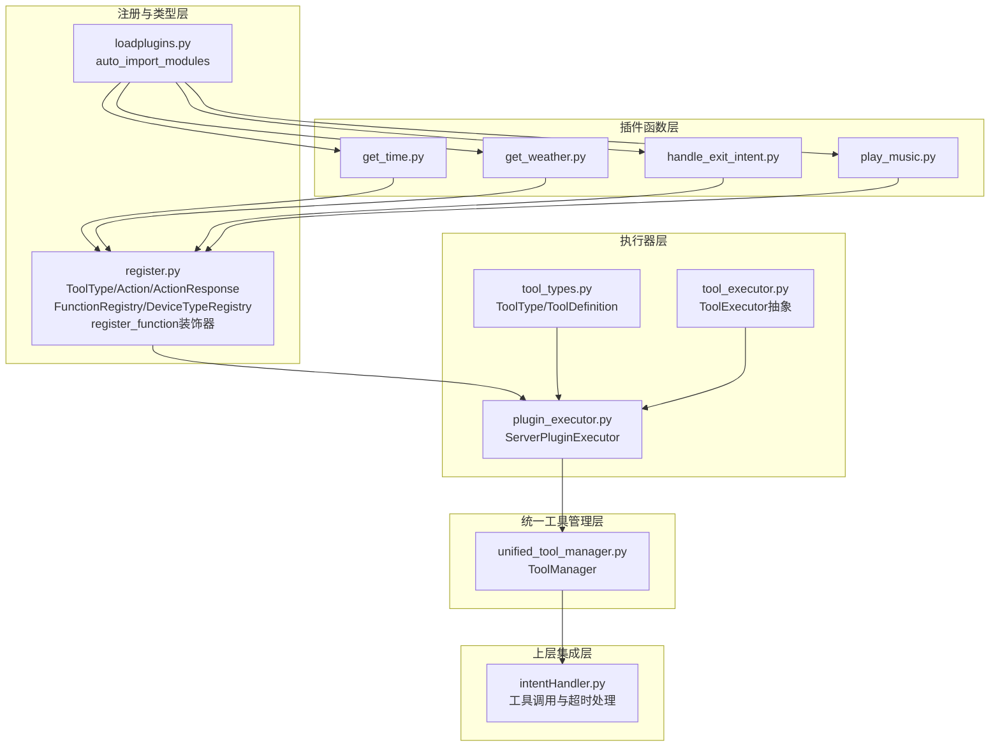
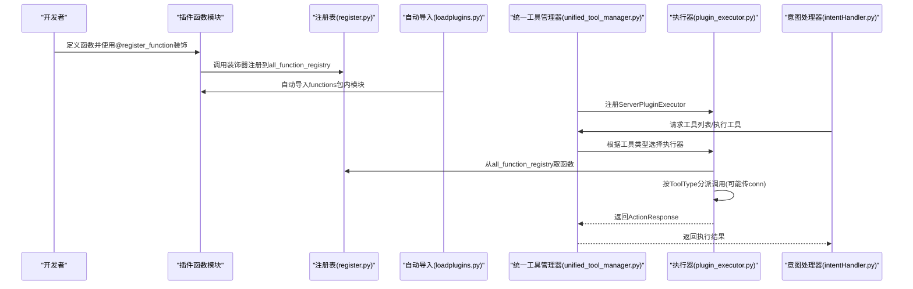
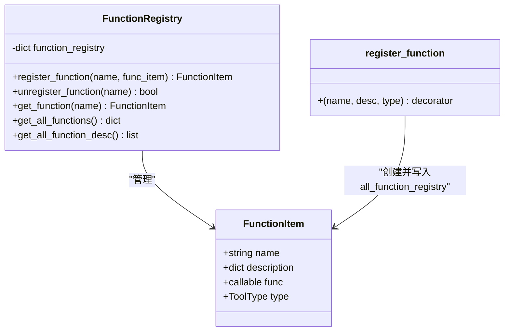
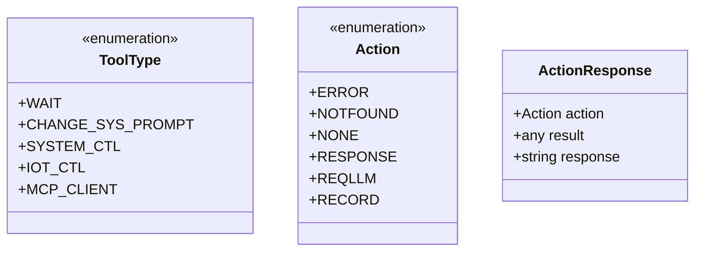
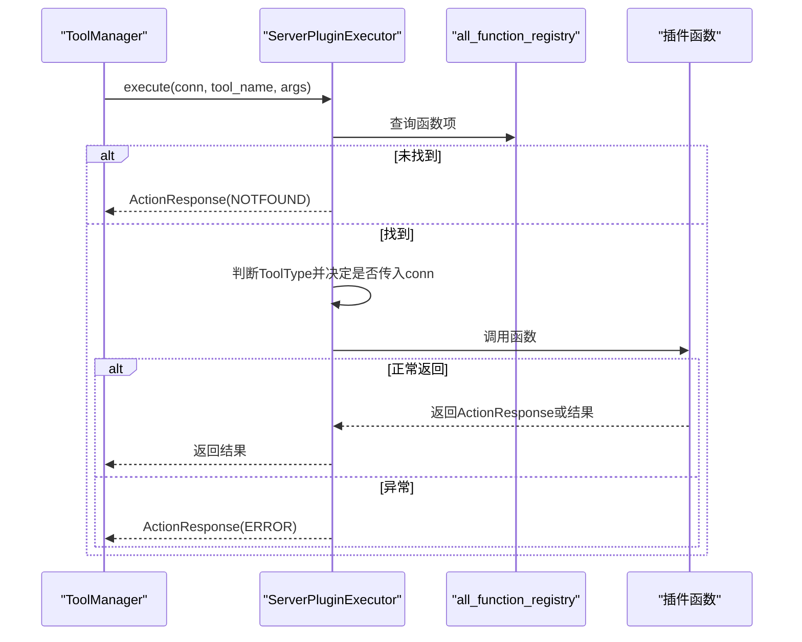
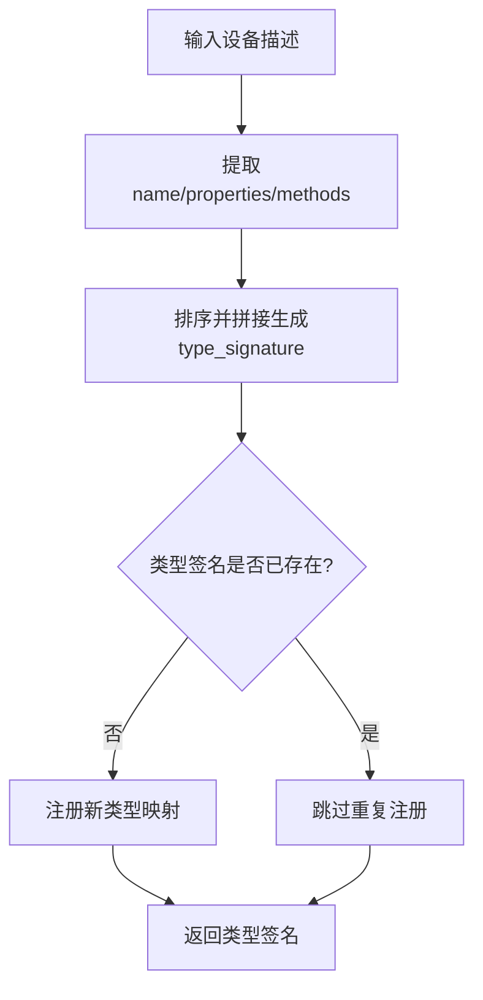
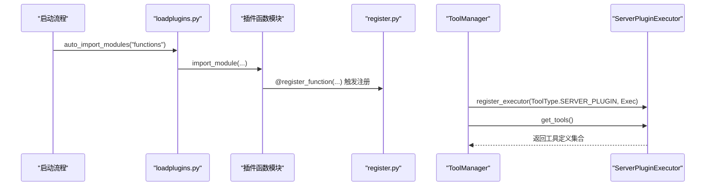

# 插件系统架构

<cite>
**本文引用的文件**
- [register.py](file://main/xiaozhi-server/plugins_func/register.py)
- [loadplugins.py](file://main/xiaozhi-server/plugins_func/loadplugins.py)
- [plugin_executor.py](file://main/xiaozhi-server/core/providers/tools/server_plugins/plugin_executor.py)
- [tool_executor.py](file://main/xiaozhi-server/core/providers/tools/base/tool_executor.py)
- [tool_types.py](file://main/xiaozhi-server/core/providers/tools/base/tool_types.py)
- [unified_tool_manager.py](file://main/xiaozhi-server/core/providers/tools/unified_tool_manager.py)
- [intentHandler.py](file://main/xiaozhi-server/core/handle/intentHandler.py)
- [get_time.py](file://main/xiaozhi-server/plugins_func/functions/get_time.py)
- [get_weather.py](file://main/xiaozhi-server/plugins_func/functions/get_weather.py)
- [handle_exit_intent.py](file://main/xiaozhi-server/plugins_func/functions/handle_exit_intent.py)
- [play_music.py](file://main/xiaozhi-server/plugins_func/functions/play_music.py)
</cite>

## 目录
1. [引言](#引言)
2. [项目结构](#项目结构)
3. [核心组件](#核心组件)
4. [架构总览](#架构总览)
5. [详细组件分析](#详细组件分析)
6. [依赖关系分析](#依赖关系分析)
7. [性能考量](#性能考量)
8. [故障排查指南](#故障排查指南)
9. [结论](#结论)
10. [附录](#附录)

## 引言
本文件面向小智ESP32服务器的插件系统，系统化阐述插件注册机制、函数注册表设计、动态加载流程与生命周期管理；深入解析FunctionRegistry类、装饰器模式应用、插件类型系统（ToolType枚举）、动作类型（Action枚举）与响应机制（ActionResponse类），以及设备类型注册表（DeviceTypeRegistry）的设计理念与设备函数管理。同时提供插件开发最佳实践、性能优化建议与调试技巧，并给出完整的插件开发示例与配置参数说明。

## 项目结构
插件系统主要由以下层次构成：
- 插件函数层：位于 plugins_func/functions，每个Python模块定义一个或多个插件函数，使用装饰器进行注册。
- 注册与类型层：位于 plugins_func/register.py，定义工具类型、动作类型、响应模型、函数注册表与设备类型注册表。
- 执行器层：位于 core/providers/tools/server_plugins/plugin_executor.py，实现服务端插件工具执行器，负责按工具类型分派调用。
- 基础抽象层：位于 core/providers/tools/base，定义工具类型、工具定义与工具执行器抽象接口。
- 统一工具管理层：位于 core/providers/tools/unified_tool_manager.py，聚合各执行器，提供统一的工具发现与执行入口。
- 上层集成层：位于 core/handle/intentHandler.py，负责将LLM函数调用与工具执行衔接，处理超时与上报。

图表来源
- [register.py:9-142](file://main/xiaozhi-server/plugins_func/register.py#L9-L142)
- [loadplugins.py:1-25](file://main/xiaozhi-server/plugins_func/loadplugins.py#L1-L25)
- [plugin_executor.py:1-101](file://main/xiaozhi-server/core/providers/tools/server_plugins/plugin_executor.py#L1-L101)
- [tool_executor.py:1-27](file://main/xiaozhi-server/core/providers/tools/base/tool_executor.py#L1-L27)
- [tool_types.py](file://main/xiaozhi-server/core/providers/tools/base/tool_types.py)
- [unified_tool_manager.py](file://main/xiaozhi-server/core/providers/tools/unified_tool_manager.py)
- [intentHandler.py:153-178](file://main/xiaozhi-server/core/handle/intentHandler.py#L153-L178)

章节来源
- [register.py:1-142](file://main/xiaozhi-server/plugins_func/register.py#L1-L142)
- [loadplugins.py:1-25](file://main/xiaozhi-server/plugins_func/loadplugins.py#L1-L25)
- [plugin_executor.py:1-101](file://main/xiaozhi-server/core/providers/tools/server_plugins/plugin_executor.py#L1-L101)
- [tool_executor.py:1-27](file://main/xiaozhi-server/core/providers/tools/base/tool_executor.py#L1-L27)
- [tool_types.py](file://main/xiaozhi-server/core/providers/tools/base/tool_types.py)
- [unified_tool_manager.py](file://main/xiaozhi-server/core/providers/tools/unified_tool_manager.py)
- [intentHandler.py:153-178](file://main/xiaozhi-server/core/handle/intentHandler.py#L153-L178)

## 核心组件
- 函数注册表与装饰器
  - register_function装饰器：将插件函数注册到全局注册表，便于后续发现与执行。
  - all_function_registry：全局字典，键为函数名，值为FunctionItem对象。
- 类型系统
  - ToolType：工具类型枚举，区分WAIT、CHANGE_SYS_PROMPT、SYSTEM_CTL、IOT_CTL、MCP_CLIENT等。
  - Action：动作类型枚举，定义函数调用后的处理策略（ERROR、NOTFOUND、NONE、RESPONSE、REQLLM、RECORD）。
  - ActionResponse：封装动作类型、结果与直接回复内容。
- 执行器与工具定义
  - ToolExecutor抽象类：定义execute与get_tools接口。
  - ToolDefinition：工具定义，包含名称、描述与工具类型。
  - ServerPluginExecutor：服务端插件执行器，基于ToolType分派调用，支持conn参数注入。
- 设备类型注册表
  - DeviceTypeRegistry：按设备能力描述生成类型签名，管理设备类型与其函数集合。
- 统一工具管理
  - ToolManager：聚合各执行器，提供统一工具发现与执行入口，处理超时与错误。

章节来源
- [register.py:9-142](file://main/xiaozhi-server/plugins_func/register.py#L9-L142)
- [tool_executor.py:1-27](file://main/xiaozhi-server/core/providers/tools/base/tool_executor.py#L1-L27)
- [tool_types.py](file://main/xiaozhi-server/core/providers/tools/base/tool_types.py)
- [plugin_executor.py:1-101](file://main/xiaozhi-server/core/providers/tools/server_plugins/plugin_executor.py#L1-L101)
- [unified_tool_manager.py](file://main/xiaozhi-server/core/providers/tools/unified_tool_manager.py)

## 架构总览
插件系统采用“装饰器注册 + 动态导入 + 执行器分发”的架构。插件函数在定义时通过装饰器注册到全局注册表；启动时通过自动导入包内模块触发装饰器执行；工具调用由统一管理器选择对应执行器，执行器依据工具类型决定是否传入连接上下文参数，并返回标准化的动作响应。

图表来源
- [register.py:83-91](file://main/xiaozhi-server/plugins_func/register.py#L83-L91)
- [loadplugins.py:9-25](file://main/xiaozhi-server/plugins_func/loadplugins.py#L9-L25)
- [unified_tool_manager.py:73-107](file://main/xiaozhi-server/core/providers/tools/unified_tool_manager.py#L73-L107)
- [plugin_executor.py:18-51](file://main/xiaozhi-server/core/providers/tools/server_plugins/plugin_executor.py#L18-L51)
- [intentHandler.py:153-178](file://main/xiaozhi-server/core/handle/intentHandler.py#L153-L178)

## 详细组件分析

### 函数注册表与装饰器模式
- 装饰器register_function
  - 接收函数名、描述与类型，将FunctionItem写入all_function_registry。
  - 通过日志记录加载状态，便于调试。
- FunctionItem
  - 字段包括name、description、func、type，作为注册表项的核心数据结构。
- FunctionRegistry
  - 提供注册、注销、查询与批量描述导出功能，支持从all_function_registry同步到实例注册表。
  - 日志输出便于追踪注册/注销状态。

图表来源
- [register.py:45-142](file://main/xiaozhi-server/plugins_func/register.py#L45-L142)

章节来源
- [register.py:45-142](file://main/xiaozhi-server/plugins_func/register.py#L45-L142)

### 工具类型系统与动作响应
- ToolType
  - WAIT：等待函数返回，适合纯计算/查询。
  - CHANGE_SYS_PROMPT：修改系统提示词，切换角色性格或职责。
  - SYSTEM_CTL：系统控制，影响对话流程（如退出、播放音乐），通常需要conn参数。
  - IOT_CTL：IoT设备控制，需要conn参数。
  - MCP_CLIENT：MCP客户端。
- Action
  - ERROR/NONE/NOTFOUND：错误、无动作、未找到。
  - RESPONSE：直接回复。
  - REQLLM：调用函数后再请求LLM生成回复。
  - RECORD：记录工具调用到对话历史，不调用LLM。
- ActionResponse
  - 封装action、result、response三要素，统一上层处理。

图表来源
- [register.py:9-43](file://main/xiaozhi-server/plugins_func/register.py#L9-L43)

章节来源
- [register.py:9-43](file://main/xiaozhi-server/plugins_func/register.py#L9-L43)

### 服务端插件执行器
- ServerPluginExecutor
  - execute：从全局注册表取函数，按ToolType分派调用；SYSTEM_CTL/IOT_CTL类型强制传入conn；异常捕获并返回ActionResponse(ERROR)。
  - get_tools：从配置与必要函数中合并所需工具，读取插件配置中的描述覆盖，构造ToolDefinition并返回。
  - has_tool：快速判断工具是否存在。

图表来源
- [plugin_executor.py:18-51](file://main/xiaozhi-server/core/providers/tools/server_plugins/plugin_executor.py#L18-L51)

章节来源
- [plugin_executor.py:1-101](file://main/xiaozhi-server/core/providers/tools/server_plugins/plugin_executor.py#L1-L101)

### 设备类型注册表与设备函数管理
- DeviceTypeRegistry
  - generate_device_type_id：通过设备能力描述（名称、属性、方法）生成类型签名，确保唯一性。
  - get_device_functions：按类型签名获取设备函数集合。
  - register_device_type：注册设备类型与其函数映射，避免重复注册。

图表来源
- [register.py:59-77](file://main/xiaozhi-server/plugins_func/register.py#L59-L77)

章节来源
- [register.py:53-77](file://main/xiaozhi-server/plugins_func/register.py#L53-L77)

### 统一工具管理与生命周期
- ToolManager
  - register_executor：注册不同类型的执行器（如ServerPluginExecutor）。
  - get_all_tools：聚合各执行器的工具定义，形成全局可用工具集。
  - execute_tool：根据工具名定位工具类型与执行器，执行并返回标准化结果；处理未找到与执行器缺失场景；捕获异常并返回ERROR。
- 生命周期
  - 发现阶段：自动导入模块触发装饰器注册。
  - 注册阶段：装饰器写入all_function_registry。
  - 使用阶段：ToolManager聚合执行器，统一暴露工具列表与执行入口。
  - 执行阶段：ServerPluginExecutor按类型分派调用，返回ActionResponse。

图表来源
- [loadplugins.py:9-25](file://main/xiaozhi-server/plugins_func/loadplugins.py#L9-L25)
- [register.py:83-91](file://main/xiaozhi-server/plugins_func/register.py#L83-L91)
- [unified_tool_manager.py:184-194](file://main/xiaozhi-server/core/providers/tools/unified_tool_manager.py#L184-L194)
- [plugin_executor.py:52-96](file://main/xiaozhi-server/core/providers/tools/server_plugins/plugin_executor.py#L52-L96)

章节来源
- [unified_tool_manager.py:73-107](file://main/xiaozhi-server/core/providers/tools/unified_tool_manager.py#L73-L107)
- [plugin_executor.py:52-96](file://main/xiaozhi-server/core/providers/tools/server_plugins/plugin_executor.py#L52-L96)

## 依赖关系分析
- 插件函数对注册表的依赖
  - 所有插件函数通过装饰器依赖register.py中的装饰器与全局注册表。
- 执行器对注册表与类型系统的依赖
  - ServerPluginExecutor依赖ToolType与ActionResponse，从all_function_registry取函数项并按类型分派。
- 统一管理器对执行器的依赖
  - ToolManager聚合各执行器，按工具类型路由至对应执行器。
- 上层集成对统一管理器的依赖
  - 意图处理器通过ToolManager执行工具调用，并处理超时与上报。

图表来源
- [register.py:83-91](file://main/xiaozhi-server/plugins_func/register.py#L83-L91)
- [plugin_executor.py:18-51](file://main/xiaozhi-server/core/providers/tools/server_plugins/plugin_executor.py#L18-L51)
- [unified_tool_manager.py:73-107](file://main/xiaozhi-server/core/providers/tools/unified_tool_manager.py#L73-L107)
- [intentHandler.py:153-178](file://main/xiaozhi-server/core/handle/intentHandler.py#L153-L178)

章节来源
- [register.py:83-91](file://main/xiaozhi-server/plugins_func/register.py#L83-L91)
- [plugin_executor.py:18-51](file://main/xiaozhi-server/core/providers/tools/server_plugins/plugin_executor.py#L18-L51)
- [unified_tool_manager.py:73-107](file://main/xiaozhi-server/core/providers/tools/unified_tool_manager.py#L73-L107)
- [intentHandler.py:153-178](file://main/xiaozhi-server/core/handle/intentHandler.py#L153-L178)

## 性能考量
- 动态导入与注册
  - 使用自动导入遍历包内模块，建议在启动阶段集中执行，避免频繁扫描。
- 工具调用超时
  - ToolManager在执行工具时捕获异常并返回ERROR；意图处理器设置超时阈值，防止阻塞主线程。
- 缓存利用
  - 插件函数内部广泛使用缓存（如农历、天气、IP信息），显著降低外部API调用频率。
- 异步执行
  - 对需要长时间运行的任务（如播放音乐）采用异步任务队列，避免阻塞事件循环。

[本节为通用性能建议，无需特定文件引用]

## 故障排查指南
- 工具未找到
  - 检查插件函数是否正确使用装饰器注册，确认函数名一致。
  - 确认自动导入是否包含目标模块。
- 执行器未注册
  - 确认ToolManager是否已注册对应工具类型的执行器。
- 调用超时
  - 意图处理器设置超时阈值，若超过阈值返回超时错误；适当增大超时或优化插件实现。
- 异常处理
  - 执行器捕获异常并返回ActionResponse(ERROR)，结合日志定位问题。

章节来源
- [plugin_executor.py:46-50](file://main/xiaozhi-server/core/providers/tools/server_plugins/plugin_executor.py#L46-L50)
- [unified_tool_manager.py:100-102](file://main/xiaozhi-server/core/providers/tools/unified_tool_manager.py#L100-L102)
- [intentHandler.py:160-174](file://main/xiaozhi-server/core/handle/intentHandler.py#L160-L174)

## 结论
小智ESP32服务器的插件系统通过装饰器注册、动态导入与统一执行器分发，实现了高扩展、低耦合的工具体系。类型系统与动作响应保证了工具行为的一致性与可控性；设备类型注册表为IoT设备能力抽象提供了清晰路径。配合缓存与异步执行，系统在易用性与性能之间取得良好平衡。

[本节为总结性内容，无需特定文件引用]

## 附录

### 插件开发最佳实践
- 使用装饰器注册
  - 在插件函数模块顶部使用@register_function装饰器，提供清晰的函数描述与类型。
- 描述覆盖
  - 在插件配置中提供description字段，执行器会将其覆盖到工具定义中，提升用户体验。
- 参数校验与缓存
  - 在插件函数内部进行参数校验与缓存利用，减少外部依赖与网络开销。
- 异步任务
  - 对耗时任务使用异步任务队列，避免阻塞事件循环。

章节来源
- [register.py:83-91](file://main/xiaozhi-server/plugins_func/register.py#L83-L91)
- [plugin_executor.py:78-94](file://main/xiaozhi-server/core/providers/tools/server_plugins/plugin_executor.py#L78-L94)

### 插件开发示例与配置参数
- 示例：获取天气
  - 函数：get_weather
  - 类型：SYSTEM_CTL（需要conn参数）
  - 配置参数：
    - api_host：天气API主机
    - api_key：API密钥
    - default_location：默认城市
  - 行为：根据用户位置或IP解析城市，抓取天气并缓存，返回ActionResponse(REQLLM)。

章节来源
- [get_weather.py:161-229](file://main/xiaozhi-server/plugins_func/functions/get_weather.py#L161-L229)

- 示例：退出意图
  - 函数：handle_exit_intent
  - 类型：SYSTEM_CTL（需要conn参数）
  - 行为：设置连接关闭标志，返回ActionResponse(RESPONSE)。

章节来源
- [handle_exit_intent.py:30-49](file://main/xiaozhi-server/plugins_func/functions/handle_exit_intent.py#L30-L49)

- 示例：播放音乐
  - 函数：play_music
  - 类型：SYSTEM_CTL（需要conn参数）
  - 配置参数：
    - music_dir：音乐目录
    - music_ext：音乐扩展名列表
    - refresh_time：音乐列表刷新周期
  - 行为：异步提交播放任务，返回ActionResponse(RECORD)。

章节来源
- [play_music.py:40-77](file://main/xiaozhi-server/plugins_func/functions/play_music.py#L40-L77)

- 示例：获取农历
  - 函数：get_lunar
  - 类型：WAIT
  - 行为：根据日期查询农历与黄历信息，缓存后返回ActionResponse(REQLLM)。

章节来源
- [get_time.py:33-128](file://main/xiaozhi-server/plugins_func/functions/get_time.py#L33-L128)

### 配置参数说明
- 插件配置键
  - plugins.get_weather.api_host：天气API主机
  - plugins.get_weather.api_key：天气API密钥
  - plugins.get_weather.default_location：默认城市
  - plugins.play_music.music_dir：音乐目录
  - plugins.play_music.music_ext：音乐扩展名
  - plugins.play_music.refresh_time：音乐列表刷新周期
- 工具描述覆盖
  - 在配置中提供description字段，执行器会覆盖工具定义中的描述。

章节来源
- [get_weather.py:161-169](file://main/xiaozhi-server/plugins_func/functions/get_weather.py#L161-L169)
- [play_music.py:122-146](file://main/xiaozhi-server/plugins_func/functions/play_music.py#L122-L146)
- [plugin_executor.py:78-94](file://main/xiaozhi-server/core/providers/tools/server_plugins/plugin_executor.py#L78-L94)