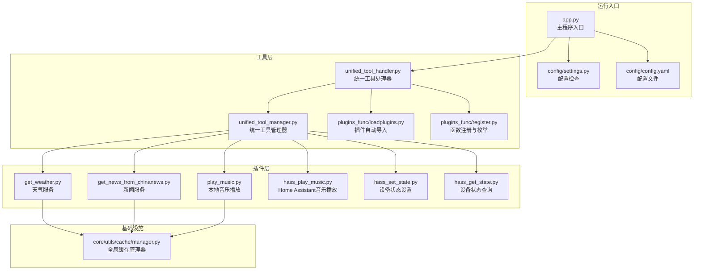
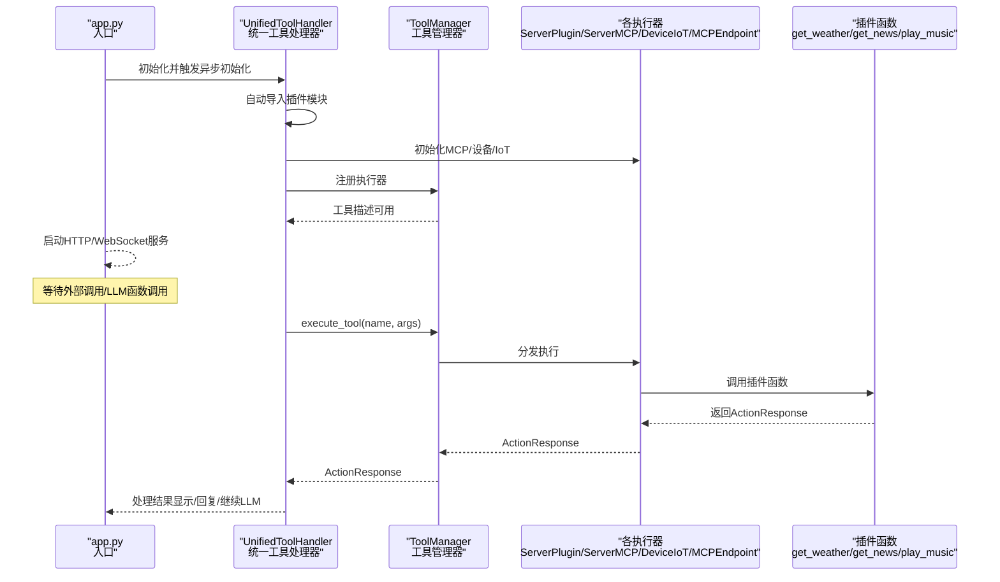
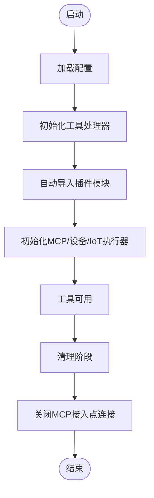
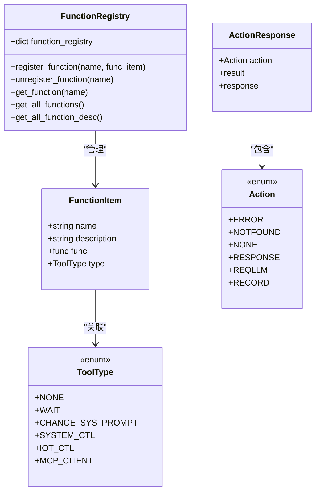
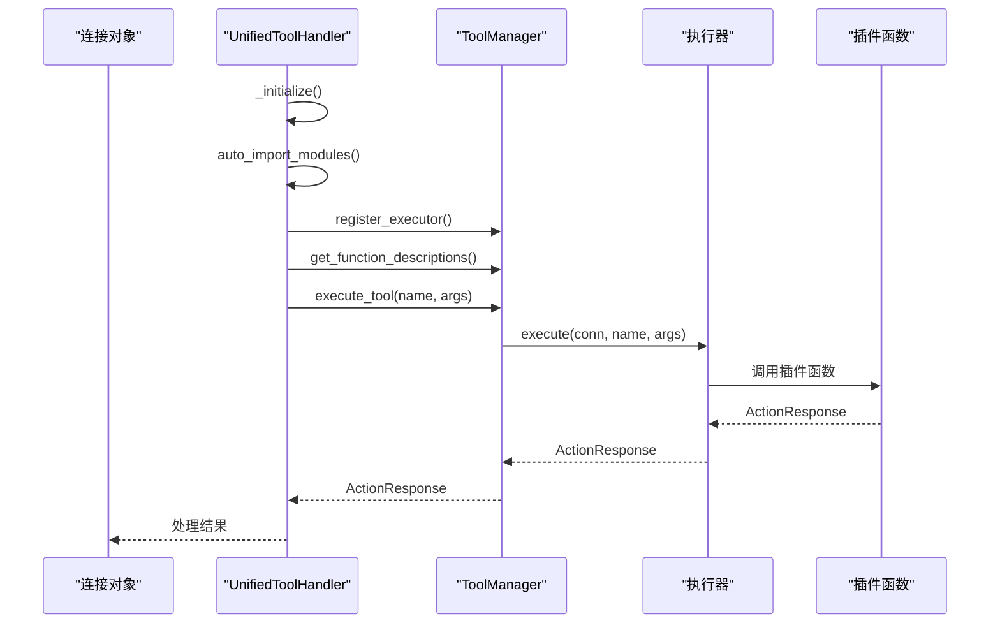
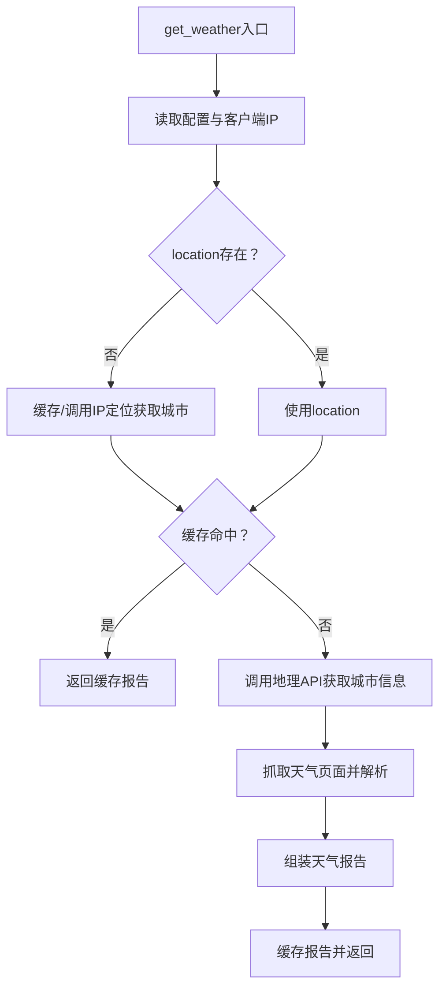
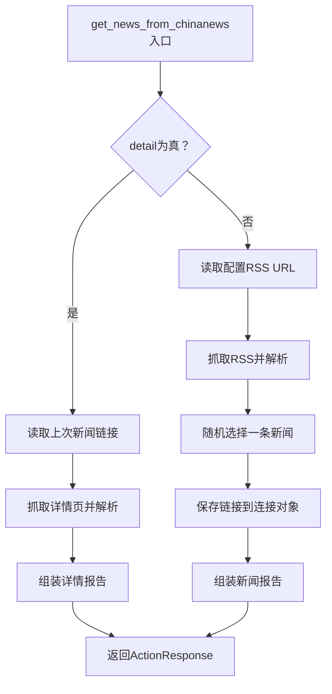
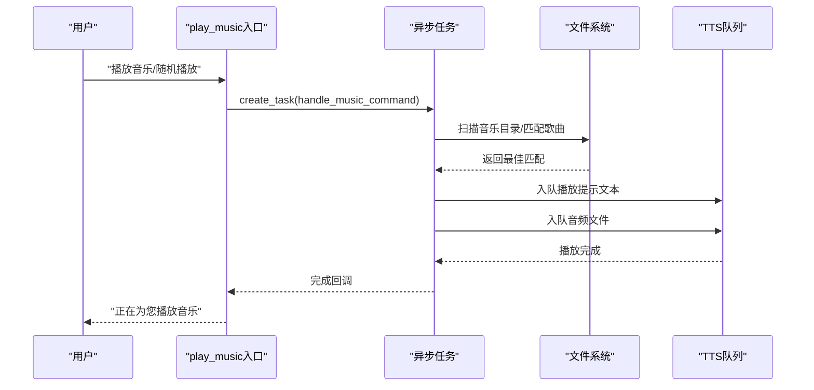
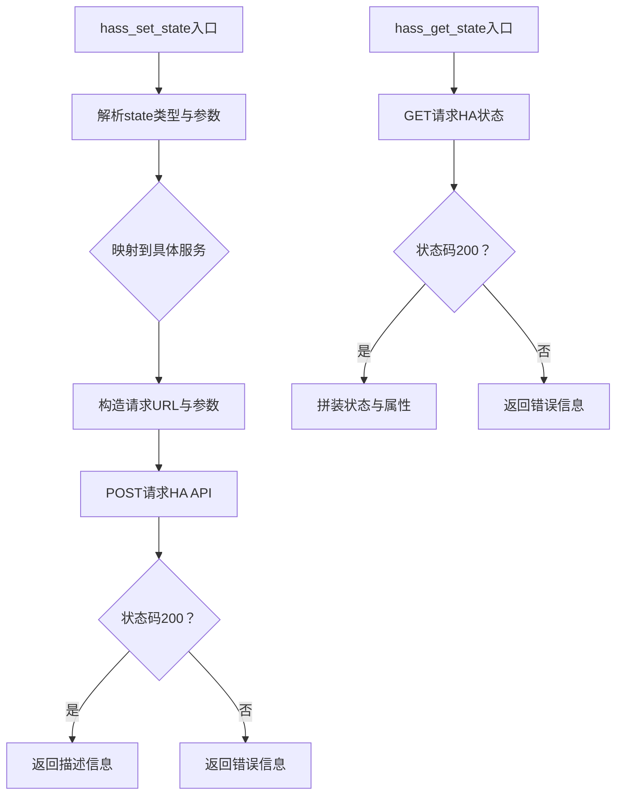
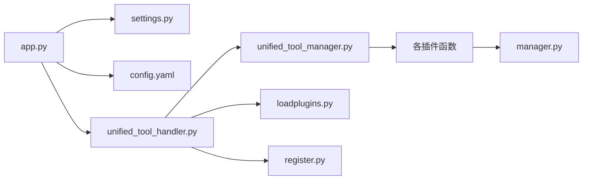

# 第三方服务集成

<cite>
**本文引用的文件**
- [app.py](file://main/xiaozhi-server/app.py)
- [settings.py](file://main/xiaozhi-server/config/settings.py)
- [config.yaml](file://main/xiaozhi-server/config.yaml)
- [loadplugins.py](file://main/xiaozhi-server/plugins_func/loadplugins.py)
- [register.py](file://main/xiaozhi-server/plugins_func/register.py)
- [unified_tool_handler.py](file://main/xiaozhi-server/core/providers/tools/unified_tool_handler.py)
- [unified_tool_manager.py](file://main/xiaozhi-server/core/providers/tools/unified_tool_manager.py)
- [get_weather.py](file://main/xiaozhi-server/plugins_func/functions/get_weather.py)
- [get_news_from_chinanews.py](file://main/xiaozhi-server/plugins_func/functions/get_news_from_chinanews.py)
- [play_music.py](file://main/xiaozhi-server/plugins_func/functions/play_music.py)
- [hass_play_music.py](file://main/xiaozhi-server/plugins_func/functions/hass_play_music.py)
- [hass_set_state.py](file://main/xiaozhi-server/plugins_func/functions/hass_set_state.py)
- [hass_get_state.py](file://main/xiaozhi-server/plugins_func/functions/hass_get_state.py)
- [manager.py](file://main/xiaozhi-server/core/utils/cache/manager.py)
</cite>

## 目录
1. [简介](#简介)
2. [项目结构](#项目结构)
3. [核心组件](#核心组件)
4. [架构总览](#架构总览)
5. [详细组件分析](#详细组件分析)
6. [依赖分析](#依赖分析)
7. [性能考量](#性能考量)
8. [故障排查指南](#故障排查指南)
9. [结论](#结论)
10. [附录](#附录)

## 简介
本文件面向小智ESP32服务器的第三方服务集成，系统性阐述服务器插件执行器的设计原理、插件加载机制与生命周期管理，详解第三方服务接入方式、API封装与数据转换，覆盖天气服务、新闻资讯、音乐播放等典型服务的集成实现。文档同时给出异步处理、错误重试与超时控制策略，提供第三方服务开发指南、接口规范与安全考虑，并包含服务集成示例、配置参数与性能优化建议，以及服务监控、日志记录与故障恢复机制。

## 项目结构
小智ESP32服务器采用模块化设计，核心运行入口负责初始化配置、启动服务与监控退出信号；工具层通过统一处理器与管理器实现插件的发现、注册与执行；插件层提供具体第三方服务的实现；缓存层提供跨服务的高性能缓存能力。

**图表来源**
- [app.py:46-160](file://main/xiaozhi-server/app.py#L46-L160)
- [settings.py:9-34](file://main/xiaozhi-server/config/settings.py#L9-L34)
- [config.yaml:132-277](file://main/xiaozhi-server/config.yaml#L132-L277)
- [unified_tool_handler.py:19-243](file://main/xiaozhi-server/core/providers/tools/unified_tool_handler.py#L19-L243)
- [unified_tool_manager.py:9-125](file://main/xiaozhi-server/core/providers/tools/unified_tool_manager.py#L9-L125)
- [loadplugins.py:9-25](file://main/xiaozhi-server/plugins_func/loadplugins.py#L9-L25)
- [register.py:83-142](file://main/xiaozhi-server/plugins_func/register.py#L83-L142)
- [get_weather.py:161-229](file://main/xiaozhi-server/plugins_func/functions/get_weather.py#L161-L229)
- [get_news_from_chinanews.py:146-259](file://main/xiaozhi-server/plugins_func/functions/get_news_from_chinanews.py#L146-L259)
- [play_music.py:40-258](file://main/xiaozhi-server/plugins_func/functions/play_music.py#L40-L258)
- [hass_play_music.py:37-68](file://main/xiaozhi-server/plugins_func/functions/hass_play_music.py#L37-L68)
- [hass_set_state.py:56-180](file://main/xiaozhi-server/plugins_func/functions/hass_set_state.py#L56-L180)
- [hass_get_state.py:33-100](file://main/xiaozhi-server/plugins_func/functions/hass_get_state.py#L33-L100)
- [manager.py:13-217](file://main/xiaozhi-server/core/utils/cache/manager.py#L13-L217)

**章节来源**
- [app.py:46-160](file://main/xiaozhi-server/app.py#L46-L160)
- [settings.py:9-34](file://main/xiaozhi-server/config/settings.py#L9-L34)
- [config.yaml:132-277](file://main/xiaozhi-server/config.yaml#L132-L277)

## 核心组件
- 插件加载器：自动扫描并导入插件包内模块，确保函数注册在工具管理器可用前完成。
- 函数注册中心：提供装饰器注册与集中查询，维护函数描述、类型与执行函数映射。
- 统一工具处理器：负责初始化MCP接入点、IoT设备工具注册、函数调用显示提示与响应合并。
- 统一工具管理器：按工具类型分发执行，聚合工具描述，支持缓存与统计。
- 全局缓存管理器：提供多策略缓存（LRU/TTL_LRU等），为第三方服务提供高效缓存能力。
- 第三方服务插件：天气、新闻、音乐播放、Home Assistant设备控制等具体实现。

**章节来源**
- [loadplugins.py:9-25](file://main/xiaozhi-server/plugins_func/loadplugins.py#L9-L25)
- [register.py:83-142](file://main/xiaozhi-server/plugins_func/register.py#L83-L142)
- [unified_tool_handler.py:57-80](file://main/xiaozhi-server/core/providers/tools/unified_tool_handler.py#L57-L80)
- [unified_tool_manager.py:9-125](file://main/xiaozhi-server/core/providers/tools/unified_tool_manager.py#L9-L125)
- [manager.py:13-217](file://main/xiaozhi-server/core/utils/cache/manager.py#L13-L217)

## 架构总览
小智ESP32服务器的第三方服务集成遵循“配置驱动 + 插件注册 + 统一调度”的架构。运行入口在启动阶段加载配置并初始化服务；工具处理器在首次使用时自动导入插件模块并初始化MCP与IoT设备；工具管理器根据工具类型路由到对应执行器；各插件通过统一的函数注册机制暴露给LLM调用；缓存层贯穿于数据获取与转换过程，提升整体性能与稳定性。

**图表来源**
- [app.py:46-160](file://main/xiaozhi-server/app.py#L46-L160)
- [unified_tool_handler.py:57-80](file://main/xiaozhi-server/core/providers/tools/unified_tool_handler.py#L57-L80)
- [unified_tool_manager.py:73-102](file://main/xiaozhi-server/core/providers/tools/unified_tool_manager.py#L73-L102)

## 详细组件分析

### 插件加载机制与生命周期
- 自动导入：在工具处理器初始化时，扫描并导入插件包内模块，确保函数注册完成。
- 生命周期：入口启动后，处理器在首次使用前完成插件导入、MCP接入点与IoT设备初始化；清理阶段关闭MCP接入点连接并释放资源。

**图表来源**
- [app.py:46-160](file://main/xiaozhi-server/app.py#L46-L160)
- [unified_tool_handler.py:57-108](file://main/xiaozhi-server/core/providers/tools/unified_tool_handler.py#L57-L108)
- [loadplugins.py:9-25](file://main/xiaozhi-server/plugins_func/loadplugins.py#L9-L25)

**章节来源**
- [loadplugins.py:9-25](file://main/xiaozhi-server/plugins_func/loadplugins.py#L9-L25)
- [unified_tool_handler.py:57-108](file://main/xiaozhi-server/core/providers/tools/unified_tool_handler.py#L57-L108)
- [app.py:46-160](file://main/xiaozhi-server/app.py#L46-L160)

### 函数注册与工具类型
- 注册装饰器：通过装饰器将插件函数注册到全局注册表，便于统一管理与查询。
- 工具类型枚举：定义工具类型（系统控制、IoT控制、MCP客户端等），用于路由与行为控制。
- 动作响应：统一返回动作类型（直接回复、调用LLM生成回复、记录工具调用等）与结果。

**图表来源**
- [register.py:45-142](file://main/xiaozhi-server/plugins_func/register.py#L45-L142)

**章节来源**
- [register.py:83-142](file://main/xiaozhi-server/plugins_func/register.py#L83-L142)

### 统一工具处理器与管理器
- 处理器职责：初始化MCP接入点、IoT设备工具注册、函数调用显示提示、多函数调用合并与错误处理。
- 管理器职责：按工具类型分发执行、缓存工具描述、统计工具数量、异常捕获与降级。

**图表来源**
- [unified_tool_handler.py:19-243](file://main/xiaozhi-server/core/providers/tools/unified_tool_handler.py#L19-L243)
- [unified_tool_manager.py:73-102](file://main/xiaozhi-server/core/providers/tools/unified_tool_manager.py#L73-L102)

**章节来源**
- [unified_tool_handler.py:19-243](file://main/xiaozhi-server/core/providers/tools/unified_tool_handler.py#L19-L243)
- [unified_tool_manager.py:9-125](file://main/xiaozhi-server/core/providers/tools/unified_tool_manager.py#L9-L125)

### 天气服务集成
- 配置与参数：通过配置文件提供API主机、密钥与默认城市；函数描述包含参数schema。
- IP定位与缓存：优先使用客户端IP解析城市，缓存IP信息与天气报告；缓存键包含语言参数。
- 数据抓取与解析：调用地理与天气API，解析HTML/XML，组装自然语言报告。
- 行为控制：返回“调用LLM生成回复”的动作，以便进一步自然语言总结。

**图表来源**
- [get_weather.py:161-229](file://main/xiaozhi-server/plugins_func/functions/get_weather.py#L161-L229)
- [manager.py:13-217](file://main/xiaozhi-server/core/utils/cache/manager.py#L13-L217)

**章节来源**
- [get_weather.py:161-229](file://main/xiaozhi-server/plugins_func/functions/get_weather.py#L161-L229)
- [config.yaml:138-141](file://main/xiaozhi-server/config.yaml#L138-L141)

### 新闻资讯服务集成
- RSS抓取：从配置的RSS源获取新闻列表，支持类别映射与默认RSS。
- 随机选择与详情：随机选择一条新闻，保存链接以便获取详情；详情页解析并限制长度。
- 行为控制：返回“调用LLM生成回复”的动作，以便自然语言播报。

**图表来源**
- [get_news_from_chinanews.py:146-259](file://main/xiaozhi-server/plugins_func/functions/get_news_from_chinanews.py#L146-L259)

**章节来源**
- [get_news_from_chinanews.py:146-259](file://main/xiaozhi-server/plugins_func/functions/get_news_from_chinanews.py#L146-L259)
- [config.yaml:144-148](file://main/xiaozhi-server/config.yaml#L144-L148)

### 音乐播放服务集成
- 本地音乐播放：扫描音乐目录与扩展名，支持定时刷新；根据用户意图匹配歌曲名并播放。
- 异步处理：通过事件循环创建任务，非阻塞回调处理完成/异常。
- TTS与音频队列：将播放提示文本与音频文件加入TTS队列，实现语音播报与音频播放。
- 行为控制：记录工具调用并返回“直接回复”或“记录工具调用”。

**图表来源**
- [play_music.py:40-258](file://main/xiaozhi-server/plugins_func/functions/play_music.py#L40-L258)

**章节来源**
- [play_music.py:40-258](file://main/xiaozhi-server/plugins_func/functions/play_music.py#L40-L258)
- [config.yaml:158-164](file://main/xiaozhi-server/config.yaml#L158-L164)

### Home Assistant设备控制集成
- 设备状态设置：支持开关、亮度、颜色、色温、音量、暂停/继续/静音等操作，映射到对应服务调用。
- 设备状态查询：获取实体状态与常用属性（媒体标题、音量、色温、RGB颜色、亮度等）。
- 音乐播放：通过Home Assistant的媒体播放器播放指定内容。

**图表来源**
- [hass_set_state.py:56-180](file://main/xiaozhi-server/plugins_func/functions/hass_set_state.py#L56-L180)
- [hass_get_state.py:33-100](file://main/xiaozhi-server/plugins_func/functions/hass_get_state.py#L33-L100)
- [hass_play_music.py:37-68](file://main/xiaozhi-server/plugins_func/functions/hass_play_music.py#L37-L68)

**章节来源**
- [hass_set_state.py:56-180](file://main/xiaozhi-server/plugins_func/functions/hass_set_state.py#L56-L180)
- [hass_get_state.py:33-100](file://main/xiaozhi-server/plugins_func/functions/hass_get_state.py#L33-L100)
- [hass_play_music.py:37-68](file://main/xiaozhi-server/plugins_func/functions/hass_play_music.py#L37-L68)
- [config.yaml:152-157](file://main/xiaozhi-server/config.yaml#L152-L157)

## 依赖分析
- 入口依赖：入口依赖配置加载与日志初始化，启动HTTP与WebSocket服务。
- 工具层依赖：工具处理器依赖自动导入与注册中心；工具管理器依赖执行器与动作响应。
- 插件层依赖：各插件依赖注册中心、配置与缓存；部分插件依赖外部API与文件系统。
- 基础设施依赖：缓存管理器为插件层提供统一缓存能力。

**图表来源**
- [app.py:46-160](file://main/xiaozhi-server/app.py#L46-L160)
- [unified_tool_handler.py:19-243](file://main/xiaozhi-server/core/providers/tools/unified_tool_handler.py#L19-L243)
- [unified_tool_manager.py:9-125](file://main/xiaozhi-server/core/providers/tools/unified_tool_manager.py#L9-L125)
- [loadplugins.py:9-25](file://main/xiaozhi-server/plugins_func/loadplugins.py#L9-L25)
- [register.py:83-142](file://main/xiaozhi-server/plugins_func/register.py#L83-L142)
- [manager.py:13-217](file://main/xiaozhi-server/core/utils/cache/manager.py#L13-L217)

**章节来源**
- [app.py:46-160](file://main/xiaozhi-server/app.py#L46-L160)
- [unified_tool_handler.py:19-243](file://main/xiaozhi-server/core/providers/tools/unified_tool_handler.py#L19-L243)
- [unified_tool_manager.py:9-125](file://main/xiaozhi-server/core/providers/tools/unified_tool_manager.py#L9-L125)
- [loadplugins.py:9-25](file://main/xiaozhi-server/plugins_func/loadplugins.py#L9-L25)
- [register.py:83-142](file://main/xiaozhi-server/plugins_func/register.py#L83-L142)
- [manager.py:13-217](file://main/xiaozhi-server/core/utils/cache/manager.py#L13-L217)

## 性能考量
- 缓存策略：使用全局缓存管理器，支持LRU/TTL_LRU等策略，合理设置TTL与最大容量，降低重复请求成本。
- 异步处理：工具调用与音乐播放通过事件循环异步执行，避免阻塞主线程。
- 文件扫描优化：音乐播放器定时刷新目录，避免频繁IO；匹配算法使用序列相似度，兼顾准确性与性能。
- 超时控制：外部API调用与HA请求设置超时，防止阻塞；工具调用超时配置可按需求调整。
- 日志与监控：统一日志格式与级别，结合工具统计信息进行性能观测。

[本节为通用指导，无需列出具体文件来源]

## 故障排查指南
- 配置文件缺失：入口启动前进行配置检查，若未找到data/.config.yaml则抛出异常。
- 插件未加载：确认工具处理器初始化已完成自动导入；检查插件函数是否通过装饰器注册。
- 外部API失败：关注天气与新闻插件的错误日志，检查API密钥、网络连通性与返回状态。
- HA通信失败：检查HA基础URL与API令牌；确认实体ID格式正确；关注超时与状态码。
- 音乐播放异常：检查音乐目录权限与文件扩展名；确认TTS队列正常；查看异常堆栈信息。

**章节来源**
- [settings.py:9-34](file://main/xiaozhi-server/config/settings.py#L9-L34)
- [unified_tool_handler.py:78-80](file://main/xiaozhi-server/core/providers/tools/unified_tool_handler.py#L78-L80)
- [get_weather.py:118-121](file://main/xiaozhi-server/plugins_func/functions/get_weather.py#L118-L121)
- [get_news_from_chinanews.py:84-86](file://main/xiaozhi-server/plugins_func/functions/get_news_from_chinanews.py#L84-L86)
- [hass_set_state.py:172-179](file://main/xiaozhi-server/plugins_func/functions/hass_set_state.py#L172-L179)
- [play_music.py:255-258](file://main/xiaozhi-server/plugins_func/functions/play_music.py#L255-L258)

## 结论
小智ESP32服务器通过“配置驱动 + 插件注册 + 统一调度 + 缓存优化”的架构，实现了第三方服务的灵活接入与高效执行。工具层提供统一的生命周期管理与错误处理，插件层聚焦具体业务能力，基础设施层保障性能与可靠性。该体系具备良好的扩展性与可维护性，适合持续集成更多第三方服务。

[本节为总结性内容，无需列出具体文件来源]

## 附录

### 第三方服务开发指南
- 接口规范
  - 函数描述：提供OpenAI风格的函数描述，包含名称、描述与参数Schema。
  - 工具类型：根据行为选择合适的工具类型（系统控制、IoT控制、MCP客户端等）。
  - 动作响应：明确返回动作类型与结果，便于上层统一处理。
- 开发步骤
  - 在插件包内新增函数模块，使用注册装饰器进行注册。
  - 在配置文件中添加必要的API密钥与参数。
  - 在工具处理器初始化阶段确保自动导入生效。
  - 如涉及外部API，设置合理的超时与重试策略，并记录日志。
- 安全考虑
  - 配置密钥与URL避免硬编码，优先通过配置文件管理。
  - 对外部请求进行参数校验与限流，防止滥用。
  - 对敏感日志进行脱敏处理，避免泄露密钥与令牌。

**章节来源**
- [register.py:83-142](file://main/xiaozhi-server/plugins_func/register.py#L83-L142)
- [config.yaml:132-173](file://main/xiaozhi-server/config.yaml#L132-L173)
- [unified_tool_handler.py:60-62](file://main/xiaozhi-server/core/providers/tools/unified_tool_handler.py#L60-L62)

### 配置参数清单
- 服务器与日志
  - server.ip/server.port/server.http_port：监听地址与端口
  - log.log_level/log.log_dir/log.log_file：日志级别与输出
- 工具调用与TTS
  - tool_call_timeout：工具调用超时
  - tts_timeout：TTS请求超时
- 插件配置
  - plugins.get_weather：天气API主机、密钥与默认城市
  - plugins.get_news_from_chinanews：默认RSS与分类RSS
  - plugins.play_music：音乐目录、扩展名与刷新间隔
  - plugins.home_assistant：设备列表、基础URL与API令牌

**章节来源**
- [config.yaml:9-76](file://main/xiaozhi-server/config.yaml#L9-L76)
- [config.yaml:132-173](file://main/xiaozhi-server/config.yaml#L132-L173)

### 性能优化建议
- 缓存策略：针对高频查询（天气、IP定位）设置合适TTL与最大容量，减少外部依赖。
- 异步化：将耗时操作（网络请求、文件扫描）异步化，避免阻塞事件循环。
- 超时与重试：对外部API设置合理超时与指数退避重试，提升稳定性。
- 日志分级：生产环境使用INFO级别，必要时临时提升至DEBUG定位问题。

**章节来源**
- [manager.py:55-101](file://main/xiaozhi-server/core/utils/cache/manager.py#L55-L101)
- [play_music.py:48-76](file://main/xiaozhi-server/plugins_func/functions/play_music.py#L48-L76)
- [config.yaml:64-65](file://main/xiaozhi-server/config.yaml#L64-L65)