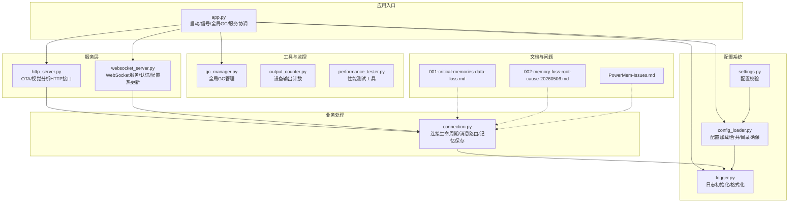
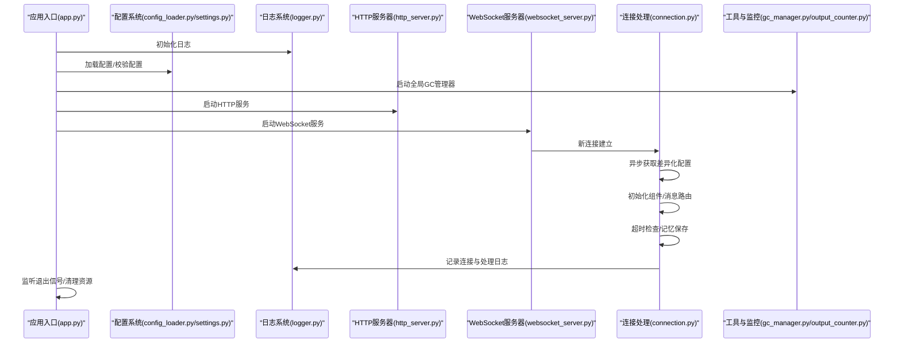
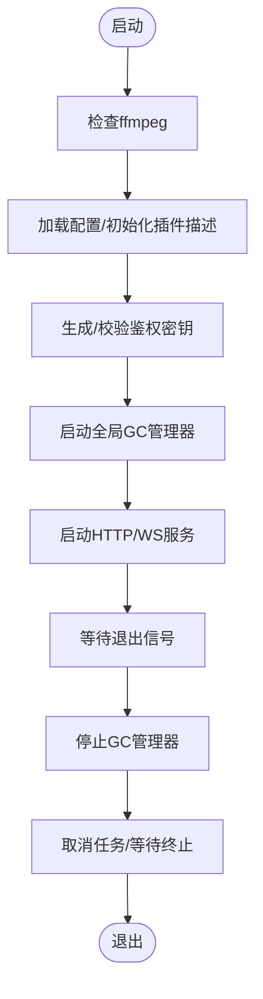
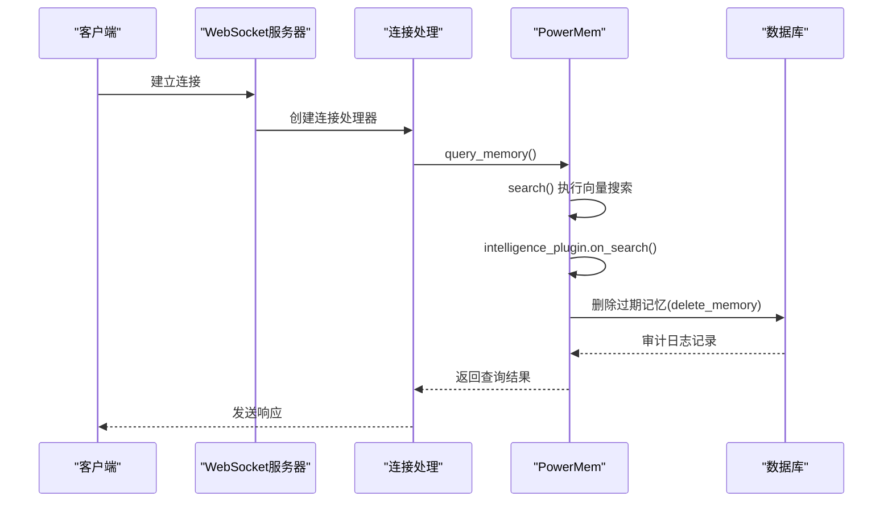
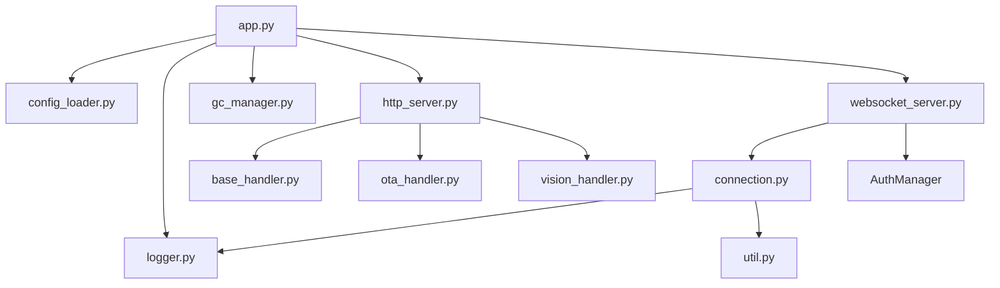

# 系统诊断与故障排除

<cite>
**本文档引用的文件**
- [app.py](file://main/xiaozhi-server/app.py)
- [logger.py](file://main/xiaozhi-server/config/logger.py)
- [settings.py](file://main/xiaozhi-server/config/settings.py)
- [config_loader.py](file://main/xiaozhi-server/config/config_loader.py)
- [gc_manager.py](file://main/xiaozhi-server/core/utils/gc_manager.py)
- [output_counter.py](file://main/xiaozhi-server/core/utils/output_counter.py)
- [http_server.py](file://main/xiaozhi-server/core/http_server.py)
- [websocket_server.py](file://main/xiaozhi-server/core/websocket_server.py)
- [connection.py](file://main/xiaozhi-server/core/connection.py)
- [ota_handler.py](file://main/xiaozhi-server/core/api/ota_handler.py)
- [vision_handler.py](file://main/xiaozhi-server/core/api/vision_handler.py)
- [base_handler.py](file://main/xiaozhi-server/core/api/base_handler.py)
- [util.py](file://main/xiaozhi-server/core/utils/util.py)
- [performance_tester.py](file://main/xiaozhi-server/performance_tester.py)
- [001-critical-memories-data-loss.md](file://main/xiaozhi-server/docs/issues/001-critical-memories-data-loss.md)
- [002-memory-loss-root-cause-20260506.md](file://main/xiaozhi-server/docs/issues/002-memory-loss-root-cause-20260506.md)
- [PowerMem-Issues.md](file://main/xiaozhi-server/docs/powermem/PowerMem-Issues.md)
- [app.log](file://logs/app.log)
</cite>

## 目录
1. [简介](#简介)
2. [项目结构](#项目结构)
3. [核心组件](#核心组件)
4. [架构总览](#架构总览)
5. [详细组件分析](#详细组件分析)
6. [依赖关系分析](#依赖关系分析)
7. [性能考量](#性能考量)
8. [故障排除指南](#故障排除指南)
9. [结论](#结论)
10. [附录](#附录)

## 简介
本技术文档面向小智ESP32服务器的系统诊断与故障排除，聚焦于常见问题的诊断方法、日志分析技巧与根因定位策略。文档深入说明内存泄漏、数据丢失等关键问题的排查流程与解决方案，阐述垃圾回收管理、输出计数器与系统监控的使用方法，解释日志系统的配置、日志级别与关键日志项的含义，并提供标准化的故障排除流程、工具使用与预防措施。同时，结合实际故障案例（如PowerMem记忆丢失问题）给出解决步骤与经验总结，说明系统健康检查、性能监控与预警机制的实施方法。

## 项目结构
小智ESP32服务器采用模块化架构，主要分为以下层次：
- 应用入口与生命周期管理：app.py负责启动顺序、信号处理、全局GC管理与服务协调
- 配置系统：config_loader.py负责配置加载与合并，settings.py负责配置校验，logger.py负责日志系统初始化
- 服务层：http_server.py提供OTA与视觉分析HTTP接口；websocket_server.py提供WebSocket服务
- 连接与业务处理：connection.py负责单连接生命周期、消息路由、组件初始化与记忆保存
- 工具与监控：gc_manager.py提供全局垃圾回收管理；output_counter.py提供设备输出计数；performance_tester.py提供性能测试工具
- 文档与问题记录：docs目录包含问题清单与PowerMem集成问题说明

**图表来源**
- [app.py:46-160](file://main/xiaozhi-server/app.py#L46-L160)
- [config_loader.py:27-94](file://main/xiaozhi-server/config/config_loader.py#L27-L94)
- [logger.py:48-115](file://main/xiaozhi-server/config/logger.py#L48-L115)
- [http_server.py:35-93](file://main/xiaozhi-server/core/http_server.py#L35-L93)
- [websocket_server.py:71-228](file://main/xiaozhi-server/core/websocket_server.py#L71-L228)
- [connection.py:193-800](file://main/xiaozhi-server/core/connection.py#L193-L800)
- [gc_manager.py:30-123](file://main/xiaozhi-server/core/utils/gc_manager.py#L30-L123)
- [output_counter.py:10-51](file://main/xiaozhi-server/core/utils/output_counter.py#L10-L51)
- [performance_tester.py:47-70](file://main/xiaozhi-server/performance_tester.py#L47-L70)

**章节来源**
- [app.py:46-160](file://main/xiaozhi-server/app.py#L46-L160)
- [config_loader.py:27-94](file://main/xiaozhi-server/config/config_loader.py#L27-L94)
- [logger.py:48-115](file://main/xiaozhi-server/config/logger.py#L48-L115)
- [http_server.py:35-93](file://main/xiaozhi-server/core/http_server.py#L35-L93)
- [websocket_server.py:71-228](file://main/xiaozhi-server/core/websocket_server.py#L71-L228)
- [connection.py:193-800](file://main/xiaozhi-server/core/connection.py#L193-L800)
- [gc_manager.py:30-123](file://main/xiaozhi-server/core/utils/gc_manager.py#L30-L123)
- [output_counter.py:10-51](file://main/xiaozhi-server/core/utils/output_counter.py#L10-L51)
- [performance_tester.py:47-70](file://main/xiaozhi-server/performance_tester.py#L47-L70)

## 核心组件
本节概述关键组件及其职责与交互关系，为后续深入分析奠定基础。

- 应用入口与生命周期
  - 负责检查ffmpeg、加载配置、初始化插件描述、生成/校验鉴权密钥、启动全局GC管理器、启动HTTP与WebSocket服务、监听退出信号与清理资源
  - 关键点：信号处理、任务取消与超时等待、GC管理器启停

- 日志系统
  - 从配置读取日志级别、格式、输出目录与文件，支持控制台与文件双输出，支持异步安全写入、轮转与保留策略
  - 支持模块字符串构建与动态绑定，便于区分模块来源

- 配置系统
  - 支持默认配置与自定义配置合并，支持从API拉取配置，确保目录存在，缓存配置提升性能
  - 配置校验：检查data/.config.yaml是否存在与读取方式

- 服务层
  - HTTP服务器：提供OTA接口与视觉分析接口路由，支持CORS与OPTIONS预检
  - WebSocket服务器：提供认证、白名单、配置热更新、连接管理与错误过滤

- 连接处理
  - 单连接生命周期管理：异步获取差异化配置、组件初始化、消息路由、超时检查、记忆保存与连接关闭
  - 支持MQTT网关音频包解析、时间戳排序与乱序处理

- 工具与监控
  - 全局GC管理器：定时执行垃圾回收，避免频繁触发GC导致事件循环阻塞
  - 输出计数器：按设备与日期统计输出字数，支持重置与上限检查
  - 性能测试工具：动态加载性能测试模块并执行

**章节来源**
- [app.py:46-160](file://main/xiaozhi-server/app.py#L46-L160)
- [logger.py:48-115](file://main/xiaozhi-server/config/logger.py#L48-L115)
- [config_loader.py:27-94](file://main/xiaozhi-server/config/config_loader.py#L27-L94)
- [settings.py:9-34](file://main/xiaozhi-server/config/settings.py#L9-L34)
- [http_server.py:35-93](file://main/xiaozhi-server/core/http_server.py#L35-L93)
- [websocket_server.py:71-228](file://main/xiaozhi-server/core/websocket_server.py#L71-L228)
- [connection.py:193-800](file://main/xiaozhi-server/core/connection.py#L193-L800)
- [gc_manager.py:30-123](file://main/xiaozhi-server/core/utils/gc_manager.py#L30-L123)
- [output_counter.py:10-51](file://main/xiaozhi-server/core/utils/output_counter.py#L10-L51)
- [performance_tester.py:47-70](file://main/xiaozhi-server/performance_tester.py#L47-L70)

## 架构总览
系统采用“配置驱动 + 服务编排 + 连接处理”的架构模式。应用入口统一调度各服务，配置系统提供灵活的配置来源与合并策略，日志系统贯穿全链路，服务层提供HTTP与WebSocket能力，连接处理模块负责单连接的完整生命周期，工具与监控模块提供运行时保障。

**图表来源**
- [app.py:46-160](file://main/xiaozhi-server/app.py#L46-L160)
- [config_loader.py:27-94](file://main/xiaozhi-server/config/config_loader.py#L27-L94)
- [logger.py:48-115](file://main/xiaozhi-server/config/logger.py#L48-L115)
- [http_server.py:35-93](file://main/xiaozhi-server/core/http_server.py#L35-L93)
- [websocket_server.py:71-228](file://main/xiaozhi-server/core/websocket_server.py#L71-L228)
- [connection.py:193-800](file://main/xiaozhi-server/core/connection.py#L193-L800)
- [gc_manager.py:30-123](file://main/xiaozhi-server/core/utils/gc_manager.py#L30-L123)

## 详细组件分析

### 应用入口与生命周期管理
- 启动流程要点
  - 检查ffmpeg可用性
  - 加载配置并初始化插件描述
  - 生成/校验鉴权密钥（优先级：配置文件 > 管理API > 自动生成）
  - 启动全局GC管理器（默认5分钟间隔）
  - 启动HTTP与WebSocket服务
  - 监听SIGINT/SIGTERM或Windows键盘中断
  - 清理阶段：停止GC管理器、取消并等待任务终止、打印退出信息

- 退出与清理
  - 使用Event与Future配合信号处理
  - 取消stdin监控、WebSocket与HTTP任务
  - 等待任务终止并设置超时，确保优雅退出

**图表来源**
- [app.py:46-160](file://main/xiaozhi-server/app.py#L46-L160)

**章节来源**
- [app.py:46-160](file://main/xiaozhi-server/app.py#L46-L160)

### 日志系统与配置
- 日志初始化
  - 从配置读取日志级别、格式、输出目录与文件
  - 控制台与文件双输出，支持异步安全写入、轮转（10MB）与保留（30天）
  - 支持模块字符串构建与动态绑定，便于区分模块来源

- 关键配置项
  - log_level：日志级别
  - log_format/log_format_file：控制台与文件格式
  - log_dir/log_file：日志目录与文件名
  - selected_module：模块字符串，用于标识模块来源

- 使用建议
  - 生产环境建议使用INFO及以上级别
  - 问题排查时可临时提升至DEBUG级别
  - 关注模块字符串与tag字段，便于定位模块来源

**章节来源**
- [logger.py:48-115](file://main/xiaozhi-server/config/logger.py#L48-L115)
- [config_loader.py:27-94](file://main/xiaozhi-server/config/config_loader.py#L27-L94)
- [settings.py:9-34](file://main/xiaozhi-server/config/settings.py#L9-L34)

### 配置系统与热更新
- 配置加载与合并
  - 默认配置与自定义配置合并，自定义优先级更高
  - 支持从API拉取配置，确保目录存在，缓存配置提升性能
  - 配置校验：检查data/.config.yaml是否存在与读取方式

- WebSocket配置热更新
  - 支持异步获取新配置，检查VAD/ASR类型是否需要更新
  - 重新初始化模块并更新组件实例

**章节来源**
- [config_loader.py:27-94](file://main/xiaozhi-server/config/config_loader.py#L27-L94)
- [websocket_server.py:155-204](file://main/xiaozhi-server/core/websocket_server.py#L155-L204)
- [settings.py:9-34](file://main/xiaozhi-server/config/settings.py#L9-L34)

### 服务层：HTTP与WebSocket
- HTTP服务器
  - 提供OTA接口与视觉分析接口路由
  - 支持CORS与OPTIONS预检
  - 异常捕获与错误堆栈记录

- WebSocket服务器
  - 认证与白名单支持
  - 配置热更新
  - 过滤无效握手错误日志
  - 连接管理与错误处理

**章节来源**
- [http_server.py:35-93](file://main/xiaozhi-server/core/http_server.py#L35-L93)
- [base_handler.py:5-25](file://main/xiaozhi-server/core/api/base_handler.py#L5-L25)
- [websocket_server.py:71-228](file://main/xiaozhi-server/core/websocket_server.py#L71-L228)

### 连接处理与消息路由
- 生命周期管理
  - 异步获取差异化配置（设备绑定、设备未绑定、设备绑定异常）
  - 组件初始化：VAD/ASR/TTS/LLM/Memory/Intent
  - 超时检查与连接关闭
  - 记忆保存：线程池异步保存，等待完成或超时

- 消息路由
  - 文本消息：交由文本处理模块
  - 音频消息：MQTT网关音频包解析与时间戳排序
  - 绑定状态检查与提示播放

- MQTT网关音频包处理
  - 解析16字节头部（时间戳、音频长度）
  - 乱序包缓冲与有序处理
  - 超过缓冲上限的包直接处理

**章节来源**
- [connection.py:193-800](file://main/xiaozhi-server/core/connection.py#L193-L800)

### 工具与监控：GC管理与输出计数
- 全局GC管理器
  - 定时执行垃圾回收，避免频繁触发GC导致事件循环阻塞
  - 线程池执行GC，避免阻塞事件循环
  - 支持启动/停止与异常处理

- 输出计数器
  - 按设备与日期统计输出字数
  - 支持重置与上限检查
  - 适用于设备输出限制场景

**章节来源**
- [gc_manager.py:30-123](file://main/xiaozhi-server/core/utils/gc_manager.py#L30-L123)
- [output_counter.py:10-51](file://main/xiaozhi-server/core/utils/output_counter.py#L10-L51)

### API处理：OTA与视觉分析
- OTA处理
  - 设备ID/ClientID解析与校验
  - 固件版本比较与下载URL生成
  - MQTT网关配置下发或WebSocket配置下发
  - 固件下载接口安全校验（basename与路径限制）

- 视觉分析处理
  - JWT认证校验（支持测试客户端跳过）
  - 图片文件大小与格式校验
  - VLLM模块选择与响应生成
  - 统一错误响应格式

**章节来源**
- [ota_handler.py:143-416](file://main/xiaozhi-server/core/api/ota_handler.py#L143-L416)
- [vision_handler.py:47-183](file://main/xiaozhi-server/core/api/vision_handler.py#L47-L183)
- [base_handler.py:5-25](file://main/xiaozhi-server/core/api/base_handler.py#L5-L25)

### 实际故障案例：PowerMem记忆丢失问题
- 问题描述
  - 隔天启动后首次连接，memories表数据全部丢失，user_profiles表数据正常保留
  - 问题与服务重启、时间间隔高度相关，疑似定期清理或重启触发的清理逻辑

- 根因分析
  - PowerMem智能记忆管理插件在第一次查询记忆时自动触发清理操作
  - 基于艾宾浩斯遗忘曲线自动评估和清理“应该遗忘”的记忆
  - 删除操作发生在query_memory() → search()调用期间，而非save_memory()期间

- 解决方案
  - 禁用智能插件（包括自动清理）
  - 调整遗忘曲线参数，降低遗忘率
  - 通过审计日志与应用程序日志对比验证时间线

**图表来源**
- [001-critical-memories-data-loss.md:14-140](file://main/xiaozhi-server/docs/issues/001-critical-memories-data-loss.md#L14-L140)
- [002-memory-loss-root-cause-20260506.md:113-174](file://main/xiaozhi-server/docs/issues/002-memory-loss-root-cause-20260506.md#L113-L174)
- [PowerMem-Issues.md:115-174](file://main/xiaozhi-server/docs/powermem/PowerMem-Issues.md#L115-L174)

**章节来源**
- [001-critical-memories-data-loss.md:14-140](file://main/xiaozhi-server/docs/issues/001-critical-memories-data-loss.md#L14-L140)
- [002-memory-loss-root-cause-20260506.md:113-174](file://main/xiaozhi-server/docs/issues/002-memory-loss-root-cause-20260506.md#L113-L174)
- [PowerMem-Issues.md:115-174](file://main/xiaozhi-server/docs/powermem/PowerMem-Issues.md#L115-L174)

## 依赖关系分析
- 组件耦合与内聚
  - app.py作为入口，依赖配置、日志、GC管理器与服务模块
  - connection.py依赖配置系统、日志系统与各模块初始化
  - API处理模块依赖基础处理器与认证工具
  - 日志系统与配置系统相互依赖，形成稳定的基础设施

- 外部依赖与集成点
  - ffmpeg：音频处理前置依赖
  - PowerMem SDK：记忆管理与智能清理
  - OceanBase：向量存储与审计日志
  - Web框架：aiohttp与websockets

**图表来源**
- [app.py:46-160](file://main/xiaozhi-server/app.py#L46-L160)
- [http_server.py:35-93](file://main/xiaozhi-server/core/http_server.py#L35-L93)
- [websocket_server.py:71-228](file://main/xiaozhi-server/core/websocket_server.py#L71-L228)
- [connection.py:193-800](file://main/xiaozhi-server/core/connection.py#L193-L800)
- [base_handler.py:5-25](file://main/xiaozhi-server/core/api/base_handler.py#L5-L25)
- [util.py:157-218](file://main/xiaozhi-server/core/utils/util.py#L157-L218)

**章节来源**
- [app.py:46-160](file://main/xiaozhi-server/app.py#L46-L160)
- [http_server.py:35-93](file://main/xiaozhi-server/core/http_server.py#L35-L93)
- [websocket_server.py:71-228](file://main/xiaozhi-server/core/websocket_server.py#L71-L228)
- [connection.py:193-800](file://main/xiaozhi-server/core/connection.py#L193-L800)
- [base_handler.py:5-25](file://main/xiaozhi-server/core/api/base_handler.py#L5-L25)
- [util.py:157-218](file://main/xiaozhi-server/core/utils/util.py#L157-L218)

## 性能考量
- 垃圾回收管理
  - 全局GC管理器定时执行，避免频繁触发GC导致事件循环阻塞
  - 在线程池中执行GC，避免阻塞事件循环
  - 建议根据系统负载调整GC间隔（默认5分钟）

- 音频处理与缓存
  - 音频数据转换与编码在独立线程执行，避免阻塞事件循环
  - 缓存机制减少重复计算与I/O

- 日志性能
  - 异步安全写入，轮转与保留策略控制磁盘占用
  - 建议生产环境使用INFO及以上级别，避免过多DEBUG日志

- 配置热更新
  - 异步获取新配置，检查VAD/ASR类型变更后重新初始化模块
  - 避免阻塞主线程，提升系统响应速度

**章节来源**
- [gc_manager.py:30-123](file://main/xiaozhi-server/core/utils/gc_manager.py#L30-L123)
- [util.py:249-324](file://main/xiaozhi-server/core/utils/util.py#L249-L324)
- [logger.py:84-106](file://main/xiaozhi-server/config/logger.py#L84-L106)
- [websocket_server.py:155-204](file://main/xiaozhi-server/core/websocket_server.py#L155-L204)

## 故障排除指南

### 通用诊断流程
- 确认环境依赖
  - 检查ffmpeg是否正确安装与可执行
  - 确认配置文件存在且可读

- 启动与服务状态
  - 观察应用启动日志，确认HTTP与WebSocket服务端口
  - 检查全局GC管理器是否正常启动

- 日志分析
  - 使用日志级别与模块字符串定位问题模块
  - 关注连接建立、组件初始化、消息路由与异常堆栈

- 服务接口验证
  - OTA接口：检查设备ID/ClientID与固件版本比较
  - 视觉分析接口：验证JWT认证与图片格式

**章节来源**
- [util.py:157-218](file://main/xiaozhi-server/core/utils/util.py#L157-L218)
- [settings.py:9-34](file://main/xiaozhi-server/config/settings.py#L9-L34)
- [app.py:85-130](file://main/xiaozhi-server/app.py#L85-L130)
- [logger.py:48-115](file://main/xiaozhi-server/config/logger.py#L48-L115)
- [http_server.py:35-93](file://main/xiaozhi-server/core/http_server.py#L35-L93)
- [vision_handler.py:47-183](file://main/xiaozhi-server/core/api/vision_handler.py#L47-L183)

### 内存泄漏排查
- 观察GC行为
  - 检查全局GC管理器日志，确认定时GC是否正常执行
  - 关注对象回收数量变化

- 代码审查
  - 检查长生命周期对象持有与释放
  - 确认异步任务取消与资源释放

- 工具辅助
  - 使用性能测试工具评估内存使用趋势
  - 结合日志分析定位异常峰值

**章节来源**
- [gc_manager.py:30-123](file://main/xiaozhi-server/core/utils/gc_manager.py#L30-L123)
- [performance_tester.py:47-70](file://main/xiaozhi-server/performance_tester.py#L47-L70)

### 数据丢失与一致性
- PowerMem记忆丢失
  - 确认智能插件是否启用，必要时禁用或调整参数
  - 通过审计日志与应用程序日志对比验证时间线
  - 检查向量索引状态与表结构

- 记忆保存与关闭
  - 确认连接关闭时是否触发记忆保存
  - 检查线程池异步保存是否完成或超时

**章节来源**
- [PowerMem-Issues.md:115-174](file://main/xiaozhi-server/docs/powermem/PowerMem-Issues.md#L115-L174)
- [001-critical-memories-data-loss.md:14-140](file://main/xiaozhi-server/docs/issues/001-critical-memories-data-loss.md#L14-L140)
- [002-memory-loss-root-cause-20260506.md:113-174](file://main/xiaozhi-server/docs/issues/002-memory-loss-root-cause-20260506.md#L113-L174)
- [connection.py:265-328](file://main/xiaozhi-server/core/connection.py#L265-L328)

### 日志系统配置与使用
- 配置项
  - log_level：日志级别（建议生产环境INFO及以上）
  - log_format/log_format_file：控制台与文件格式
  - log_dir/log_file：日志目录与文件名
  - selected_module：模块字符串，用于标识模块来源

- 使用技巧
  - 使用模块字符串与tag字段区分模块来源
  - 生产环境启用轮转与保留策略，避免磁盘占满
  - 问题排查时临时提升日志级别

**章节来源**
- [logger.py:48-115](file://main/xiaozhi-server/config/logger.py#L48-L115)

### 性能监控与预警
- 性能测试工具
  - 动态加载性能测试模块并执行
  - 适用于ASR/TTS/LLM/VLLM等模块的性能评估

- 建议指标
  - GC回收频率与耗时
  - 连接数与消息吞吐量
  - 音频处理延迟与丢帧率
  - 记忆查询与保存耗时

**章节来源**
- [performance_tester.py:47-70](file://main/xiaozhi-server/performance_tester.py#L47-L70)

## 结论
通过对小智ESP32服务器的系统架构、核心组件与故障案例的深入分析，本文提供了系统化的诊断与故障排除方法。针对内存泄漏、数据丢失等关键问题，建议从日志分析、配置校验、服务接口验证与性能监控入手，结合PowerMem智能清理机制的根因分析，制定针对性的解决方案。同时，建议完善健康检查、性能监控与预警机制，确保系统稳定运行。

## 附录

### 常用命令与工具
- 启动应用：python app.py
- 性能测试：python performance_tester.py
- 日志查看：tail -f logs/app.log
- 配置校验：检查data/.config.yaml是否存在与读取方式

**章节来源**
- [app.py:155-160](file://main/xiaozhi-server/app.py#L155-L160)
- [performance_tester.py:47-70](file://main/xiaozhi-server/performance_tester.py#L47-L70)
- [settings.py:9-34](file://main/xiaozhi-server/config/settings.py#L9-L34)