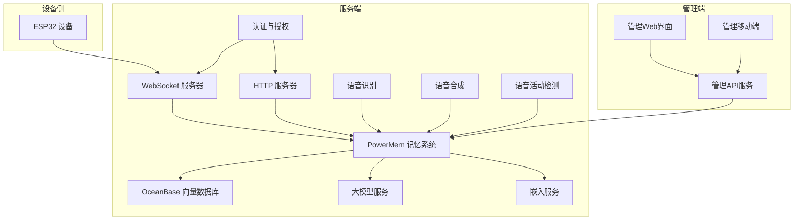
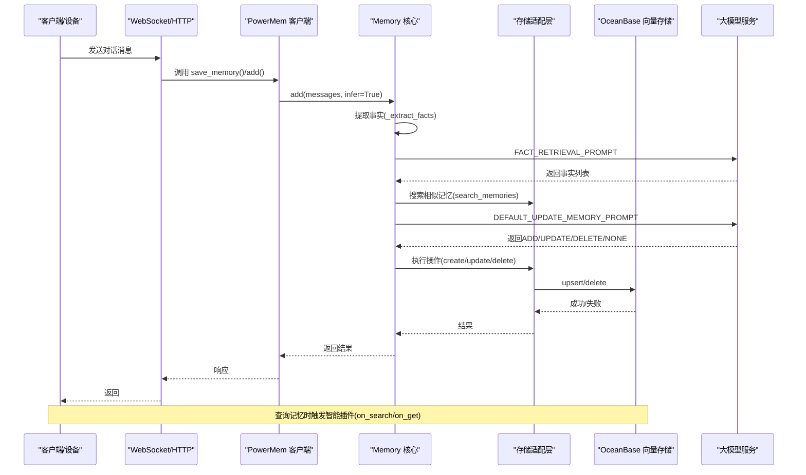
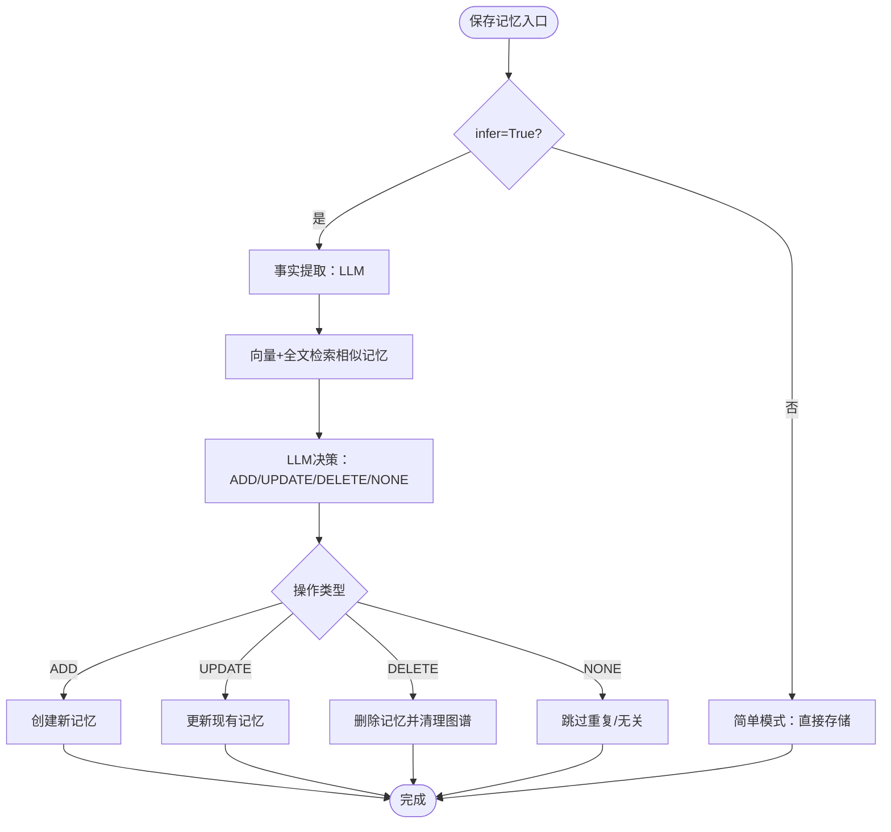
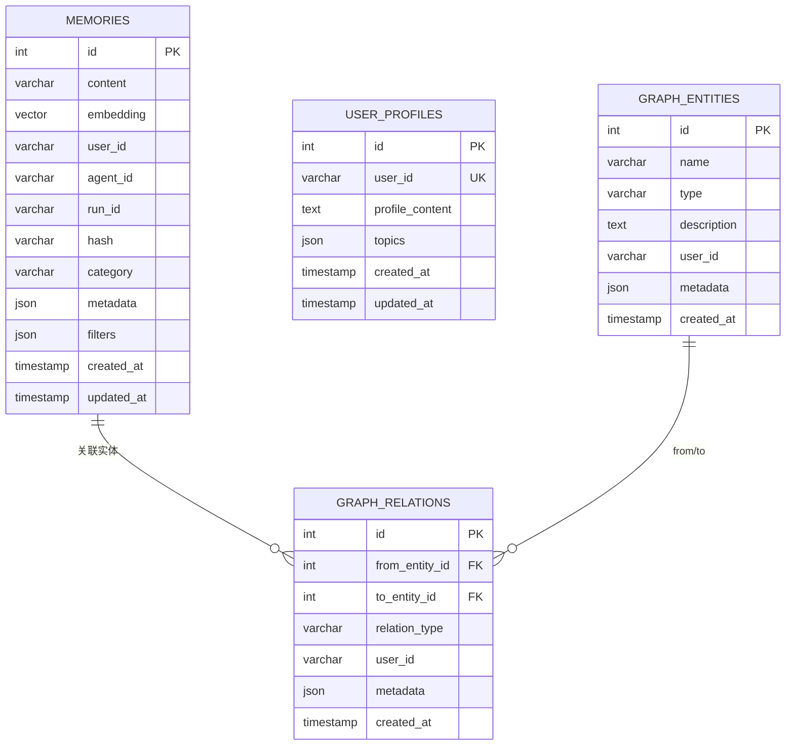
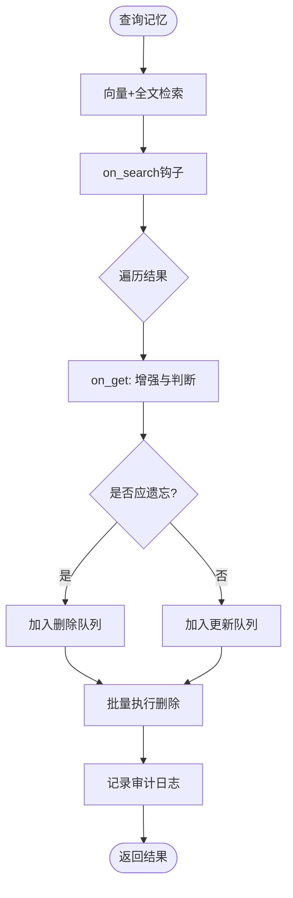
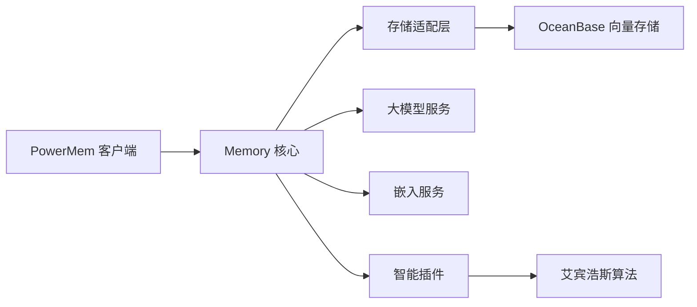

# 高级主题

<cite>
**本文引用的文件**
- [PowerMem-1.1.0-Analysis.md](file://main/xiaozhi-server/docs/powermem/PowerMem-1.1.0-Analysis.md)
- [PowerMem-记忆处理原理详解.md](file://main/xiaozhi-server/docs/powermem/PowerMem-记忆处理原理详解.md)
- [PowerMemory-Intelligent-Processing-Flow.md](file://main/xiaozhi-server/docs/powermem/PowerMemory-Intelligent-Processing-Flow.md)
- [PowerMem-SQL生成原理详解.md](file://main/xiaozhi-server/docs/powermem/PowerMem-SQL生成原理详解.md)
- [PowerMem-Metadata-Fields.md](file://main/xiaozhi-server/docs/powermem/PowerMem-Metadata-Fields.md)
- [PowerMem-Issues.md](file://main/xiaozhi-server/docs/powermem/PowerMem-Issues.md)
- [performance_tester.py](file://main/xiaozhi-server/performance_tester.py)
- [performance_tester_asr.py](file://main/xiaozhi-server/performance_tester/performance_tester_asr.py)
- [performance_tester_llm.py](file://main/xiaozhi-server/performance_tester/performance_tester_llm.py)
- [performance_tester_tts.py](file://main/xiaozhi-server/performance_tester/performance_tester_tts.py)
- [performance_tester_stream_asr.py](file://main/xiaozhi-server/performance_tester/performance_tester_stream_asr.py)
- [performance_tester_stream_tts.py](file://main/xiaozhi-server/performance_tester/performance_tester_stream_tts.py)
- [performance_tester_vllm.py](file://main/xiaozhi-server/performance_tester/performance_tester_vllm.py)
- [powermem.py](file://main/xiaozhi-server/core/providers/memory/powermem/powermem.py)
- [memory.py](file://main/xiaozhi-server/core/memory.py)
- [oceanbase.py](file://main/xiaozhi-server/storage/oceanbase/oceanbase.py)
- [plugin.py](file://main/xiaozhi-server/intelligence/plugin.py)
- [ebbinghaus_algorithm.py](file://main/xiaozhi-server/intelligence/ebbinghaus_algorithm.py)
- [check_tables.py](file://main/xiaozhi-server/check_tables.py)
- [docker-compose.yml](file://main/xiaozhi-server/docker-compose.yml)
- [docker-compose-oceanbase.yml](file://main/xiaozhi-server/docker-compose-oceanbase.yml)
- [requirements.txt](file://main/xiaozhi-server/requirements.txt)
- [app.py](file://main/xiaozhi-server/app.py)
- [settings.py](file://main/xiaozhi-server/config/settings.py)
- [config_loader.py](file://main/xiaozhi-server/config/config_loader.py)
- [logger.py](file://main/xiaozhi-server/config/logger.py)
- [auth.py](file://main/xiaozhi-server/core/auth.py)
- [websocket_server.py](file://main/xiaozhi-server/core/websocket_server.py)
- [http_server.py](file://main/xiaozhi-server/core/http_server.py)
- [ota_handler.py](file://main/xiaozhi-server/core/api/ota_handler.py)
- [vision_handler.py](file://main/xiaozhi-server/core/api/vision_handler.py)
- [base_handler.py](file://main/xiaozhi-server/core/api/base_handler.py)
- [loadplugins.py](file://main/xiaozhi-server/plugins_func/loadplugins.py)
- [register.py](file://main/xiaozhi-server/plugins_func/register.py)
- [mcp_server_settings.json](file://main/xiaozhi-server/mcp_server_settings.json)
- [index-stream-integration.md](file://docs/index-stream-integration.md)
- [mcp-endpoint-integration.md](file://docs/mcp-endpoint-integration.md)
- [fish-speech-integration.md](file://docs/fish-speech-integration.md)
- [homeassistant-integration.md](file://docs/homeassistant-integration.md)
- [weather-integration.md](file://docs/weather-integration.md)
- [ragflow-integration.md](file://docs/ragflow-integration.md)
- [mcp-vision-integration.md](file://docs/mcp-vision-integration.md)
- [mcp-get-device-info.md](file://docs/mcp-get-device-info.md)
- [Deployment.md](file://docs/Deployment.md)
- [dev-ops-integration.md](file://docs/dev-ops-integration.md)
- [docker-build.md](file://docs/docker-build.md)
- [firmware-build.md](file://docs/firmware-build.md)
- [firmware-setting.md](file://docs/firmware-setting.md)
- [ota-upgrade-guide.md](file://docs/ota-upgrade-guide.md)
- [paddlespeech-deploy.md](file://docs/paddlespeech-deploy.md)
- [Performance.md](file://docs/Performance.md)
</cite>

## 目录
1. [简介](#简介)
2. [项目结构](#项目结构)
3. [核心组件](#核心组件)
4. [架构总览](#架构总览)
5. [详细组件分析](#详细组件分析)
6. [依赖分析](#依赖分析)
7. [性能考量](#性能考量)
8. [故障排除指南](#故障排除指南)
9. [结论](#结论)
10. [附录](#附录)

## 简介
本文件面向小智ESP32服务器的高级用户与开发者，聚焦PowerMem智能记忆系统的架构设计、数据结构与查询优化，系统化阐述性能测试与基准测试的方法论、测试工具使用与结果分析，深入剖析安全考虑、加密机制与访问控制策略，并给出扩展开发的技术要点、架构演进与未来规划。同时提供高级配置选项、调优参数与最佳实践，以及故障排除的高级技巧、系统诊断与问题定位方法，最后说明与其他系统的集成方案、API扩展与插件生态。

## 项目结构
小智ESP32服务器采用前后端分离与模块化服务架构，核心由Java Spring Boot管理端、Web前端、移动端、以及Python服务端组成。Python服务端包含ASR/TTS/VAD/LLM/记忆系统等模块，PowerMem作为记忆与知识图谱的核心组件，贯穿消息处理、存储与检索流程。

图表来源
- [app.py](file://main/xiaozhi-server/app.py)
- [websocket_server.py](file://main/xiaozhi-server/core/websocket_server.py)
- [http_server.py](file://main/xiaozhi-server/core/http_server.py)
- [powermem.py](file://main/xiaozhi-server/core/providers/memory/powermem/powermem.py)
- [oceanbase.py](file://main/xiaozhi-server/storage/oceanbase/oceanbase.py)

章节来源
- [app.py](file://main/xiaozhi-server/app.py)
- [settings.py](file://main/xiaozhi-server/config/settings.py)
- [config_loader.py](file://main/xiaozhi-server/config/config_loader.py)

## 核心组件
- PowerMem智能记忆系统：负责对话记忆的抽取、去重、更新、删除与用户画像提取，支持向量检索与知识图谱存储。
- OceanBase向量数据库：提供向量索引、全文检索与混合搜索能力，支撑记忆检索与融合评分。
- 智能插件与遗忘算法：基于艾宾浩斯遗忘曲线的自动清理与增强，保障长期记忆质量。
- ASR/TTS/VAD/LLM：语音识别、语音合成、语音活动检测与大模型推理，构成完整的对话链路。
- 认证与授权：统一的鉴权与访问控制，保障API与存储的安全访问。
- 插件生态：支持工具函数、MCP端点与第三方服务的扩展接入。

章节来源
- [PowerMem-记忆处理原理详解.md](file://main/xiaozhi-server/docs/powermem/PowerMem-记忆处理原理详解.md)
- [PowerMem-Issues.md](file://main/xiaozhi-server/docs/powermem/PowerMem-Issues.md)

## 架构总览
PowerMem在“保存记忆”与“查询记忆”两个关键节点引入智能处理：保存时进行事实抽取与LLM决策，查询时进行融合检索与智能增强。整体流程如下：

图表来源
- [PowerMemory-Intelligent-Processing-Flow.md](file://main/xiaozhi-server/docs/powermem/PowerMemory-Intelligent-Processing-Flow.md)
- [PowerMem-记忆处理原理详解.md](file://main/xiaozhi-server/docs/powermem/PowerMem-记忆处理原理详解.md)
- [memory.py](file://main/xiaozhi-server/core/memory.py)
- [powermem.py](file://main/xiaozhi-server/core/providers/memory/powermem/powermem.py)
- [oceanbase.py](file://main/xiaozhi-server/storage/oceanbase/oceanbase.py)

## 详细组件分析

### PowerMem智能记忆系统
- 智能模式与简单模式：智能模式启用LLM进行事实抽取与记忆决策，简单模式直接存储对话，不触发智能处理。
- 记忆生命周期：保存时ADD/UPDATE/DELETE/NONE，查询时on_search/on_get触发智能增强与清理。
- 数据结构：memories表（向量、全文、元数据）、user_profiles表、graph_entities/graph_relations（知识图谱）。
- SQL生成：UPDATE采用UPSERT保证原子性与幂等性，DELETE执行物理删除并同步清理图谱实体与关系。

图表来源
- [PowerMem-记忆处理原理详解.md](file://main/xiaozhi-server/docs/powermem/PowerMem-记忆处理原理详解.md)
- [PowerMem-SQL生成原理详解.md](file://main/xiaozhi-server/docs/powermem/PowerMem-SQL生成原理详解.md)
- [memory.py](file://main/xiaozhi-server/core/memory.py)

章节来源
- [PowerMem-1.1.0-Analysis.md](file://main/xiaozhi-server/docs/powermem/PowerMem-1.1.0-Analysis.md)
- [PowerMem-记忆处理原理详解.md](file://main/xiaozhi-server/docs/powermem/PowerMem-记忆处理原理详解.md)
- [PowerMemory-Intelligent-Processing-Flow.md](file://main/xiaozhi-server/docs/powermem/PowerMemory-Intelligent-Processing-Flow.md)
- [PowerMem-SQL生成原理详解.md](file://main/xiaozhi-server/docs/powermem/PowerMem-SQL生成原理详解.md)

### OceanBase向量检索与融合
- 混合搜索：向量相似度与全文检索结合，支持RRF融合与加权平均。
- 元数据字段：_fusion_info、_fusion_score、_quality_score、search_count、last_searched_at、_vector_similarity等，用于调试与优化。
- 索引与性能：自动维护主键索引与向量索引，支持全文索引；可通过权重调优与统计字段辅助优化。

图表来源
- [PowerMem-记忆处理原理详解.md](file://main/xiaozhi-server/docs/powermem/PowerMem-记忆处理原理详解.md)
- [PowerMem-Metadata-Fields.md](file://main/xiaozhi-server/docs/powermem/PowerMem-Metadata-Fields.md)

章节来源
- [PowerMem-Metadata-Fields.md](file://main/xiaozhi-server/docs/powermem/PowerMem-Metadata-Fields.md)
- [oceanbase.py](file://main/xiaozhi-server/storage/oceanbase/oceanbase.py)

### 智能插件与遗忘算法
- on_search/on_get钩子：在查询阶段对搜索结果进行增强与清理，基于艾宾浩斯遗忘曲线判断是否删除。
- 配置开关：可通过配置禁用智能插件或调整遗忘曲线参数，避免自动清理带来的副作用。
- 影响范围：与保存记忆的infer参数无关，独立于add()方法。

图表来源
- [PowerMem-Issues.md](file://main/xiaozhi-server/docs/powermem/PowerMem-Issues.md)
- [plugin.py](file://main/xiaozhi-server/intelligence/plugin.py)
- [ebbinghaus_algorithm.py](file://main/xiaozhi-server/intelligence/ebbinghaus_algorithm.py)

章节来源
- [PowerMem-Issues.md](file://main/xiaozhi-server/docs/powermem/PowerMem-Issues.md)

### 认证与访问控制
- 统一鉴权：通过认证中间件与权限控制，确保API与存储访问受控。
- 记忆访问：删除操作前进行用户ID校验，防止越权访问。
- 安全建议：最小权限原则、密钥轮换、HTTPS传输、审计日志。

章节来源
- [auth.py](file://main/xiaozhi-server/core/auth.py)
- [PowerMem-SQL生成原理详解.md](file://main/xiaozhi-server/docs/powermem/PowerMem-SQL生成原理详解.md)

### 插件生态与API扩展
- 工具函数注册：统一的工具管理器支持函数注册与调用。
- MCP端点：支持MCP协议的端点与设备工具扩展。
- 第三方集成：HomeAssistant、天气、RAGFlow、鱼说话等生态集成文档。

章节来源
- [loadplugins.py](file://main/xiaozhi-server/plugins_func/loadplugins.py)
- [register.py](file://main/xiaozhi-server/plugins_func/register.py)
- [mcp-endpoint-integration.md](file://docs/mcp-endpoint-integration.md)
- [homeassistant-integration.md](file://docs/homeassistant-integration.md)
- [weather-integration.md](file://docs/weather-integration.md)
- [ragflow-integration.md](file://docs/ragflow-integration.md)
- [fish-speech-integration.md](file://docs/fish-speech-integration.md)

## 依赖分析
- 组件耦合：PowerMem与OceanBase、LLM、嵌入服务紧密耦合；智能插件与遗忘算法独立于记忆保存逻辑。
- 外部依赖：Docker Compose编排OceanBase、Python运行时与依赖库。
- 潜在循环依赖：各模块按职责分层，未见明显循环依赖迹象。

图表来源
- [powermem.py](file://main/xiaozhi-server/core/providers/memory/powermem/powermem.py)
- [memory.py](file://main/xiaozhi-server/core/memory.py)
- [oceanbase.py](file://main/xiaozhi-server/storage/oceanbase/oceanbase.py)
- [plugin.py](file://main/xiaozhi-server/intelligence/plugin.py)
- [ebbinghaus_algorithm.py](file://main/xiaozhi-server/intelligence/ebbinghaus_algorithm.py)

章节来源
- [docker-compose.yml](file://main/xiaozhi-server/docker-compose.yml)
- [docker-compose-oceanbase.yml](file://main/xiaozhi-server/docker-compose-oceanbase.yml)
- [requirements.txt](file://main/xiaozhi-server/requirements.txt)

## 性能考量
- LLM调用成本：每次保存记忆涉及两次LLM调用（事实提取与决策），需评估Token消耗与延迟。
- 检索性能：混合搜索与向量索引提升召回质量，但需平衡权重与过滤器。
- 缓存与复用：事实向量嵌入复用、用户画像缓存可显著降低重复计算。
- 批量操作：UPSER进行批量更新，减少数据库往返。
- 基准测试：提供ASR/TTS/LLM/stream等多场景测试脚本，支持吞吐与延迟统计。

章节来源
- [PowerMem-记忆处理原理详解.md](file://main/xiaozhi-server/docs/powermem/PowerMem-记忆处理原理详解.md)
- [performance_tester.py](file://main/xiaozhi-server/performance_tester.py)
- [performance_tester_asr.py](file://main/xiaozhi-server/performance_tester/performance_tester_asr.py)
- [performance_tester_llm.py](file://main/xiaozhi-server/performance_tester/performance_tester_llm.py)
- [performance_tester_tts.py](file://main/xiaozhi-server/performance_tester/performance_tester_tts.py)
- [performance_tester_stream_asr.py](file://main/xiaozhi-server/performance_tester/performance_tester_stream_asr.py)
- [performance_tester_stream_tts.py](file://main/xiaozhi-server/performance_tester/performance_tester_stream_tts.py)
- [performance_tester_vllm.py](file://main/xiaozhi-server/performance_tester/performance_tester_vllm.py)

## 故障排除指南
- 记忆被意外删除：检查智能模式与LLM决策，必要时禁用智能模式或调整提示词；确认智能插件on_search钩子是否触发自动清理。
- SDK集成问题：应用层补丁修复graph_store初始化错误，确保配置包含enabled与embedding_model_dims。
- 表结构缺失：使用验证脚本检查memories、user_profiles、graph_entities、graph_relations是否创建。
- 查询性能异常：检查融合权重、索引与元数据统计字段，利用_fusion_info与_quality_score进行分析。
- 安全与访问：核对删除前的用户ID校验，确保最小权限与审计日志。

章节来源
- [PowerMem-Issues.md](file://main/xiaozhi-server/docs/powermem/PowerMem-Issues.md)
- [check_tables.py](file://main/xiaozhi-server/check_tables.py)
- [PowerMem-Metadata-Fields.md](file://main/xiaozhi-server/docs/powermem/PowerMem-Metadata-Fields.md)
- [PowerMem-SQL生成原理详解.md](file://main/xiaozhi-server/docs/powermem/PowerMem-SQL生成原理详解.md)

## 结论
PowerMem通过智能模式实现了高准确性的记忆管理，配合OceanBase的向量检索与知识图谱，形成完整的长期记忆体系。在生产环境中，建议根据业务需求权衡智能模式与性能，合理配置融合权重与遗忘参数，并通过完善的测试与监控保障稳定性与安全性。

## 附录

### 高级配置与调优
- 智能模式开关：infer参数控制保存时的智能处理；智能插件on_search独立于保存逻辑，需通过配置禁用。
- 融合权重：调整向量与全文权重以匹配业务场景。
- 遗忘曲线：降低遗忘率或调整阈值，避免频繁清理。
- 缓存策略：复用向量嵌入、缓存用户画像，减少重复计算。

章节来源
- [PowerMem-记忆处理原理详解.md](file://main/xiaozhi-server/docs/powermem/PowerMem-记忆处理原理详解.md)
- [PowerMem-Issues.md](file://main/xiaozhi-server/docs/powermem/PowerMem-Issues.md)

### 安全与加密
- 认证与授权：统一鉴权中间件与权限控制。
- 存储安全：OceanBase访问凭据与网络隔离。
- 传输安全：HTTPS与WebSocket安全通道。
- 审计日志：记录删除与更新操作，便于追溯。

章节来源
- [auth.py](file://main/xiaozhi-server/core/auth.py)
- [PowerMem-SQL生成原理详解.md](file://main/xiaozhi-server/docs/powermem/PowerMem-SQL生成原理详解.md)

### 扩展与集成
- 插件生态：工具函数注册与MCP端点扩展。
- 第三方服务：HomeAssistant、天气、RAGFlow、鱼说话等集成。
- API与协议：MCP交互、设备信息获取、视觉能力集成。

章节来源
- [loadplugins.py](file://main/xiaozhi-server/plugins_func/loadplugins.py)
- [register.py](file://main/xiaozhi-server/plugins_func/register.py)
- [mcp-endpoint-integration.md](file://docs/mcp-endpoint-integration.md)
- [mcp-get-device-info.md](file://docs/mcp-get-device-info.md)
- [mcp-vision-integration.md](file://docs/mcp-vision-integration.md)
- [homeassistant-integration.md](file://docs/homeassistant-integration.md)
- [weather-integration.md](file://docs/weather-integration.md)
- [ragflow-integration.md](file://docs/ragflow-integration.md)
- [fish-speech-integration.md](file://docs/fish-speech-integration.md)