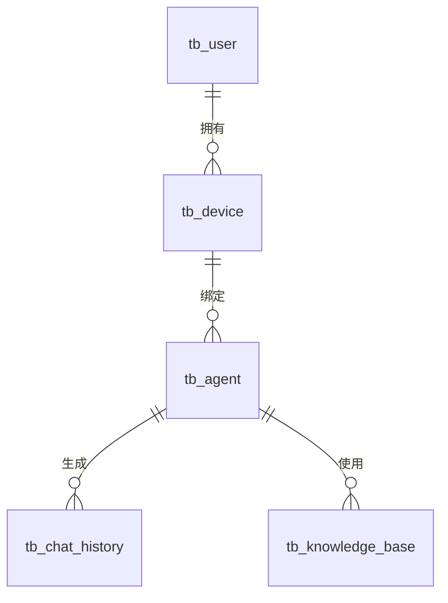

# 小智ESP32服务器 - 项目架构蓝图

> **文档版本**: 1.0.0
> **生成日期**: 2026-05-03
> **项目状态**: 生产就绪
> **架构风格**: 混合架构 (Provider 模式 + 分层架构 + 事件驱动)

---

## 目录

1. [架构概述](#架构概述)
2. [核心架构模式](#核心架构模式)
3. [系统组件架构](#系统组件架构)
4. [技术栈与框架](#技术栈与框架)
5. [数据架构](#数据架构)
6. [跨领域关注点](#跨领域关注点)
7. [服务通信模式](#服务通信模式)
8. [Python 架构模式](#python-架构模式)
9. [Java 架构模式](#java-架构模式)
10. [前端架构模式](#前端架构模式)
11. [测试架构](#测试架构)
12. [部署架构](#部署架构)
13. [扩展与演进模式](#扩展与演进模式)
14. [架构决策记录](#架构决策记录)
15. [架构治理](#架构治理)
16. [新开发蓝图](#新开发蓝图)

---

## 架构概述

### 整体架构方法

小智ESP32服务器采用**混合分布式架构**，结合以下核心设计原则：

1. **Provider 模式**：所有AI流水线组件(ASR/LLM/TTS/VAD/Intent/Memory)通过Provider基类和工厂函数实现可插拔架构
2. **分层架构**：前后端分离，业务逻辑、数据访问、API层清晰划分
3. **事件驱动**：WebSocket长连接 + 异步消息处理，支持实时语音交互
4. **微服务就绪**：各子模块可独立部署、扩展和升级

### 架构边界与强制机制

| 边界类型 | 边界定义 | 强制机制 |
|---------|---------|---------|
| **设备边界** | ESP32设备通过WebSocket连接 | WebSocket认证 + 设备绑定流程 |
| **AI能力边界** | Provider模式实现组件隔离 | 抽象基类(ABC) + 工厂函数创建 |
| **前后端边界** | REST API分离 | Shiro认证过滤器 + OpenAPI文档 |
| **数据边界** | 每个模块独立数据访问 | Repository模式 + MyBatis-Plus |
| **配置边界** | 三层配置系统 | 递归合并配置 + 远程API覆盖 |

### 混合架构模式

项目根据不同模块特点采用不同架构模式：

- **xiaozhi-server (Python)**: Provider模式 + 事件驱动架构
- **manager-api (Java)**: 分层架构 + DDD (领域驱动设计) 元素
- **manager-web (Vue.js)**: MVVM + 组件化架构
- **manager-mobile (Uni-app)**: 跨平台响应式架构

---

## 核心架构模式

### Provider 模式 (核心模式)

**定义**: 所有AI流水线组件(ASR、LLM、TTS、VAD、Intent、Memory)通过统一的Provider基类和工厂函数实现可插拔架构。

**架构意图**:
- **开放封闭原则**: 对扩展开放，对修改封闭
- **依赖倒置**: 高层模块不依赖低层模块，都依赖抽象
- **单一职责**: 每个Provider只负责一种AI能力

**实现模式**:

```python
# 抽象基类定义契约
class ASRProviderBase(ABC):
    @abstractmethod
    async def speech_to_text(self, opus_data, session_id, audio_format="opus", artifacts=None):
        """子类必须实现此方法"""
        pass

# 工厂函数动态创建实例
def create_instance(class_name: str, *args, **kwargs) -> ASRProviderBase:
    lib_name = f'core.providers.asr.{class_name}'
    module = importlib.import_module(lib_name)
    return module.ASRProvider(*args, **kwargs)

# 配置驱动创建
asr_instance = create_instance(config["selected_module"]["ASR"])
```

**Provider 类型与职责**:

| Provider | 职责 | 关键方法 | 配置键 |
|----------|------|---------|--------|
| **ASRProvider** | 语音识别，音频转文本 | `speech_to_text()`, `receive_audio()` | `selected_module.ASR` |
| **LLMProvider** | 大语言模型推理 | `response()`, `response_with_functions()` | `selected_module.LLM` |
| **TTSProvider** | 文本转语音合成 | `text_to_speech()` | `selected_module.TTS` |
| **VADProvider** | 语音活动检测 | `detect()` | `selected_module.VAD` |
| **IntentProvider** | 意图识别与分类 | `detect_intent()` | `selected_module.Intent` |
| **MemoryProvider** | 记忆存储与检索 | `save_memory()`, `query_memory()` | `selected_module.Memory` |

**扩展点**:
- 添加新Provider: 继承基类 → 实现`@abstractmethod` → 添加到对应目录
- 配置切换: 修改`config.yaml`中的`selected_module`配置
- 运行时切换: 通过manager-api远程配置覆盖

### 分层架构模式 (manager-api)

**层次结构**:

```
┌─────────────────────────────────────┐
│   Controller Layer (控制器层)        │  ← REST API端点，参数校验
├─────────────────────────────────────┤
│   Service Layer (服务层)             │  ← 业务逻辑，事务边界
├─────────────────────────────────────┤
│   DAO Layer (数据访问层)             │  ← MyBatis-Plus Mapper
├─────────────────────────────────────┤
│   Database Layer (数据库层)          │  ← MySQL 8.0
└─────────────────────────────────────┘
```

**依赖规则**:
- **单向依赖**: 上层可以调用下层，下层不能调用上层
- **接口隔离**: 层间通过接口通信，不依赖具体实现
- **构造器注入**: 使用Lombok `@AllArgsConstructor`实现依赖注入

### 事件驱动架构模式 (xiaozhi-server)

**事件类型**:
1. **WebSocket消息事件**: `hello`, `listen`, `abort`, `iot`, `mcp`, `server`, `ping`
2. **音频流事件**: VAD检测到语音停止，触发ASR识别
3. **工具调用事件**: LLM函数调用，触发IoT/MCP工具执行

**事件处理器注册表**:

```python
class TextMessageHandlerRegistry:
    """消息处理器注册表 - 实现策略模式"""

    def __init__(self):
        self._handlers: Dict[str, TextMessageHandler] = {}
        self._register_default_handlers()

    def register_handler(self, handler: TextMessageHandler):
        self._handlers[handler.message_type.value] = handler

    def get_handler(self, message_type: str) -> TextMessageHandler:
        return self._handlers.get(message_type)
```

**消息处理流程**:

```
WebSocket消息 → TextMessageHandlerRegistry
                → 具体Handler (HelloTextMessageHandler等)
                → 业务逻辑处理
                → 响应返回
```

---

## 系统组件架构

### 组件1: xiaozhi-server (Python AI核心)

**技术栈**:
- Python 3.10
- asyncio (异步I/O)
- websockets (WebSocket服务器)
- aiohttp (HTTP服务器)
- torch/funasr (ML推理)

**职责边界**:
- ✅ **WebSocket连接管理**: 设备认证、会话管理、心跳检测
- ✅ **AI流水线编排**: ASR → VAD → Intent → LLM → TTS
- ✅ **工具调用协调**: IoT控制、MCP服务、插件执行
- ❌ **不负责**: 用户管理、设备注册、配置持久化

**内部结构**:

```
xiaozhi-server/
├── core/
│   ├── connection.py              # 连接状态机，每个设备一个实例
│   ├── websocket_server.py        # WebSocket服务器
│   ├── http_server.py             # HTTP服务器 (OTA/视觉分析)
│   ├── providers/                 # Provider实现
│   │   ├── asr/                   # ASR供应商实现
│   │   ├── llm/                   # LLM供应商实现
│   │   ├── tts/                   # TTS供应商实现
│   │   ├── vad/                   # VAD实现
│   │   ├── intent/                # 意图识别实现
│   │   ├── memory/                # 记忆存储实现
│   │   └── tools/                 # 工具执行器
│   ├── handle/                    # 消息处理器
│   │   ├── textMessageHandlerRegistry.py
│   │   ├── receiveAudioHandle.py  # 音频接收处理
│   │   └── sendAudioHandle.py     # TTS音频发送
│   └── utils/                     # 工具函数
│       ├── asr.py                 # ASR工厂函数
│       ├── llm.py                 # LLM工厂函数
│       ├── tts.py                 # TTS工厂函数
│       └── dialogue.py            # 对话历史管理
├── config/                        # 配置加载
├── plugins_func/functions/        # 自动发现插件
└── app.py                         # 入口点
```

**关键设计模式**:

1. **状态机模式** (`ConnectionHandler`):
   - 管理设备连接生命周期
   - 状态: 未认证 → 认证中 → 已认证 → 已绑定 → 已断开

2. **策略模式** (`TextMessageHandlerRegistry`):
   - 不同消息类型使用不同处理策略
   - 运行时动态注册新处理器

3. **工厂模式** (`create_instance()`函数):
   - 延迟实例化Provider
   - 配置驱动的组件创建

**依赖注入模式**:

```python
# 构造器注入Provider
class ConnectionHandler:
    def __init__(self, config, _vad, _asr, _llm, _memory, _intent, server=None):
        self.vad_provider = _vad
        self.asr_provider = _asr
        self.llm_provider = _llm
        self.memory_provider = _memory
        self.intent_provider = _intent
```

**异步编程模式**:

```python
# 协程用于异步I/O
async def handleAudioMessage(conn, message):
    # 异步处理音频消息
    asr_result = await conn.asr_provider.speech_to_text_wrapper(...)

# 线程池用于CPU密集型任务
async def handle_voice_stop(self, conn, asr_audio_task):
    # 并发执行ASR和声纹识别
    asr_task = self.speech_to_text_wrapper(...)
    voiceprint_task = conn.voiceprint_provider.identify_speaker(...)

    asr_result, voiceprint_result = await asyncio.gather(
        asr_task, voiceprint_task, return_exceptions=True
    )
```

### 组件2: manager-api (Java管理后台)

**技术栈**:
- Java 21
- Spring Boot 3.4.3
- MyBatis-Plus 3.5.5
- Apache Shiro 2.0.2
- Druid连接池
- Redis 8.0
- MySQL 8.0

**职责边界**:
- ✅ **设备管理**: 设备注册、绑定、OTA升级
- ✅ **用户管理**: 认证、授权、权限控制
- ✅ **配置管理**: 智能体配置、模型配置、系统参数
- ✅ **数据持久化**: 聊天记录、用户画像、知识库
- ❌ **不负责**: 实时AI推理、WebSocket设备连接

**模块结构**:

```
xiaozhi (Java包)
├── common/                         # 共享基础设施
│   ├── annotation/                 # @LogOperation, @DataFilter
│   ├── aspect/                     # Redis缓存切面
│   ├── config/                     # MybatisPlus, Swagger配置
│   ├── entity/BaseEntity.java      # id, creator, createDate
│   ├── exception/ErrorCode.java    # 集中式错误码
│   ├── redis/RedisUtils.java       # Redis操作封装
│   ├── service/{Base,Crud}Service.java
│   └── utils/Result.java           # 标准API响应信封
└── modules/                        # 业务模块
    ├── agent/                      # 智能体、聊天记录、MCP
    ├── config/                     # 运行时配置暴露
    ├── device/                     # 设备注册、OTA
    ├── knowledge/                  # RAG知识库
    ├── llm/                        # LLM服务集成
    ├── model/                      # 模型供应商管理
    ├── security/                   # Shiro配置、OAuth2
    └── sys/                        # 用户、参数、字典
```

**每个模块的内部结构**:

```
modules/{module_name}/
├── controller/         # REST端点，返回Result<T>
├── service/            # 业务逻辑接口 + 实现
├── dao/                # MyBatis-Plus Mapper
├── entity/             # 数据库实体，继承BaseEntity
├── dto/                # 请求/传输对象
├── vo/                 # 响应视图对象
└── mapper/*.xml        # 自定义SQL (resources/mapper/下)
```

**关键模式**:

1. **服务层模式**:
   ```java
   @Service
   public class DeviceService extends CrudService<DeviceDao, DeviceEntity, DeviceDTO> {
       @Autowired
       private DeviceDao deviceDao;

       // 业务逻辑方法
       public void bindDevice(String macAddress, String userId) {
           // 业务规则实现
       }
   }
   ```

2. **DAO模式** (MyBatis-Plus):
   ```java
   @Mapper
   public interface DeviceDao extends BaseMapper<DeviceEntity> {
       // 继承通用CRUD方法
       // 自定义查询方法
       List<DeviceEntity> selectByMacAddress(@Param("macAddress") String macAddress);
   }
   ```

3. **实体模式**:
   ```java
   @Data
   @TableName("tb_device")
   public class DeviceEntity extends BaseEntity {
       @TableId(type = IdType.ASSIGN_ID)
       private Long id;

       private String macAddress;
       private String deviceName;
       // ... getter/setter由Lombok生成
   }
   ```

**认证架构** (Apache Shiro):

```java
@Configuration
public class ShiroConfig {
    @Bean
    public ShiroFilterFactoryBean shiroFilter(SecurityManager securityManager) {
        Map<String, String> filterMap = new LinkedHashMap<>();

        // OAuth2过滤器 - 用户认证
        filterMap.put("/xiaozhi/**", "oauth2");

        // 服务密钥过滤器 - 机器对机器认证
        filterMap.put("/xiaozhi/config/**", "server");
        filterMap.put("/xiaozhi/agent/chat-history/report", "server");

        // 公开端点
        filterMap.put("/xiaozhi/security/login", "anon");
        filterMap.put("/xiaozhi/ota/**", "anon");
    }
}
```

**缓存策略**:

```java
@Aspect
@Component
public class RedisAspect {
    @Around("@annotation(cacheAnnotation)")
    public Object around(ProceedingJoinPoint point, Cache cacheAnnotation) {
        String key = generateKey(point, cacheAnnotation);

        // 尝试从Redis获取
        Object result = RedisUtils.get(key);
        if (result != null) {
            return result;
        }

        // 执行方法
        result = point.proceed();

        // 存入Redis
        RedisUtils.set(key, result, cacheAnnotation.expire());

        return result;
    }
}
```

### 组件3: 前端应用 (manager-web + manager-mobile)

**manager-web (Vue.js 2)**:
- 技术栈: Vue.js 2 + Vue Router + Vuex + Element UI
- 端口: 8001 (开发)
- API代理: `/xiaozhi` → `http://localhost:8002/xiaozhi`

**manager-mobile (Uni-app)**:
- 技术栈: Uni-app + Vue 3 + Vite
- 平台: H5、微信小程序、iOS、Android
- API通信: 直接调用manager-api REST接口

**MVVM模式**:

```javascript
// Vue组件
export default {
    data() {
        return {
            deviceList: [],
            loading: false
        }
    },

    methods: {
        async fetchDevices() {
            this.loading = true;
            try {
                const res = await this.$http.get('/xiaozhi/device/list');
                this.deviceList = res.data;
            } finally {
                this.loading = false;
            }
        }
    }
}
```

---

## 技术栈与框架

### Python技术栈

| 组件 | 框架/库 | 版本 | 用途 |
|-----|--------|------|------|
| **异步I/O** | asyncio | 内置 | 异步编程 |
| **WebSocket** | websockets | 14.1 | 设备连接 |
| **HTTP** | aiohttp | 3.9 | HTTP服务器 |
| **ML推理** | torch | 2.2.2 | 深度学习 |
| **ASR** | funasr | 1.2.7 | 语音识别 |
| **TTS** | sherpa_onnx | 1.12.29 | 语音合成 |
| **VAD** | silero_vad | 6.1.0 | 语音活动检测 |
| **日志** | loguru | 0.7.0 | 结构化日志 |

### Java技术栈

| 组件 | 框架/库 | 版本 | 用途 |
|-----|--------|------|------|
| **核心框架** | Spring Boot | 3.4.3 | 应用框架 |
| **ORM** | MyBatis-Plus | 3.5.5 | 数据库访问 |
| **安全** | Apache Shiro | 2.0.2 | 认证授权 |
| **缓存** | Redis | 8.0 | 分布式缓存 |
| **数据库** | MySQL | 8.0+ | 关系型数据库 |
| **连接池** | Druid | 1.2.20 | 数据库连接池 |
| **API文档** | Knife4j | 4.6.0 | Swagger增强 |
| **数据库迁移** | Liquibase | 3.x | Schema版本控制 |

### 前端技术栈

| 组件 | 框架/库 | 版本 | 用途 |
|-----|--------|------|------|
| **Web框架** | Vue.js | 2.x | 响应式UI |
| **跨平台** | Uni-app | 最新 | 多端适配 |
| **路由** | Vue Router | 3.x | 前端路由 |
| **状态管理** | Vuex | 4.x | 集中式状态 |
| **UI组件** | Element UI | 2.x | UI组件库 |

---

## 数据架构

### 数据模型组织

**中心化数据模型** (MySQL):
- 设备(`tb_device`)
- 用户(`tb_user`)
- 智能体(`tb_agent`)
- 聊天记录(`tb_chat_history`)
- 系统参数(`tb_sys_params`)

**向量存储** (OceanBase/PowerMem):
- 用户画像(`user_profiles`)
- 记忆向量(`memory_vectors`)
- 知识图谱(`knowledge_graph`)

**缓存数据** (Redis):
- 会话数据(`session:{user_id}`)
- 配置缓存(`config:{device_id}`)
- 系统参数(`sys_params`)

### 实体关系



### 数据访问模式

**Repository模式** (MyBatis-Plus):

```java
// 基础CRUD服务
public abstract class CrudService<Dao extends BaseMapper<T>, Entity, DTO> {
    @Autowired
    protected Dao dao;

    public Entity queryById(Long id) {
        return dao.selectById(id);
    }

    public List<Entity> queryPage(Map<String, Object> params) {
        Page<Entity> page = getPage(params);
        return dao.selectPage(page, getWrapper(params)).getRecords();
    }
}
```

**缓存优先模式**:

```java
public SysParamsService {
    public String getValue(String paramCode, Boolean fromCache) {
        if (fromCache) {
            String cached = RedisUtils.get("sys_params:" + paramCode);
            if (cached != null) {
                return cached;
            }
        }

        // 从数据库查询
        SysParamsEntity entity = dao.selectByParamCode(paramCode);

        // 存入缓存
        RedisUtils.set("sys_params:" + paramCode, entity.getParamValue(), 3600);

        return entity.getParamValue();
    }
}
```

---

## 跨领域关注点

### 认证与授权

**双重认证机制**:

1. **OAuth2 Bearer Token** (用户认证):
   - Web/移动端用户登录后获得JWT token
   - 后续请求携带`Authorization: Bearer {token}`
   - Shiro OAuth2过滤器验证

2. **服务密钥** (机器对机器):
   - xiaozhi-server配置中预共享密钥
   - 请求头携带`X-Server-Key: {secret}`
   - Shiro服务密钥过滤器验证

**权限模型**:

```java
public enum UserRole {
    ADMIN,      // 系统管理员
    USER,       // 普通用户
    GUEST       // 访客
}

public enum DevicePermission {
    BIND,       // 绑定设备
    CONTROL,    // 控制设备
    CONFIG      // 配置设备
}
```

### 错误处理与恢复

**集中式错误码**:

```java
public class ErrorCode {
    // 设备模块 (01xxx)
    public static final ErrorCode DEVICE_NOT_FOUND = new ErrorCode(01001, "设备不存在");
    public static final ErrorCode DEVICE_ALREADY_BOUND = new ErrorCode(01002, "设备已绑定");

    // 用户模块 (02xxx)
    public static final ErrorCode USER_NOT_FOUND = new ErrorCode(02001, "用户不存在");

    // 配置模块 (03xxx)
    public static final ErrorCode CONFIG_INVALID = new ErrorCode(03001, "配置无效");
}
```

**异常处理模式**:

```python
# Python端
class ConnectionHandler:
    async def handle_audio_message(self, message):
        try:
            asr_result = await self.asr_provider.speech_to_text(...)
        except ASRException as e:
            logger.error(f"ASR失败: {e}")
            await self.send_error_message("语音识别失败，请重试")
        except Exception as e:
            logger.error(f"未预期错误: {e}")
            await self.send_error_message("系统错误，请联系管理员")
```

```java
// Java端
@RestControllerAdvice
public class exceptionHandler {
    @ExceptionHandler(DeviceNotFoundException.class)
    public Result<Object> handleDeviceNotFound(DeviceNotFoundException ex) {
        return new Result<>().error(ErrorCode.DEVICE_NOT_FOUND);
    }

    @ExceptionHandler(Exception.class)
    public Result<Object> handleException(Exception ex) {
        log.error("未预期错误", ex);
        return new Result<>().error(ErrorCode.SYSTEM_ERROR);
    }
}
```

### 日志与监控

**结构化日志** (loguru):

```python
from config.logger import setup_logging, build_module_string

logger = setup_logging()

# 带上下文的日志
logger.bind(tag=TAG, session_id=session_id).info(f"识别文本: {text}")
logger.bind(tag=TAG, device_id=device_id).error(f"处理失败: {e}")
```

**性能监控**:

```python
# ASR处理时间监控
start_time = time.monotonic()
asr_result = await self.asr_provider.speech_to_text(...)
total_time = time.monotonic() - start_time
logger.bind(tag=TAG).debug(f"总处理耗时: {total_time:.3f}s")
```

### 配置管理

**三层配置系统**:

```
1. config.yaml (基础配置 - 已提交到git)
   ↓
2. data/.config.yaml (本地覆盖 - gitignore)
   ↓
3. manager-api远程配置 (动态覆盖)
```

**配置加载**:

```python
class ConfigLoader:
    def load_config(self):
        # 1. 加载基础配置
        config = self._load_yaml("config.yaml")

        # 2. 合并本地覆盖配置
        local_config = self._load_yaml("data/.config.yaml")
        config = self._deep_merge(config, local_config)

        # 3. 如果配置了远程API，获取远程配置
        if config.get("manager-api.url"):
            remote_config = self._fetch_remote_config()
            config = self._deep_merge(config, remote_config)

        return config
```

**配置缓存**:

```python
# 缓存配置结果避免重复加载
@lru_cache(maxsize=1)
def get_config():
    return ConfigLoader().load_config()
```

---

## 服务通信模式

### WebSocket双向通信

**连接流程**:

```
ESP32设备 → WebSocket连接 → xiaozhi-server
           ↓
       发送hello消息 (设备认证)
           ↓
       设备绑定流程 (可选)
           ↓
       音频数据流
           ↓
       文本消息 (listen/abort/iot/mcp)
```

**消息格式**:

```json
{
    "type": "hello",      // 消息类型
    "data": {...},        // 消息数据
    "timestamp": 1714700000
}
```

**消息类型映射**:

| 消息类型 | 处理器 | 功能 |
|---------|--------|------|
| `hello` | HelloTextMessageHandler | 设备认证、握手 |
| `listen` | ListenTextMessageHandler | 开始/停止语音监听 |
| `abort` | AbortTextMessageHandler | 中断当前对话 |
| `iot` | IotTextMessageHandler | IoT设备控制 |
| `mcp` | McpTextMessageHandler | MCP工具调用 |
| `server` | ServerTextMessageHandler | 服务器配置查询 |
| `ping` | PingTextMessageHandler | 心跳检测 |

### REST API通信

**API端点模式**:

```
/xiaozhi/{module}/{action}
```

**示例端点**:

| 端点 | 方法 | 功能 | 认证 |
|-----|------|------|------|
| `/xiaozhi/security/login` | POST | 用户登录 | 公开 |
| `/xiaozhi/device/list` | GET | 设备列表 | OAuth2 |
| `/xiaozhi/config/server-base` | POST | 获取服务器配置 | 服务密钥 |
| `/xiaozhi/ota/firmware` | GET | OTA固件下载 | 公开 |

**响应信封**:

```java
public class Result<T> {
    private int code;        // 0表示成功
    private String msg;      // 消息
    private T data;          // 数据载荷

    public static <T> Result<T> ok(T data) {
        Result<T> result = new Result<>();
        result.setCode(0);
        result.setData(data);
        return result;
    }
}
```

### 外部服务集成

**AI服务集成模式**:

```python
class LLMProviderBase(ABC):
    @abstractmethod
    def response(self, session_id, dialogue):
        """子类实现具体的LLM调用"""
        pass

# OpenAI实现
class OpenAILLM(LLMProviderBase):
    def response(self, session_id, dialogue):
        client = OpenAI(api_key=self.config["api_key"])
        stream = client.chat.completions.create(
            model=self.config["model"],
            messages=dialogue,
            stream=True
        )
        for chunk in stream:
            yield chunk.choices[0].delta.content
```

---

## Python 架构模式

### Provider模式深入

**抽象基类设计原则**:

1. **接口隔离**: 每个Provider只定义必要的抽象方法
2. **模板方法**: 基类提供通用实现，子类覆盖特定行为
3. **依赖注入**: Provider通过构造函数接收配置和依赖

**ASR Provider示例**:

```python
class ASRProviderBase(ABC):
    """ASR Provider基类 - 定义语音识别契约"""

    # 模板方法 - 定义音频处理流程
    async def handle_voice_stop(self, conn, asr_audio_task):
        # 1. 准备音频数据
        pcm_data = self.decode_opus(asr_audio_task)

        # 2. 调用子类实现的具体识别逻辑
        text, file_path = await self.speech_to_text_wrapper(...)

        # 3. 后处理
        await self._post_process(conn, text)

    # 抽象方法 - 子类必须实现
    @abstractmethod
    async def speech_to_text(self, opus_data, session_id, audio_format, artifacts):
        """具体的语音识别实现"""
        pass

    # 钩子方法 - 子类可以覆盖
    def _post_process(self, conn, text):
        """识别后的处理逻辑"""
        pass
```

**具体Provider实现**:

```python
class AliyunASR(ASRProviderBase):
    """阿里云ASR实现"""

    def __init__(self, config):
        self.config = config
        self.client = nlsCloudNls.ASR(...)

    async def speech_to_text(self, opus_data, session_id, audio_format, artifacts):
        """实现阿里云ASR调用"""
        # 阿里云特定的实现
        result = self.client.recognize(audio_data)
        return result, None
```

### 异步编程模式

**协程与任务**:

```python
# 协程定义
async def process_audio(conn, audio_data):
    asr_result = await conn.asr_provider.speech_to_text(...)
    return asr_result

# 任务创建
task = asyncio.create_task(process_audio(conn, audio_data))

# 并发执行
asr_task, vad_task = await asyncio.gather(
    asr_provider.speech_to_text(...),
    vad_provider.detect(...),
    return_exceptions=True
)
```

**线程池执行器**:

```python
from concurrent.futures import ThreadPoolExecutor

class ConnectionHandler:
    def __init__(self, ...):
        # CPU密集型任务使用线程池
        self.executor = ThreadPoolExecutor(max_workers=5)

    def run_in_executor(self, func, *args):
        """在线程池中执行同步函数"""
        loop = asyncio.get_event_loop()
        return loop.run_in_executor(self.executor, func, *args)
```

### 模块组织模式

**自动发现插件**:

```python
# plugins_func/loadplugins.py
def auto_import_modules(package_name):
    """自动导入指定包下的所有模块"""
    package = importlib.import_module(package_name)
    for _, module_name, _ in pkgutil.iter_modules(package.__path__):
        full_module_name = f"{package_name}.{module_name}"
        importlib.import_module(full_module_name)

# 启动时自动导入所有插件
auto_import_modules("plugins_func.functions")
```

**装饰器注册模式**:

```python
# plugins_func/register.py
class Action:
    def __init__(self, name, desc, type=ToolType.SERVER_PLUGIN):
        self.name = name
        self.desc = desc
        self.type = type

def register_function(name, desc, type=ToolType.SERVER_PLUGIN):
    """函数注册装饰器"""
    def decorator(func):
        func.action = Action(name, desc, type)
        return func
    return decorator

# 使用装饰器注册
@register_function("get_weather", "获取天气", ToolType.SERVER_PLUGIN)
def get_weather(location: str) -> str:
    return f"今天{location}天气晴朗"
```

### 对话状态管理

**对话历史模式**:

```python
class Dialogue:
    """对话历史管理"""

    def __init__(self, max_history=20):
        self.messages = deque(maxlen=max_history)

    def add_user_message(self, content: str):
        self.messages.append(Message(role="user", content=content))

    def add_assistant_message(self, content: str):
        self.messages.append(Message(role="assistant", content=content))

    def to_list(self) -> List[Dict]:
        """转换为LLM格式"""
        return [
            {"role": msg.role, "content": msg.content}
            for msg in self.messages
        ]
```

---

## Java 架构模式

### 分层架构深入

**Controller层**:

```java
@RestController
@RequestMapping("/xiaozhi/device")
@Tag(name = "设备管理")
@AllArgsConstructor
public class DeviceController {
    private final DeviceService deviceService;

    @PostMapping("/list")
    @Operation(summary = "设备列表")
    public Result<List<DeviceVO>> list(@RequestBody DeviceDTO dto) {
        // 参数校验
        ValidatorUtils.validateEntity(dto);

        // 调用服务层
        List<DeviceVO> devices = deviceService.listDevices(dto);

        // 返回结果
        return new Result<>().ok(devices);
    }
}
```

**Service层**:

```java
@Service
public class DeviceService extends CrudService<DeviceDao, DeviceEntity, DeviceDTO> {

    @Autowired
    private DeviceDao deviceDao;

    @Autowired
    private RedisUtils redisUtils;

    @CacheAnnotation(key = "device:list", expire = 600)
    public List<DeviceVO> listDevices(DeviceDTO dto) {
        // 构建查询条件
        Map<String, Object> params = new HashMap<>();
        params.put("userId", SecurityUser.getUserId());

        // 查询数据
        List<DeviceEntity> entities = this.queryPage(params);

        // 转换为VO
        return ConvertUtils.sourceList(entities, DeviceVO.class);
    }

    @Transactional(rollbackFor = Exception.class)
    public void bindDevice(String macAddress, String userId) {
        // 业务逻辑
        DeviceEntity device = deviceDao.selectByMacAddress(macAddress);
        if (device == null) {
            throw new DeviceNotFoundException();
        }

        device.setUserId(userId);
        device.setBindTime(new Date());

        deviceDao.updateById(device);
    }
}
```

**DAO层**:

```java
@Mapper
public interface DeviceDao extends BaseMapper<DeviceEntity> {

    /**
     * 自定义查询
     */
    @Select("SELECT * FROM tb_device WHERE mac_address = #{macAddress}")
    DeviceEntity selectByMacAddress(@Param("macAddress") String macAddress);

    /**
     * 批量操作
     */
    @Insert("<script>" +
            "INSERT INTO tb_device (mac_address, device_name) VALUES " +
            "<foreach collection='list' item='item' separator=','>" +
            "(#{item.macAddress}, #{item.deviceName})" +
            "</foreach>" +
            "</script>")
    void insertBatch(@Param("list") List<DeviceEntity> devices);
}
```

### 依赖注入模式

**构造器注入** (推荐):

```java
@Service
@AllArgsConstructor  // Lombok生成构造器
public class ConfigService {
    private final SysParamsService sysParamsService;
    private final AgentService agentService;
    private final ModelService modelService;

    // 无需@Autowired，构造器注入自动完成
    public Object getConfig(boolean fromCache) {
        // 使用注入的服务
    }
}
```

### AOP切面模式

**缓存切面**:

```java
@Aspect
@Component
public class CacheAspect {

    @Around("@annotation(cacheAnnotation)")
    public Object around(ProceedingJoinPoint point, CacheAnnotation cacheAnnotation) {
        // 生成缓存键
        String key = buildCacheKey(point, cacheAnnotation);

        // 尝试从缓存获取
        Object cached = RedisUtils.get(key);
        if (cached != null) {
            return cached;
        }

        // 执行方法
        try {
            Object result = point.proceed();

            // 存入缓存
            RedisUtils.set(key, result, cacheAnnotation.expire());

            return result;
        } catch (Throwable e) {
            throw new RuntimeException(e);
        }
    }
}
```

**操作日志切面**:

```java
@Aspect
@Component
public class LogOperationAspect {

    @Around("@annotation(logOperation)")
    public Object around(ProceedingJoinPoint point, LogOperation logOperation) throws Throwable {
        long beginTime = System.currentTimeMillis();

        try {
            // 执行方法
            Object result = point.proceed();

            // 记录成功日志
            long time = System.currentTimeMillis() - beginTime;
            saveLog(point, logOperation, true, time, null);

            return result;
        } catch (Exception e) {
            // 记录失败日志
            long time = System.currentTimeMillis() - beginTime;
            saveLog(point, logOperation, false, time, e.getMessage());

            throw e;
        }
    }
}
```

### 数据库迁移模式

**Liquibase变更集**:

```yaml
# db/changelog/db.changelog-master.yaml
databaseChangeLog:
  - changeSet:
      id: 20241215-01-init-device-table
      author: xiaozhi
      changes:
        - createTable:
            tableName: tb_device
            columns:
              - column:
                  name: id
                  type: BIGINT
                  autoIncrement: true
                  constraints:
                    primaryKey: true
              - column:
                  name: mac_address
                  type: VARCHAR(50)
                  constraints:
                    nullable: false
                    unique: true
              - column:
                  name: device_name
                  type: VARCHAR(100)
  - changeSet:
      id: 20241220-01-add-user-id-column
      author: xiaozhi
      changes:
        - addColumn:
            tableName: tb_device
            columns:
              - column:
                  name: user_id
                  type: BIGINT
```

---

## 前端架构模式

### Vue.js 2 组件模式

**组件结构**:

```javascript
// components/DeviceList.vue
<template>
  <div class="device-list">
    <el-table :data="devices" v-loading="loading">
      <el-table-column prop="deviceName" label="设备名称"/>
      <el-table-column prop="macAddress" label="MAC地址"/>
      <el-table-column label="操作">
        <template slot-scope="scope">
          <el-button @click="handleBind(scope.row)">绑定</el-button>
        </template>
      </el-table-column>
    </el-table>
  </div>
</template>

<script>
export default {
  name: 'DeviceList',

  data() {
    return {
      devices: [],
      loading: false
    }
  },

  mounted() {
    this.fetchDevices()
  },

  methods: {
    async fetchDevices() {
      this.loading = true
      try {
        const res = await this.$http.get('/xiaozhi/device/list')
        this.devices = res.data
      } finally {
        this.loading = false
      }
    },

    async handleBind(device) {
      await this.$http.post('/xiaozhi/device/bind', {
        macAddress: device.macAddress
      })
      this.$message.success('绑定成功')
    }
  }
}
</script>
```

**Vuex状态管理**:

```javascript
// store/modules/device.js
const state = {
  devices: [],
  currentDevice: null
}

const mutations = {
  SET_DEVICES(state, devices) {
    state.devices = devices
  },

  SET_CURRENT_DEVICE(state, device) {
    state.currentDevice = device
  }
}

const actions = {
  async fetchDevices({ commit }) {
    const res = await this.$http.get('/xiaozhi/device/list')
    commit('SET_DEVICES', res.data)
  }
}

export default {
  namespaced: true,
  state,
  mutations,
  actions
}
```

### Uni-app 跨平台模式

**条件编译**:

```javascript
// 平台检测
// #ifdef H5
console.log('运行在H5平台')
// #endif

// #ifdef MP-WEIXIN
console.log('运行在微信小程序')
// #endif

// #ifdef APP-PLUS
console.log('运行在App平台')
// #endif
```

**API调用适配**:

```javascript
// utils/request.js
function request(options) {
  return new Promise((resolve, reject) => {
    // #ifdef H5
    uni.request({
      url: 'http://localhost:8002' + options.url,
      method: options.method,
      data: options.data,
      success: resolve,
      fail: reject
    })
    // #endif

    // #ifdef MP-WEIXIN
    wx.request({
      url: 'https://api.example.com' + options.url,
      method: options.method,
      data: options.data,
      success: resolve,
      fail: reject
    })
    // #endif
  })
}
```

---

## 测试架构

### Python测试

**当前状态**: 项目目前没有正式的pytest测试套件。

**推荐测试结构**:

```
tests/
├── unit/               # 单元测试
│   ├── providers/      # Provider测试
│   │   ├── test_asr_providers.py
│   │   ├── test_llm_providers.py
│   │   └── test_tts_providers.py
│   ├── utils/          # 工具函数测试
│   └── handle/         # 消息处理器测试
├── integration/        # 集成测试
│   ├── test_websocket_connection.py
│   └── test_audio_pipeline.py
└── e2e/               # 端到端测试
    └── test_conversation_flow.py
```

**单元测试示例**:

```python
import pytest
from core.providers.asr.aliyun import AliyunASR
from core.utils.asr import create_instance

@pytest.mark.unit
async def test_aliyun_asr_factory():
    """测试ASR工厂函数"""
    config = {
        "type": "aliyun",
        "app_key": "test_key"
    }

    asr_provider = create_instance("aliyun", config)

    assert isinstance(asr_provider, AliyunASR)
    assert asr_provider.config["app_key"] == "test_key"

@pytest.mark.asyncio
async def test_aliyun_asr_recognize():
    """测试阿里云ASR识别"""
    asr = AliyunASR({"app_key": "test_key"})

    # 使用mock数据
    audio_data = b"mock_audio_data"
    text, file_path = await asr.speech_to_text(
        [audio_data], "test_session", "opus", None
    )

    assert text is not None
```

### Java测试

**当前测试框架**: JUnit 5 + Mockito

**测试结构**:

```
src/test/java/xiaozhi/
├── modules/
│   ├── device/
│   │   ├── DeviceServiceTest.java
│   │   └── DeviceControllerTest.java
│   └── config/
│       └── ConfigServiceTest.java
└── common/
    └── utils/
        └── RedisUtilsTest.java
```

**服务层测试示例**:

```java
@ExtendWith(MockitoExtension.class)
class DeviceServiceTest {

    @Mock
    private DeviceDao deviceDao;

    private DeviceService deviceService;

    @BeforeEach
    void setUp() {
        deviceService = new DeviceService(deviceDao);
    }

    @Test
    @DisplayName("根据MAC地址查询设备")
    void findByMacAddress_existingDevice_returnsDevice() {
        // Given
        String macAddress = "AA:BB:CC:DD:EE:FF";
        DeviceEntity device = new DeviceEntity();
        device.setMacAddress(macAddress);
        device.setDeviceName("测试设备");

        when(deviceDao.selectByMacAddress(macAddress)).thenReturn(device);

        // When
        DeviceEntity result = deviceService.findByMacAddress(macAddress);

        // Then
        assertThat(result.getDeviceName()).isEqualTo("测试设备");
        verify(deviceDao).selectByMacAddress(macAddress);
    }

    @Test
    @DisplayName("MAC地址不存在时抛出异常")
    void findByMacAddress_notFound_throwsException() {
        // Given
        String macAddress = "AA:BB:CC:DD:EE:FF";
        when(deviceDao.selectByMacAddress(macAddress)).thenReturn(null);

        // When & Then
        assertThatThrownBy(() -> deviceService.findByMacAddress(macAddress))
            .isInstanceOf(DeviceNotFoundException.class);
    }
}
```

---

## 部署架构

### Docker容器化

**最小化部署** (仅xiaozhi-server):

```yaml
# docker-compose.yml
version: '3'
services:
  xiaozhi-esp32-server:
    image: ghcr.nju.edu.cn/xinnan-tech/xiaozhi-esp32-server:server_latest
    container_name: xiaozhi-esp32-server
    restart: always
    ports:
      - "8000:8000"  # WebSocket
      - "8003:8003"  # HTTP
    volumes:
      - ./data:/opt/xiaozhi-esp32-server/data
      - ./models/SenseVoiceSmall/model.pt:/opt/xiaozhi-esp32-server/models/SenseVoiceSmall/model.pt
```

**全模块部署**:

```yaml
# docker-compose_all.yml
version: '3'
services:
  # xiaozhi-server
  xiaozhi-esp32-server:
    image: ghcr.nju.edu.cn/xinnan-tech/xiaozhi-esp32-server:server_latest
    depends_on:
      - xiaozhi-esp32-server-db
      - xiaozhi-esp32-server-redis
    ports:
      - "8000:8000"
      - "8003:8003"
    volumes:
      - ./data:/opt/xiaozhi-esp32-server/data

  # manager-api + manager-web
  xiaozhi-esp32-server-web:
    image: ghcr.nju.edu.cn/xinnan-tech/xiaozhi-esp32-server:web_latest
    depends_on:
      - xiaozhi-esp32-server-db
      - xiaozhi-esp32-server-redis
    ports:
      - "8002:8002"
    environment:
      - SPRING_DATASOURCE_DRUID_URL=jdbc:mysql://xiaozhi-esp32-server-db:3306/xiaozhi_esp32_server
      - SPRING_DATA_REDIS_HOST=xiaozhi-esp32-server-redis

  # MySQL
  xiaozhi-esp32-server-db:
    image: mysql:latest
    volumes:
      - ./mysql/data:/var/lib/mysql
    environment:
      - MYSQL_ROOT_PASSWORD=123456
      - MYSQL_DATABASE=xiaozhi_esp32_server

  # Redis
  xiaozhi-esp32-server-redis:
    image: redis:8.0
    expose:
      - 6379
```

**PowerMem部署** (OceanBase):

```yaml
# docker-compose-oceanbase.yml
services:
  oceanbase:
    image: oceanbase/oceanbase-ce:latest
    container_name: xiaozhi-oceanbase
    restart: always
    ports:
      - "2881:2881"  # SQL port
      - "2882:2882"  # RPC port
    environment:
      - MODE=normal
      - OB_MEMORY_LIMIT=6G
      - OB_ROOT_PASSWORD=123456
    volumes:
      - ./oceanbase/data:/root/ob
    healthcheck:
      test: ["CMD", "bash", "-c", "obclient -h127.0.0.1 -P2881 -uroot@sys -p123456 -Dtest -e'SELECT 1'"]
      interval: 10s
      timeout: 5s
      retries: 10
```

### 环境配置

**开发环境**:

```bash
# xiaozhi-server
cd main/xiaozhi-server
python app.py

# manager-api
cd main/manager-api
mvn spring-boot:run

# manager-web
cd main/manager-web
npm run serve

# OceanBase
cd main/xiaozhi-server
docker-compose -f docker-compose-oceanbase.yml up -d
```

**生产环境**:

```bash
# 使用Docker Compose
docker-compose -f docker-compose_all.yml up -d

# 或使用Ubuntu一键部署脚本
sudo bash -c "$(wget -qO- https://ghfast.top/https://raw.githubusercontent.com/xinnan-tech/xiaozhi-esp32-server/main/docker-setup.sh)"
```

---

## 扩展与演进模式

### 添加新Provider

**步骤**:

1. 创建Provider类，继承基类
2. 实现抽象方法
3. 添加到配置文件

**示例** (添加新的LLM Provider):

```python
# 1. 创建新Provider
# core/providers/llm/newprovider.py
from core.providers.llm.base import LLMProviderBase

class NewProviderLLM(LLMProviderBase):
    def __init__(self, config):
        self.config = config
        self.client = NewProviderClient(api_key=config["api_key"])

    def response(self, session_id, dialogue):
        """实现具体的LLM调用"""
        stream = self.client.chat(
            messages=dialogue,
            model=self.config["model"],
            stream=True
        )
        for chunk in stream:
            yield chunk["content"]

# 2. 更新配置
# config.yaml
selected_module:
  LLM: newprovider  # 使用新的Provider

newprovider:
  api_key: "sk-xxx"
  model: "new-model-v1"
```

### 添加新消息类型

**步骤**:

1. 创建Handler类，继承`TextMessageHandler`
2. 实现`handle()`方法
3. 注册到`TextMessageHandlerRegistry`

**示例**:

```python
# 1. 创建新Handler
# core/handle/textHandler/customMessageHandler.py
from core.handle.textMessageHandler import TextMessageHandler
from plugins_func.register import ToolType

class CustomTextMessageHandler(TextMessageHandler):
    message_type = MessageType.CUSTOM  # 需要定义新的消息类型

    async def handle(self, conn, message_data):
        """处理自定义消息"""
        # 实现处理逻辑
        return {"status": "success", "data": "..."}

# 2. 注册Handler
# core/handle/textMessageHandlerRegistry.py
def _register_default_handlers(self):
    handlers = [
        # ... 现有handlers
        CustomTextMessageHandler(),  # 添加新handler
    ]
```

### 添加新API端点

**步骤**:

1. 创建Controller
2. 创建Service
3. 创建DAO (如果需要)

**示例**:

```java
// 1. 创建Controller
// xiaozhi/modules/custom/controller/CustomController.java
@RestController
@RequestMapping("/custom")
@Tag(name = "自定义功能")
@AllArgsConstructor
public class CustomController {
    private final CustomService customService;

    @PostMapping("/action")
    @Operation(summary = "自定义操作")
    public Result<Object> customAction(@RequestBody CustomDTO dto) {
        Object result = customService.executeAction(dto);
        return new Result<>().ok(result);
    }
}

// 2. 创建Service
// xiaozhi/modules/custom/service/CustomService.java
@Service
public class CustomService {
    public Object executeAction(CustomDTO dto) {
        // 实现业务逻辑
        return result;
    }
}
```

---

## 架构决策记录

### ADR-001: 采用Provider模式实现AI组件可插拔

**背景**: 需要支持多个AI服务供应商(ASR/LLM/TTS等)，并能在运行时切换

**决策**: 使用Provider模式 + 工厂函数

**理由**:
- **开放封闭原则**: 添加新供应商无需修改核心代码
- **配置驱动**: 通过配置文件控制使用哪个Provider
- **易于测试**: 可以mock Provider进行单元测试

**后果**:
- **正面**: 组件解耦，扩展性强
- **负面**: 增加了一层抽象，需要维护多个Provider实现

### ADR-002: Python使用asyncio实现异步服务器

**背景**: 需要处理大量并发WebSocket连接和实时音频流

**决策**: 使用asyncio协程 + 线程池

**理由**:
- **高并发**: 单线程可处理数千个并发连接
- **低延迟**: 协程切换开销小于线程切换
- **I/O密集**: 音频处理是I/O密集型，适合异步

**后果**:
- **正面**: 高性能，低延迟
- **负面**: 代码复杂度增加，需要理解异步编程

### ADR-003: Java使用分层架构 + MyBatis-Plus

**背景**: 需要清晰的业务逻辑和数据访问分离

**决策**: 传统的分层架构(Ctrl→Service→DAO)

**理由**:
- **团队熟悉**: 分层架构是Java团队熟悉的模式
- **Spring生态**: 与Spring Boot无缝集成
- **MyBatis-Plus**: 提供通用CRUD，减少样板代码

**后果**:
- **正面**: 代码结构清晰，易于维护
- **负面**: 对于简单CRUD可能过度设计

### ADR-004: 采用三层配置系统

**背景**: 需要支持本地配置和远程配置动态覆盖

**决策**: config.yaml → .config.yaml → 远程API (三层合并)

**理由**:
- **灵活性**: 可以在不重启服务的情况下更新配置
- **安全性**: 敏感信息放在.gitignore的本地文件中
- **集中管理**: 通过manager-api统一管理多台设备的配置

**后果**:
- **正面**: 配置管理灵活，支持远程更新
- **负面**: 配置来源多，调试时可能困惑

### ADR-005: WebSocket用于设备通信

**背景**: ESP32设备需要与服务器进行实时双向通信

**决策**: 使用WebSocket (端口8000) 而非HTTP轮询

**理由**:
- **实时性**: 音频流需要低延迟传输
- **双向通信**: 服务器可以主动推送消息给设备
- **连接保持**: 避免频繁建立连接的开销

**后果**:
- **正面**: 实时性好，资源占用少
- **负面**: 需要处理连接断开重连逻辑

---

## 架构治理

### 代码审查检查点

**Python代码审查清单**:

- [ ] Provider继承正确的基类并实现所有抽象方法
- [ ] 异步函数使用`async def`，await时处理异常
- [ ] 日志使用`logger.bind()`添加上下文信息
- [ ] 配置访问使用`self.config.get()`并处理默认值
- [ ] 类型注解完整 (函数参数和返回值)

**Java代码审查清单**:

- [ ] Controller方法返回`Result<T>`信封
- [ ] Service方法添加`@Transactional`注解
- [ ] DAO查询使用参数化，防止SQL注入
- [ ] Entity使用Lombok `@Data`注解
- [ ] 错误使用集中式错误码

### 架构合规检查

**自动检查工具**:

```bash
# Python代码风格检查
ruff check main/xiaozhi-server
mypy main/xiaozhi-server

# Java代码风格检查
cd main/manager-api
mvn checkstyle:check
mvn spotbugs:check
```

### 文档维护

**架构文档更新触发条件**:

1. 添加新的Provider类型
2. 引入新的技术栈或框架
3. 架构决策有重大变更
4. 部署拓扑发生变化

**文档版本管理**:

- 每次架构变更后更新文档版本号
- 在文档顶部记录"生成日期"
- 重大变更创建ADR (架构决策记录)

---

## 新开发蓝图

### 功能开发工作流

**步骤1: 需求分析**

1. 明确功能属于哪个模块 (xiaozhi-server/manager-api/前端)
2. 确定是否需要修改架构
3. 识别影响的数据模型和API

**步骤2: 架构设计**

1. 如果涉及新Provider，设计接口和实现
2. 如果涉及新API，设计Controller→Service→DAO三层
3. 如果涉及前端，设计组件和状态管理
4. 创建数据模型变更的Liquibase changeset

**步骤3: 实现模板**

**新Provider模板**:

```python
from core.providers.{type}.base import {Type}ProviderBase
from config.logger import setup_logging

TAG = __name__
logger = setup_logging()

class New{Type}Provider({Type}ProviderBase):
    def __init__(self, config):
        self.config = config
        # 初始化客户端

    async def {abstract_method}(self, ...):
        """实现抽象方法"""
        # 实现具体逻辑
        pass
```

**新Service模板**:

```java
@Service
@AllArgsConstructor
public class NewService extends CrudService<NewDao, NewEntity, NewDTO> {

    @Autowired
    private NewDao newDao;

    public Result<Object> newAction(NewDTO dto) {
        // 实现业务逻辑
        return new Result<>().ok(result);
    }
}
```

**步骤4: 测试**

1. 单元测试: 测试Service/Provider逻辑
2. 集成测试: 测试API端点
3. 端到端测试: 测试完整用户流程

**步骤5: 代码审查**

使用code-reviewer agent进行代码质量检查

**步骤6: 部署**

1. 更新数据库迁移脚本
2. 更新Docker镜像 (如需要)
3. 灰度发布

### 常见陷阱

**Python陷阱**:

1. **异步陷阱**: 在协程中使用同步阻塞函数
   - 解决: 使用`loop.run_in_executor()`在后台线程执行

2. **异常吞噬**: except块捕获异常但不记录日志
   - 解决: 始终记录异常到日志

3. **配置硬编码**: 将API密钥写在代码中
   - 解决: 使用环境变量或配置文件

**Java陷阱**:

1. **N+1查询**: 在循环中执行SQL查询
   - 解决: 使用MyBatis-Plus的批量查询或JOIN

2. **事务过大**: @Transactional方法包含太多逻辑
   - 解决: 缩小事务边界，只对必要的数据库操作加事务

3. **缓存穿透**: 查询不存在的数据每次都访问数据库
   - 解决: 缓存空值或使用布隆过滤器

### 性能考虑

**数据库优化**:

- 为常用查询字段添加索引
- 使用分页避免一次性加载大量数据
- 批量操作使用`insertBatch()`而不是循环插入

**缓存策略**:

- 热数据放入Redis，设置合理过期时间
- 配置数据长期缓存，只在更新时失效
- 会话数据设置较短过期时间(如30分钟)

**异步处理**:

- 耗时操作使用后台任务或消息队列
- 非关键路径可以异步处理(如日志上报)

---

## 附录

### 术语表

| 术语 | 定义 |
|-----|------|
| **Provider模式** | 所有AI组件通过抽象基类和工厂函数实现可插拔架构 |
| **三层配置** | config.yaml → .config.yaml → 远程API 的配置合并机制 |
| **ConnectionHandler** | 管理单个设备WebSocket连接的状态机 |
| **UnifiedToolHandler** | 协调IoT/MCP/插件工具执行的统一处理器 |
| **MCP** | Model Context Protocol，用于工具调用的协议 |
| **PowerMem** | 基于向量存储和知识图谱的记忆系统 |

### 参考资料

**内部文档**:
- [xiaozhi-server CLAUDE.md](../main/xiaozhi-server/CLAUDE.md)
- [manager-api CLAUDE.md](../main/manager-api/CLAUDE.md)
- [PowerMem集成问题](../main/xiaozhi-server/docs/PowerMem-Issues.md)

**外部资源**:
- [Python asyncio官方文档](https://docs.python.org/3/library/asyncio.html)
- [Spring Boot官方文档](https://spring.io/projects/spring-boot)
- [MyBatis-Plus官方文档](https://baomidou.com/)
- [Vue.js官方文档](https://vuejs.org/)
- [Uni-app官方文档](https://uniapp.dcloud.net.cn/)

**架构模式参考**:
- 《领域驱动设计》(Eric Evans)
- 《企业应用架构模式》(Martin Fowler)
- 《Python异步编程实战》(Matthew Fowler)

---

**文档维护者**: Claude Code
**最后更新**: 2026-05-03
**反馈渠道**: GitHub Issues
