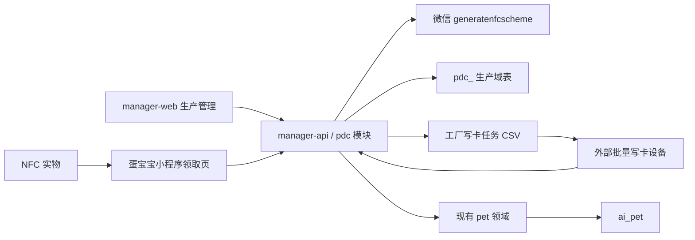
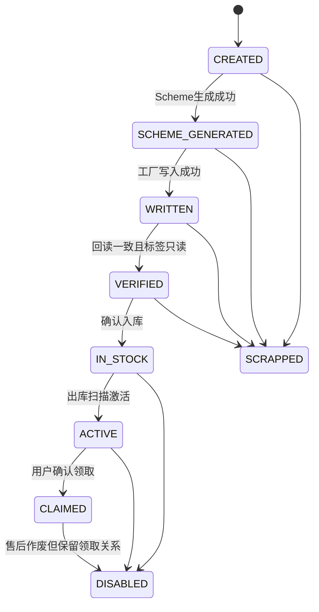
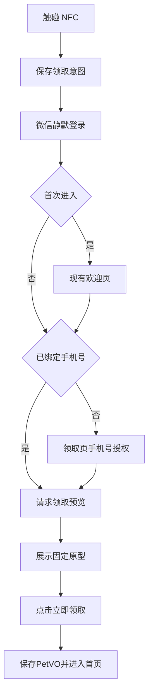

# 蛋宝宝 NFC 实物版功能规格

> 文档状态：评审稿
> 目标分支：`feature/egg-nfc`
> 工作目录：`/Users/minwang/codes/github/xiaozhi-esp32-server/.worktrees/egg-nfc`
> 编写日期：2026-07-29
> 适用范围：`manager-api`、`manager-web`、`egg-miniprogram`、工厂写卡和仓储操作
> 本文仅描述方案与验收标准，不包含实现代码。

## 1. 背景

当前蛋宝宝采用纯软件领取方式：

1. 用户打开微信小程序。
2. 完成微信登录和手机号绑定。
3. 输入邀请码。
4. 后端创建一只 `EGG` 状态的 `ai_pet`。
5. 用户完成孵化任务，破壳时再创建虚拟 `ai_device` 和 `ai_agent`。

本项目增加 NFC 实物版。用户购买内置 NFC 标签的蛋宝宝实物，手机触碰后由微信打开指定小程序页面。每件实物预先固定蛋宝宝原型，用户完成登录和手机号绑定后查看原型，并点击“立即领取”。

NFC 实物版与邀请码领取并行存在，不能破坏现有邀请码领养和孵化流程。

## 2. 已确认的产品决策

| 决策项 | 结论 |
|---|---|
| 领取保护 | 不使用隐藏码或订单校验，首位成功领取者获得商品 |
| 领取确认 | 展示商品原型后，由用户点击“立即领取” |
| 激活时机 | 仓库出库扫描后激活 |
| 转赠和换绑 | 第一版不支持 |
| 售后 | 作废旧实物并补发新实物，不解绑已创建的宠物 |
| 微信设备类型 | 所有蛋宝宝共用一个 `model_id` |
| 微信能力模式 | 一机一码，每件实物使用唯一 `sn` |
| 商品类型 | 第一版只有一个“蛋宝宝 NFC 实物”商品类型 |
| 蛋宝宝原型 | 每个批次和实物固定为锦鲤或玉兔 |
| 商品类型维护 | SQL 初始化，管理后台只读 |
| 管理后台 | 第一版包含最小生产、写卡、库存和激活页面 |
| 工厂写卡 | 使用工厂现有批量写卡设备，具体型号待确认 |
| 降级入口 | 不提供二维码或短领取码 |
| 数据表命名 | 生产、写卡、库存相关表统一使用 `pdc_` 前缀 |
| 管理端权限 | 生产和库存核心接口仅 `superAdmin` 可访问 |
| 小程序权限 | 领取预览和确认接口使用普通用户权限，不要求 `superAdmin` |

## 3. 当前代码基线与改造影响

- `app.js` 当前只保存启动 `path`，未保存 `query`；欢迎页重定向会丢失 NFC 参数。
- 邀请码页面调用 `POST /pet/adopt`，`PetServiceImpl.adopt()` 随机选择锦鲤或玉兔。
- 领养阶段只创建 `ai_pet`，破壳时才创建虚拟 `ai_device` 和 `ai_agent`。
- 当前身份模型支持一名用户拥有多只宠物。
- NFC 改造必须保持 `/pet/adopt`、邀请码核销、孵化时间模型、首页、欢迎页和手机号授权兼容。
- NFC 资产不得复用邀请码，也不得在领取阶段提前创建虚拟设备或智能体。

## 4. 目标与非目标

第一版目标：完成微信 NFC 接入、唯一 `sn/claimRef/Scheme`、生产写卡库存管理、冷暖启动领取、登录和手机号恢复、固定原型建蛋、并发一次领取及完整审计。

第一版不开发写卡器桌面软件，不接 ERP/WMS，不提供二维码或短码，不支持转赠换绑、动态加密标签、多个商品类型或多个 `model_id`。

## 5. 外部前置条件与占位符策略

### 5.1 当前未完成的外部条件

截至本文编写时，下列条件尚未完成：

1. 微信后台尚未添加“蛋宝宝 NFC 实物”设备类型，尚未取得 `model_id`。
2. 小程序发布版尚未包含 `/pages/nfc-claim/nfc-claim`。
3. 工厂批量写卡设备型号和导入导出能力尚未确认。

这些条件不阻塞数据库、服务端、管理后台和小程序代码开发，但阻塞正式 Scheme 生成和量产验收。

### 5.2 `model_id` 占位规则

- 本文使用 `<WECHAT_MODEL_ID_PENDING>` 表示尚未取得的正式值。
- 运行配置 `pdc.nfc.model-id=${PDC_NFC_MODEL_ID:}` 初始为空，管理后台显示“待微信审核配置”。
- 禁止向微信提交 `NULL`、空字符串或形如 `<...>` 的占位符。
- Scheme 生成入口在 `model_id` 未配置时必须快速失败，且不能创建虚假的 `SCHEME_GENERATED` 状态。
- 取得正式值后通过环境配置注入，不把环境值固化进 Liquibase。
- `model_id` 不是密钥，可以在只读管理页面展示；AppSecret 和 access token 不得展示。

### 5.3 领取页面占位规则

- 开发阶段可以先在 `feature/egg-nfc` 中增加领取页面和本地测试。
- 正式调用 `generatenfcscheme` 前，领取页面必须已存在于小程序发布版。
- 配置 `pdc.nfc.release-ready=false` 默认为未就绪；发布后由 superAdmin 登记版本号、发布时间和 smoke test 证据，再改为 `true`。
- 发布前通过功能开关禁止正式 Scheme 生成、出库激活和领取。
- 已生成的 NFC Scheme 可能长期存在，因此领取页面上线后不能随意删除。

## 6. 微信平台配置

### 6.1 准入条件

根据微信官方文档：

- 小程序必须是完成微信认证的国内非个人主体。
- 服务类目需要包含“工具—设备管理”。
- 在小程序管理后台“功能—硬件设备”开通硬件设备能力。
- 添加一种“蛋宝宝 NFC 实物”设备类型并通过审核。
- 审核通过后取得平台分配的 `model_id`。
- 在设备管理页申请“NFC 标签调起小程序”能力。
- 能力申请采用一机一码模式，每件商品传唯一 `sn`。

### 6.2 `generatenfcscheme`

服务端调用：

```text
POST https://api.weixin.qq.com/wxa/generatenfcscheme?access_token=ACCESS_TOKEN
```

请求逻辑：

```json
{
  "jump_wxa": {
    "path": "/pages/nfc-claim/nfc-claim",
    "query": "v=1&ref=<CLAIM_REF>",
    "env_version": "release"
  },
  "model_id": "<WECHAT_MODEL_ID_PENDING>",
  "sn": "<UNIQUE_WECHAT_SN>"
}
```

约束：

- 接口只能由可信服务端调用。
- 本接口不支持第三方平台代调用。
- `path` 和 `query` 必须分开传递。
- `query` 最大 1024 字符，领取标识采用无填充 Base64URL。
- 正式版使用 `env_version=release`。
- 微信返回的 `openlink` 是 NFC URI Record 的 Payload。
- NFC 专用 Scheme 不受普通 Scheme 30 天有效期限制，并允许多个用户访问。
- 服务端内部限速默认不高于每秒 80 次，低于微信每秒 100 次限制。
- 监控微信每日 Scheme 与 URL Link 总生成额度。

重点错误处理：

| 微信错误 | 处理 |
|---|---|
| 40002 | 未获 NFC 生成权限，停止任务 |
| 40165 | 小程序页面路径无效，停止任务 |
| 40212 | query 非法，停止任务 |
| 44990 | 超过秒级频率，降低速率后重试 |
| 44993 | 超过每日额度，暂停到下一额度周期 |
| 85079 | 小程序没有线上发布版，停止任务 |
| 9800003 | `model_id` 校验失败，停止任务 |
| 9800007 | `model_id` 尚未获得 NFC 能力，停止任务 |
| 9800008 | 一机一码模式未传 `sn`，停止任务 |
| 9800009 | 能力为一型一码却传入 `sn`，检查后台能力配置 |

### 6.3 NFC NDEF 格式

每张标签写入一个 NDEF Message，包含两条 Record：

1. URI Record
   - TNF：`0x01`
   - Type：`U`
   - Payload：微信返回的 `openlink`
2. Android Application Record
   - TNF：`0x04`
   - Type：`android.com:pkg`
   - Payload：`com.tencent.mm`

iOS 使用 URI Record；Android 还需要 AAR 指定微信包名。

## 7. 总体架构与领域边界



- `pdc` 领域拥有商品类型、生产批次、实物资产、写卡、库存、激活和领取核销。
- `pet` 领域拥有蛋宝宝创建、孵化和破壳后的虚拟设备与智能体。
- `pdc` 领取服务只能通过宠物领域的内部创建能力创建 `ai_pet`。
- 工厂只接收写卡任务，不接触微信 AppSecret、access token 或用户数据。
- `pdc` 表与用户、宠物表使用逻辑关联，不配置跨领域级联删除。

## 8. 数据模型

### 8.1 `pdc_nfc_product_type`

Liquibase 初始化唯一只读记录。字段包括 `id`、`type_code=EGG_BABY_NFC`、`type_name`、`claim_page_path=/pages/nfc-claim/nfc-claim`、`capability_mode=ONE_DEVICE_ONE_CODE`、`status` 和审计时间。有效 `model_id` 来自运行配置，并由管理接口组合展示。商品类型与宠物原型分离，批次指定锦鲤或玉兔。

### 8.2 `pdc_nfc_batch`

一个批次只能包含一个 SKU 和原型。字段包括唯一 `batch_no`、`product_type_id`、`sku_code`、`prototype`、`planned_quantity`、`status` 和审计字段。创建批次时在同一事务内批量分配全部 `CREATED` 资产；统计从资产和任务聚合，不作为独立事实源。

### 8.3 `pdc_nfc_asset`

一件实物一条记录。字段包括唯一 `asset_no`、`batch_id/item_no`、`sku_code/prototype`、唯一 `wechat_sn`、唯一 `claim_ref_hash`、`claim_ref_ciphertext`、`scheme_ciphertext`、可选 `tag_uid`、`status/version`、各状态时间、`claimed_user_id/pet_id`、业务单号和审计字段。

### 8.4 Scheme 任务

`pdc_nfc_scheme_job` 保存批次、状态、发起人、总数、成功/失败数和游标；`pdc_nfc_scheme_attempt` 保存资产、尝试次数、微信错误码、脱敏错误、请求指纹和时间。唯一约束阻止同一资产同时处于两个运行中任务，任务按游标断点恢复。

### 8.5 写卡任务

`pdc_nfc_write_job` 保存任务号、批次、格式版本、文件 SHA-256、行数、状态、统计和导入导出审计。`pdc_nfc_write_job_item` 是不可变快照，保存 `job_id/asset_id/sequence/wechat_sn/scheme_sha256`；同一资产同一时刻只能属于一个有效任务。

`pdc_nfc_write_record` 保存每次尝试的任务和资产、写入/回读结果、`tag_uid`、Record 数量、URI SHA-256、AAR、只读标志、错误和时间。

### 8.6 领取与管理幂等

`pdc_nfc_claim_record` 保存 `asset_id`、`user_id`、`request_id`、请求指纹、`pet_id`、结果和时间。成功领取的 `asset_id` 唯一，`(user_id, request_id)` 唯一。

`pdc_nfc_admin_request` 保存管理操作类型、`request_id`、请求指纹、原响应和状态，唯一约束为 `(operation_type, request_id)`，用于批量入库、激活、作废等超时重放。

### 8.7 `pdc_nfc_operation_log`

追加式记录操作人、请求和来源、关联对象、前后状态、数量、业务单号、结果、错误码和时间。不得保存完整领取标识、Scheme、access token 或 AppSecret。

## 9. 状态机

### 9.1 实物状态



规则：

- 只有 `ACTIVE` 可以领取。
- 只有 `VERIFIED` 可以入库。
- 只有 `IN_STOCK` 可以正常激活。
- `SCRAPPED` 不可恢复。
- `DISABLED` 不删除历史领取关系。
- 已领取实物作废时不解绑宠物。
- Scheme 和写卡失败保存在任务记录中，避免制造大量失败状态。

### 9.2 批次与任务状态

- 批次：`DRAFT → SCHEME_GENERATING → READY_FOR_WRITE → WRITING → READY_FOR_STOCK → COMPLETED → CLOSED`；只有无有效任务且无已领取资产时可取消。
- Scheme job：`PENDING → RUNNING → PARTIAL_SUCCESS/SUCCEEDED/FAILED/CANCELLED`，失败项通过新 job 重试。
- Write job：`CREATED → EXPORTED → RESULT_IMPORTED → COMPLETED`，未导入前可取消；导出快照和历史结果不可覆盖。
- 写入失败的资产保持 `SCHEME_GENERATED`；写入成功但回读失败且未锁卡的资产为 `WRITTEN`，可进入新返工任务；已锁错的资产必须 `SCRAPPED`。

### 9.3 并发领取

- `pdc_nfc_claim_record.asset_id` 唯一。
- `pdc_nfc_claim_record(user_id, request_id)` 唯一。
- 领取时对资产执行 `SELECT ... FOR UPDATE`。
- 相同用户重试返回同一只宠物。
- 不同用户并发时只允许一个事务成功。

## 10. 服务端接口

### 10.1 路由与权限隔离

管理端生产库存路由：

```text
/pdc/nfc/admin/**
```

所有核心接口使用：

```text
@RequiresPermissions("sys:role:superAdmin")
```

管理端 Controller 建议在类级统一标注该权限，避免新增方法时漏加。

小程序领取路由：

```text
/pdc/nfc/claim/**
```

使用：

```text
@RequiresPermissions("sys:role:normal")
```

领取 Controller 在类级统一标注普通用户权限。

小程序接口不要求 `superAdmin`，但确认领取必须校验手机号已绑定。

### 10.2 小程序领取接口

```text
POST /pdc/nfc/claim/preview
POST /pdc/nfc/claim/confirm
```

预览请求：

```json
{
  "claimRef": "<CLAIM_REF>"
}
```

预览只返回商品名称、原型、是否可领取、是否被本人领取和本人已有 `PetVO`。预览不得核销资产。

确认请求：

```json
{
  "claimRef": "<CLAIM_REF>",
  "requestId": "<UUID>"
}
```

确认响应返回 `claimStatus` 和 `PetVO`。

### 10.3 领取事务

1. 校验普通用户登录态和手机号绑定状态。
2. 对 `claimRef` 做 HMAC 并按摘要查询。
3. 使用 `SELECT ... FOR UPDATE` 锁定资产。
4. 先按 `(userId, requestId)` 查询历史结果；请求指纹和资产相同则重放原响应，不同则返回幂等冲突。
5. 资产为 `CLAIMED` 时，本人返回已有 `PetVO`，他人返回“已领取”。
6. 新领取必须校验资产为 `ACTIVE`。
7. 使用资产中的 `prototype` 创建宠物，插入领取记录并更新资产为 `CLAIMED`。
8. 同一数据库事务提交或回滚。

宠物领域需要提供内部共享能力：

```text
createEgg(userId, prototype)
```

- 邀请码领养仍随机选择原型后调用共享能力。
- NFC 领取使用资产固定原型。
- 两条路径都只创建 `EGG`，破壳时才创建虚拟设备和智能体。

### 10.4 管理端核心接口

商品类型：

```text
GET /pdc/nfc/admin/product-types
GET /pdc/nfc/admin/product-types/{id}
```

生产批次：

```text
POST /pdc/nfc/admin/batches
GET  /pdc/nfc/admin/batches
GET  /pdc/nfc/admin/batches/{id}
```

Scheme：

```text
POST /pdc/nfc/admin/batches/{id}/schemes/generate
GET  /pdc/nfc/admin/batches/{id}/schemes/progress
POST /pdc/nfc/admin/batches/{id}/schemes/retry
```

写卡任务：

```text
POST /pdc/nfc/admin/batches/{id}/write-jobs
GET  /pdc/nfc/admin/write-jobs/{id}/file
POST /pdc/nfc/admin/write-jobs/{id}/results
GET  /pdc/nfc/admin/write-jobs/{id}
```

库存和资产：

```text
POST /pdc/nfc/admin/assets/stock-in
POST /pdc/nfc/admin/assets/activate
POST /pdc/nfc/admin/assets/{id}/disable
POST /pdc/nfc/admin/assets/{id}/scrap
GET  /pdc/nfc/admin/assets
GET  /pdc/nfc/admin/assets/{id}
GET  /pdc/nfc/admin/assets/{id}/operation-logs
```

批量入库和激活必须携带业务单号及 `requestId`，单次最多 500 件。后端先全量校验，再在一个事务中全部更新；任一资产非法则整批不变并返回校验明细。相同操作类型、`requestId` 和请求指纹重放原响应，相同 `requestId` 不同正文返回冲突。

### 10.5 Scheme 异步任务

- 启动任务前必须同时满足：有效 `pdc.nfc.model-id`、`pdc.nfc.release-ready=true`、Scheme 功能开关开启。
- 批量生成不得占用单次管理端 HTTP 请求直到完成。
- 任务从数据库读取待处理资产，支持断点继续。
- 默认每秒最多调用微信 80 次。
- 网络超时、临时服务端错误采用指数退避和抖动重试。
- 参数、权限和 `model_id` 错误不盲目重试。
- 后台任务记录发起任务的 superAdmin 用户 ID。
- 单件失败不得导致整个批次回滚或从头生成。

## 11. 小程序改造

### 11.1 启动意图

新增统一待处理意图：

```text
type=NFC_CLAIM
version=1
claimRef
capturedAt
expiresAt
```

- `App.onLaunch(options)` 和 `App.onShow(options)` 都捕获 NFC 页面及 `query.ref`。
- 同时支持冷启动和暖启动。
- 意图保存在 `globalData` 并短期写入本地缓存。
- 缓存建议有效期 30 分钟。
- 新标签替换尚未提交的旧意图。
- 成功、取消或超时后立即清理。
- 不在日志和埋点中记录完整 `claimRef`。

### 11.2 登录和手机号恢复



欢迎页点击进入时：

- 存在有效 NFC 意图则进入领取页。
- 不存在时保持现有首页流程。

领取页自身提供手机号授权。拒绝授权不核销资产，用户可稍后重新触碰。

### 11.3 页面状态

新增：

```text
pages/nfc-claim/nfc-claim
```

页面状态：

- `BOOTSTRAPPING`
- `NEED_PHONE`
- `LOADING_PREVIEW`
- `READY`
- `SUBMITTING`
- `SUCCESS`
- `CLAIMED_BY_SELF`
- `CLAIMED_BY_OTHER`
- `UNAVAILABLE`
- `NETWORK_ERROR`

页面不展示完整领取标识、微信 `sn`、标签 UID、批次、库存或领取人信息。

### 11.4 确认领取

- 点击“立即领取”时生成 `requestId`。
- 同一次失败重试复用原 `requestId`。
- 提交期间禁用按钮。
- 成功后使用现有 `petStore.savePetFromVO()` 保存。
- 清理领取意图并进入蛋宝宝首页。
- 页面加载和预览绝不自动领取。

### 11.5 不使用 `wx.getNFCAdapter`

本功能由系统读取标签中的 Scheme 并调起微信，小程序不主动读取芯片，因此不使用 `wx.getNFCAdapter()`。

## 12. 管理后台

建议菜单：

```text
生产管理
├─ NFC 商品类型
├─ NFC 生产批次
├─ NFC 实物资产
├─ NFC 出库激活
└─ NFC 操作日志
```

### 12.1 前端权限

- 菜单和路由只对 `userInfo.superAdmin` 显示。
- 前端隐藏不替代后端 `superAdmin` 鉴权。
- 非 superAdmin 即使构造请求也不能读取或变更生产数据。

### 12.2 商品类型

- 只读展示固定商品类型。
- `model_id` 为空时显示“待微信审核配置”。
- 不提供新增、编辑、删除或启停操作。

### 12.3 生产批次

创建字段：

- 批次号
- 固定商品类型
- SKU 编码
- 原型：锦鲤或玉兔
- 计划数量
- 备注

列表展示 Scheme、写卡、验证、入库、激活、领取和报废统计。操作按钮必须随状态启用或禁用。

### 12.4 实物资产

支持按资产编号、`sn`、批次、SKU、原型、状态、业务单号、`petId/userId` 和时间查询。

- `claimRef` 永不展示。
- Scheme 默认不展示完整内容。
- 用户信息按现有规则脱敏。
- 详情展示完整状态流转和操作日志。

### 12.5 出库激活

- 扫码枪作为键盘输入设备扫描 `asset_no` 或 `wechat_sn`。
- 连续扫描、自动去重。
- 非 `IN_STOCK` 资产不得进入待激活清单。
- 提交前显示影响数量并二次确认。
- 后端再次校验，不能信任前端检查结果。

## 13. 工厂写卡契约

### 13.1 写卡任务

逻辑格式版本：`PDC_NFC_WRITE_V1`。采用 RFC 4180 CSV、UTF-8 编码并带 BOM。

```csv
format_version,job_no,batch_no,item_no,asset_no,wechat_sn,sku_code,prototype,uri_tnf,uri_type,uri_payload,aar_tnf,aar_type,aar_payload
PDC_NFC_WRITE_V1,WJ001,B001,000001,A001,SN001,KOI,锦鲤,0x01,U,"weixin://...",0x04,android.com:pkg,com.tencent.mm
```

规则：

- 只导出 `SCHEME_GENERATED` 且未进入其他有效任务的资产。
- 每次任务形成不可变快照。
- 服务端记录文件摘要、行数、导出人和时间。
- 相同任务重复下载内容和摘要一致。
- 文件包含完整 Scheme，下载必须由 superAdmin 发起并审计。
- 下载逐次鉴权，不进入静态目录；响应使用附件下载及 `Cache-Control: no-store, private`。
- 网关、APM 和业务日志禁止记录下载响应体、文件内容及 Scheme URL。
- 临时文件使用随机名和最小权限，按配置期限自动清理；工厂交接、留存期限和删除确认进入审计。

### 13.2 写卡结果

逻辑格式版本：`PDC_NFC_RESULT_V1`。

```csv
format_version,job_no,asset_no,wechat_sn,write_result,verify_result,tag_uid,ndef_record_count,uri_sha256,aar_package,is_read_only,written_at,error_code,error_message
PDC_NFC_RESULT_V1,WJ001,A001,SN001,SUCCESS,SUCCESS,04AABBCC,2,abc123...,com.tencent.mm,true,2026-08-01T10:20:30,,
```

进入 `VERIFIED` 必须满足：

- 写入成功。
- 逐卡回读成功。
- URI 摘要与原 Scheme 一致。
- AAR 为 `com.tencent.mm`。
- NDEF Record 数量正确。
- 标签已经设置为只读。

如果设备只能输出完整回读 URI，由适配器在内存中计算摘要，完整 URI 不写数据库和日志。

结果导入采用“先完整校验、后事务更新”：

- 严格匹配 `job_no` 和不可变 `pdc_nfc_write_job_item` 快照。
- `asset_no/wechat_sn` 必须成对一致，拒绝重复、额外、缺失和跨任务行。
- 保存结果文件 SHA-256 和唯一导入请求；相同文件重放原结果，不同正文冲突。
- 全量校验未通过时不得推进任何资产状态。

### 13.3 设备兼容性前置验证

最终写卡设备必须验证：

- 导入逐卡变化的 URI。
- 写入 URI Record 和 AAR。
- 逐卡回读和结果追溯。
- 导出逐卡成功或失败结果。
- 获取或计算回读 URI 摘要。
- 设置并确认只读状态。
- 错误定位到具体资产和 `sn`。
- 写卡吞吐满足预计产量。

不能逐卡回读和追溯的设备不得直接量产。

## 14. 安全设计

### 14.1 密钥和敏感字段

- `claimRef` 使用 CSPRNG 生成至少 128 位随机数，查询摘要使用独立密钥的 HMAC-SHA-256。
- 密文使用 AEAD（建议 AES-256-GCM）、每条随机 nonce，并绑定 `asset_id` 作为 AAD。
- 密文保存密钥版本，轮换期间支持双读；HMAC 密钥与加密密钥禁止复用。
- AppSecret、HMAC 密钥和字段加密密钥通过环境变量或安全配置中心注入。
- 完整 Scheme 仅在授权导出时解密，下载禁止公共缓存。

### 14.2 静态标签风险

静态 NDEF 标签可以被读取和复制。本产品已接受“首位成功领取者优先”的风险。

缓解措施：

- 出库前不可领取；只有 superAdmin 可以导出写卡任务和激活库存。
- 标签验证后锁定只读，写卡文件按最短周期保管并要求工厂删除。
- 激活尽量接近实际交付；未激活阶段被访问时告警并允许隔离资产。
- 按单资产限制轮询频率，同一资产短时间被多个用户访问时告警。

即使执行上述措施，供应链中提前复制 Scheme 的人仍可能在激活后抢先领取；这是选择静态标签和“首位领取者优先”后明确接受的剩余风险。

### 14.3 请求保护

小程序接口：

- 校验 `claimRef` 长度和字符集、`requestId` UUID。
- 预览和确认分别限流，连续无效标识触发临时限制。
- 错误信息不泄露批次、库存和用户身份。

管理端接口：

- 核心接口统一要求 `sys:role:superAdmin`。
- 批量生成、导出、导入、激活和作废记录操作人，后台任务保留发起人身份。

### 14.4 CSV 安全

- 只接受 `.csv`，限制大小、行数和字段长度，采用流式解析。
- 校验编码、版本和表头，拒绝重复资产、未知任务和跨批次数据。
- 导出字段进行公式注入防护，临时文件处理完成后清理。

## 15. 异常处理

| 场景 | 处理 |
|---|---|
| `model_id` 未配置 | 禁止生成 Scheme，显示待配置 |
| 领取页尚未发布 | 禁止正式生成 Scheme |
| 微信临时超时 | 保持原状态并安全重试 |
| 微信参数或权限错误 | 停止重试并在批次显示原因 |
| 写卡失败 | 记录失败，可创建后续重试任务 |
| 回读不一致 | 不得进入 `VERIFIED` |
| 标签锁错 | 标记 `SCRAPPED` 并创建新资产 |
| 未入库尝试激活 | 拒绝并审计 |
| 未激活标签被触碰 | 统一提示暂时无法领取 |
| 两用户并发领取 | 一个成功，另一个返回已领取 |
| 本人重复领取 | 返回原 `PetVO` |
| 宠物创建失败 | 事务回滚，资产保持 `ACTIVE` |
| 已领取实物售后作废 | 保留宠物和领取记录，禁用旧资产 |
| 非 superAdmin 调用管理接口 | 返回无权限，不改变数据 |

## 16. 监控与审计

监控 Scheme 成功率、耗时、微信错误码及秒/日调用量；监控写卡失败、回读不一致、报废率及验证—入库—激活—领取数量差异；监控领取冲突、无效请求、同一资产多用户访问、非 superAdmin 拒绝和异常批量操作。所有敏感操作必须形成可检索审计日志。

## 17. 测试与验收

### 17.1 后端

- 领取标识、HMAC、加解密、状态转换及非法状态拒绝。
- Scheme 请求、限速、重试和错误映射。
- CSV 转义、摘要、重复行和跨批次校验。
- 固定原型建蛋、本人重试、两用户并发和事务回滚。
- 管理接口 superAdmin、小程序接口 normal 及手机号检查。

### 17.2 小程序

- 冷暖启动捕获参数，欢迎页和手机号绑定后恢复意图。
- 意图过期、替换、清理及预览不核销。
- 防重复提交、重试复用 `requestId` 及各资产状态。
- 首页和邀请码领取回归。

### 17.3 管理后台

- superAdmin 菜单和路由、后端非 superAdmin 拒绝。
- 批次、Scheme 进度、写卡下载导入、扫码激活和商品类型只读。

### 17.4 真机和量产

- Android 微信 8.0.14+、iPhone XS+。
- 登录状态、手机号状态、资产状态和两台手机并发。
- 写入后、锁定后、装入外壳后及系统失败场景。
- 最终工厂设备批量写入、回读和结果导出。

项目自动化测试覆盖率继续遵守不低于 80% 的要求。

## 18. 发布和回滚

### 18.1 功能开关

- `pdc.nfc.enabled`
- `pdc.nfc.scheme-generation-enabled`
- `pdc.nfc.activation-enabled`
- `pdc.nfc.claim-enabled`

开关用于紧急控制，不能代替权限和状态校验。

### 18.2 发布顺序

1. 申请微信设备类型和 NFC 能力。
2. 执行 `pdc_` 数据库迁移和固定商品类型初始化。
3. 发布后端和管理页面，默认关闭 Scheme、激活和领取开关。
4. 发布包含 NFC 领取页的小程序并配置正式 `model_id`。
5. 小规模生成 Scheme，验证写卡设备和 Android/iOS 全链路。
6. 开启生产生成、入库、激活和领取，指标稳定后扩大批次。

### 18.3 回滚

- 关闭 Scheme 生成和出库激活；必要时关闭领取并显示服务暂不可用。
- 已生成 Scheme 指向的页面不能删除；未领取资产可以批量禁用。
- 已领取资产不回滚宠物、不删除记录，数据库不做破坏性回滚。
- 修复后从状态断点恢复，使用 `query.v=1` 兼容旧标签。

## 19. 上线验收门槛

以下条件全部满足后才允许量产：

- 正式 `model_id`、一机一码能力和发布版领取页均已就绪。
- Scheme 生成、配额监控和真实标签容量通过验证。
- 写卡设备支持逐卡写入、回读、追溯和锁卡。
- Android/iPhone、superAdmin 权限和并发领取验证通过。
- 邀请码回归通过，试产批次数量完全一致。

## 20. 官方参考

- [微信硬件设备接入指引](https://developers.weixin.qq.com/miniprogram/dev/framework/device/device-access.html)
- [NFC 标签打开小程序](https://developers.weixin.qq.com/miniprogram/dev/framework/open-ability/NFC.html)
- [获取 NFC 的小程序 Scheme](https://developers.weixin.qq.com/miniprogram/dev/server/API/qrcode-link/url-scheme/api_generatenfcscheme.html)
