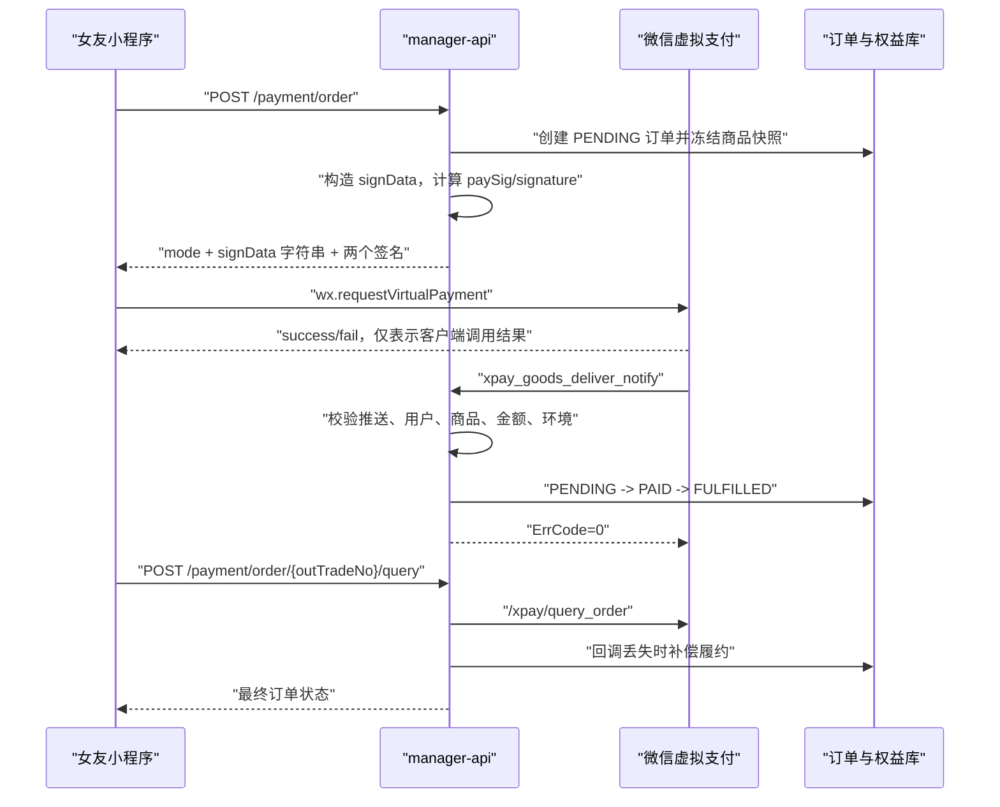

# 女友小程序微信虚拟支付改造规格

**状态：** 已确认，可进入实施

**日期：** 2026-07-23

**适用项目：** `xiaozhi-esp32-server` 的 `main/miniprogram` 与 `main/manager-api`

**官方基线：** [微信小程序虚拟支付开发指引](https://developers.weixin.qq.com/miniprogram/dev/platform-capabilities/business-capabilities/virtual-payment.html)

## 1. 目标

将女友小程序中订阅套餐和虚拟道具的支付方式，从微信支付 V3 JSAPI 的 `wx.requestPayment` 改造为微信小程序官方虚拟支付 `wx.requestVirtualPayment`，同时保留现有统一订单、订阅/道具履约、查单补偿和退款审计能力。

本方案的核心结果是：

- Android、鸿蒙、Windows 端不再使用 JSAPI 购买虚拟商品。
- iOS 端不允许回退到 JSAPI；完成微信 iOS 虚拟支付开通与适配前，购买入口必须关闭。
- 支付模式采用道具直购 `short_series_goods`，不引入代币账户。
- 微信支付成功消息和主动查单共同保证最终履约，前端 `success` 只作为交互信号。
- 所有支付参数由后端生成并签名，小程序不持有 AppKey、session_key 或 AppSecret。
- 历史 `WECHAT_JSAPI` 订单继续可查，不迁改历史交易数据。

## 2. 范围与非目标

### 2.1 本期范围

- 订阅套餐购买：固定期限权益，仍是一次性虚拟商品，不是自动续费。
- 虚拟道具购买：当前背包 SKU。
- 虚拟支付商品映射、下单签名、客户端拉起支付。
- `xpay_goods_deliver_notify` 发货推送。
- `/xpay/query_order` 主动查单和定时补偿。
- `/xpay/notify_provide_goods` 异常补发确认。
- `/xpay/refund_order`、退款状态查询和 `xpay_refund_notify`。
- 投诉、风控消息留档和告警，不在回调线程内自动处罚用户权益。
- 沙箱、灰度、生产切换以及 JSAPI 入口下线。

### 2.2 非目标

- 不接入 `short_series_coin`，不建设代币余额、充值和扣减账本。
- 不实现自动续费订阅。
- 不在本期重做套餐、背包、订单页面视觉设计。
- 不删除微信支付 V3 SDK和历史 JSAPI 代码；生产虚拟商品入口完成切换后将其标记为历史兼容代码。
- 不引入 CloudBase。当前项目已具备 Spring Boot 后端、MySQL 和 Redis，继续沿用现有架构。

## 3. 当前链路与改造差异

### 3.1 当前链路

当前订阅页和背包页均执行：

1. `POST /payment/order` 创建本地订单。
2. 后端调用微信支付 V3 JSAPI 预下单并返回 `prepayParams`。
3. 小程序调用 `wx.requestPayment`。
4. 前端主动查单，后端通过 V3 查单或 V3 回调确认付款。
5. `FulfillmentDispatcherImpl` 发放订阅或道具。

关键文件：

- `main/miniprogram/pages/subscription/subscription.js`
- `main/miniprogram/pages/backpack/backpack.js`
- `main/manager-api/src/main/java/xiaozhi/modules/payment/service/impl/PaymentOrderServiceImpl.java`
- `main/manager-api/src/main/java/xiaozhi/modules/payment/wechat/WechatPayV3Client.java`
- `main/manager-api/src/main/java/xiaozhi/modules/payment/service/impl/PaymentNotifyServiceImpl.java`
- `main/manager-api/src/main/java/xiaozhi/modules/payment/service/impl/FulfillmentDispatcherImpl.java`

### 3.2 目标链路



与 JSAPI 的主要差异：

| 维度 | 当前 JSAPI | 目标虚拟支付 |
| --- | --- | --- |
| 客户端 API | `wx.requestPayment` | `wx.requestVirtualPayment` |
| 下单 | 后端调用 V3 prepay | 客户端 API 内部完成微信侧下单 |
| 商品 | 微信只校验金额 | 必须使用已发布的虚拟商品 `productId` |
| 价格 | 传订单总金额 | 同时传商品原价和可选优惠实付单价 |
| 签名 | V3 RSA 签名 | AppKey HMAC-SHA256 + session_key HMAC-SHA256 |
| 回调 | 微信支付 V3 JSON 通知 | 小程序事件推送 `xpay_goods_deliver_notify` |
| 发货确认 | 本地履约即可 | 回调成功响应，异常时调用 `notify_provide_goods` |
| 退款 | 微信支付 V3 refund | XPay `refund_order`，异步完成后查单/接收退款推送 |

## 4. 已确定的产品决策

### 4.1 使用道具直购

订阅和背包 SKU 都映射为微信虚拟支付后台的“道具”，客户端固定使用：

```text
mode = short_series_goods
```

不使用代币模式的原因：

- 现有产品不存在代币钱包。
- 代币模式会增加余额、充值、扣减、赠送、退款账本和展示义务。
- 订阅与道具均可直接映射到已发布的虚拟商品。

### 4.2 订阅不是自动续费

现有订阅是购买固定天数的虚拟权益。微信后台中的商品名称、说明和有效期必须与小程序展示一致，禁止使用“连续包月”“自动续费”等容易误导的描述。

### 4.3 保留升级折抵，但改为官方优惠价语义

微信参数含义：

- `goodsPrice`：微信虚拟支付后台配置的道具原始单价，单位分。
- `activitySellingPrice`：可选的实际优惠单价，单位分；传入后成为实际下单价。

因此现有套餐升级折抵按以下方式迁移：

- `goodsPrice = plan.price_fen`
- 正常促销购买：`activitySellingPrice = plan.promo_price_fen`
- 升级折抵：`activitySellingPrice = 当前算法算出的最终实付金额`
- 数量固定为 `1`
- 本地 `amount_fen = activitySellingPrice`

当没有优惠时不传 `activitySellingPrice`。最终实付价必须大于 0；当前“折抵覆盖全部价格时支付 1 分”的规则可以保留，但需要在微信沙箱验证该商品是否允许 1 分优惠下单。若沙箱返回价格或风控错误，则改为“折抵覆盖全部价格时不发起支付，生成零元权益变更单”，零元单不能伪装成虚拟支付订单。

背包 SKU 按单价处理：

- `goodsPrice = sku.price_fen`
- 有促销价时 `activitySellingPrice = sku.promo_price_fen`
- `buyQuantity = quantity`
- `amount_fen = 实付单价 × quantity`

微信后台原价与数据库 `price_fen` 必须一致。价格变更顺序固定为：先在微信虚拟支付后台更新并发布，再更新业务数据库并放量。

### 4.4 不回退到 JSAPI

生产环境中，任何不支持或尚未获准接入虚拟支付的平台都必须显示“当前设备暂不支持购买”，不能回退到 `wx.requestPayment`。已经购买的权益和道具仍可正常使用。

## 5. 微信侧开通与运营配置

上线前由小程序管理员在小程序管理后台完成：

1. 进入“虚拟支付”并完成资质、二级商户号、签约和账户验证。
2. 在“基本配置”取得：
   - AppID
   - OfferID
   - 沙箱 AppKey
   - 现网 AppKey
3. 在“道具管理”分别为订阅套餐和背包 SKU 建立商品。
4. 先发布开发/沙箱商品，完成验收后再发布现网商品。
5. 配置发货推送地址，建议 JSON 格式：

```text
https://<API_PUBLIC_HOST>/xiaozhi/payment/notify/virtual
```

6. 若管理后台要求消息服务器安全参数，同时配置 Token、EncodingAESKey 和安全模式；后端必须按相同模式验签和解密。
7. 为 iOS 单独完成官方 iOS 虚拟支付开通和适配。未完成前保持 iOS 购买开关关闭。

商品发布后通常存在生效延迟。官方客户端错误码 `-15014` 表示道具发布尚未生效，发布后至少预留 10 分钟再验证。

## 6. 必需参数、变量和密钥

### 6.1 部署环境变量

| 环境变量 | 必填环境 | 是否敏感 | 示例/取值 | 用途 |
| --- | --- | --- | --- | --- |
| `WECHAT_MINIPROGRAM_APPID` | 沙箱、生产 | 否 | 小程序 AppID | 登录、access_token、虚拟支付身份 |
| `WECHAT_MINIPROGRAM_SECRET` | 沙箱、生产 | 是 | 小程序 AppSecret | `code2Session` 和获取 access_token |
| `WECHAT_VIRTUAL_PAY_ENABLED` | 全部 | 否 | `true` / `false` | 加载并校验虚拟支付集成；产生首笔订单后不能用作回滚开关 |
| `WECHAT_VIRTUAL_PAY_NEW_ORDER_ENABLED` | 全部 | 否 | `true` / `false` | 新订单开关；灰度和紧急止损只关闭此项 |
| `WECHAT_VIRTUAL_PAY_ENV` | 全部 | 否 | `0` 现网，`1` 沙箱 | 决定签名 AppKey 和请求环境 |
| `WECHAT_VIRTUAL_PAY_OFFER_ID` | 沙箱、生产 | 否 | 管理后台 OfferID | `signData.offerId` |
| `WECHAT_VIRTUAL_PAY_APP_KEY` | 生产 | 是 | 现网 AppKey | `env=0` 的支付签名 |
| `WECHAT_VIRTUAL_PAY_SANDBOX_APP_KEY` | 沙箱 | 是 | 沙箱 AppKey | `env=1` 的支付签名 |
| `WECHAT_VIRTUAL_PAY_NOTIFY_URL` | 沙箱、生产 | 否 | 公网 HTTPS 回调地址 | 启动校验和运维核对 |
| `WECHAT_VIRTUAL_PAY_NOTIFY_TOKEN` | 条件必填 | 是 | 管理后台消息 Token | 推送验签 |
| `WECHAT_VIRTUAL_PAY_NOTIFY_AES_KEY` | 条件必填 | 是 | 43 字符 EncodingAESKey | 安全模式推送解密 |
| `WECHAT_VIRTUAL_PAY_NOTIFY_FORMAT` | 全部 | 否 | `JSON`，或平台实际配置值 | 控制请求解析与响应格式 |
| `WECHAT_VIRTUAL_PAY_IOS_ENABLED` | 全部 | 否 | 默认 `false` | iOS 完成官方适配后才开启 |
| `WECHAT_SESSION_KEY_ENCRYPTION_KEY` | 沙箱、生产 | 是 | Base64 编码的 32 字节随机密钥 | AES-256-GCM 加密 session_key |
| `WECHAT_VIRTUAL_PAY_CONNECT_TIMEOUT_MS` | 可选 | 否 | `3000` | 调用微信服务端接口连接超时 |
| `WECHAT_VIRTUAL_PAY_READ_TIMEOUT_MS` | 可选 | 否 | `5000` | 调用微信服务端接口读取超时 |

安全约束：

- AppKey、AppSecret、session_key 加密密钥、Token、EncodingAESKey 不得写入 Git、数据库系统参数明文或日志。
- 现网进程不得在 `WECHAT_VIRTUAL_PAY_ENV=1` 下启动。
- `WECHAT_VIRTUAL_PAY_ENABLED=true` 时，当前环境对应的 AppKey、OfferID、AppID、AppSecret 和 session_key 加密密钥必须全部存在，否则启动失败。
- `WECHAT_VIRTUAL_PAY_NEW_ORDER_ENABLED=true` 时必须同时满足 `WECHAT_VIRTUAL_PAY_ENABLED=true`。
- 首笔虚拟支付订单产生后，处理服务保持 `WECHAT_VIRTUAL_PAY_ENABLED=true`；紧急停止销售只把 `WECHAT_VIRTUAL_PAY_NEW_ORDER_ENABLED` 设为 `false`。
- AppKey 轮换时先关闭新订单、等待已签发参数支付完成或订单过期，再更新环境变量并恢复新订单。
- session_key 加密密钥轮换后，旧密文不再解密，受影响用户在下次支付前通过 `wx.login` 刷新登录态。

建议配置结构：

```yaml
wechat:
  miniprogram:
    appid: ${WECHAT_MINIPROGRAM_APPID:}
    secret: ${WECHAT_MINIPROGRAM_SECRET:}
  virtual-pay:
    enabled: ${WECHAT_VIRTUAL_PAY_ENABLED:false}
    new-order-enabled: ${WECHAT_VIRTUAL_PAY_NEW_ORDER_ENABLED:false}
    env: ${WECHAT_VIRTUAL_PAY_ENV:1}
    offer-id: ${WECHAT_VIRTUAL_PAY_OFFER_ID:}
    app-key: ${WECHAT_VIRTUAL_PAY_APP_KEY:}
    sandbox-app-key: ${WECHAT_VIRTUAL_PAY_SANDBOX_APP_KEY:}
    notify-url: ${WECHAT_VIRTUAL_PAY_NOTIFY_URL:}
    notify-token: ${WECHAT_VIRTUAL_PAY_NOTIFY_TOKEN:}
    notify-aes-key: ${WECHAT_VIRTUAL_PAY_NOTIFY_AES_KEY:}
    notify-format: ${WECHAT_VIRTUAL_PAY_NOTIFY_FORMAT:JSON}
    ios-enabled: ${WECHAT_VIRTUAL_PAY_IOS_ENABLED:false}
    connect-timeout-ms: ${WECHAT_VIRTUAL_PAY_CONNECT_TIMEOUT_MS:3000}
    read-timeout-ms: ${WECHAT_VIRTUAL_PAY_READ_TIMEOUT_MS:5000}
    session-key-encryption-key: ${WECHAT_SESSION_KEY_ENCRYPTION_KEY:}
```

### 6.2 商品映射参数

每个可售套餐和 SKU 必须补充：

| 字段 | 类型 | 规则 |
| --- | --- | --- |
| `virtual_product_id` | `VARCHAR(64)` | 与微信虚拟支付后台已发布的道具 ID 完全一致 |
| `price_fen` | `BIGINT` | 与微信后台商品原价一致 |
| `promo_price_fen` | `BIGINT NULL` | 小于原价时作为 `activitySellingPrice` |
| `status` | `TINYINT` | 只有业务启用且微信商品已发布时才可售 |

`virtual_product_id` 不由客户端提交。后端只能根据 `productType + productRefId` 从受信任数据库读取。

按 `202606101030.sql` 的当前种子数据，微信后台建品与回填清单如下。各环境数据库若已调整价格，以上线环境实际数据为准，发布前重新导出核对：

| 业务类型 | 业务编码 | 商品名称 | 原价（分） | 促销价（分） | 微信 `productId` 的取得方式 |
| --- | --- | --- | ---: | ---: | --- |
| 订阅 | `silver` | 心动互联（30 天） | 1990 | 990 | 在虚拟支付后台创建并发布同价道具后回填 |
| 订阅 | `gold` | 黄金月卡（30 天） | 3990 | 1990 | 在虚拟支付后台创建并发布同价道具后回填 |
| 道具 | `occupation_change` | 身份变更 | 29900 | 无 | 在虚拟支付后台创建并发布同价道具后回填 |
| 道具 | `soul_quirk_change` | 灵魂变更 | 9900 | 无 | 在虚拟支付后台创建并发布同价道具后回填 |
| 道具 | `voice_clone_quota` | 声音克隆额度 | 29900 | 无 | 在虚拟支付后台创建并发布同价道具后回填 |
| 道具 | `outfit_office` | OL 职场套装 | 800 | 无 | 在虚拟支付后台创建并发布同价道具后回填 |
| 道具 | `rose` | 玫瑰花 | 200 | 无 | 在虚拟支付后台创建并发布同价道具后回填 |
| 道具 | `milktea` | 奶茶 | 500 | 无 | 在虚拟支付后台创建并发布同价道具后回填 |
| 道具 | `diamond_ring` | 挚爱钻戒 | 9900 | 无 | 在虚拟支付后台创建并发布同价道具后回填 |

促销价不替代微信后台原价：微信商品仍按 `price_fen` 配置，业务促销通过 `activitySellingPrice` 传入。

## 7. `wx.requestVirtualPayment` 合同

官方要求基础库 2.19.2 及以上。当前 `main/miniprogram/project.config.json` 的 `libVersion` 为 `3.16.0`，满足要求，但仍需运行时检查：

```javascript
wx.canIUse('requestVirtualPayment')
```

后端返回：

```json
{
  "outTradeNo": "PG20260723153000AbCdEf12345678",
  "amountFen": 1800,
  "payChannel": "WECHAT_VIRTUAL",
  "virtualPayParams": {
    "mode": "short_series_goods",
    "signData": "{\"offerId\":\"...\",\"buyQuantity\":1,\"env\":1,\"currencyType\":\"CNY\",\"productId\":\"...\",\"goodsPrice\":3000,\"activitySellingPrice\":1800,\"outTradeNo\":\"PG...\",\"attach\":\"...\"}",
    "paySig": "64位十六进制字符串",
    "signature": "64位十六进制字符串"
  }
}
```

客户端必须原样传递后端返回的 `signData` 字符串：

```javascript
wx.requestVirtualPayment({
  mode: virtualPayParams.mode,
  signData: virtualPayParams.signData,
  paySig: virtualPayParams.paySig,
  signature: virtualPayParams.signature,
})
```

### 7.1 `signData` 字段

| 字段 | 类型 | 必填 | 本项目规则 |
| --- | --- | --- | --- |
| `offerId` | string | 是 | 来自 `WECHAT_VIRTUAL_PAY_OFFER_ID` |
| `buyQuantity` | number | 是 | 订阅固定 1；道具为订单数量 |
| `env` | number | 否 | 后端固定注入，生产 0、沙箱 1 |
| `currencyType` | string | 是 | 固定 `CNY` |
| `productId` | string | 道具直购必填 | 来自商品表 `virtual_product_id` |
| `goodsPrice` | number | 道具直购必填 | 微信后台原始单价，单位分 |
| `activitySellingPrice` | number | 否 | 有促销或折抵时的实际单价 |
| `outTradeNo` | string | 是 | 8–32 字符，只含数字、大小写字母及 `_-|*@`，且不能以下划线开头 |
| `attach` | string | 是 | 后端生成的随机发货关联令牌，不放用户 ID 或敏感信息 |

`mode`、`paySig` 和 `signature` 不属于 `signData` JSON。

### 7.2 签名

支付签名：

```text
paySig = hex_lower(HMAC-SHA256(appKey, "requestVirtualPayment&" + signData))
```

用户态签名：

```text
signature = hex_lower(HMAC-SHA256(session_key, signData))
```

必须保证：

- 参与两个签名的 `signData` 与返回给小程序的字符串逐字节一致。
- JSON 只序列化一次，禁止签名后再次 parse/stringify。
- 明确固定字段顺序，使用 UTF-8、无 BOM、紧凑 JSON。
- `env=0` 使用现网 AppKey，`env=1` 使用沙箱 AppKey。
- HMAC 输出为小写十六进制。

### 7.3 客户端错误处理

| 错误码 | 客户端行为 | 服务端/运维动作 |
| --- | --- | --- |
| `-2` | 显示“已取消支付”，保留待支付订单 | 不履约 |
| `-15002` | 重新调用创建订单接口，禁止复用单号 | 记录重复单号告警 |
| `-15005` | 刷新微信登录后只允许创建新订单重试 | 排查 session_key 生命周期 |
| `-15006` | 提示系统繁忙 | 检查 AppKey、env、序列化字节 |
| `-15007` | 执行 `wx.login` + `/wechat/login`，创建新订单重试 | 旧订单等待查单/超时 |
| `-15010` / `-15014` / `-15018` | 提示商品暂不可购买 | 下架业务商品并告警运营 |
| `-15011` | 禁止继续支付 | 修正现网 `env` |
| `-15013` | 提示价格配置异常 | 比对微信后台原价与 `price_fen` |
| `-4` / `-15017` / `-15019` / `-15021` | 展示合规提示，禁止自动重试 | 触发支付风控告警 |

任何 `fail` 都不得直接把本地订单标为失败或取消，因为客户端回调可能与真实支付状态不一致。

## 8. 后端 API 设计

### 8.1 业务 API

| 方法 | 路径 | 认证 | 说明 |
| --- | --- | --- | --- |
| `GET` | `/payment/capabilities` | 登录 | 返回当前平台是否允许购买、最低基础库和 iOS 开关 |
| `POST` | `/payment/order` | 登录 | 创建订单并返回虚拟支付参数 |
| `GET` | `/payment/order/{outTradeNo}` | 登录且订单归属校验 | 读取本地最终状态 |
| `POST` | `/payment/order/{outTradeNo}/query` | 登录且订单归属校验 | 调微信查单并补偿履约 |
| `POST` | `/payment/order/{outTradeNo}/cancel` | 登录且订单归属校验 | 只取消本地未支付单；虚拟支付没有对应关单 API 时不调用 V3 关单 |
| `POST` | `/payment/refund` | 后台权限 `payment:refund` | 发起虚拟支付退款 |
| `POST` | `/payment/notify/virtual` | 匿名但强验签 | 接收发货、退款、投诉、风控事件 |

`POST /payment/order` 继续复用原路径，便于页面平滑迁移。响应新增 `virtualPayParams`，历史 `prepayParams` 仅保留给非生产兼容测试，生产虚拟商品链路不得返回 JSAPI 参数。

创建订单请求保持为：

```json
{
  "productType": "SUBSCRIPTION",
  "productRefId": 1,
  "quantity": 1
}
```

| 字段 | 来源 | 校验 |
| --- | --- | --- |
| `productType` | 小程序 | 只允许 `SUBSCRIPTION` / `ITEM` |
| `productRefId` | 小程序 | 必须存在、启用且具备 `virtual_product_id` |
| `quantity` | 小程序 | 订阅强制为 1；道具范围 1–99 |

客户端不得提交 `productId`、价格、OfferID、环境、openid 或优惠金额；这些值全部由后端从登录态、配置和数据库商品快照计算。

后台退款请求为：

```json
{
  "orderId": 12345,
  "refundFen": 1800,
  "refundReason": 3,
  "reqFrom": 1
}
```

其中 `refundReason` 只允许官方枚举 `0..5`，`reqFrom` 只允许 `1..3`。openid、支付单号、当前可退金额、退款单号和环境由服务端确定。

### 8.2 微信服务端 API

#### 查询订单

```text
POST https://api.weixin.qq.com/xpay/query_order
  ?access_token=<ACCESS_TOKEN>
  &pay_sig=<PAY_SIG>
```

请求体：

```json
{
  "openid": "用户 openid",
  "env": 1,
  "order_id": "业务 outTradeNo"
}
```

`order_id` 与 `wx_order_id` 二选一。支付签名为：

```text
pay_sig = hex_lower(HMAC-SHA256(appKey, "/xpay/query_order&" + exactPostBody))
```

重点状态：

- `2`：已支付，待发货。
- `3`：发货中。
- `4`：已发货。
- `5`：订单已退款。
- `6`：订单已关闭。
- `7`：退款失败。
- `8`：用户退款完成。

查单后必须校验 `order_fee`、`paid_fee`、`order_id`、`wx_order_id` 和环境，再推进本地状态。

#### 启动退款

```text
POST https://api.weixin.qq.com/xpay/refund_order
  ?access_token=<ACCESS_TOKEN>
  &pay_sig=<PAY_SIG>
```

请求体：

```json
{
  "openid": "下单 openid",
  "order_id": "原支付单号",
  "refund_order_id": "8到32位退款单号",
  "left_fee": 1800,
  "refund_fee": 1800,
  "biz_meta": "{\"operatorId\":123,\"reasonCode\":\"USER_REQUEST\"}",
  "refund_reason": "3",
  "req_from": "1",
  "env": 1
}
```

规则：

- 发起退款前先调用 `query_order` 获取最新 `left_fee`。
- `refund_fee` 必须满足 `0 < refund_fee <= left_fee`。
- `refund_order_id` 只含字母、数字、下划线和连字符。
- 启动任务成功不代表退款完成；以退款推送或后续查单最终状态为准。
- 官方 `refund_order` 页面当前的 Query 参数表只列出 `access_token` 和 `pay_sig`，但注意事项写明“使用用户态签名与支付签名”。实施时必须先在沙箱抓取实际请求合同：若接口要求 `signature`，按 `HMAC-SHA256(session_key, exactPostBody)` 放入微信要求的 Query 参数；不得凭经验更改签名正文。

#### 通知已发货

当本地已履约但回调响应失败、导致微信侧仍未记为已发货时调用：

```text
POST https://api.weixin.qq.com/xpay/notify_provide_goods?access_token=<ACCESS_TOKEN>
```

请求体：

```json
{
  "order_id": "业务 outTradeNo",
  "env": 1
}
```

`order_id` 与 `wx_order_id` 二选一。正常处理 `xpay_goods_deliver_notify` 并成功返回后不调用该接口。

### 8.3 access_token

新增统一 `WechatAccessTokenService`：

- 使用现有 AppID/AppSecret 获取小程序 access_token。
- Redis Key：`wechat:access-token:{appid}`。
- 缓存 TTL 使用微信返回 `expires_in - 300 秒`，最低不小于 60 秒。
- Redis 未命中时使用分布式锁，避免并发刷新。
- 微信接口返回 token 失效错误时只允许刷新并重放一次。
- 禁止在日志和异常响应中打印 access_token。

## 9. 数据模型

新增 Liquibase changeSet，不修改已有 SQL 文件。

### 9.1 商品表

```sql
ALTER TABLE ai_subscription_plan
    ADD COLUMN virtual_product_id VARCHAR(64) NULL COMMENT '微信虚拟支付道具ID';

ALTER TABLE ai_item_sku
    ADD COLUMN virtual_product_id VARCHAR(64) NULL COMMENT '微信虚拟支付道具ID';
```

迁移阶段允许 `NULL`，但虚拟支付开启后，可售商品必须非空。启动检查扫描所有 `status=1` 的套餐和 SKU，缺少映射时拒绝开启真实支付。

### 9.2 订单表

```sql
ALTER TABLE ai_payment_order
    ADD COLUMN virtual_product_id VARCHAR(64) NULL COMMENT '下单时虚拟商品ID快照',
    ADD COLUMN virtual_env TINYINT NULL COMMENT '0现网 1沙箱',
    ADD COLUMN virtual_attach VARCHAR(128) NULL COMMENT '发货推送关联令牌',
    ADD COLUMN wx_order_id VARCHAR(64) NULL COMMENT '虚拟支付微信内部单号',
    ADD COLUMN signed_payload_hash CHAR(64) NULL COMMENT 'signData SHA-256，不存签名原文',
    MODIFY COLUMN transaction_id VARCHAR(64) NULL COMMENT '微信支付交易号';

CREATE INDEX idx_payment_order_wx_order_id
    ON ai_payment_order (wx_order_id);
```

沿用字段：

- `out_trade_no`：传给 `signData.outTradeNo`。
- `transaction_id`：保存 `WeChatPayInfo.TransactionId` 或查单返回 `wxpay_order_id`。
- `prepay_id`：只服务历史 JSAPI 订单，虚拟支付订单保持 `NULL`。
- `pay_channel`：新增值 `WECHAT_VIRTUAL`，保留 `WECHAT_JSAPI` 和 `MOCK`。

### 9.3 退款表

```sql
ALTER TABLE ai_payment_refund
    ADD COLUMN refund_wx_order_id VARCHAR(64) NULL COMMENT '虚拟支付退款微信侧单号',
    ADD COLUMN pay_wx_order_id VARCHAR(64) NULL COMMENT '原支付单微信侧单号',
    ADD COLUMN left_fee_snapshot BIGINT NULL COMMENT '退款发起时可退金额快照',
    ADD COLUMN channel_response_hash CHAR(64) NULL COMMENT '脱敏渠道响应SHA-256';
```

### 9.4 回调日志

现有回调日志会保存完整原始头和原始 Body。虚拟支付回调含 openid、订单和投诉信息，改造后：

- `raw_headers` 只保存允许列表字段，Token、签名和 access_token 必须脱敏。
- `raw_body` 保存脱敏 JSON/XML；openid 仅保留哈希或末四位。
- 增加 `event_type`、`event_id`、`raw_body_hash`。
- 建立 `(channel, event_type, event_id)` 唯一键；没有官方事件 ID 时，用规范化事件关键字段计算 SHA-256 作为 `event_id`。

## 10. session_key 生命周期与安全

虚拟支付的 `signature` 必须使用当前用户有效的 session_key。当前项目把 session_key 明文保存到 `ai_wechat_user.session_key`，本次改造必须同时修复。

目标规则：

- `WechatServiceImpl` 收到 `code2Session` 结果后，使用 AES-256-GCM 加密再入库。
- 密文格式固定为 `v1:<base64(nonce || ciphertext || tag)>`。
- 每次加密使用新的 12 字节随机 nonce。
- `WECHAT_SESSION_KEY_ENCRYPTION_KEY` 必须是 Base64 编码的 32 字节随机值。
- 只在生成用户态签名的短生命周期方法中解密，不返回前端，不写日志。
- 旧明文行不自动猜测或批量加密；读取到非 `v1:` 格式时返回“微信登录态需要刷新”。
- 小程序付款前执行 `wx.checkSession`。失败时调用 `wx.login` 和现有 `/wechat/login`，然后重新创建支付订单。
- 微信返回 `-15007` 时同样刷新登录并创建新单，绝不复用旧 `outTradeNo`。

## 11. 回调、履约与幂等

### 11.1 发货推送字段

`xpay_goods_deliver_notify` 关键字段：

- `OpenId`
- `OutTradeNo`
- `Env`
- `WeChatPayInfo.MchOrderNo`
- `WeChatPayInfo.TransactionId`
- `WeChatPayInfo.PaidTime`
- `GoodsInfo.ProductId`
- `GoodsInfo.Quantity`
- `GoodsInfo.OrigPrice`
- `GoodsInfo.ActualPrice`
- `GoodsInfo.Attach`

处理顺序：

1. 验证微信消息推送签名；安全模式下先验签再解密。
2. 解析 JSON 或 XML，拒绝未知 `Event`。
3. 以 `OutTradeNo` 读取本地订单并锁定。
4. 校验 `pay_channel=WECHAT_VIRTUAL`。
5. 校验 `OpenId` 属于订单用户。
6. 校验 `Env`、`ProductId`、`Quantity`、`Attach` 与订单快照一致。
7. 校验 `ActualPrice == amount_fen`。
8. 校验原始价格与订单签名快照一致；微信后台已负责校验单价，本地仍保存不一致审计。
9. 原子推进 `PENDING -> PAID`。
10. 调用现有 `FulfillmentDispatcherImpl`。
11. 原子推进 `PAID -> FULFILLED`。
12. 返回：

```json
{
  "ErrCode": 0,
  "ErrMsg": "success"
}
```

已履约的重复推送也返回成功。业务校验失败或履约失败返回非零 `ErrCode`，让微信重推；最多重试 15 次，因此每一步必须幂等。

### 11.2 幂等边界

- 订单状态只允许条件更新，不允许无条件覆盖。
- 订阅发放和道具入账必须以 `payment_order.id` 作为业务幂等键。
- 回调、前端主动查单和定时查单可能并发，最终只能履约一次。
- `PAID` 表示微信已付但业务履约未完成；定时任务继续重试。
- 只有本地履约成功后才向微信返回成功。

### 11.3 主动查单

以下事件触发 `/xpay/query_order`：

- 客户端 `requestVirtualPayment.success` 后立即触发一次。
- 客户端返回页面后轮询本地订单时，最多主动触发一次。
- 定时任务扫描创建超过 3 分钟的 `PENDING` 订单。
- 回调处理结果不确定或推送丢失。

查到状态 `2`、`3` 或 `4` 且金额、用户、环境一致时，可补偿本地付款与履约；本地履约后，如果微信状态不是 `4`，调用 `notify_provide_goods`。

## 12. 退款、投诉与风控

### 12.1 退款

退款入口只开放给后台权限，不允许普通用户直接提交任意金额。

流程：

1. 锁定支付订单，校验已付款、未全额退款。
2. 调 `query_order` 获取 `left_fee`。
3. 创建本地 `PROCESSING` 退款记录。
4. 调 `refund_order` 启动任务。
5. 保存微信退款单号。
6. 通过 `xpay_refund_notify` 或定时 `query_order` 确认最终结果。
7. 成功后更新退款记录和订单累计退款金额。
8. 调用可重入的权益回收逻辑；权益已消耗时按产品规则转人工处理，禁止产生负数余额或负时长。

退款推送需校验 `MchRefundId`、`MchOrderId`、`OpenId`、`RefundFee`、`RetCode`。

### 12.2 投诉与风控

- `xpay_complaint_notify`：落脱敏审计日志，创建运营告警。
- `xpay_wxpay_callback_notify`：记录 `EventType`、`BusinessCode`、`BusinessState`，立即告警支付负责人。
- 不因单次通知自动封号、扣权益或退款。
- 所有响应都遵循 `ErrCode` / `ErrMsg` 合同，处理成功后返回 `ErrCode=0`。

## 13. 前端设计

新增 `main/miniprogram/utils/virtual-payment.js`，统一负责：

- 平台和 API 能力判断。
- `wx.checkSession` 和必要的静默重登录。
- 调用 `/payment/order`。
- 原样调用 `wx.requestVirtualPayment`。
- 错误码映射。
- 成功后的主动查单与本地状态轮询。

订阅页和背包页只提供商品参数及成功后的页面刷新回调，删除重复的支付细节。

平台策略：

| 平台 | 策略 |
| --- | --- |
| Android | 支持时拉起虚拟支付 |
| 鸿蒙 | 支持时拉起虚拟支付 |
| Windows | 支持时拉起虚拟支付 |
| iOS | 微信客户端 8.0.68 及以上、`iosEnabled=true` 且官方 iOS 虚拟支付能力可用时支付，否则关闭购买 |
| 开发者工具 | 只用于页面和参数联调，最终支付必须真机或官方支持的 Windows 调试验证 |
| 其他/低版本 | 禁止购买，不回退 JSAPI |

## 14. 可观测性

结构化日志只记录：

- `outTradeNo`
- 本地 `orderId`
- 事件类型
- 微信错误码
- 订单状态迁移
- 请求耗时
- 重试次数

禁止记录：

- AppKey、AppSecret、session_key、access_token。
- 完整 openid。
- 完整签名、完整加密回调。
- 包含个人投诉内容的原始 Body。

指标：

- 创建订单成功率。
- `requestVirtualPayment` 错误码分布。
- 发货推送成功率与重复率。
- `PENDING` 超过 10 分钟数量。
- `PAID` 超过 5 分钟未履约数量。
- 主动查单补偿成功数量。
- `notify_provide_goods` 失败数量。
- 退款处理中超过 30 分钟数量。
- 微信风控/投诉事件数量。

告警：

- `-15005`、`-15006`、`-15011`、`-15013` 连续出现。
- 可售商品缺少 `virtual_product_id`。
- 回调签名连续失败。
- 金额、商品、openid 或环境不一致。
- 生产环境误用沙箱配置。

## 15. 发布与回滚

### 15.1 发布顺序

1. 微信管理后台开通虚拟支付和沙箱商品。
2. 部署数据库兼容字段。
3. 部署后端，保持 `WECHAT_VIRTUAL_PAY_ENABLED=false`。
4. 部署小程序兼容版本，能识别虚拟支付响应；后端设置 `enabled=true`、`new-order-enabled=false`。
5. 在测试环境使用 `env=1` 并开启新订单，完成沙箱矩阵。
6. 发布微信现网商品并等待生效。
7. 生产部署 `env=0`，仅内部账号灰度。
8. Android/鸿蒙/Windows 全量。
9. iOS 通过官方审核和专项验收后单独开启。
10. 观察一个完整结算周期后，将虚拟商品 JSAPI 创建入口从生产代码路径移除。

### 15.2 回滚原则

- 回滚只设置 `WECHAT_VIRTUAL_PAY_NEW_ORDER_ENABLED=false`，不回退到 JSAPI。
- 已创建虚拟支付订单的回调、查单、履约、退款服务必须继续运行。
- 产生首笔虚拟支付订单后保持 `WECHAT_VIRTUAL_PAY_ENABLED=true`，确保回调控制器和定时补偿不关闭。
- 数据库新增字段保持向后兼容，不做破坏性回滚。

## 16. 验收标准

### 16.1 自动化

- 签名固定向量与官方算法一致。
- `signData` 签名字符串和返回字符串逐字节一致。
- 价格、商品、数量、环境、openid、attach 任一不一致都不履约。
- 回调重复 15 次仍只履约一次。
- 回调、前端查单、定时查单并发仍只履约一次。
- session_key 只以 `v1:` AES-GCM 密文落库。
- `-15007` 会刷新登录并创建新订单，不复用旧订单号。
- 退款启动成功不提前标记退款完成。
- 日志和回调审计中不存在密钥、access_token、完整 openid。

### 16.2 沙箱

- 普通订阅、促销订阅、升级折抵订阅。
- 单件道具、多件道具、促销道具。
- 用户取消、重复单号、过期 session_key。
- 未发布商品、价格不一致、沙箱/现网环境不一致。
- 回调丢失后主动查单补偿。
- 本地履约成功但微信未收到响应后补发确认。
- 全额退款、部分退款、重复退款。
- 投诉和风控事件能脱敏落档并告警。
- 1 分升级订单专项验证；若不通过，启用零元权益变更分支。

### 16.3 生产

- 所有虚拟商品购买请求均使用 `wx.requestVirtualPayment`。
- 不支持的平台不出现 JSAPI 支付兜底。
- 支付成功后权益最终可见，重复回调不重复发放。
- 后台订单金额与微信虚拟支付订单一致。
- 生产日志扫描无敏感信息。
- 关闭新订单开关后，新订单停止，存量订单仍能回调、补偿和退款。

## 17. 官方参考

- [虚拟支付总览与开发流程](https://developers.weixin.qq.com/miniprogram/dev/platform-capabilities/business-capabilities/virtual-payment.html)
- [`wx.requestVirtualPayment`](https://developers.weixin.qq.com/miniprogram/dev/api/payment/wx.requestVirtualPayment.html)
- [`/xpay/query_order`](https://developers.weixin.qq.com/miniprogram/dev/server/API/VirtualPayment/api_query_order.html)
- [`/xpay/refund_order`](https://developers.weixin.qq.com/miniprogram/dev/server/API/VirtualPayment/api_refund_order.html)
- [`/xpay/notify_provide_goods`](https://developers.weixin.qq.com/miniprogram/dev/server/API/VirtualPayment/api_notify_provide_goods.html)

实施时以微信官方页面的当前版本为准。若官方总览与单接口参数表存在冲突，必须先在沙箱验证并保留请求/响应的脱敏证据，再更新本规格。
