# 蛋宝宝 NFC 全生命周期流程图

> 面向读者：产品、运营、工厂对接、仓储同学、研发新同学。
> 目标：不用先理解代码，也能看懂一件 NFC 蛋宝宝从微信后台配置、生产写卡、仓库激活，到用户触碰领取的完整交互。
> 依据文档：`main/docs/egg-nfc-feature-spec.md`、`docs/superpowers/plans/2026-07-29-egg-nfc-feature.md`。

## 1. 先用一句话理解

NFC 蛋宝宝不是让小程序直接读取芯片内容，而是把“微信可识别的打开小程序链接”写进 NFC 标签里。用户手机触碰标签后，系统拉起微信，微信打开蛋宝宝小程序的领取页，领取页带着一个隐藏的领取标识 `claimRef` 找后端确认这件实物是否可以领取。

每件实物都有三类关键身份：

| 身份 | 谁生成 | 给谁用 | 说明 |
|---|---|---|---|
| `wechat_sn` | 我们服务端 | 微信 `generatenfcscheme` 接口 | 每件实物唯一，告诉微信“这是哪一张 NFC 标签” |
| `claimRef` | 我们服务端 | 小程序领取页和后端 | 用户触碰后带回来的领取凭证，不在管理后台展示完整值 |
| `openlink` / NFC Scheme | 微信返回 | 工厂写入 NFC 标签 | 真正写进 NFC 芯片里的内容 |

一个很重要的边界：`model_id` 是微信审核设备类型后给的设备类型编号，所有蛋宝宝共用一个；`wechat_sn` 和 `claimRef` 是每件实物各自唯一。

## 2. 总览流程

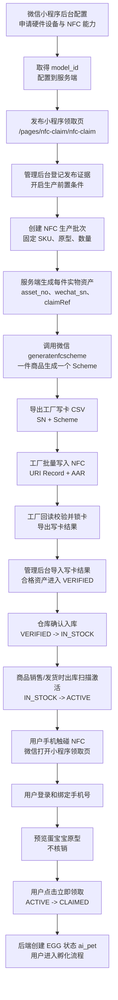

可以把整个系统想成四条线协作：

| 线 | 负责什么 | 典型参与者 |
|---|---|---|
| 微信配置线 | 让微信允许 NFC 标签打开小程序 | 小程序管理员、研发 |
| 生产写卡线 | 把每件实物对应的 Scheme 写入 NFC 芯片 | 生产运营、工厂 |
| 库存激活线 | 只让真正出库的商品可被领取 | 仓库、运营后台 |
| 用户领取线 | 用户触碰、登录、预览、确认领取 | 购买用户、小程序、后端 |

## 3. 模块一：微信小程序后台配置流程

这一步解决“微信是否允许你的 NFC 标签打开小程序”的问题。没有这一步，后端不能正式生成可写入标签的 NFC Scheme。

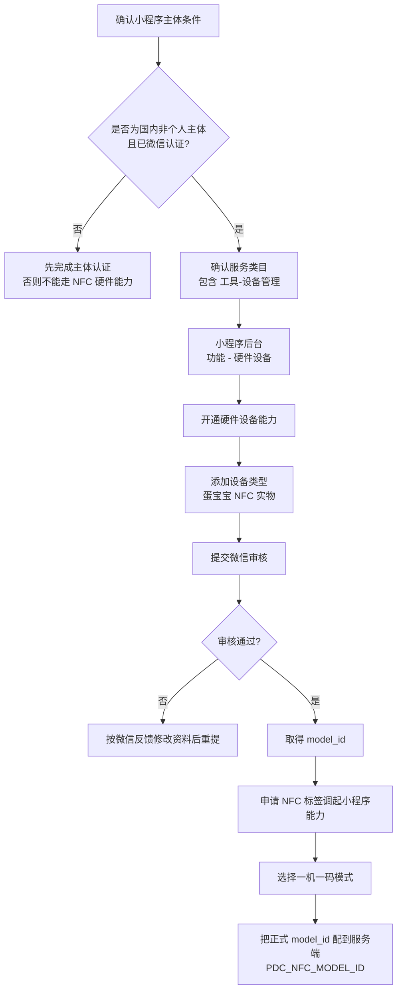

关键点：

| 配置项 | 作用 | 第一版策略 |
|---|---|---|
| 设备类型 | 告诉微信“这类 NFC 设备是什么” | 只添加一个“蛋宝宝 NFC 实物” |
| `model_id` | 微信分配的设备类型 ID | 先用配置占位，正式生成前必须填真实值 |
| 一机一码 | 每件实物都有唯一 `sn` | 必须选这个模式 |
| 领取页路径 | 微信打开小程序后进入哪里 | 固定 `/pages/nfc-claim/nfc-claim` |
| 小程序版本 | NFC Scheme 要打开线上发布版 | 生成正式 Scheme 前领取页必须已发布 |

`model_id` 未配置时，管理后台可以显示“待微信审核配置”，但服务端必须禁止生成 Scheme，不能拿占位符去请求微信。

## 4. 模块二：系统初始化和商品类型配置

这一步解决“系统里只有一个固定的 NFC 商品类型”的问题。第一版不做复杂商品类型维护，只初始化一条只读数据。

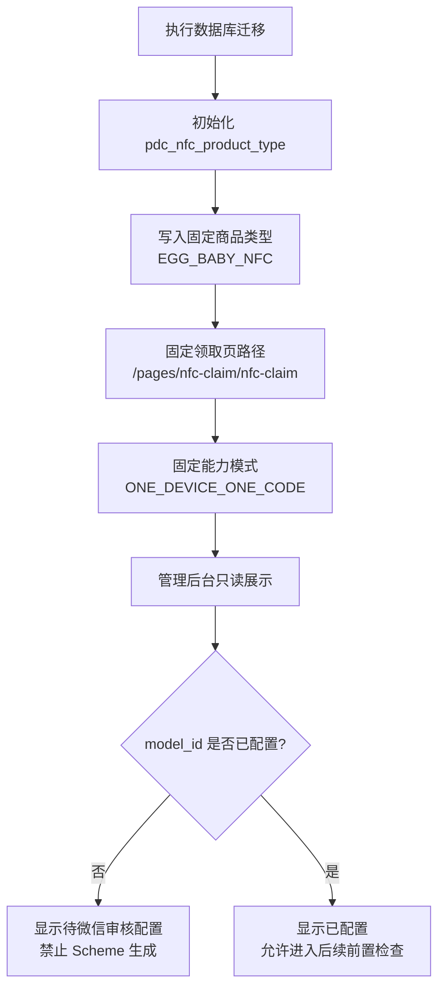

这里有一个容易混淆的点：

| 字段/配置 | 是什么 | 是否等于 `model_id` |
|---|---|---|
| `pdc_nfc_product_type.capability_mode` | 我们内部记录的能力模式，比如一机一码 | 否 |
| `PDC_NFC_MODEL_ID` | 微信审核通过后给的设备类型编号 | 是真正的 `model_id` |

## 5. 模块三：小程序发布和生产前置检查

正式生成 NFC Scheme 前，必须先保证微信打开的页面已经在线上版本存在。否则标签写好后，用户触碰可能打不开正确页面。

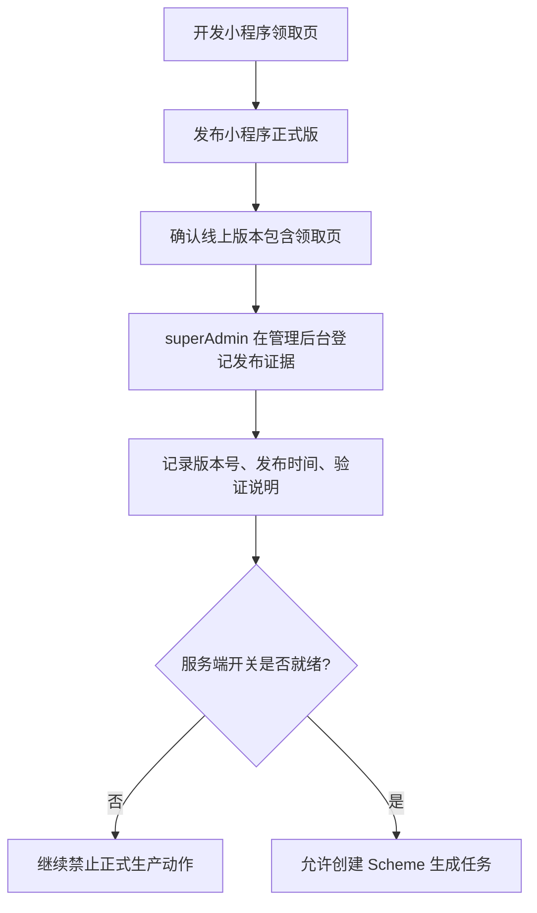

前置条件可以理解成三把锁：

| 锁 | 为什么需要 | 没打开时会怎样 |
|---|---|---|
| `model_id` | 微信要知道设备类型 | 不能调用 `generatenfcscheme` |
| 发布证据 | 证明领取页已经在线上 | 禁止正式 Scheme 生成 |
| 功能开关 | 控制灰度和紧急暂停 | 关闭生产、激活或领取入口 |

## 6. 模块四：生产批次和 Scheme 生成流程

这一步开始进入“每件商品一条数据”的生产域。

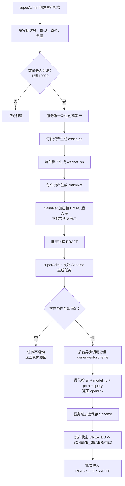

后端调用微信时，每件商品大致传这样的信息：

```text
model_id = 微信给的蛋宝宝设备类型 ID
sn = 这件实物唯一的 wechat_sn
path = /pages/nfc-claim/nfc-claim
query = v=1&ref=<这件实物唯一的 claimRef>
env_version = release
```

`generatenfcscheme` 可以理解为：我们把“设备类型、实物编号、要打开的小程序页面、领取参数”告诉微信，微信返回一个适合写入 NFC 标签的 `openlink`。

如果微信临时超时，任务可以重试；如果是 `model_id` 错误、页面不存在、权限没开通这类配置问题，任务会停止，避免越错越多。

## 7. 模块五：工厂写卡流程

这一步解决“怎么把微信返回的 Scheme 真正写进 NFC 芯片”。

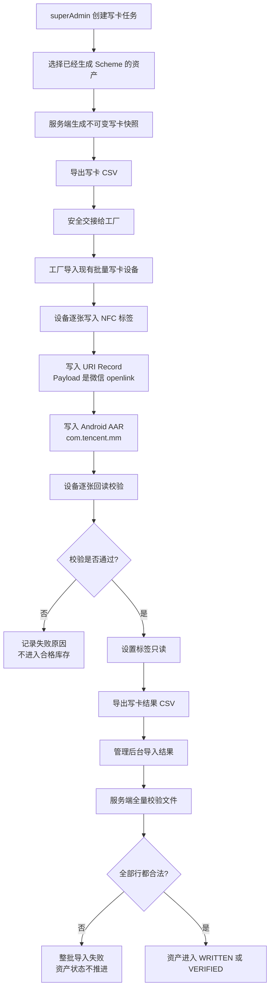

写卡 CSV 给工厂看的核心列：

| 列 | 说明 |
|---|---|
| `job_no` | 本次写卡任务号 |
| `batch_no` | 生产批次号 |
| `asset_no` | 我们内部的实物资产编号 |
| `wechat_sn` | 给微信的一机一码编号 |
| `uri_payload` | 微信返回的 `openlink`，写入 NFC URI Record |
| `aar_payload` | 固定 `com.tencent.mm`，用于 Android 指向微信 |

NFC 标签里写两条记录：

| NFC Record | 给谁用 | 内容 |
|---|---|---|
| URI Record | iOS 和 Android 都会识别 | 微信返回的 `openlink` |
| Android Application Record | Android 系统辅助定位 App | `com.tencent.mm` |

写卡结果导入时，服务端不会“导入一半成功一半失败”。它会先检查整个文件，确认没有缺行、重复行、串任务、`sn` 不匹配、摘要不一致等问题，全部通过后才统一推进状态。

## 8. 模块六：入库、出库和激活流程

这一步解决“为什么用户买到之前不能提前领取”的问题。写好 NFC 并不代表可领取，只有仓库出库激活后才可以。

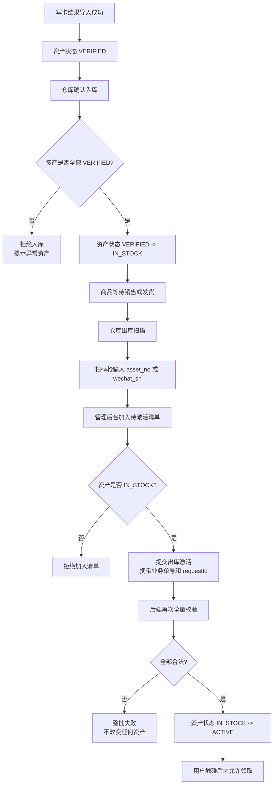

为什么要“出库激活”：

| 阶段 | 用户触碰 NFC 后的结果 |
|---|---|
| 未写卡或写卡失败 | 通常打不开或不能进入有效领取 |
| 已写卡但未入库 | 后端提示暂时无法领取 |
| 已入库但未出库 | 后端提示暂时无法领取 |
| 已出库并激活 | 可以预览并确认领取 |
| 已领取 | 本人重复触碰返回原宠物，他人触碰提示已领取 |

## 9. 模块七：用户触碰 NFC 和微信端交互

这一步是用户感知最强的流程。

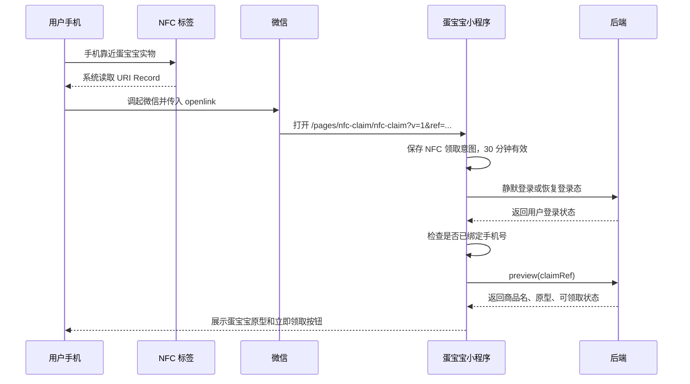

这里有几个小白友好的理解点：

| 行为 | 会不会领取成功 | 说明 |
|---|---|---|
| 只是触碰 NFC | 不会 | 只会打开领取页 |
| 打开领取页并看到预览 | 不会 | 预览接口不核销 |
| 用户点“立即领取” | 会尝试领取 | 后端确认资产可领取后才创建蛋宝宝 |
| 用户拒绝手机号授权 | 不会 | 保留意图，用户可稍后重试 |
| 网络断了 | 不会乱扣 | 同一次重试复用 `requestId` |

## 10. 模块八：用户认领事务流程

这一步解决“如何保证一件实物只能被一个用户领取”的问题。

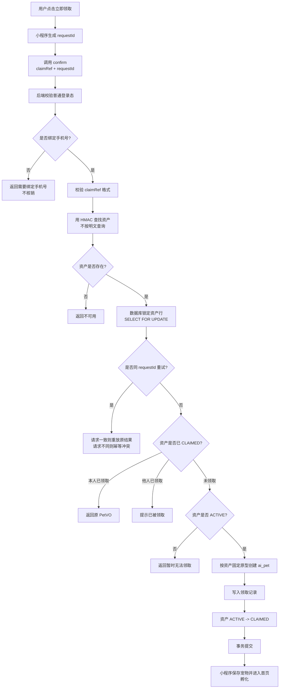

关键保障：

| 保障 | 作用 |
|---|---|
| `SELECT ... FOR UPDATE` | 两台手机同时抢同一件时，数据库只让一个事务先成功 |
| `asset_id` 唯一领取记录 | 一件实物最多成功领取一次 |
| `(user_id, request_id)` 幂等 | 网络重试不会重复创建宠物 |
| 本人重复触碰返回原宠物 | 用户不会因为多次触碰而多领 |
| 他人触碰已领商品提示已领取 | 不泄露领取人信息 |

领取成功时只创建 `EGG` 状态的 `ai_pet`，不会提前创建 `ai_device`、`ai_agent`。后续孵化、破壳仍走现有蛋宝宝流程。

## 11. 模块九：状态机总图

下面这张图是实物资产的一生。

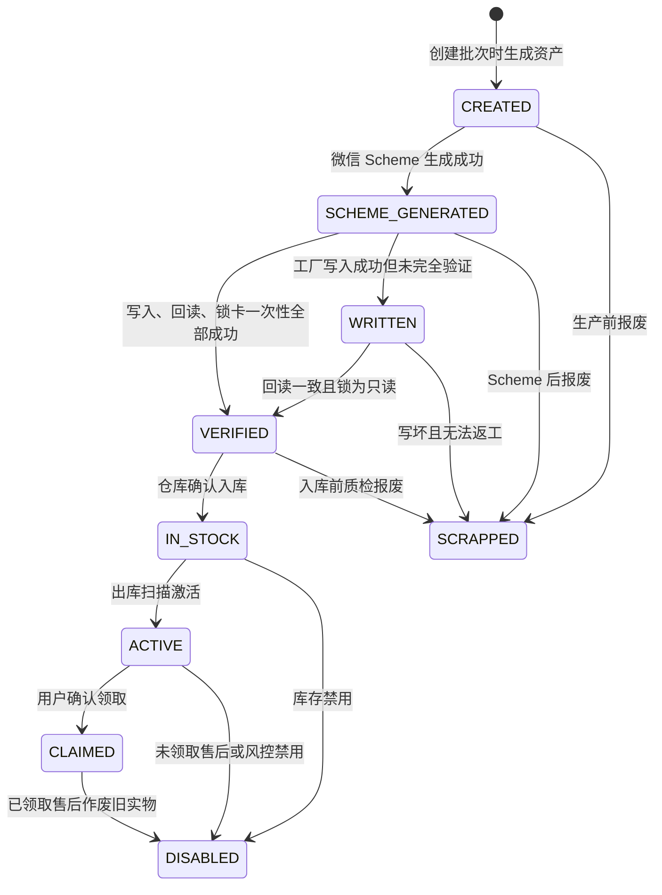

状态含义：

| 状态 | 小白解释 | 用户能否领取 |
|---|---|---|
| `CREATED` | 系统里有这件商品，但还没拿到微信 Scheme | 否 |
| `SCHEME_GENERATED` | 微信打开链接已生成，准备交给工厂写卡 | 否 |
| `WRITTEN` | 芯片写过了，但还没有完全验收合格 | 否 |
| `VERIFIED` | 写卡、回读、锁卡都合格 | 否 |
| `IN_STOCK` | 已入库，等待销售或发货 | 否 |
| `ACTIVE` | 已出库激活，买家可以领取 | 是 |
| `CLAIMED` | 已被领取并创建蛋宝宝 | 本人可重复查看，他人不可领取 |
| `SCRAPPED` | 生产阶段报废，不可恢复 | 否 |
| `DISABLED` | 售后或风控禁用，保留历史 | 否 |

## 12. 模块十：权限和数据安全流程

生产库存是后台核心能力，只有 `superAdmin` 可以操作。小程序用户领取接口不要求 `superAdmin`，只要求普通用户登录并绑定手机号。

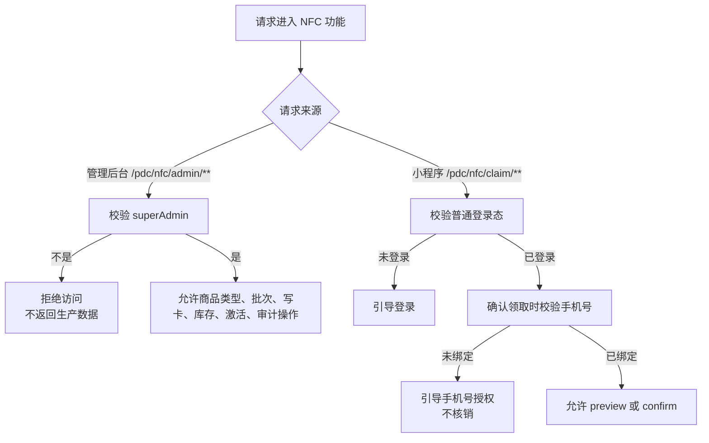

敏感数据处理原则：

| 数据 | 是否展示 | 说明 |
|---|---|---|
| `claimRef` 完整值 | 不展示 | 只在小程序 query 中使用，后端加密和 HMAC 保存 |
| 完整 Scheme / `openlink` | 默认不展示 | 只在 superAdmin 下载写卡 CSV 时出现 |
| AppSecret / access token | 永不展示 | 只能在可信服务端使用 |
| `model_id` | 可以展示 | 它不是密钥，只是微信设备类型编号 |
| `tag_uid` | 后台详情谨慎展示或脱敏 | 小程序端不展示 |
| 领取人信息 | 小程序不展示给他人 | 避免泄露隐私 |

## 13. 模块十一：异常和售后流程

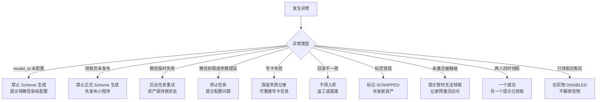

售后原则：

| 场景 | 处理 |
|---|---|
| 未领取的实物有问题 | 禁用或报废旧资产，补发新实物 |
| 已领取的实物有问题 | 作废旧实物，但保留用户宠物和领取记录 |
| 用户想换绑或转赠 | 第一版不支持 |
| 标签被复制 | 首位成功领取者获得商品，这是第一版接受的业务风险 |

## 14. 角色视角流程

### 14.1 小程序管理员

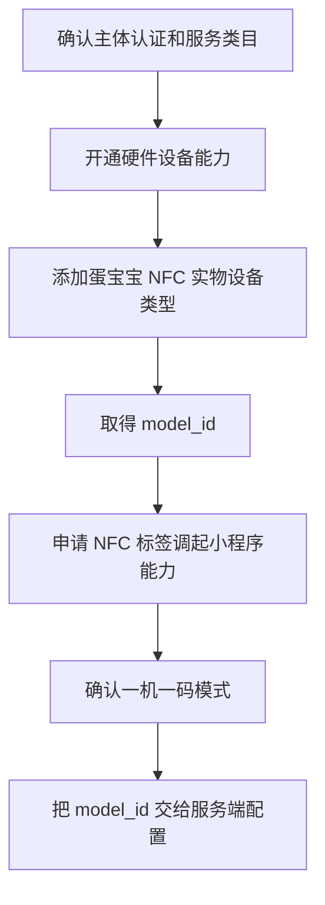

### 14.2 生产运营

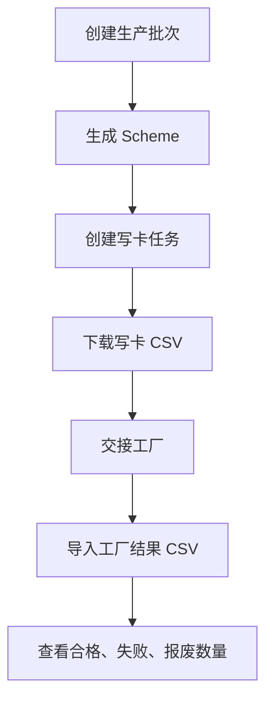

### 14.3 工厂

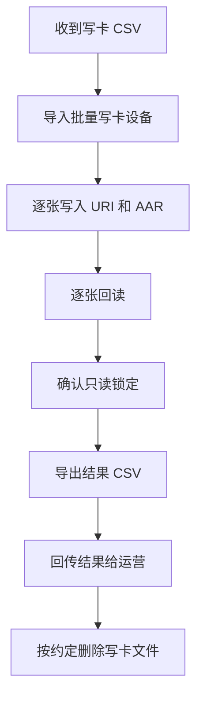

### 14.4 仓库

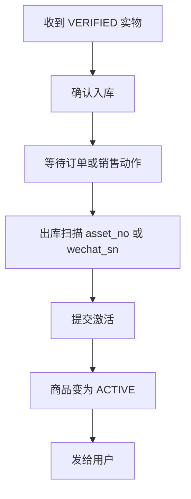

### 14.5 用户

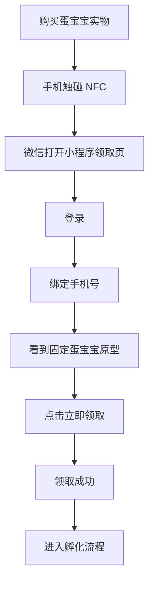

## 15. 上线前最小检查清单

| 检查项 | 通过标准 |
|---|---|
| 微信设备类型 | “蛋宝宝 NFC 实物”审核通过，拿到正式 `model_id` |
| NFC 能力 | 已开通 NFC 标签调起小程序，一机一码模式正确 |
| 小程序发布版 | 正式版包含 `/pages/nfc-claim/nfc-claim` |
| 服务端配置 | `PDC_NFC_MODEL_ID` 为正式值，功能开关按灰度策略开启 |
| 商品类型 | 后台只读显示唯一商品类型 |
| Scheme 小批量生成 | 成功率、错误码、额度监控正常 |
| 写卡设备 | 支持逐卡写入、回读、追溯、锁只读 |
| 真机测试 | Android 和 iPhone 都能触碰打开小程序 |
| 领取测试 | 未激活不可领，激活可领，本人重复返回原宠物 |
| 并发测试 | 两台手机同时领同一件，只有一个成功 |
| 回归测试 | 原邀请码领取和孵化流程不受影响 |

## 16. 最终交互闭环

一件 NFC 蛋宝宝完整闭环如下：

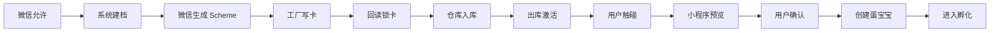

只要记住一个判断标准：用户真正能领取的唯一状态是 `ACTIVE`。在此之前，所有流程都是为了安全、可追溯地把一件实体商品准备好；在此之后，领取事务负责把这件实体商品和用户账号、蛋宝宝宠物准确绑定起来。
