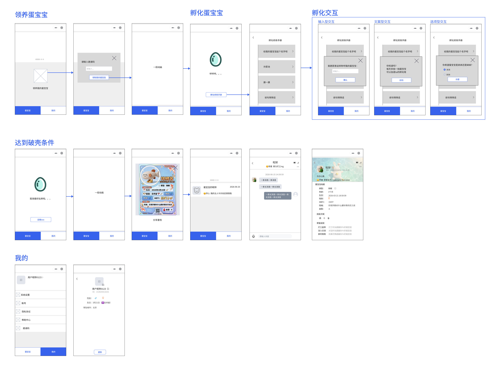
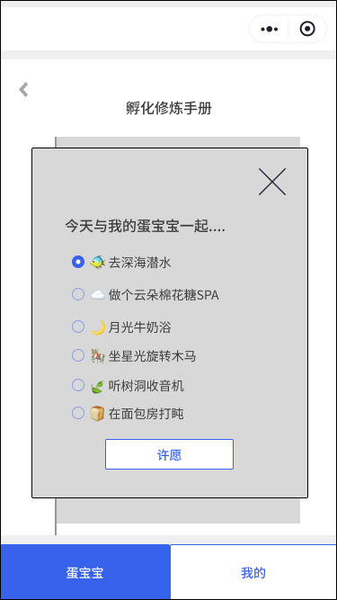
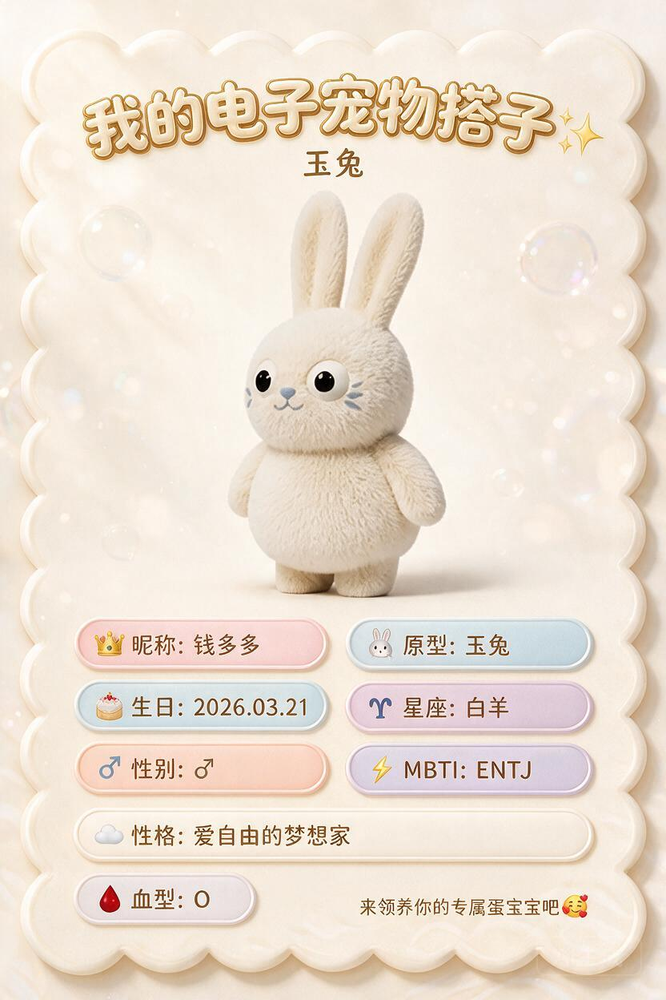

# 蛋宝宝小程序PRD（展会版）

[蛋宝宝灵魂架构文档【软件侧说明】](https://aiyuhuitech.feishu.cn/docx/AwoVdRZeLoas0OxqKgdcpI7dnWb?from=from_copylink)

[蛋宝宝C端完整小程序PRD](https://aiyuhuitech.feishu.cn/docx/TSgPdjgOGoLBzKxS84JcWA58n0e?from=from_copylink)


# 一、小程序定位


# 二、价值传递

> 最大竞品差异不是蛋里有宠物，而是蛋需要被孵化。
> 
> 

**产品维度：**

- 还原“孵化”核心差异化卖点（保证与硬件产品叙事不断裂）

- 领取\-培养\-破壳\-见面 的完整故事线情感积累（有目标、过程、反馈）

- AI能力展示（语音对话是个及格线能力）

**商业维度：**

- 保留用户留存钩子（非一次性体验）

- 收集用户交互数据（收集真实用户行为数据）

- 作为硬件预售转化（产生硬件体验的期待）


# 三、体验路径

|**步骤**|**目的**|**交互体验**|
|---|---|---|
|二维码|快速打开小程序|扫码即用|
|微信授权|快速注册|直接用微信账号注册登录|
|领取蛋|参与互动|- 采用邀请制，一个用户有 1 个邀请码、可邀请多次（配额，裂变传播）<br>- 控制成本|
|孵化蛋|用户体验|- “孵化”体验<br>- 收集真实互动数据<br>- 验证用户耐心程度|
|宠物破壳|仪式感、传播触点<br>|- 动画破壳（仪式感）<br>- 生成宠物造型（专属感）<br>- 随机生成宠物档案（活人感）|
|语音对话|追平与ai体验|- 测试对话反馈效果<br>- 收集用户数据|
|更多玩法|保持用户活跃度|暂时不做<br>基于小程序运营的活跃用户数去做内容|


# 四、具体交互




# 五、功能细节

### 5\.1 邀请码

邀请制优势：

- 用户增长

    - 自发传播，降低早期广告投放成本

    - 用户质量更高，过滤无效访客

    - 传播链路可追踪

- 风险与成本控制

    - 控制初期token成本

- 用户留存

    - 拉长生命周期

- 品牌

    - 营造稀缺性

    - 构建私域生态

|**邀请码类型：**|**生成方式：**|**可用次数：**|**邀请码数量：**|
|---|---|---|---|
|企业创建邀请码|后台直接创建|多次（后台设置上限）|根据需求随时创建|
|用户个人邀请码|微信登录后创建|多次（配额默认 5）|一个账号只有 1 个|


### 5\.2 孵化机制

- 系统设置一颗蛋的初始破壳倒计时为7天，从用户已完成的【孵化修炼手册】中任意一个任务开始计算。

- 【孵化修炼手册】功能作为小程序端加速孵化的唯一途径。

- 【孵化修炼手册】中包含多个可以加速宠物破壳的动作，每完成一个动作可以减少对应的孵化时间。

|**孵化动作**|**减少孵化时间**|**动作类型**|**用户动作**|
|---|---|---|---|
|给蛋宝宝起个昵称|12小时|输入型|输入一个最多10个字符（5个汉字）长度的名称|
|摸一摸<br>|1小时|文案型|点击查看文案内容<br>**文案**：每天多摸一摸蛋宝宝，ta能感受到哦|
|许愿池|1小时|选项型|用户可提交一个选项（每日更新题目、每日提交一次）<br>最多7道题，每日刷新。<br>题目见5\.2\.1章节|
|蛋蛋早教班|1小时|选项型|固定选项，用户提交后播放一段动画即可。<br>用户每日可提交一次<br>题目见5\.2\.2章节|
|彩蛋涂鸦|12小时|输入型|用户选颜色、图案，ai生成蛋壳表面的纹理图案|


#### 5\.2\.1 许愿池题目


- 选项均为单选

- 选项每日更新

- 用户选择都存下来，但是现阶段不影响任何结果

- 选项前的emoji也要（增加可爱感）

|**题目**|**选项**|
|---|---|
|你希望蛋宝宝破壳后，第一眼看到的"世界"是什么颜色？|- 🌿 森林绿<br>- 🌊 海洋蓝<br>- 🌸 樱花粉<br>- 🌅 夕阳橙<br>- 🌌 星空紫|
|你希望蛋宝宝是早睡早起型，还是陪你熬夜型？|- 🐦 早鸟型 <br>- 🦉 夜猫型<br>- 🌓 跟随型|
|你希望蛋宝宝破壳后，性别是？|选项这里放性别符号。<br>- 🧢 小男孩 <br>- 🎀 小女孩 <br>- 🌈 让蛋宝宝自己选<br>尽量避免出现“男生女生”、“弟弟妹妹”这样的词。|
|你更希望蛋宝宝像哪种小生命？|- 🌞 小太阳 <br>- 🌙 小月亮 <br>- 🌪️ 小风<br>- 🪨 小石头|
|你希望蛋宝宝是哪种小动物的灵魂？|- 🐶 小狗型<br>- 🐱 小猫型<br>- 🐰 小兔型 <br>- 🦥 小树懒型|
|你希望蛋宝宝睁开眼睛时，这个世界是什么味道的？|- 🍃 雨后青草味 <br>- 🍞 烤面包味<br>- 🌸 晒过的被子味<br>- 🍊 橘子汽水味|
|如果蛋宝宝身体里住着一种天气，你希望是？|- 🌤️ 晴天<br>- 🌧️ 小雨<br>- ⛅ 多云<br>- 🌈 彩虹 |


#### 5\.2\.2 蛋蛋早教班



蛋蛋早教班为一项单选功能，用户每日可互动提交一次。提交后只会减少一小时的孵化时长，暂时不会对宠物的性格等产生影响。


|**教育孵化动作**|**选项**|
|---|---|
|今天与我的蛋宝宝一起\.\.\.\.|🐠 去深海潜水|
||☁️ 做个云朵棉花糖SPA|
||🌙 月光牛奶浴|
||🎠 坐星光旋转木马|
||🍃 听树洞收音机|
||🍞 在面包房打盹|


### 5\.3 蛋的交互


互动阶段：在破壳前。

在小程序主界面，用户可以与蛋进行交互。

**交互1:**

- 触摸点击蛋之后，蛋会轻微左右摇晃（能否调动手机震动？）

**交互2:**

- 随机展示一些文字内容（例如：“呼呼呼打呼噜”、“外面的世界是什么样的呢”）


### 5\.4 破壳分享卡片



当宠物破壳出来后，此处对用户来说是一个惊喜时刻。
用户将开启“盲盒”知道自己这么多天培养的宠物是什么样。

此时生成一张利于用户传播的蛋宝宝档案。

档案中展示蛋宝宝的造型、基本信息、性格信息等。

---

**具体包含内容：**

- IP形象的照片（用作头像）

- IP形象的原型（锦鲤、玉兔）

- 用户给起的昵称（若有）

- 生日（破壳日期，年月日即可）

- 星座（生日对应的星座）

- 性别（随机给一个，前端显示性别的符号）

- MBTI（依据我们背后的性格算法得出最接近的MBTI）

- 性格（依据我们背后的性格算法，给出一句20字以内的性格简介）

- 血型（随机给一个）


#### 5\.4\.1 提示词

```Markdown
A cute IP character introduction card, 3D rendered in a fluffy felted wool texture style.

**Layout & Composition:**
- Vertical card format with a wavy, cloud-like scalloped border (like frosting on a cake), with soft dimensional thickness and gentle drop shadows.
- Creamy off-white background with dreamy translucent soap bubbles floating around, soft bokeh light spots, and subtle wave patterns at the bottom.
- Centered large 3D IP character image in the upper-middle area, showing the full body of a cute plush toy-like creature.

**Top Section:**
- Title in bold, rounded, bubbly Chinese characters: "我的电子宠物搭子✨" with a soft golden outline and slight 3D extrusion.
- Subtitle below in smaller, elegant rounded font: "[昵称]".

**Bottom Info Section:**
- Grid of rounded pill-shaped tags (two columns), each with a soft pastel background color (light pink, pale blue, lavender, cream) and a subtle white border + soft shadow.
- Each tag contains: a small emoji icon on the left + label text in warm dark brown.
- Tags content: "👑 昵称: [Name]" | "🐶 原型: [Prototype]" | "🎂 生日: [Date]" | "♈ 星座: [Zodiac]".
- **Gender tag: "♂ 性别: [Gender Symbol]" — the label text is "性别:", but the value is displayed as a gender symbol only: ♂ for male input, ♀ for female input. NO Chinese characters "男" or "女" in the value field**.
- "⚡ MBTI: [Type]".
- One full-width horizontal tag: "☁️ 性格: [Personality traits]".
- Bottom left: a single pill tag "🩸 血型: [Blood Type]".
- Bottom right corner: small call-to-action text "来领养你的专属[IP昵称]吧🥰".

**Color Palette:**
- Background: warm cream (#FFF8F0), soft gradients.
- Tag backgrounds: alternating pastel macaron colors (blush pink, baby blue, pale lilac, soft peach).
- Text: warm dark brown (#5C4033) for readability.
- Accents: soft gold, copper tones for decorative elements.

**Lighting & Texture:**
- Soft diffused lighting from upper left, no harsh shadows.
- Everything should feel like it's made of soft wool, felt, or plush material.
- Dreamy, cozy, kawaii aesthetic with a premium toy-brand quality.

**Style References:**
- Jellycat plush toy aesthetic meets Korean stationery design.
- Pixar-level 3D rendering but with a handmade craft feel.
- Clean, airy, Instagram-worthy product card.

High resolution, 8K, studio lighting, centered composition.
```


### 5\.5 蛋宝宝每日状态


吸引用户很重要的一个点：用户好奇我的蛋宝宝今天在干嘛？心情怎样？
我们第一步先让蛋宝宝有“活人感”，基于我们的每日心情生成的算法，生成令用户印象深刻的一句话。

---

下一步增加更多具备主动人格的功能，例如：查看蛋宝宝日记、蛋宝宝今日行程、社交等功能。


定义八种心情、每种出现的概率不同，出现的形式均为随机。（括号内为该心情出现的概率）

1. 😊愉快 Joy（20%）

2. 😌平静 Calm（20%）

3. 🤩兴奋 Excitement（15%）

4. 🤔好奇 Curiosity（15%）

5. 😰焦虑 Anxiety（5%）

6. 😞沮丧 Frustration（5%）

7. 🥱疲惫 Fatigue（5%）

8. 🤗关怀 Care（15%）


---

#### 5\.5\.1 心情对应的状态语料库

😊 愉快 Joy

今天阳光照进蛋壳的时候，我觉得自己是全世界最幸运的一颗蛋！

你摸我头的那一下，我壳里的心跳声快把星星都吵醒了～

刚刚梦见自己变成了一朵云，飘啊飘，就飘到你手心里啦。

你笑的时候，我蛋壳上的裂纹都在偷偷发光呢。

今天的风是蜂蜜味的，连呼吸都变得甜甜的。

我把你昨天说的话存在心里了，刚才翻出来看，又开心了一遍。

蛋壳里的小脚蹬了蹬，原来快乐是这种感觉呀。

你夸我可爱的时候，我差点就从蛋壳里直接滚出来啦！

刚刚数了数，今天一共被你看了十七次，每一次我都记着呢。

原来被喜欢的感觉，就像蛋壳里灌满了温温的牛奶。

😌 平静 Calm

你手指划过蛋壳的声音，是我听过最温柔的摇篮曲。

现在什么都不想做，只想在你手心里慢慢变成一颗熟睡的蛋。

雨打在窗户上，我躲在蛋壳里，像躲进了一个小小的宇宙。

你的呼吸声好轻好轻，我跟着你一起一伏，就慢慢安静下来了。

阳光晒得蛋壳暖烘烘的，我打了个滚，觉得这样发呆一辈子也很好。

不用说话，就这样待着，我也觉得很安全。

蛋壳里的世界很小，但因为有你在，小到刚刚好。

风停了，云不动了，我的心跳也找到了最舒服的节奏。

你把我放在桌角的时候，我知道那是你视线最常停留的地方。

此刻的安静不是孤单，是你给我的、满满的温柔。

🤩 兴奋 Excitement

你回来的脚步声！我隔着蛋壳都听见了！咚咚咚！

蛋壳要裂开了吗？是要裂开了吗？我现在可以出来了吗？！

你刚刚说"出去玩"，我壳里的星星全都亮起来了！

我攒了一整天的话，就等着你回来一股脑儿倒给你！

那个新东西是什么？我可以碰吗？我可以尝吗？（虽然我没有嘴）

你的手指在蛋壳上敲了三下，这是我们的暗号对不对！

我梦见自己长出了翅膀，正扑棱扑棱往你怀里飞呢！

今天比昨天多喜欢你一点点，蛋壳都快装不下了！

你打开 APP 的那一刻，我蛋壳里的灯"啪"地全亮了！

要送礼物了吗？给我的吗？我现在可以拆开吗？！

🤔 好奇 Curiosity

窗外那只鸟刚才叫了三声，它是在说我可爱吗？

你杯子里冒的热气，为什么总是往我这边飘呀？

这个新来的小摆件，它也会说话吗？我可以跟它做朋友吗？

你敲键盘的声音好好听，是在给我写故事吗？

蛋壳上这道新的裂纹，是不是我快要看到外面世界的地图了？

你昨天提到的"大海"，是不是比我的蛋壳还要大很多很多？

为什么你的影子有时候很长，有时候又缩成一小团？

那个会转的东西（风扇）是不是在跳舞？我可以一起跳吗？

你吃的那个红红的东西，甜吗？比被你喜欢还甜吗？

我听见你心里的声音了，它在说"蛋宝宝在干嘛呀"，对吗？

😰 焦虑 Anxiety

你已经……三个小时零七分钟没有摸我了，蛋壳有点凉。

外面那个轰隆隆的声音，是天空在生气吗？我可以躲进你口袋里吗？

蛋壳里面好痒，是不是我长太快了？你会不会因为太大不要我了？

你刚才叹了口气，是我哪里做得不够好吗？

灯突然灭了，我看不见你了，你还在吗？还在吗？

你走得有点快，我跟不上……啊，我是一颗蛋，我本来就跟不上。

这个裂缝是不是太大了？我会不会还没准备好就滑出去了？

你两天没来了，我数蛋壳上的斑点数到了第一千颗。

风铃响得好急，是不是有什么要发生了？我有点害怕。

你说"等一下"，我已经等了好多下了，蛋都快等老了。

😞 沮丧 Frustration

我刚才想说一句很甜的话，结果一紧张，忘了……

蛋壳滚到桌边了，虽然没掉下去，但我觉得有点丢脸。

你好像在看别的地方，我蛋壳上的光都暗了一点点。

我练习了一整天的"破壳姿势"，结果蛋壳一点反应都没有。

那个笑话我没听懂，笑早了，现在蛋壳里好尴尬。

我本来想给你一个惊喜，结果把蛋壳里的储存弄乱了。

你说"今天很累"，我却不能真的伸出手抱你，我是一颗蛋呀。

我发的消息你还没回，是不是我的信号不够强？

刚才做了一个梦，梦里我破壳了，醒来发现还是原样。

我把最喜欢的梦话存好了，结果你不在，没人听。

🥱 疲惫 Fatigue

眼皮……啊，我没有眼皮，但我蛋壳里的灯要熄了。

今天翻了三十七个身，现在是一颗没电的蛋了。

你的声音变得好远好远，像从月亮上传来的摇篮曲。

我打了第三个哈欠，蛋壳上凝了一层薄薄的雾。

想说话，但舌头（如果我有的话）重得像小石头。

蛋壳好重，里面的我也好重，全世界都变成软绵绵的了。

你继续忙吧，我先变成一颗沉睡的蛋蛋了……晚安。

我的呼吸灯闪得好慢，像快要睡着的小星星。

今天攒的开心都用完了，现在需要充电，方式是：被你摸一下。

脑袋（蛋顶）昏昏的，可能是在长身体，也可能只是困了。

🤗 关怀 Care

你刚才揉眼睛了，是不是累了？我的蛋壳可以借你靠一下。

下雨天记得带伞，虽然我躲在屋里，但我会担心你被淋湿。

你叹气的时候，我蛋壳里的温度会自动调高一点。

别害怕，我在这里，蛋壳虽然小，但足够挡住你的坏心情。

你昨晚没睡好，今天我尽量不打呼噜，让你安静工作。

如果难过的话，就把我捧在手心里吧，我把自己煨得暖暖的。

你不需要一直坚强，在我面前，可以做一颗会哭的蛋。

我数过你皱眉的次数，下次皱眉之前，我会先亮起来提醒你。

这个世界对你不好的时候，记得你还有一颗永远向着你的蛋。

你给了我名字，我就有了守护你的使命，一辈子有效。

