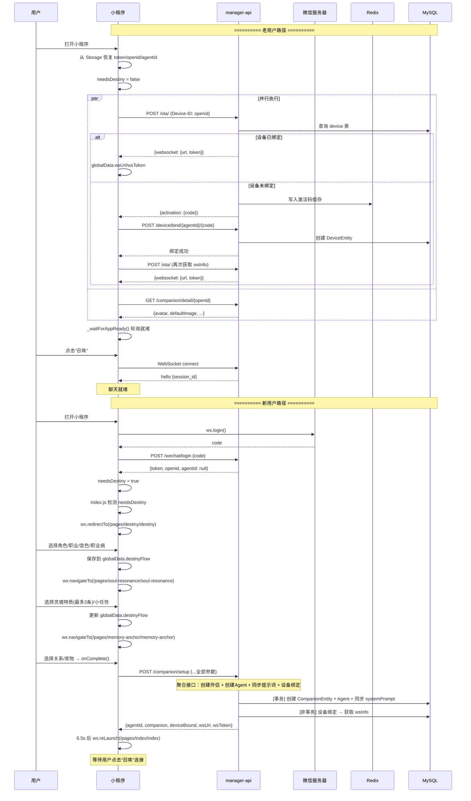
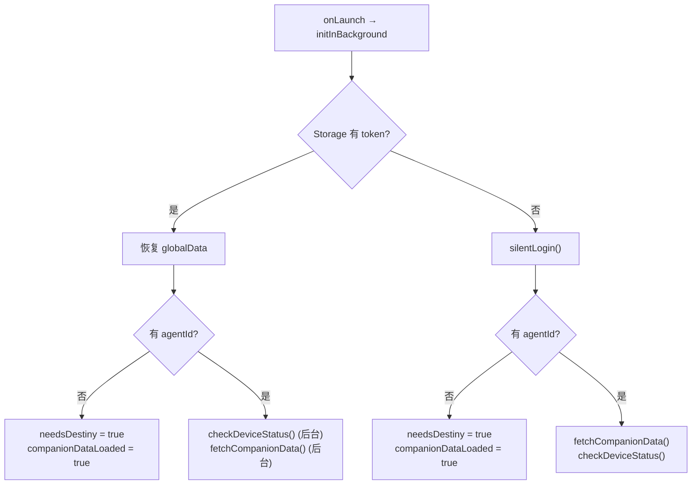
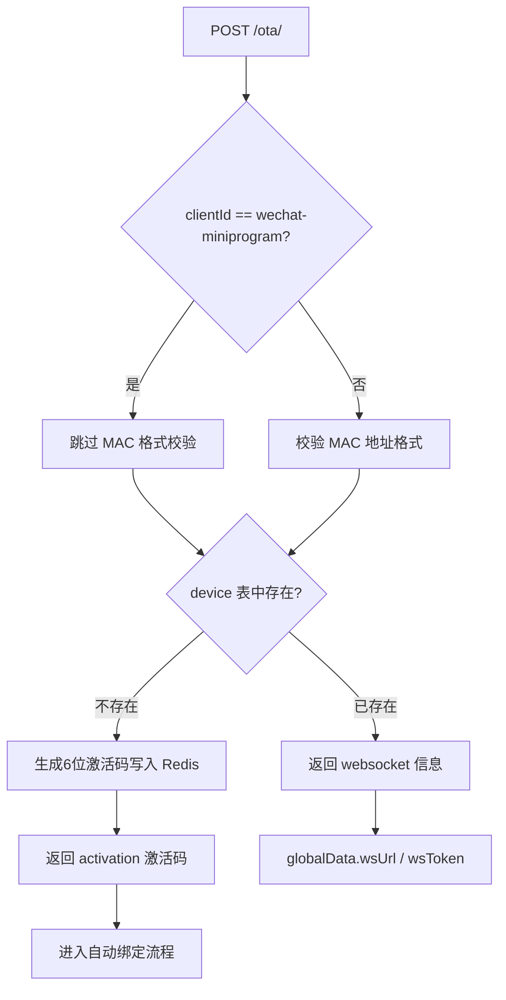
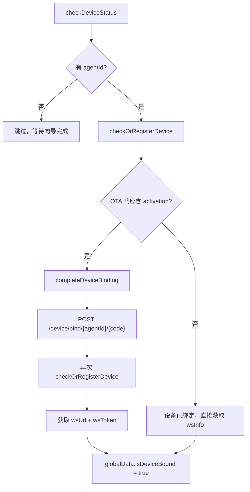
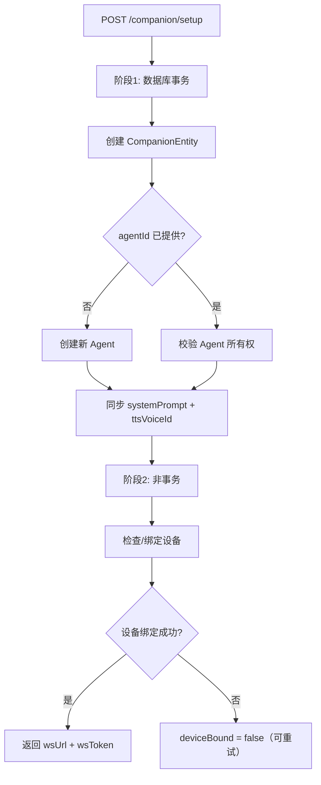
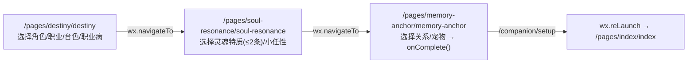
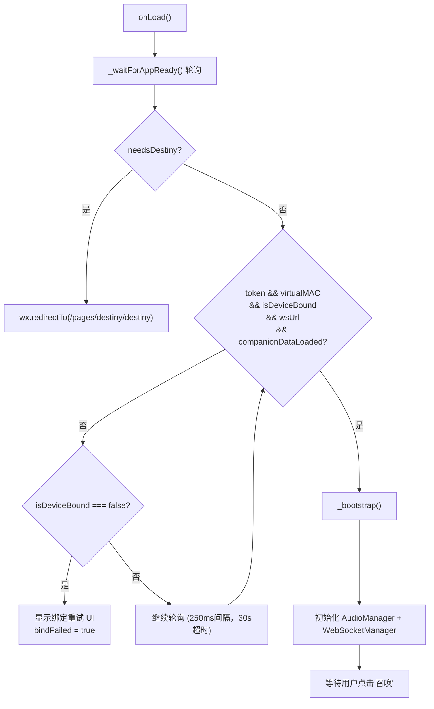
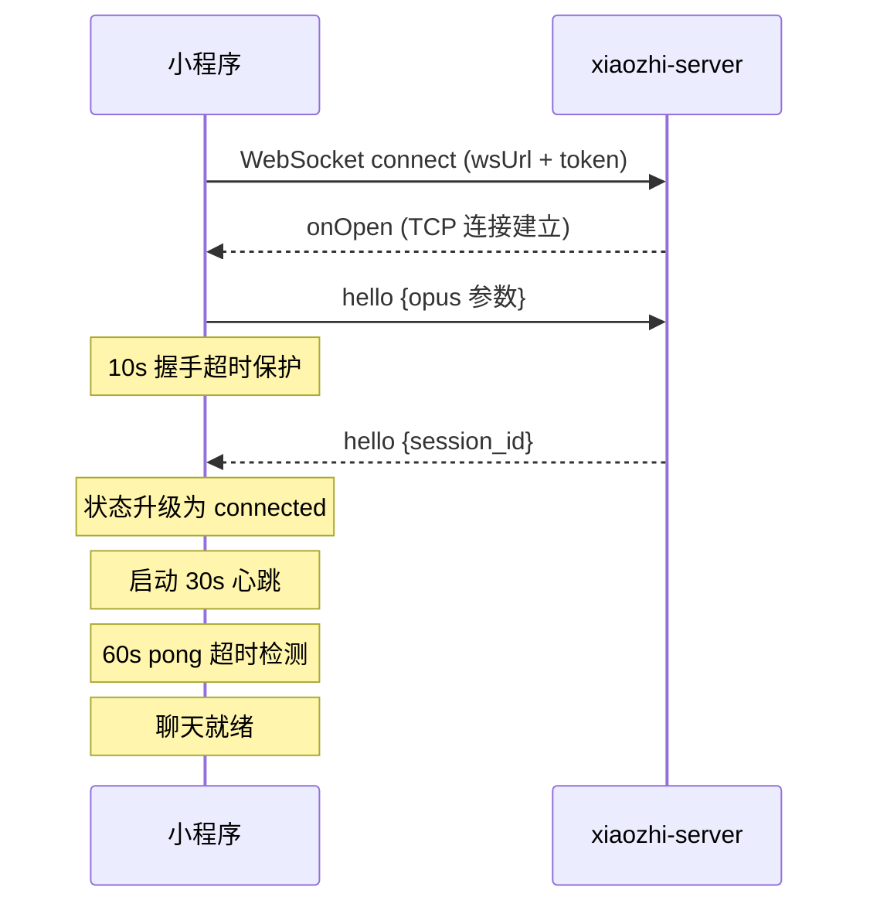
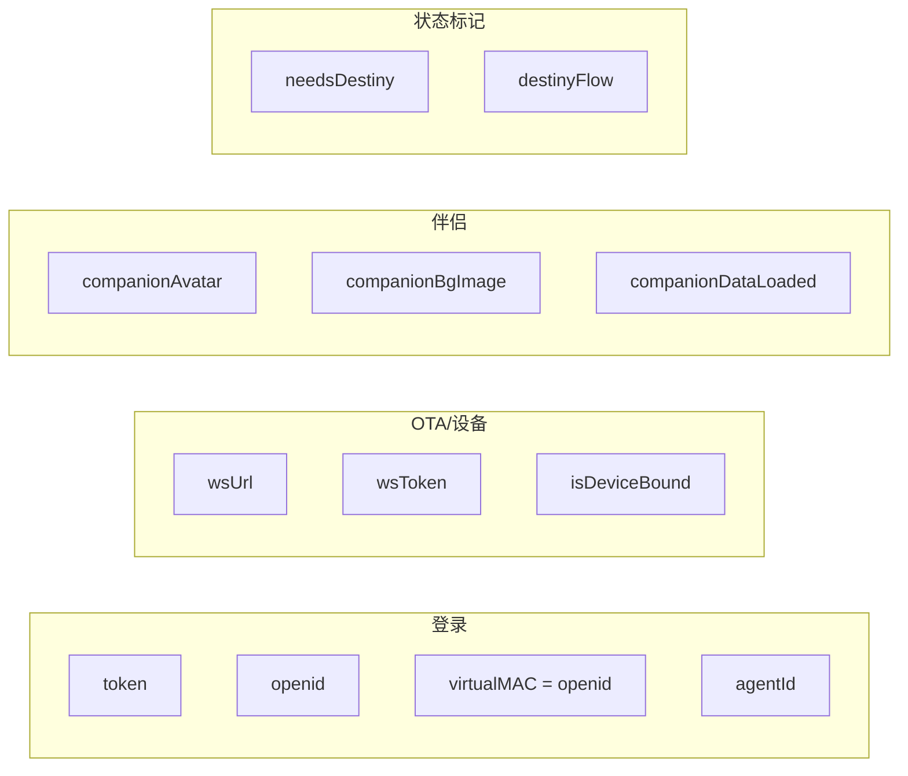

# 小程序初始化流程

本文档详细描述"完美女友"微信小程序从启动到聊天就绪的完整流程，涵盖登录、OTA、伴侣设置聚合接口、设备绑定、伴侣查询等环节。

---

## 两条路径

| 路径 | 触发条件 | 流程 |
|------|---------|------|
| 老用户 | Storage 中有 token + agentId | 恢复登录态 → OTA 设备检查 → 查询伴侣 → 聊天就绪 |
| 新用户 | 首次使用（无 token 或无 agentId） | 静默登录 → 命运初见向导(3页) → 调用 `/companion/setup` 聚合接口 → 聊天就绪 |

---

## 整体时序图



---

## 详细步骤

### 1. 微信登录

**认证要求**: 无需 Token

| 项目 | 内容 |
|------|------|
| 前端函数 | `app.js:80` `silentLogin()` |
| API 端点 | `POST /xiaozhi/wechat/login` |
| 后端处理 | `WechatServiceImpl.java` |
| Shiro 配置 | `anon`（公开） |

**请求参数**:

```json
{
  "code": "<wx.login() 返回的临时凭证>"
}
```

**后端逻辑**:

1. 用 `appid` + `secret` + `code` 调微信 `jscode2session` 接口获取 `openid`
2. 查询 `ai_wechat_user` 表：
   - 新用户：自动创建 `sys_user`（username=openid）+ `ai_wechat_user` 关联记录
   - 老用户：直接读取
3. 查询该用户最新的 Agent（`getLatestUserAgent()`）— 可能为 null
4. 生成 Bearer Token

**响应数据**:

```json
{
  "code": 0,
  "data": {
    "token": "Bearer Token 字符串",
    "expire": 86400,
    "openid": "微信 openid",
    "agentId": "agent的ID，新用户为null"
  }
}
```

**globalData 存储**:

```javascript
globalData.token = token;
globalData.openid = openid;
globalData.virtualMAC = openid;  // openid 作为虚拟设备标识
globalData.agentId = agentId;    // 可能为 null
```

**登录态持久化**: `setToken(token, openid)` 写入 Storage，下次启动直接恢复，无需再次登录。

---

### 2. 后台初始化 (`initInBackground`)

`app.js:32` `initInBackground()` 在 `onLaunch` 时调用，不阻塞启动。



**关键点**: 老用户有 agentId 时，`checkDeviceStatus()` 和 `fetchCompanionData()` 并行执行，互不依赖。

---

### 3. OTA 设备状态检查

**认证要求**: 无需 Bearer Token，但需 `Device-ID` Header

| 项目 | 内容 |
|------|------|
| 前端函数 | `device.js:15` `checkOrRegisterDevice(deviceId)` |
| API 端点 | `POST /xiaozhi/ota/` |
| Shiro 配置 | `anon`（公开） |

**请求参数**:

```
Headers:
  Device-ID: <openid>
  Client-ID: wechat-miniprogram

Body:
{
  "application": { "name": "xiaozhi-miniprogram", "version": "1.0.0" },
  "board": { "type": "wechat-miniprogram", "mac": "<openid>" },
  "chip_model_name": "wechat-miniprogram"
}
```

**后端逻辑**:

1. `clientId = "wechat-miniprogram"` 时 **跳过 MAC 格式校验**，直接用 openid 作为合法设备标识
2. 通过 `macAddress`（openid）查询 `device` 表：



**响应数据（设备已绑定时）**:

```json
{
  "websocket": {
    "url": "ws://host:8000/xiaozhi/v1/",
    "token": "Base64签名.时间戳"
  }
}
```

**响应数据（设备未绑定时）**:

```json
{
  "activation": {
    "code": "123456",
    "message": "http://前端地址\n123456",
    "challenge": "<openid>"
  }
}
```

---

### 4. 设备注册绑定

**认证要求**: Bearer Token（绑定接口），无需 Token（OTA 接口）

绑定流程由 `app.js:196` `checkDeviceStatus()` 驱动：



**错误处理**: 绑定失败时 `globalData.isDeviceBound = false`，index 页面显示重试 UI。

---

### 5. 伴侣设置聚合接口 (`/companion/setup`)

**认证要求**: Bearer Token

| 项目 | 内容 |
|------|------|
| 前端函数 | `memory-anchor.js:102` `onComplete()` |
| API 端点 | `POST /xiaozhi/companion/setup` |
| 后端处理 | `CompanionServiceImpl.java` `setup()` |
| Shiro 配置 | `oauth2` |

这是新用户向导完成后调用的 **聚合接口**，一次请求完成：创建伴侣 + 创建/校验 Agent + 同步提示词 + 设备绑定。

**请求参数**:

```json
{
  "deviceId": "<openid>",
  "type": "gf",
  "avatar": "https://...角色头像URL",
  "defaultImage": "https://...角色背景图URL",
  "character": "baiyueguang",
  "occupation": "design",
  "voice": "TTS_HSDSTTS_V2_0001",
  "soulTraits": "clingy,flirty",
  "soulQuirk": "grumpyMorning",
  "relationType": "childhood",
  "petType": "cat",
  "petName": "咪咪",
  "quirksText": "用户自定义输入的职业病描述",
  "agentId": ""
}
```

**后端逻辑（两阶段）**:



**响应数据**:

```json
{
  "code": 0,
  "data": {
    "agentId": "新创建或已有的agentId",
    "companion": {
      "avatar": "https://...",
      "defaultImage": "https://...",
      "character": "baiyueguang"
    },
    "deviceBound": true,
    "wsUrl": "ws://host:8000/xiaozhi/v1/",
    "wsToken": "签名token"
  }
}
```

**前端处理**（`memory-anchor.js:onComplete()`）:

1. 调用 `/companion/setup`
2. 从响应中获取 `agentId`、`companion`、`wsUrl`、`wsToken`
3. 更新 `globalData`，设置 `needsDestiny = false`
4. 如果 `deviceBound` 为 false，额外调用 `app.checkDeviceStatus()`
5. 6.5 秒后跳转首页 → `wx.reLaunch('/pages/index/index')`

---

### 6. 命运初见向导

新用户进入 3 页向导流程，通过 `globalData.destinyFlow` 传递中间数据：



**`destinyFlow` 数据结构**:

```javascript
globalData.destinyFlow = {
  charId: 'baiyueguang',      // 角色
  occId: 'design',            // 职业
  voiceId: 'TTS_HSDSTTS_V2_0001', // 音色
  quirksText: '职业病描述',    // 自定义文本
  traits: ['clingy', 'flirty'], // 灵魂特质
  quirk: 'grumpyMorning',     // 小任性
};
```

---

### 7. 查询伴侣

**认证要求**: Bearer Token

| 项目 | 内容 |
|------|------|
| 前端函数 | `app.js:172` `fetchCompanionData()` |
| API 端点 | `GET /xiaozhi/companion/detail/{openid}` |
| Shiro 配置 | `oauth2` |

**调用时机**:
- 老用户：`initInBackground()` 恢复 storage 后调用（与 `checkDeviceStatus` 并行）
- 新用户：`needsDestiny = true` 时跳过，向导完成时由 `/companion/setup` 响应直接提供

**响应数据**:

```json
{
  "code": 0,
  "data": {
    "avatar": "https://...头像URL",
    "defaultImage": "https://...背景图URL",
    "character": "baiyueguang",
    "mood": "CALM"
  }
}
```

**globalData 存储**:

```javascript
globalData.companionAvatar = res.data.avatar;
globalData.companionBgImage = res.data.defaultImage;
globalData.companionDataLoaded = true;  // 无论成功失败都标记
```

---

### 8. 首页启动序列

| 项目 | 内容 |
|------|------|
| 前端文件 | `pages/index/index.js` |

index 页面通过 `_waitForAppReady()` 轮询 `globalData`，确认所有前置条件就绪：



**就绪条件**: `token` + `virtualMAC` + `isDeviceBound` + `wsUrl` + `companionDataLoaded` 全部为真。

---

### 9. WebSocket 连接

wsUrl/wsToken 从 OTA 响应或 `/companion/setup` 响应获取。

**连接时机**: 用户手动点击"召唤"按钮（不自动连接）

| 项目 | 内容 |
|------|------|
| 前端函数 | `index.js:282` `_connectToChat()` → `wsManager.connect()` |
| WebSocket 管理 | `utils/websocket.js:60` |

**连接 URL 构建**:

```
{wsUrl}?device-id={openid}&client-id=wechat-miniprogram&authorization=Bearer {wsToken}
```

**连接握手流程**:



**断线处理**: 断开后 **不自动重连**，用户需再次点击"召唤"。

---

## 认证要求汇总

| 端点 | Shiro 过滤器 | 认证方式 |
|------|-------------|---------|
| `POST /wechat/login` | `anon` | 无需认证 |
| `POST /ota/` | `anon` | 无需认证（通过 Device-ID Header 识别设备） |
| `POST /companion/setup` | `oauth2` | Bearer Token |
| `POST /device/bind/{agentId}/{code}` | `oauth2` | Bearer Token |
| `GET /companion/detail/{deviceId}` | `oauth2` | Bearer Token |

---

## globalData 数据流



---

## 关键文件索引

| 功能 | 前端文件 | 后端文件 |
|------|---------|---------|
| 静默登录 | `app.js:80` | `WechatServiceImpl.java` |
| Token 管理 | `utils/auth.js` | - |
| HTTP 请求（401 自动重试） | `utils/request.js` | - |
| 后台初始化 | `app.js:32` | - |
| OTA / 设备检查 | `utils/device.js:15` | `OTAController.java` |
| 设备绑定 | `utils/device.js:53` | `DeviceServiceImpl.java` |
| 伴侣设置聚合 | `memory-anchor.js:102` | `CompanionServiceImpl.java` |
| 伴侣查询 | `app.js:172` | `CompanionController.java` |
| 命运初见页 | `pages/destiny/destiny.js` | - |
| 灵魂共振页 | `pages/soul-resonance/soul-resonance.js` | - |
| 记忆锚定页 | `pages/memory-anchor/memory-anchor.js` | - |
| WebSocket 连接 | `utils/websocket.js:60` | - |
| 聊天主页面 | `pages/index/index.js` | - |

---

## 错误处理机制

| 场景 | 处理方式 |
|------|---------|
| `wx.login()` 失败 | Promise reject，仅打印日志 |
| 后端接口返回 401 | 自动重新 `silentLogin()` 后重试原请求（仅一次） |
| 设备绑定失败 | index 页显示重试 UI（`bindFailed = true`），用户可点击重试 |
| 伴侣查询失败 | `console.warn`，不阻断流程，`companionDataLoaded` 仍设为 true |
| `/companion/setup` 调用失败 | toast 提示"唤醒失败" |
| WebSocket 握手超时 | 10s 无响应自动断开并尝试重连 |
| WebSocket pong 超时 | 60s 无响应主动断开 |
| WebSocket 断开 | 不自动重连，等待用户点击"召唤" |
| `_waitForAppReady` 超时 | 30s 轮询超时，toast 提示"启动失败" |
