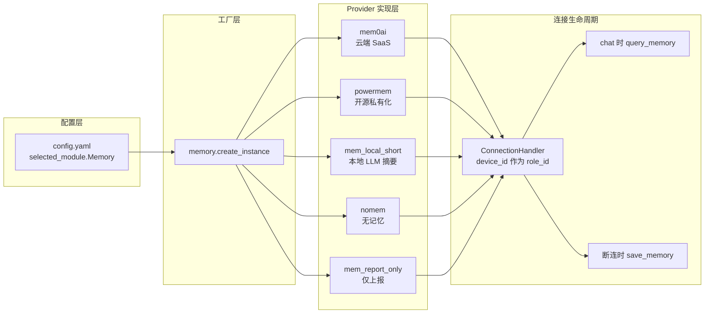
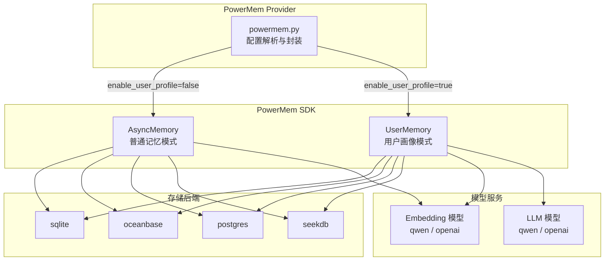
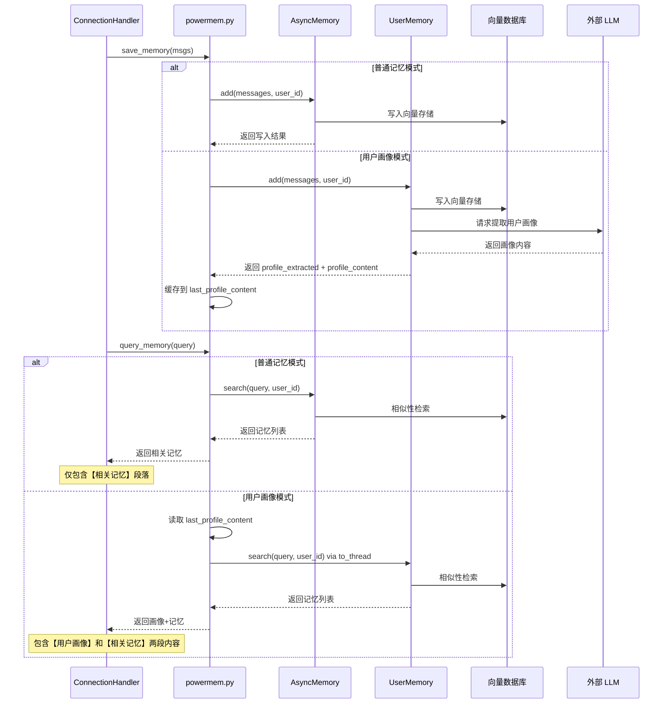
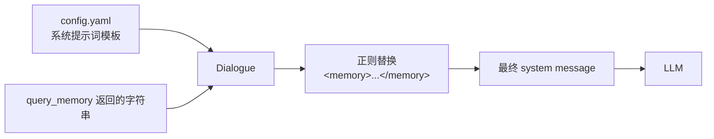
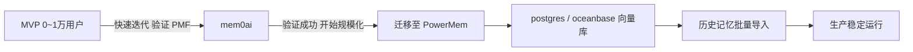

# xiaozhi-esp32-server 记忆系统架构设计详解

> 本文档详细描述项目中 LLM 记忆模块（Memory Provider）的整体架构、各实现方案的设计原理，以及生产环境选型建议。重点剖析 **PowerMem** 开源私有化方案。

---

## 一、整体架构概览

项目采用 **Provider 可插拔模式** 设计记忆系统。所有记忆实现均继承自同一基类，通过 `core/utils/memory.py` 工厂函数按配置动态加载。



**关键设计原则：**
- **统一接口**：所有 Provider 只暴露 `save_memory(msgs, session_id)` 和 `query_memory(query)`。
- **设备隔离**：`role_id` 在运行时绑定为 `device_id`，实现一机一记忆空间。
- **Prompt 注入**：查询到的记忆字符串通过 `Dialogue.get_llm_dialogue_with_memory()` 替换系统提示词中的 `<memory>...</memory>` 占位符。

---

## 二、基类设计（极简接口）

文件路径：`core/providers/memory/base.py`

```python
class MemoryProviderBase(ABC):
    def __init__(self, config):
        self.config = config
        self.role_id = None

    def set_llm(self, llm):
        self.llm = llm

    @abstractmethod
    async def save_memory(self, msgs, session_id=None):
        """Save a new memory for specific role and return memory ID"""

    @abstractmethod
    async def query_memory(self, query: str) -> str:
        """Query memories for specific role based on similarity"""

    def init_memory(self, role_id, llm, **kwargs):
        self.role_id = role_id
        self.llm = llm
```

基类仅做三件事：持有配置、绑定 `role_id`、声明读写接口。这种极简设计让新增一种记忆后端只需实现两个方法。

---

## 三、PowerMem 方案详解（重点）

### 3.1 设计思路

PowerMem 是 **OceanBase 开源的 Agent 记忆组件**（GitHub: oceanbase/powermem），设计目标是让企业能在自有基础设施上搭建完整的 AI 记忆层。与 mem0ai 这种黑盒 SaaS 不同，PowerMem 把记忆的存储、嵌入、检索、用户画像提取全部开放出来，可自选向量数据库和 Embedding 模型。

在项目中，PowerMem 适配代码位于：
- `core/providers/memory/powermem/powermem.py`

### 3.2 架构组件图



### 3.3 两种运行模式对比

PowerMem 提供两种内存客户端，项目在初始化时根据 `enable_user_profile` 配置自动切换：

| 对比项 | AsyncMemory（普通记忆模式） | UserMemory（用户画像模式） |
|--------|---------------------------|---------------------------|
| **导入类** | `from powermem import AsyncMemory` | `from powermem import UserMemory` |
| **核心能力** | 对话记忆的存储 + 相似性检索 | 记忆存储检索 + **自动提取用户画像** |
| **save 返回值** | 普通写入结果 | 额外包含 `profile_extracted` 和 `profile_content` |
| **query 输出结构** | 仅【相关记忆】 | 【用户画像】+【相关记忆】 |
| **search 调用方式** | 原生异步 `await search(...)` | 同步方法，需 `asyncio.to_thread(...)` 包装 |
| **适用场景** | 通用问答、客服 | AI 宠物、虚拟伴侣、长期陪伴型 Agent |

#### 两种模式的数据流差异



### 3.4 配置示例

在 `config.yaml` 中，PowerMem 支持两种配置风格：**powermem 原生风格** 和 **mem0 兼容风格**：

```yaml
selected_module:
  Memory: powermem

Memory:
  powermem:
    type: powermem
    # 开启用户画像模式（AI 宠物场景建议开启）
    enable_user_profile: true

    # 方式一：powermem 原生风格
    database_provider: sqlite   # 可选: sqlite / oceanbase / postgres / seekdb
    llm_provider: qwen
    embedding_provider: qwen
    llm_api_key: 你的 LLM API Key
    llm_model: qwen-plus
    embedding_api_key: 你的 Embedding API Key
    embedding_model: text-embedding-v3
    dashscope_base_url: https://dashscope.aliyuncs.com/compatible-mode/v1

    # 方式二：mem0 兼容风格（更灵活）
    # vector_store:
    #   provider: sqlite
    #   config: {}
    # llm:
    #   provider: openai
    #   config:
    #     api_key: xxx
    #     model: gpt-4o
    # embedder:
    #   provider: openai
    #   config:
    #     api_key: xxx
    #     model: text-embedding-3-small
```

### 3.5 关键代码逻辑解析

#### 初始化：动态选择模式

```python
# 构建 powermem 配置字典，支持两种风格
powermem_config = {}

if "vector_store" in config:
    powermem_config["vector_store"] = config["vector_store"]
else:
    powermem_config["vector_store"] = {
        "provider": database_provider,
        "config": {}
    }

# 根据 enable_user_profile 选择客户端类型
if self.enable_user_profile:
    from powermem import UserMemory
    self.memory_client = UserMemory(config=powermem_config)
    memory_mode = "UserMemory (用户画像模式)"
else:
    from powermem import AsyncMemory
    self.memory_client = AsyncMemory(config=powermem_config)
    memory_mode = "AsyncMemory (普通记忆模式)"
```

#### 保存记忆：自动提取画像

```python
result = self.memory_client.add(
    messages=messages,
    user_id=self.role_id
)

# 处理异步返回值
if asyncio.iscoroutine(result):
    result = await result

# UserMemory 特有：缓存最新画像
if self.enable_user_profile and result:
    if result.get('profile_extracted'):
        self.last_profile_content = result.get('profile_content', '')
```

#### 查询记忆：双模块拼接

```python
result_parts = []

# 1. 追加用户画像（仅 UserMemory 模式）
if self.enable_user_profile:
    profile = await self.get_user_profile()
    if profile:
        result_parts.append(f"【用户画像】\n{profile}")

# 2. 追加相关记忆（两种模式都有）
if self.enable_user_profile:
    results = await asyncio.to_thread(
        self.memory_client.search,
        query=search_query,
        user_id=self.role_id,
        limit=30
    )
else:
    results = await self.memory_client.search(
        query=search_query,
        user_id=self.role_id,
        limit=30
    )

# 格式化并按时间倒序排列
memories = []
for entry in results.get("results", []):
    timestamp = str(entry.get("updated_at") or entry.get("created_at"))
    memory = entry.get("memory", "") or entry.get("content", "")
    if memory:
        memories.append((timestamp, f"[{timestamp}] {memory}"))

memories.sort(key=lambda x: x[0], reverse=True)
memories_str = "\n".join(f"- {m[1]}" for m in memories)
result_parts.append(f"【相关记忆】\n{memories_str}")

final_result = "\n\n".join(result_parts)
```

### 3.6 Prompt 注入位置

查询到的记忆最终通过 `Dialogue` 注入到系统提示词中：



实际替换逻辑（`core/utils/dialogue.py`）：

```python
if memory_str is not None:
    enhanced_system_prompt = re.sub(
        r"<memory>.*?</memory>",
        f"<memory>\n{memory_str}\n</memory>",
        enhanced_system_prompt,
        flags=re.DOTALL,
    )
```

这意味着 **PowerMem UserMemory 的【用户画像】会作为系统提示词的一部分常驻在上下文里**，让 LLM 每次都能"看到"用户画像，从而产生更人格化、更连贯的回应。

---

## 四、mem0ai 方案（云端 SaaS）

文件路径：`core/providers/memory/mem0ai/mem0ai.py`

**设计思路**：Memory as a Service，把所有记忆基础设施托管给 mem0.ai，本地只需一个 API Key。

**核心逻辑**：
- 保存：`self.client.add(messages, user_id=self.role_id)`
- 查询：`self.client.search(search_query, filters={"user_id": self.role_id})`

**特点**：
- 配置极简，仅需 `api_key`。
- 自动处理嵌入、检索、去重。
- 数据存储在 mem0 云端，存在隐私合规风险。

---

## 五、mem_local_short 方案（本地短记忆）

文件路径：`core/providers/memory/mem_local_short/mem_local_short.py`

**设计思路**：完全不依赖外部向量库，用项目主 LLM（或独立 LLM）对每次对话做摘要总结，生成一段结构化的 JSON 短记忆，保存到本地 `data/.memory.yaml`。

**特点**：
- 零外部依赖，隐私性最好。
- 每次查询直接返回缓存的摘要字符串，没有语义检索。
- 适合对隐私要求极高、但不需要超长记忆回溯的场景。

---

## 六、其他方案

| 方案 | 文件路径 | 说明 |
|------|---------|------|
| **nomem** | `core/providers/memory/nomem/nomem.py` | 空实现，`save_memory` 和 `query_memory` 均返回空。适合完全无记忆需求的快速测试。 |
| **mem_report_only** | `core/providers/memory/mem_report_only/mem_report_only.py` | 不保存本地记忆，仅将对话历史通过 `generate_and_save_chat_summary(session_id)` 上报到外部 Java 后端。 |

---

## 七、生产环境选型建议（AI 宠物场景）

AI 宠物产品的核心诉求是：**长期情感陪伴、强用户画像、数据隐私、成本可控**。

### 7.1 推荐结论

| 阶段 | 推荐方案 | 原因 |
|------|---------|------|
| **MVP / 冷启动期** | mem0ai | 接入快，无需运维，快速验证"长记忆"对体验的价值 |
| **规模化生产期** | **PowerMem UserMemory** | 数据自主可控，自带用户画像提取，边际成本低，最适合 AI 宠物人格化 |

### 7.2 为何 AI 宠物推荐 PowerMem UserMemory

1. **用户画像 = 宠物的"了解主人"能力**
   - `UserMemory` 会在每次 `save_memory` 时自动调用 LLM 提取画像，并缓存在 `last_profile_content` 中。
   - 画像内容常驻 system prompt，让宠物表现得像"真的认识你"。

2. **隐私合规**
   - 宠物对话常涉及用户生活细节（家庭、情感、作息），本地化部署可规避跨境数据风险。

3. **成本结构更优**
   - mem0ai 按调用量收费，用户量大了之后边际成本高。
   - PowerMem 私有化后，主要成本只有存储和 Embedding/LLM 调用，可控性更强。

### 7.3 一个务实的迁移路径



### 7.4 注意事项

- **存储后端选择**：UserMemory 的画像提取功能在代码注释中提到可能需要 OceanBase，但实际配置也接受 `sqlite` 和 `postgres`。建议在量产前用真实数据验证所选后端的画像提取稳定性。
- **设备隔离 vs 用户隔离**：当前项目默认用 `device_id` 作为 `role_id`。如果用户有多台设备（家里一个、公司一个），宠物会"失忆"。AI 宠物场景下建议将 `role_id` 绑定到**用户账号**而非设备 ID。

---

## 附录：PowerMem 源码级深度分析与改造建议

### A.1 官方源码证实：底层确实支持"增量式画像更新"

通过直接分析 **OceanBase PowerMem 官方 GitHub 仓库（`main` 分支，版本 `1.1.0`）** 中 `src/powermem/user_memory/user_memory.py` 的源码，可以确认 `UserMemory` 不是简单地"每轮对话单独提取一个新画像"，而是实现了 **"读取旧画像 → 传给 LLM → 合并更新 → 覆盖保存完整画像"** 的流水线。

核心证据在 `_extract_profile` 方法中：

```python
# 1. 先从 profile_store 读取已有画像
existing_profile = self._get_existing_profile_data(
    user_id=user_id,
    data_key="profile_content",
)

# 2. 构造 prompt 时把 existing_profile 一起传进去
user_prompt = get_user_profile_extraction_prompt(
    conversation_text,
    existing_profile=existing_profile,  # 关键：告诉 LLM 已有画像
    native_language=native_language,
)

# 3. 调用 LLM 生成更新后的完整画像
profile_content = self._call_llm_for_extraction(user_prompt)
```

`_extract_topics` 也是同样的逻辑，会读取 `existing_topics` 传给 LLM 做合并更新。

保存策略是 **"覆盖式保存"**，但覆盖的内容是 **LLM 合并后的累积画像**，不是仅本轮对话的局部画像。画像被持久化存储在数据库的 `user_profiles` 表中。

### A.2 但 xiaozhi-esp32-server 项目代码存在两个严重问题

尽管 PowerMem 底层设计合理，但 xiaozhi 项目的 `core/providers/memory/powermem/powermem.py` 封装层没有正确利用这些能力：

#### 问题 1：`get_user_profile()` 完全绕过了持久化存储

PowerMem SDK 提供了官方接口 `self.memory_client.profile(user_id)` 来读取数据库中保存的画像，但项目代码只返回了一个内存变量：

```python
# xiaozhi 项目代码（有缺陷）
async def get_user_profile(self) -> str:
    if self.last_profile_content:   # 只读内存缓存
        return self.last_profile_content
    return ""                        # 服务重启后直接丢失
```

这意味着：**服务重启、进程重启、或者负载均衡切换到另一台机器后，画像就"丢失"了**（实际上数据还在 `user_profiles` 表里，但项目代码不去读）。

#### 问题 2：`search()` 没有开启 `add_profile` 参数

PowerMem 源码中的 `UserMemory.search()` 提供了一个 `add_profile=True` 参数，可以在一次调用中同时返回"相关记忆"和"用户画像"：

```python
# PowerMem 官方源码
if add_profile and user_id:
    profile = self.profile_store.get_profile_by_user_id(user_id)
    if profile:
        search_result["profile_content"] = profile["profile_content"]
```

但 xiaozhi 项目的 `query_memory()` 调用 `search()` 时没有传 `add_profile=True`，而是自己手动拼接了一个不可靠的 `last_profile_content`：

```python
# xiaozhi 项目代码（有缺陷）
if self.enable_user_profile:
    profile = await self.get_user_profile()  # 读内存缓存，可能为空
    if profile:
        result_parts.append(f"【用户画像】\n{profile}")

# search 没有 add_profile=True
results = await asyncio.to_thread(
    self.memory_client.search,
    query=search_query,
    user_id=self.role_id,
    limit=30
)
```

### A.3 版本差异风险

xiaozhi 项目的依赖配置存在版本兼容风险：

- `requirements.txt` 中写的是 `powermem>=0.3.1`，说明开发时可能针对 `0.3.x` 或 `0.4.x` 版本。
- 但实际上 `pip install powermem>=0.3.1` 会安装最新版 `1.1.0`。
- PowerMem 从 `0.3.0` 到 `1.1.0` 跨越了多个大版本，**可能存在 breaking changes**。
- 另外，`powermem>=0.3.1` 的 PyPI 包最低要求 **Python >= 3.11**。如果项目原本打算在 Python 3.10 下运行，这条依赖**无法安装**。

**建议**：
- 生产环境锁定明确的 PowerMem 版本号，例如 `powermem==1.1.0`，避免未来自动升级导致接口不兼容。
- 确保运行环境为 **Python 3.11+**。

### A.4 生产改造建议（针对 AI 宠物场景）

如果你要在生产环境使用 PowerMem UserMemory，建议修改 `core/providers/memory/powermem/powermem.py`：

#### 改造 1：`get_user_profile()` 从持久化存储恢复

```python
async def get_user_profile(self) -> str:
    if not self.use_powermem or not self.enable_user_profile:
        return ""

    # 热数据：优先读内存缓存
    if self.last_profile_content:
        return self.last_profile_content

    # 冷启动：从 PowerMem 的 profile_store 恢复
    try:
        profile = await asyncio.to_thread(
            self.memory_client.profile,
            user_id=self.role_id
        )
        if profile and profile.get("profile_content"):
            self.last_profile_content = profile["profile_content"]
            return self.last_profile_content
    except Exception as e:
        logger.bind(tag=TAG).warning(f"从 PowerMem 加载画像失败: {e}")

    return ""
```

#### 改造 2：`query_memory()` 直接利用 `add_profile=True`

这样能把"相关记忆"和"用户画像"的获取合并为一次 SDK 调用，同时保证读取的是数据库中的持久化画像：

```python
results = await asyncio.to_thread(
    self.memory_client.search,
    query=search_query,
    user_id=self.role_id,
    limit=30,
    add_profile=True,  # 让 PowerMem 自己附带画像
)

# 直接从 results 取画像
if results and results.get("profile_content"):
    result_parts.append(f"【用户画像】\n{results['profile_content']}")
```

#### 改造 3：增加画像稳定性校验（可选）

如果担心某轮对话导致画像畸变，可以在 `save_memory` 时对比新旧画像的语义一致性，差异过大时触发 LLM 仲裁或拒绝覆盖。

### A.5 总结

| 问题 | 结论 |
|------|------|
| PowerMem 底层是否有增量画像更新？ | **有**。`UserMemory.add()` 会读取旧画像传给 LLM，让 LLM 做合并更新后存回数据库。 |
| 这个增量更新是字段级还是全量覆盖？ | **全量覆盖**，但覆盖的是 LLM 合并后的累积完整画像。 |
| xiaozhi 项目是否正确利用了这个能力？ | **没有**。项目代码只缓存了 `last_profile_content`，既没有从数据库恢复旧画像，也没有在 `search` 时用官方接口获取画像。 |
| 生产能否直接用当前代码？ | **不能**。必须做持久化恢复改造，否则服务重启后画像丢失。 |
