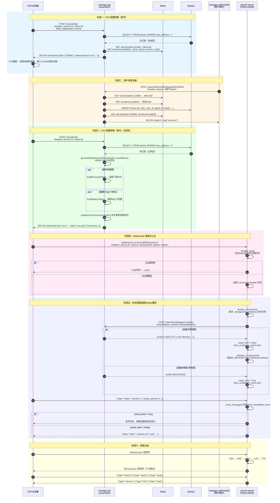

# 新设备接入平台完整流程

> 本文档详细梳理 ESP32 设备从首次启动到完成语音对话的完整接入流程，涵盖 OTA 配置获取、设备激活/绑定、WebSocket 连接建立、配置加载、Hello 握手和音频通话全链路。

---

## 一、架构概览

平台采用 **"管理后台 + 语音核心"** 双服务模式：

| 服务 | 技术栈 | 端口 | 职责 |
|------|--------|------|------|
| **manager-api** | Java Spring Boot | 8002 | 设备管理、OTA 配置、用户绑定、个性化配置组装 |
| **xiaozhi-server** | Python | 8000 (WebSocket) / 8003 (HTTP) | 实时音频对话、WebSocket 服务、OTA 文件下载 |
| **Redis** | - | - | 激活码缓存、会话数据 |
| **MySQL** | - | - | 设备-用户-智能体关系持久化 |

> **关键区分**：OTA 端点根据部署模式不同由不同服务处理：
> - **智控台模式**（`read_config_from_api = true`）：OTA 由 `manager-api`（Java）处理，提供完整的激活/绑定/配置能力。
> - **单模块模式**（`read_config_from_api = false`）：OTA 由 `xiaozhi-server`（Python）处理，仅下发 WebSocket URL + token，**不支持激活码流程**。
>
> 本文默认以**智控台模式**（完整功能）为准进行说明。

---

## 二、完整交互流程

### 阶段一：设备发现与 OTA 配置

#### 步骤 1：设备启动，请求 OTA 配置

设备（ESP32）首次开机后，向 OTA 端点上报自身固件和硬件信息。

```
POST /xiaozhi/ota/
Host: manager-api:8002
Headers:
  Device-ID: <MAC地址，如 AA:BB:CC:DD:EE:FF>
  Client-ID: <客户端ID，如 esp32-s3>
Body:
  {
    "application": { "version": "1.2.3", "name": "xiaozhi" },
    "board": { "type": "esp32-s3", "version": "1.0.0" }
  }
```

**处理服务**：`manager-api` → `OTAController.checkOTAVersion()` → `DeviceServiceImpl.checkDeviceActive()`

---

#### 步骤 2：服务端检查设备激活状态

`DeviceServiceImpl.checkDeviceActive()` 的逻辑：

1. **查 MySQL**：通过 MAC 地址查询 `DeviceEntity`。
2. **返回固件信息**：
   - 若设备**未绑定**：返回当前上传的固件版本（不推送更新），兼容旧固件行为。
   - 若设备**已绑定**且 `autoUpdate != 0`：查询 `ota_service` 获取最新固件，如有新版本返回下载地址。
3. **返回 WebSocket 配置**：从系统参数 `server.websocket` 获取 URL（支持多节点随机分发）。
4. **生成/返回 Token**：若开启认证（`server.auth_enabled = true`），调用 `generateWebSocketToken()` 生成 HMAC-SHA256 Token。
5. **返回 MQTT 配置**：若配置了 `server.mqtt_gateway`，生成 MQTT 客户端ID、用户名、密码签名。

**分支 A：设备未绑定（首次接入）**

```json
{
  "server_time": { "timestamp": 1713700000000, "timezone_offset": 480 },
  "firmware": { "version": "1.2.3", "url": "" },
  "websocket": { "url": "ws://host:8000/xiaozhi/v1/", "token": "" },
  "activation": {
    "code": "123456",
    "message": "https://console.xiaozhi.me\n123456",
    "challenge": "AA:BB:CC:DD:EE:FF"
  }
}
```

> `activation.code` 为 **6 位随机数字**，服务端将其写入 Redis：
> - Key `ota:activation:{code}` → deviceId（反向索引，用于绑定验证）
> - Key `ota:device:{safeDeviceId}` → {mac_address, board, app_version, activation_code}（设备激活信息）

**分支 B：设备已绑定（非首次接入）**

```json
{
  "server_time": { "timestamp": 1713700000000, "timezone_offset": 480 },
  "firmware": { "version": "1.3.0", "url": "https://.../otaMag/download/{uuid}" },
  "websocket": { "url": "ws://host:8000/xiaozhi/v1/", "token": "xxx.yyy" },
  "mqtt": {
    "endpoint": "mqtt://gateway:1883",
    "client_id": "GID_esp32-s3@@@AA_BB_CC_DD_EE_FF@@@AA_BB_CC_DD_EE_FF",
    "username": "eyJpcCI6IjE5Mi4xNjguMS4xIn0=",
    "password": "base64_hmac_signature",
    "publish_topic": "device-server",
    "subscribe_topic": "devices/p2p/AA_BB_CC_DD_EE_FF"
  }
}
```

---

#### 步骤 3：设备播报激活码（仅未绑定分支）

设备收到 `activation.code` 后，通过 TTS 播报提示语：

> "请登录控制面板，输入 123456，绑定设备"

此时设备**尚未获得 WebSocket Token**，无法建立实时连接。

---

### 阶段二：设备激活与绑定

#### 步骤 4：用户在管理端绑定设备

用户登录 `manager-web`（Vue.js，端口 8001）或 `manager-mobile`（uni-app），进入设备管理页面，输入设备播报的 6 位激活码。

```
POST /xiaozhi/device/bind/{agentId}/{deviceCode}
Host: manager-api:8002
Headers: Authorization: Bearer <用户OAuth2 Token>
```

**处理服务**：`manager-api` → `DeviceController.bindDevice()` → `DeviceServiceImpl.deviceActivation()`

绑定逻辑：
1. **验证激活码**：查 Redis `ota:activation:{deviceCode}` 获取 deviceId。
2. **校验缓存一致性**：查 Redis `ota:device:{safeDeviceId}` 确认 `activation_code` 匹配。
3. **检查设备是否已激活**：查 MySQL，若已存在则报错（`DEVICE_ALREADY_ACTIVATED`）。
4. **创建设备记录**：
   ```java
   DeviceEntity entity = new DeviceEntity();
   entity.setId(deviceId);           // MAC 地址
   entity.setMacAddress(macAddress);
   entity.setUserId(user.getId());   // 当前登录用户
   entity.setAgentId(agentId);       // 用户选择的智能体
   entity.setBoard(board);
   entity.setAppVersion(appVersion);
   entity.setAutoUpdate(1);
   entity.setLastConnectedAt(now);
   deviceDao.insert(entity);
   ```
5. **清理缓存**：删除 Redis 中的激活码缓存和智能体设备数量缓存。

---

#### 步骤 5：设备再次请求 OTA（获取 Token）

绑定成功后，设备**再次发起 OTA 请求**（通常自动重试或用户重启设备）。

```
POST /xiaozhi/ota/
Host: manager-api:8002
Headers:
  Device-ID: AA:BB:CC:DD:EE:FF
  Client-ID: esp32-s3
```

此时 `checkDeviceActive` 发现设备已在 MySQL 中：
- 生成 **WebSocket Token**（`generateWebSocketToken()`）
- 返回 `websocket.url` + `websocket.token`
- 异步更新 `last_connected_at` 和 `app_version`

> **Token 生成算法**：
> ```
> content = clientId + "|" + username + "|" + timestamp
> signature = HMAC-SHA256(secretKey, content)
> token = base64url(signature) + "." + timestamp
> ```
> 其中 `username = deviceId`（MAC 地址），`secretKey` 来自系统参数 `server.secret`。

---

### 阶段三：WebSocket 连接与实时通信

#### 步骤 6：建立 WebSocket 连接

设备使用 OTA 返回的 Token 建立持久连接：

```
WebSocket ws://xiaozhi-server:8000/xiaozhi/v1/
Headers:
  device-id: AA:BB:CC:DD:EE:FF
  client-id: esp32-s3
  authorization: Bearer <token>
```

**处理服务**：`xiaozhi-server` → `WebSocketServer._handle_connection()`

连接处理流程：
1. **提取 Headers**：从 WebSocket 握手请求中获取 `device-id`、`client-id`、`authorization`。
   - 若 headers 缺失，尝试从 URL 查询参数 `?device-id=...&client-id=...&authorization=...` 获取。
2. **认证**（`_handle_auth`）：
   - 若 `auth.enabled = false`：跳过认证。
   - 若设备在 `allowed_devices` 白名单中：跳过认证。
   - 否则：解析 `Bearer <token>`，调用 `AuthManager.verify_token()`。
   - 验证逻辑：拆分 `signature.timestamp`，重新计算 HMAC-SHA256，对比签名；检查时间戳是否过期（默认 30 天）。
3. **创建 ConnectionHandler**：为每个连接创建独立的 `ConnectionHandler` 实例（状态机）。

---

#### 步骤 7：ConnectionHandler 初始化

`ConnectionHandler.handle_connection()` 的核心逻辑：

```python
async def handle_connection(self, ws):
    # 1. 获取运行中的事件循环
    self.loop = asyncio.get_running_loop()

    # 2. 提取并记录 headers、device_id、client_ip
    self.headers = dict(ws.request.headers)
    self.device_id = self.headers.get("device-id")

    # 3. 检查是否来自 MQTT 网关
    self.conn_from_mqtt_gateway = request_path.endswith("?from=mqtt_gateway")

    # 4. 启动超时检查任务（无语音输入时自动断开）
    self.timeout_task = asyncio.create_task(self._check_timeout())

    # 5. 在后台异步初始化配置和组件（不阻塞主循环）
    asyncio.create_task(self._background_initialize())

    # 6. 进入消息循环，处理设备发来的消息
    async for message in self.websocket:
        await self._route_message(message)
```

**关键点**：`_background_initialize()` 是**异步后台任务**，与消息循环**并行执行**。在配置加载完成前，设备发来的消息会被 `_route_message` 拦截等待（最多 1 秒）。

---

#### 步骤 8：异步加载个性化配置（后台）

`_background_initialize()` → `_initialize_private_config_async()` 的逻辑：

1. **判断模式**：
   - 若 `read_config_from_api = false`（单模块模式）：直接设置 `need_bind = False`，跳过 API 调用。
   - 若 `read_config_from_api = true`（智控台模式）：调用 `get_private_config_from_api()`。

2. **调用 manager-api 获取配置**：
   ```
   POST /xiaozhi/config/agent-models
   Body: {
     "macAddress": "AA:BB:CC:DD:EE:FF",
     "clientId": "esp32-s3",
     "selectedModule": { "VAD": "silero", "ASR": "funasr", "LLM": "openai", "TTS": "edge" }
   }
   ```
   由 `ConfigServiceImpl` 组装个性化 AI 配置（TTS 音色、LLM 模型、插件、记忆配置、MCP 等）。

3. **处理异常响应**：
   - `code = 10041`（`DeviceNotFoundException`）：设备未在平台注册 → `need_bind = True`
   - `code = 10042`（`DeviceBindException`）：设备未绑定到用户 → `need_bind = True`，记录 `bind_code`
   - 其他异常：网络超时等 → `need_bind = True`，降级处理

4. **配置加载完成后**：
   - 设置 `bind_completed_event.set()`，解除消息拦截。
   - 在线程池中初始化组件（VAD、ASR、TTS、LLM、Memory、Intent）。

> **双重绑定检查**：
> - 第一重：OTA 阶段（`manager-api` 查 MySQL）。
> - 第二重：WebSocket 阶段（`xiaozhi-server` 调用 `manager-api` 的 `/config/agent-models`）。
> - 若第二重发现未绑定，设备虽能连上 WebSocket，但所有消息会被丢弃，并周期性播放绑定提示。

---

#### 步骤 9：Hello 握手

配置加载完成后（`bind_completed_event` 已设置），设备发送 `hello` 消息：

```json
{
  "type": "hello",
  "version": 1,
  "transport": "websocket",
  "audio_params": {
    "format": "opus",
    "sample_rate": 24000,
    "channels": 1,
    "frame_duration": 60
  },
  "features": {
    "mcp": true
  }
}
```

服务端响应（`handleTextMessage` → `hello` handler）：

```json
{
  "type": "hello",
  "transport": "websocket",
  "session_id": "550e8400-e29b-41d4-a716-446655440000",
  "audio_params": {
    "format": "opus",
    "sample_rate": 24000,
    "channels": 1,
    "frame_duration": 60
  }
}
```

---

#### 步骤 10：开始语音对话

Hello 握手完成后，进入完整的音频对话循环。

**上行（设备 → 服务器）**：opus 音频流

```
设备麦克风 → opus 编码 → WebSocket binary frame → xiaozhi-server
```

**服务器内部处理流水线**：

```
┌─────────┐    ┌─────────┐    ┌──────────┐    ┌─────────┐    ┌─────────┐
│   VAD   │ →  │   ASR   │ →  │  Intent  │ →  │   LLM   │ →  │   TTS   │
│ 语音检测 │    │ 语音识别 │    │ 意图识别  │    │ 大模型  │    │ 语音合成 │
└────┬────┘    └────┬────┘    └────┬─────┘    └────┬────┘    └────┬────┘
     │              │              │               │              │
     ▼              ▼              ▼               ▼              ▼
 检测到人声      转成文本        判断意图        生成回复        合成音频
```

**下行（服务器 → 设备）**：opus 音频流

```
TTS 输出 → opus 编码 → WebSocket binary frame → 设备扬声器
```

**文本控制消息**（JSON）：

| 消息类型 | 方向 | 说明 |
|---------|------|------|
| `hello` | 双向 | 握手，协商音频参数 |
| `listen` | 设备→服务 | 开始监听（通常由 VAD 触发后自动发送） |
| `abort` | 设备→服务 | 中断当前 TTS 输出 |
| `iot` | 双向 | 物联网设备状态/控制 |
| `mcp` | 双向 | MCP 工具调用 |
| `server` | 服务→设备 | 服务端指令（如重启、配置更新） |
| `ping` | 设备→服务 | 心跳保活 |

---

## 三、完整交互流程图（Mermaid）



---

## 四、关键接口汇总

### manager-api 端点（Java，端口 8002）

| 端点 | 方法 | 说明 | 处理类 |
|------|------|------|--------|
| `/xiaozhi/ota/` | POST | OTA 版本检查和设备激活状态 | `OTAController` |
| `/xiaozhi/ota/activate` | POST | 快速检查设备是否已激活 | `OTAController` |
| `/xiaozhi/device/bind/{agentId}/{deviceCode}` | POST | 用户绑定设备 | `DeviceController` |
| `/xiaozhi/device/register` | POST | 手动注册设备（生成验证码） | `DeviceController` |
| `/xiaozhi/config/agent-models` | POST | 获取设备个性化 AI 配置 | `ConfigController` |
| `/xiaozhi/config/server-base` | POST | 获取服务器基础配置 | `ConfigController` |

### xiaozhi-server 端点（Python）

| 端点 | 端口 | 说明 | 处理类 |
|------|------|------|--------|
| `ws://host:8000/xiaozhi/v1/` | 8000 | WebSocket 实时音频对话 | `WebSocketServer` |
| `/xiaozhi/ota/` | 8003 | OTA 配置（仅单模块模式启用） | `OTAHandler` |
| `/xiaozhi/ota/download/{filename}` | 8003 | 固件 `.bin` 文件下载 | `OTAHandler` |
| `/mcp/vision/explain` | 8003 | 视觉分析 | `VisionHandler` |

---

## 五、核心代码文件索引

| 服务 | 文件路径 | 职责 |
|------|---------|------|
| **manager-api** | `modules/device/controller/OTAController.java` | OTA 入口端点 |
| | `modules/device/service/impl/DeviceServiceImpl.java` | 设备激活/绑定/Token 生成的核心业务逻辑 |
| | `modules/device/controller/DeviceController.java` | 设备绑定/注册/解绑 REST API |
| | `modules/config/service/impl/ConfigServiceImpl.java` | 个性化配置组装 |
| **xiaozhi-server** | `core/websocket_server.py` | WebSocket 服务端、认证、连接分发 |
| | `core/connection.py` | 单设备连接状态机、消息路由、组件初始化 |
| | `core/auth.py` | HMAC-SHA256 Token 生成与验证 |
| | `core/api/ota_handler.py` | Python 端 OTA 处理（单模块模式） |
| | `config/manage_api_client.py` | 调用 manager-api 的 HTTP 客户端 |
| | `config/config_loader.py` | 配置加载与合并 |

---

## 六、常见误区与注意事项

1. **OTA 端点的归属**：智控台模式下，设备应直接访问 `manager-api:8002/xiaozhi/ota/`，而不是 `xiaozhi-server:8003/xiaozhi/ota/`。后者仅在单模块模式下生效。

2. **激活码 vs 验证码**：
   - **激活码**（`activation.code`）：由 OTA 接口自动生成，用于设备首次接入时的用户绑定，生命周期在 Redis 中。
   - **验证码**（`register` 接口）：由 `/device/register` 生成，用于手动添加设备的场景，与标准 OTA 激活流程**相互独立**。

3. **Token 的有效期**：默认 30 天（可通过 `auth.expire_seconds` 配置）。Token 过期后设备需重新请求 OTA 获取新 Token。

4. **绑定状态的双重检查**：设备可能在 OTA 阶段通过了检查（MySQL 有记录），但 WebSocket 阶段调用 `/config/agent-models` 时因数据不一致返回未绑定。此时 `xiaozhi-server` 会拒绝处理消息，设备将听到绑定提示。

5. **WebSocket URL 的多节点支持**：`server.websocket` 参数支持分号分隔多个地址（如 `ws://node1:8000/xiaozhi/v1/;ws://node2:8000/xiaozhi/v1/`），`manager-api` 会随机分发。

6. **MQTT 与 WebSocket 的互斥**：若配置了 `server.mqtt_gateway`，OTA 返回 MQTT 配置；否则返回 WebSocket 配置。设备根据返回内容决定连接方式。
