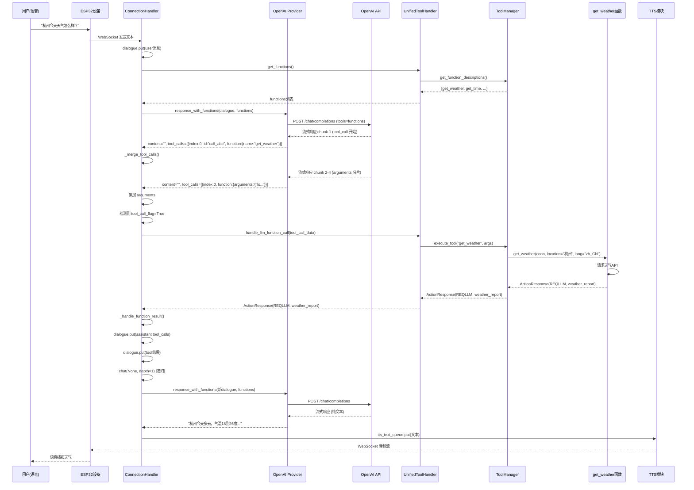

# xiaozhi-esp32-server LLM 工具调用完整流程详解

> 本文档以 **OpenAI Provider** 为例，结合项目实际源码，详细讲解从用户提问到工具执行、再到最终回复的完整链路。

---

## 一、整体架构概览

```
┌─────────────────┐     WebSocket      ┌──────────────────┐
│   ESP32 设备     │ ◄───────────────► │  WebSocketServer │
│  (麦克风/扬声器)  │                   │   (port 8000)    │
└─────────────────┘                   └────────┬─────────┘
                                               │
                                               ▼
                                      ┌──────────────────┐
                                      │ ConnectionHandler│  ← 每台设备一个实例
                                      │   (状态机核心)    │
                                      └────────┬─────────┘
                                               │
        ┌─────────────┬─────────────┬──────────┼──────────┬─────────────┐
        ▼             ▼             ▼          ▼          ▼             ▼
   ┌─────────┐  ┌─────────┐  ┌─────────┐ ┌─────────┐ ┌─────────┐  ┌─────────┐
   │   VAD   │  │   ASR   │  │   LLM   │ │   TTS   │ │  Memory │  │  Intent │
   │ (语音端点)│  │ (语音识别)│  │ (大模型) │ │ (语音合成)│ │  (记忆)  │  │(意图识别)│
   └─────────┘  └─────────┘  └────┬────┘ └─────────┘ └─────────┘  └────┬────┘
                                   │                                   │
                                   │         ┌──────────────────┐     │
                                   │         │ UnifiedToolHandler│◄────┘
                                   │         │   (统一工具处理器)  │
                                   │         └────────┬─────────┘
                                   │                  │
                                   │    ┌─────────────┼─────────────┐
                                   │    ▼             ▼             ▼
                                   │ ┌────────┐  ┌────────┐  ┌────────┐
                                   │ │Server  │  │ Device │  │  MCP   │
                                   │ │Plugin  │  │  IoT   │  │Endpoint│
                                   │ │Executor│  │Executor│  │Executor│
                                   │ └────────┘  └────────┘  └────────┘
                                   │
                                   ▼
                            ┌─────────────┐
                            │ OpenAI API  │
                            │ (或其他LLM)  │
                            └─────────────┘
```

---

## 二、核心参与者

| 组件 | 文件路径 | 职责 |
|------|---------|------|
| `ConnectionHandler` | `core/connection.py` | 连接状态机，管理对话生命周期 |
| `LLMProvider` (OpenAI) | `core/providers/llm/openai/openai.py` | 封装 OpenAI API 调用，支持流式输出和工具调用 |
| `UnifiedToolHandler` | `core/providers/tools/unified_tool_handler.py` | 统一工具处理器，协调各类工具执行 |
| `ToolManager` | `core/providers/tools/unified_tool_manager.py` | 工具管理器，维护工具注册表和缓存 |
| `ToolExecutor` | `core/providers/tools/base/tool_executor.py` | 工具执行器抽象基类 |
| `@register_function` | `plugins_func/register.py` | 函数注册装饰器 |
| `Dialogue` | `core/utils/dialogue.py` | 对话历史管理 |

---

## 三、工具注册机制

### 3.1 装饰器注册

项目采用**装饰器自动发现**模式注册工具。以 `get_weather` 为例：

```python
# plugins_func/functions/get_weather.py

GET_WEATHER_FUNCTION_DESC = {
    "type": "function",
    "function": {
        "name": "get_weather",
        "description": "获取某个地点的天气，用户应提供一个位置...",
        "parameters": {
            "type": "object",
            "properties": {
                "location": {
                    "type": "string",
                    "description": "地点名，例如杭州。可选参数",
                },
                "lang": {
                    "type": "string",
                    "description": "返回用户使用的语言code",
                },
            },
            "required": ["lang"],
        },
    },
}

@register_function("get_weather", GET_WEATHER_FUNCTION_DESC, ToolType.SYSTEM_CTL)
def get_weather(conn: "ConnectionHandler", location: str = None, lang: str = "zh_CN"):
    # ... 获取天气逻辑 ...
    return ActionResponse(Action.REQLLM, weather_report, None)
```

`@register_function` 将函数元信息写入全局字典：

```python
# plugins_func/register.py
all_function_registry = {}

def register_function(name, desc, type=None):
    def decorator(func):
        all_function_registry[name] = FunctionItem(name, desc, func, type)
        return func
    return decorator
```

### 3.2 初始化时加载工具

```python
# core/connection.py:850
self.func_handler = UnifiedToolHandler(self)

# core/providers/tools/unified_tool_handler.py:57
async def _initialize(self):
    # 自动导入 plugins_func/functions/ 下所有模块
    auto_import_modules("plugins_func.functions")
    # 各执行器从 all_function_registry 收集工具
```

---

## 四、完整调用流程（以"查询天气"为例）

### 阶段 1：用户提问 → 构造请求

```
用户说: "杭州今天天气怎么样？"
         │
         ▼
┌─────────────────────────────────────────────────────────────────┐
│  ConnectionHandler.chat(query="杭州今天天气怎么样？", depth=0)     │
│  core/connection.py:861                                          │
└─────────────────────────────────────────────────────────────────┘
         │
         ▼
┌─────────────────────────────────────────────────────────────────┐
│  1. 用户消息加入对话历史                                          │
│     self.dialogue.put(Message(role="user", content=query))       │
│                                                                  │
│  2. 获取可用工具描述列表                                          │
│     functions = self.func_handler.get_functions()                │
│                                                                  │
│  3. 调用支持工具调用的 LLM 接口                                   │
│     llm_responses = self.llm.response_with_functions(            │
│         self.session_id,                                         │
│         self.dialogue.get_llm_dialogue_with_memory(...),         │
│         functions=functions                                      │
│     )                                                            │
└─────────────────────────────────────────────────────────────────┘
```

**此时对话历史 (`dialogue`) 内容：**

```json
[
  {"role": "system", "content": "你是小智，一个智能语音助手..."},
  {"role": "user", "content": "杭州今天天气怎么样？"}
]
```

**此时 `functions` 参数内容（OpenAI Tools 格式）：**

```json
[
  {
    "type": "function",
    "function": {
      "name": "get_weather",
      "description": "获取某个地点的天气...",
      "parameters": { ... }
    }
  },
  {
    "type": "function",
    "function": {
      "name": "get_time",
      "description": "获取当前时间...",
      "parameters": { ... }
    }
  }
  // ... 更多工具
]
```

---

### 阶段 2：OpenAI Provider 发送请求

```python
# core/providers/llm/openai/openai.py:112

def response_with_functions(self, session_id, dialogue, functions=None, **kwargs):
    dialogue = self.normalize_dialogue(dialogue)

    request_params = {
        "model": self.model_name,        # 如 "gpt-4o"
        "messages": dialogue,             # 对话历史
        "stream": True,                   # 流式输出
        "tools": functions,               # 工具描述列表 ★关键
    }

    # 添加可选参数
    optional_params = {
        "max_tokens": kwargs.get("max_tokens", self.max_tokens),
        "temperature": kwargs.get("temperature", self.temperature),
        "top_p": kwargs.get("top_p", self.top_p),
        "frequency_penalty": kwargs.get("frequency_penalty", self.frequency_penalty),
    }
    for key, value in optional_params.items():
        if value is not None:
            request_params[key] = value

    # ★★★ 发送请求到 OpenAI API ★★★
    stream = self.client.chat.completions.create(**request_params)
    #                                  │
    #                                  │ 实际发送的 HTTP 请求示例：
    #                                  │ POST /v1/chat/completions
    #                                  │ {
    #                                  │   "model": "gpt-4o",
    #                                  │   "messages": [...],
    #                                  │   "stream": true,
    #                                  │   "tools": [{"type": "function", ...}]
    #                                  │ }

    for chunk in stream:
        if getattr(chunk, "choices", None):
            delta = chunk.choices[0].delta
            content = getattr(delta, "content", "")
            tool_calls = getattr(delta, "tool_calls", None)  # ★ 提取工具调用
            yield content, tool_calls
```

**OpenAI API 响应（流式）——当模型决定调用工具时：**

```
chunk 1: delta.content = ""
         delta.tool_calls[0].id = "call_abc123"
         delta.tool_calls[0].function.name = "get_weather"

chunk 2: delta.content = ""
         delta.tool_calls[0].function.arguments = '{"loc'

chunk 3: delta.content = ""
         delta.tool_calls[0].function.arguments = 'ation":'

chunk 4: delta.content = ""
         delta.tool_calls[0].function.arguments = '"杭州"}'
```

> OpenAI 的流式工具调用是**分片传输**的：先传 `id` 和 `name`，再分段传 `arguments`。

---

### 阶段 3：收集工具调用

```python
# core/connection.py:1009

tool_calls_list = []  # 收集所有工具调用

for response in llm_responses:
    content, tools_call = response

    # 普通文本内容
    if content is not None and len(content) > 0:
        content_arguments += content

    # ★ 检测到工具调用分片，合并到列表
    if tools_call is not None and len(tools_call) > 0:
        tool_call_flag = True
        self._merge_tool_calls(tool_calls_list, tools_call)

    # 普通回复内容直接送入 TTS 队列
    if not tool_call_flag and content:
        response_message.append(content)
        self.tts.tts_text_queue.put(TTSMessageDTO(...))
```

**`_merge_tool_calls` 方法原理：**

```python
# core/connection.py:1504

def _merge_tool_calls(self, tool_calls_list, tools_call):
    """
    合并流式传输中的工具调用分片。
    OpenAI 流式返回中，同一个 tool_call 可能分多个 chunk，
    需要通过 index 来识别属于哪个工具调用。
    """
    for tool_call in tools_call:
        tool_index = tool_call.index

        # 新的工具调用，添加占位
        if tool_index >= len(tool_calls_list):
            tool_calls_list.append({"id": "", "name": "", "arguments": ""})

        # 累加分片数据
        if tool_call.id:
            tool_calls_list[tool_index]["id"] = tool_call.id
        if tool_call.function.name:
            tool_calls_list[tool_index]["name"] = tool_call.function.name
        if tool_call.function.arguments:
            tool_calls_list[tool_index]["arguments"] += tool_call.function.arguments
```

**收集完成后 `tool_calls_list` 的内容：**

```json
[
  {
    "id": "call_abc123",
    "name": "get_weather",
    "arguments": '{"location": "杭州", "lang": "zh_CN"}'
  }
]
```

---

### 阶段 4：执行工具调用

```
┌─────────────────────────────────────────────────────────────────┐
│  core/connection.py:1098                                         │
│  检测到 1 个工具调用，进入执行阶段                                  │
└─────────────────────────────────────────────────────────────────┘
         │
         ▼
┌─────────────────────────────────────────────────────────────────┐
│  for tool_call_data in tool_calls_list:                          │
│      future = asyncio.run_coroutine_threadsafe(                  │
│          self.func_handler.handle_llm_function_call(             │
│              self, tool_call_data                                │
│          ),                                                      │
│          self.loop                                               │
│      )                                                           │
└─────────────────────────────────────────────────────────────────┘
         │
         ▼
┌─────────────────────────────────────────────────────────────────┐
│  UnifiedToolHandler.handle_llm_function_call()                   │
│  core/providers/tools/unified_tool_handler.py:139                │
└─────────────────────────────────────────────────────────────────┘
         │
         ▼
┌─────────────────────────────────────────────────────────────────┐
│  1. 解析参数                                                      │
│     function_name = "get_weather"                                │
│     arguments = {"location": "杭州", "lang": "zh_CN"}            │
│                                                                  │
│  2. 发送显示消息到设备（让用户知道正在调用工具）                    │
│     await send_display_message(self.conn, "% get_weather")       │
│                                                                  │
│  3. 执行工具                                                      │
│     result = await self.tool_manager.execute_tool(               │
│         "get_weather", arguments                                 │
│     )                                                            │
└─────────────────────────────────────────────────────────────────┘
         │
         ▼
┌─────────────────────────────────────────────────────────────────┐
│  ToolManager.execute_tool()                                      │
│  core/providers/tools/unified_tool_manager.py:73                 │
└─────────────────────────────────────────────────────────────────┘
         │
         ▼
┌─────────────────────────────────────────────────────────────────┐
│  1. 查找工具类型                                                  │
│     tool_type = self.get_tool_type("get_weather")                │
│     → ToolType.SERVER_PLUGIN                                     │
│                                                                  │
│  2. 获取对应执行器                                                │
│     executor = self.executors[ToolType.SERVER_PLUGIN]            │
│     → ServerPluginExecutor                                       │
│                                                                  │
│  3. 执行工具函数                                                  │
│     result = await executor.execute(conn, "get_weather", args)   │
│     → 调用 get_weather(conn, location="杭州", lang="zh_CN")      │
│     → 返回 ActionResponse(Action.REQLLM, weather_report, None)   │
└─────────────────────────────────────────────────────────────────┘
```

**工具执行器架构：**

```
┌─────────────────┐
│   ToolManager   │
│  (统一调度中心)  │
└────────┬────────┘
         │ 根据 tool_type 路由
    ┌────┼────┬────────┬────────┐
    ▼    ▼    ▼        ▼        ▼
┌─────┐┌─────┐┌──────┐┌──────┐┌─────────┐
│Server││Server││Device││Device││  MCP   │
│Plugin││ MCP ││ IoT  ││ MCP  ││Endpoint│
│Exec  ││Exec  ││Exec  ││Exec  ││ Exec   │
└──┬───┘└──┬───┘└──┬───┘└──┬───┘└────┬────┘
   │       │       │       │         │
   ▼       ▼       ▼       ▼         ▼
 本地函数  MCP服务  设备控制  设备MCP   外部MCP
```

---

### 阶段 5：处理工具结果 → 递归调用 LLM

工具执行返回 `ActionResponse`，有三种处理方式：

| Action 类型 | 含义 | 处理方式 |
|------------|------|---------|
| `REQLLM` | 需要 LLM 处理结果 | 将结果加入对话历史，递归调用 `chat()` |
| `RESPONSE` | 直接回复 | 直接通过 TTS 回复给用户 |
| `ERROR` | 执行出错 | 返回错误提示 |

`get_weather` 返回的是 `Action.REQLLM`，所以进入递归流程：

```python
# core/connection.py:1224

def _handle_function_result(self, tool_results, depth):
    need_llm_tools = []

    for result, tool_call_data in tool_results:
        if result.action == Action.REQLLM:
            # 收集需要 LLM 处理的工具
            need_llm_tools.append((result, tool_call_data))

    if need_llm_tools:
        # 1. 将 assistant 的 tool_calls 加入对话历史
        all_tool_calls = [
            {
                "id": tool_call_data["id"],
                "function": {
                    "arguments": tool_call_data["arguments"],
                    "name": tool_call_data["name"],
                },
                "type": "function",
                "index": idx,
            }
            for idx, (_, tool_call_data) in enumerate(need_llm_tools)
        ]
        self.dialogue.put(Message(role="assistant", tool_calls=all_tool_calls))

        # 2. 将每个工具的执行结果作为 tool 消息加入对话
        for result, tool_call_data in need_llm_tools:
            self.dialogue.put(
                Message(
                    role="tool",
                    tool_call_id=tool_call_data["id"],
                    content=result.result,  # 天气查询结果文本
                )
            )

        # 3. ★★★ 递归调用 chat，让 LLM 基于工具结果生成回复 ★★★
        self.chat(None, depth=depth + 1)
```

**此时对话历史 (`dialogue`) 内容：**

```json
[
  {"role": "system", "content": "你是小智，一个智能语音助手..."},
  {"role": "user", "content": "杭州今天天气怎么样？"},
  {
    "role": "assistant",
    "content": null,
    "tool_calls": [
      {
        "id": "call_abc123",
        "type": "function",
        "function": {
          "name": "get_weather",
          "arguments": "{\"location\": \"杭州\", \"lang\": \"zh_CN\"}"
        }
      }
    ]
  },
  {
    "role": "tool",
    "tool_call_id": "call_abc123",
    "content": "您查询的位置是：杭州市\\n\\n当前天气: 多云..."
  }
]
```

**OpenAI 看到这个对话历史后，会生成类似这样的回复：**

> "杭州今天多云，气温 18~26℃，东北风 2 级。未来几天以多云到晴为主，气温逐渐回升。"

---

### 阶段 6：最终回复输出

```
┌─────────────────────────────────────────────────────────────────┐
│  LLM 生成最终回复（流式）                                         │
│  "杭州今天多云，气温18到26度..."                                  │
└─────────────────────────────────────────────────────────────────┘
         │
         ▼
┌─────────────────────────────────────────────────────────────────┐
│  ConnectionHandler.chat() 循环接收流式数据                        │
│                                                                  │
│  for response in llm_responses:                                  │
│      content = response  # 纯文本，无 tool_calls                  │
│      response_message.append(content)                            │
│      self.tts.tts_text_queue.put(                                │
│          TTSMessageDTO(content_detail=content)   → 送入TTS队列   │
│      )                                                           │
└─────────────────────────────────────────────────────────────────┘
         │
         ▼
┌─────────────────────────────────────────────────────────────────┐
│  TTS 模块将文本转为语音                                          │
│  → 通过 WebSocket 发送音频流到 ESP32 设备                         │
│  → 设备播放："杭州今天多云，气温18到26度..."                       │
└─────────────────────────────────────────────────────────────────┘
```

---

## 五、完整流程时序图



---

## 六、关键代码路径汇总

### 6.1 调用链路

```
app.py
  └── WebSocketServer.handle_connection()
        └── ConnectionHandler.chat(query)
              ├── 构建 functions 列表
              │     └── UnifiedToolHandler.get_functions()
              │           └── ToolManager.get_function_descriptions()
              ├── 调用 LLM (带工具)
              │     └── LLMProvider.response_with_functions()
              │           └── openai.OpenAI.chat.completions.create(tools=functions)
              ├── 收集 tool_calls (流式分片合并)
              │     └── ConnectionHandler._merge_tool_calls()
              ├── 执行工具
              │     └── UnifiedToolHandler.handle_llm_function_call()
              │           └── ToolManager.execute_tool()
              │                 └── ServerPluginExecutor.execute()
              │                       └── get_weather(conn, **args)
              ├── 处理结果
              │     └── ConnectionHandler._handle_function_result()
              │           ├── Action.REQLLM → 加入 dialogue，递归 chat()
              │           └── Action.RESPONSE → 直接 TTS 回复
              └── 输出最终回复
                    └── TTS 队列 → 语音输出
```

### 6.2 递归调用保护

```python
# core/connection.py:885
MAX_DEPTH = 5  # 最大递归深度，防止无限工具调用

if depth >= MAX_DEPTH:
    force_final_answer = True
    # 强制注入系统提示，要求 LLM 直接回答
    self.dialogue.put(Message(
        role="user",
        content="[系统提示] 已达到最大工具调用次数限制，请你基于目前已经获取的所有信息，直接给出最终答案。"
    ))
```

### 6.3 对话历史格式转换

`Dialogue.getMessages()` 负责将内部 `Message` 对象转为 OpenAI API 格式：

```python
# core/utils/dialogue.py:34

def getMessages(self, m, dialogue):
    if m.tool_calls is not None:
        # assistant 的 tool_calls
        dialogue.append({"role": m.role, "tool_calls": m.tool_calls})
    elif m.role == "tool":
        # tool 的执行结果
        dialogue.append({
            "role": m.role,
            "tool_call_id": m.tool_call_id,
            "content": m.content,
        })
    else:
        # 普通消息
        dialogue.append({"role": m.role, "content": m.content})
```

---

## 七、工具调用的两种格式

项目同时支持 **OpenAI 原生工具调用格式** 和 **文本格式**（用于兼容不支持原生工具调用的模型）：

### 格式 A：OpenAI 原生（Stream 模式）

```python
# response_with_functions 返回的是 (content, tool_calls) 元组
delta.tool_calls = [{
    "index": 0,
    "id": "call_xxx",
    "function": {
        "name": "get_weather",
        "arguments": '{"location": "杭州"}'
    }
}]
```

### 格式 B：文本格式（`<tool_call>` 标签）

```python
# core/connection.py:1020
if content_arguments.startswith("<tool_call>"):
    tool_call_flag = True

# 从文本中提取 JSON
a = extract_json_from_string(content_arguments)
# {"name": "get_weather", "arguments": {"location": "杭州"}}
```

---

## 八、总结

| 步骤 | 做什么 | 关键文件 |
|------|--------|---------|
| 1. 注册 | `@register_function` 装饰器将函数元信息写入全局注册表 | `plugins_func/register.py` |
| 2. 加载 | `auto_import_modules` 自动导入所有工具模块 | `plugins_func/loadplugins.py` |
| 3. 收集 | `ToolManager` 从各执行器收集工具描述，缓存为 OpenAI 格式 | `unified_tool_manager.py` |
| 4. 请求 | `LLMProvider` 将 `tools` 参数随对话历史发送给 OpenAI | `openai/openai.py` |
| 5. 检测 | 流式接收响应，检测 `tool_calls` 分片并合并 | `connection.py` |
| 6. 执行 | `UnifiedToolHandler` 路由到对应执行器，调用实际函数 | `unified_tool_handler.py` |
| 7. 递归 | 将工具结果以 `role=tool` 加入对话，递归调用 LLM | `connection.py` |
| 8. 输出 | LLM 基于工具结果生成最终回复，经 TTS 输出语音 | `connection.py` → TTS |

整个流程的核心思想是：**LLM 是"决策者"（决定是否调用工具、调用什么工具），工具执行器是"执行者"（实际获取数据/操作设备），二者通过对话历史串联，形成完整的推理-行动闭环。**
