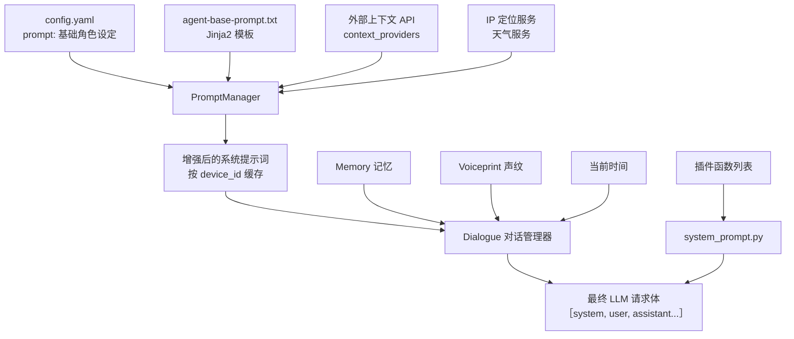
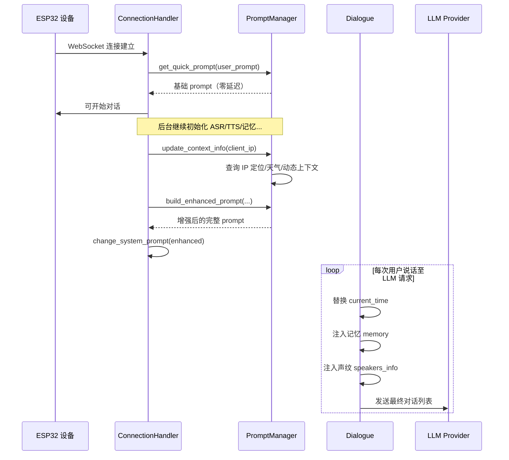

# xiaozhi-esp32-server LLM 提示词构建方案详解

> 本文档详细描述项目中与 LLM 交互时提示词（Prompt）的构建流程、动态注入机制以及按设备个性化的实现原理。

---

## 一、整体架构概览

提示词的构建采用**分层组装**模式：

1. **基础角色层**：用户在 `config.yaml` 中配置的角色设定（如性格、身份、口头禅）。
2. **模板增强层**：`agent-base-prompt.txt` 作为 Jinja2 模板，将基础角色包装成完整的系统提示词，并注入时间、位置、天气等动态上下文。
3. **请求前最终层**：`Dialogue` 在每次调用 LLM 时，将模板中的实时占位符（如 `{{current_time}}`）、记忆、声纹信息做最终替换。
4. **函数调用层**：若启用了工具，会额外追加 `<tool_call>` 格式说明到 system message。



---

## 二、核心组件说明

| 文件/模块 | 职责 |
|----------|------|
| `config.yaml` → `prompt:` | 存储基础角色设定，是提示词的"灵魂"。 |
| `agent-base-prompt.txt` | Jinja2 模板文件，定义系统提示词的骨架、规则、约束、上下文注入点。 |
| `core/utils/prompt_manager.py` | `PromptManager` 类。负责加载模板、获取天气/位置/时间/动态上下文、渲染增强提示词、按设备缓存。 |
| `core/utils/context_provider.py` | `ContextDataProvider` 类。负责向配置的第三方 API 拉取动态数据（如健康、股票、日程）。 |
| `core/utils/dialogue.py` | `Dialogue` 类。管理对话历史，并在每次请求 LLM 前做最终替换（时间、记忆、声纹）。 |
| `core/providers/llm/system_prompt.py` | 定义函数调用（Tool Use）的格式规范与行为约束。 |
| `core/providers/llm/base.py` | LLM Provider 基类，定义 `response`、`response_no_stream`、`response_with_functions` 接口。 |

---

## 三、提示词构建三阶段详解

### 阶段一：快速初始化（连接建立后立即执行）

**触发位置**：`core/connection.py` → `_initialize_components()`

当 ESP32 设备通过 WebSocket 连接成功后，`ConnectionHandler` 需要尽快让设备进入可对话状态。因此第一阶段不等待任何外部 I/O，直接把 `config.yaml` 中的 `prompt` 塞入对话上下文。

```python
# core/connection.py (约第 499-503 行)
if self.config.get("prompt") is not None:
    user_prompt = self.config["prompt"]
    prompt = self.prompt_manager.get_quick_prompt(user_prompt)
    self.change_system_prompt(prompt)
```

**`get_quick_prompt` 逻辑**：
1. 检查缓存中是否存在 `device_prompt:{device_id}`，若存在直接返回（设备复连时命中）。
2. 若未命中缓存，返回传入的 `user_prompt` 并写入缓存。

> 这一步的目的是**零延迟启动**，让用户可以立刻开始说话，无需等待天气/定位等网络请求。

---

### 阶段二：异步增强（组件初始化完成后执行）

**触发位置**：`core/connection.py` → `_init_prompt_enhancement()`

在 ASR、TTS、记忆、意图识别等本地组件初始化完成后，系统调用 `PromptManager` 对提示词进行增强：

```python
def _init_prompt_enhancement(self):
    self.prompt_manager.update_context_info(self, self.client_ip)
    enhanced_prompt = self.prompt_manager.build_enhanced_prompt(
        self.config["prompt"], self.device_id, self.client_ip
    )
    if enhanced_prompt:
        self.change_system_prompt(enhanced_prompt)
```

#### 2.1 更新上下文信息 `update_context_info`

该方法会同步触发以下数据收集（部分结果依赖全局缓存，避免重复请求）：

| 数据项 | 来源 | 缓存策略 |
|--------|------|----------|
| 位置信息 (`local_address`) | `core.utils.util.get_ip_info(client_ip)` | `CacheType.LOCATION`，全局缓存 |
| 天气信息 (`weather_info`) | `plugins_func.functions.get_weather` | `CacheType.WEATHER`，按城市缓存 |
| 动态上下文 (`dynamic_context`) | `ContextDataProvider.fetch_all(device_id)` | 无默认缓存，每次初始化时重新拉取 |

#### 2.2 构建增强提示词 `build_enhanced_prompt`

使用 `agent-base-prompt.txt` 作为 Jinja2 模板，将变量替换为实际值：

```jinja2
<identity>
{{base_prompt}}
</identity>

<context>
- 当前时间：{{current_time}}
- 今天日期：{{today_date}}（{{today_weekday}}）
- 今天农历：{{lunar_date}}
- 设备所在地：{{local_address}}
- 本地未来天气：{{weather_info}}
{{ dynamic_context }}
</context>
```

**注入的变量清单**：

- `base_prompt`：来自 `config.yaml` 的角色设定。
- `today_date` / `today_weekday` / `lunar_date`：当前公历、星期、农历（实时计算，不缓存）。
- `local_address`：IP 定位得到的城市名。
- `weather_info`：该城市的天气报告。
- `language`：TTS 配置的语言（如"中文"）。
- `emojiList`：允许使用的 Emoji 白名单列表。
- `device_id` / `client_ip`：设备标识与连接 IP。
- `dynamic_context`：外部 API 返回的格式化上下文数据。

增强后的提示词会以 `device_prompt:{device_id}` 为 Key 写入**设备级缓存**，后续该设备的对话会直接命中，直到连接断开或服务器重启。

---

### 阶段三：请求前最终替换（每次调用 LLM 时执行）

**触发位置**：`core/utils/dialogue.py` → `get_llm_dialogue_with_memory()`

模板里有些信息变化频率极高（如当前时间），不适合在连接建立时写死。因此 `Dialogue` 在每次组装 LLM 请求体时，会做最后的"热替换"：

```python
# core/utils/dialogue.py (约第 137-175 行)
enhanced_system_prompt = system_message.content
# 1. 替换时间占位符
enhanced_system_prompt = enhanced_system_prompt.replace(
    "{{current_time}}", datetime.now().strftime("%H:%M")
)

# 2. 追加声纹信息
speakers = voiceprint_config.get("speakers", [])
if speakers:
    enhanced_system_prompt += "\n\n<speakers_info>..."

# 3. 替换记忆标签
if memory_str is not None:
    enhanced_system_prompt = re.sub(
        r"<memory>.*?</memory>",
        f"<memory>\n{memory_str}\n</memory>",
        enhanced_system_prompt,
        flags=re.DOTALL,
    )
```

**为什么分三层？**

| 阶段 | 执行时机 | 处理内容 | 设计目的 |
|------|----------|----------|----------|
| 快速初始化 | 连接建立后 | 基础角色设定 | 零延迟可用 |
| 异步增强 | 本地组件就绪后 | 天气、位置、动态上下文 | 网络 I/O 完成后一次性注入 |
| 请求前替换 | 每次 LLM 调用前 | 当前时间、记忆、声纹 | 保证信息的实时性与准确性 |



---

## 四、设备级动态调整机制

项目支持**按设备动态调整提示词**，主要通过以下三条路径实现：

### 4.1 设备级缓存隔离

`PromptManager` 以 `device_id` 为维度缓存增强后的提示词：

```python
device_cache_key = f"device_prompt:{device_id}"
self.cache_manager.set(CacheType.DEVICE_PROMPT, device_cache_key, enhanced_prompt)
```

- 不同设备首次连接时，会独立构建各自的增强提示词。
- 即使多个设备同时在线，它们的 prompt 缓存互不干扰。

### 4.2 动态上下文源（`context_providers`）

在 `config.yaml` 中可以配置一个或多个外部上下文 API：

```yaml
context_providers:
  - url: "https://your-api.com/health"
    headers:
      Authorization: "Bearer YOUR_TOKEN"
  - url: "https://your-api.com/stock"
    headers:
      Authorization: "Bearer YOUR_TOKEN"
```

**工作原理**：

1. `ContextDataProvider.fetch_all(device_id)` 遍历所有配置的 URL。
2. 对每个 URL 发起 HTTP GET，并在 **Request Header** 中注入 `device-id`：
   ```python
   headers["device-id"] = device_id
   response = httpx.get(url, headers=headers, timeout=3)
   ```
3. 后端可依据 `device-id` 返回该设备专属的数据（如该用户的心率、步数、持仓股票）。
4. 返回格式需满足：
   ```json
   {
     "code": 0,
     "data": {
       "心率": "72 bpm",
       "步数": "8543"
     }
   }
   ```
5. `ContextDataProvider` 将 `data` 格式化为 Markdown 列表，注入模板的 `{{dynamic_context}}` 位置。

> **这意味着**：你可以为不同设备/用户配置完全不同的后端服务，实现千人千面的提示词。

### 4.3 声纹与记忆的个性化注入

- **声纹识别**：若某设备开启了声纹功能并配置了说话人列表，系统会在每次 LLM 请求前，把 `<speakers_info>` 追加到 system prompt 末尾。LLM 可根据说话人身份调整回应风格（如对主人更亲昵，对客人更礼貌）。
- **记忆模块**：`MemoryProvider` 按 `session_id` 或 `device_id` 检索历史记忆，将结果替换提示词中的 `<memory>...</memory>` 标签，使 LLM 能回忆之前的对话内容。

---

## 五、函数调用（Tool Use）的特殊处理

当启用了插件函数时，LLM 请求不再只是普通对话，还需要让模型知道"有哪些工具可用"以及"如何调用"。

**处理流程**：

1. `UnifiedToolHandler` 收集所有可用函数（IoT 工具、MCP 工具、服务端插件等），序列化为 OpenAI 格式的 JSON Schema。
2. `core/providers/llm/system_prompt.py` 中的 `get_system_prompt_for_function(functions)` 生成一段严格的 Tool Use 规范说明，包含：
   - `<tool_call>` XML 标签格式
   - JSON 参数结构示例
   - 单步调用、等待结果、再继续的行为约束
3. 该 Tool Use 说明与之前的系统提示词拼接，作为最终的 `system` message 发送给 LLM。

**System Prompt 结构示意**：

```text
====
TOOL USE
...（格式规范 + functions JSON）
====
USER CHAT CONTENT
...（增强后的角色设定与上下文）
```

> 注意：只有支持 function calling 的 Provider（如 OpenAI、Gemini、Dify 等）会真正使用这段提示词；不支持的 Provider 会直接回退到普通文本生成。

---

## 六、配置文件示例

以下是一个完整的提示词相关配置片段（摘自 `config.yaml`）：

```yaml
# ######################### 角色模型配置 #########################
prompt: |
  你是小智，一个活泼开朗的 00 后女生。
  说话带点台湾腔，喜欢用"真的假的啦""笑死"这样的口头禅。
  遇到不懂的问题会大方承认，绝不胡编乱造。

# 默认系统提示词模板文件
prompt_template: agent-base-prompt.txt

# 上下文源配置：用于注入动态数据
context_providers:
  - url: "https://api.example.com/device-context"
    headers:
      Authorization: "Bearer xxx"

# 结束语配置
end_prompt:
  enable: true
  prompt: |
    请你以"时间过得真快"开头，用依依不舍的话来结束这场对话吧！
```

---

## 七、总结

xiaozhi-esp32-server 的提示词构建方案是一个**分阶段、可扩展、设备隔离**的体系：

- **分阶段**：快速初始化 → 异步增强 → 请求前热替换，兼顾了启动速度与信息实时性。
- **可扩展**：通过 `context_providers` 与 Jinja2 模板，业务方可以便捷地注入任何第三方动态数据。
- **设备隔离**：`device_id` 级缓存 + Header 透传，天然支持多租户、多设备的个性化 prompt。

如果你想为特定设备定制一套完全不同的角色人格，只需在后端为 `context_providers` 的接口按 `device-id` 返回不同的 `base_prompt` 或扩展上下文，即可实现"千机千面"。
