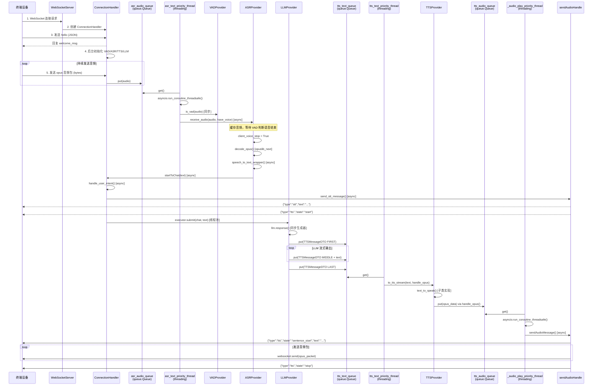

# WebSocket 音频流流转详解

> 本文面向 Python 新手，以图文结合的方式详细讲解 `xiaozhi-esp32-server` 中，音频数据是如何从终端（ESP32/浏览器）通过 WebSocket 流入服务器，再经过 ASR → LLM → TTS 处理后，把结果音频流返回给终端的完整过程。

---

## 一、整体架构鸟瞰

用一个简单的比喻：这套系统就像一个"电话客服中心"。

- **WebSocketServer**：总机接线员，负责接电话、分配客服。
- **ConnectionHandler**：专属客服，从头到尾跟进一位客户。
- **VAD (Voice Activity Detection)**：监听器，判断客户是否在说话。
- **ASR (Automatic Speech Recognition)**：速记员，把客户说的话转成文字。
- **Intent / LLM**：大脑，理解问题并生成回答。
- **TTS (Text to Speech)**：播音员，把文字回答念出来传回给客户。

```
┌─────────────┐      WebSocket       ┌─────────────────────────────────────────┐
│   终端设备   │  ◄────────────────►  │           xiaozhi-esp32-server          │
│ (ESP32/网页) │    (opus音频包)      │                                         │
└─────────────┘                      │  ┌─────────────┐    ┌─────────────┐      │
        ▲                            │  │ WebSocket   │───►│ Connection  │      │
        │                            │  │   Server    │    │  Handler    │      │
        │                            │  └─────────────┘    └──────┬──────┘      │
        │                            │                            │             │
        │      返回音频(opus)        │      ┌─────┐   ┌─────┐    │             │
        └────────────────────────────┘      │ VAD │   │ ASR │◄───┘             │
                                            └──┬──┘   └──┬──┘                  │
                                               │         │                      │
                                               ▼         ▼                      │
                                            ┌───────────────┐                  │
                                            │  Intent / LLM  │                  │
                                            └───────┬───────┘                  │
                                                    │                          │
                                                    ▼                          │
                                            ┌───────────────┐                  │
                                            │     TTS       │──────────────────┘
                                            └───────────────┘      (sendAudio)
```

---

## 二、关键文件与职责对照表

| 文件路径 | 职责 | 同步/异步 |
|---------|------|----------|
| `app.py` | 程序入口，启动 WebSocket + HTTP 双服务 | `async` |
| `core/websocket_server.py` | WebSocket 服务端，接受连接、认证、创建 Handler | `async` |
| `core/connection.py` | 连接状态机，管理整个对话生命周期 | 混合（主循环 async + 后台线程） |
| `core/handle/textHandle.py` | 文本消息总入口 | `async` |
| `core/handle/helloHandle.py` | 处理 `hello` 消息，完成握手 | `async` |
| `core/handle/receiveAudioHandle.py` | 音频流入总调度：VAD → ASR | `async` |
| `core/handle/sendAudioHandle.py` | 音频流出总调度：发送 opus 包 + TTS 状态消息 | `async` |
| `core/providers/vad/base.py` | VAD 抽象基类 | 同步 |
| `core/providers/asr/base.py` | ASR 抽象基类，含音频解码、识别逻辑 | 混合 |
| `core/providers/tts/base.py` | TTS 抽象基类，含文本切分、语音合成 | 混合 |
| `core/providers/llm/*.py` | 大模型对话生成（各厂商实现） | 同步迭代器 |

---

## 三、连接建立阶段

### 3.1 服务启动

```python
# app.py (简化)
async def main():
    ws_server = WebSocketServer(config)
    ws_task = asyncio.create_task(ws_server.start())  # 异步启动
    ota_server = SimpleHttpServer(config)
    ota_task = asyncio.create_task(ota_server.start())
    await wait_for_exit() 
```

- `app.py` 是**异步**的，用 `asyncio.run(main())` 启动。
- WebSocket 默认监听 `8000` 端口，HTTP 默认监听 `8003` 端口。

### 3.2 客户端连入

```python
# core/websocket_server.py
async def _handle_connection(self, websocket):
    # 1. 认证
    await self._handle_auth(websocket)
    # 2. 创建专属 ConnectionHandler
    handler = ConnectionHandler(self.config, self._vad, self._asr, ...)
    # 3. 交给 Handler 处理
    await handler.handle_connection(websocket)
```

**每台设备一个 `ConnectionHandler`**，互不干扰。

### 3.3 Hello 握手与后台初始化

客户端连上后，会先发送一条 JSON 文本消息：

```json
{"type": "hello", "audio_params": {"format": "opus", "sample_rate": 24000}}
```

处理链路：

```
websocket.recv()
    └── connection._route_message(message)      [async]
        └── handleTextMessage(conn, message)    [async]
            └── HelloTextMessageHandler.handle()
                └── handleHelloMessage()        [async]
                    ├── 回复 welcome_msg
                    └── 记录 audio_params
```

同时，服务器在后台启动组件初始化（**不阻塞**消息接收）：

```python
# core/connection.py
async def handle_connection(self, ws):
    # ...获取 headers...
    asyncio.create_task(self._background_initialize())  # 后台初始化
    async for message in self.websocket:
        await self._route_message(message)
```

```
_background_initialize()                         [async]
    ├── _initialize_private_config_async()       [async] 从智控台拉配置
    └── executor.submit(_initialize_components)  [线程池] 初始化 VAD/ASR/TTS/LLM
```

---

## 四、音频流入阶段（终端 → 服务器）

### 4.1 音频包到达

终端持续发送 opus 音频数据包（`bytes` 类型）。

```python
# core/connection.py
async def _route_message(self, message):
    if isinstance(message, bytes):
        self.asr_audio_queue.put(message)   # 放入线程安全的队列
```

> **新手提示**：这里用到了 Python 的 `queue.Queue`，它是一个**线程安全**的阻塞队列，专门用于在多线程之间传递数据。

### 4.2 ASR 音频消费线程

`ConnectionHandler` 初始化时会启动一个**后台线程**，专门消费音频队列：

```python
# core/providers/asr/base.py
async def open_audio_channels(self, conn):
    conn.asr_priority_thread = threading.Thread(
        target=self.asr_text_priority_thread, args=(conn,), daemon=True
    )
    conn.asr_priority_thread.start()

def asr_text_priority_thread(self, conn):
    while not conn.stop_event.is_set():
        message = conn.asr_audio_queue.get(timeout=1)
        future = asyncio.run_coroutine_threadsafe(
            handleAudioMessage(conn, message), conn.loop
        )
        future.result()
```

关键点：
- 这是一个**同步线程**在跑无限循环。
- 拿到音频后，通过 `asyncio.run_coroutine_threadsafe(...)` 把异步方法 `handleAudioMessage` 抛到主事件循环里执行。

### 4.3 VAD 检测

```python
# core/handle/receiveAudioHandle.py
async def handleAudioMessage(conn, audio):
    have_voice = conn.vad.is_vad(conn, audio)   # 同步调用
    await conn.asr.receive_audio(conn, audio, have_voice)
```

- `is_vad()` 是**同步**方法，判断这一小段音频里是否有人声。
- 如果设备刚被唤醒，会短暂忽略 VAD（避免误触发）。

### 4.4 ASR 接收与缓存

```python
# core/providers/asr/base.py
async def receive_audio(self, conn, audio, audio_have_voice):
    conn.asr_audio.append(audio)
    if not audio_have_voice and not conn.client_have_voice:
        conn.asr_audio = conn.asr_audio[-10:]   # 没声音只保留最后10帧
        return
    # 当 VAD 检测到语音结束时，触发识别
    if conn.client_voice_stop:
        asr_audio_task = conn.asr_audio.copy()
        conn.reset_audio_states()
        if len(asr_audio_task) > 15:
            await self.handle_voice_stop(conn, asr_audio_task)
```

**逻辑图解**：

```
终端音频帧 ──► [缓存] asr_audio ──► VAD 持续检测
                      │
                      ▼
              语音结束(client_voice_stop=True)
                      │
                      ▼
            handle_voice_stop()  [async]
```

### 4.5 语音停止 → 识别文本

```python
# core/providers/asr/base.py
async def handle_voice_stop(self, conn, asr_audio_task):
    # 1. opus 解码为 pcm
    pcm_data = self.decode_opus(asr_audio_task)   # 使用 opuslib_next
    combined_pcm_data = b"".join(pcm_data)

    # 2. 并发执行 ASR + 声纹识别
    asr_task = self.speech_to_text_wrapper(...)
    if conn.voiceprint_provider:
        voiceprint_task = conn.voiceprint_provider.identify_speaker(...)
        asr_result, voiceprint_result = await asyncio.gather(asr_task, voiceprint_task)
    else:
        asr_result = await asr_task

    # 3. 拿到文本，进入聊天流程
    await startToChat(conn, enhanced_text)
```

**第三方组件**：

- `opuslib_next`：负责把终端发来的 opus 包解码成 pcm 数据。
- 本地 ASR（如 `funasr`、`sherpa_onnx`）或云 ASR（讯飞、阿里云等）。

---

## 五、对话处理阶段（ASR → LLM → TTS）

### 5.1 进入聊天入口

```python
# core/handle/receiveAudioHandle.py
async def startToChat(conn, text):
    # 1. 意图识别
    intent_handled = await handle_user_intent(conn, actual_text)
    if intent_handled:
        return

    # 2. 发送 STT 状态给终端（让终端知道"我听见了"）
    await send_stt_message(conn, actual_text)

    # 3. 在后台线程中运行大模型对话
    conn.executor.submit(conn.chat, actual_text)
```

### 5.2 STT 消息发送

```python
# core/handle/sendAudioHandle.py
async def send_stt_message(conn, text):
    await conn.websocket.send(json.dumps({
        "type": "stt",
        "text": stt_text,
        "session_id": conn.session_id
    }))
    await send_tts_message(conn, "start")   # 告诉终端"我要开始说话了"
    conn.client_is_speaking = True
```

### 5.3 LLM 对话生成（chat 方法）

`chat()` 方法运行在**线程池**中（`conn.executor.submit(conn.chat, actual_text)`），因为 LLM 的流式响应是一个同步生成器。

```python
# core/connection.py
def chat(self, query, depth=0):
    # 1. 新建本轮 sentence_id
    current_sentence_id = str(uuid.uuid4().hex)
    self.sentence_id = current_sentence_id

    # 2. 记录用户消息到对话历史
    self.dialogue.put(Message(role="user", content=query))

    # 3. 向 TTS 队列发送"会话开始"标记
    self.tts.tts_text_queue.put(TTSMessageDTO(
        sentence_id=current_sentence_id,
        sentence_type=SentenceType.FIRST,
        content_type=ContentType.ACTION,
    ))

    # 4. 查询记忆（异步操作转同步等待）
    memory_str = None
    if self.memory is not None and query:
        future = asyncio.run_coroutine_threadsafe(
            self.memory.query_memory(query), self.loop
        )
        memory_str = future.result()

    # 5. 调用 LLM 流式接口
    llm_responses = self.llm.response(
        self.session_id,
        self.dialogue.get_llm_dialogue_with_memory(memory_str, ...)
    )

    # 6. 逐字/逐句消费 LLM 输出，放入 TTS 文本队列
    for response in llm_responses:
        content = response
        self.tts.tts_text_queue.put(TTSMessageDTO(
            sentence_id=current_sentence_id,
            sentence_type=SentenceType.MIDDLE,
            content_type=ContentType.TEXT,
            content_detail=content,
        ))

    # 7. 会话结束标记
    self.tts.tts_text_queue.put(TTSMessageDTO(
        sentence_id=current_sentence_id,
        sentence_type=SentenceType.LAST,
        content_type=ContentType.ACTION,
    ))
```

**新手提示**：`tts_text_queue` 是 `queue.Queue`，用于在 `chat()` 线程和 TTS 后台线程之间安全地传递数据。

### 5.4 工具调用（可选）

如果 LLM 返回的是 `function_call`，`chat()` 会：
1. 解析出要调用的工具名称和参数。
2. 用 `asyncio.run_coroutine_threadsafe(...)` 把工具调用抛到主事件循环执行。
3. 拿到工具结果后，再次递归调用 `self.chat(None, depth=depth+1)`，让 LLM 根据工具结果生成最终回答。

---

## 六、音频流出阶段（服务器 → 终端）

### 6.1 TTS 双线程模型

`TTSProviderBase` 启动了两个**后台线程**：

```
┌─────────────────────┐         ┌─────────────────────┐
│ tts_text_priority   │         │ _audio_play_priority│
│      _thread        │         │      _thread        │
│   (文本 → 音频)      │         │   (音频 → 客户端)    │
└─────────┬───────────┘         └─────────┬───────────┘
          │                               │
   消费 tts_text_queue              消费 tts_audio_queue
```

#### 线程 A：文本转语音

```python
# core/providers/tts/base.py
def tts_text_priority_thread(self):
    while not self.conn.stop_event.is_set():
        message = self.tts_text_queue.get(timeout=1)

        if message.sentence_type == SentenceType.FIRST:
            # 新一轮开始，重置状态
            self.is_first_sentence = True
            self.processed_chars = 0

        elif ContentType.TEXT == message.content_type:
            self.tts_text_buff.append(message.content_detail)
            segment_text = self._get_segment_text()   # 按标点切分
            if segment_text:
                self.to_tts_stream(segment_text, opus_handler=self.handle_opus)

        elif message.sentence_type == SentenceType.LAST:
            self._process_remaining_text_stream(opus_handler=self.handle_opus)
            self.tts_audio_queue.put((message.sentence_type, [], ...))
```

- `_get_segment_text()` 会找第一个句号、问号、逗号等标点，把长文本切成短句，让 TTS 可以"边生成边播放"，降低延迟。
- `to_tts_stream()` 调用子类实现的 `text_to_speak()`，生成音频后通过 `handle_opus()` 把 opus 包放入 `tts_audio_queue`。

#### 线程 B：音频播放到客户端

```python
# core/providers/tts/base.py
def _audio_play_priority_thread(self):
    while not self.conn.stop_event.is_set():
        item = self.tts_audio_queue.get(timeout=0.1)
        sentence_type, audio_datas, text, sentence_id = item

        # 发送音频（抛到主事件循环的异步方法里）
        future = asyncio.run_coroutine_threadsafe(
            sendAudioMessage(self.conn, sentence_type, audio_datas, text, sentence_id),
            self.conn.loop,
        )
        future.result()
```

### 6.2 音频发送与流控

```python
# core/handle/sendAudioHandle.py
async def sendAudioMessage(conn, sentenceType, audios, text, sentence_id=None):
    if sentenceType == SentenceType.FIRST:
        await send_tts_message(conn, "sentence_start", text)   # 文本状态消息

    await sendAudio(conn, audios)   # 真正的 opus 音频包

    if sentenceType == SentenceType.LAST:
        await send_tts_message(conn, "stop", None)   # 播放结束
```

```python
async def sendAudio(conn, audios):
    # 1. 初始化或获取 AudioRateController
    rate_controller, flow_control = _get_or_create_rate_controller(...)

    for packet in audio_list:
        # 前5个包直接发，减少首包延迟
        if flow_control["packet_count"] < PRE_BUFFER_COUNT:
            await _do_send_audio(conn, packet, flow_control)
        else:
            # 后续包进入 RateController 队列，按固定间隔发送
            rate_controller.add_audio(packet)
```

最终发送：

```python
async def _do_send_audio(conn, opus_packet, flow_control):
    await conn.websocket.send(opus_packet)   # 通过 WebSocket 发送 opus 数据
    flow_control["packet_count"] += 1
    flow_control["sequence"] += 1
```

---

## 七、完整数据流转图（Mermaid）



---

## 八、同步 vs 异步 汇总

| 环节 | 运行方式 | 说明 |
|-----|---------|------|
| WebSocket 接收消息 | **异步** (`async`) | `async for message in websocket` |
| HTTP 服务 | **异步** (`async`) | `aiohttp` |
| ASR 音频队列消费 | **同步线程** | `threading.Thread` 跑 `queue.get()` 循环 |
| VAD 检测 | **同步** | 通常为 CPU 轻量计算或本地模型推理 |
| ASR 识别 | **异步** (`async`) | `handle_voice_stop` 是 async 方法 |
| LLM 响应 | **同步生成器** | 在线程池中同步迭代，不阻塞主事件循环 |
| TTS 文本处理 | **同步线程** | `tts_text_priority_thread` |
| TTS 音频播放 | **同步线程** | `_audio_play_priority_thread` |
| WebSocket 发送音频 | **异步** (`async`) | 通过 `asyncio.run_coroutine_threadsafe` 转回主事件循环 |

**为什么要混合同步和异步？**

- `asyncio` 非常适合高并发的网络 I/O（WebSocket 收发、HTTP 请求）。
- 但一些第三方库（如某些 LLM SDK）只提供**同步**接口，或者 CPU 密集型的本地模型推理会阻塞事件循环，所以用**线程池/后台线程**来跑，再通过 `queue` 和 `asyncio.run_coroutine_threadsafe` 与主事件循环通信。

---

## 九、涉及的主要第三方库/服务

| 名称 | 用途 |
|-----|------|
| `websockets` | WebSocket 服务端 |
| `aiohttp` | HTTP 服务端（OTA、视觉分析） |
| `opuslib_next` | opus 音频编解码 |
| `loguru` | 结构化日志 |
| `torch` + `funasr` | 本地 ASR 语音识别（如 SenseVoice） |
| `silero_vad` | 本地 VAD 语音活动检测 |
| `sherpa_onnx` | 本地语音识别/语音合成 |
| 讯飞/豆包/阿里云/OpenAI 等 | 云端 ASR / TTS / LLM 服务 |

---

## 十、总结一句话

> 终端通过 WebSocket 持续发送 **opus 音频包** → 服务器用**异步主循环**接收 → 经**后台线程**做 VAD 检测和 ASR 缓存 → 语音结束时**异步识别**成文本 → 在线程池里调用 **LLM 生成回答** → 回答文本被**后台 TTS 线程**切成短句合成语音 → 再经**流控**后通过 WebSocket **异步发回** opus 音频包给终端。

如果你要调试某个环节，建议按这个顺序定位：
1. **听不到回复？** 先看 `sendAudioHandle.py` 的 `sendAudioMessage` 和 `sendAudio` 是否被调用。
2. **识别不出文字？** 先看 `ASRProviderBase.handle_voice_stop` 和 `speech_to_text_wrapper`。
3. **TTS 没声音？** 先看 `TTSProviderBase.tts_text_priority_thread` 和 `to_tts_stream`。
4. **连接断开？** 先看 `ConnectionHandler.handle_connection` 的异常捕获和 `_check_timeout`。
